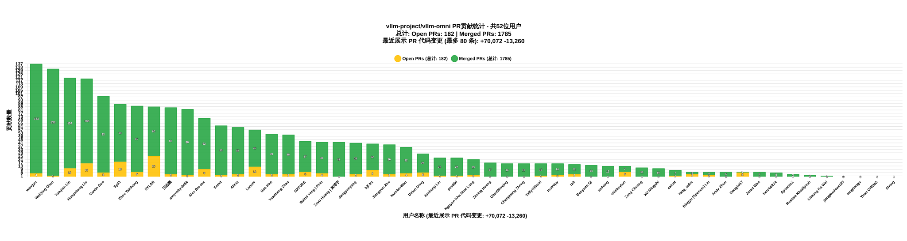

# GitHub PR & Issue 实时统计看板

这里展示了指定用户的最新 PR 和 Issue 列表。数据每天自动更新，也支持手动触发。

详细的多仓库报告见 [README_data.md](./README_data.md)，仓库结构和数据流见 [docs/REPOSITORY_STRUCTURE.md](./docs/REPOSITORY_STRUCTURE.md)。当前包含 vLLM-Omni，以及按投入场景统计的 afd-plugin、AgentInfer 和 vllm-gr；月度场景按北京时间输出本月与上月贡献度。

[vLLM-Omni 交互式看板](./stats_dashboard_vllm_omni.html)

## vllm-gr 月度贡献

[vllm-gr 交互式看板](./stats_dashboard_vllm_gr.html)

