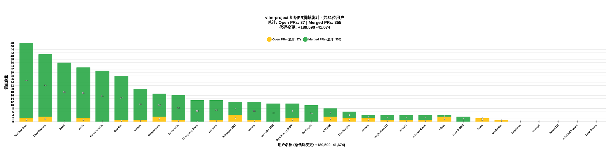

# Enhanced GitHub Stats Report - vllm-project Organization

Generated on: 2025-11-04 16:21:36 UTC

**统计范围**: vllm-project 组织的所有贡献（包含代码变更统计）

---

这是根据在 **vllm-project** 组织中的总贡献（Merged PRs + Open PRs + Issues）进行的排序。

总共追踪了 15 个用户在 vllm-project 组织中的贡献情况。

**总代码变更统计**: +23,866 行添加, -8,267 行删除

### 👤 WeiQing Chen (@david6666666) - 总贡献: 26
**代码变更**: +1,638 行添加, -336 行删除

**Pull Requests (1 open, 15 merged)**
| Title | Repository | State | Created | Additions | Deletions |
| ----- | ---------- | ----- | ------- | --------- | --------- |
| [[Docs] GSM8K Accuracy Evaluation doc update](https://github.com/vllm-project/vllm/pull/25360) | [vllm-project/vllm](https://github.com/vllm-project/vllm) | `merged` | 2025-09-22 | 1 | 1 |
| [[Performance][MM] Building the inverse permutation in O(n) time in Qwen2_5_VisionTransformer](https://github.com/vllm-project/vllm/pull/24443) | [vllm-project/vllm](https://github.com/vllm-project/vllm) | `merged` | 2025-09-08 | 11 | 1 |
| [[Feature][P/D]: Optimize NIXL Connector xfer Launch](https://github.com/vllm-project/vllm/pull/23887) | [vllm-project/vllm](https://github.com/vllm-project/vllm) | `merged` | 2025-08-29 | 18 | 13 |
| [[Model] Support DP for ViT on Kimi-VL-A3B-Thinking-2506](https://github.com/vllm-project/vllm/pull/23817) | [vllm-project/vllm](https://github.com/vllm-project/vllm) | `merged` | 2025-08-28 | 157 | 62 |
| [[Seed] Add Seed-OSS Guide](https://github.com/vllm-project/recipes/pull/41) | [vllm-project/recipes](https://github.com/vllm-project/recipes) | `merged` | 2025-08-26 | 199 | 1 |
| [[Model] Support DP for ViT on MiniCPM-V-4](https://github.com/vllm-project/vllm/pull/23327) | [vllm-project/vllm](https://github.com/vllm-project/vllm) | `merged` | 2025-08-21 | 105 | 30 |
| [[Model] Support dp on ViT on GLM-4.5V](https://github.com/vllm-project/vllm/pull/23168) | [vllm-project/vllm](https://github.com/vllm-project/vllm) | `merged` | 2025-08-19 | 145 | 59 |
| [[Multimodal][Speculative Decoding]Eagle Eagle3 mm support, enablement on qwen2.5vl](https://github.com/vllm-project/vllm/pull/22872) | [vllm-project/vllm](https://github.com/vllm-project/vllm) | `merged` | 2025-08-14 | 210 | 45 |
| [[EPLB] Optimize EPLB for Async Rearrange Experts ](https://github.com/vllm-project/vllm/pull/22179) | [vllm-project/vllm](https://github.com/vllm-project/vllm) | `open` | 2025-08-04 | 496 | 74 |
| [[Bugfix] EPLB load statistics problem](https://github.com/vllm-project/vllm/pull/22167) | [vllm-project/vllm](https://github.com/vllm-project/vllm) | `merged` | 2025-08-04 | 26 | 41 |
| [[Docs] Update features/disagg_prefill, add v1 examples and development](https://github.com/vllm-project/vllm/pull/22165) | [vllm-project/vllm](https://github.com/vllm-project/vllm) | `merged` | 2025-08-04 | 25 | 0 |
| [[Doc] Added warning of speculating with draft model](https://github.com/vllm-project/vllm/pull/22047) | [vllm-project/vllm](https://github.com/vllm-project/vllm) | `merged` | 2025-08-01 | 4 | 0 |
| [[Bugfix] Fix hermes tool parser handling of non-string argument types](https://github.com/vllm-project/vllm/pull/22002) | [vllm-project/vllm](https://github.com/vllm-project/vllm) | `merged` | 2025-07-31 | 166 | 7 |
| [[Docs] add offline serving multi-modal video input expamle Qwen2.5-VL](https://github.com/vllm-project/vllm/pull/21530) | [vllm-project/vllm](https://github.com/vllm-project/vllm) | `merged` | 2025-07-24 | 64 | 0 |
| [[Bugfix] Fix example disagg_example_p2p_nccl_xpyd.sh zombie process](https://github.com/vllm-project/vllm/pull/21437) | [vllm-project/vllm](https://github.com/vllm-project/vllm) | `merged` | 2025-07-23 | 1 | 0 |
| [[BugFix] Fix shared storage connector load kv only load attention layer](https://github.com/vllm-project/vllm/pull/21428) | [vllm-project/vllm](https://github.com/vllm-project/vllm) | `merged` | 2025-07-23 | 10 | 2 |
| **Total for WeiQing Chen** | | | | **1,638** | **336** |

**Issues (10 total)**
| Title | Repository | State | Created |
| ----- | ---------- | ----- | ------- |
| [[Bug]: 4xH800 Qwen/Qwen3-Next-80B-A3B-Instruct MTP, assert error, assert (m.num_reqs * (self.num_spec + 1) <= m.num_actual_tokens](https://github.com/vllm-project/vllm/issues/25647) | [vllm-project/vllm](https://github.com/vllm-project/vllm) | `closed` | 2025-09-25 |
| [[Bug]: 4xH800 Qwen/Qwen3-Next-80B-A3B-Instruct MTP, benchmark failed mixed_qkv_spec.view shape '[5, -1, 2048]' is invalid for input of size 104448](https://github.com/vllm-project/vllm/issues/24730) | [vllm-project/vllm](https://github.com/vllm-project/vllm) | `closed` | 2025-09-12 |
| [[Bug]: EPLB load statistics problem](https://github.com/vllm-project/vllm/issues/21883) | [vllm-project/vllm](https://github.com/vllm-project/vllm) | `closed` | 2025-07-30 |
| [[Feature]: Attention-FFN disaggregation](https://github.com/vllm-project/vllm/issues/21644) | [vllm-project/vllm](https://github.com/vllm-project/vllm) | `open` | 2025-07-26 |
| [[Bug]: After online_serving disagg_example_p2p_nccl_xpyd.sh cleanup, there is a zombie process](https://github.com/vllm-project/vllm/issues/21432) | [vllm-project/vllm](https://github.com/vllm-project/vllm) | `closed` | 2025-07-23 |
| [[RFC]: EPLB Execution Optimization From pr 18343](https://github.com/vllm-project/vllm/issues/20805) | [vllm-project/vllm](https://github.com/vllm-project/vllm) | `open` | 2025-07-11 |
| [[Bug]:DP Crash, After first request, process is crash, 'DPEngineCoreProc' object has no attribute 'dp_rank'](https://github.com/vllm-project/vllm-ascend/issues/1170) | [vllm-project/vllm-ascend](https://github.com/vllm-project/vllm-ascend) | `closed` | 2025-06-11 |
| [[Bug]: deepseek-v2-lite tp=8 ep=8 accuracy is not correct](https://github.com/vllm-project/vllm-ascend/issues/1077) | [vllm-project/vllm-ascend](https://github.com/vllm-project/vllm-ascend) | `closed` | 2025-06-05 |
| [[Bug]: tp4 DeepSeek-V2-Lite, accuracy is error，"text":"....................................................................................................."](https://github.com/vllm-project/vllm-ascend/issues/894) | [vllm-project/vllm-ascend](https://github.com/vllm-project/vllm-ascend) | `closed` | 2025-05-19 |
| [[Bug]: [dp4tp4ep16][DeepSeek-V2-Lite]RuntimeError: InnerRunOpApi:build/CMakeFiles/torch_npu.dir/compiler_depend.ts:281 OPS function error: HcclAllGather, error code is 6](https://github.com/vllm-project/vllm-ascend/issues/886) | [vllm-project/vllm-ascend](https://github.com/vllm-project/vllm-ascend) | `closed` | 2025-05-16 |

### 👤 wuhang (@wuhang2014) - 总贡献: 12
**代码变更**: +862 行添加, -391 行删除

**Pull Requests (4 open, 8 merged)**
| Title | Repository | State | Created | Additions | Deletions |
| ----- | ---------- | ----- | ------- | --------- | --------- |
| [[gpt-oss]Support lazy init mcp session](https://github.com/vllm-project/vllm/pull/24388) | [vllm-project/vllm](https://github.com/vllm-project/vllm) | `open` | 2025-09-07 | 99 | 62 |
| [[CI][gpt-oss] Enable python tool tests in CI](https://github.com/vllm-project/vllm/pull/24315) | [vllm-project/vllm](https://github.com/vllm-project/vllm) | `merged` | 2025-09-05 | 24 | 26 |
| [[Benchmarks]Accelerate random dataset generation](https://github.com/vllm-project/vllm/pull/24225) | [vllm-project/vllm](https://github.com/vllm-project/vllm) | `open` | 2025-09-04 | 86 | 11 |
| [[Doc][gpt-oss]Responses API supports streaming with built-in tools with MCP](https://github.com/vllm-project/recipes/pull/48) | [vllm-project/recipes](https://github.com/vllm-project/recipes) | `merged` | 2025-09-04 | 1 | 1 |
| [[Spec Decoding]Support Spec Decoding Metrics in DP Mode](https://github.com/vllm-project/vllm/pull/24049) | [vllm-project/vllm](https://github.com/vllm-project/vllm) | `merged` | 2025-09-01 | 54 | 38 |
| [[Doc][GPT-OSS]Background mode for built-in mcp tools](https://github.com/vllm-project/recipes/pull/45) | [vllm-project/recipes](https://github.com/vllm-project/recipes) | `merged` | 2025-08-30 | 1 | 1 |
| [[Feature][Responses API]Support MCP tools with streaming mode + background mode](https://github.com/vllm-project/vllm/pull/23927) | [vllm-project/vllm](https://github.com/vllm-project/vllm) | `merged` | 2025-08-29 | 138 | 26 |
| [[Feature][Responses API] Support MCP tool in background mode](https://github.com/vllm-project/vllm/pull/23494) | [vllm-project/vllm](https://github.com/vllm-project/vllm) | `merged` | 2025-08-24 | 164 | 136 |
| [[Bugfix]Enable zmq router handover to handle scaling-up after scaling-down in EEP](https://github.com/vllm-project/vllm/pull/23247) | [vllm-project/vllm](https://github.com/vllm-project/vllm) | `open` | 2025-08-20 | 3 | 0 |
| [[Bugfix]Fix EEP scale-up functionality](https://github.com/vllm-project/vllm/pull/22953) | [vllm-project/vllm](https://github.com/vllm-project/vllm) | `open` | 2025-08-15 | 133 | 7 |
| [[Bugfix] Add log prefix in non-dp mode engine core](https://github.com/vllm-project/vllm/pull/21889) | [vllm-project/vllm](https://github.com/vllm-project/vllm) | `merged` | 2025-07-30 | 75 | 81 |
| [[Bugfix]check health for engine core process exiting unexpectedly](https://github.com/vllm-project/vllm/pull/21728) | [vllm-project/vllm](https://github.com/vllm-project/vllm) | `merged` | 2025-07-28 | 84 | 2 |
| **Total for wuhang** | | | | **862** | **391** |

**Issues (0 total)**
_No public issues found._

### 👤 Hongsheng Liu (@hsliuustc0106) - 总贡献: 6
**代码变更**: +173 行添加, -57 行删除

**Pull Requests (2 open, 4 merged)**
| Title | Repository | State | Created | Additions | Deletions |
| ----- | ---------- | ----- | ------- | --------- | --------- |
| [[WIP][performance] DP for ViT in Intern S1 model](https://github.com/vllm-project/vllm/pull/24936) | [vllm-project/vllm](https://github.com/vllm-project/vllm) | `open` | 2025-09-16 | 86 | 22 |
| [[Multi-modality][performance] enable DP for ViT in Qwen-2.5-VL](https://github.com/vllm-project/vllm-ascend/pull/2709) | [vllm-project/vllm-ascend](https://github.com/vllm-project/vllm-ascend) | `open` | 2025-09-02 | 47 | 13 |
| [[Doc] Fix a syntax error of example code in structured_outputs.md](https://github.com/vllm-project/vllm/pull/22045) | [vllm-project/vllm](https://github.com/vllm-project/vllm) | `merged` | 2025-08-01 | 1 | 1 |
| [[Docs] Fix the example code of streaming chat completions in reasoning](https://github.com/vllm-project/vllm/pull/21825) | [vllm-project/vllm](https://github.com/vllm-project/vllm) | `merged` | 2025-07-29 | 12 | 14 |
| [[Doc] Added unmentioned required option "method" in the usage of EAGLE-3 based models](https://github.com/vllm-project/vllm/pull/21737) | [vllm-project/vllm](https://github.com/vllm-project/vllm) | `merged` | 2025-07-28 | 4 | 0 |
| [[Bugfix] [issue-21565] Fix the incompatibility issue with stream and named function calling when Thinking is disabled](https://github.com/vllm-project/vllm/pull/21573) | [vllm-project/vllm](https://github.com/vllm-project/vllm) | `merged` | 2025-07-25 | 23 | 7 |
| **Total for Hongsheng Liu** | | | | **173** | **57** |

**Issues (0 total)**
_No public issues found._

### 👤 Chenguang Zheng (@fake0fan) - 总贡献: 5
**代码变更**: +5,224 行添加, -224 行删除

**Pull Requests (1 open, 3 merged)**
| Title | Repository | State | Created | Additions | Deletions |
| ----- | ---------- | ----- | ------- | --------- | --------- |
| [[bugfix] Missing cached item in beam search](https://github.com/vllm-project/vllm/pull/27874) | [vllm-project/vllm](https://github.com/vllm-project/vllm) | `merged` | 2025-10-31 | 10 | 18 |
| [[Core] Encoder separation for Encode-Prefill-Decode Disaggregation](https://github.com/vllm-project/vllm/pull/25233) | [vllm-project/vllm](https://github.com/vllm-project/vllm) | `open` | 2025-09-19 | 4,604 | 39 |
| [[Core][Multimodal] Track encode cache entries by mm_hash and enable embedding sharing between requests](https://github.com/vllm-project/vllm/pull/22711) | [vllm-project/vllm](https://github.com/vllm-project/vllm) | `merged` | 2025-08-12 | 366 | 155 |
| [[Bugfix] SharedStorage Connector for V1 PD multimodal](https://github.com/vllm-project/vllm/pull/21611) | [vllm-project/vllm](https://github.com/vllm-project/vllm) | `merged` | 2025-07-25 | 244 | 12 |
| **Total for Chenguang Zheng** | | | | **5,224** | **224** |

**Issues (1 total)**
| Title | Repository | State | Created |
| ----- | ---------- | ----- | ------- |
| [[RFC]: Prototype Separating Vision Encoder to Its Own Worker](https://github.com/vllm-project/vllm/issues/20799) | [vllm-project/vllm](https://github.com/vllm-project/vllm) | `open` | 2025-07-11 |

### 👤 Junhong Liu (@LJH-LBJ) - 总贡献: 5
**代码变更**: +197 行添加, -6 行删除

**Pull Requests (1 open, 1 merged)**
| Title | Repository | State | Created | Additions | Deletions |
| ----- | ---------- | ----- | ------- | --------- | --------- |
| [Speed up mm processor kwargs per request by spliting dynamic and static kwargs](https://github.com/vllm-project/vllm/pull/26483) | [vllm-project/vllm](https://github.com/vllm-project/vllm) | `open` | 2025-10-09 | 196 | 3 |
| [Remove Redundant Assignment in Qwen3_VisionPatchMerger](https://github.com/vllm-project/vllm/pull/25224) | [vllm-project/vllm](https://github.com/vllm-project/vllm) | `merged` | 2025-09-19 | 1 | 3 |
| **Total for Junhong Liu** | | | | **197** | **6** |

**Issues (3 total)**
| Title | Repository | State | Created |
| ----- | ---------- | ----- | ------- |
| [[Feature]: Add ViT memory/latency metrics, LLM prefill/decode latency, and TTFT tracing with environment switches](https://github.com/vllm-project/vllm/issues/25377) | [vllm-project/vllm](https://github.com/vllm-project/vllm) | `closed` | 2025-09-22 |
| [[Usage]: How to run a benchmark with dataset FreedomIntelligence/ALLaVA-4V?](https://github.com/vllm-project/vllm/issues/23102) | [vllm-project/vllm](https://github.com/vllm-project/vllm) | `open` | 2025-08-18 |
| [[Bug]: AttributeError when I use speculative decoding beacuse of engine not available](https://github.com/vllm-project/vllm/issues/22645) | [vllm-project/vllm](https://github.com/vllm-project/vllm) | `closed` | 2025-08-11 |

### 👤 Yeju Zhou (@zhouyeju) - 总贡献: 4
**代码变更**: +2,730 行添加, -4 行删除

**Pull Requests (2 open, 1 merged)**
| Title | Repository | State | Created | Additions | Deletions |
| ----- | ---------- | ----- | ------- | --------- | --------- |
| [[Bugfix][Apple Silicon] fix missing symbols when build from source on Mac with Apple Silicon](https://github.com/vllm-project/vllm/pull/21380) | [vllm-project/vllm](https://github.com/vllm-project/vllm) | `merged` | 2025-07-22 | 1 | 1 |
| [dLLM, short for distributed LLM, an easy-to-use tool for multi-node vllm deployment](https://github.com/vllm-project/vllm-ascend/pull/1280) | [vllm-project/vllm-ascend](https://github.com/vllm-project/vllm-ascend) | `open` | 2025-06-18 | 1,624 | 0 |
| [[KVConnector][1/N] v1 kvcache connector with the Chariot-DS backend](https://github.com/vllm-project/vllm-ascend/pull/1080) | [vllm-project/vllm-ascend](https://github.com/vllm-project/vllm-ascend) | `open` | 2025-06-05 | 1,105 | 3 |
| **Total for Yeju Zhou** | | | | **2,730** | **4** |

**Issues (1 total)**
| Title | Repository | State | Created |
| ----- | ---------- | ----- | ------- |
| [[RFC]: A developer friendly tool for multi-instance deployment with Ray](https://github.com/vllm-project/vllm/issues/20476) | [vllm-project/vllm](https://github.com/vllm-project/vllm) | `open` | 2025-07-04 |

### 👤 knlnguyen1802 - 总贡献: 3
**代码变更**: +0 行添加, -0 行删除

**Pull Requests (0 open, 0 merged)**
_No relevant pull requests found._

**Issues (3 total)**
| Title | Repository | State | Created |
| ----- | ---------- | ----- | ------- |
| [[Performance]: Long-Video Inference for Multimodal LLM](https://github.com/vllm-project/vllm/issues/22695) | [vllm-project/vllm](https://github.com/vllm-project/vllm) | `open` | 2025-08-12 |
| [[Feature]:  Multimodal Benchmarking Support (MMLM)](https://github.com/vllm-project/vllm/issues/21887) | [vllm-project/vllm](https://github.com/vllm-project/vllm) | `open` | 2025-07-30 |
| [[RFC]: Reuse multimodal embeddings from encoder cache](https://github.com/vllm-project/vllm/issues/21113) | [vllm-project/vllm](https://github.com/vllm-project/vllm) | `closed` | 2025-07-17 |

### 👤 Jinheng (@ahengljh) - 总贡献: 3
**代码变更**: +9,317 行添加, -7,168 行删除

**Pull Requests (1 open, 2 merged)**
| Title | Repository | State | Created | Additions | Deletions |
| ----- | ---------- | ----- | ------- | --------- | --------- |
| [Add deprecation warning for lora_extra_vocab_size](https://github.com/vllm-project/vllm/pull/23635) | [vllm-project/vllm](https://github.com/vllm-project/vllm) | `merged` | 2025-08-26 | 8 | 2 |
| [[Core] Remove lora additional vocabulary](https://github.com/vllm-project/vllm/pull/23540) | [vllm-project/vllm](https://github.com/vllm-project/vllm) | `open` | 2025-08-25 | 9,119 | 7,160 |
| [feat(multimodal): Add customizable background color for RGBA to RGB conversion](https://github.com/vllm-project/vllm/pull/22052) | [vllm-project/vllm](https://github.com/vllm-project/vllm) | `merged` | 2025-08-01 | 190 | 6 |
| **Total for Jinheng** | | | | **9,317** | **7,168** |

**Issues (0 total)**
_No public issues found._

### 👤 chickeyton - 总贡献: 3
**代码变更**: +375 行添加, -60 行删除

**Pull Requests (1 open, 0 merged)**
| Title | Repository | State | Created | Additions | Deletions |
| ----- | ---------- | ----- | ------- | --------- | --------- |
| [[Feat][Router] Add TTFT Routing](https://github.com/vllm-project/production-stack/pull/670) | [vllm-project/production-stack](https://github.com/vllm-project/production-stack) | `open` | 2025-09-01 | 375 | 60 |
| **Total for chickeyton** | | | | **375** | **60** |

**Issues (2 total)**
| Title | Repository | State | Created |
| ----- | ---------- | ----- | ------- |
| [feature: TTFT Routing](https://github.com/vllm-project/production-stack/issues/583) | [vllm-project/production-stack](https://github.com/vllm-project/production-stack) | `open` | 2025-07-15 |
| [[RFC][FEATURE]: TTFT Routing](https://github.com/vllm-project/vllm/issues/20962) | [vllm-project/vllm](https://github.com/vllm-project/vllm) | `open` | 2025-07-15 |

### 👤 Samit (@SamitHuang) - 总贡献: 3
**代码变更**: +448 行添加, -2 行删除

**Pull Requests (1 open, 2 merged)**
| Title | Repository | State | Created | Additions | Deletions |
| ----- | ---------- | ----- | ------- | --------- | --------- |
| [[RL] Add Pause and Resume Generation for Asynchronous RL Training](https://github.com/vllm-project/vllm/pull/28037) | [vllm-project/vllm](https://github.com/vllm-project/vllm) | `open` | 2025-11-04 | 212 | 0 |
| [[Model] Switch to Fused RMSNorm in GLM-4.1V model](https://github.com/vllm-project/vllm/pull/24733) | [vllm-project/vllm](https://github.com/vllm-project/vllm) | `merged` | 2025-09-12 | 3 | 2 |
| [Add Qwen2.5VL Guide](https://github.com/vllm-project/recipes/pull/30) | [vllm-project/recipes](https://github.com/vllm-project/recipes) | `merged` | 2025-08-19 | 233 | 0 |
| **Total for Samit** | | | | **448** | **2** |

**Issues (0 total)**
_No public issues found._

### 👤 NATURE (@natureofnature) - 总贡献: 2
**代码变更**: +1,242 行添加, -3 行删除

**Pull Requests (1 open, 0 merged)**
| Title | Repository | State | Created | Additions | Deletions |
| ----- | ---------- | ----- | ------- | --------- | --------- |
| [[Feature] DCCP supported](https://github.com/vllm-project/vllm/pull/23545) | [vllm-project/vllm](https://github.com/vllm-project/vllm) | `open` | 2025-08-25 | 1,242 | 3 |
| **Total for NATURE** | | | | **1,242** | **3** |

**Issues (1 total)**
| Title | Repository | State | Created |
| ----- | ---------- | ----- | ------- |
| [[Feature]: Dynamic Chunked Pipeline Parallelism](https://github.com/vllm-project/vllm/issues/20808) | [vllm-project/vllm](https://github.com/vllm-project/vllm) | `closed` | 2025-07-11 |

### 👤 GZQ (@Gongzq5) - 总贡献: 1
**代码变更**: +1,620 行添加, -0 行删除

**Pull Requests (1 open, 0 merged)**
| Title | Repository | State | Created | Additions | Deletions |
| ----- | ---------- | ----- | ------- | --------- | --------- |
| [A developer friendly tool for multi-instance deployment with Ray Implementation](https://github.com/vllm-project/vllm/pull/20761) | [vllm-project/vllm](https://github.com/vllm-project/vllm) | `open` | 2025-07-10 | 1,620 | 0 |
| **Total for GZQ** | | | | **1,620** | **0** |

**Issues (0 total)**
_No public issues found._

### 👤 R2-Y - 总贡献: 1
**代码变更**: +0 行添加, -0 行删除

**Pull Requests (0 open, 0 merged)**
_No relevant pull requests found._

**Issues (1 total)**
| Title | Repository | State | Created |
| ----- | ---------- | ----- | ------- |
| [[Bug]: PP+PD NixlConnector failed](https://github.com/vllm-project/vllm/issues/22430) | [vllm-project/vllm](https://github.com/vllm-project/vllm) | `open` | 2025-08-07 |

### 👤 Syed Muhammad Bin Asif (@syedmba) - 总贡献: 1
**代码变更**: +40 行添加, -16 行删除

**Pull Requests (0 open, 1 merged)**
| Title | Repository | State | Created | Additions | Deletions |
| ----- | ---------- | ----- | ------- | --------- | --------- |
| [[Bugfix] Add proper comparison for package versions](https://github.com/vllm-project/vllm/pull/22314) | [vllm-project/vllm](https://github.com/vllm-project/vllm) | `merged` | 2025-08-06 | 40 | 16 |
| **Total for Syed Muhammad Bin Asif** | | | | **40** | **16** |

**Issues (0 total)**
_No public issues found._

### 👤 Gao Han (@Gaohan123) - 总贡献: 1
**代码变更**: +0 行添加, -0 行删除

**Pull Requests (0 open, 0 merged)**
_No relevant pull requests found._

**Issues (1 total)**
| Title | Repository | State | Created |
| ----- | ---------- | ----- | ------- |
| [[RFC]: Add Multimodal Model Recipes (Qwen2.5-VL, Qwen2.5-Omni, InternVL, etc)](https://github.com/vllm-project/recipes/issues/10) | [vllm-project/recipes](https://github.com/vllm-project/recipes) | `open` | 2025-08-01 |

