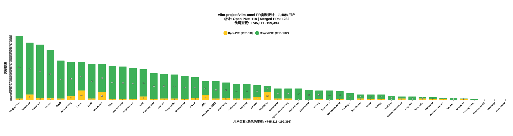

# Enhanced GitHub Stats Report - vllm-project Organization

Generated on: 2026-04-08 01:55:43 UTC

**统计范围**: vllm-project 组织的所有 PR 贡献（包含代码变更统计）

---

这是根据在 **vllm-project** 组织中的 PR 贡献（Merged PRs + Open PRs）进行的排序。

总共追踪了 31 个用户在 vllm-project 组织中的贡献情况。

**总代码变更统计**: +244,074 行添加, -62,105 行删除

### 👤 WeiQing Chen (@david6666666) - 总贡献: 71
**代码变更**: +20,683 行添加, -906 行删除

**Pull Requests (3 open, 68 merged)**
| Title | Repository | State | Created | Merged | Additions | Deletions |
| ----- | ---------- | ----- | ------- | ------ | --------- | --------- |
| [[Feature] feat: add video frame interpolation postprocess](https://github.com/vllm-project/vllm-omni/pull/2555) | [vllm-project/vllm-omni](https://github.com/vllm-project/vllm-omni) | `open` | 2026-04-07 | - | 735 | 4 |
| [[cherry-pick][Feature] Support vae tiling parallel encode (#2368)](https://github.com/vllm-project/vllm-omni/pull/2538) | [vllm-project/vllm-omni](https://github.com/vllm-project/vllm-omni) | `merged` | 2026-04-07 | 2026-04-07 03:16:44 UTC | 614 | 35 |
| [[cherry-pick][Perf] Skip Wan2.2 cross attn Ulysses SP (#2459)](https://github.com/vllm-project/vllm-omni/pull/2537) | [vllm-project/vllm-omni](https://github.com/vllm-project/vllm-omni) | `merged` | 2026-04-07 | 2026-04-07 02:57:03 UTC | 5 | 0 |
| [[cherry-pick][Perf] Optimize Wan2.2 rotary embedding (#2393)](https://github.com/vllm-project/vllm-omni/pull/2536) | [vllm-project/vllm-omni](https://github.com/vllm-project/vllm-omni) | `merged` | 2026-04-07 | 2026-04-07 02:56:51 UTC | 8 | 4 |
| [[Docs] Update WeChat QR code for community support](https://github.com/vllm-project/vllm-omni/pull/2481) | [vllm-project/vllm-omni](https://github.com/vllm-project/vllm-omni) | `merged` | 2026-04-04 | 2026-04-04 16:21:20 UTC | 0 | 0 |
| [[Docs] Update WeChat QR code for community support](https://github.com/vllm-project/vllm-omni/pull/2402) | [vllm-project/vllm-omni](https://github.com/vllm-project/vllm-omni) | `merged` | 2026-04-01 | 2026-04-01 04:19:47 UTC | 0 | 0 |
| [[cherry-pick][release/v0.18.0post1] fix: return 400 for unsupported multi-image edits such as Qw…](https://github.com/vllm-project/vllm-omni/pull/2352) | [vllm-project/vllm-omni](https://github.com/vllm-project/vllm-omni) | `merged` | 2026-03-31 | 2026-03-31 03:19:23 UTC | 91 | 0 |
| [[CI] fix test: use minimum supported layered output count](https://github.com/vllm-project/vllm-omni/pull/2350) | [vllm-project/vllm-omni](https://github.com/vllm-project/vllm-omni) | `merged` | 2026-03-31 | 2026-03-31 06:59:00 UTC | 3 | 3 |
| [[cherry-pick] [release/v0.18.0post1] fix: validate layered image layers range (#2334)](https://github.com/vllm-project/vllm-omni/pull/2349) | [vllm-project/vllm-omni](https://github.com/vllm-project/vllm-omni) | `merged` | 2026-03-31 | 2026-03-31 03:18:42 UTC | 56 | 11 |
| [[Bugfix] fix: validate layered image layers range](https://github.com/vllm-project/vllm-omni/pull/2334) | [vllm-project/vllm-omni](https://github.com/vllm-project/vllm-omni) | `merged` | 2026-03-30 | 2026-03-30 13:27:09 UTC | 56 | 11 |
| [[cherry-pick] [release/v0.18.0.post1]fix: handle Qwen-Image-Layered layered RGBA output for jpeg …](https://github.com/vllm-project/vllm-omni/pull/2329) | [vllm-project/vllm-omni](https://github.com/vllm-project/vllm-omni) | `merged` | 2026-03-30 | 2026-03-30 12:41:03 UTC | 65 | 3 |
| [[Bugfix] fix: return 400 for unsupported multi-image edits such as Qwen-Image-Layered](https://github.com/vllm-project/vllm-omni/pull/2298) | [vllm-project/vllm-omni](https://github.com/vllm-project/vllm-omni) | `merged` | 2026-03-28 | 2026-03-30 12:24:57 UTC | 91 | 0 |
| [[Bugfix] fix: handle Qwen-Image-Layered layered RGBA output for jpeg edits](https://github.com/vllm-project/vllm-omni/pull/2297) | [vllm-project/vllm-omni](https://github.com/vllm-project/vllm-omni) | `merged` | 2026-03-28 | 2026-03-29 11:33:38 UTC | 65 | 3 |
| [[CI]test: add wan22 i2v video similarity e2e](https://github.com/vllm-project/vllm-omni/pull/2262) | [vllm-project/vllm-omni](https://github.com/vllm-project/vllm-omni) | `merged` | 2026-03-27 | 2026-03-31 08:15:48 UTC | 927 | 0 |
| [[CI] fix Wan22 timeout and i2i accuracy threshold](https://github.com/vllm-project/vllm-omni/pull/2235) | [vllm-project/vllm-omni](https://github.com/vllm-project/vllm-omni) | `merged` | 2026-03-26 | 2026-03-26 14:03:03 UTC | 7 | 7 |
| [[Accuracy Benchmark]Add VBench video accuracy benchmarks t2v and i2v](https://github.com/vllm-project/vllm-omni/pull/2209) | [vllm-project/vllm-omni](https://github.com/vllm-project/vllm-omni) | `open` | 2026-03-26 | - | 1,649 | 0 |
| [[Docs] Update WeChat QR code for community support](https://github.com/vllm-project/vllm-omni/pull/2165) | [vllm-project/vllm-omni](https://github.com/vllm-project/vllm-omni) | `merged` | 2026-03-25 | 2026-03-25 04:32:14 UTC | 0 | 0 |
| [[skip ci][Docs] Update WeChat QR code (fix filename case)](https://github.com/vllm-project/vllm-omni/pull/1976) | [vllm-project/vllm-omni](https://github.com/vllm-project/vllm-omni) | `merged` | 2026-03-18 | 2026-03-18 07:17:27 UTC | 0 | 0 |
| [[Docs] Update WeChat QR code for community support](https://github.com/vllm-project/vllm-omni/pull/1974) | [vllm-project/vllm-omni](https://github.com/vllm-project/vllm-omni) | `merged` | 2026-03-18 | 2026-03-18 05:55:51 UTC | 0 | 0 |
| [[Accuracy Benchmark] feat: add accuracy benchmark integrations for t2i and i2i](https://github.com/vllm-project/vllm-omni/pull/1917) | [vllm-project/vllm-omni](https://github.com/vllm-project/vllm-omni) | `merged` | 2026-03-16 | 2026-03-26 09:27:29 UTC | 3,370 | 7 |
| [[Bugfix] fix gguf TypeError: GGUFConfig.get_name() missing 1 required positional argument: 'self', test: add diffusion gguf unit coverage](https://github.com/vllm-project/vllm-omni/pull/1865) | [vllm-project/vllm-omni](https://github.com/vllm-project/vllm-omni) | `merged` | 2026-03-13 | 2026-03-23 06:56:15 UTC | 607 | 1 |
| [[skip ci] [Docs] Update WeChat QR code for community support](https://github.com/vllm-project/vllm-omni/pull/1802) | [vllm-project/vllm-omni](https://github.com/vllm-project/vllm-omni) | `merged` | 2026-03-11 | 2026-03-11 04:19:02 UTC | 0 | 0 |
| [[Quantization] feat: add wan2.2 multi-source gguf support](https://github.com/vllm-project/vllm-omni/pull/1756) | [vllm-project/vllm-omni](https://github.com/vllm-project/vllm-omni) | `open` | 2026-03-09 | - | 372 | 16 |
| [[Quantization] feat: add qwen-image gguf adapter](https://github.com/vllm-project/vllm-omni/pull/1755) | [vllm-project/vllm-omni](https://github.com/vllm-project/vllm-omni) | `merged` | 2026-03-09 | 2026-03-23 13:24:55 UTC | 345 | 13 |
| [[Misc] update wechat](https://github.com/vllm-project/vllm-omni/pull/1649) | [vllm-project/vllm-omni](https://github.com/vllm-project/vllm-omni) | `merged` | 2026-03-04 | 2026-03-04 07:34:00 UTC | 0 | 0 |
| [[Bugfix] fix offline text_to_image error from #1009](https://github.com/vllm-project/vllm-omni/pull/1515) | [vllm-project/vllm-omni](https://github.com/vllm-project/vllm-omni) | `merged` | 2026-02-26 | 2026-02-26 12:27:36 UTC | 0 | 11 |
| [[Misc] update wechat image](https://github.com/vllm-project/vllm-omni/pull/1464) | [vllm-project/vllm-omni](https://github.com/vllm-project/vllm-omni) | `merged` | 2026-02-25 | 2026-02-25 04:06:27 UTC | 0 | 0 |
| [[Misc] wechat image update](https://github.com/vllm-project/vllm-omni/pull/1354) | [vllm-project/vllm-omni](https://github.com/vllm-project/vllm-omni) | `merged` | 2026-02-12 | 2026-02-12 10:46:56 UTC | 0 | 0 |
| [[Feature]: Native GGUF Quantization Support for DiT](https://github.com/vllm-project/vllm-omni/pull/1285) | [vllm-project/vllm-omni](https://github.com/vllm-project/vllm-omni) | `merged` | 2026-02-09 | 2026-02-27 03:39:14 UTC | 1,104 | 67 |
| [[Bugfix] Fix tp+sp accuracy, incorrect process group mapping](https://github.com/vllm-project/vllm-omni/pull/1178) | [vllm-project/vllm-omni](https://github.com/vllm-project/vllm-omni) | `merged` | 2026-02-03 | 2026-02-04 08:54:48 UTC | 204 | 35 |
| [[Doc] opt doc](https://github.com/vllm-project/vllm-omni/pull/1118) | [vllm-project/vllm-omni](https://github.com/vllm-project/vllm-omni) | `merged` | 2026-01-31 | 2026-02-04 07:40:30 UTC | 8 | 7 |
| [[Misc] update wechat image](https://github.com/vllm-project/vllm-omni/pull/1096) | [vllm-project/vllm-omni](https://github.com/vllm-project/vllm-omni) | `merged` | 2026-01-30 | 2026-01-30 09:06:02 UTC | 0 | 0 |
| [[examples] add --enable-cpu-offload args](https://github.com/vllm-project/vllm-omni/pull/930) | [vllm-project/vllm-omni](https://github.com/vllm-project/vllm-omni) | `merged` | 2026-01-23 | 2026-01-23 14:43:01 UTC | 28 | 0 |
| [[Misc] update wechat image](https://github.com/vllm-project/vllm-omni/pull/914) | [vllm-project/vllm-omni](https://github.com/vllm-project/vllm-omni) | `merged` | 2026-01-23 | 2026-01-23 04:14:48 UTC | 0 | 0 |
| [[Model] support LTX-2 text-to-video image-to-video](https://github.com/vllm-project/vllm-omni/pull/841) | [vllm-project/vllm-omni](https://github.com/vllm-project/vllm-omni) | `merged` | 2026-01-19 | 2026-03-05 15:31:48 UTC | 4,595 | 99 |
| [[Model] add flux2 klein](https://github.com/vllm-project/vllm-omni/pull/809) | [vllm-project/vllm-omni](https://github.com/vllm-project/vllm-omni) | `merged` | 2026-01-16 | 2026-01-16 08:32:28 UTC | 1,710 | 0 |
| [[Misc] add wechat group and star history on README](https://github.com/vllm-project/vllm-omni/pull/801) | [vllm-project/vllm-omni](https://github.com/vllm-project/vllm-omni) | `merged` | 2026-01-15 | 2026-01-15 14:22:16 UTC | 5 | 1 |
| [[Doc] fix quickstart](https://github.com/vllm-project/vllm-omni/pull/620) | [vllm-project/vllm-omni](https://github.com/vllm-project/vllm-omni) | `merged` | 2026-01-05 | 2026-01-05 02:19:01 UTC | 1 | 1 |
| [[Misc] fix ring att log](https://github.com/vllm-project/vllm-omni/pull/610) | [vllm-project/vllm-omni](https://github.com/vllm-project/vllm-omni) | `merged` | 2026-01-04 | 2026-01-04 11:56:50 UTC | 2 | 2 |
| [[Doc] fix i2i online serving doc](https://github.com/vllm-project/vllm-omni/pull/608) | [vllm-project/vllm-omni](https://github.com/vllm-project/vllm-omni) | `merged` | 2026-01-04 | 2026-01-04 12:45:28 UTC | 42 | 36 |
| [[Doc] fix quickstart](https://github.com/vllm-project/vllm-omni/pull/548) | [vllm-project/vllm-omni](https://github.com/vllm-project/vllm-omni) | `merged` | 2025-12-30 | 2025-12-31 01:46:44 UTC | 6 | 3 |
| [[Misc] Add Qwen-Image-2512](https://github.com/vllm-project/vllm-omni/pull/547) | [vllm-project/vllm-omni](https://github.com/vllm-project/vllm-omni) | `merged` | 2025-12-30 | 2025-12-31 07:03:24 UTC | 5 | 3 |
| [[Bugfix] t2i online fix cache configuration failure and errors in `/v1/images/generation` endpoint.](https://github.com/vllm-project/vllm-omni/pull/499) | [vllm-project/vllm-omni](https://github.com/vllm-project/vllm-omni) | `merged` | 2025-12-27 | 2025-12-30 08:50:30 UTC | 296 | 50 |
| [[Doc] update diffusion_acceleration.md & FAQ memory troubleshooting](https://github.com/vllm-project/vllm-omni/pull/406) | [vllm-project/vllm-omni](https://github.com/vllm-project/vllm-omni) | `merged` | 2025-12-22 | 2025-12-23 07:09:25 UTC | 68 | 12 |
| [[Entrypoints] Support Qwen-Image-Edit 2509 online serving & update doc](https://github.com/vllm-project/vllm-omni/pull/368) | [vllm-project/vllm-omni](https://github.com/vllm-project/vllm-omni) | `merged` | 2025-12-18 | 2025-12-19 08:50:32 UTC | 382 | 37 |
| [[Entrypoints] online serving support usp args](https://github.com/vllm-project/vllm-omni/pull/366) | [vllm-project/vllm-omni](https://github.com/vllm-project/vllm-omni) | `merged` | 2025-12-18 | 2025-12-19 03:59:07 UTC | 32 | 2 |
| [[Benchmark] DiT models Performance benchmark(T2I/I2I/T2V/TI2V)](https://github.com/vllm-project/vllm-omni/pull/362) | [vllm-project/vllm-omni](https://github.com/vllm-project/vllm-omni) | `merged` | 2025-12-18 | 2025-12-25 15:50:47 UTC | 663 | 0 |
| [[Doc] fix offline inference and online serving describe](https://github.com/vllm-project/vllm-omni/pull/285) | [vllm-project/vllm-omni](https://github.com/vllm-project/vllm-omni) | `merged` | 2025-12-11 | 2025-12-12 07:14:53 UTC | 24 | 33 |
| [[Doc] update offline inference doc and offline_inference examples](https://github.com/vllm-project/vllm-omni/pull/274) | [vllm-project/vllm-omni](https://github.com/vllm-project/vllm-omni) | `merged` | 2025-12-11 | 2025-12-11 12:06:18 UTC | 148 | 11 |
| [[Misc] fix stage config describe and yaml format](https://github.com/vllm-project/vllm-omni/pull/265) | [vllm-project/vllm-omni](https://github.com/vllm-project/vllm-omni) | `merged` | 2025-12-10 | 2025-12-11 00:34:52 UTC | 17 | 17 |
| [[Bugfix] fix issue251, qwen3 omni does not support chunked prefill now](https://github.com/vllm-project/vllm-omni/pull/256) | [vllm-project/vllm-omni](https://github.com/vllm-project/vllm-omni) | `merged` | 2025-12-09 | 2025-12-09 12:27:38 UTC | 2 | 0 |
| [[Bugfix]multi-GPU tp scenarios, devices: "0,1" uses physical IDs instead of logical IDs](https://github.com/vllm-project/vllm-omni/pull/253) | [vllm-project/vllm-omni](https://github.com/vllm-project/vllm-omni) | `merged` | 2025-12-09 | 2025-12-09 13:04:30 UTC | 86 | 6 |
| [[Bugfix] Qwen2.5-omni Qwen3-omni online gradio.py example fix](https://github.com/vllm-project/vllm-omni/pull/249) | [vllm-project/vllm-omni](https://github.com/vllm-project/vllm-omni) | `merged` | 2025-12-09 | 2025-12-09 09:38:12 UTC | 102 | 10 |
| [[CI] Add Async Eplb nightly CI tests](https://github.com/vllm-project/vllm/pull/29385) | [vllm-project/vllm](https://github.com/vllm-project/vllm) | `merged` | 2025-11-25 | 2025-12-03 09:51:08 UTC | 167 | 4 |
| [[Misc] remove useless v1 env](https://github.com/vllm-project/vllm/pull/29164) | [vllm-project/vllm](https://github.com/vllm-project/vllm) | `merged` | 2025-11-21 | 2025-11-21 09:41:20 UTC | 0 | 2 |
| [[Docs] GSM8K Accuracy Evaluation doc update](https://github.com/vllm-project/vllm/pull/25360) | [vllm-project/vllm](https://github.com/vllm-project/vllm) | `merged` | 2025-09-22 | 2025-09-22 02:49:13 UTC | 1 | 1 |
| [[Performance][MM] Building the inverse permutation in O(n) time in Qwen2_5_VisionTransformer](https://github.com/vllm-project/vllm/pull/24443) | [vllm-project/vllm](https://github.com/vllm-project/vllm) | `merged` | 2025-09-08 | 2025-09-09 07:24:11 UTC | 11 | 1 |
| [[Feature][P/D]: Optimize NIXL Connector xfer Launch](https://github.com/vllm-project/vllm/pull/23887) | [vllm-project/vllm](https://github.com/vllm-project/vllm) | `merged` | 2025-08-29 | 2025-09-03 19:14:30 UTC | 18 | 13 |
| [[Model] Support DP for ViT on Kimi-VL-A3B-Thinking-2506](https://github.com/vllm-project/vllm/pull/23817) | [vllm-project/vllm](https://github.com/vllm-project/vllm) | `merged` | 2025-08-28 | 2025-09-01 16:56:57 UTC | 157 | 62 |
| [[Seed] Add Seed-OSS Guide](https://github.com/vllm-project/recipes/pull/41) | [vllm-project/recipes](https://github.com/vllm-project/recipes) | `merged` | 2025-08-26 | 2025-08-28 08:14:21 UTC | 199 | 1 |
| [[Model] Support DP for ViT on MiniCPM-V-4](https://github.com/vllm-project/vllm/pull/23327) | [vllm-project/vllm](https://github.com/vllm-project/vllm) | `merged` | 2025-08-21 | 2025-08-23 02:14:42 UTC | 105 | 30 |
| [[Model] Support dp on ViT on GLM-4.5V](https://github.com/vllm-project/vllm/pull/23168) | [vllm-project/vllm](https://github.com/vllm-project/vllm) | `merged` | 2025-08-19 | 2025-09-02 10:48:19 UTC | 145 | 59 |
| [[Multimodal][Speculative Decoding]Eagle Eagle3 mm support, enablement on qwen2.5vl](https://github.com/vllm-project/vllm/pull/22872) | [vllm-project/vllm](https://github.com/vllm-project/vllm) | `merged` | 2025-08-14 | 2025-09-27 03:35:48 UTC | 210 | 45 |
| [[EPLB] Optimize EPLB for Async Rearrange Experts ](https://github.com/vllm-project/vllm/pull/22179) | [vllm-project/vllm](https://github.com/vllm-project/vllm) | `merged` | 2025-08-04 | 2025-11-24 14:08:29 UTC | 778 | 77 |
| [[Bugfix] EPLB load statistics problem](https://github.com/vllm-project/vllm/pull/22167) | [vllm-project/vllm](https://github.com/vllm-project/vllm) | `merged` | 2025-08-04 | 2025-08-07 04:07:54 UTC | 26 | 41 |
| [[Docs] Update features/disagg_prefill, add v1 examples and development](https://github.com/vllm-project/vllm/pull/22165) | [vllm-project/vllm](https://github.com/vllm-project/vllm) | `merged` | 2025-08-04 | 2025-08-07 07:59:23 UTC | 25 | 0 |
| [[Doc] Added warning of speculating with draft model](https://github.com/vllm-project/vllm/pull/22047) | [vllm-project/vllm](https://github.com/vllm-project/vllm) | `merged` | 2025-08-01 | 2025-08-01 09:11:56 UTC | 4 | 0 |
| [[Bugfix] Fix hermes tool parser handling of non-string argument types](https://github.com/vllm-project/vllm/pull/22002) | [vllm-project/vllm](https://github.com/vllm-project/vllm) | `merged` | 2025-07-31 | 2025-09-22 03:35:39 UTC | 166 | 7 |
| [[Docs] add offline serving multi-modal video input expamle Qwen2.5-VL](https://github.com/vllm-project/vllm/pull/21530) | [vllm-project/vllm](https://github.com/vllm-project/vllm) | `merged` | 2025-07-24 | 2025-07-26 01:37:32 UTC | 64 | 0 |
| [[Bugfix] Fix example disagg_example_p2p_nccl_xpyd.sh zombie process](https://github.com/vllm-project/vllm/pull/21437) | [vllm-project/vllm](https://github.com/vllm-project/vllm) | `merged` | 2025-07-23 | 2025-07-24 03:42:11 UTC | 1 | 0 |
| [[BugFix] Fix shared storage connector load kv only load attention layer](https://github.com/vllm-project/vllm/pull/21428) | [vllm-project/vllm](https://github.com/vllm-project/vllm) | `merged` | 2025-07-23 | 2025-07-26 14:07:41 UTC | 10 | 2 |
| **Total for WeiQing Chen** | | | | - | **20,683** | **906** |

### 👤 Samit (@SamitHuang) - 总贡献: 49
**代码变更**: +13,758 行添加, -2,004 行删除

**Pull Requests (4 open, 45 merged)**
| Title | Repository | State | Created | Merged | Additions | Deletions |
| ----- | ---------- | ----- | ------- | ------ | --------- | --------- |
| [[Refactor] Use trajectory_* fields for Qwen-Image structured RL outputs](https://github.com/vllm-project/vllm-omni/pull/2513) | [vllm-project/vllm-omni](https://github.com/vllm-project/vllm-omni) | `open` | 2026-04-06 | - | 56 | 10 |
| [[Docs] Add multi-thread weight loading documentation](https://github.com/vllm-project/vllm-omni/pull/2445) | [vllm-project/vllm-omni](https://github.com/vllm-project/vllm-omni) | `open` | 2026-04-02 | - | 64 | 1 |
| [[Doc] Improve diffusion generation parameter docs for online serving](https://github.com/vllm-project/vllm-omni/pull/2051) | [vllm-project/vllm-omni](https://github.com/vllm-project/vllm-omni) | `merged` | 2026-03-20 | 2026-03-26 15:12:17 UTC | 568 | 167 |
| [[Feat][Benchmark] Add synchronous video generation endpoint POST /v1/videos/sync for benchmark test](https://github.com/vllm-project/vllm-omni/pull/2049) | [vllm-project/vllm-omni](https://github.com/vllm-project/vllm-omni) | `merged` | 2026-03-20 | 2026-04-01 02:47:34 UTC | 421 | 62 |
| [[Bugfix] Fix config misalignment between offline and online diffusion inference (Wan2.2, Qwen-Image series)](https://github.com/vllm-project/vllm-omni/pull/1979) | [vllm-project/vllm-omni](https://github.com/vllm-project/vllm-omni) | `merged` | 2026-03-18 | 2026-03-19 08:00:27 UTC | 40 | 22 |
| [[Doc] Add LTX-2 online serving deployment recipes with optimization benchmarks](https://github.com/vllm-project/vllm-omni/pull/1971) | [vllm-project/vllm-omni](https://github.com/vllm-project/vllm-omni) | `open` | 2026-03-18 | - | 352 | 9 |
| [[New Model][Skill Eval] Add Stable Diffusion v1.5 as first UNet-based diffusion model](https://github.com/vllm-project/vllm-omni/pull/1924) | [vllm-project/vllm-omni](https://github.com/vllm-project/vllm-omni) | `open` | 2026-03-16 | - | 316 | 3 |
| [[Docs] Add Wan2.1-T2V as supported video generation models](https://github.com/vllm-project/vllm-omni/pull/1920) | [vllm-project/vllm-omni](https://github.com/vllm-project/vllm-omni) | `merged` | 2026-03-16 | 2026-03-20 06:14:20 UTC | 10 | 3 |
| [ [Test] L4 complete diffusion feature test for Qwen-Image models](https://github.com/vllm-project/vllm-omni/pull/1869) | [vllm-project/vllm-omni](https://github.com/vllm-project/vllm-omni) | `merged` | 2026-03-13 | 2026-03-27 06:03:50 UTC | 155 | 0 |
| [[Enhancement] Add force_refresh support for GLM-Image for cache-dit 1.3.0 upgrade](https://github.com/vllm-project/vllm-omni/pull/1858) | [vllm-project/vllm-omni](https://github.com/vllm-project/vllm-omni) | `merged` | 2026-03-12 | 2026-03-24 06:32:18 UTC | 72 | 0 |
| [[Enhancement] Upgrade cache-dit from 1.2.0 to 1.3.0](https://github.com/vllm-project/vllm-omni/pull/1834) | [vllm-project/vllm-omni](https://github.com/vllm-project/vllm-omni) | `merged` | 2026-03-12 | 2026-03-12 07:39:07 UTC | 1 | 1 |
| [[skip ci][Docs] doc fix for example snippets](https://github.com/vllm-project/vllm-omni/pull/1811) | [vllm-project/vllm-omni](https://github.com/vllm-project/vllm-omni) | `merged` | 2026-03-11 | 2026-03-11 09:32:12 UTC | 10 | 0 |
| [[Perf] Reduce IPC overhead for single-stage diffusion serving for Wan2.2](https://github.com/vllm-project/vllm-omni/pull/1715) | [vllm-project/vllm-omni](https://github.com/vllm-project/vllm-omni) | `merged` | 2026-03-06 | 2026-03-09 11:03:52 UTC | 438 | 24 |
| [[Feature][Wan2.2] Speed up diffusion model startup by multi-thread weight loading](https://github.com/vllm-project/vllm-omni/pull/1504) | [vllm-project/vllm-omni](https://github.com/vllm-project/vllm-omni) | `merged` | 2026-02-26 | 2026-03-02 14:53:26 UTC | 57 | 22 |
| [[Feature] Support Wan2.2 T2V and I2V Online Serving with OpenAI /v1/videos API](https://github.com/vllm-project/vllm-omni/pull/1073) | [vllm-project/vllm-omni](https://github.com/vllm-project/vllm-omni) | `merged` | 2026-01-29 | 2026-02-12 06:28:32 UTC | 1,436 | 8 |
| [[Feature] Support cache-dit for Wan 2.2 inference](https://github.com/vllm-project/vllm-omni/pull/1021) | [vllm-project/vllm-omni](https://github.com/vllm-project/vllm-omni) | `merged` | 2026-01-28 | 2026-01-28 12:07:51 UTC | 131 | 59 |
| [[Bugfix] Fix diffusion pipeline CFG (guidance_scale parsing failure bug)](https://github.com/vllm-project/vllm-omni/pull/922) | [vllm-project/vllm-omni](https://github.com/vllm-project/vllm-omni) | `merged` | 2026-01-23 | 2026-01-26 05:09:03 UTC | 51 | 27 |
| [[Misc] Fix error log for the diffusion stage timeout](https://github.com/vllm-project/vllm-omni/pull/915) | [vllm-project/vllm-omni](https://github.com/vllm-project/vllm-omni) | `merged` | 2026-01-23 | 2026-01-23 07:16:41 UTC | 2 | 1 |
| [[Bugfix] Fix video saving bug under certain fps](https://github.com/vllm-project/vllm-omni/pull/893) | [vllm-project/vllm-omni](https://github.com/vllm-project/vllm-omni) | `merged` | 2026-01-22 | 2026-01-22 05:25:47 UTC | 2 | 1 |
| [[Bugfix] Fix generation artifacts of Qwen-Image-Edit-2511 and update pipeline DiT param parsing ](https://github.com/vllm-project/vllm-omni/pull/776) | [vllm-project/vllm-omni](https://github.com/vllm-project/vllm-omni) | `merged` | 2026-01-14 | 2026-01-15 03:18:29 UTC | 89 | 23 |
| [[Docs] Update diffusion_acceleration.md](https://github.com/vllm-project/vllm-omni/pull/659) | [vllm-project/vllm-omni](https://github.com/vllm-project/vllm-omni) | `merged` | 2026-01-06 | 2026-01-06 07:06:04 UTC | 7 | 5 |
| [[Docs] Fix diffusion module design doc](https://github.com/vllm-project/vllm-omni/pull/645) | [vllm-project/vllm-omni](https://github.com/vllm-project/vllm-omni) | `merged` | 2026-01-05 | 2026-01-05 11:07:36 UTC | 109 | 71 |
| [[Docs] Add diffusion module design doc](https://github.com/vllm-project/vllm-omni/pull/592) | [vllm-project/vllm-omni](https://github.com/vllm-project/vllm-omni) | `merged` | 2026-01-03 | 2026-01-05 06:33:18 UTC | 868 | 1 |
| [[Docs] Fix diffusion acceleration docs](https://github.com/vllm-project/vllm-omni/pull/591) | [vllm-project/vllm-omni](https://github.com/vllm-project/vllm-omni) | `merged` | 2026-01-03 | 2026-01-04 07:11:43 UTC | 4 | 2 |
| [[Misc] Fix Qwen-Omni multiple prompt running scripts](https://github.com/vllm-project/vllm-omni/pull/579) | [vllm-project/vllm-omni](https://github.com/vllm-project/vllm-omni) | `merged` | 2026-01-02 | 2026-01-02 10:50:54 UTC | 12 | 2 |
| [[Docs] Update recipe for qwen-image-edit-2511](https://github.com/vllm-project/recipes/pull/182) | [vllm-project/recipes](https://github.com/vllm-project/recipes) | `merged` | 2025-12-23 | 2025-12-23 14:24:59 UTC | 16 | 2 |
| [[Misc] Add Qwen-Image-Edit-2511 running script](https://github.com/vllm-project/vllm-omni/pull/440) | [vllm-project/vllm-omni](https://github.com/vllm-project/vllm-omni) | `merged` | 2025-12-23 | 2025-12-23 15:26:16 UTC | 18 | 2 |
| [[Bugfix] Fix image size logging bug for multiple image input](https://github.com/vllm-project/vllm-omni/pull/384) | [vllm-project/vllm-omni](https://github.com/vllm-project/vllm-omni) | `merged` | 2025-12-19 | 2025-12-19 22:49:58 UTC | 0 | 1 |
| [[Misc] Update qwen-omni gradio demo to use api server](https://github.com/vllm-project/vllm-omni/pull/378) | [vllm-project/vllm-omni](https://github.com/vllm-project/vllm-omni) | `merged` | 2025-12-19 | 2025-12-19 10:09:43 UTC | 963 | 559 |
| [[Model]  Support Qwen-Image-Edit 2509 ( multi-image input edit)](https://github.com/vllm-project/vllm-omni/pull/330) | [vllm-project/vllm-omni](https://github.com/vllm-project/vllm-omni) | `merged` | 2025-12-16 | 2025-12-18 10:16:33 UTC | 904 | 20 |
| [[Model] Support Qwen-Image-Edit 2511](https://github.com/vllm-project/vllm-omni/pull/321) | [vllm-project/vllm-omni](https://github.com/vllm-project/vllm-omni) | `merged` | 2025-12-15 | 2025-12-16 10:09:16 UTC | 61 | 4 |
| [[Misc] Fix docs and update image edit example with cache-dit](https://github.com/vllm-project/vllm-omni/pull/318) | [vllm-project/vllm-omni](https://github.com/vllm-project/vllm-omni) | `merged` | 2025-12-15 | 2025-12-15 13:43:29 UTC | 145 | 188 |
| [[Diffusion] Add cache-dit and unify diffusion cache backend interface](https://github.com/vllm-project/vllm-omni/pull/250) | [vllm-project/vllm-omni](https://github.com/vllm-project/vllm-omni) | `merged` | 2025-12-09 | 2025-12-15 07:10:45 UTC | 1,645 | 368 |
| [[Docs] Add basic usage examples for diffusion](https://github.com/vllm-project/vllm-omni/pull/222) | [vllm-project/vllm-omni](https://github.com/vllm-project/vllm-omni) | `merged` | 2025-12-06 | 2025-12-08 08:00:25 UTC | 26 | 5 |
| [[Model] Add Qwen-Image-Edit](https://github.com/vllm-project/vllm-omni/pull/196) | [vllm-project/vllm-omni](https://github.com/vllm-project/vllm-omni) | `merged` | 2025-12-04 | 2025-12-08 08:19:27 UTC | 1,022 | 10 |
| [[Misc] Qwen-Omni support offline inference with local files](https://github.com/vllm-project/vllm-omni/pull/167) | [vllm-project/vllm-omni](https://github.com/vllm-project/vllm-omni) | `merged` | 2025-12-02 | 2025-12-02 11:05:45 UTC | 365 | 25 |
| [[Bugfix] Fix Qwen3-Omni gradio audio input bug](https://github.com/vllm-project/vllm-omni/pull/147) | [vllm-project/vllm-omni](https://github.com/vllm-project/vllm-omni) | `merged` | 2025-12-01 | 2025-12-01 13:52:31 UTC | 4 | 2 |
| [[Bugfix] Fix redundant shm broadcast warnings in diffusion workers](https://github.com/vllm-project/vllm-omni/pull/133) | [vllm-project/vllm-omni](https://github.com/vllm-project/vllm-omni) | `merged` | 2025-12-01 | 2025-12-01 07:17:57 UTC | 2 | 2 |
| [[Misc][WIP] Support qwen-omni online inference with local video/audio/image path](https://github.com/vllm-project/vllm-omni/pull/131) | [vllm-project/vllm-omni](https://github.com/vllm-project/vllm-omni) | `merged` | 2025-12-01 | 2025-12-01 08:30:23 UTC | 483 | 76 |
| [[Feature] Support Gradio Demo for Qwen3-Omni](https://github.com/vllm-project/vllm-omni/pull/116) | [vllm-project/vllm-omni](https://github.com/vllm-project/vllm-omni) | `merged` | 2025-11-30 | 2025-11-30 12:44:04 UTC | 16 | 14 |
| [[Bugfix] Fix Qwen-omni Online Inference Bug caused by check_stop and long sequence](https://github.com/vllm-project/vllm-omni/pull/112) | [vllm-project/vllm-omni](https://github.com/vllm-project/vllm-omni) | `merged` | 2025-11-30 | 2025-11-30 15:23:45 UTC | 181 | 0 |
| [[Docs] Add qwen image missing doc in user guide](https://github.com/vllm-project/vllm-omni/pull/111) | [vllm-project/vllm-omni](https://github.com/vllm-project/vllm-omni) | `merged` | 2025-11-30 | 2025-11-30 09:46:39 UTC | 78 | 1 |
| [[Diffusion] Support Multi-image Generation and Add Web UI Demo for QwenImage](https://github.com/vllm-project/vllm-omni/pull/97) | [vllm-project/vllm-omni](https://github.com/vllm-project/vllm-omni) | `merged` | 2025-11-28 | 2025-11-29 12:19:50 UTC | 341 | 22 |
| [Update gradio docs](https://github.com/vllm-project/vllm-omni/pull/95) | [vllm-project/vllm-omni](https://github.com/vllm-project/vllm-omni) | `merged` | 2025-11-28 | 2025-11-28 07:06:33 UTC | 8 | 12 |
| [[Feature] Add Gradio Demo for Qwen2.5Omni](https://github.com/vllm-project/vllm-omni/pull/60) | [vllm-project/vllm-omni](https://github.com/vllm-project/vllm-omni) | `merged` | 2025-11-11 | 2025-11-26 01:23:47 UTC | 574 | 0 |
| [[Docs] Setup Documentation System and Re-organize Dependencies](https://github.com/vllm-project/vllm-omni/pull/49) | [vllm-project/vllm-omni](https://github.com/vllm-project/vllm-omni) | `merged` | 2025-11-06 | 2025-11-15 13:45:43 UTC | 1,217 | 165 |
| [[RL] Add Pause and Resume Generation for Asynchronous RL Training](https://github.com/vllm-project/vllm/pull/28037) | [vllm-project/vllm](https://github.com/vllm-project/vllm) | `merged` | 2025-11-04 | 2025-11-20 11:01:03 UTC | 182 | 0 |
| [[Model] Switch to Fused RMSNorm in GLM-4.1V model](https://github.com/vllm-project/vllm/pull/24733) | [vllm-project/vllm](https://github.com/vllm-project/vllm) | `merged` | 2025-09-12 | 2025-09-12 16:12:23 UTC | 3 | 2 |
| [Add Qwen2.5VL Guide](https://github.com/vllm-project/recipes/pull/30) | [vllm-project/recipes](https://github.com/vllm-project/recipes) | `merged` | 2025-08-19 | 2025-08-22 10:56:12 UTC | 233 | 0 |
| **Total for Samit** | | | | - | **13,758** | **2,004** |

### 👤 Zhou Taichang (@tzhouam) - 总贡献: 47
**代码变更**: +35,979 行添加, -10,798 行删除

**Pull Requests (3 open, 44 merged)**
| Title | Repository | State | Created | Merged | Additions | Deletions |
| ----- | ---------- | ----- | ------- | ------ | --------- | --------- |
| [[WIP][Feature] Migrate to MR v2](https://github.com/vllm-project/vllm-omni/pull/2509) | [vllm-project/vllm-omni](https://github.com/vllm-project/vllm-omni) | `open` | 2026-04-05 | - | 4,828 | 517 |
| [[Rebase] Rebase to vllm v0.19.0](https://github.com/vllm-project/vllm-omni/pull/2475) | [vllm-project/vllm-omni](https://github.com/vllm-project/vllm-omni) | `merged` | 2026-04-03 | 2026-04-04 07:03:32 UTC | 438 | 143 |
| [[Test] Add ModelRunner V2 with Qwen3-TTS Base E2E Test to CI pipeline](https://github.com/vllm-project/vllm-omni/pull/2321) | [vllm-project/vllm-omni](https://github.com/vllm-project/vllm-omni) | `open` | 2026-03-30 | - | 27 | 0 |
| [[Doc] Update docs and dockerfiles for rebase of vllm v0.18.0](https://github.com/vllm-project/vllm-omni/pull/2038) | [vllm-project/vllm-omni](https://github.com/vllm-project/vllm-omni) | `merged` | 2026-03-20 | 2026-03-21 13:21:34 UTC | 24 | 43 |
| [[Rebase] Rebase to vllm v0.18.0](https://github.com/vllm-project/vllm-omni/pull/2037) | [vllm-project/vllm-omni](https://github.com/vllm-project/vllm-omni) | `merged` | 2026-03-20 | 2026-03-21 12:37:38 UTC | 433 | 221 |
| [[Bugfix] Remove duplicated config keyword max batch size](https://github.com/vllm-project/vllm-omni/pull/1851) | [vllm-project/vllm-omni](https://github.com/vllm-project/vllm-omni) | `merged` | 2026-03-12 | 2026-03-20 08:13:24 UTC | 226 | 159 |
| [[Doc][skip-ci] Update installation instructions](https://github.com/vllm-project/vllm-omni/pull/1762) | [vllm-project/vllm-omni](https://github.com/vllm-project/vllm-omni) | `merged` | 2026-03-09 | 2026-03-10 14:29:16 UTC | 12 | 12 |
| [Dev/rebase v0170](https://github.com/vllm-project/vllm-omni/pull/1639) | [vllm-project/vllm-omni](https://github.com/vllm-project/vllm-omni) | `merged` | 2026-03-03 | 2026-03-09 09:29:39 UTC | 833 | 370 |
| [[Debug] Enable curl retry aligned with openai](https://github.com/vllm-project/vllm-omni/pull/1539) | [vllm-project/vllm-omni](https://github.com/vllm-project/vllm-omni) | `merged` | 2026-02-27 | 2026-03-03 03:56:43 UTC | 14 | 10 |
| [[Debug] Merge vllm pull 35368](https://github.com/vllm-project/vllm-omni/pull/1534) | [vllm-project/vllm-omni](https://github.com/vllm-project/vllm-omni) | `merged` | 2026-02-27 | 2026-02-28 02:39:25 UTC | 340 | 20 |
| [[Doc] Update installation instructions for vllm 0.16.0](https://github.com/vllm-project/vllm-omni/pull/1505) | [vllm-project/vllm-omni](https://github.com/vllm-project/vllm-omni) | `merged` | 2026-02-26 | 2026-02-27 08:06:30 UTC | 2 | 26 |
| [[CI] Update Dockerfile for vllm-omni CI image and remove obsolete dep…](https://github.com/vllm-project/vllm-omni/pull/1491) | [vllm-project/vllm-omni](https://github.com/vllm-project/vllm-omni) | `merged` | 2026-02-26 | 2026-02-26 06:36:03 UTC | 1 | 25 |
| [[CI] Remove overwhelming debug log](https://github.com/vllm-project/vllm-omni/pull/1463) | [vllm-project/vllm-omni](https://github.com/vllm-project/vllm-omni) | `merged` | 2026-02-25 | 2026-02-25 04:06:01 UTC | 0 | 30 |
| [[Doc] Update GPU installation commands](https://github.com/vllm-project/vllm-omni/pull/1434) | [vllm-project/vllm-omni](https://github.com/vllm-project/vllm-omni) | `merged` | 2026-02-23 | 2026-02-23 05:54:57 UTC | 26 | 2 |
| [[Debug] Multi-Request for Qwen 3 Omni use_audio_in_video](https://github.com/vllm-project/vllm-omni/pull/1433) | [vllm-project/vllm-omni](https://github.com/vllm-project/vllm-omni) | `merged` | 2026-02-23 | 2026-02-26 01:26:25 UTC | 98 | 15 |
| [[Rebase] Rebase to vllm v0.16.0](https://github.com/vllm-project/vllm-omni/pull/1357) | [vllm-project/vllm-omni](https://github.com/vllm-project/vllm-omni) | `merged` | 2026-02-12 | 2026-02-13 10:05:07 UTC | 1,215 | 1,269 |
| [[Debug] Add trigger to concurrent stage init](https://github.com/vllm-project/vllm-omni/pull/1274) | [vllm-project/vllm-omni](https://github.com/vllm-project/vllm-omni) | `merged` | 2026-02-09 | 2026-02-11 06:18:19 UTC | 77 | 5 |
| [[Feature] Enable use_audio_in_video for Qwen 3 Omni Online](https://github.com/vllm-project/vllm-omni/pull/1198) | [vllm-project/vllm-omni](https://github.com/vllm-project/vllm-omni) | `merged` | 2026-02-04 | 2026-02-04 12:48:25 UTC | 27 | 9 |
| [[Debug] Correct Unreasonable Long Timeout](https://github.com/vllm-project/vllm-omni/pull/1175) | [vllm-project/vllm-omni](https://github.com/vllm-project/vllm-omni) | `merged` | 2026-02-03 | 2026-02-03 08:49:52 UTC | 4 | 4 |
| [[Debug] Clear Dockerfile.ci to accelerate build image](https://github.com/vllm-project/vllm-omni/pull/1172) | [vllm-project/vllm-omni](https://github.com/vllm-project/vllm-omni) | `merged` | 2026-02-03 | 2026-02-03 05:43:45 UTC | 8 | 9 |
| [Dev/rebase v0.15.0](https://github.com/vllm-project/vllm-omni/pull/1159) | [vllm-project/vllm-omni](https://github.com/vllm-project/vllm-omni) | `merged` | 2026-02-02 | 2026-02-03 04:24:45 UTC | 650 | 556 |
| [[Debug] Update GLM-Image Pipeline](https://github.com/vllm-project/vllm-omni/pull/1049) | [vllm-project/vllm-omni](https://github.com/vllm-project/vllm-omni) | `merged` | 2026-01-29 | 2026-01-29 08:03:27 UTC | 2 | 2 |
| [[WIP][Rebase] Align vLLM main branch with vLLM Omni main branch](https://github.com/vllm-project/vllm-omni/pull/1003) | [vllm-project/vllm-omni](https://github.com/vllm-project/vllm-omni) | `open` | 2026-01-28 | - | 788 | 132 |
| [Dev/debug qwen tts](https://github.com/vllm-project/vllm-omni/pull/903) | [vllm-project/vllm-omni](https://github.com/vllm-project/vllm-omni) | `merged` | 2026-01-22 | 2026-01-22 15:13:48 UTC | 11 | 0 |
| [debug Qwen TTS](https://github.com/vllm-project/vllm-omni/pull/902) | [vllm-project/vllm-omni](https://github.com/vllm-project/vllm-omni) | `merged` | 2026-01-22 | 2026-01-22 15:28:56 UTC | 11 | 0 |
| [[Doc] Update rebase doc](https://github.com/vllm-project/vllm-omni/pull/878) | [vllm-project/vllm-omni](https://github.com/vllm-project/vllm-omni) | `merged` | 2026-01-21 | 2026-01-21 03:59:02 UTC | 6 | 7 |
| [Dev/rebase 0.14.0 and Support GLM-Image](https://github.com/vllm-project/vllm-omni/pull/847) | [vllm-project/vllm-omni](https://github.com/vllm-project/vllm-omni) | `merged` | 2026-01-19 | 2026-01-20 16:25:25 UTC | 3,361 | 908 |
| [Dev/rebase 0.14.0](https://github.com/vllm-project/vllm-omni/pull/813) | [vllm-project/vllm-omni](https://github.com/vllm-project/vllm-omni) | `merged` | 2026-01-16 | 2026-01-19 11:19:04 UTC | 6,512 | 1,191 |
| [[Model][Rebase] Add GLM-Image Model and Partial Rebase to v0.14.0 (Support AR Offiline)](https://github.com/vllm-project/vllm-omni/pull/763) | [vllm-project/vllm-omni](https://github.com/vllm-project/vllm-omni) | `merged` | 2026-01-13 | 2026-01-14 12:20:33 UTC | 2,701 | 509 |
| [[Debug] Clean code in Qwen 3 Omni and add warning for talker temperature.](https://github.com/vllm-project/vllm-omni/pull/688) | [vllm-project/vllm-omni](https://github.com/vllm-project/vllm-omni) | `merged` | 2026-01-07 | 2026-01-12 10:13:45 UTC | 88 | 93 |
| [[Docs] Remove multi-request streaming design document and update ray-based execution documentation structure](https://github.com/vllm-project/vllm-omni/pull/641) | [vllm-project/vllm-omni](https://github.com/vllm-project/vllm-omni) | `merged` | 2026-01-05 | 2026-01-05 11:09:06 UTC | 10 | 61 |
| [Dev/add i2i bash](https://github.com/vllm-project/vllm-omni/pull/623) | [vllm-project/vllm-omni](https://github.com/vllm-project/vllm-omni) | `merged` | 2026-01-05 | 2026-01-05 06:17:08 UTC | 62 | 0 |
| [[Debug] Debug qwen3 mix modality output empty string](https://github.com/vllm-project/vllm-omni/pull/431) | [vllm-project/vllm-omni](https://github.com/vllm-project/vllm-omni) | `merged` | 2025-12-23 | 2025-12-30 07:32:15 UTC | 127 | 10 |
| [[Feature] Control the stage init timeout threshold by --stage-init-timeout](https://github.com/vllm-project/vllm-omni/pull/393) | [vllm-project/vllm-omni](https://github.com/vllm-project/vllm-omni) | `merged` | 2025-12-20 | 2025-12-30 15:37:10 UTC | 64 | 58 |
| [[Rebase] Rebase to vllm 0.12.0](https://github.com/vllm-project/vllm-omni/pull/335) | [vllm-project/vllm-omni](https://github.com/vllm-project/vllm-omni) | `merged` | 2025-12-16 | 2025-12-19 08:42:02 UTC | 1,656 | 2,480 |
| [[Benchmark] Benchmark Running Samples for Qwen3 Omni and Dataset Preparation](https://github.com/vllm-project/vllm-omni/pull/212) | [vllm-project/vllm-omni](https://github.com/vllm-project/vllm-omni) | `merged` | 2025-12-05 | 2025-12-18 03:51:38 UTC | 899 | 0 |
| [[Engine] Remove Diffusion_XX which duplicates with Generation_XX](https://github.com/vllm-project/vllm-omni/pull/163) | [vllm-project/vllm-omni](https://github.com/vllm-project/vllm-omni) | `merged` | 2025-12-02 | 2025-12-05 03:04:24 UTC | 15 | 992 |
| [[Bug-fix] Fix Bugs in Qwen3/Qwen2.5 Omni Rebased Support](https://github.com/vllm-project/vllm-omni/pull/114) | [vllm-project/vllm-omni](https://github.com/vllm-project/vllm-omni) | `merged` | 2025-11-30 | 2025-11-30 10:15:10 UTC | 60 | 1 |
| [[Feature] Multi Request Stream for Sync Mode](https://github.com/vllm-project/vllm-omni/pull/51) | [vllm-project/vllm-omni](https://github.com/vllm-project/vllm-omni) | `merged` | 2025-11-08 | 2025-11-13 02:14:27 UTC | 2,090 | 190 |
| [End2end fixup](https://github.com/vllm-project/vllm-omni/pull/35) | [vllm-project/vllm-omni](https://github.com/vllm-project/vllm-omni) | `merged` | 2025-10-24 | 2025-10-25 09:04:42 UTC | 6 | 5 |
| [[Engine]Refactor output processing for multimodal capabilities in vLLM-omni](https://github.com/vllm-project/vllm-omni/pull/20) | [vllm-project/vllm-omni](https://github.com/vllm-project/vllm-omni) | `merged` | 2025-10-22 | 2025-10-24 03:25:23 UTC | 396 | 200 |
| [[Core]Add scheduling components for vLLM-omni](https://github.com/vllm-project/vllm-omni/pull/19) | [vllm-project/vllm-omni](https://github.com/vllm-project/vllm-omni) | `merged` | 2025-10-22 | 2025-10-24 06:08:57 UTC | 456 | 37 |
| [[Inputs, Engine]Add Omni model components and input processing for hidden states support](https://github.com/vllm-project/vllm-omni/pull/18) | [vllm-project/vllm-omni](https://github.com/vllm-project/vllm-omni) | `merged` | 2025-10-22 | 2025-10-24 06:05:36 UTC | 594 | 309 |
| [[Worker]Add OmniGPUModelRunner and OmniModelInputForGPU classes](https://github.com/vllm-project/vllm-omni/pull/17) | [vllm-project/vllm-omni](https://github.com/vllm-project/vllm-omni) | `merged` | 2025-10-22 | 2025-10-24 03:23:19 UTC | 954 | 0 |
| [[Worker]Refactor GPU diffusion model runner and worker](https://github.com/vllm-project/vllm-omni/pull/16) | [vllm-project/vllm-omni](https://github.com/vllm-project/vllm-omni) | `merged` | 2025-10-22 | 2025-10-24 03:11:02 UTC | 408 | 168 |
| [[Worker]Feat/ar gpu worker and model runner](https://github.com/vllm-project/vllm-omni/pull/15) | [vllm-project/vllm-omni](https://github.com/vllm-project/vllm-omni) | `merged` | 2025-10-22 | 2025-10-24 03:04:31 UTC | 645 | 0 |
| [[Model]Add Qwen2.5-Omni model components](https://github.com/vllm-project/vllm-omni/pull/12) | [vllm-project/vllm-omni](https://github.com/vllm-project/vllm-omni) | `merged` | 2025-10-22 | 2025-10-24 02:15:42 UTC | 4,774 | 0 |
| **Total for Zhou Taichang** | | | | - | **35,979** | **10,798** |

### 👤 Alicia (@congw729) - 总贡献: 46
**代码变更**: +9,224 行添加, -1,679 行删除

**Pull Requests (1 open, 45 merged)**
| Title | Repository | State | Created | Merged | Additions | Deletions |
| ----- | ---------- | ----- | ------- | ------ | --------- | --------- |
| [[CI] [skip ci]Nightly Report Optim](https://github.com/vllm-project/vllm-omni/pull/2406) | [vllm-project/vllm-omni](https://github.com/vllm-project/vllm-omni) | `merged` | 2026-04-01 | 2026-04-01 06:53:17 UTC | 30 | 3 |
| [[CI] [skip ci] Rename & reset timout mins for nightly L4 tests.](https://github.com/vllm-project/vllm-omni/pull/2251) | [vllm-project/vllm-omni](https://github.com/vllm-project/vllm-omni) | `merged` | 2026-03-27 | 2026-04-02 03:45:00 UTC | 6 | 6 |
| [[Fix] [skip ci] Fix path.](https://github.com/vllm-project/vllm-omni/pull/2204) | [vllm-project/vllm-omni](https://github.com/vllm-project/vllm-omni) | `merged` | 2026-03-26 | 2026-03-26 03:30:10 UTC | 12 | 12 |
| [[CI] Add nightly-test label trigger.](https://github.com/vllm-project/vllm-omni/pull/2172) | [vllm-project/vllm-omni](https://github.com/vllm-project/vllm-omni) | `merged` | 2026-03-25 | 2026-03-26 01:20:08 UTC | 12 | 11 |
| [[skip ci] Keep the latest version.](https://github.com/vllm-project/vllm-omni/pull/2112) | [vllm-project/vllm-omni](https://github.com/vllm-project/vllm-omni) | `merged` | 2026-03-24 | 2026-03-24 06:26:21 UTC | 122 | 76 |
| [[Doc] Sync and fix.](https://github.com/vllm-project/vllm-omni/pull/2110) | [vllm-project/vllm-omni](https://github.com/vllm-project/vllm-omni) | `merged` | 2026-03-24 | 2026-03-24 03:20:51 UTC | 1,386 | 145 |
| [[CI] Fix test.](https://github.com/vllm-project/vllm-omni/pull/2031) | [vllm-project/vllm-omni](https://github.com/vllm-project/vllm-omni) | `merged` | 2026-03-20 | 2026-03-20 08:41:45 UTC | 18 | 17 |
| [[CI] Trigger nightly diffusion benchmark collects and html generates.](https://github.com/vllm-project/vllm-omni/pull/1995) | [vllm-project/vllm-omni](https://github.com/vllm-project/vllm-omni) | `merged` | 2026-03-19 | 2026-03-24 09:58:25 UTC | 16 | 12 |
| [[CI] Becnmark test for other framework](https://github.com/vllm-project/vllm-omni/pull/1994) | [vllm-project/vllm-omni](https://github.com/vllm-project/vllm-omni) | `open` | 2026-03-19 | - | 52 | 0 |
| [[Doc][skip ci] Update readme with Video link for vLLM HK First Meetup](https://github.com/vllm-project/vllm-omni/pull/1833) | [vllm-project/vllm-omni](https://github.com/vllm-project/vllm-omni) | `merged` | 2026-03-12 | 2026-03-12 03:06:36 UTC | 1 | 0 |
| [[CI] Nightly Benchmark - Add an HTML generator, Update the EXCEL generator.](https://github.com/vllm-project/vllm-omni/pull/1831) | [vllm-project/vllm-omni](https://github.com/vllm-project/vllm-omni) | `merged` | 2026-03-12 | 2026-03-18 12:13:57 UTC | 2,161 | 42 |
| [[CI] Add release-pipeline.yaml.](https://github.com/vllm-project/vllm-omni/pull/1726) | [vllm-project/vllm-omni](https://github.com/vllm-project/vllm-omni) | `merged` | 2026-03-07 | 2026-03-07 23:26:05 UTC | 38 | 0 |
| [[CI] Remove high concurrency tests before issue #1374 fixed.](https://github.com/vllm-project/vllm-omni/pull/1683) | [vllm-project/vllm-omni](https://github.com/vllm-project/vllm-omni) | `merged` | 2026-03-05 | 2026-03-05 09:46:37 UTC | 8 | 16 |
| [[CI] Fix ASCII codes.](https://github.com/vllm-project/vllm-omni/pull/1647) | [vllm-project/vllm-omni](https://github.com/vllm-project/vllm-omni) | `merged` | 2026-03-04 | 2026-03-04 06:39:53 UTC | 2 | 1 |
| [[CI][skip ci]Update H100 image link based on #1518](https://github.com/vllm-project/vllm-omni/pull/1538) | [vllm-project/vllm-omni](https://github.com/vllm-project/vllm-omni) | `merged` | 2026-02-27 | 2026-02-27 10:25:18 UTC | 6 | 6 |
| [[CI] Add conditions for L3 (tests after merging) and L4 (tests for nightly).](https://github.com/vllm-project/vllm-omni/pull/1514) | [vllm-project/vllm-omni](https://github.com/vllm-project/vllm-omni) | `merged` | 2026-02-26 | 2026-03-24 08:58:22 UTC | 2 | 2 |
| [[Doc] [skip ci]Sync.](https://github.com/vllm-project/vllm-omni/pull/1363) | [vllm-project/vllm-omni](https://github.com/vllm-project/vllm-omni) | `merged` | 2026-02-13 | 2026-02-27 09:28:35 UTC | 1,119 | 138 |
| [[CI] Set L2 & L3 tests running conditions.](https://github.com/vllm-project/vllm-omni/pull/1344) | [vllm-project/vllm-omni](https://github.com/vllm-project/vllm-omni) | `merged` | 2026-02-12 | 2026-02-24 02:50:10 UTC | 387 | 377 |
| [[CI] Run nightly tests.](https://github.com/vllm-project/vllm-omni/pull/1333) | [vllm-project/vllm-omni](https://github.com/vllm-project/vllm-omni) | `merged` | 2026-02-11 | 2026-02-11 12:07:11 UTC | 31 | 34 |
| [[CI] Add scripts for bechmark collection and email distribution.](https://github.com/vllm-project/vllm-omni/pull/1307) | [vllm-project/vllm-omni](https://github.com/vllm-project/vllm-omni) | `merged` | 2026-02-10 | 2026-03-03 07:00:33 UTC | 704 | 13 |
| [[CI] Add doc-only change detection to skip Buildkite CI.](https://github.com/vllm-project/vllm-omni/pull/1284) | [vllm-project/vllm-omni](https://github.com/vllm-project/vllm-omni) | `merged` | 2026-02-09 | 2026-04-07 01:57:38 UTC | 154 | 2 |
| [[CI] Reduce the time for Diffusion Sequence Parallelism Test](https://github.com/vllm-project/vllm-omni/pull/1283) | [vllm-project/vllm-omni](https://github.com/vllm-project/vllm-omni) | `merged` | 2026-02-09 | 2026-02-09 12:48:04 UTC | 136 | 5 |
| [[CI] Add env variable check for nightly CI ](https://github.com/vllm-project/vllm-omni/pull/1281) | [vllm-project/vllm-omni](https://github.com/vllm-project/vllm-omni) | `merged` | 2026-02-09 | 2026-02-09 08:40:13 UTC | 1 | 0 |
| [[Doc] Sync](https://github.com/vllm-project/vllm-omni/pull/1216) | [vllm-project/vllm-omni](https://github.com/vllm-project/vllm-omni) | `merged` | 2026-02-05 | 2026-02-10 22:00:43 UTC | 11 | 12 |
| [[Doc] Highlight paper & slides.](https://github.com/vllm-project/vllm-omni/pull/1186) | [vllm-project/vllm-omni](https://github.com/vllm-project/vllm-omni) | `merged` | 2026-02-04 | 2026-02-04 06:08:49 UTC | 3 | 2 |
| [[Doc]Fix - Align with repo.](https://github.com/vllm-project/vllm-omni/pull/1176) | [vllm-project/vllm-omni](https://github.com/vllm-project/vllm-omni) | `merged` | 2026-02-03 | 2026-02-03 10:11:50 UTC | 335 | 29 |
| [ [DOC] Doc for CI test - Details about five level stucture and some other files.](https://github.com/vllm-project/vllm-omni/pull/1167) | [vllm-project/vllm-omni](https://github.com/vllm-project/vllm-omni) | `merged` | 2026-02-03 | 2026-02-12 10:43:51 UTC | 1,011 | 139 |
| [[CI] Temporarily remove slow tests.](https://github.com/vllm-project/vllm-omni/pull/1143) | [vllm-project/vllm-omni](https://github.com/vllm-project/vllm-omni) | `merged` | 2026-02-02 | 2026-02-02 12:36:56 UTC | 77 | 77 |
| [[Doc] Fix mkdocs.](https://github.com/vllm-project/vllm-omni/pull/785) | [vllm-project/vllm-omni](https://github.com/vllm-project/vllm-omni) | `merged` | 2026-01-15 | 2026-01-15 02:38:28 UTC | 13 | 23 |
| [[CI] Add pytest markers in config files.](https://github.com/vllm-project/vllm-omni/pull/719) | [vllm-project/vllm-omni](https://github.com/vllm-project/vllm-omni) | `merged` | 2026-01-09 | 2026-01-14 12:35:27 UTC | 580 | 17 |
| [[CI] Add pytest markers to current tests and update the doc.](https://github.com/vllm-project/vllm-omni/pull/577) | [vllm-project/vllm-omni](https://github.com/vllm-project/vllm-omni) | `merged` | 2026-01-02 | 2026-02-09 08:49:46 UTC | 166 | 95 |
| [[Docs] Update installation method.](https://github.com/vllm-project/vllm-omni/pull/448) | [vllm-project/vllm-omni](https://github.com/vllm-project/vllm-omni) | `merged` | 2025-12-24 | 2025-12-24 04:51:19 UTC | 21 | 6 |
| [[Doc] Refine the document.](https://github.com/vllm-project/vllm-omni/pull/403) | [vllm-project/vllm-omni](https://github.com/vllm-project/vllm-omni) | `merged` | 2025-12-22 | 2025-12-22 13:29:40 UTC | 59 | 130 |
| [[CI] Skip build wheel CI test for specific type files.](https://github.com/vllm-project/vllm-omni/pull/401) | [vllm-project/vllm-omni](https://github.com/vllm-project/vllm-omni) | `merged` | 2025-12-22 | 2025-12-22 11:17:37 UTC | 21 | 0 |
| [Bump version to 0.12.0rc1](https://github.com/vllm-project/vllm-omni/pull/399) | [vllm-project/vllm-omni](https://github.com/vllm-project/vllm-omni) | `merged` | 2025-12-22 | 2025-12-22 07:00:14 UTC | 2 | 2 |
| [[Doc] Rewrite checklist & update docs.](https://github.com/vllm-project/vllm-omni/pull/360) | [vllm-project/vllm-omni](https://github.com/vllm-project/vllm-omni) | `merged` | 2025-12-18 | 2025-12-18 22:11:55 UTC | 103 | 100 |
| [[CI] Adjust folder](https://github.com/vllm-project/vllm-omni/pull/300) | [vllm-project/vllm-omni](https://github.com/vllm-project/vllm-omni) | `merged` | 2025-12-12 | 2025-12-12 09:19:24 UTC | 1 | 1 |
| [[CI] Test file requirements (dir sturcture & coding style).](https://github.com/vllm-project/vllm-omni/pull/270) | [vllm-project/vllm-omni](https://github.com/vllm-project/vllm-omni) | `merged` | 2025-12-11 | 2025-12-15 06:29:40 UTC | 272 | 0 |
| [[Docker] Create a symlink.](https://github.com/vllm-project/vllm-omni/pull/169) | [vllm-project/vllm-omni](https://github.com/vllm-project/vllm-omni) | `merged` | 2025-12-02 | 2025-12-03 02:28:15 UTC | 2 | 0 |
| [[Doc] Add installation part for pre built docker.](https://github.com/vllm-project/vllm-omni/pull/141) | [vllm-project/vllm-omni](https://github.com/vllm-project/vllm-omni) | `merged` | 2025-12-01 | 2025-12-04 08:04:18 UTC | 25 | 1 |
| [[Fix] Resolve comments & update vLLM-Omni name usages.](https://github.com/vllm-project/vllm-omni/pull/123) | [vllm-project/vllm-omni](https://github.com/vllm-project/vllm-omni) | `merged` | 2025-11-30 | 2025-12-01 00:04:47 UTC | 10 | 16 |
| [[Fix] Resolve comments & update vLLM-Omni name usages.](https://github.com/vllm-project/vllm-omni/pull/122) | [vllm-project/vllm-omni](https://github.com/vllm-project/vllm-omni) | `merged` | 2025-11-30 | 2025-12-01 00:05:24 UTC | 10 | 16 |
| [[Feat] Rename AsyncOmniLLM -> AsyncOmni](https://github.com/vllm-project/vllm-omni/pull/103) | [vllm-project/vllm-omni](https://github.com/vllm-project/vllm-omni) | `merged` | 2025-11-29 | 2025-11-30 14:26:33 UTC | 98 | 95 |
| [[CI]Add version number.](https://github.com/vllm-project/vllm-omni/pull/87) | [vllm-project/vllm-omni](https://github.com/vllm-project/vllm-omni) | `merged` | 2025-11-26 | 2025-11-27 09:41:22 UTC | 0 | 0 |
| [[CI] Add script for building wheel.](https://github.com/vllm-project/vllm-omni/pull/75) | [vllm-project/vllm-omni](https://github.com/vllm-project/vllm-omni) | `merged` | 2025-11-19 | 2025-11-24 06:57:06 UTC | 0 | 0 |
| [CI Workflows.](https://github.com/vllm-project/vllm-omni/pull/50) | [vllm-project/vllm-omni](https://github.com/vllm-project/vllm-omni) | `merged` | 2025-11-06 | 2025-11-17 10:13:06 UTC | 0 | 0 |
| **Total for Alicia** | | | | - | **9,224** | **1,679** |

### 👤 wangyu (@yenuo26) - 总贡献: 38
**代码变更**: +15,856 行添加, -6,784 行删除

**Pull Requests (2 open, 36 merged)**
| Title | Repository | State | Created | Merged | Additions | Deletions |
| ----- | ---------- | ----- | ------- | ------ | --------- | --------- |
| [[WIP][Test] Unify and rectify the L2 and L3 test cases.](https://github.com/vllm-project/vllm-omni/pull/2556) | [vllm-project/vllm-omni](https://github.com/vllm-project/vllm-omni) | `open` | 2026-04-07 | - | 2,388 | 2,335 |
| [[Test] Test whether CI can be correctly skipped when the committed files only contain documentation.](https://github.com/vllm-project/vllm-omni/pull/2534) | [vllm-project/vllm-omni](https://github.com/vllm-project/vllm-omni) | `merged` | 2026-04-07 | 2026-04-07 02:47:44 UTC | 1 | 1 |
| [[Bugfix] To resolve timeout error, update nightly test commands for diffusion model](https://github.com/vllm-project/vllm-omni/pull/2532) | [vllm-project/vllm-omni](https://github.com/vllm-project/vllm-omni) | `merged` | 2026-04-07 | 2026-04-07 07:32:51 UTC | 3 | 3 |
| [[Bugfix] Update Whisper model loading to support multi-GPU configurations and optimize CUDA memory management](https://github.com/vllm-project/vllm-omni/pull/2354) | [vllm-project/vllm-omni](https://github.com/vllm-project/vllm-omni) | `merged` | 2026-03-31 | 2026-03-31 14:42:28 UTC | 23 | 4 |
| [[CI] Update pytest command to exclude specific test in nightly build](https://github.com/vllm-project/vllm-omni/pull/2272) | [vllm-project/vllm-omni](https://github.com/vllm-project/vllm-omni) | `merged` | 2026-03-27 | 2026-03-27 13:59:06 UTC | 1 | 1 |
| [[CI] Increase diffusion initialization timeout from 600 to 700 seconds in online serving tests](https://github.com/vllm-project/vllm-omni/pull/2230) | [vllm-project/vllm-omni](https://github.com/vllm-project/vllm-omni) | `merged` | 2026-03-26 | 2026-03-27 00:43:58 UTC | 1 | 1 |
| [[Dependencies] Update diffusers to version 0.37.0 and x-transfermers to version 2.17.7 in common requirements[skip ci]](https://github.com/vllm-project/vllm-omni/pull/2206) | [vllm-project/vllm-omni](https://github.com/vllm-project/vllm-omni) | `open` | 2026-03-26 | - | 2 | 2 |
| [[Test] Add Qwen-tts test cases and unify the style of existing test cases](https://github.com/vllm-project/vllm-omni/pull/2195) | [vllm-project/vllm-omni](https://github.com/vllm-project/vllm-omni) | `merged` | 2026-03-25 | 2026-03-30 05:02:28 UTC | 1,371 | 570 |
| [[Test] Add qwen3-omni tests for audio_in_video and one word prompt](https://github.com/vllm-project/vllm-omni/pull/2097) | [vllm-project/vllm-omni](https://github.com/vllm-project/vllm-omni) | `merged` | 2026-03-23 | 2026-03-31 06:30:12 UTC | 327 | 83 |
| [[CI] Update Diffusion Model Test Configuration for Nightly Builds](https://github.com/vllm-project/vllm-omni/pull/2086) | [vllm-project/vllm-omni](https://github.com/vllm-project/vllm-omni) | `merged` | 2026-03-23 | 2026-03-23 11:29:45 UTC | 22 | 24 |
| [[Test] Implement mock HTTP request handling in benchmark CLI tests](https://github.com/vllm-project/vllm-omni/pull/2014) | [vllm-project/vllm-omni](https://github.com/vllm-project/vllm-omni) | `merged` | 2026-03-19 | 2026-03-20 08:13:39 UTC | 116 | 38 |
| [[Test] Add the always_check_nodes parameter to the _wait_for_multiple_servers function in conftest.py for the EPD test case.](https://github.com/vllm-project/vllm-ascend/pull/7410) | [vllm-project/vllm-ascend](https://github.com/vllm-project/vllm-ascend) | `merged` | 2026-03-18 | 2026-03-20 03:33:49 UTC | 8 | 4 |
| [[Test] Add Qwen-tts test cases and unify the style of existing test cases](https://github.com/vllm-project/vllm-omni/pull/1911) | [vllm-project/vllm-omni](https://github.com/vllm-project/vllm-omni) | `merged` | 2026-03-16 | 2026-03-25 15:27:33 UTC | 1,245 | 526 |
| [[Test] Add voice or language test case for Qwen3-omni and Qwen-tts](https://github.com/vllm-project/vllm-omni/pull/1844) | [vllm-project/vllm-omni](https://github.com/vllm-project/vllm-omni) | `merged` | 2026-03-12 | 2026-04-02 01:29:22 UTC | 230 | 90 |
| [[Bugfix] Modify _resolve_pytest_target to support glob patterns and return multiple paths](https://github.com/vllm-project/vllm-omni/pull/1843) | [vllm-project/vllm-omni](https://github.com/vllm-project/vllm-omni) | `merged` | 2026-03-12 | 2026-03-12 09:29:08 UTC | 21 | 11 |
| [[Test] Skip the qwen3-omni relevant validation for a known issue 1367.](https://github.com/vllm-project/vllm-omni/pull/1812) | [vllm-project/vllm-omni](https://github.com/vllm-project/vllm-omni) | `merged` | 2026-03-11 | 2026-03-11 19:00:13 UTC | 0 | 1 |
| [[Test] Solving the Issue of Whisper Model's GPU Memory Not Being Successfully Cleared and the Occasional Accuracy Problem of the Qwen3-omni Model Test](https://github.com/vllm-project/vllm-omni/pull/1744) | [vllm-project/vllm-omni](https://github.com/vllm-project/vllm-omni) | `merged` | 2026-03-09 | 2026-03-09 13:52:56 UTC | 331 | 116 |
| [[Test] Nightly Buildkite Pytest Test Case Statistics And Send HTML Report By Email](https://github.com/vllm-project/vllm-omni/pull/1674) | [vllm-project/vllm-omni](https://github.com/vllm-project/vllm-omni) | `merged` | 2026-03-05 | 2026-03-12 04:08:12 UTC | 1,157 | 238 |
| [[CI] Modify some CI test cases to run on L4 environment to reduce H100 resource usage.](https://github.com/vllm-project/vllm-omni/pull/1543) | [vllm-project/vllm-omni](https://github.com/vllm-project/vllm-omni) | `merged` | 2026-02-27 | 2026-02-28 06:41:52 UTC | 103 | 129 |
| [[Test] Reduce Perf test case and fix modify stage config](https://github.com/vllm-project/vllm-omni/pull/1449) | [vllm-project/vllm-omni](https://github.com/vllm-project/vllm-omni) | `merged` | 2026-02-24 | 2026-02-26 06:20:58 UTC | 43 | 154 |
| [[Doc] Add the test guide document. [skip ci]](https://github.com/vllm-project/vllm-omni/pull/1376) | [vllm-project/vllm-omni](https://github.com/vllm-project/vllm-omni) | `merged` | 2026-02-14 | 2026-03-05 15:41:37 UTC | 79 | 8 |
| [[Test] Fix expansion and example test case for qwen3-omni](https://github.com/vllm-project/vllm-omni/pull/1358) | [vllm-project/vllm-omni](https://github.com/vllm-project/vllm-omni) | `merged` | 2026-02-12 | 2026-02-14 11:43:38 UTC | 431 | 375 |
| [[Test] Add Omni Model Performance Benchmark Test](https://github.com/vllm-project/vllm-omni/pull/1321) | [vllm-project/vllm-omni](https://github.com/vllm-project/vllm-omni) | `merged` | 2026-02-11 | 2026-02-12 15:11:58 UTC | 696 | 38 |
| [[Test] L2 & L3 Test Case Stratification Design for Omni Model](https://github.com/vllm-project/vllm-omni/pull/1272) | [vllm-project/vllm-omni](https://github.com/vllm-project/vllm-omni) | `merged` | 2026-02-09 | 2026-02-12 01:56:35 UTC | 1,196 | 1,186 |
| [[Bugfix] modify RTF use audio_e2e/audio_duration](https://github.com/vllm-project/vllm-omni/pull/1157) | [vllm-project/vllm-omni](https://github.com/vllm-project/vllm-omni) | `merged` | 2026-02-02 | 2026-02-04 06:07:47 UTC | 75 | 45 |
| [[CI] Add CI branch coverage calculation,  fix statement coverage results and add log before test for buildkite  log group](https://github.com/vllm-project/vllm-omni/pull/1120) | [vllm-project/vllm-omni](https://github.com/vllm-project/vllm-omni) | `merged` | 2026-01-31 | 2026-02-05 02:54:41 UTC | 20 | 11 |
| [[Bugfix] fix benchmark audio timing error and add benchmark test](https://github.com/vllm-project/vllm-omni/pull/1109) | [vllm-project/vllm-omni](https://github.com/vllm-project/vllm-omni) | `merged` | 2026-01-30 | 2026-01-31 02:15:26 UTC | 110 | 14 |
| [[Test] Add example test cases for omni online](https://github.com/vllm-project/vllm-omni/pull/1086) | [vllm-project/vllm-omni](https://github.com/vllm-project/vllm-omni) | `merged` | 2026-01-29 | 2026-02-09 12:08:46 UTC | 648 | 16 |
| [[Test] Add chunk e2e test case for CI](https://github.com/vllm-project/vllm-omni/pull/956) | [vllm-project/vllm-omni](https://github.com/vllm-project/vllm-omni) | `merged` | 2026-01-26 | 2026-01-27 12:15:57 UTC | 418 | 93 |
| [[Test]Delete skip mark for amd ci test and fix CI failure](https://github.com/vllm-project/vllm-omni/pull/927) | [vllm-project/vllm-omni](https://github.com/vllm-project/vllm-omni) | `merged` | 2026-01-23 | 2026-01-29 03:21:24 UTC | 78 | 62 |
| [[Test] Add BuildKite test-full script for full CI.](https://github.com/vllm-project/vllm-omni/pull/867) | [vllm-project/vllm-omni](https://github.com/vllm-project/vllm-omni) | `merged` | 2026-01-20 | 2026-02-05 17:19:46 UTC | 220 | 199 |
| [[Test] Add precision test cases for Qwen3-Omni-30B-A3B-Instruct in CI](https://github.com/vllm-project/vllm-omni/pull/828) | [vllm-project/vllm-omni](https://github.com/vllm-project/vllm-omni) | `merged` | 2026-01-17 | 2026-01-23 04:49:35 UTC | 273 | 377 |
| [[Test] Add full test for Qwen3-Omni-30B-A3B-Instruct for image and audio single modal](https://github.com/vllm-project/vllm-omni/pull/827) | [vllm-project/vllm-omni](https://github.com/vllm-project/vllm-omni) | `merged` | 2026-01-17 | 2026-01-21 05:04:46 UTC | 617 | 22 |
| [[Benchmark] Add vLLM-Omni Omni model online benchmark](https://github.com/vllm-project/vllm-omni/pull/780) | [vllm-project/vllm-omni](https://github.com/vllm-project/vllm-omni) | `merged` | 2026-01-14 | 2026-01-30 03:41:09 UTC | 1,546 | 1 |
| [Add description of code version for bug report](https://github.com/vllm-project/vllm-omni/pull/745) | [vllm-project/vllm-omni](https://github.com/vllm-project/vllm-omni) | `merged` | 2026-01-12 | 2026-01-12 07:35:13 UTC | 25 | 0 |
| [[Test] Add full test for Qwen3-Omni-30B-A3B-Instruct](https://github.com/vllm-project/vllm-omni/pull/720) | [vllm-project/vllm-omni](https://github.com/vllm-project/vllm-omni) | `merged` | 2026-01-09 | 2026-01-16 13:16:43 UTC | 555 | 0 |
| [[Test] Add initial multi modal cases of Qwen2.5-VL-7B-Instruct for disaggregated encoder ](https://github.com/vllm-project/vllm-ascend/pull/5301) | [vllm-project/vllm-ascend](https://github.com/vllm-project/vllm-ascend) | `merged` | 2025-12-23 | 2026-02-06 09:30:18 UTC | 1,361 | 1 |
| [[TEST]Add initial multi modal cases of Qwen2.5-VL-32B-Instruct for nightly test](https://github.com/vllm-project/vllm-ascend/pull/3707) | [vllm-project/vllm-ascend](https://github.com/vllm-project/vllm-ascend) | `merged` | 2025-10-24 | 2025-10-24 09:12:06 UTC | 115 | 5 |
| **Total for wangyu** | | | | - | **15,856** | **6,784** |

### 👤 Hongsheng Liu (@hsliuustc0106) - 总贡献: 36
**代码变更**: +13,422 行添加, -4,586 行删除

**Pull Requests (0 open, 36 merged)**
| Title | Repository | State | Created | Merged | Additions | Deletions |
| ----- | ---------- | ----- | ------- | ------ | --------- | --------- |
| [[skip ci] update release 0.18.0](https://github.com/vllm-project/vllm-omni/pull/2380) | [vllm-project/vllm-omni](https://github.com/vllm-project/vllm-omni) | `merged` | 2026-03-31 | 2026-03-31 12:45:07 UTC | 1 | 1 |
| [[skip ci] update readme slides link](https://github.com/vllm-project/vllm-omni/pull/1850) | [vllm-project/vllm-omni](https://github.com/vllm-project/vllm-omni) | `merged` | 2026-03-12 | 2026-03-12 12:27:42 UTC | 2 | 2 |
| [[skip ci]Update slides links in README&Docs](https://github.com/vllm-project/vllm-omni/pull/1828) | [vllm-project/vllm-omni](https://github.com/vllm-project/vllm-omni) | `merged` | 2026-03-12 | 2026-03-12 02:00:44 UTC | 2 | 2 |
| [Revert "Add online serving to Stable Audio Diffusion and introduce `v1/audio/generate` endpoint"](https://github.com/vllm-project/vllm-omni/pull/1789) | [vllm-project/vllm-omni](https://github.com/vllm-project/vllm-omni) | `merged` | 2026-03-10 | 2026-03-10 14:40:48 UTC | 63 | 1,860 |
| [[skip ci] Update slides link](https://github.com/vllm-project/vllm-omni/pull/1730) | [vllm-project/vllm-omni](https://github.com/vllm-project/vllm-omni) | `merged` | 2026-03-08 | 2026-03-08 12:45:54 UTC | 1 | 1 |
| [docs: Announce vllm-omni-skills community project](https://github.com/vllm-project/vllm-omni/pull/1651) | [vllm-project/vllm-omni](https://github.com/vllm-project/vllm-omni) | `merged` | 2026-03-04 | 2026-03-04 12:56:50 UTC | 2 | 1 |
| [Revert "[misc] Feature/pr reviewer auto trigger&update model"](https://github.com/vllm-project/vllm-omni/pull/1432) | [vllm-project/vllm-omni](https://github.com/vllm-project/vllm-omni) | `merged` | 2026-02-22 | 2026-02-22 23:52:09 UTC | 10 | 15 |
| [[misc] Feature/pr reviewer auto trigger&update model](https://github.com/vllm-project/vllm-omni/pull/1431) | [vllm-project/vllm-omni](https://github.com/vllm-project/vllm-omni) | `merged` | 2026-02-22 | 2026-02-22 15:33:45 UTC | 15 | 10 |
| [[Feature] Add automated PR reviewer bot with GLM integration](https://github.com/vllm-project/vllm-omni/pull/1424) | [vllm-project/vllm-omni](https://github.com/vllm-project/vllm-omni) | `merged` | 2026-02-21 | 2026-02-22 05:53:59 UTC | 946 | 0 |
| [Add skills template for vLLM deployment utilities](https://github.com/vllm-project/vllm-skills/pull/4) | [vllm-project/vllm-skills](https://github.com/vllm-project/vllm-skills) | `merged` | 2026-02-10 | 2026-02-12 13:52:12 UTC | 886 | 2 |
| [Docs update paper link](https://github.com/vllm-project/vllm-omni/pull/1169) | [vllm-project/vllm-omni](https://github.com/vllm-project/vllm-omni) | `merged` | 2026-02-03 | 2026-02-03 05:19:36 UTC | 15 | 1 |
| [Revert "[BugFix] ignore mm data from stages to async omni"](https://github.com/vllm-project/vllm-omni/pull/1023) | [vllm-project/vllm-omni](https://github.com/vllm-project/vllm-omni) | `merged` | 2026-01-28 | 2026-01-28 09:41:28 UTC | 1 | 22 |
| [[misc] fix rfc template](https://github.com/vllm-project/vllm-omni/pull/748) | [vllm-project/vllm-omni](https://github.com/vllm-project/vllm-omni) | `merged` | 2026-01-12 | 2026-01-12 07:37:59 UTC | 0 | 2 |
| [[Docs] update design doc templated in RFC](https://github.com/vllm-project/vllm-omni/pull/746) | [vllm-project/vllm-omni](https://github.com/vllm-project/vllm-omni) | `merged` | 2026-01-12 | 2026-01-12 06:59:07 UTC | 4 | 0 |
| [update design doc](https://github.com/vllm-project/vllm-omni/pull/711) | [vllm-project/vllm-omni](https://github.com/vllm-project/vllm-omni) | `merged` | 2026-01-09 | 2026-01-09 05:30:17 UTC | 3 | 3 |
| [[Core] omni refactor: optimize stage initialization polling and troubleshooting logs](https://github.com/vllm-project/vllm-omni/pull/575) | [vllm-project/vllm-omni](https://github.com/vllm-project/vllm-omni) | `merged` | 2026-01-01 | 2026-01-02 03:31:31 UTC | 36 | 35 |
| [[docs] update adding models docs](https://github.com/vllm-project/vllm-omni/pull/563) | [vllm-project/vllm-omni](https://github.com/vllm-project/vllm-omni) | `merged` | 2025-12-31 | 2025-12-31 05:42:11 UTC | 5 | 19 |
| [update qwen-omni docs](https://github.com/vllm-project/vllm-omni/pull/559) | [vllm-project/vllm-omni](https://github.com/vllm-project/vllm-omni) | `merged` | 2025-12-31 | 2025-12-31 04:07:23 UTC | 12 | 42 |
| [update docs](https://github.com/vllm-project/vllm-omni/pull/536) | [vllm-project/vllm-omni](https://github.com/vllm-project/vllm-omni) | `merged` | 2025-12-30 | 2025-12-30 13:55:33 UTC | 25 | 74 |
| [[Doc] fix docs Feature Design and Module Design](https://github.com/vllm-project/vllm-omni/pull/283) | [vllm-project/vllm-omni](https://github.com/vllm-project/vllm-omni) | `merged` | 2025-12-11 | 2025-12-12 06:52:53 UTC | 71 | 230 |
| [update desgin docs](https://github.com/vllm-project/vllm-omni/pull/269) | [vllm-project/vllm-omni](https://github.com/vllm-project/vllm-omni) | `merged` | 2025-12-11 | 2025-12-11 02:22:34 UTC | 231 | 207 |
| [update arch overview](https://github.com/vllm-project/vllm-omni/pull/258) | [vllm-project/vllm-omni](https://github.com/vllm-project/vllm-omni) | `merged` | 2025-12-09 | 2025-12-10 12:12:48 UTC | 152 | 604 |
| [[typo] fix doc readme](https://github.com/vllm-project/vllm-omni/pull/242) | [vllm-project/vllm-omni](https://github.com/vllm-project/vllm-omni) | `merged` | 2025-12-08 | 2025-12-08 14:23:20 UTC | 1 | 0 |
| [update docs/readme.md and design folder](https://github.com/vllm-project/vllm-omni/pull/234) | [vllm-project/vllm-omni](https://github.com/vllm-project/vllm-omni) | `merged` | 2025-12-08 | 2025-12-08 08:24:17 UTC | 23 | 2 |
| [[Doc] Fix readme typos](https://github.com/vllm-project/vllm-omni/pull/108) | [vllm-project/vllm-omni](https://github.com/vllm-project/vllm-omni) | `merged` | 2025-11-30 | 2025-11-30 13:32:04 UTC | 10 | 491 |
| [vllm-omni post init and roadmap updates](https://github.com/vllm-project/vllm-project.github.io/pull/123) | [vllm-project/vllm-project.github.io](https://github.com/vllm-project/vllm-project.github.io) | `merged` | 2025-11-28 | 2025-12-01 04:57:26 UTC | 100 | 0 |
| [update readme for v0.11.0rc1 release](https://github.com/vllm-project/vllm-omni/pull/69) | [vllm-project/vllm-omni](https://github.com/vllm-project/vllm-omni) | `merged` | 2025-11-17 | 2025-11-24 06:28:25 UTC | 61 | 502 |
| [update RFC template](https://github.com/vllm-project/vllm-omni/pull/9) | [vllm-project/vllm-omni](https://github.com/vllm-project/vllm-omni) | `merged` | 2025-10-18 | 2025-10-18 00:11:50 UTC | 52 | 6 |
| [Add PR and issue templates from vLLM project](https://github.com/vllm-project/vllm-omni/pull/8) | [vllm-project/vllm-omni](https://github.com/vllm-project/vllm-omni) | `merged` | 2025-10-18 | 2025-10-18 00:04:11 UTC | 355 | 0 |
| [init main repo structure and demonstrate the AR + DiT demo for omni models](https://github.com/vllm-project/vllm-omni/pull/6) | [vllm-project/vllm-omni](https://github.com/vllm-project/vllm-omni) | `merged` | 2025-09-25 | 2025-09-30 09:46:56 UTC | 4,603 | 232 |
| [initialization for core APIs](https://github.com/vllm-project/vllm-omni/pull/2) | [vllm-project/vllm-omni](https://github.com/vllm-project/vllm-omni) | `merged` | 2025-09-16 | 2025-09-25 01:13:32 UTC | 5,017 | 139 |
| [init the folder directories for vLLM-omni](https://github.com/vllm-project/vllm-omni/pull/1) | [vllm-project/vllm-omni](https://github.com/vllm-project/vllm-omni) | `merged` | 2025-09-11 | 2025-09-11 08:18:53 UTC | 677 | 59 |
| [[Doc] Fix a syntax error of example code in structured_outputs.md](https://github.com/vllm-project/vllm/pull/22045) | [vllm-project/vllm](https://github.com/vllm-project/vllm) | `merged` | 2025-08-01 | 2025-08-01 07:01:22 UTC | 1 | 1 |
| [[Docs] Fix the example code of streaming chat completions in reasoning](https://github.com/vllm-project/vllm/pull/21825) | [vllm-project/vllm](https://github.com/vllm-project/vllm) | `merged` | 2025-07-29 | 2025-07-30 12:11:58 UTC | 12 | 14 |
| [[Doc] Added unmentioned required option "method" in the usage of EAGLE-3 based models](https://github.com/vllm-project/vllm/pull/21737) | [vllm-project/vllm](https://github.com/vllm-project/vllm) | `merged` | 2025-07-28 | 2025-08-12 07:14:51 UTC | 4 | 0 |
| [[Bugfix] [issue-21565] Fix the incompatibility issue with stream and named function calling when Thinking is disabled](https://github.com/vllm-project/vllm/pull/21573) | [vllm-project/vllm](https://github.com/vllm-project/vllm) | `merged` | 2025-07-25 | 2025-07-28 05:43:50 UTC | 23 | 7 |
| **Total for Hongsheng Liu** | | | | - | **13,422** | **4,586** |

### 👤 Gao Han (@Gaohan123) - 总贡献: 35
**代码变更**: +24,324 行添加, -9,098 行删除

**Pull Requests (1 open, 34 merged)**
| Title | Repository | State | Created | Merged | Additions | Deletions |
| ----- | ---------- | ----- | ------- | ------ | --------- | --------- |
| [[CI] Skip img2img test due to L3 CI failure](https://github.com/vllm-project/vllm-omni/pull/2258) | [vllm-project/vllm-omni](https://github.com/vllm-project/vllm-omni) | `open` | 2026-03-27 | - | 1 | 0 |
| [[CI] Skip tests due to L3 CI failure](https://github.com/vllm-project/vllm-omni/pull/2245) | [vllm-project/vllm-omni](https://github.com/vllm-project/vllm-omni) | `merged` | 2026-03-27 | 2026-03-27 02:35:35 UTC | 3 | 1 |
| [[CI] Skip test_sd3_expansion due to CI failure 5148](https://github.com/vllm-project/vllm-omni/pull/2191) | [vllm-project/vllm-omni](https://github.com/vllm-project/vllm-omni) | `merged` | 2026-03-25 | 2026-03-25 16:20:27 UTC | 1 | 0 |
| [[CI] Uncomment condition for nightly build in YAML](https://github.com/vllm-project/vllm-omni/pull/2057) | [vllm-project/vllm-omni](https://github.com/vllm-project/vllm-omni) | `merged` | 2026-03-21 | 2026-03-21 05:55:42 UTC | 1 | 1 |
| [[CI pipeline] Re-enable Diffusion Tensor Parallelism Test in pipeline](https://github.com/vllm-project/vllm-omni/pull/1892) | [vllm-project/vllm-omni](https://github.com/vllm-project/vllm-omni) | `merged` | 2026-03-14 | 2026-03-14 14:56:43 UTC | 17 | 17 |
| [[CI failed] Disable Diffusion Tensor Parallelism Test](https://github.com/vllm-project/vllm-omni/pull/1876) | [vllm-project/vllm-omni](https://github.com/vllm-project/vllm-omni) | `merged` | 2026-03-13 | 2026-03-13 08:56:41 UTC | 17 | 17 |
| [[CI failed] Disable test for zimage tensor parallelism](https://github.com/vllm-project/vllm-omni/pull/1870) | [vllm-project/vllm-omni](https://github.com/vllm-project/vllm-omni) | `merged` | 2026-03-13 | 2026-03-13 06:52:48 UTC | 60 | 60 |
| [[CI failure] Comment out test_zimage_vae_patch_parallel_tp2](https://github.com/vllm-project/vllm-omni/pull/1856) | [vllm-project/vllm-omni](https://github.com/vllm-project/vllm-omni) | `merged` | 2026-03-12 | 2026-03-12 17:00:17 UTC | 56 | 56 |
| [[CI] Disable Qwen3-TTS E2E Test in pipeline.yml](https://github.com/vllm-project/vllm-omni/pull/1306) | [vllm-project/vllm-omni](https://github.com/vllm-project/vllm-omni) | `merged` | 2026-02-10 | 2026-02-10 09:54:13 UTC | 19 | 19 |
| [[Model] Support Qwen3-TTS model series](https://github.com/vllm-project/vllm-omni/pull/895) | [vllm-project/vllm-omni](https://github.com/vllm-project/vllm-omni) | `merged` | 2026-01-22 | 2026-01-22 08:57:37 UTC | 9,642 | 42 |
| [[Misc] Fix docs display problem of streaming mode and other related issues](https://github.com/vllm-project/vllm-omni/pull/667) | [vllm-project/vllm-omni](https://github.com/vllm-project/vllm-omni) | `merged` | 2026-01-06 | 2026-01-06 14:32:46 UTC | 77 | 0 |
| [[Bugfix] Support both list and generator mode & fix unnecessary error log](https://github.com/vllm-project/vllm-omni/pull/599) | [vllm-project/vllm-omni](https://github.com/vllm-project/vllm-omni) | `merged` | 2026-01-03 | 2026-01-05 01:17:07 UTC | 142 | 159 |
| [[Docs] Add docs for AutoRegressive module design](https://github.com/vllm-project/vllm-omni/pull/589) | [vllm-project/vllm-omni](https://github.com/vllm-project/vllm-omni) | `merged` | 2026-01-03 | 2026-01-05 03:56:10 UTC | 446 | 2 |
| [[Bugfix]fix proces close problem for omni class](https://github.com/vllm-project/vllm-omni/pull/554) | [vllm-project/vllm-omni](https://github.com/vllm-project/vllm-omni) | `merged` | 2025-12-30 | 2025-12-30 19:23:54 UTC | 8 | 2 |
| [[Feature]Basic version of supporting streaming output](https://github.com/vllm-project/vllm-omni/pull/367) | [vllm-project/vllm-omni](https://github.com/vllm-project/vllm-omni) | `merged` | 2025-12-18 | 2025-12-31 14:02:04 UTC | 1,572 | 248 |
| [[Misc] Fix left comments for PR298](https://github.com/vllm-project/vllm-omni/pull/346) | [vllm-project/vllm-omni](https://github.com/vllm-project/vllm-omni) | `merged` | 2025-12-17 | 2025-12-17 14:40:21 UTC | 19 | 22 |
| [[Feature] Support output modalities control per request](https://github.com/vllm-project/vllm-omni/pull/298) | [vllm-project/vllm-omni](https://github.com/vllm-project/vllm-omni) | `merged` | 2025-12-12 | 2025-12-17 09:19:57 UTC | 349 | 61 |
| [[Bugfix] Fix ci bug for qwen2.5-omni](https://github.com/vllm-project/vllm-omni/pull/230) | [vllm-project/vllm-omni](https://github.com/vllm-project/vllm-omni) | `merged` | 2025-12-07 | 2025-12-07 18:43:49 UTC | 13 | 12 |
| [[Bugfix] Support passing vllm cli args to online serving in vLLM-Omni](https://github.com/vllm-project/vllm-omni/pull/206) | [vllm-project/vllm-omni](https://github.com/vllm-project/vllm-omni) | `merged` | 2025-12-05 | 2025-12-08 06:59:53 UTC | 131 | 36 |
| [[Docs] Supplement volunteers and faq docs](https://github.com/vllm-project/vllm-omni/pull/182) | [vllm-project/vllm-omni](https://github.com/vllm-project/vllm-omni) | `merged` | 2025-12-03 | 2025-12-04 02:37:00 UTC | 80 | 2 |
| [[Bugfix] Fix the curl bug of qwen3-omni and doc errors](https://github.com/vllm-project/vllm-omni/pull/135) | [vllm-project/vllm-omni](https://github.com/vllm-project/vllm-omni) | `merged` | 2025-12-01 | 2025-12-01 08:01:54 UTC | 38 | 33 |
| [[Bugfix] Curl fix for qwen3-omni](https://github.com/vllm-project/vllm-omni/pull/129) | [vllm-project/vllm-omni](https://github.com/vllm-project/vllm-omni) | `merged` | 2025-12-01 | 2025-12-01 04:15:39 UTC | 1 | 1 |
| [[Bugfix] Fix bug of online serving for qwen2.5-omni](https://github.com/vllm-project/vllm-omni/pull/118) | [vllm-project/vllm-omni](https://github.com/vllm-project/vllm-omni) | `merged` | 2025-11-30 | 2025-11-30 13:30:17 UTC | 39 | 51 |
| [[Bugfix] Remove mandatory flash-attn dependency and optimzie docs](https://github.com/vllm-project/vllm-omni/pull/113) | [vllm-project/vllm-omni](https://github.com/vllm-project/vllm-omni) | `merged` | 2025-11-30 | 2025-11-30 10:20:44 UTC | 857 | 176 |
| [[Docs] optimize and supplement docs system](https://github.com/vllm-project/vllm-omni/pull/86) | [vllm-project/vllm-omni](https://github.com/vllm-project/vllm-omni) | `merged` | 2025-11-26 | 2025-11-28 03:03:52 UTC | 2,453 | 513 |
| [[Feature] support multimodal inputs with multiple requests](https://github.com/vllm-project/vllm-omni/pull/76) | [vllm-project/vllm-omni](https://github.com/vllm-project/vllm-omni) | `merged` | 2025-11-20 | 2025-11-24 08:02:44 UTC | 1,450 | 974 |
| [[Feature] Support online inference](https://github.com/vllm-project/vllm-omni/pull/64) | [vllm-project/vllm-omni](https://github.com/vllm-project/vllm-omni) | `merged` | 2025-11-14 | 2025-11-17 06:44:10 UTC | 0 | 0 |
| [[Refractor] Dependency refractored to vLLM v0.11.0](https://github.com/vllm-project/vllm-omni/pull/48) | [vllm-project/vllm-omni](https://github.com/vllm-project/vllm-omni) | `merged` | 2025-11-04 | 2025-11-07 02:47:53 UTC | 1,477 | 1,729 |
| [[Bugfix] fix huggingface download problem for spk_dict.pt](https://github.com/vllm-project/vllm-omni/pull/47) | [vllm-project/vllm-omni](https://github.com/vllm-project/vllm-omni) | `merged` | 2025-11-01 | 2025-11-06 03:03:31 UTC | 64 | 3 |
| [[Bugfix] Further supplement installation guide](https://github.com/vllm-project/vllm-omni/pull/46) | [vllm-project/vllm-omni](https://github.com/vllm-project/vllm-omni) | `merged` | 2025-10-30 | 2025-10-30 09:25:14 UTC | 56 | 17 |
| [[bugfix] fix problem of installation](https://github.com/vllm-project/vllm-omni/pull/44) | [vllm-project/vllm-omni](https://github.com/vllm-project/vllm-omni) | `merged` | 2025-10-27 | 2025-10-27 14:11:33 UTC | 8 | 8 |
| [Remove unused files and fix some bugs](https://github.com/vllm-project/vllm-omni/pull/36) | [vllm-project/vllm-omni](https://github.com/vllm-project/vllm-omni) | `merged` | 2025-10-25 | 2025-10-25 15:21:52 UTC | 557 | 1,892 |
| [add precommit](https://github.com/vllm-project/vllm-omni/pull/32) | [vllm-project/vllm-omni](https://github.com/vllm-project/vllm-omni) | `merged` | 2025-10-24 | 2025-10-24 09:04:50 UTC | 3,371 | 2,208 |
| [[Model] Add end2end example and documentation for qwen2.5-omni](https://github.com/vllm-project/vllm-omni/pull/14) | [vllm-project/vllm-omni](https://github.com/vllm-project/vllm-omni) | `merged` | 2025-10-22 | 2025-10-24 02:40:02 UTC | 879 | 96 |
| [[Engine] Add entrypoint class and stage management](https://github.com/vllm-project/vllm-omni/pull/13) | [vllm-project/vllm-omni](https://github.com/vllm-project/vllm-omni) | `merged` | 2025-10-22 | 2025-10-24 02:38:16 UTC | 420 | 640 |
| **Total for Gao Han** | | | | - | **24,324** | **9,098** |

### 👤 Junhong Liu (@LJH-LBJ) - 总贡献: 24
**代码变更**: +3,647 行添加, -1,981 行删除

**Pull Requests (2 open, 22 merged)**
| Title | Repository | State | Created | Merged | Additions | Deletions |
| ----- | ---------- | ----- | ------- | ------ | --------- | --------- |
| [Qwen3-Omni][Bugfix] Replace vLLM fused layers with HF-compatible numerics in code predictor](https://github.com/vllm-project/vllm-omni/pull/2291) | [vllm-project/vllm-omni](https://github.com/vllm-project/vllm-omni) | `merged` | 2026-03-28 | 2026-03-28 15:02:44 UTC | 141 | 135 |
| [[CI] qwen2.5-omni model cannot recognize the synthetic video](https://github.com/vllm-project/vllm-omni/pull/2211) | [vllm-project/vllm-omni](https://github.com/vllm-project/vllm-omni) | `merged` | 2026-03-26 | 2026-03-26 11:54:18 UTC | 3 | 0 |
| [[BugFix] Fix benchmarks](https://github.com/vllm-project/vllm-omni/pull/2210) | [vllm-project/vllm-omni](https://github.com/vllm-project/vllm-omni) | `open` | 2026-03-26 | - | 9 | 7 |
| [[Fixbug] increase qwen2 5 online test timeout limit](https://github.com/vllm-project/vllm-omni/pull/2171) | [vllm-project/vllm-omni](https://github.com/vllm-project/vllm-omni) | `merged` | 2026-03-25 | 2026-03-25 07:37:50 UTC | 1 | 1 |
| [[CI] Add online e2e test for MIMO-Audio](https://github.com/vllm-project/vllm-omni/pull/2129) | [vllm-project/vllm-omni](https://github.com/vllm-project/vllm-omni) | `merged` | 2026-03-24 | 2026-03-27 09:19:54 UTC | 276 | 8 |
| [[Fixbug][Perf] Qwen3-omni: code predictor with re-prefill + SDPA and eliminate decode hot-path CPU round-trips](https://github.com/vllm-project/vllm-omni/pull/2012) | [vllm-project/vllm-omni](https://github.com/vllm-project/vllm-omni) | `merged` | 2026-03-19 | 2026-03-20 11:33:52 UTC | 314 | 429 |
| [[Refactor][Perf] Qwen3-omni: code predictor with re-prefill + SDPA and eliminate decode hot-path CPU round-trips](https://github.com/vllm-project/vllm-omni/pull/1758) | [vllm-project/vllm-omni](https://github.com/vllm-project/vllm-omni) | `merged` | 2026-03-09 | 2026-03-10 23:52:21 UTC | 294 | 428 |
| [[CI] Add online e2e test for qwen2.5 omni](https://github.com/vllm-project/vllm-omni/pull/1668) | [vllm-project/vllm-omni](https://github.com/vllm-project/vllm-omni) | `merged` | 2026-03-05 | 2026-03-25 06:14:34 UTC | 156 | 4 |
| [[skip ci][Doc] update design docs for async chunk in qwen3-omni](https://github.com/vllm-project/vllm-omni/pull/1667) | [vllm-project/vllm-omni](https://github.com/vllm-project/vllm-omni) | `open` | 2026-03-05 | - | 2 | 2 |
| [Fix no embed text spk tokens](https://github.com/vllm-project/vllm-omni/pull/1540) | [vllm-project/vllm-omni](https://github.com/vllm-project/vllm-omni) | `merged` | 2026-02-27 | 2026-02-28 01:33:58 UTC | 1 | 1 |
| [[BugFix] process request.num_cached_tokens if it equals to the initial value ](https://github.com/vllm-project/vllm-omni/pull/1468) | [vllm-project/vllm-omni](https://github.com/vllm-project/vllm-omni) | `merged` | 2026-02-25 | 2026-02-26 02:59:19 UTC | 4 | 1 |
| [Make chunk_size and left_context_size configurable via YAML for async chunking](https://github.com/vllm-project/vllm-omni/pull/1423) | [vllm-project/vllm-omni](https://github.com/vllm-project/vllm-omni) | `merged` | 2026-02-21 | 2026-03-03 14:06:53 UTC | 113 | 44 |
| [[Bugfix] fix record audio generated frame in offline infer](https://github.com/vllm-project/vllm-omni/pull/1312) | [vllm-project/vllm-omni](https://github.com/vllm-project/vllm-omni) | `merged` | 2026-02-10 | 2026-02-26 09:23:56 UTC | 15 | 11 |
| [[Doc] Optimize vLLM-Omni metrics documentation](https://github.com/vllm-project/vllm-omni/pull/1311) | [vllm-project/vllm-omni](https://github.com/vllm-project/vllm-omni) | `merged` | 2026-02-10 | 2026-02-24 12:27:30 UTC | 26 | 18 |
| [Fix yield token metrics and opt metrics record stats](https://github.com/vllm-project/vllm-omni/pull/1292) | [vllm-project/vllm-omni](https://github.com/vllm-project/vllm-omni) | `merged` | 2026-02-09 | 2026-02-11 16:52:06 UTC | 162 | 39 |
| [[Bugfix] Robust Audio Data Handling in _create_audio_choice](https://github.com/vllm-project/vllm-omni/pull/1222) | [vllm-project/vllm-omni](https://github.com/vllm-project/vllm-omni) | `merged` | 2026-02-05 | 2026-02-25 14:59:49 UTC | 7 | 5 |
| [[Bugfix] E2E metric incorrect qwen3-omni with async chunk feature](https://github.com/vllm-project/vllm-omni/pull/1018) | [vllm-project/vllm-omni](https://github.com/vllm-project/vllm-omni) | `merged` | 2026-01-28 | 2026-02-04 07:27:30 UTC | 26 | 32 |
| [[Bugfix]  Forward all vllm-omni serve command parameters to model](https://github.com/vllm-project/vllm-omni/pull/985) | [vllm-project/vllm-omni](https://github.com/vllm-project/vllm-omni) | `merged` | 2026-01-27 | 2026-02-24 14:20:01 UTC | 682 | 17 |
| [[Feature] Opt metrics structure](https://github.com/vllm-project/vllm-omni/pull/891) | [vllm-project/vllm-omni](https://github.com/vllm-project/vllm-omni) | `merged` | 2026-01-22 | 2026-02-09 11:17:32 UTC | 1,151 | 728 |
| [[Bugfix] Fix multi-audio input shape alignment for Qwen3-Omni Thinker](https://github.com/vllm-project/vllm-omni/pull/697) | [vllm-project/vllm-omni](https://github.com/vllm-project/vllm-omni) | `merged` | 2026-01-08 | 2026-01-12 05:16:29 UTC | 39 | 1 |
| [[Bug fix] fix e2e_total_tokens and e2e_total_time_ms](https://github.com/vllm-project/vllm-omni/pull/648) | [vllm-project/vllm-omni](https://github.com/vllm-project/vllm-omni) | `merged` | 2026-01-05 | 2026-01-08 12:25:04 UTC | 56 | 9 |
| [[BugFix] initial sampling_params_list  when offline inference](https://github.com/vllm-project/vllm-omni/pull/468) | [vllm-project/vllm-omni](https://github.com/vllm-project/vllm-omni) | `merged` | 2025-12-25 | 2025-12-26 05:54:12 UTC | 13 | 55 |
| [Speed up mm processor kwargs per request by spliting dynamic and static kwargs](https://github.com/vllm-project/vllm/pull/26483) | [vllm-project/vllm](https://github.com/vllm-project/vllm) | `merged` | 2025-10-09 | 2025-11-06 23:51:28 UTC | 155 | 3 |
| [Remove Redundant Assignment in Qwen3_VisionPatchMerger](https://github.com/vllm-project/vllm/pull/25224) | [vllm-project/vllm](https://github.com/vllm-project/vllm) | `merged` | 2025-09-19 | 2025-09-19 18:15:13 UTC | 1 | 3 |
| **Total for Junhong Liu** | | | | - | **3,647** | **1,981** |

### 👤 dengyunyang (@Bounty-hunter) - 总贡献: 21
**代码变更**: +9,975 行添加, -2,162 行删除

**Pull Requests (3 open, 18 merged)**
| Title | Repository | State | Created | Merged | Additions | Deletions |
| ----- | ---------- | ----- | ------- | ------ | --------- | --------- |
| [[WIP][Performance CI ]Hunyuan bench test](https://github.com/vllm-project/vllm-omni/pull/2495) | [vllm-project/vllm-omni](https://github.com/vllm-project/vllm-omni) | `open` | 2026-04-05 | - | 123 | 1 |
| [[Feature] support sp for hunyuan](https://github.com/vllm-project/vllm-omni/pull/2163) | [vllm-project/vllm-omni](https://github.com/vllm-project/vllm-omni) | `merged` | 2026-03-25 | 2026-03-27 09:28:13 UTC | 346 | 27 |
| [hunyuan image with tiling encode](https://github.com/vllm-project/vllm-omni/pull/1953) | [vllm-project/vllm-omni](https://github.com/vllm-project/vllm-omni) | `open` | 2026-03-17 | - | 13 | 1 |
| [[Diffusion] [Model] Dreamid-Omni from bytedance](https://github.com/vllm-project/vllm-omni/pull/1855) | [vllm-project/vllm-omni](https://github.com/vllm-project/vllm-omni) | `merged` | 2026-03-12 | 2026-03-13 13:53:06 UTC | 1,773 | 9 |
| [[Performance] diffusion timing](https://github.com/vllm-project/vllm-omni/pull/1757) | [vllm-project/vllm-omni](https://github.com/vllm-project/vllm-omni) | `merged` | 2026-03-09 | 2026-03-19 04:26:13 UTC | 496 | 38 |
| [[Benchmark] [Diffusion] [Enhancement] Random dataset](https://github.com/vllm-project/vllm-omni/pull/1657) | [vllm-project/vllm-omni](https://github.com/vllm-project/vllm-omni) | `merged` | 2026-03-04 | 2026-03-20 12:12:49 UTC | 599 | 14 |
| [[FEATURE] Tile/Patch parallelism refactor for easily support other models](https://github.com/vllm-project/vllm-omni/pull/1366) | [vllm-project/vllm-omni](https://github.com/vllm-project/vllm-omni) | `merged` | 2026-02-13 | 2026-03-03 07:48:51 UTC | 1,336 | 60 |
| [[Bugfix] remove Tongyi-MAI/Z-Image-Turbo related test from L2 ci](https://github.com/vllm-project/vllm-omni/pull/1348) | [vllm-project/vllm-omni](https://github.com/vllm-project/vllm-omni) | `merged` | 2026-02-12 | 2026-02-12 10:44:05 UTC | 12 | 40 |
| [[Bugfix][cherry-pick]: /images/edits endpoint fails pipeline data format check](https://github.com/vllm-project/vllm-omni/pull/1173) | [vllm-project/vllm-omni](https://github.com/vllm-project/vllm-omni) | `merged` | 2026-02-03 | 2026-02-03 05:55:19 UTC | 27 | 15 |
| [[Feature] Abort diffusion request](https://github.com/vllm-project/vllm-omni/pull/1156) | [vllm-project/vllm-omni](https://github.com/vllm-project/vllm-omni) | `merged` | 2026-02-02 | 2026-02-03 07:49:58 UTC | 90 | 16 |
| [[FEATURE] /v1/images/edit interface](https://github.com/vllm-project/vllm-omni/pull/1101) | [vllm-project/vllm-omni](https://github.com/vllm-project/vllm-omni) | `merged` | 2026-01-30 | 2026-01-31 06:13:36 UTC | 974 | 140 |
| [[Bugfix] pr conflict fix, bugfix ignore mm data from stages to async omni](https://github.com/vllm-project/vllm-omni/pull/1025) | [vllm-project/vllm-omni](https://github.com/vllm-project/vllm-omni) | `merged` | 2026-01-28 | 2026-01-29 17:09:34 UTC | 30 | 1 |
| [[BugFix] ignore mm data from stages to async omni](https://github.com/vllm-project/vllm-omni/pull/954) | [vllm-project/vllm-omni](https://github.com/vllm-project/vllm-omni) | `merged` | 2026-01-26 | 2026-01-28 09:10:05 UTC | 22 | 1 |
| [benchmark refactor](https://github.com/vllm-project/vllm/pull/32563) | [vllm-project/vllm](https://github.com/vllm-project/vllm) | `open` | 2026-01-19 | - | 1,151 | 1,017 |
| [[BugFix] token2wav code out of range](https://github.com/vllm-project/vllm-omni/pull/655) | [vllm-project/vllm-omni](https://github.com/vllm-project/vllm-omni) | `merged` | 2026-01-05 | 2026-01-06 03:05:08 UTC | 17 | 0 |
| [[Doc] Adding diffusion model](https://github.com/vllm-project/vllm-omni/pull/524) | [vllm-project/vllm-omni](https://github.com/vllm-project/vllm-omni) | `merged` | 2025-12-29 | 2025-12-30 04:38:50 UTC | 159 | 2 |
| [[Feature] logger refactor](https://github.com/vllm-project/vllm-omni/pull/466) | [vllm-project/vllm-omni](https://github.com/vllm-project/vllm-omni) | `merged` | 2025-12-25 | 2025-12-26 00:42:06 UTC | 310 | 645 |
| [[New model] Support model qwen image layered](https://github.com/vllm-project/vllm-omni/pull/381) | [vllm-project/vllm-omni](https://github.com/vllm-project/vllm-omni) | `merged` | 2025-12-19 | 2025-12-20 14:51:50 UTC | 2,189 | 19 |
| [[BugFix] Failed to print DEBUG level log](https://github.com/vllm-project/vllm-omni/pull/307) | [vllm-project/vllm-omni](https://github.com/vllm-project/vllm-omni) | `merged` | 2025-12-14 | 2025-12-15 07:13:37 UTC | 24 | 1 |
| [[Feature] Send response with request id](https://github.com/vllm-project/vllm-omni/pull/301) | [vllm-project/vllm-omni](https://github.com/vllm-project/vllm-omni) | `merged` | 2025-12-12 | 2025-12-16 15:41:43 UTC | 168 | 112 |
| [[BugFix] skip language model in Encoder](https://github.com/vllm-project/vllm/pull/30242) | [vllm-project/vllm](https://github.com/vllm-project/vllm) | `merged` | 2025-12-08 | 2025-12-22 13:25:59 UTC | 116 | 3 |
| **Total for dengyunyang** | | | | - | **9,975** | **2,162** |

### 👤 rein yang (@R2-Y) - 总贡献: 18
**代码变更**: +12,021 行添加, -1,641 行删除

**Pull Requests (1 open, 17 merged)**
| Title | Repository | State | Created | Merged | Additions | Deletions |
| ----- | ---------- | ----- | ------- | ------ | --------- | --------- |
| [[skip ci][Bugfix] clean useless log](https://github.com/vllm-project/vllm-omni/pull/2450) | [vllm-project/vllm-omni](https://github.com/vllm-project/vllm-omni) | `merged` | 2026-04-02 | 2026-04-02 10:07:22 UTC | 0 | 1 |
| [[Bugfix] remove default sampling parameters](https://github.com/vllm-project/vllm-omni/pull/2173) | [vllm-project/vllm-omni](https://github.com/vllm-project/vllm-omni) | `merged` | 2026-03-25 | 2026-03-26 03:34:14 UTC | 21 | 60 |
| [[Bugfix] revert PR#1758 which introduced the accuracy problem of qwen3-omni](https://github.com/vllm-project/vllm-omni/pull/2009) | [vllm-project/vllm-omni](https://github.com/vllm-project/vllm-omni) | `merged` | 2026-03-19 | 2026-03-19 09:34:01 UTC | 428 | 300 |
| [[Feature] support to change the speaker of qwen3-omni](https://github.com/vllm-project/vllm-omni/pull/1963) | [vllm-project/vllm-omni](https://github.com/vllm-project/vllm-omni) | `merged` | 2026-03-18 | 2026-03-24 05:53:24 UTC | 486 | 533 |
| [[Docs] update async chunk performance diagram](https://github.com/vllm-project/vllm-omni/pull/1741) | [vllm-project/vllm-omni](https://github.com/vllm-project/vllm-omni) | `merged` | 2026-03-09 | 2026-03-11 02:39:24 UTC | 7 | 0 |
| [[Bugfix] fix kernel error for qwen3-omni](https://github.com/vllm-project/vllm-omni/pull/1602) | [vllm-project/vllm-omni](https://github.com/vllm-project/vllm-omni) | `merged` | 2026-03-02 | 2026-03-02 10:12:31 UTC | 9 | 1 |
| [[Docs] update async chunk docs diagram [skip ci]](https://github.com/vllm-project/vllm-omni/pull/1530) | [vllm-project/vllm-omni](https://github.com/vllm-project/vllm-omni) | `merged` | 2026-02-27 | 2026-02-28 02:42:50 UTC | 6 | 2 |
| [change qwen3-omni open cudagraph by default](https://github.com/vllm-project/vllm-omni/pull/1352) | [vllm-project/vllm-omni](https://github.com/vllm-project/vllm-omni) | `merged` | 2026-02-12 | 2026-02-12 12:49:35 UTC | 4 | 4 |
| [update qwen3-omni & qwen2.5-omni openai client](https://github.com/vllm-project/vllm-omni/pull/1304) | [vllm-project/vllm-omni](https://github.com/vllm-project/vllm-omni) | `merged` | 2026-02-10 | 2026-02-12 04:10:08 UTC | 44 | 28 |
| [[Bugfix] fix precision issues of qwen3-omni when enable async_chunk without system prompt](https://github.com/vllm-project/vllm-omni/pull/1288) | [vllm-project/vllm-omni](https://github.com/vllm-project/vllm-omni) | `merged` | 2026-02-09 | 2026-02-11 02:03:41 UTC | 55 | 4 |
| [[skip ci][Doc] add design docs for async chunk in qwen3-omni](https://github.com/vllm-project/vllm-omni/pull/962) | [vllm-project/vllm-omni](https://github.com/vllm-project/vllm-omni) | `merged` | 2026-01-26 | 2026-02-27 02:46:13 UTC | 220 | 3 |
| [[WIP] support chunked prefill for qwen3-omni ](https://github.com/vllm-project/vllm-omni/pull/949) | [vllm-project/vllm-omni](https://github.com/vllm-project/vllm-omni) | `open` | 2026-01-26 | - | 886 | 178 |
| [[Docs] fix doc image loading error](https://github.com/vllm-project/vllm-omni/pull/446) | [vllm-project/vllm-omni](https://github.com/vllm-project/vllm-omni) | `merged` | 2025-12-24 | 2025-12-24 04:08:29 UTC | 2 | 2 |
| [[Docs] how to add a new multi stage model document](https://github.com/vllm-project/vllm-omni/pull/417) | [vllm-project/vllm-omni](https://github.com/vllm-project/vllm-omni) | `merged` | 2025-12-23 | 2025-12-24 02:06:30 UTC | 652 | 1 |
| [[Bugfix] fix GPU VRAM calculation problem](https://github.com/vllm-project/vllm-omni/pull/328) | [vllm-project/vllm-omni](https://github.com/vllm-project/vllm-omni) | `merged` | 2025-12-16 | 2025-12-19 11:21:33 UTC | 498 | 10 |
| [[CI] Qwen3-Omni online test](https://github.com/vllm-project/vllm-omni/pull/257) | [vllm-project/vllm-omni](https://github.com/vllm-project/vllm-omni) | `merged` | 2025-12-09 | 2025-12-12 06:25:52 UTC | 326 | 28 |
| [[CI] Add Qwen3-omni offline UT](https://github.com/vllm-project/vllm-omni/pull/216) | [vllm-project/vllm-omni](https://github.com/vllm-project/vllm-omni) | `merged` | 2025-12-05 | 2025-12-08 10:11:39 UTC | 314 | 9 |
| [[Feature] add support for Qwen3-omni](https://github.com/vllm-project/vllm-omni/pull/55) | [vllm-project/vllm-omni](https://github.com/vllm-project/vllm-omni) | `merged` | 2025-11-11 | 2025-11-29 20:44:01 UTC | 8,063 | 477 |
| **Total for rein yang** | | | | - | **12,021** | **1,641** |

### 👤 Zeyu Huang | 黃澤宇 (@fhfuih) - 总贡献: 18
**代码变更**: +11,301 行添加, -3,692 行删除

**Pull Requests (2 open, 16 merged)**
| Title | Repository | State | Created | Merged | Additions | Deletions |
| ----- | ---------- | ----- | ------- | ------ | --------- | --------- |
| [[CI] Qwen image edit performance benckmark](https://github.com/vllm-project/vllm-omni/pull/2216) | [vllm-project/vllm-omni](https://github.com/vllm-project/vllm-omni) | `open` | 2026-03-26 | - | 609 | 60 |
| [[CI] remove benchmark/testing comparison w/ other frameworks](https://github.com/vllm-project/vllm-omni/pull/2179) | [vllm-project/vllm-omni](https://github.com/vllm-project/vllm-omni) | `merged` | 2026-03-25 | 2026-03-27 09:26:19 UTC | 33 | 732 |
| [[skip ci][Docs] reorganize multiple L4 test guidelines](https://github.com/vllm-project/vllm-omni/pull/2119) | [vllm-project/vllm-omni](https://github.com/vllm-project/vllm-omni) | `merged` | 2026-03-24 | 2026-03-30 16:12:15 UTC | 143 | 110 |
| [[bugfix] /chat/completion doesn't read extra_body for diffusion model](https://github.com/vllm-project/vllm-omni/pull/2042) | [vllm-project/vllm-omni](https://github.com/vllm-project/vllm-omni) | `merged` | 2026-03-20 | 2026-03-21 07:53:04 UTC | 16 | 4 |
| [[Docs][CI] doc update & L4 example test for text-to-image page](https://github.com/vllm-project/vllm-omni/pull/1910) | [vllm-project/vllm-omni](https://github.com/vllm-project/vllm-omni) | `merged` | 2026-03-16 | 2026-03-23 08:26:54 UTC | 871 | 220 |
| [[Test] Reduce SP & Offloading test cases for L2](https://github.com/vllm-project/vllm-omni/pull/1839) | [vllm-project/vllm-omni](https://github.com/vllm-project/vllm-omni) | `merged` | 2026-03-12 | 2026-03-12 13:32:44 UTC | 1 | 12 |
| [[Test] L4 complete diffusion feature test for Qwen-Image-Edit models](https://github.com/vllm-project/vllm-omni/pull/1682) | [vllm-project/vllm-omni](https://github.com/vllm-project/vllm-omni) | `merged` | 2026-03-05 | 2026-03-11 10:10:07 UTC | 564 | 71 |
| [[Frontend] ComfyUI video & LoRA support](https://github.com/vllm-project/vllm-omni/pull/1596) | [vllm-project/vllm-omni](https://github.com/vllm-project/vllm-omni) | `merged` | 2026-03-02 | 2026-03-11 10:22:45 UTC | 1,038 | 15 |
| [[Chore] remove unused logger in omni_diffusion (#531)](https://github.com/vllm-project/vllm-omni/pull/1509) | [vllm-project/vllm-omni](https://github.com/vllm-project/vllm-omni) | `merged` | 2026-02-26 | 2026-02-26 12:30:35 UTC | 0 | 7 |
| [[Doc][Test][Misc] ComfyUI test, more screenshot, and code cleaning](https://github.com/vllm-project/vllm-omni/pull/1435) | [vllm-project/vllm-omni](https://github.com/vllm-project/vllm-omni) | `merged` | 2026-02-23 | 2026-02-26 13:03:55 UTC | 2,067 | 166 |
| [[Chore]: refactor out unused/redundant params in diffusion pipelines](https://github.com/vllm-project/vllm-omni/pull/1235) | [vllm-project/vllm-omni](https://github.com/vllm-project/vllm-omni) | `open` | 2026-02-06 | - | 704 | 837 |
| [bugfix: /images/edits endpoint fails pipeline data format check](https://github.com/vllm-project/vllm-omni/pull/1141) | [vllm-project/vllm-omni](https://github.com/vllm-project/vllm-omni) | `merged` | 2026-02-02 | 2026-02-04 01:36:57 UTC | 27 | 15 |
| [[ComfyUI]: ComfyUI integration](https://github.com/vllm-project/vllm-omni/pull/1113) | [vllm-project/vllm-omni](https://github.com/vllm-project/vllm-omni) | `merged` | 2026-01-30 | 2026-02-09 01:54:41 UTC | 2,165 | 0 |
| [[Bugfix] Diffusion model fails to load when stage config is present](https://github.com/vllm-project/vllm-omni/pull/860) | [vllm-project/vllm-omni](https://github.com/vllm-project/vllm-omni) | `merged` | 2026-01-20 | 2026-01-20 04:42:26 UTC | 2 | 1 |
| [[Frontend][Model] Support batch request with refined OmniDiffusionReq…](https://github.com/vllm-project/vllm-omni/pull/797) | [vllm-project/vllm-omni](https://github.com/vllm-project/vllm-omni) | `merged` | 2026-01-15 | 2026-01-28 08:07:42 UTC | 3,019 | 1,438 |
| [[Doc] complete the clarification on batch image generation](https://github.com/vllm-project/vllm-omni/pull/567) | [vllm-project/vllm-omni](https://github.com/vllm-project/vllm-omni) | `merged` | 2025-12-31 | 2025-12-31 10:34:02 UTC | 36 | 0 |
| [[Doc] clarify that batch image generation is currently unsupported](https://github.com/vllm-project/vllm-omni/pull/564) | [vllm-project/vllm-omni](https://github.com/vllm-project/vllm-omni) | `merged` | 2025-12-31 | 2025-12-31 08:00:55 UTC | 2 | 0 |
| [[Doc] fix diagrams in Architecture Overview page](https://github.com/vllm-project/vllm-omni/pull/430) | [vllm-project/vllm-omni](https://github.com/vllm-project/vllm-omni) | `merged` | 2025-12-23 | 2025-12-23 10:20:43 UTC | 4 | 4 |
| **Total for Zeyu Huang | 黃澤宇** | | | | - | **11,301** | **3,692** |

### 👤 amy-why-3459 - 总贡献: 17
**代码变更**: +3,139 行添加, -1,062 行删除

**Pull Requests (2 open, 15 merged)**
| Title | Repository | State | Created | Merged | Additions | Deletions |
| ----- | ---------- | ----- | ------- | ------ | --------- | --------- |
| [[WIP][Benchmark][Qwen3-Omni] Benchmark supports the daily-omni dataset.](https://github.com/vllm-project/vllm-omni/pull/2558) | [vllm-project/vllm-omni](https://github.com/vllm-project/vllm-omni) | `open` | 2026-04-07 | - | 1,139 | 7 |
| [[doc]Update async_chunk design diagram](https://github.com/vllm-project/vllm-omni/pull/2420) | [vllm-project/vllm-omni](https://github.com/vllm-project/vllm-omni) | `open` | 2026-04-01 | - | 67 | 9 |
| [[Docs] Modify the documentation description for streaming output](https://github.com/vllm-project/vllm-omni/pull/2300) | [vllm-project/vllm-omni](https://github.com/vllm-project/vllm-omni) | `merged` | 2026-03-28 | 2026-03-28 11:24:16 UTC | 2 | 2 |
| [[BugFix][Qwen3-Omni]Fixed the issue of incorrect answers for single words.](https://github.com/vllm-project/vllm-omni/pull/2239) | [vllm-project/vllm-omni](https://github.com/vllm-project/vllm-omni) | `merged` | 2026-03-26 | 2026-03-27 03:46:24 UTC | 2 | 5 |
| [[BugFix]Fix keyError: num_processed_tokens_delta](https://github.com/vllm-project/vllm-omni/pull/2213) | [vllm-project/vllm-omni](https://github.com/vllm-project/vllm-omni) | `merged` | 2026-03-26 | 2026-03-26 07:16:25 UTC | 1 | 127 |
| [[Tests][Qwen3-Omni] Add performance test cases](https://github.com/vllm-project/vllm-omni/pull/2011) | [vllm-project/vllm-omni](https://github.com/vllm-project/vllm-omni) | `merged` | 2026-03-19 | 2026-03-28 11:01:44 UTC | 150 | 43 |
| [[Test][Qwen3-Omni]Modify Qwen3-Omni benchmark test cases](https://github.com/vllm-project/vllm-omni/pull/1628) | [vllm-project/vllm-omni](https://github.com/vllm-project/vllm-omni) | `merged` | 2026-03-03 | 2026-03-04 14:42:48 UTC | 8 | 4 |
| [[BugFix] Restore talker's config](https://github.com/vllm-project/vllm-omni/pull/1524) | [vllm-project/vllm-omni](https://github.com/vllm-project/vllm-omni) | `merged` | 2026-02-26 | 2026-02-26 22:44:11 UTC | 1 | 1 |
| [[Performance]Qwen3-Omni performance optimization](https://github.com/vllm-project/vllm-omni/pull/1378) | [vllm-project/vllm-omni](https://github.com/vllm-project/vllm-omni) | `merged` | 2026-02-14 | 2026-02-26 13:21:37 UTC | 142 | 180 |
| [[BugFix] Fixed the issue where ignore_eos was not working.](https://github.com/vllm-project/vllm-omni/pull/1286) | [vllm-project/vllm-omni](https://github.com/vllm-project/vllm-omni) | `merged` | 2026-02-09 | 2026-02-10 08:08:20 UTC | 12 | 14 |
| [[Bugfix] async_chunk rebase v0.15.0](https://github.com/vllm-project/vllm-omni/pull/1195) | [vllm-project/vllm-omni](https://github.com/vllm-project/vllm-omni) | `merged` | 2026-02-04 | 2026-02-04 12:50:09 UTC | 9 | 6 |
| [[Refactor] Refactor async chunk and fix the shape mismatch issue](https://github.com/vllm-project/vllm-omni/pull/1151) | [vllm-project/vllm-omni](https://github.com/vllm-project/vllm-omni) | `merged` | 2026-02-02 | 2026-02-03 16:00:56 UTC | 140 | 168 |
| [[BugFix] Modify max_tokens and modify the log and fix #1103](https://github.com/vllm-project/vllm-omni/pull/1097) | [vllm-project/vllm-omni](https://github.com/vllm-project/vllm-omni) | `merged` | 2026-01-30 | 2026-01-30 12:50:23 UTC | 21 | 7 |
| [[BugFix] Fix the accuracy issue of multimodal input.](https://github.com/vllm-project/vllm-omni/pull/1020) | [vllm-project/vllm-omni](https://github.com/vllm-project/vllm-omni) | `merged` | 2026-01-28 | 2026-01-29 11:30:12 UTC | 87 | 68 |
| [[BugFix] Modify the method of obtaining external_request_id](https://github.com/vllm-project/vllm-omni/pull/961) | [vllm-project/vllm-omni](https://github.com/vllm-project/vllm-omni) | `merged` | 2026-01-26 | 2026-01-27 12:56:03 UTC | 19 | 6 |
| [[Feature]Support async computation and communication across stages by chunks](https://github.com/vllm-project/vllm-omni/pull/727) | [vllm-project/vllm-omni](https://github.com/vllm-project/vllm-omni) | `merged` | 2026-01-10 | 2026-01-26 03:21:24 UTC | 1,266 | 404 |
| [[Core] Encoder separation for Encode-Prefill-Decode Disaggregation](https://github.com/vllm-project/vllm-ascend/pull/4176) | [vllm-project/vllm-ascend](https://github.com/vllm-project/vllm-ascend) | `merged` | 2025-11-13 | 2025-12-03 12:48:45 UTC | 73 | 11 |
| **Total for amy-why-3459** | | | | - | **3,139** | **1,062** |

### 👤 Chenguang Zheng (@fake0fan) - 总贡献: 15
**代码变更**: +16,266 行添加, -10,871 行删除

**Pull Requests (0 open, 15 merged)**
| Title | Repository | State | Created | Merged | Additions | Deletions |
| ----- | ---------- | ----- | ------- | ------ | --------- | --------- |
| [[Entrypoint][Refactor] vLLM-Omni Entrypoint Refactoring](https://github.com/vllm-project/vllm-omni/pull/1908) | [vllm-project/vllm-omni](https://github.com/vllm-project/vllm-omni) | `merged` | 2026-03-16 | 2026-03-18 09:33:54 UTC | 5,174 | 9,286 |
| [[bugfix] add api process rank in default multimodal request](https://github.com/vllm-project/vllm/pull/36150) | [vllm-project/vllm](https://github.com/vllm-project/vllm) | `merged` | 2026-03-05 | 2026-03-06 12:00:09 UTC | 46 | 9 |
| [fix: add diffusion offload args to OmniConfig group instead of serve_parser](https://github.com/vllm-project/vllm-omni/pull/1271) | [vllm-project/vllm-omni](https://github.com/vllm-project/vllm-omni) | `merged` | 2026-02-09 | 2026-02-09 03:46:00 UTC | 3 | 3 |
| [[Bugfix] Remove the duplicate api registration in vllm-omni](https://github.com/vllm-project/vllm-omni/pull/880) | [vllm-project/vllm-omni](https://github.com/vllm-project/vllm-omni) | `merged` | 2026-01-21 | 2026-01-21 07:00:31 UTC | 8 | 0 |
| [[Misc] Group omni arguments into OmniConfig section](https://github.com/vllm-project/vllm-omni/pull/744) | [vllm-project/vllm-omni](https://github.com/vllm-project/vllm-omni) | `merged` | 2026-01-12 | 2026-01-12 15:20:20 UTC | 27 | 20 |
| [[BUGFIX] Delete the CUDA context in the stage process.](https://github.com/vllm-project/vllm-omni/pull/661) | [vllm-project/vllm-omni](https://github.com/vllm-project/vllm-omni) | `merged` | 2026-01-06 | 2026-01-06 14:22:04 UTC | 1 | 58 |
| [[Core] Supports stage abstraction in the diffusion model](https://github.com/vllm-project/vllm-omni/pull/391) | [vllm-project/vllm-omni](https://github.com/vllm-project/vllm-omni) | `merged` | 2025-12-20 | 2025-12-26 12:59:33 UTC | 2,473 | 1,242 |
| [[Blog] Encoder Disaggregation for Scalable Multimodal Model Serving](https://github.com/vllm-project/vllm-project.github.io/pull/135) | [vllm-project/vllm-project.github.io](https://github.com/vllm-project/vllm-project.github.io) | `merged` | 2025-12-15 | 2025-12-15 10:53:52 UTC | 377 | 0 |
| [[Entrypoints] Support Online Serving for Diffusion-only Models](https://github.com/vllm-project/vllm-omni/pull/259) | [vllm-project/vllm-omni](https://github.com/vllm-project/vllm-omni) | `merged` | 2025-12-09 | 2025-12-17 09:40:45 UTC | 2,506 | 20 |
| [[bugfix] qwen2.5 omni does not support chunked prefill now](https://github.com/vllm-project/vllm-omni/pull/193) | [vllm-project/vllm-omni](https://github.com/vllm-project/vllm-omni) | `merged` | 2025-12-04 | 2025-12-05 04:12:18 UTC | 3 | 0 |
| [[CI/Build] Fix crash due to removed VLLM_USE_V1 attribute in EPD](https://github.com/vllm-project/vllm/pull/28521) | [vllm-project/vllm](https://github.com/vllm-project/vllm) | `merged` | 2025-11-12 | 2025-11-12 07:09:33 UTC | 3 | 7 |
| [[bugfix] Missing cached item in beam search](https://github.com/vllm-project/vllm/pull/27874) | [vllm-project/vllm](https://github.com/vllm-project/vllm) | `merged` | 2025-10-31 | 2025-10-31 17:34:28 UTC | 10 | 18 |
| [[Core] Encoder separation for Encode-Prefill-Decode Disaggregation](https://github.com/vllm-project/vllm/pull/25233) | [vllm-project/vllm](https://github.com/vllm-project/vllm) | `merged` | 2025-09-19 | 2025-11-12 02:58:34 UTC | 5,025 | 41 |
| [[Core][Multimodal] Track encode cache entries by mm_hash and enable embedding sharing between requests](https://github.com/vllm-project/vllm/pull/22711) | [vllm-project/vllm](https://github.com/vllm-project/vllm) | `merged` | 2025-08-12 | 2025-08-25 07:41:17 UTC | 366 | 155 |
| [[Bugfix] SharedStorage Connector for V1 PD multimodal](https://github.com/vllm-project/vllm/pull/21611) | [vllm-project/vllm](https://github.com/vllm-project/vllm) | `merged` | 2025-07-25 | 2025-07-30 16:18:37 UTC | 244 | 12 |
| **Total for Chenguang Zheng** | | | | - | **16,266** | **10,871** |

### 👤 knlnguyen1802 - 总贡献: 12
**代码变更**: +5,457 行添加, -253 行删除

**Pull Requests (0 open, 12 merged)**
| Title | Repository | State | Created | Merged | Additions | Deletions |
| ----- | ---------- | ----- | ------- | ------ | --------- | --------- |
| [[Bugfix] Fix dynamic function call on collective_rpc of DiffusionWorker](https://github.com/vllm-project/vllm-omni/pull/2217) | [vllm-project/vllm-omni](https://github.com/vllm-project/vllm-omni) | `merged` | 2026-03-26 | 2026-03-27 06:28:59 UTC | 45 | 18 |
| [[CI] [RL]: Add e2e test for custom pipeline ](https://github.com/vllm-project/vllm-omni/pull/2005) | [vllm-project/vllm-omni](https://github.com/vllm-project/vllm-omni) | `merged` | 2026-03-19 | 2026-03-24 07:49:12 UTC | 1,090 | 0 |
| [[RL] Support collective rpc api to entrypoint && Support custom input output ](https://github.com/vllm-project/vllm-omni/pull/1646) | [vllm-project/vllm-omni](https://github.com/vllm-project/vllm-omni) | `merged` | 2026-03-04 | 2026-03-09 02:12:43 UTC | 476 | 18 |
| [[Feature][RL] Support batching for QwenImage in async mode](https://github.com/vllm-project/vllm-omni/pull/1593) | [vllm-project/vllm-omni](https://github.com/vllm-project/vllm-omni) | `merged` | 2026-03-02 | 2026-03-23 10:08:24 UTC | 887 | 24 |
| [[Bugfix] Race condition in MultiprocExecutor when concurent access to Scheduler](https://github.com/vllm-project/vllm-omni/pull/1448) | [vllm-project/vllm-omni](https://github.com/vllm-project/vllm-omni) | `merged` | 2026-02-24 | 2026-02-26 13:03:38 UTC | 513 | 54 |
| [[EC Connector] Optimize remote cache check in scheduler](https://github.com/vllm-project/vllm/pull/32585) | [vllm-project/vllm](https://github.com/vllm-project/vllm) | `merged` | 2026-01-19 | 2026-01-22 03:30:59 UTC | 76 | 57 |
| [[Misc] Support WorkerWrapperBase and CustomPipeline for Diffusion Worker](https://github.com/vllm-project/vllm-omni/pull/764) | [vllm-project/vllm-omni](https://github.com/vllm-project/vllm-omni) | `merged` | 2026-01-13 | 2026-02-12 11:23:52 UTC | 1,359 | 23 |
| [[Docs] Guide for using sleep mode and enable sleep mode](https://github.com/vllm-project/vllm-omni/pull/660) | [vllm-project/vllm-omni](https://github.com/vllm-project/vllm-omni) | `merged` | 2026-01-06 | 2026-01-06 09:31:51 UTC | 62 | 0 |
| [Support sleep, wake_up and load_weights for Omni Diffusion](https://github.com/vllm-project/vllm-omni/pull/376) | [vllm-project/vllm-omni](https://github.com/vllm-project/vllm-omni) | `merged` | 2025-12-19 | 2026-01-05 13:18:11 UTC | 343 | 6 |
| [RPC support for OmniDiffusion](https://github.com/vllm-project/vllm-omni/pull/371) | [vllm-project/vllm-omni](https://github.com/vllm-project/vllm-omni) | `merged` | 2025-12-19 | 2025-12-25 14:26:30 UTC | 168 | 31 |
| [[Bugfix] Init early toch cuda](https://github.com/vllm-project/vllm-omni/pull/185) | [vllm-project/vllm-omni](https://github.com/vllm-project/vllm-omni) | `merged` | 2025-12-04 | 2025-12-04 03:38:52 UTC | 2 | 1 |
| [[Bugfix] Missing cached item in the MultiModalReceiverCache](https://github.com/vllm-project/vllm/pull/28525) | [vllm-project/vllm](https://github.com/vllm-project/vllm) | `merged` | 2025-11-12 | 2025-12-01 18:18:07 UTC | 436 | 21 |
| **Total for knlnguyen1802** | | | | - | **5,457** | **253** |

### 👤 wuhang (@wuhang2014) - 总贡献: 12
**代码变更**: +5,501 行添加, -737 行删除

**Pull Requests (1 open, 11 merged)**
| Title | Repository | State | Created | Merged | Additions | Deletions |
| ----- | ---------- | ----- | ------- | ------ | --------- | --------- |
| [[Entrypoint][Refactor]Stage CLI Refactor](https://github.com/vllm-project/vllm-omni/pull/2020) | [vllm-project/vllm-omni](https://github.com/vllm-project/vllm-omni) | `open` | 2026-03-19 | - | 3,635 | 204 |
| [[Bugfix] Use uds for zmq address if not set --stage-id](https://github.com/vllm-project/vllm-omni/pull/1522) | [vllm-project/vllm-omni](https://github.com/vllm-project/vllm-omni) | `merged` | 2026-02-26 | 2026-02-26 13:44:08 UTC | 6 | 2 |
| [[Feature] Support Stage Based Deployment CLI](https://github.com/vllm-project/vllm-omni/pull/939) | [vllm-project/vllm-omni](https://github.com/vllm-project/vllm-omni) | `merged` | 2026-01-25 | 2026-02-24 08:55:23 UTC | 1,272 | 198 |
| [[Perf] Optimise tensor concat perf in output processor](https://github.com/vllm-project/vllm-omni/pull/467) | [vllm-project/vllm-omni](https://github.com/vllm-project/vllm-omni) | `merged` | 2025-12-25 | 2025-12-25 15:54:42 UTC | 47 | 22 |
| [[CI][gpt-oss] Enable python tool tests in CI](https://github.com/vllm-project/vllm/pull/24315) | [vllm-project/vllm](https://github.com/vllm-project/vllm) | `merged` | 2025-09-05 | 2025-10-06 04:20:07 UTC | 24 | 26 |
| [[Doc][gpt-oss]Responses API supports streaming with built-in tools with MCP](https://github.com/vllm-project/recipes/pull/48) | [vllm-project/recipes](https://github.com/vllm-project/recipes) | `merged` | 2025-09-04 | 2025-09-04 05:18:20 UTC | 1 | 1 |
| [[Spec Decoding]Support Spec Decoding Metrics in DP Mode](https://github.com/vllm-project/vllm/pull/24049) | [vllm-project/vllm](https://github.com/vllm-project/vllm) | `merged` | 2025-09-01 | 2025-09-14 21:11:10 UTC | 54 | 38 |
| [[Doc][GPT-OSS]Background mode for built-in mcp tools](https://github.com/vllm-project/recipes/pull/45) | [vllm-project/recipes](https://github.com/vllm-project/recipes) | `merged` | 2025-08-30 | 2025-09-02 23:38:55 UTC | 1 | 1 |
| [[Feature][Responses API]Support MCP tools with streaming mode + background mode](https://github.com/vllm-project/vllm/pull/23927) | [vllm-project/vllm](https://github.com/vllm-project/vllm) | `merged` | 2025-08-29 | 2025-09-04 04:05:10 UTC | 138 | 26 |
| [[Feature][Responses API] Support MCP tool in background mode](https://github.com/vllm-project/vllm/pull/23494) | [vllm-project/vllm](https://github.com/vllm-project/vllm) | `merged` | 2025-08-24 | 2025-08-27 01:06:58 UTC | 164 | 136 |
| [[Bugfix] Add log prefix in non-dp mode engine core](https://github.com/vllm-project/vllm/pull/21889) | [vllm-project/vllm](https://github.com/vllm-project/vllm) | `merged` | 2025-07-30 | 2025-08-01 09:04:16 UTC | 75 | 81 |
| [[Bugfix]check health for engine core process exiting unexpectedly](https://github.com/vllm-project/vllm/pull/21728) | [vllm-project/vllm](https://github.com/vllm-project/vllm) | `merged` | 2025-07-28 | 2025-07-28 13:17:31 UTC | 84 | 2 |
| **Total for wuhang** | | | | - | **5,501** | **737** |

### 👤 NATURE (@natureofnature) - 总贡献: 11
**代码变更**: +14,145 行添加, -724 行删除

**Pull Requests (3 open, 8 merged)**
| Title | Repository | State | Created | Merged | Additions | Deletions |
| ----- | ---------- | ----- | ------- | ------ | --------- | --------- |
| [[Bugfix] Fix Bagel online mode for  1. Hang after several requests  2. Non-deterministic image quality regression.](https://github.com/vllm-project/vllm-omni/pull/2458) | [vllm-project/vllm-omni](https://github.com/vllm-project/vllm-omni) | `open` | 2026-04-02 | - | 164 | 197 |
| [[Bugfix] Fix delayed decoding bug for Bagel AR/DIT workflow (L3 test_bagel_img2img error)](https://github.com/vllm-project/vllm-omni/pull/2422) | [vllm-project/vllm-omni](https://github.com/vllm-project/vllm-omni) | `merged` | 2026-04-01 | 2026-04-01 15:01:39 UTC | 28 | 25 |
| [[Perf] Bagel KV-ready early forwarding and time step consistency for /v1/chat/completions](https://github.com/vllm-project/vllm-omni/pull/2398) | [vllm-project/vllm-omni](https://github.com/vllm-project/vllm-omni) | `merged` | 2026-04-01 | 2026-04-01 08:50:46 UTC | 102 | 37 |
| [[skip CI][Docs] add connector design document](https://github.com/vllm-project/vllm-omni/pull/1737) | [vllm-project/vllm-omni](https://github.com/vllm-project/vllm-omni) | `merged` | 2026-03-09 | 2026-03-13 01:23:32 UTC | 1,317 | 4 |
| [[core]refactor communication layer: PR1(Added Refactor Infra Only)](https://github.com/vllm-project/vllm-omni/pull/1555) | [vllm-project/vllm-omni](https://github.com/vllm-project/vllm-omni) | `open` | 2026-02-27 | - | 4,660 | 3 |
| [[Bugfix] Remove Mooncake/Yuanrong connector import warning](https://github.com/vllm-project/vllm-omni/pull/1091) | [vllm-project/vllm-omni](https://github.com/vllm-project/vllm-omni) | `merged` | 2026-01-30 | 2026-01-30 05:26:29 UTC | 12 | 6 |
| [[BugFix] Fix noisy output without setting a seed in Qwen Image](https://github.com/vllm-project/vllm-omni/pull/1043) | [vllm-project/vllm-omni](https://github.com/vllm-project/vllm-omni) | `merged` | 2026-01-29 | 2026-01-29 07:39:26 UTC | 8 | 0 |
| [[Feature] vLLM-Omni RDMA connector](https://github.com/vllm-project/vllm-omni/pull/1019) | [vllm-project/vllm-omni](https://github.com/vllm-project/vllm-omni) | `merged` | 2026-01-28 | 2026-02-24 03:13:52 UTC | 3,645 | 63 |
| [[Core]Add Diffusion executor](https://github.com/vllm-project/vllm-omni/pull/865) | [vllm-project/vllm-omni](https://github.com/vllm-project/vllm-omni) | `merged` | 2026-01-20 | 2026-01-21 16:32:44 UTC | 305 | 196 |
| [[Feature] Omni Connector + ray supported](https://github.com/vllm-project/vllm-omni/pull/215) | [vllm-project/vllm-omni](https://github.com/vllm-project/vllm-omni) | `merged` | 2025-12-05 | 2025-12-10 12:15:03 UTC | 2,662 | 190 |
| [[Feature] DCCP supported](https://github.com/vllm-project/vllm/pull/23545) | [vllm-project/vllm](https://github.com/vllm-project/vllm) | `open` | 2025-08-25 | - | 1,242 | 3 |
| **Total for NATURE** | | | | - | **14,145** | **724** |

### 👤 XU Mingshi (@mxuax) - 总贡献: 10
**代码变更**: +6,220 行添加, -1,036 行删除

**Pull Requests (0 open, 10 merged)**
| Title | Repository | State | Created | Merged | Additions | Deletions |
| ----- | ---------- | ----- | ------- | ------ | --------- | --------- |
| [[Diffusion][Perf] Remove Redundant Communication Cost by Refining SP Hook Design](https://github.com/vllm-project/vllm-omni/pull/1275) | [vllm-project/vllm-omni](https://github.com/vllm-project/vllm-omni) | `merged` | 2026-02-09 | 2026-02-09 11:10:10 UTC | 52 | 5 |
| [[Bugfix] Fix wan2.2 ti2v](https://github.com/vllm-project/vllm-omni/pull/1221) | [vllm-project/vllm-omni](https://github.com/vllm-project/vllm-omni) | `merged` | 2026-02-05 | 2026-02-06 09:28:49 UTC | 76 | 14 |
| [[CI] Refactor test_sequence_parallel.py and add a warmup run for more accurate performance stat](https://github.com/vllm-project/vllm-omni/pull/1165) | [vllm-project/vllm-omni](https://github.com/vllm-project/vllm-omni) | `merged` | 2026-02-03 | 2026-02-03 04:23:15 UTC | 219 | 190 |
| [[BugFix] Fix modulate_index shape error in Qwen-Image-Edit Task](https://github.com/vllm-project/vllm-omni/pull/1100) | [vllm-project/vllm-omni](https://github.com/vllm-project/vllm-omni) | `merged` | 2026-01-30 | 2026-01-30 13:44:59 UTC | 75 | 9 |
| [[Diffusion][Bugfix] Fix the flash_attn backends selection logic](https://github.com/vllm-project/vllm-omni/pull/983) | [vllm-project/vllm-omni](https://github.com/vllm-project/vllm-omni) | `merged` | 2026-01-27 | 2026-01-29 08:44:58 UTC | 183 | 126 |
| [[Diffusion][Feature] Non-Intrusive Sequence Parallelism (SP) Support for Wan2.2](https://github.com/vllm-project/vllm-omni/pull/966) | [vllm-project/vllm-omni](https://github.com/vllm-project/vllm-omni) | `merged` | 2026-01-26 | 2026-01-27 03:33:38 UTC | 97 | 4 |
| [[Diffusion] Non-Intrusive Sequence Parallelism (SP) Model Support Abstraction for vLLM-Omni Framework](https://github.com/vllm-project/vllm-omni/pull/779) | [vllm-project/vllm-omni](https://github.com/vllm-project/vllm-omni) | `merged` | 2026-01-14 | 2026-01-21 06:43:09 UTC | 3,357 | 467 |
| [[Bugfix] Raise ValueError when joint_strategy='rear' and causal=True in Ring Attention](https://github.com/vllm-project/vllm-omni/pull/767) | [vllm-project/vllm-omni](https://github.com/vllm-project/vllm-omni) | `merged` | 2026-01-13 | 2026-01-13 09:13:31 UTC | 28 | 0 |
| [[Diffusion][Feature] Implement SP support in LongCatImageTransformer](https://github.com/vllm-project/vllm-omni/pull/721) | [vllm-project/vllm-omni](https://github.com/vllm-project/vllm-omni) | `merged` | 2026-01-09 | 2026-01-12 08:22:51 UTC | 243 | 33 |
| [[Diffusion]: Diffusion Ring Attention support ](https://github.com/vllm-project/vllm-omni/pull/273) | [vllm-project/vllm-omni](https://github.com/vllm-project/vllm-omni) | `merged` | 2025-12-11 | 2025-12-31 14:26:31 UTC | 1,890 | 188 |
| **Total for XU Mingshi** | | | | - | **6,220** | **1,036** |

### 👤 ChenWenjing (@Shirley125) - 总贡献: 8
**代码变更**: +3,773 行添加, -430 行删除

**Pull Requests (3 open, 5 merged)**
| Title | Repository | State | Created | Merged | Additions | Deletions |
| ----- | ---------- | ----- | ------- | ------ | --------- | --------- |
| [[Feature] add session based audio streaming input ](https://github.com/vllm-project/vllm-omni/pull/2208) | [vllm-project/vllm-omni](https://github.com/vllm-project/vllm-omni) | `merged` | 2026-03-26 | 2026-04-02 14:51:41 UTC | 520 | 15 |
| [[skip CI][Docs] Add Qwen3-Omni and Qwen3-TTS performance blog and figures](https://github.com/vllm-project/vllm-omni/pull/1837) | [vllm-project/vllm-omni](https://github.com/vllm-project/vllm-omni) | `open` | 2026-03-12 | - | 539 | 0 |
| [[Feature]async scheduling to overlap chunk IO and compute](https://github.com/vllm-project/vllm-omni/pull/951) | [vllm-project/vllm-omni](https://github.com/vllm-project/vllm-omni) | `merged` | 2026-01-26 | 2026-02-12 08:05:02 UTC | 720 | 250 |
| [[perf]skip embedding check if have computed](https://github.com/vllm-project/vllm/pull/31670) | [vllm-project/vllm](https://github.com/vllm-project/vllm) | `open` | 2026-01-04 | - | 12 | 6 |
| [[bugfix]:Cannot connect to host when using disagg epd proxy](https://github.com/vllm-project/vllm/pull/31017) | [vllm-project/vllm](https://github.com/vllm-project/vllm) | `open` | 2025-12-19 | - | 192 | 40 |
| [[bugfix][0.11]fix proxy decode bug](https://github.com/vllm-project/vllm-ascend/pull/3751) | [vllm-project/vllm-ascend](https://github.com/vllm-project/vllm-ascend) | `merged` | 2025-10-25 | 2025-10-27 08:56:50 UTC | 14 | 2 |
| [[bugfix][main]fix proxy decode bug](https://github.com/vllm-project/vllm-ascend/pull/3750) | [vllm-project/vllm-ascend](https://github.com/vllm-project/vllm-ascend) | `merged` | 2025-10-25 | 2025-10-27 08:56:10 UTC | 14 | 2 |
| [[Bugfix] Route requests requiring KVC recomputation from the decode instance to the P instance](https://github.com/vllm-project/vllm-ascend/pull/3448) | [vllm-project/vllm-ascend](https://github.com/vllm-project/vllm-ascend) | `merged` | 2025-10-14 | 2025-10-18 07:56:44 UTC | 1,762 | 115 |
| **Total for ChenWenjing** | | | | - | **3,773** | **430** |

### 👤 erfgss - 总贡献: 8
**代码变更**: +2,669 行添加, -91 行删除

**Pull Requests (5 open, 3 merged)**
| Title | Repository | State | Created | Merged | Additions | Deletions |
| ----- | ---------- | ----- | ------- | ------ | --------- | --------- |
| [[Feature]Adding vae patch parallel supports for LTX-2](https://github.com/vllm-project/vllm-omni/pull/2135) | [vllm-project/vllm-omni](https://github.com/vllm-project/vllm-omni) | `open` | 2026-03-24 | - | 408 | 3 |
| [[bugfix]bugfix dreamid](https://github.com/vllm-project/vllm-omni/pull/2125) | [vllm-project/vllm-omni](https://github.com/vllm-project/vllm-omni) | `merged` | 2026-03-24 | 2026-04-07 04:06:58 UTC | 12 | 5 |
| [[Metrics] Adding vllm-omni diffusion metrics support](https://github.com/vllm-project/vllm-omni/pull/1977) | [vllm-project/vllm-omni](https://github.com/vllm-project/vllm-omni) | `open` | 2026-03-18 | - | 230 | 15 |
| [[Feature]Adding vae patch parallel supports for Long-Cat-Image,Ovis-Image,Qwen-Image-Edit,Qwen-Image-Layered](https://github.com/vllm-project/vllm-omni/pull/1921) | [vllm-project/vllm-omni](https://github.com/vllm-project/vllm-omni) | `open` | 2026-03-16 | - | 176 | 42 |
| [[Perf] resolving prolonged `cudastreamsynchronize` execution in z image processing](https://github.com/vllm-project/vllm-omni/pull/1105) | [vllm-project/vllm-omni](https://github.com/vllm-project/vllm-omni) | `merged` | 2026-01-30 | 2026-02-04 02:35:28 UTC | 34 | 7 |
| [[Profile] Adding metrics for Diffusion/DiT Single diffusion Pipeline](https://github.com/vllm-project/vllm-omni/pull/668) | [vllm-project/vllm-omni](https://github.com/vllm-project/vllm-omni) | `merged` | 2026-01-06 | 2026-03-06 07:39:19 UTC | 133 | 19 |
| [[model]Add UltraFlux-v1-image support](https://github.com/vllm-project/vllm-omni/pull/611) | [vllm-project/vllm-omni](https://github.com/vllm-project/vllm-omni) | `open` | 2026-01-04 | - | 1,565 | 0 |
| [[CI][RL]: add end-to-end Verl+vLLM FSDP PPO test script for GSM8K fine-tuning](https://github.com/vllm-project/vllm/pull/29073) | [vllm-project/vllm](https://github.com/vllm-project/vllm) | `open` | 2025-11-20 | - | 111 | 0 |
| **Total for erfgss** | | | | - | **2,669** | **91** |

### 👤 Jinheng (@ahengljh) - 总贡献: 7
**代码变更**: +9,076 行添加, -470 行删除

**Pull Requests (4 open, 3 merged)**
| Title | Repository | State | Created | Merged | Additions | Deletions |
| ----- | ---------- | ----- | ------- | ------ | --------- | --------- |
| [[Feature] Port Bagel RDMA flow to latest main](https://github.com/vllm-project/vllm-omni/pull/2000) | [vllm-project/vllm-omni](https://github.com/vllm-project/vllm-omni) | `open` | 2026-03-19 | - | 1,376 | 65 |
| [[Feature] Split #1303 Part 2: Qwen PD integration](https://github.com/vllm-project/vllm-omni/pull/1912) | [vllm-project/vllm-omni](https://github.com/vllm-project/vllm-omni) | `open` | 2026-03-16 | - | 1,974 | 129 |
| [[Feature] Split #1303 Part 1: PD disaggregation scaffolding](https://github.com/vllm-project/vllm-omni/pull/1863) | [vllm-project/vllm-omni](https://github.com/vllm-project/vllm-omni) | `merged` | 2026-03-13 | 2026-03-16 06:05:20 UTC | 723 | 0 |
| [[Feature] Support Prefill-Decode disaggregation via vLLM KV transfer](https://github.com/vllm-project/vllm-omni/pull/1303) | [vllm-project/vllm-omni](https://github.com/vllm-project/vllm-omni) | `open` | 2026-02-10 | - | 4,522 | 101 |
| [[Profiler] Add Nsight Systems support for serving](https://github.com/vllm-project/vllm-omni/pull/1098) | [vllm-project/vllm-omni](https://github.com/vllm-project/vllm-omni) | `open` | 2026-01-30 | - | 283 | 167 |
| [Add deprecation warning for lora_extra_vocab_size](https://github.com/vllm-project/vllm/pull/23635) | [vllm-project/vllm](https://github.com/vllm-project/vllm) | `merged` | 2025-08-26 | 2025-08-28 05:34:29 UTC | 8 | 2 |
| [feat(multimodal): Add customizable background color for RGBA to RGB conversion](https://github.com/vllm-project/vllm/pull/22052) | [vllm-project/vllm](https://github.com/vllm-project/vllm) | `merged` | 2025-08-01 | 2025-08-01 13:07:34 UTC | 190 | 6 |
| **Total for Jinheng** | | | | - | **9,076** | **470** |

### 👤 Yiran CHENG (@cyr20040123) - 总贡献: 5
**代码变更**: +617 行添加, -37 行删除

**Pull Requests (0 open, 5 merged)**
| Title | Repository | State | Created | Merged | Additions | Deletions |
| ----- | ---------- | ----- | ------- | ------ | --------- | --------- |
| [feat: Add vllm-bench-random-synthetic skill](https://github.com/vllm-project/vllm-skills/pull/17) | [vllm-project/vllm-skills](https://github.com/vllm-project/vllm-skills) | `merged` | 2026-03-25 | 2026-04-03 13:51:20 UTC | 171 | 0 |
| [feat: add vllm-prefix-cache-bench skill, update README.md](https://github.com/vllm-project/vllm-skills/pull/15) | [vllm-project/vllm-skills](https://github.com/vllm-project/vllm-skills) | `merged` | 2026-03-06 | 2026-03-25 06:03:53 UTC | 140 | 12 |
| [add PR template](https://github.com/vllm-project/vllm-skills/pull/14) | [vllm-project/vllm-skills](https://github.com/vllm-project/vllm-skills) | `merged` | 2026-02-27 | 2026-03-03 14:49:25 UTC | 60 | 0 |
| [Add support for gpu_memory_utilization in vllm-deploy-simple; add vll…](https://github.com/vllm-project/vllm-skills/pull/11) | [vllm-project/vllm-skills](https://github.com/vllm-project/vllm-skills) | `merged` | 2026-02-23 | 2026-02-25 03:23:36 UTC | 243 | 20 |
| [ Update README.md to clarify skills purpose and overview](https://github.com/vllm-project/vllm-skills/pull/8) | [vllm-project/vllm-skills](https://github.com/vllm-project/vllm-skills) | `merged` | 2026-02-13 | 2026-02-13 07:52:34 UTC | 3 | 5 |
| **Total for Yiran CHENG** | | | | - | **617** | **37** |

### 👤 chickeyton - 总贡献: 4
**代码变更**: +1,589 行添加, -835 行删除

**Pull Requests (2 open, 2 merged)**
| Title | Repository | State | Created | Merged | Additions | Deletions |
| ----- | ---------- | ----- | ------- | ------ | --------- | --------- |
| [[Doc] Add transformers version requirement in GLM-Image example doc](https://github.com/vllm-project/vllm-omni/pull/2265) | [vllm-project/vllm-omni](https://github.com/vllm-project/vllm-omni) | `merged` | 2026-03-27 | 2026-03-29 15:56:52 UTC | 15 | 0 |
| [[CI] GLM-Image testcases](https://github.com/vllm-project/vllm-omni/pull/2167) | [vllm-project/vllm-omni](https://github.com/vllm-project/vllm-omni) | `open` | 2026-03-25 | - | 91 | 5 |
| [Refactor StageDiffusionClient and StageEngineCoreClient](https://github.com/vllm-project/vllm-omni/pull/2006) | [vllm-project/vllm-omni](https://github.com/vllm-project/vllm-omni) | `merged` | 2026-03-19 | 2026-04-03 08:05:19 UTC | 1,108 | 770 |
| [[Feat][Router] Add TTFT Routing](https://github.com/vllm-project/production-stack/pull/670) | [vllm-project/production-stack](https://github.com/vllm-project/production-stack) | `open` | 2025-09-01 | - | 375 | 60 |
| **Total for chickeyton** | | | | - | **1,589** | **835** |

### 👤 jiangkuaixue123 - 总贡献: 4
**代码变更**: +3,043 行添加, -183 行删除

**Pull Requests (1 open, 3 merged)**
| Title | Repository | State | Created | Merged | Additions | Deletions |
| ----- | ---------- | ----- | ------- | ------ | --------- | --------- |
| [[Bugfix] Fix ubatch wrapper num_tokens calculate](https://github.com/vllm-project/vllm/pull/33694) | [vllm-project/vllm](https://github.com/vllm-project/vllm) | `merged` | 2026-02-03 | 2026-02-04 16:41:45 UTC | 1 | 3 |
| [[bugfix] fix typo of _skip_all_reduce_across_dp_group](https://github.com/vllm-project/vllm-ascend/pull/5435) | [vllm-project/vllm-ascend](https://github.com/vllm-project/vllm-ascend) | `merged` | 2025-12-27 | 2025-12-27 09:50:05 UTC | 2 | 2 |
| [[feature] extend DBO to XBO](https://github.com/vllm-project/vllm/pull/30120) | [vllm-project/vllm](https://github.com/vllm-project/vllm) | `merged` | 2025-12-05 | 2025-12-16 05:04:01 UTC | 133 | 73 |
| [[Feature] AFD basic implemetation ](https://github.com/vllm-project/vllm/pull/29772) | [vllm-project/vllm](https://github.com/vllm-project/vllm) | `open` | 2025-12-01 | - | 2,907 | 105 |
| **Total for jiangkuaixue123** | | | | - | **3,043** | **183** |

### 👤 John Liu BUAA (@kechengliu97) - 总贡献: 4
**代码变更**: +829 行添加, -21 行删除

**Pull Requests (0 open, 4 merged)**
| Title | Repository | State | Created | Merged | Additions | Deletions |
| ----- | ---------- | ----- | ------- | ------ | --------- | --------- |
| [[Test] L4 complete diffusion feature test for Qwen-Image-Layered models](https://github.com/vllm-project/vllm-omni/pull/2085) | [vllm-project/vllm-omni](https://github.com/vllm-project/vllm-omni) | `merged` | 2026-03-23 | 2026-03-24 07:20:35 UTC | 200 | 0 |
| [[Bugfix] reused metrics to modify the API Server token statistics in Stream Response](https://github.com/vllm-project/vllm-omni/pull/1301) | [vllm-project/vllm-omni](https://github.com/vllm-project/vllm-omni) | `merged` | 2026-02-10 | 2026-02-12 09:24:01 UTC | 583 | 3 |
| [[Perf] Fuse Q/K/V Linear with QKVParallelLinear in Qwen2.5Omni DiTAttention](https://github.com/vllm-project/vllm-omni/pull/884) | [vllm-project/vllm-omni](https://github.com/vllm-project/vllm-omni) | `merged` | 2026-01-21 | 2026-01-21 09:24:06 UTC | 43 | 10 |
| [[Perf] Optimize the Qwen2.5-Omni Model thinker-to-talker-proj with nn.Linear](https://github.com/vllm-project/vllm-omni/pull/825) | [vllm-project/vllm-omni](https://github.com/vllm-project/vllm-omni) | `merged` | 2026-01-17 | 2026-01-17 11:47:11 UTC | 3 | 8 |
| **Total for John Liu BUAA** | | | | - | **829** | **21** |

### 👤 Sihao Li (@GG-li) - 总贡献: 3
**代码变更**: +121 行添加, -23 行删除

**Pull Requests (0 open, 3 merged)**
| Title | Repository | State | Created | Merged | Additions | Deletions |
| ----- | ---------- | ----- | ------- | ------ | --------- | --------- |
| [[Feature] add Tensor Parallelism to SD_3.5](https://github.com/vllm-project/vllm-omni/pull/1336) | [vllm-project/vllm-omni](https://github.com/vllm-project/vllm-omni) | `merged` | 2026-02-11 | 2026-02-12 07:33:23 UTC | 84 | 20 |
| [[bugfix] support text + audio mixed output](https://github.com/vllm-project/vllm-omni/pull/843) | [vllm-project/vllm-omni](https://github.com/vllm-project/vllm-omni) | `merged` | 2026-01-19 | 2026-01-21 09:44:17 UTC | 10 | 0 |
| [fix:#issue 432](https://github.com/vllm-project/vllm-omni/pull/517) | [vllm-project/vllm-omni](https://github.com/vllm-project/vllm-omni) | `merged` | 2025-12-29 | 2026-01-12 07:38:47 UTC | 27 | 3 |
| **Total for Sihao Li** | | | | - | **121** | **23** |

### 👤 Zeliang Zhuang (@godnight) - 总贡献: 2
**代码变更**: +1,316 行添加, -1 行删除

**Pull Requests (2 open, 0 merged)**
| Title | Repository | State | Created | Merged | Additions | Deletions |
| ----- | ---------- | ----- | ------- | ------ | --------- | --------- |
| [[Feature] Add T2I and I2I accuracy benchmarks](https://github.com/vllm-project/vllm-omni/pull/1886) | [vllm-project/vllm-omni](https://github.com/vllm-project/vllm-omni) | `open` | 2026-03-14 | - | 1,281 | 0 |
| [Fix tea_cache not working with cpu-offload](https://github.com/vllm-project/vllm-omni/pull/1880) | [vllm-project/vllm-omni](https://github.com/vllm-project/vllm-omni) | `open` | 2026-03-13 | - | 35 | 1 |
| **Total for Zeliang Zhuang** | | | | - | **1,316** | **1** |

### 👤 future (@futurenitian) - 总贡献: 1
**代码变更**: +123 行添加, -0 行删除

**Pull Requests (1 open, 0 merged)**
| Title | Repository | State | Created | Merged | Additions | Deletions |
| ----- | ---------- | ----- | ------- | ------ | --------- | --------- |
| [Add video processing tests for e2e-online](https://github.com/vllm-project/vllm-omni/pull/892) | [vllm-project/vllm-omni](https://github.com/vllm-project/vllm-omni) | `open` | 2026-01-22 | - | 123 | 0 |
| **Total for future** | | | | - | **123** | **0** |

### 👤 tangtiangu - 总贡献: 0
**代码变更**: +0 行添加, -0 行删除

**Pull Requests (0 open, 0 merged)**
_No relevant pull requests found._

### 👤 herotai214 - 总贡献: 0
**代码变更**: +0 行添加, -0 行删除

**Pull Requests (0 open, 0 merged)**
_No relevant pull requests found._

### 👤 JohnLiu97Huawei - 总贡献: 0
**代码变更**: +0 行添加, -0 行删除

**Pull Requests (0 open, 0 merged)**
_No relevant pull requests found._

### 👤 Zeng Chuang (@zengchuang-hw) - 总贡献: 0
**代码变更**: +0 行添加, -0 行删除

**Pull Requests (0 open, 0 merged)**
_No relevant pull requests found._

### 📊 PR 总览（按分类排序）
| Category | Title | Repository | User | State | Created | Merged | Additions | Deletions |
| -------- | ----- | ---------- | ---- | ----- | ------- | ------ | --------- | --------- |
| Feature | [feat(multimodal): Add customizable background color for RGBA to RGB conversion](https://github.com/vllm-project/vllm/pull/22052) | [vllm-project/vllm](https://github.com/vllm-project/vllm) | `ahengljh` | `merged` | 2025-08-01 | 2025-08-01 13:07:34 UTC | 190 | 6 |
| Feature | [[Core][Multimodal] Track encode cache entries by mm_hash and enable embedding sharing between requests](https://github.com/vllm-project/vllm/pull/22711) | [vllm-project/vllm](https://github.com/vllm-project/vllm) | `fake0fan` | `merged` | 2025-08-12 | 2025-08-25 07:41:17 UTC | 366 | 155 |
| Feature | [[Multimodal][Speculative Decoding]Eagle Eagle3 mm support, enablement on qwen2.5vl](https://github.com/vllm-project/vllm/pull/22872) | [vllm-project/vllm](https://github.com/vllm-project/vllm) | `david6666666` | `merged` | 2025-08-14 | 2025-09-27 03:35:48 UTC | 210 | 45 |
| Feature | [[Model] Support dp on ViT on GLM-4.5V](https://github.com/vllm-project/vllm/pull/23168) | [vllm-project/vllm](https://github.com/vllm-project/vllm) | `david6666666` | `merged` | 2025-08-19 | 2025-09-02 10:48:19 UTC | 145 | 59 |
| Feature | [[Model] Support DP for ViT on MiniCPM-V-4](https://github.com/vllm-project/vllm/pull/23327) | [vllm-project/vllm](https://github.com/vllm-project/vllm) | `david6666666` | `merged` | 2025-08-21 | 2025-08-23 02:14:42 UTC | 105 | 30 |
| Feature | [[Feature][Responses API] Support MCP tool in background mode](https://github.com/vllm-project/vllm/pull/23494) | [vllm-project/vllm](https://github.com/vllm-project/vllm) | `wuhang2014` | `merged` | 2025-08-24 | 2025-08-27 01:06:58 UTC | 164 | 136 |
| Feature | [[Feature] DCCP supported](https://github.com/vllm-project/vllm/pull/23545) | [vllm-project/vllm](https://github.com/vllm-project/vllm) | `natureofnature` | `open` | 2025-08-25 | - | 1,242 | 3 |
| Feature | [Add deprecation warning for lora_extra_vocab_size](https://github.com/vllm-project/vllm/pull/23635) | [vllm-project/vllm](https://github.com/vllm-project/vllm) | `ahengljh` | `merged` | 2025-08-26 | 2025-08-28 05:34:29 UTC | 8 | 2 |
| Feature | [[Model] Support DP for ViT on Kimi-VL-A3B-Thinking-2506](https://github.com/vllm-project/vllm/pull/23817) | [vllm-project/vllm](https://github.com/vllm-project/vllm) | `david6666666` | `merged` | 2025-08-28 | 2025-09-01 16:56:57 UTC | 157 | 62 |
| Feature | [[Feature][Responses API]Support MCP tools with streaming mode + background mode](https://github.com/vllm-project/vllm/pull/23927) | [vllm-project/vllm](https://github.com/vllm-project/vllm) | `wuhang2014` | `merged` | 2025-08-29 | 2025-09-04 04:05:10 UTC | 138 | 26 |
| Feature | [[Feat][Router] Add TTFT Routing](https://github.com/vllm-project/production-stack/pull/670) | [vllm-project/production-stack](https://github.com/vllm-project/production-stack) | `chickeyton` | `open` | 2025-09-01 | - | 375 | 60 |
| Feature | [[Spec Decoding]Support Spec Decoding Metrics in DP Mode](https://github.com/vllm-project/vllm/pull/24049) | [vllm-project/vllm](https://github.com/vllm-project/vllm) | `wuhang2014` | `merged` | 2025-09-01 | 2025-09-14 21:11:10 UTC | 54 | 38 |
| Feature | [initialization for core APIs](https://github.com/vllm-project/vllm-omni/pull/2) | [vllm-project/vllm-omni](https://github.com/vllm-project/vllm-omni) | `hsliuustc0106` | `merged` | 2025-09-16 | 2025-09-25 01:13:32 UTC | 5,017 | 139 |
| Feature | [[Core] Encoder separation for Encode-Prefill-Decode Disaggregation](https://github.com/vllm-project/vllm/pull/25233) | [vllm-project/vllm](https://github.com/vllm-project/vllm) | `fake0fan` | `merged` | 2025-09-19 | 2025-11-12 02:58:34 UTC | 5,025 | 41 |
| Feature | [Add PR and issue templates from vLLM project](https://github.com/vllm-project/vllm-omni/pull/8) | [vllm-project/vllm-omni](https://github.com/vllm-project/vllm-omni) | `hsliuustc0106` | `merged` | 2025-10-18 | 2025-10-18 00:04:11 UTC | 355 | 0 |
| Feature | [[Model]Add Qwen2.5-Omni model components](https://github.com/vllm-project/vllm-omni/pull/12) | [vllm-project/vllm-omni](https://github.com/vllm-project/vllm-omni) | `tzhouam` | `merged` | 2025-10-22 | 2025-10-24 02:15:42 UTC | 4,774 | 0 |
| Feature | [[Engine] Add entrypoint class and stage management](https://github.com/vllm-project/vllm-omni/pull/13) | [vllm-project/vllm-omni](https://github.com/vllm-project/vllm-omni) | `Gaohan123` | `merged` | 2025-10-22 | 2025-10-24 02:38:16 UTC | 420 | 640 |
| Feature | [[Worker]Add OmniGPUModelRunner and OmniModelInputForGPU classes](https://github.com/vllm-project/vllm-omni/pull/17) | [vllm-project/vllm-omni](https://github.com/vllm-project/vllm-omni) | `tzhouam` | `merged` | 2025-10-22 | 2025-10-24 03:23:19 UTC | 954 | 0 |
| Feature | [[Inputs, Engine]Add Omni model components and input processing for hidden states support](https://github.com/vllm-project/vllm-omni/pull/18) | [vllm-project/vllm-omni](https://github.com/vllm-project/vllm-omni) | `tzhouam` | `merged` | 2025-10-22 | 2025-10-24 06:05:36 UTC | 594 | 309 |
| Feature | [[Core]Add scheduling components for vLLM-omni](https://github.com/vllm-project/vllm-omni/pull/19) | [vllm-project/vllm-omni](https://github.com/vllm-project/vllm-omni) | `tzhouam` | `merged` | 2025-10-22 | 2025-10-24 06:08:57 UTC | 456 | 37 |
| Feature | [add precommit](https://github.com/vllm-project/vllm-omni/pull/32) | [vllm-project/vllm-omni](https://github.com/vllm-project/vllm-omni) | `Gaohan123` | `merged` | 2025-10-24 | 2025-10-24 09:04:50 UTC | 3,371 | 2,208 |
| Feature | [[RL] Add Pause and Resume Generation for Asynchronous RL Training](https://github.com/vllm-project/vllm/pull/28037) | [vllm-project/vllm](https://github.com/vllm-project/vllm) | `SamitHuang` | `merged` | 2025-11-04 | 2025-11-20 11:01:03 UTC | 182 | 0 |
| Feature | [[Feature] Multi Request Stream for Sync Mode](https://github.com/vllm-project/vllm-omni/pull/51) | [vllm-project/vllm-omni](https://github.com/vllm-project/vllm-omni) | `tzhouam` | `merged` | 2025-11-08 | 2025-11-13 02:14:27 UTC | 2,090 | 190 |
| Feature | [[Feature] add support for Qwen3-omni](https://github.com/vllm-project/vllm-omni/pull/55) | [vllm-project/vllm-omni](https://github.com/vllm-project/vllm-omni) | `R2-Y` | `merged` | 2025-11-11 | 2025-11-29 20:44:01 UTC | 8,063 | 477 |
| Feature | [[Feature] Add Gradio Demo for Qwen2.5Omni](https://github.com/vllm-project/vllm-omni/pull/60) | [vllm-project/vllm-omni](https://github.com/vllm-project/vllm-omni) | `SamitHuang` | `merged` | 2025-11-11 | 2025-11-26 01:23:47 UTC | 574 | 0 |
| Feature | [[Core] Encoder separation for Encode-Prefill-Decode Disaggregation](https://github.com/vllm-project/vllm-ascend/pull/4176) | [vllm-project/vllm-ascend](https://github.com/vllm-project/vllm-ascend) | `amy-why-3459` | `merged` | 2025-11-13 | 2025-12-03 12:48:45 UTC | 73 | 11 |
| Feature | [[Feature] Support online inference](https://github.com/vllm-project/vllm-omni/pull/64) | [vllm-project/vllm-omni](https://github.com/vllm-project/vllm-omni) | `Gaohan123` | `merged` | 2025-11-14 | 2025-11-17 06:44:10 UTC | 0 | 0 |
| Feature | [[Feature] support multimodal inputs with multiple requests](https://github.com/vllm-project/vllm-omni/pull/76) | [vllm-project/vllm-omni](https://github.com/vllm-project/vllm-omni) | `Gaohan123` | `merged` | 2025-11-20 | 2025-11-24 08:02:44 UTC | 1,450 | 974 |
| Feature | [[Diffusion] Support Multi-image Generation and Add Web UI Demo for QwenImage](https://github.com/vllm-project/vllm-omni/pull/97) | [vllm-project/vllm-omni](https://github.com/vllm-project/vllm-omni) | `SamitHuang` | `merged` | 2025-11-28 | 2025-11-29 12:19:50 UTC | 341 | 22 |
| Feature | [[Feature] Support Gradio Demo for Qwen3-Omni](https://github.com/vllm-project/vllm-omni/pull/116) | [vllm-project/vllm-omni](https://github.com/vllm-project/vllm-omni) | `SamitHuang` | `merged` | 2025-11-30 | 2025-11-30 12:44:04 UTC | 16 | 14 |
| Feature | [[Misc][WIP] Support qwen-omni online inference with local video/audio/image path](https://github.com/vllm-project/vllm-omni/pull/131) | [vllm-project/vllm-omni](https://github.com/vllm-project/vllm-omni) | `SamitHuang` | `merged` | 2025-12-01 | 2025-12-01 08:30:23 UTC | 483 | 76 |
| Feature | [[Feature] AFD basic implemetation ](https://github.com/vllm-project/vllm/pull/29772) | [vllm-project/vllm](https://github.com/vllm-project/vllm) | `jiangkuaixue123` | `open` | 2025-12-01 | - | 2,907 | 105 |
| Feature | [[Misc] Qwen-Omni support offline inference with local files](https://github.com/vllm-project/vllm-omni/pull/167) | [vllm-project/vllm-omni](https://github.com/vllm-project/vllm-omni) | `SamitHuang` | `merged` | 2025-12-02 | 2025-12-02 11:05:45 UTC | 365 | 25 |
| Feature | [[Model] Add Qwen-Image-Edit](https://github.com/vllm-project/vllm-omni/pull/196) | [vllm-project/vllm-omni](https://github.com/vllm-project/vllm-omni) | `SamitHuang` | `merged` | 2025-12-04 | 2025-12-08 08:19:27 UTC | 1,022 | 10 |
| Feature | [[feature] extend DBO to XBO](https://github.com/vllm-project/vllm/pull/30120) | [vllm-project/vllm](https://github.com/vllm-project/vllm) | `jiangkuaixue123` | `merged` | 2025-12-05 | 2025-12-16 05:04:01 UTC | 133 | 73 |
| Feature | [[Feature] Omni Connector + ray supported](https://github.com/vllm-project/vllm-omni/pull/215) | [vllm-project/vllm-omni](https://github.com/vllm-project/vllm-omni) | `natureofnature` | `merged` | 2025-12-05 | 2025-12-10 12:15:03 UTC | 2,662 | 190 |
| Feature | [[Diffusion] Add cache-dit and unify diffusion cache backend interface](https://github.com/vllm-project/vllm-omni/pull/250) | [vllm-project/vllm-omni](https://github.com/vllm-project/vllm-omni) | `SamitHuang` | `merged` | 2025-12-09 | 2025-12-15 07:10:45 UTC | 1,645 | 368 |
| Feature | [[Entrypoints] Support Online Serving for Diffusion-only Models](https://github.com/vllm-project/vllm-omni/pull/259) | [vllm-project/vllm-omni](https://github.com/vllm-project/vllm-omni) | `fake0fan` | `merged` | 2025-12-09 | 2025-12-17 09:40:45 UTC | 2,506 | 20 |
| Feature | [[Diffusion]: Diffusion Ring Attention support ](https://github.com/vllm-project/vllm-omni/pull/273) | [vllm-project/vllm-omni](https://github.com/vllm-project/vllm-omni) | `mxuax` | `merged` | 2025-12-11 | 2025-12-31 14:26:31 UTC | 1,890 | 188 |
| Feature | [[Feature] Support output modalities control per request](https://github.com/vllm-project/vllm-omni/pull/298) | [vllm-project/vllm-omni](https://github.com/vllm-project/vllm-omni) | `Gaohan123` | `merged` | 2025-12-12 | 2025-12-17 09:19:57 UTC | 349 | 61 |
| Feature | [[Feature] Send response with request id](https://github.com/vllm-project/vllm-omni/pull/301) | [vllm-project/vllm-omni](https://github.com/vllm-project/vllm-omni) | `Bounty-hunter` | `merged` | 2025-12-12 | 2025-12-16 15:41:43 UTC | 168 | 112 |
| Feature | [[Model] Support Qwen-Image-Edit 2511](https://github.com/vllm-project/vllm-omni/pull/321) | [vllm-project/vllm-omni](https://github.com/vllm-project/vllm-omni) | `SamitHuang` | `merged` | 2025-12-15 | 2025-12-16 10:09:16 UTC | 61 | 4 |
| Feature | [[Model]  Support Qwen-Image-Edit 2509 ( multi-image input edit)](https://github.com/vllm-project/vllm-omni/pull/330) | [vllm-project/vllm-omni](https://github.com/vllm-project/vllm-omni) | `SamitHuang` | `merged` | 2025-12-16 | 2025-12-18 10:16:33 UTC | 904 | 20 |
| Feature | [[Entrypoints] online serving support usp args](https://github.com/vllm-project/vllm-omni/pull/366) | [vllm-project/vllm-omni](https://github.com/vllm-project/vllm-omni) | `david6666666` | `merged` | 2025-12-18 | 2025-12-19 03:59:07 UTC | 32 | 2 |
| Feature | [[Feature]Basic version of supporting streaming output](https://github.com/vllm-project/vllm-omni/pull/367) | [vllm-project/vllm-omni](https://github.com/vllm-project/vllm-omni) | `Gaohan123` | `merged` | 2025-12-18 | 2025-12-31 14:02:04 UTC | 1,572 | 248 |
| Feature | [RPC support for OmniDiffusion](https://github.com/vllm-project/vllm-omni/pull/371) | [vllm-project/vllm-omni](https://github.com/vllm-project/vllm-omni) | `knlnguyen1802` | `merged` | 2025-12-19 | 2025-12-25 14:26:30 UTC | 168 | 31 |
| Feature | [Support sleep, wake_up and load_weights for Omni Diffusion](https://github.com/vllm-project/vllm-omni/pull/376) | [vllm-project/vllm-omni](https://github.com/vllm-project/vllm-omni) | `knlnguyen1802` | `merged` | 2025-12-19 | 2026-01-05 13:18:11 UTC | 343 | 6 |
| Feature | [[New model] Support model qwen image layered](https://github.com/vllm-project/vllm-omni/pull/381) | [vllm-project/vllm-omni](https://github.com/vllm-project/vllm-omni) | `Bounty-hunter` | `merged` | 2025-12-19 | 2025-12-20 14:51:50 UTC | 2,189 | 19 |
| Feature | [[Core] Supports stage abstraction in the diffusion model](https://github.com/vllm-project/vllm-omni/pull/391) | [vllm-project/vllm-omni](https://github.com/vllm-project/vllm-omni) | `fake0fan` | `merged` | 2025-12-20 | 2025-12-26 12:59:33 UTC | 2,473 | 1,242 |
| Feature | [[Feature] Control the stage init timeout threshold by --stage-init-timeout](https://github.com/vllm-project/vllm-omni/pull/393) | [vllm-project/vllm-omni](https://github.com/vllm-project/vllm-omni) | `tzhouam` | `merged` | 2025-12-20 | 2025-12-30 15:37:10 UTC | 64 | 58 |
| Feature | [[Misc] Add Qwen-Image-Edit-2511 running script](https://github.com/vllm-project/vllm-omni/pull/440) | [vllm-project/vllm-omni](https://github.com/vllm-project/vllm-omni) | `SamitHuang` | `merged` | 2025-12-23 | 2025-12-23 15:26:16 UTC | 18 | 2 |
| Feature | [[Misc] Add Qwen-Image-2512](https://github.com/vllm-project/vllm-omni/pull/547) | [vllm-project/vllm-omni](https://github.com/vllm-project/vllm-omni) | `david6666666` | `merged` | 2025-12-30 | 2025-12-31 07:03:24 UTC | 5 | 3 |
| Feature | [[model]Add UltraFlux-v1-image support](https://github.com/vllm-project/vllm-omni/pull/611) | [vllm-project/vllm-omni](https://github.com/vllm-project/vllm-omni) | `erfgss` | `open` | 2026-01-04 | - | 1,565 | 0 |
| Feature | [Dev/add i2i bash](https://github.com/vllm-project/vllm-omni/pull/623) | [vllm-project/vllm-omni](https://github.com/vllm-project/vllm-omni) | `tzhouam` | `merged` | 2026-01-05 | 2026-01-05 06:17:08 UTC | 62 | 0 |
| Feature | [[Debug] Clean code in Qwen 3 Omni and add warning for talker temperature.](https://github.com/vllm-project/vllm-omni/pull/688) | [vllm-project/vllm-omni](https://github.com/vllm-project/vllm-omni) | `tzhouam` | `merged` | 2026-01-07 | 2026-01-12 10:13:45 UTC | 88 | 93 |
| Feature | [[Diffusion][Feature] Implement SP support in LongCatImageTransformer](https://github.com/vllm-project/vllm-omni/pull/721) | [vllm-project/vllm-omni](https://github.com/vllm-project/vllm-omni) | `mxuax` | `merged` | 2026-01-09 | 2026-01-12 08:22:51 UTC | 243 | 33 |
| Feature | [[Feature]Support async computation and communication across stages by chunks](https://github.com/vllm-project/vllm-omni/pull/727) | [vllm-project/vllm-omni](https://github.com/vllm-project/vllm-omni) | `amy-why-3459` | `merged` | 2026-01-10 | 2026-01-26 03:21:24 UTC | 1,266 | 404 |
| Feature | [Add description of code version for bug report](https://github.com/vllm-project/vllm-omni/pull/745) | [vllm-project/vllm-omni](https://github.com/vllm-project/vllm-omni) | `yenuo26` | `merged` | 2026-01-12 | 2026-01-12 07:35:13 UTC | 25 | 0 |
| Feature | [[Model][Rebase] Add GLM-Image Model and Partial Rebase to v0.14.0 (Support AR Offiline)](https://github.com/vllm-project/vllm-omni/pull/763) | [vllm-project/vllm-omni](https://github.com/vllm-project/vllm-omni) | `tzhouam` | `merged` | 2026-01-13 | 2026-01-14 12:20:33 UTC | 2,701 | 509 |
| Feature | [[Misc] Support WorkerWrapperBase and CustomPipeline for Diffusion Worker](https://github.com/vllm-project/vllm-omni/pull/764) | [vllm-project/vllm-omni](https://github.com/vllm-project/vllm-omni) | `knlnguyen1802` | `merged` | 2026-01-13 | 2026-02-12 11:23:52 UTC | 1,359 | 23 |
| Feature | [[Diffusion] Non-Intrusive Sequence Parallelism (SP) Model Support Abstraction for vLLM-Omni Framework](https://github.com/vllm-project/vllm-omni/pull/779) | [vllm-project/vllm-omni](https://github.com/vllm-project/vllm-omni) | `mxuax` | `merged` | 2026-01-14 | 2026-01-21 06:43:09 UTC | 3,357 | 467 |
| Feature | [[Frontend][Model] Support batch request with refined OmniDiffusionReq…](https://github.com/vllm-project/vllm-omni/pull/797) | [vllm-project/vllm-omni](https://github.com/vllm-project/vllm-omni) | `fhfuih` | `merged` | 2026-01-15 | 2026-01-28 08:07:42 UTC | 3,019 | 1,438 |
| Feature | [[Misc] add wechat group and star history on README](https://github.com/vllm-project/vllm-omni/pull/801) | [vllm-project/vllm-omni](https://github.com/vllm-project/vllm-omni) | `david6666666` | `merged` | 2026-01-15 | 2026-01-15 14:22:16 UTC | 5 | 1 |
| Feature | [[Model] add flux2 klein](https://github.com/vllm-project/vllm-omni/pull/809) | [vllm-project/vllm-omni](https://github.com/vllm-project/vllm-omni) | `david6666666` | `merged` | 2026-01-16 | 2026-01-16 08:32:28 UTC | 1,710 | 0 |
| Feature | [[Model] support LTX-2 text-to-video image-to-video](https://github.com/vllm-project/vllm-omni/pull/841) | [vllm-project/vllm-omni](https://github.com/vllm-project/vllm-omni) | `david6666666` | `merged` | 2026-01-19 | 2026-03-05 15:31:48 UTC | 4,595 | 99 |
| Feature | [Dev/rebase 0.14.0 and Support GLM-Image](https://github.com/vllm-project/vllm-omni/pull/847) | [vllm-project/vllm-omni](https://github.com/vllm-project/vllm-omni) | `tzhouam` | `merged` | 2026-01-19 | 2026-01-20 16:25:25 UTC | 3,361 | 908 |
| Feature | [[Core]Add Diffusion executor](https://github.com/vllm-project/vllm-omni/pull/865) | [vllm-project/vllm-omni](https://github.com/vllm-project/vllm-omni) | `natureofnature` | `merged` | 2026-01-20 | 2026-01-21 16:32:44 UTC | 305 | 196 |
| Feature | [[Feature] Opt metrics structure](https://github.com/vllm-project/vllm-omni/pull/891) | [vllm-project/vllm-omni](https://github.com/vllm-project/vllm-omni) | `LJH-LBJ` | `merged` | 2026-01-22 | 2026-02-09 11:17:32 UTC | 1,151 | 728 |
| Feature | [[Model] Support Qwen3-TTS model series](https://github.com/vllm-project/vllm-omni/pull/895) | [vllm-project/vllm-omni](https://github.com/vllm-project/vllm-omni) | `Gaohan123` | `merged` | 2026-01-22 | 2026-01-22 08:57:37 UTC | 9,642 | 42 |
| Feature | [[examples] add --enable-cpu-offload args](https://github.com/vllm-project/vllm-omni/pull/930) | [vllm-project/vllm-omni](https://github.com/vllm-project/vllm-omni) | `david6666666` | `merged` | 2026-01-23 | 2026-01-23 14:43:01 UTC | 28 | 0 |
| Feature | [[Feature] Support Stage Based Deployment CLI](https://github.com/vllm-project/vllm-omni/pull/939) | [vllm-project/vllm-omni](https://github.com/vllm-project/vllm-omni) | `wuhang2014` | `merged` | 2026-01-25 | 2026-02-24 08:55:23 UTC | 1,272 | 198 |
| Feature | [[WIP] support chunked prefill for qwen3-omni ](https://github.com/vllm-project/vllm-omni/pull/949) | [vllm-project/vllm-omni](https://github.com/vllm-project/vllm-omni) | `R2-Y` | `open` | 2026-01-26 | - | 886 | 178 |
| Feature | [[Feature]async scheduling to overlap chunk IO and compute](https://github.com/vllm-project/vllm-omni/pull/951) | [vllm-project/vllm-omni](https://github.com/vllm-project/vllm-omni) | `Shirley125` | `merged` | 2026-01-26 | 2026-02-12 08:05:02 UTC | 720 | 250 |
| Feature | [[Diffusion][Feature] Non-Intrusive Sequence Parallelism (SP) Support for Wan2.2](https://github.com/vllm-project/vllm-omni/pull/966) | [vllm-project/vllm-omni](https://github.com/vllm-project/vllm-omni) | `mxuax` | `merged` | 2026-01-26 | 2026-01-27 03:33:38 UTC | 97 | 4 |
| Feature | [[Feature] vLLM-Omni RDMA connector](https://github.com/vllm-project/vllm-omni/pull/1019) | [vllm-project/vllm-omni](https://github.com/vllm-project/vllm-omni) | `natureofnature` | `merged` | 2026-01-28 | 2026-02-24 03:13:52 UTC | 3,645 | 63 |
| Feature | [[Feature] Support cache-dit for Wan 2.2 inference](https://github.com/vllm-project/vllm-omni/pull/1021) | [vllm-project/vllm-omni](https://github.com/vllm-project/vllm-omni) | `SamitHuang` | `merged` | 2026-01-28 | 2026-01-28 12:07:51 UTC | 131 | 59 |
| Feature | [[Feature] Support Wan2.2 T2V and I2V Online Serving with OpenAI /v1/videos API](https://github.com/vllm-project/vllm-omni/pull/1073) | [vllm-project/vllm-omni](https://github.com/vllm-project/vllm-omni) | `SamitHuang` | `merged` | 2026-01-29 | 2026-02-12 06:28:32 UTC | 1,436 | 8 |
| Feature | [[Profiler] Add Nsight Systems support for serving](https://github.com/vllm-project/vllm-omni/pull/1098) | [vllm-project/vllm-omni](https://github.com/vllm-project/vllm-omni) | `ahengljh` | `open` | 2026-01-30 | - | 283 | 167 |
| Feature | [[FEATURE] /v1/images/edit interface](https://github.com/vllm-project/vllm-omni/pull/1101) | [vllm-project/vllm-omni](https://github.com/vllm-project/vllm-omni) | `Bounty-hunter` | `merged` | 2026-01-30 | 2026-01-31 06:13:36 UTC | 974 | 140 |
| Feature | [[Feature] Abort diffusion request](https://github.com/vllm-project/vllm-omni/pull/1156) | [vllm-project/vllm-omni](https://github.com/vllm-project/vllm-omni) | `Bounty-hunter` | `merged` | 2026-02-02 | 2026-02-03 07:49:58 UTC | 90 | 16 |
| Feature | [[Feature] Enable use_audio_in_video for Qwen 3 Omni Online](https://github.com/vllm-project/vllm-omni/pull/1198) | [vllm-project/vllm-omni](https://github.com/vllm-project/vllm-omni) | `tzhouam` | `merged` | 2026-02-04 | 2026-02-04 12:48:25 UTC | 27 | 9 |
| Feature | [[Debug] Add trigger to concurrent stage init](https://github.com/vllm-project/vllm-omni/pull/1274) | [vllm-project/vllm-omni](https://github.com/vllm-project/vllm-omni) | `tzhouam` | `merged` | 2026-02-09 | 2026-02-11 06:18:19 UTC | 77 | 5 |
| Feature | [[Feature]: Native GGUF Quantization Support for DiT](https://github.com/vllm-project/vllm-omni/pull/1285) | [vllm-project/vllm-omni](https://github.com/vllm-project/vllm-omni) | `david6666666` | `merged` | 2026-02-09 | 2026-02-27 03:39:14 UTC | 1,104 | 67 |
| Feature | [Add skills template for vLLM deployment utilities](https://github.com/vllm-project/vllm-skills/pull/4) | [vllm-project/vllm-skills](https://github.com/vllm-project/vllm-skills) | `hsliuustc0106` | `merged` | 2026-02-10 | 2026-02-12 13:52:12 UTC | 886 | 2 |
| Feature | [[Feature] Support Prefill-Decode disaggregation via vLLM KV transfer](https://github.com/vllm-project/vllm-omni/pull/1303) | [vllm-project/vllm-omni](https://github.com/vllm-project/vllm-omni) | `ahengljh` | `open` | 2026-02-10 | - | 4,522 | 101 |
| Feature | [[Feature] add Tensor Parallelism to SD_3.5](https://github.com/vllm-project/vllm-omni/pull/1336) | [vllm-project/vllm-omni](https://github.com/vllm-project/vllm-omni) | `GG-li` | `merged` | 2026-02-11 | 2026-02-12 07:33:23 UTC | 84 | 20 |
| Feature | [[Feature] Add automated PR reviewer bot with GLM integration](https://github.com/vllm-project/vllm-omni/pull/1424) | [vllm-project/vllm-omni](https://github.com/vllm-project/vllm-omni) | `hsliuustc0106` | `merged` | 2026-02-21 | 2026-02-22 05:53:59 UTC | 946 | 0 |
| Feature | [[misc] Feature/pr reviewer auto trigger&update model](https://github.com/vllm-project/vllm-omni/pull/1431) | [vllm-project/vllm-omni](https://github.com/vllm-project/vllm-omni) | `hsliuustc0106` | `merged` | 2026-02-22 | 2026-02-22 15:33:45 UTC | 15 | 10 |
| Feature | [Revert "[misc] Feature/pr reviewer auto trigger&update model"](https://github.com/vllm-project/vllm-omni/pull/1432) | [vllm-project/vllm-omni](https://github.com/vllm-project/vllm-omni) | `hsliuustc0106` | `merged` | 2026-02-22 | 2026-02-22 23:52:09 UTC | 10 | 15 |
| Feature | [Add support for gpu_memory_utilization in vllm-deploy-simple; add vll…](https://github.com/vllm-project/vllm-skills/pull/11) | [vllm-project/vllm-skills](https://github.com/vllm-project/vllm-skills) | `cyr20040123` | `merged` | 2026-02-23 | 2026-02-25 03:23:36 UTC | 243 | 20 |
| Feature | [add PR template](https://github.com/vllm-project/vllm-skills/pull/14) | [vllm-project/vllm-skills](https://github.com/vllm-project/vllm-skills) | `cyr20040123` | `merged` | 2026-02-27 | 2026-03-03 14:49:25 UTC | 60 | 0 |
| Feature | [[Debug] Enable curl retry aligned with openai](https://github.com/vllm-project/vllm-omni/pull/1539) | [vllm-project/vllm-omni](https://github.com/vllm-project/vllm-omni) | `tzhouam` | `merged` | 2026-02-27 | 2026-03-03 03:56:43 UTC | 14 | 10 |
| Feature | [[Feature][RL] Support batching for QwenImage in async mode](https://github.com/vllm-project/vllm-omni/pull/1593) | [vllm-project/vllm-omni](https://github.com/vllm-project/vllm-omni) | `knlnguyen1802` | `merged` | 2026-03-02 | 2026-03-23 10:08:24 UTC | 887 | 24 |
| Feature | [[Frontend] ComfyUI video & LoRA support](https://github.com/vllm-project/vllm-omni/pull/1596) | [vllm-project/vllm-omni](https://github.com/vllm-project/vllm-omni) | `fhfuih` | `merged` | 2026-03-02 | 2026-03-11 10:22:45 UTC | 1,038 | 15 |
| Feature | [[RL] Support collective rpc api to entrypoint && Support custom input output ](https://github.com/vllm-project/vllm-omni/pull/1646) | [vllm-project/vllm-omni](https://github.com/vllm-project/vllm-omni) | `knlnguyen1802` | `merged` | 2026-03-04 | 2026-03-09 02:12:43 UTC | 476 | 18 |
| Feature | [feat: add vllm-prefix-cache-bench skill, update README.md](https://github.com/vllm-project/vllm-skills/pull/15) | [vllm-project/vllm-skills](https://github.com/vllm-project/vllm-skills) | `cyr20040123` | `merged` | 2026-03-06 | 2026-03-25 06:03:53 UTC | 140 | 12 |
| Feature | [[Quantization] feat: add qwen-image gguf adapter](https://github.com/vllm-project/vllm-omni/pull/1755) | [vllm-project/vllm-omni](https://github.com/vllm-project/vllm-omni) | `david6666666` | `merged` | 2026-03-09 | 2026-03-23 13:24:55 UTC | 345 | 13 |
| Feature | [[Quantization] feat: add wan2.2 multi-source gguf support](https://github.com/vllm-project/vllm-omni/pull/1756) | [vllm-project/vllm-omni](https://github.com/vllm-project/vllm-omni) | `david6666666` | `open` | 2026-03-09 | - | 372 | 16 |
| Feature | [Revert "Add online serving to Stable Audio Diffusion and introduce `v1/audio/generate` endpoint"](https://github.com/vllm-project/vllm-omni/pull/1789) | [vllm-project/vllm-omni](https://github.com/vllm-project/vllm-omni) | `hsliuustc0106` | `merged` | 2026-03-10 | 2026-03-10 14:40:48 UTC | 63 | 1,860 |
| Feature | [[Enhancement] Add force_refresh support for GLM-Image for cache-dit 1.3.0 upgrade](https://github.com/vllm-project/vllm-omni/pull/1858) | [vllm-project/vllm-omni](https://github.com/vllm-project/vllm-omni) | `SamitHuang` | `merged` | 2026-03-12 | 2026-03-24 06:32:18 UTC | 72 | 0 |
| Feature | [[Feature] Split #1303 Part 1: PD disaggregation scaffolding](https://github.com/vllm-project/vllm-omni/pull/1863) | [vllm-project/vllm-omni](https://github.com/vllm-project/vllm-omni) | `ahengljh` | `merged` | 2026-03-13 | 2026-03-16 06:05:20 UTC | 723 | 0 |
| Feature | [[Feature] Split #1303 Part 2: Qwen PD integration](https://github.com/vllm-project/vllm-omni/pull/1912) | [vllm-project/vllm-omni](https://github.com/vllm-project/vllm-omni) | `ahengljh` | `open` | 2026-03-16 | - | 1,974 | 129 |
| Feature | [[Feature]Adding vae patch parallel supports for Long-Cat-Image,Ovis-Image,Qwen-Image-Edit,Qwen-Image-Layered](https://github.com/vllm-project/vllm-omni/pull/1921) | [vllm-project/vllm-omni](https://github.com/vllm-project/vllm-omni) | `erfgss` | `open` | 2026-03-16 | - | 176 | 42 |
| Feature | [[New Model][Skill Eval] Add Stable Diffusion v1.5 as first UNet-based diffusion model](https://github.com/vllm-project/vllm-omni/pull/1924) | [vllm-project/vllm-omni](https://github.com/vllm-project/vllm-omni) | `SamitHuang` | `open` | 2026-03-16 | - | 316 | 3 |
| Feature | [[Feature] support to change the speaker of qwen3-omni](https://github.com/vllm-project/vllm-omni/pull/1963) | [vllm-project/vllm-omni](https://github.com/vllm-project/vllm-omni) | `R2-Y` | `merged` | 2026-03-18 | 2026-03-24 05:53:24 UTC | 486 | 533 |
| Feature | [[Metrics] Adding vllm-omni diffusion metrics support](https://github.com/vllm-project/vllm-omni/pull/1977) | [vllm-project/vllm-omni](https://github.com/vllm-project/vllm-omni) | `erfgss` | `open` | 2026-03-18 | - | 230 | 15 |
| Feature | [[Feature]Adding vae patch parallel supports for LTX-2](https://github.com/vllm-project/vllm-omni/pull/2135) | [vllm-project/vllm-omni](https://github.com/vllm-project/vllm-omni) | `erfgss` | `open` | 2026-03-24 | - | 408 | 3 |
| Feature | [[Feature] support sp for hunyuan](https://github.com/vllm-project/vllm-omni/pull/2163) | [vllm-project/vllm-omni](https://github.com/vllm-project/vllm-omni) | `Bounty-hunter` | `merged` | 2026-03-25 | 2026-03-27 09:28:13 UTC | 346 | 27 |
| Feature | [feat: Add vllm-bench-random-synthetic skill](https://github.com/vllm-project/vllm-skills/pull/17) | [vllm-project/vllm-skills](https://github.com/vllm-project/vllm-skills) | `cyr20040123` | `merged` | 2026-03-25 | 2026-04-03 13:51:20 UTC | 171 | 0 |
| Feature | [[Feature] add session based audio streaming input ](https://github.com/vllm-project/vllm-omni/pull/2208) | [vllm-project/vllm-omni](https://github.com/vllm-project/vllm-omni) | `Shirley125` | `merged` | 2026-03-26 | 2026-04-02 14:51:41 UTC | 520 | 15 |
| Feature | [[WIP][Feature] Migrate to MR v2](https://github.com/vllm-project/vllm-omni/pull/2509) | [vllm-project/vllm-omni](https://github.com/vllm-project/vllm-omni) | `tzhouam` | `open` | 2026-04-05 | - | 4,828 | 517 |
| Feature | [[cherry-pick][Feature] Support vae tiling parallel encode (#2368)](https://github.com/vllm-project/vllm-omni/pull/2538) | [vllm-project/vllm-omni](https://github.com/vllm-project/vllm-omni) | `david6666666` | `merged` | 2026-04-07 | 2026-04-07 03:16:44 UTC | 614 | 35 |
| Feature | [[Feature] feat: add video frame interpolation postprocess](https://github.com/vllm-project/vllm-omni/pull/2555) | [vllm-project/vllm-omni](https://github.com/vllm-project/vllm-omni) | `david6666666` | `open` | 2026-04-07 | - | 735 | 4 |
| Performance | [[EPLB] Optimize EPLB for Async Rearrange Experts ](https://github.com/vllm-project/vllm/pull/22179) | [vllm-project/vllm](https://github.com/vllm-project/vllm) | `david6666666` | `merged` | 2025-08-04 | 2025-11-24 14:08:29 UTC | 778 | 77 |
| Performance | [[Feature][P/D]: Optimize NIXL Connector xfer Launch](https://github.com/vllm-project/vllm/pull/23887) | [vllm-project/vllm](https://github.com/vllm-project/vllm) | `david6666666` | `merged` | 2025-08-29 | 2025-09-03 19:14:30 UTC | 18 | 13 |
| Performance | [[Performance][MM] Building the inverse permutation in O(n) time in Qwen2_5_VisionTransformer](https://github.com/vllm-project/vllm/pull/24443) | [vllm-project/vllm](https://github.com/vllm-project/vllm) | `david6666666` | `merged` | 2025-09-08 | 2025-09-09 07:24:11 UTC | 11 | 1 |
| Performance | [Speed up mm processor kwargs per request by spliting dynamic and static kwargs](https://github.com/vllm-project/vllm/pull/26483) | [vllm-project/vllm](https://github.com/vllm-project/vllm) | `LJH-LBJ` | `merged` | 2025-10-09 | 2025-11-06 23:51:28 UTC | 155 | 3 |
| Performance | [[Benchmark] DiT models Performance benchmark(T2I/I2I/T2V/TI2V)](https://github.com/vllm-project/vllm-omni/pull/362) | [vllm-project/vllm-omni](https://github.com/vllm-project/vllm-omni) | `david6666666` | `merged` | 2025-12-18 | 2025-12-25 15:50:47 UTC | 663 | 0 |
| Performance | [[Perf] Optimise tensor concat perf in output processor](https://github.com/vllm-project/vllm-omni/pull/467) | [vllm-project/vllm-omni](https://github.com/vllm-project/vllm-omni) | `wuhang2014` | `merged` | 2025-12-25 | 2025-12-25 15:54:42 UTC | 47 | 22 |
| Performance | [[Core] omni refactor: optimize stage initialization polling and troubleshooting logs](https://github.com/vllm-project/vllm-omni/pull/575) | [vllm-project/vllm-omni](https://github.com/vllm-project/vllm-omni) | `hsliuustc0106` | `merged` | 2026-01-01 | 2026-01-02 03:31:31 UTC | 36 | 35 |
| Performance | [[perf]skip embedding check if have computed](https://github.com/vllm-project/vllm/pull/31670) | [vllm-project/vllm](https://github.com/vllm-project/vllm) | `Shirley125` | `open` | 2026-01-04 | - | 12 | 6 |
| Performance | [[Perf] Optimize the Qwen2.5-Omni Model thinker-to-talker-proj with nn.Linear](https://github.com/vllm-project/vllm-omni/pull/825) | [vllm-project/vllm-omni](https://github.com/vllm-project/vllm-omni) | `kechengliu97` | `merged` | 2026-01-17 | 2026-01-17 11:47:11 UTC | 3 | 8 |
| Performance | [[EC Connector] Optimize remote cache check in scheduler](https://github.com/vllm-project/vllm/pull/32585) | [vllm-project/vllm](https://github.com/vllm-project/vllm) | `knlnguyen1802` | `merged` | 2026-01-19 | 2026-01-22 03:30:59 UTC | 76 | 57 |
| Performance | [[Perf] Fuse Q/K/V Linear with QKVParallelLinear in Qwen2.5Omni DiTAttention](https://github.com/vllm-project/vllm-omni/pull/884) | [vllm-project/vllm-omni](https://github.com/vllm-project/vllm-omni) | `kechengliu97` | `merged` | 2026-01-21 | 2026-01-21 09:24:06 UTC | 43 | 10 |
| Performance | [[Perf] resolving prolonged `cudastreamsynchronize` execution in z image processing](https://github.com/vllm-project/vllm-omni/pull/1105) | [vllm-project/vllm-omni](https://github.com/vllm-project/vllm-omni) | `erfgss` | `merged` | 2026-01-30 | 2026-02-04 02:35:28 UTC | 34 | 7 |
| Performance | [[CI] Refactor test_sequence_parallel.py and add a warmup run for more accurate performance stat](https://github.com/vllm-project/vllm-omni/pull/1165) | [vllm-project/vllm-omni](https://github.com/vllm-project/vllm-omni) | `mxuax` | `merged` | 2026-02-03 | 2026-02-03 04:23:15 UTC | 219 | 190 |
| Performance | [[Diffusion][Perf] Remove Redundant Communication Cost by Refining SP Hook Design](https://github.com/vllm-project/vllm-omni/pull/1275) | [vllm-project/vllm-omni](https://github.com/vllm-project/vllm-omni) | `mxuax` | `merged` | 2026-02-09 | 2026-02-09 11:10:10 UTC | 52 | 5 |
| Performance | [[Test] Add Omni Model Performance Benchmark Test](https://github.com/vllm-project/vllm-omni/pull/1321) | [vllm-project/vllm-omni](https://github.com/vllm-project/vllm-omni) | `yenuo26` | `merged` | 2026-02-11 | 2026-02-12 15:11:58 UTC | 696 | 38 |
| Performance | [[Performance]Qwen3-Omni performance optimization](https://github.com/vllm-project/vllm-omni/pull/1378) | [vllm-project/vllm-omni](https://github.com/vllm-project/vllm-omni) | `amy-why-3459` | `merged` | 2026-02-14 | 2026-02-26 13:21:37 UTC | 142 | 180 |
| Performance | [[Feature][Wan2.2] Speed up diffusion model startup by multi-thread weight loading](https://github.com/vllm-project/vllm-omni/pull/1504) | [vllm-project/vllm-omni](https://github.com/vllm-project/vllm-omni) | `SamitHuang` | `merged` | 2026-02-26 | 2026-03-02 14:53:26 UTC | 57 | 22 |
| Performance | [[Perf] Reduce IPC overhead for single-stage diffusion serving for Wan2.2](https://github.com/vllm-project/vllm-omni/pull/1715) | [vllm-project/vllm-omni](https://github.com/vllm-project/vllm-omni) | `SamitHuang` | `merged` | 2026-03-06 | 2026-03-09 11:03:52 UTC | 438 | 24 |
| Performance | [[Performance] diffusion timing](https://github.com/vllm-project/vllm-omni/pull/1757) | [vllm-project/vllm-omni](https://github.com/vllm-project/vllm-omni) | `Bounty-hunter` | `merged` | 2026-03-09 | 2026-03-19 04:26:13 UTC | 496 | 38 |
| Performance | [[Refactor][Perf] Qwen3-omni: code predictor with re-prefill + SDPA and eliminate decode hot-path CPU round-trips](https://github.com/vllm-project/vllm-omni/pull/1758) | [vllm-project/vllm-omni](https://github.com/vllm-project/vllm-omni) | `LJH-LBJ` | `merged` | 2026-03-09 | 2026-03-10 23:52:21 UTC | 294 | 428 |
| Performance | [[Tests][Qwen3-Omni] Add performance test cases](https://github.com/vllm-project/vllm-omni/pull/2011) | [vllm-project/vllm-omni](https://github.com/vllm-project/vllm-omni) | `amy-why-3459` | `merged` | 2026-03-19 | 2026-03-28 11:01:44 UTC | 150 | 43 |
| Performance | [[Fixbug][Perf] Qwen3-omni: code predictor with re-prefill + SDPA and eliminate decode hot-path CPU round-trips](https://github.com/vllm-project/vllm-omni/pull/2012) | [vllm-project/vllm-omni](https://github.com/vllm-project/vllm-omni) | `LJH-LBJ` | `merged` | 2026-03-19 | 2026-03-20 11:33:52 UTC | 314 | 429 |
| Performance | [[CI] Qwen image edit performance benckmark](https://github.com/vllm-project/vllm-omni/pull/2216) | [vllm-project/vllm-omni](https://github.com/vllm-project/vllm-omni) | `fhfuih` | `open` | 2026-03-26 | - | 609 | 60 |
| Performance | [[Perf] Bagel KV-ready early forwarding and time step consistency for /v1/chat/completions](https://github.com/vllm-project/vllm-omni/pull/2398) | [vllm-project/vllm-omni](https://github.com/vllm-project/vllm-omni) | `natureofnature` | `merged` | 2026-04-01 | 2026-04-01 08:50:46 UTC | 102 | 37 |
| Performance | [[WIP][Performance CI ]Hunyuan bench test](https://github.com/vllm-project/vllm-omni/pull/2495) | [vllm-project/vllm-omni](https://github.com/vllm-project/vllm-omni) | `Bounty-hunter` | `open` | 2026-04-05 | - | 123 | 1 |
| Performance | [[cherry-pick][Perf] Optimize Wan2.2 rotary embedding (#2393)](https://github.com/vllm-project/vllm-omni/pull/2536) | [vllm-project/vllm-omni](https://github.com/vllm-project/vllm-omni) | `david6666666` | `merged` | 2026-04-07 | 2026-04-07 02:56:51 UTC | 8 | 4 |
| Performance | [[cherry-pick][Perf] Skip Wan2.2 cross attn Ulysses SP (#2459)](https://github.com/vllm-project/vllm-omni/pull/2537) | [vllm-project/vllm-omni](https://github.com/vllm-project/vllm-omni) | `david6666666` | `merged` | 2026-04-07 | 2026-04-07 02:57:03 UTC | 5 | 0 |
| Bugfix | [[BugFix] Fix shared storage connector load kv only load attention layer](https://github.com/vllm-project/vllm/pull/21428) | [vllm-project/vllm](https://github.com/vllm-project/vllm) | `david6666666` | `merged` | 2025-07-23 | 2025-07-26 14:07:41 UTC | 10 | 2 |
| Bugfix | [[Bugfix] Fix example disagg_example_p2p_nccl_xpyd.sh zombie process](https://github.com/vllm-project/vllm/pull/21437) | [vllm-project/vllm](https://github.com/vllm-project/vllm) | `david6666666` | `merged` | 2025-07-23 | 2025-07-24 03:42:11 UTC | 1 | 0 |
| Bugfix | [[Bugfix] [issue-21565] Fix the incompatibility issue with stream and named function calling when Thinking is disabled](https://github.com/vllm-project/vllm/pull/21573) | [vllm-project/vllm](https://github.com/vllm-project/vllm) | `hsliuustc0106` | `merged` | 2025-07-25 | 2025-07-28 05:43:50 UTC | 23 | 7 |
| Bugfix | [[Bugfix] SharedStorage Connector for V1 PD multimodal](https://github.com/vllm-project/vllm/pull/21611) | [vllm-project/vllm](https://github.com/vllm-project/vllm) | `fake0fan` | `merged` | 2025-07-25 | 2025-07-30 16:18:37 UTC | 244 | 12 |
| Bugfix | [[Bugfix]check health for engine core process exiting unexpectedly](https://github.com/vllm-project/vllm/pull/21728) | [vllm-project/vllm](https://github.com/vllm-project/vllm) | `wuhang2014` | `merged` | 2025-07-28 | 2025-07-28 13:17:31 UTC | 84 | 2 |
| Bugfix | [[Docs] Fix the example code of streaming chat completions in reasoning](https://github.com/vllm-project/vllm/pull/21825) | [vllm-project/vllm](https://github.com/vllm-project/vllm) | `hsliuustc0106` | `merged` | 2025-07-29 | 2025-07-30 12:11:58 UTC | 12 | 14 |
| Bugfix | [[Bugfix] Add log prefix in non-dp mode engine core](https://github.com/vllm-project/vllm/pull/21889) | [vllm-project/vllm](https://github.com/vllm-project/vllm) | `wuhang2014` | `merged` | 2025-07-30 | 2025-08-01 09:04:16 UTC | 75 | 81 |
| Bugfix | [[Bugfix] Fix hermes tool parser handling of non-string argument types](https://github.com/vllm-project/vllm/pull/22002) | [vllm-project/vllm](https://github.com/vllm-project/vllm) | `david6666666` | `merged` | 2025-07-31 | 2025-09-22 03:35:39 UTC | 166 | 7 |
| Bugfix | [[Doc] Fix a syntax error of example code in structured_outputs.md](https://github.com/vllm-project/vllm/pull/22045) | [vllm-project/vllm](https://github.com/vllm-project/vllm) | `hsliuustc0106` | `merged` | 2025-08-01 | 2025-08-01 07:01:22 UTC | 1 | 1 |
| Bugfix | [[Bugfix] EPLB load statistics problem](https://github.com/vllm-project/vllm/pull/22167) | [vllm-project/vllm](https://github.com/vllm-project/vllm) | `david6666666` | `merged` | 2025-08-04 | 2025-08-07 04:07:54 UTC | 26 | 41 |
| Bugfix | [[Bugfix] Route requests requiring KVC recomputation from the decode instance to the P instance](https://github.com/vllm-project/vllm-ascend/pull/3448) | [vllm-project/vllm-ascend](https://github.com/vllm-project/vllm-ascend) | `Shirley125` | `merged` | 2025-10-14 | 2025-10-18 07:56:44 UTC | 1,762 | 115 |
| Bugfix | [Remove unused files and fix some bugs](https://github.com/vllm-project/vllm-omni/pull/36) | [vllm-project/vllm-omni](https://github.com/vllm-project/vllm-omni) | `Gaohan123` | `merged` | 2025-10-25 | 2025-10-25 15:21:52 UTC | 557 | 1,892 |
| Bugfix | [[bugfix][main]fix proxy decode bug](https://github.com/vllm-project/vllm-ascend/pull/3750) | [vllm-project/vllm-ascend](https://github.com/vllm-project/vllm-ascend) | `Shirley125` | `merged` | 2025-10-25 | 2025-10-27 08:56:10 UTC | 14 | 2 |
| Bugfix | [[bugfix][0.11]fix proxy decode bug](https://github.com/vllm-project/vllm-ascend/pull/3751) | [vllm-project/vllm-ascend](https://github.com/vllm-project/vllm-ascend) | `Shirley125` | `merged` | 2025-10-25 | 2025-10-27 08:56:50 UTC | 14 | 2 |
| Bugfix | [[bugfix] fix problem of installation](https://github.com/vllm-project/vllm-omni/pull/44) | [vllm-project/vllm-omni](https://github.com/vllm-project/vllm-omni) | `Gaohan123` | `merged` | 2025-10-27 | 2025-10-27 14:11:33 UTC | 8 | 8 |
| Bugfix | [[Bugfix] Further supplement installation guide](https://github.com/vllm-project/vllm-omni/pull/46) | [vllm-project/vllm-omni](https://github.com/vllm-project/vllm-omni) | `Gaohan123` | `merged` | 2025-10-30 | 2025-10-30 09:25:14 UTC | 56 | 17 |
| Bugfix | [[bugfix] Missing cached item in beam search](https://github.com/vllm-project/vllm/pull/27874) | [vllm-project/vllm](https://github.com/vllm-project/vllm) | `fake0fan` | `merged` | 2025-10-31 | 2025-10-31 17:34:28 UTC | 10 | 18 |
| Bugfix | [[Bugfix] fix huggingface download problem for spk_dict.pt](https://github.com/vllm-project/vllm-omni/pull/47) | [vllm-project/vllm-omni](https://github.com/vllm-project/vllm-omni) | `Gaohan123` | `merged` | 2025-11-01 | 2025-11-06 03:03:31 UTC | 64 | 3 |
| Bugfix | [[CI/Build] Fix crash due to removed VLLM_USE_V1 attribute in EPD](https://github.com/vllm-project/vllm/pull/28521) | [vllm-project/vllm](https://github.com/vllm-project/vllm) | `fake0fan` | `merged` | 2025-11-12 | 2025-11-12 07:09:33 UTC | 3 | 7 |
| Bugfix | [[Bugfix] Missing cached item in the MultiModalReceiverCache](https://github.com/vllm-project/vllm/pull/28525) | [vllm-project/vllm](https://github.com/vllm-project/vllm) | `knlnguyen1802` | `merged` | 2025-11-12 | 2025-12-01 18:18:07 UTC | 436 | 21 |
| Bugfix | [[Doc] Fix readme typos](https://github.com/vllm-project/vllm-omni/pull/108) | [vllm-project/vllm-omni](https://github.com/vllm-project/vllm-omni) | `hsliuustc0106` | `merged` | 2025-11-30 | 2025-11-30 13:32:04 UTC | 10 | 491 |
| Bugfix | [[Bugfix] Fix Qwen-omni Online Inference Bug caused by check_stop and long sequence](https://github.com/vllm-project/vllm-omni/pull/112) | [vllm-project/vllm-omni](https://github.com/vllm-project/vllm-omni) | `SamitHuang` | `merged` | 2025-11-30 | 2025-11-30 15:23:45 UTC | 181 | 0 |
| Bugfix | [[Bugfix] Remove mandatory flash-attn dependency and optimzie docs](https://github.com/vllm-project/vllm-omni/pull/113) | [vllm-project/vllm-omni](https://github.com/vllm-project/vllm-omni) | `Gaohan123` | `merged` | 2025-11-30 | 2025-11-30 10:20:44 UTC | 857 | 176 |
| Bugfix | [[Bug-fix] Fix Bugs in Qwen3/Qwen2.5 Omni Rebased Support](https://github.com/vllm-project/vllm-omni/pull/114) | [vllm-project/vllm-omni](https://github.com/vllm-project/vllm-omni) | `tzhouam` | `merged` | 2025-11-30 | 2025-11-30 10:15:10 UTC | 60 | 1 |
| Bugfix | [[Bugfix] Fix bug of online serving for qwen2.5-omni](https://github.com/vllm-project/vllm-omni/pull/118) | [vllm-project/vllm-omni](https://github.com/vllm-project/vllm-omni) | `Gaohan123` | `merged` | 2025-11-30 | 2025-11-30 13:30:17 UTC | 39 | 51 |
| Bugfix | [[Bugfix] Curl fix for qwen3-omni](https://github.com/vllm-project/vllm-omni/pull/129) | [vllm-project/vllm-omni](https://github.com/vllm-project/vllm-omni) | `Gaohan123` | `merged` | 2025-12-01 | 2025-12-01 04:15:39 UTC | 1 | 1 |
| Bugfix | [[Bugfix] Fix redundant shm broadcast warnings in diffusion workers](https://github.com/vllm-project/vllm-omni/pull/133) | [vllm-project/vllm-omni](https://github.com/vllm-project/vllm-omni) | `SamitHuang` | `merged` | 2025-12-01 | 2025-12-01 07:17:57 UTC | 2 | 2 |
| Bugfix | [[Bugfix] Fix the curl bug of qwen3-omni and doc errors](https://github.com/vllm-project/vllm-omni/pull/135) | [vllm-project/vllm-omni](https://github.com/vllm-project/vllm-omni) | `Gaohan123` | `merged` | 2025-12-01 | 2025-12-01 08:01:54 UTC | 38 | 33 |
| Bugfix | [[Bugfix] Fix Qwen3-Omni gradio audio input bug](https://github.com/vllm-project/vllm-omni/pull/147) | [vllm-project/vllm-omni](https://github.com/vllm-project/vllm-omni) | `SamitHuang` | `merged` | 2025-12-01 | 2025-12-01 13:52:31 UTC | 4 | 2 |
| Bugfix | [[Bugfix] Init early toch cuda](https://github.com/vllm-project/vllm-omni/pull/185) | [vllm-project/vllm-omni](https://github.com/vllm-project/vllm-omni) | `knlnguyen1802` | `merged` | 2025-12-04 | 2025-12-04 03:38:52 UTC | 2 | 1 |
| Bugfix | [[bugfix] qwen2.5 omni does not support chunked prefill now](https://github.com/vllm-project/vllm-omni/pull/193) | [vllm-project/vllm-omni](https://github.com/vllm-project/vllm-omni) | `fake0fan` | `merged` | 2025-12-04 | 2025-12-05 04:12:18 UTC | 3 | 0 |
| Bugfix | [[Bugfix] Support passing vllm cli args to online serving in vLLM-Omni](https://github.com/vllm-project/vllm-omni/pull/206) | [vllm-project/vllm-omni](https://github.com/vllm-project/vllm-omni) | `Gaohan123` | `merged` | 2025-12-05 | 2025-12-08 06:59:53 UTC | 131 | 36 |
| Bugfix | [[Bugfix] Fix ci bug for qwen2.5-omni](https://github.com/vllm-project/vllm-omni/pull/230) | [vllm-project/vllm-omni](https://github.com/vllm-project/vllm-omni) | `Gaohan123` | `merged` | 2025-12-07 | 2025-12-07 18:43:49 UTC | 13 | 12 |
| Bugfix | [[BugFix] skip language model in Encoder](https://github.com/vllm-project/vllm/pull/30242) | [vllm-project/vllm](https://github.com/vllm-project/vllm) | `Bounty-hunter` | `merged` | 2025-12-08 | 2025-12-22 13:25:59 UTC | 116 | 3 |
| Bugfix | [[typo] fix doc readme](https://github.com/vllm-project/vllm-omni/pull/242) | [vllm-project/vllm-omni](https://github.com/vllm-project/vllm-omni) | `hsliuustc0106` | `merged` | 2025-12-08 | 2025-12-08 14:23:20 UTC | 1 | 0 |
| Bugfix | [[Bugfix] Qwen2.5-omni Qwen3-omni online gradio.py example fix](https://github.com/vllm-project/vllm-omni/pull/249) | [vllm-project/vllm-omni](https://github.com/vllm-project/vllm-omni) | `david6666666` | `merged` | 2025-12-09 | 2025-12-09 09:38:12 UTC | 102 | 10 |
| Bugfix | [[Bugfix]multi-GPU tp scenarios, devices: "0,1" uses physical IDs instead of logical IDs](https://github.com/vllm-project/vllm-omni/pull/253) | [vllm-project/vllm-omni](https://github.com/vllm-project/vllm-omni) | `david6666666` | `merged` | 2025-12-09 | 2025-12-09 13:04:30 UTC | 86 | 6 |
| Bugfix | [[Bugfix] fix issue251, qwen3 omni does not support chunked prefill now](https://github.com/vllm-project/vllm-omni/pull/256) | [vllm-project/vllm-omni](https://github.com/vllm-project/vllm-omni) | `david6666666` | `merged` | 2025-12-09 | 2025-12-09 12:27:38 UTC | 2 | 0 |
| Bugfix | [[Misc] fix stage config describe and yaml format](https://github.com/vllm-project/vllm-omni/pull/265) | [vllm-project/vllm-omni](https://github.com/vllm-project/vllm-omni) | `david6666666` | `merged` | 2025-12-10 | 2025-12-11 00:34:52 UTC | 17 | 17 |
| Bugfix | [[Doc] fix docs Feature Design and Module Design](https://github.com/vllm-project/vllm-omni/pull/283) | [vllm-project/vllm-omni](https://github.com/vllm-project/vllm-omni) | `hsliuustc0106` | `merged` | 2025-12-11 | 2025-12-12 06:52:53 UTC | 71 | 230 |
| Bugfix | [[Doc] fix offline inference and online serving describe](https://github.com/vllm-project/vllm-omni/pull/285) | [vllm-project/vllm-omni](https://github.com/vllm-project/vllm-omni) | `david6666666` | `merged` | 2025-12-11 | 2025-12-12 07:14:53 UTC | 24 | 33 |
| Bugfix | [[BugFix] Failed to print DEBUG level log](https://github.com/vllm-project/vllm-omni/pull/307) | [vllm-project/vllm-omni](https://github.com/vllm-project/vllm-omni) | `Bounty-hunter` | `merged` | 2025-12-14 | 2025-12-15 07:13:37 UTC | 24 | 1 |
| Bugfix | [[Misc] Fix docs and update image edit example with cache-dit](https://github.com/vllm-project/vllm-omni/pull/318) | [vllm-project/vllm-omni](https://github.com/vllm-project/vllm-omni) | `SamitHuang` | `merged` | 2025-12-15 | 2025-12-15 13:43:29 UTC | 145 | 188 |
| Bugfix | [[Bugfix] fix GPU VRAM calculation problem](https://github.com/vllm-project/vllm-omni/pull/328) | [vllm-project/vllm-omni](https://github.com/vllm-project/vllm-omni) | `R2-Y` | `merged` | 2025-12-16 | 2025-12-19 11:21:33 UTC | 498 | 10 |
| Bugfix | [[Misc] Fix left comments for PR298](https://github.com/vllm-project/vllm-omni/pull/346) | [vllm-project/vllm-omni](https://github.com/vllm-project/vllm-omni) | `Gaohan123` | `merged` | 2025-12-17 | 2025-12-17 14:40:21 UTC | 19 | 22 |
| Bugfix | [[bugfix]:Cannot connect to host when using disagg epd proxy](https://github.com/vllm-project/vllm/pull/31017) | [vllm-project/vllm](https://github.com/vllm-project/vllm) | `Shirley125` | `open` | 2025-12-19 | - | 192 | 40 |
| Bugfix | [[Bugfix] Fix image size logging bug for multiple image input](https://github.com/vllm-project/vllm-omni/pull/384) | [vllm-project/vllm-omni](https://github.com/vllm-project/vllm-omni) | `SamitHuang` | `merged` | 2025-12-19 | 2025-12-19 22:49:58 UTC | 0 | 1 |
| Bugfix | [[Doc] fix diagrams in Architecture Overview page](https://github.com/vllm-project/vllm-omni/pull/430) | [vllm-project/vllm-omni](https://github.com/vllm-project/vllm-omni) | `fhfuih` | `merged` | 2025-12-23 | 2025-12-23 10:20:43 UTC | 4 | 4 |
| Bugfix | [[Docs] fix doc image loading error](https://github.com/vllm-project/vllm-omni/pull/446) | [vllm-project/vllm-omni](https://github.com/vllm-project/vllm-omni) | `R2-Y` | `merged` | 2025-12-24 | 2025-12-24 04:08:29 UTC | 2 | 2 |
| Bugfix | [[BugFix] initial sampling_params_list  when offline inference](https://github.com/vllm-project/vllm-omni/pull/468) | [vllm-project/vllm-omni](https://github.com/vllm-project/vllm-omni) | `LJH-LBJ` | `merged` | 2025-12-25 | 2025-12-26 05:54:12 UTC | 13 | 55 |
| Bugfix | [[bugfix] fix typo of _skip_all_reduce_across_dp_group](https://github.com/vllm-project/vllm-ascend/pull/5435) | [vllm-project/vllm-ascend](https://github.com/vllm-project/vllm-ascend) | `jiangkuaixue123` | `merged` | 2025-12-27 | 2025-12-27 09:50:05 UTC | 2 | 2 |
| Bugfix | [[Bugfix] t2i online fix cache configuration failure and errors in `/v1/images/generation` endpoint.](https://github.com/vllm-project/vllm-omni/pull/499) | [vllm-project/vllm-omni](https://github.com/vllm-project/vllm-omni) | `david6666666` | `merged` | 2025-12-27 | 2025-12-30 08:50:30 UTC | 296 | 50 |
| Bugfix | [fix:#issue 432](https://github.com/vllm-project/vllm-omni/pull/517) | [vllm-project/vllm-omni](https://github.com/vllm-project/vllm-omni) | `GG-li` | `merged` | 2025-12-29 | 2026-01-12 07:38:47 UTC | 27 | 3 |
| Bugfix | [[Doc] fix quickstart](https://github.com/vllm-project/vllm-omni/pull/548) | [vllm-project/vllm-omni](https://github.com/vllm-project/vllm-omni) | `david6666666` | `merged` | 2025-12-30 | 2025-12-31 01:46:44 UTC | 6 | 3 |
| Bugfix | [[Bugfix]fix proces close problem for omni class](https://github.com/vllm-project/vllm-omni/pull/554) | [vllm-project/vllm-omni](https://github.com/vllm-project/vllm-omni) | `Gaohan123` | `merged` | 2025-12-30 | 2025-12-30 19:23:54 UTC | 8 | 2 |
| Bugfix | [[Misc] Fix Qwen-Omni multiple prompt running scripts](https://github.com/vllm-project/vllm-omni/pull/579) | [vllm-project/vllm-omni](https://github.com/vllm-project/vllm-omni) | `SamitHuang` | `merged` | 2026-01-02 | 2026-01-02 10:50:54 UTC | 12 | 2 |
| Bugfix | [[Docs] Fix diffusion acceleration docs](https://github.com/vllm-project/vllm-omni/pull/591) | [vllm-project/vllm-omni](https://github.com/vllm-project/vllm-omni) | `SamitHuang` | `merged` | 2026-01-03 | 2026-01-04 07:11:43 UTC | 4 | 2 |
| Bugfix | [[Bugfix] Support both list and generator mode & fix unnecessary error log](https://github.com/vllm-project/vllm-omni/pull/599) | [vllm-project/vllm-omni](https://github.com/vllm-project/vllm-omni) | `Gaohan123` | `merged` | 2026-01-03 | 2026-01-05 01:17:07 UTC | 142 | 159 |
| Bugfix | [[Doc] fix i2i online serving doc](https://github.com/vllm-project/vllm-omni/pull/608) | [vllm-project/vllm-omni](https://github.com/vllm-project/vllm-omni) | `david6666666` | `merged` | 2026-01-04 | 2026-01-04 12:45:28 UTC | 42 | 36 |
| Bugfix | [[Misc] fix ring att log](https://github.com/vllm-project/vllm-omni/pull/610) | [vllm-project/vllm-omni](https://github.com/vllm-project/vllm-omni) | `david6666666` | `merged` | 2026-01-04 | 2026-01-04 11:56:50 UTC | 2 | 2 |
| Bugfix | [[Doc] fix quickstart](https://github.com/vllm-project/vllm-omni/pull/620) | [vllm-project/vllm-omni](https://github.com/vllm-project/vllm-omni) | `david6666666` | `merged` | 2026-01-05 | 2026-01-05 02:19:01 UTC | 1 | 1 |
| Bugfix | [[Docs] Fix diffusion module design doc](https://github.com/vllm-project/vllm-omni/pull/645) | [vllm-project/vllm-omni](https://github.com/vllm-project/vllm-omni) | `SamitHuang` | `merged` | 2026-01-05 | 2026-01-05 11:07:36 UTC | 109 | 71 |
| Bugfix | [[Bug fix] fix e2e_total_tokens and e2e_total_time_ms](https://github.com/vllm-project/vllm-omni/pull/648) | [vllm-project/vllm-omni](https://github.com/vllm-project/vllm-omni) | `LJH-LBJ` | `merged` | 2026-01-05 | 2026-01-08 12:25:04 UTC | 56 | 9 |
| Bugfix | [[BugFix] token2wav code out of range](https://github.com/vllm-project/vllm-omni/pull/655) | [vllm-project/vllm-omni](https://github.com/vllm-project/vllm-omni) | `Bounty-hunter` | `merged` | 2026-01-05 | 2026-01-06 03:05:08 UTC | 17 | 0 |
| Bugfix | [[BUGFIX] Delete the CUDA context in the stage process.](https://github.com/vllm-project/vllm-omni/pull/661) | [vllm-project/vllm-omni](https://github.com/vllm-project/vllm-omni) | `fake0fan` | `merged` | 2026-01-06 | 2026-01-06 14:22:04 UTC | 1 | 58 |
| Bugfix | [[Misc] Fix docs display problem of streaming mode and other related issues](https://github.com/vllm-project/vllm-omni/pull/667) | [vllm-project/vllm-omni](https://github.com/vllm-project/vllm-omni) | `Gaohan123` | `merged` | 2026-01-06 | 2026-01-06 14:32:46 UTC | 77 | 0 |
| Bugfix | [[Bugfix] Fix multi-audio input shape alignment for Qwen3-Omni Thinker](https://github.com/vllm-project/vllm-omni/pull/697) | [vllm-project/vllm-omni](https://github.com/vllm-project/vllm-omni) | `LJH-LBJ` | `merged` | 2026-01-08 | 2026-01-12 05:16:29 UTC | 39 | 1 |
| Bugfix | [[misc] fix rfc template](https://github.com/vllm-project/vllm-omni/pull/748) | [vllm-project/vllm-omni](https://github.com/vllm-project/vllm-omni) | `hsliuustc0106` | `merged` | 2026-01-12 | 2026-01-12 07:37:59 UTC | 0 | 2 |
| Bugfix | [[Bugfix] Raise ValueError when joint_strategy='rear' and causal=True in Ring Attention](https://github.com/vllm-project/vllm-omni/pull/767) | [vllm-project/vllm-omni](https://github.com/vllm-project/vllm-omni) | `mxuax` | `merged` | 2026-01-13 | 2026-01-13 09:13:31 UTC | 28 | 0 |
| Bugfix | [[Bugfix] Fix generation artifacts of Qwen-Image-Edit-2511 and update pipeline DiT param parsing ](https://github.com/vllm-project/vllm-omni/pull/776) | [vllm-project/vllm-omni](https://github.com/vllm-project/vllm-omni) | `SamitHuang` | `merged` | 2026-01-14 | 2026-01-15 03:18:29 UTC | 89 | 23 |
| Bugfix | [[Doc] Fix mkdocs.](https://github.com/vllm-project/vllm-omni/pull/785) | [vllm-project/vllm-omni](https://github.com/vllm-project/vllm-omni) | `congw729` | `merged` | 2026-01-15 | 2026-01-15 02:38:28 UTC | 13 | 23 |
| Bugfix | [[bugfix] support text + audio mixed output](https://github.com/vllm-project/vllm-omni/pull/843) | [vllm-project/vllm-omni](https://github.com/vllm-project/vllm-omni) | `GG-li` | `merged` | 2026-01-19 | 2026-01-21 09:44:17 UTC | 10 | 0 |
| Bugfix | [[Bugfix] Diffusion model fails to load when stage config is present](https://github.com/vllm-project/vllm-omni/pull/860) | [vllm-project/vllm-omni](https://github.com/vllm-project/vllm-omni) | `fhfuih` | `merged` | 2026-01-20 | 2026-01-20 04:42:26 UTC | 2 | 1 |
| Bugfix | [[Bugfix] Remove the duplicate api registration in vllm-omni](https://github.com/vllm-project/vllm-omni/pull/880) | [vllm-project/vllm-omni](https://github.com/vllm-project/vllm-omni) | `fake0fan` | `merged` | 2026-01-21 | 2026-01-21 07:00:31 UTC | 8 | 0 |
| Bugfix | [[Bugfix] Fix video saving bug under certain fps](https://github.com/vllm-project/vllm-omni/pull/893) | [vllm-project/vllm-omni](https://github.com/vllm-project/vllm-omni) | `SamitHuang` | `merged` | 2026-01-22 | 2026-01-22 05:25:47 UTC | 2 | 1 |
| Bugfix | [[Misc] Fix error log for the diffusion stage timeout](https://github.com/vllm-project/vllm-omni/pull/915) | [vllm-project/vllm-omni](https://github.com/vllm-project/vllm-omni) | `SamitHuang` | `merged` | 2026-01-23 | 2026-01-23 07:16:41 UTC | 2 | 1 |
| Bugfix | [[Bugfix] Fix diffusion pipeline CFG (guidance_scale parsing failure bug)](https://github.com/vllm-project/vllm-omni/pull/922) | [vllm-project/vllm-omni](https://github.com/vllm-project/vllm-omni) | `SamitHuang` | `merged` | 2026-01-23 | 2026-01-26 05:09:03 UTC | 51 | 27 |
| Bugfix | [[Test]Delete skip mark for amd ci test and fix CI failure](https://github.com/vllm-project/vllm-omni/pull/927) | [vllm-project/vllm-omni](https://github.com/vllm-project/vllm-omni) | `yenuo26` | `merged` | 2026-01-23 | 2026-01-29 03:21:24 UTC | 78 | 62 |
| Bugfix | [[BugFix] ignore mm data from stages to async omni](https://github.com/vllm-project/vllm-omni/pull/954) | [vllm-project/vllm-omni](https://github.com/vllm-project/vllm-omni) | `Bounty-hunter` | `merged` | 2026-01-26 | 2026-01-28 09:10:05 UTC | 22 | 1 |
| Bugfix | [[BugFix] Modify the method of obtaining external_request_id](https://github.com/vllm-project/vllm-omni/pull/961) | [vllm-project/vllm-omni](https://github.com/vllm-project/vllm-omni) | `amy-why-3459` | `merged` | 2026-01-26 | 2026-01-27 12:56:03 UTC | 19 | 6 |
| Bugfix | [[Diffusion][Bugfix] Fix the flash_attn backends selection logic](https://github.com/vllm-project/vllm-omni/pull/983) | [vllm-project/vllm-omni](https://github.com/vllm-project/vllm-omni) | `mxuax` | `merged` | 2026-01-27 | 2026-01-29 08:44:58 UTC | 183 | 126 |
| Bugfix | [[Bugfix]  Forward all vllm-omni serve command parameters to model](https://github.com/vllm-project/vllm-omni/pull/985) | [vllm-project/vllm-omni](https://github.com/vllm-project/vllm-omni) | `LJH-LBJ` | `merged` | 2026-01-27 | 2026-02-24 14:20:01 UTC | 682 | 17 |
| Bugfix | [[Bugfix] E2E metric incorrect qwen3-omni with async chunk feature](https://github.com/vllm-project/vllm-omni/pull/1018) | [vllm-project/vllm-omni](https://github.com/vllm-project/vllm-omni) | `LJH-LBJ` | `merged` | 2026-01-28 | 2026-02-04 07:27:30 UTC | 26 | 32 |
| Bugfix | [[BugFix] Fix the accuracy issue of multimodal input.](https://github.com/vllm-project/vllm-omni/pull/1020) | [vllm-project/vllm-omni](https://github.com/vllm-project/vllm-omni) | `amy-why-3459` | `merged` | 2026-01-28 | 2026-01-29 11:30:12 UTC | 87 | 68 |
| Bugfix | [Revert "[BugFix] ignore mm data from stages to async omni"](https://github.com/vllm-project/vllm-omni/pull/1023) | [vllm-project/vllm-omni](https://github.com/vllm-project/vllm-omni) | `hsliuustc0106` | `merged` | 2026-01-28 | 2026-01-28 09:41:28 UTC | 1 | 22 |
| Bugfix | [[Bugfix] pr conflict fix, bugfix ignore mm data from stages to async omni](https://github.com/vllm-project/vllm-omni/pull/1025) | [vllm-project/vllm-omni](https://github.com/vllm-project/vllm-omni) | `Bounty-hunter` | `merged` | 2026-01-28 | 2026-01-29 17:09:34 UTC | 30 | 1 |
| Bugfix | [[BugFix] Fix noisy output without setting a seed in Qwen Image](https://github.com/vllm-project/vllm-omni/pull/1043) | [vllm-project/vllm-omni](https://github.com/vllm-project/vllm-omni) | `natureofnature` | `merged` | 2026-01-29 | 2026-01-29 07:39:26 UTC | 8 | 0 |
| Bugfix | [[Bugfix] Remove Mooncake/Yuanrong connector import warning](https://github.com/vllm-project/vllm-omni/pull/1091) | [vllm-project/vllm-omni](https://github.com/vllm-project/vllm-omni) | `natureofnature` | `merged` | 2026-01-30 | 2026-01-30 05:26:29 UTC | 12 | 6 |
| Bugfix | [[BugFix] Modify max_tokens and modify the log and fix #1103](https://github.com/vllm-project/vllm-omni/pull/1097) | [vllm-project/vllm-omni](https://github.com/vllm-project/vllm-omni) | `amy-why-3459` | `merged` | 2026-01-30 | 2026-01-30 12:50:23 UTC | 21 | 7 |
| Bugfix | [[BugFix] Fix modulate_index shape error in Qwen-Image-Edit Task](https://github.com/vllm-project/vllm-omni/pull/1100) | [vllm-project/vllm-omni](https://github.com/vllm-project/vllm-omni) | `mxuax` | `merged` | 2026-01-30 | 2026-01-30 13:44:59 UTC | 75 | 9 |
| Bugfix | [[Bugfix] fix benchmark audio timing error and add benchmark test](https://github.com/vllm-project/vllm-omni/pull/1109) | [vllm-project/vllm-omni](https://github.com/vllm-project/vllm-omni) | `yenuo26` | `merged` | 2026-01-30 | 2026-01-31 02:15:26 UTC | 110 | 14 |
| Bugfix | [[CI] Add CI branch coverage calculation,  fix statement coverage results and add log before test for buildkite  log group](https://github.com/vllm-project/vllm-omni/pull/1120) | [vllm-project/vllm-omni](https://github.com/vllm-project/vllm-omni) | `yenuo26` | `merged` | 2026-01-31 | 2026-02-05 02:54:41 UTC | 20 | 11 |
| Bugfix | [bugfix: /images/edits endpoint fails pipeline data format check](https://github.com/vllm-project/vllm-omni/pull/1141) | [vllm-project/vllm-omni](https://github.com/vllm-project/vllm-omni) | `fhfuih` | `merged` | 2026-02-02 | 2026-02-04 01:36:57 UTC | 27 | 15 |
| Bugfix | [[Refactor] Refactor async chunk and fix the shape mismatch issue](https://github.com/vllm-project/vllm-omni/pull/1151) | [vllm-project/vllm-omni](https://github.com/vllm-project/vllm-omni) | `amy-why-3459` | `merged` | 2026-02-02 | 2026-02-03 16:00:56 UTC | 140 | 168 |
| Bugfix | [[Bugfix] modify RTF use audio_e2e/audio_duration](https://github.com/vllm-project/vllm-omni/pull/1157) | [vllm-project/vllm-omni](https://github.com/vllm-project/vllm-omni) | `yenuo26` | `merged` | 2026-02-02 | 2026-02-04 06:07:47 UTC | 75 | 45 |
| Bugfix | [[Bugfix][cherry-pick]: /images/edits endpoint fails pipeline data format check](https://github.com/vllm-project/vllm-omni/pull/1173) | [vllm-project/vllm-omni](https://github.com/vllm-project/vllm-omni) | `Bounty-hunter` | `merged` | 2026-02-03 | 2026-02-03 05:55:19 UTC | 27 | 15 |
| Bugfix | [[Doc]Fix - Align with repo.](https://github.com/vllm-project/vllm-omni/pull/1176) | [vllm-project/vllm-omni](https://github.com/vllm-project/vllm-omni) | `congw729` | `merged` | 2026-02-03 | 2026-02-03 10:11:50 UTC | 335 | 29 |
| Bugfix | [[Bugfix] Fix tp+sp accuracy, incorrect process group mapping](https://github.com/vllm-project/vllm-omni/pull/1178) | [vllm-project/vllm-omni](https://github.com/vllm-project/vllm-omni) | `david6666666` | `merged` | 2026-02-03 | 2026-02-04 08:54:48 UTC | 204 | 35 |
| Bugfix | [[Bugfix] Fix ubatch wrapper num_tokens calculate](https://github.com/vllm-project/vllm/pull/33694) | [vllm-project/vllm](https://github.com/vllm-project/vllm) | `jiangkuaixue123` | `merged` | 2026-02-03 | 2026-02-04 16:41:45 UTC | 1 | 3 |
| Bugfix | [[Bugfix] async_chunk rebase v0.15.0](https://github.com/vllm-project/vllm-omni/pull/1195) | [vllm-project/vllm-omni](https://github.com/vllm-project/vllm-omni) | `amy-why-3459` | `merged` | 2026-02-04 | 2026-02-04 12:50:09 UTC | 9 | 6 |
| Bugfix | [[Bugfix] Fix wan2.2 ti2v](https://github.com/vllm-project/vllm-omni/pull/1221) | [vllm-project/vllm-omni](https://github.com/vllm-project/vllm-omni) | `mxuax` | `merged` | 2026-02-05 | 2026-02-06 09:28:49 UTC | 76 | 14 |
| Bugfix | [[Bugfix] Robust Audio Data Handling in _create_audio_choice](https://github.com/vllm-project/vllm-omni/pull/1222) | [vllm-project/vllm-omni](https://github.com/vllm-project/vllm-omni) | `LJH-LBJ` | `merged` | 2026-02-05 | 2026-02-25 14:59:49 UTC | 7 | 5 |
| Bugfix | [fix: add diffusion offload args to OmniConfig group instead of serve_parser](https://github.com/vllm-project/vllm-omni/pull/1271) | [vllm-project/vllm-omni](https://github.com/vllm-project/vllm-omni) | `fake0fan` | `merged` | 2026-02-09 | 2026-02-09 03:46:00 UTC | 3 | 3 |
| Bugfix | [[BugFix] Fixed the issue where ignore_eos was not working.](https://github.com/vllm-project/vllm-omni/pull/1286) | [vllm-project/vllm-omni](https://github.com/vllm-project/vllm-omni) | `amy-why-3459` | `merged` | 2026-02-09 | 2026-02-10 08:08:20 UTC | 12 | 14 |
| Bugfix | [[Bugfix] fix precision issues of qwen3-omni when enable async_chunk without system prompt](https://github.com/vllm-project/vllm-omni/pull/1288) | [vllm-project/vllm-omni](https://github.com/vllm-project/vllm-omni) | `R2-Y` | `merged` | 2026-02-09 | 2026-02-11 02:03:41 UTC | 55 | 4 |
| Bugfix | [Fix yield token metrics and opt metrics record stats](https://github.com/vllm-project/vllm-omni/pull/1292) | [vllm-project/vllm-omni](https://github.com/vllm-project/vllm-omni) | `LJH-LBJ` | `merged` | 2026-02-09 | 2026-02-11 16:52:06 UTC | 162 | 39 |
| Bugfix | [[Bugfix] reused metrics to modify the API Server token statistics in Stream Response](https://github.com/vllm-project/vllm-omni/pull/1301) | [vllm-project/vllm-omni](https://github.com/vllm-project/vllm-omni) | `kechengliu97` | `merged` | 2026-02-10 | 2026-02-12 09:24:01 UTC | 583 | 3 |
| Bugfix | [[Bugfix] fix record audio generated frame in offline infer](https://github.com/vllm-project/vllm-omni/pull/1312) | [vllm-project/vllm-omni](https://github.com/vllm-project/vllm-omni) | `LJH-LBJ` | `merged` | 2026-02-10 | 2026-02-26 09:23:56 UTC | 15 | 11 |
| Bugfix | [[Bugfix] remove Tongyi-MAI/Z-Image-Turbo related test from L2 ci](https://github.com/vllm-project/vllm-omni/pull/1348) | [vllm-project/vllm-omni](https://github.com/vllm-project/vllm-omni) | `Bounty-hunter` | `merged` | 2026-02-12 | 2026-02-12 10:44:05 UTC | 12 | 40 |
| Bugfix | [[Test] Fix expansion and example test case for qwen3-omni](https://github.com/vllm-project/vllm-omni/pull/1358) | [vllm-project/vllm-omni](https://github.com/vllm-project/vllm-omni) | `yenuo26` | `merged` | 2026-02-12 | 2026-02-14 11:43:38 UTC | 431 | 375 |
| Bugfix | [[Bugfix] Race condition in MultiprocExecutor when concurent access to Scheduler](https://github.com/vllm-project/vllm-omni/pull/1448) | [vllm-project/vllm-omni](https://github.com/vllm-project/vllm-omni) | `knlnguyen1802` | `merged` | 2026-02-24 | 2026-02-26 13:03:38 UTC | 513 | 54 |
| Bugfix | [[Test] Reduce Perf test case and fix modify stage config](https://github.com/vllm-project/vllm-omni/pull/1449) | [vllm-project/vllm-omni](https://github.com/vllm-project/vllm-omni) | `yenuo26` | `merged` | 2026-02-24 | 2026-02-26 06:20:58 UTC | 43 | 154 |
| Bugfix | [[BugFix] process request.num_cached_tokens if it equals to the initial value ](https://github.com/vllm-project/vllm-omni/pull/1468) | [vllm-project/vllm-omni](https://github.com/vllm-project/vllm-omni) | `LJH-LBJ` | `merged` | 2026-02-25 | 2026-02-26 02:59:19 UTC | 4 | 1 |
| Bugfix | [[Bugfix] fix offline text_to_image error from #1009](https://github.com/vllm-project/vllm-omni/pull/1515) | [vllm-project/vllm-omni](https://github.com/vllm-project/vllm-omni) | `david6666666` | `merged` | 2026-02-26 | 2026-02-26 12:27:36 UTC | 0 | 11 |
| Bugfix | [[Bugfix] Use uds for zmq address if not set --stage-id](https://github.com/vllm-project/vllm-omni/pull/1522) | [vllm-project/vllm-omni](https://github.com/vllm-project/vllm-omni) | `wuhang2014` | `merged` | 2026-02-26 | 2026-02-26 13:44:08 UTC | 6 | 2 |
| Bugfix | [[BugFix] Restore talker's config](https://github.com/vllm-project/vllm-omni/pull/1524) | [vllm-project/vllm-omni](https://github.com/vllm-project/vllm-omni) | `amy-why-3459` | `merged` | 2026-02-26 | 2026-02-26 22:44:11 UTC | 1 | 1 |
| Bugfix | [Fix no embed text spk tokens](https://github.com/vllm-project/vllm-omni/pull/1540) | [vllm-project/vllm-omni](https://github.com/vllm-project/vllm-omni) | `LJH-LBJ` | `merged` | 2026-02-27 | 2026-02-28 01:33:58 UTC | 1 | 1 |
| Bugfix | [[Bugfix] fix kernel error for qwen3-omni](https://github.com/vllm-project/vllm-omni/pull/1602) | [vllm-project/vllm-omni](https://github.com/vllm-project/vllm-omni) | `R2-Y` | `merged` | 2026-03-02 | 2026-03-02 10:12:31 UTC | 9 | 1 |
| Bugfix | [[CI] Fix ASCII codes.](https://github.com/vllm-project/vllm-omni/pull/1647) | [vllm-project/vllm-omni](https://github.com/vllm-project/vllm-omni) | `congw729` | `merged` | 2026-03-04 | 2026-03-04 06:39:53 UTC | 2 | 1 |
| Bugfix | [[bugfix] add api process rank in default multimodal request](https://github.com/vllm-project/vllm/pull/36150) | [vllm-project/vllm](https://github.com/vllm-project/vllm) | `fake0fan` | `merged` | 2026-03-05 | 2026-03-06 12:00:09 UTC | 46 | 9 |
| Bugfix | [[skip ci][Docs] doc fix for example snippets](https://github.com/vllm-project/vllm-omni/pull/1811) | [vllm-project/vllm-omni](https://github.com/vllm-project/vllm-omni) | `SamitHuang` | `merged` | 2026-03-11 | 2026-03-11 09:32:12 UTC | 10 | 0 |
| Bugfix | [[Bugfix] Modify _resolve_pytest_target to support glob patterns and return multiple paths](https://github.com/vllm-project/vllm-omni/pull/1843) | [vllm-project/vllm-omni](https://github.com/vllm-project/vllm-omni) | `yenuo26` | `merged` | 2026-03-12 | 2026-03-12 09:29:08 UTC | 21 | 11 |
| Bugfix | [[Bugfix] Remove duplicated config keyword max batch size](https://github.com/vllm-project/vllm-omni/pull/1851) | [vllm-project/vllm-omni](https://github.com/vllm-project/vllm-omni) | `tzhouam` | `merged` | 2026-03-12 | 2026-03-20 08:13:24 UTC | 226 | 159 |
| Bugfix | [[Bugfix] fix gguf TypeError: GGUFConfig.get_name() missing 1 required positional argument: 'self', test: add diffusion gguf unit coverage](https://github.com/vllm-project/vllm-omni/pull/1865) | [vllm-project/vllm-omni](https://github.com/vllm-project/vllm-omni) | `david6666666` | `merged` | 2026-03-13 | 2026-03-23 06:56:15 UTC | 607 | 1 |
| Bugfix | [Fix tea_cache not working with cpu-offload](https://github.com/vllm-project/vllm-omni/pull/1880) | [vllm-project/vllm-omni](https://github.com/vllm-project/vllm-omni) | `godnight` | `open` | 2026-03-13 | - | 35 | 1 |
| Bugfix | [[skip ci][Docs] Update WeChat QR code (fix filename case)](https://github.com/vllm-project/vllm-omni/pull/1976) | [vllm-project/vllm-omni](https://github.com/vllm-project/vllm-omni) | `david6666666` | `merged` | 2026-03-18 | 2026-03-18 07:17:27 UTC | 0 | 0 |
| Bugfix | [[Bugfix] Fix config misalignment between offline and online diffusion inference (Wan2.2, Qwen-Image series)](https://github.com/vllm-project/vllm-omni/pull/1979) | [vllm-project/vllm-omni](https://github.com/vllm-project/vllm-omni) | `SamitHuang` | `merged` | 2026-03-18 | 2026-03-19 08:00:27 UTC | 40 | 22 |
| Bugfix | [[Bugfix] revert PR#1758 which introduced the accuracy problem of qwen3-omni](https://github.com/vllm-project/vllm-omni/pull/2009) | [vllm-project/vllm-omni](https://github.com/vllm-project/vllm-omni) | `R2-Y` | `merged` | 2026-03-19 | 2026-03-19 09:34:01 UTC | 428 | 300 |
| Bugfix | [[CI] Fix test.](https://github.com/vllm-project/vllm-omni/pull/2031) | [vllm-project/vllm-omni](https://github.com/vllm-project/vllm-omni) | `congw729` | `merged` | 2026-03-20 | 2026-03-20 08:41:45 UTC | 18 | 17 |
| Bugfix | [[bugfix] /chat/completion doesn't read extra_body for diffusion model](https://github.com/vllm-project/vllm-omni/pull/2042) | [vllm-project/vllm-omni](https://github.com/vllm-project/vllm-omni) | `fhfuih` | `merged` | 2026-03-20 | 2026-03-21 07:53:04 UTC | 16 | 4 |
| Bugfix | [[bugfix]bugfix dreamid](https://github.com/vllm-project/vllm-omni/pull/2125) | [vllm-project/vllm-omni](https://github.com/vllm-project/vllm-omni) | `erfgss` | `merged` | 2026-03-24 | 2026-04-07 04:06:58 UTC | 12 | 5 |
| Bugfix | [[Bugfix] remove default sampling parameters](https://github.com/vllm-project/vllm-omni/pull/2173) | [vllm-project/vllm-omni](https://github.com/vllm-project/vllm-omni) | `R2-Y` | `merged` | 2026-03-25 | 2026-03-26 03:34:14 UTC | 21 | 60 |
| Bugfix | [[Fix] [skip ci] Fix path.](https://github.com/vllm-project/vllm-omni/pull/2204) | [vllm-project/vllm-omni](https://github.com/vllm-project/vllm-omni) | `congw729` | `merged` | 2026-03-26 | 2026-03-26 03:30:10 UTC | 12 | 12 |
| Bugfix | [[BugFix] Fix benchmarks](https://github.com/vllm-project/vllm-omni/pull/2210) | [vllm-project/vllm-omni](https://github.com/vllm-project/vllm-omni) | `LJH-LBJ` | `open` | 2026-03-26 | - | 9 | 7 |
| Bugfix | [[BugFix]Fix keyError: num_processed_tokens_delta](https://github.com/vllm-project/vllm-omni/pull/2213) | [vllm-project/vllm-omni](https://github.com/vllm-project/vllm-omni) | `amy-why-3459` | `merged` | 2026-03-26 | 2026-03-26 07:16:25 UTC | 1 | 127 |
| Bugfix | [[Bugfix] Fix dynamic function call on collective_rpc of DiffusionWorker](https://github.com/vllm-project/vllm-omni/pull/2217) | [vllm-project/vllm-omni](https://github.com/vllm-project/vllm-omni) | `knlnguyen1802` | `merged` | 2026-03-26 | 2026-03-27 06:28:59 UTC | 45 | 18 |
| Bugfix | [[CI] fix Wan22 timeout and i2i accuracy threshold](https://github.com/vllm-project/vllm-omni/pull/2235) | [vllm-project/vllm-omni](https://github.com/vllm-project/vllm-omni) | `david6666666` | `merged` | 2026-03-26 | 2026-03-26 14:03:03 UTC | 7 | 7 |
| Bugfix | [[BugFix][Qwen3-Omni]Fixed the issue of incorrect answers for single words.](https://github.com/vllm-project/vllm-omni/pull/2239) | [vllm-project/vllm-omni](https://github.com/vllm-project/vllm-omni) | `amy-why-3459` | `merged` | 2026-03-26 | 2026-03-27 03:46:24 UTC | 2 | 5 |
| Bugfix | [Qwen3-Omni][Bugfix] Replace vLLM fused layers with HF-compatible numerics in code predictor](https://github.com/vllm-project/vllm-omni/pull/2291) | [vllm-project/vllm-omni](https://github.com/vllm-project/vllm-omni) | `LJH-LBJ` | `merged` | 2026-03-28 | 2026-03-28 15:02:44 UTC | 141 | 135 |
| Bugfix | [[Bugfix] fix: handle Qwen-Image-Layered layered RGBA output for jpeg edits](https://github.com/vllm-project/vllm-omni/pull/2297) | [vllm-project/vllm-omni](https://github.com/vllm-project/vllm-omni) | `david6666666` | `merged` | 2026-03-28 | 2026-03-29 11:33:38 UTC | 65 | 3 |
| Bugfix | [[Bugfix] fix: return 400 for unsupported multi-image edits such as Qwen-Image-Layered](https://github.com/vllm-project/vllm-omni/pull/2298) | [vllm-project/vllm-omni](https://github.com/vllm-project/vllm-omni) | `david6666666` | `merged` | 2026-03-28 | 2026-03-30 12:24:57 UTC | 91 | 0 |
| Bugfix | [[cherry-pick] [release/v0.18.0.post1]fix: handle Qwen-Image-Layered layered RGBA output for jpeg …](https://github.com/vllm-project/vllm-omni/pull/2329) | [vllm-project/vllm-omni](https://github.com/vllm-project/vllm-omni) | `david6666666` | `merged` | 2026-03-30 | 2026-03-30 12:41:03 UTC | 65 | 3 |
| Bugfix | [[Bugfix] fix: validate layered image layers range](https://github.com/vllm-project/vllm-omni/pull/2334) | [vllm-project/vllm-omni](https://github.com/vllm-project/vllm-omni) | `david6666666` | `merged` | 2026-03-30 | 2026-03-30 13:27:09 UTC | 56 | 11 |
| Bugfix | [[cherry-pick] [release/v0.18.0post1] fix: validate layered image layers range (#2334)](https://github.com/vllm-project/vllm-omni/pull/2349) | [vllm-project/vllm-omni](https://github.com/vllm-project/vllm-omni) | `david6666666` | `merged` | 2026-03-31 | 2026-03-31 03:18:42 UTC | 56 | 11 |
| Bugfix | [[CI] fix test: use minimum supported layered output count](https://github.com/vllm-project/vllm-omni/pull/2350) | [vllm-project/vllm-omni](https://github.com/vllm-project/vllm-omni) | `david6666666` | `merged` | 2026-03-31 | 2026-03-31 06:59:00 UTC | 3 | 3 |
| Bugfix | [[cherry-pick][release/v0.18.0post1] fix: return 400 for unsupported multi-image edits such as Qw…](https://github.com/vllm-project/vllm-omni/pull/2352) | [vllm-project/vllm-omni](https://github.com/vllm-project/vllm-omni) | `david6666666` | `merged` | 2026-03-31 | 2026-03-31 03:19:23 UTC | 91 | 0 |
| Bugfix | [[Bugfix] Update Whisper model loading to support multi-GPU configurations and optimize CUDA memory management](https://github.com/vllm-project/vllm-omni/pull/2354) | [vllm-project/vllm-omni](https://github.com/vllm-project/vllm-omni) | `yenuo26` | `merged` | 2026-03-31 | 2026-03-31 14:42:28 UTC | 23 | 4 |
| Bugfix | [[Bugfix] Fix delayed decoding bug for Bagel AR/DIT workflow (L3 test_bagel_img2img error)](https://github.com/vllm-project/vllm-omni/pull/2422) | [vllm-project/vllm-omni](https://github.com/vllm-project/vllm-omni) | `natureofnature` | `merged` | 2026-04-01 | 2026-04-01 15:01:39 UTC | 28 | 25 |
| Bugfix | [[skip ci][Bugfix] clean useless log](https://github.com/vllm-project/vllm-omni/pull/2450) | [vllm-project/vllm-omni](https://github.com/vllm-project/vllm-omni) | `R2-Y` | `merged` | 2026-04-02 | 2026-04-02 10:07:22 UTC | 0 | 1 |
| Bugfix | [[Bugfix] Fix Bagel online mode for  1. Hang after several requests  2. Non-deterministic image quality regression.](https://github.com/vllm-project/vllm-omni/pull/2458) | [vllm-project/vllm-omni](https://github.com/vllm-project/vllm-omni) | `natureofnature` | `open` | 2026-04-02 | - | 164 | 197 |
| Bugfix | [[Bugfix] To resolve timeout error, update nightly test commands for diffusion model](https://github.com/vllm-project/vllm-omni/pull/2532) | [vllm-project/vllm-omni](https://github.com/vllm-project/vllm-omni) | `yenuo26` | `merged` | 2026-04-07 | 2026-04-07 07:32:51 UTC | 3 | 3 |
| Docs | [[Docs] add offline serving multi-modal video input expamle Qwen2.5-VL](https://github.com/vllm-project/vllm/pull/21530) | [vllm-project/vllm](https://github.com/vllm-project/vllm) | `david6666666` | `merged` | 2025-07-24 | 2025-07-26 01:37:32 UTC | 64 | 0 |
| Docs | [[Doc] Added unmentioned required option "method" in the usage of EAGLE-3 based models](https://github.com/vllm-project/vllm/pull/21737) | [vllm-project/vllm](https://github.com/vllm-project/vllm) | `hsliuustc0106` | `merged` | 2025-07-28 | 2025-08-12 07:14:51 UTC | 4 | 0 |
| Docs | [[Doc] Added warning of speculating with draft model](https://github.com/vllm-project/vllm/pull/22047) | [vllm-project/vllm](https://github.com/vllm-project/vllm) | `david6666666` | `merged` | 2025-08-01 | 2025-08-01 09:11:56 UTC | 4 | 0 |
| Docs | [[Docs] Update features/disagg_prefill, add v1 examples and development](https://github.com/vllm-project/vllm/pull/22165) | [vllm-project/vllm](https://github.com/vllm-project/vllm) | `david6666666` | `merged` | 2025-08-04 | 2025-08-07 07:59:23 UTC | 25 | 0 |
| Docs | [[Doc][GPT-OSS]Background mode for built-in mcp tools](https://github.com/vllm-project/recipes/pull/45) | [vllm-project/recipes](https://github.com/vllm-project/recipes) | `wuhang2014` | `merged` | 2025-08-30 | 2025-09-02 23:38:55 UTC | 1 | 1 |
| Docs | [[Doc][gpt-oss]Responses API supports streaming with built-in tools with MCP](https://github.com/vllm-project/recipes/pull/48) | [vllm-project/recipes](https://github.com/vllm-project/recipes) | `wuhang2014` | `merged` | 2025-09-04 | 2025-09-04 05:18:20 UTC | 1 | 1 |
| Docs | [[Docs] GSM8K Accuracy Evaluation doc update](https://github.com/vllm-project/vllm/pull/25360) | [vllm-project/vllm](https://github.com/vllm-project/vllm) | `david6666666` | `merged` | 2025-09-22 | 2025-09-22 02:49:13 UTC | 1 | 1 |
| Docs | [[Model] Add end2end example and documentation for qwen2.5-omni](https://github.com/vllm-project/vllm-omni/pull/14) | [vllm-project/vllm-omni](https://github.com/vllm-project/vllm-omni) | `Gaohan123` | `merged` | 2025-10-22 | 2025-10-24 02:40:02 UTC | 879 | 96 |
| Docs | [[Docs] Setup Documentation System and Re-organize Dependencies](https://github.com/vllm-project/vllm-omni/pull/49) | [vllm-project/vllm-omni](https://github.com/vllm-project/vllm-omni) | `SamitHuang` | `merged` | 2025-11-06 | 2025-11-15 13:45:43 UTC | 1,217 | 165 |
| Docs | [[Docs] optimize and supplement docs system](https://github.com/vllm-project/vllm-omni/pull/86) | [vllm-project/vllm-omni](https://github.com/vllm-project/vllm-omni) | `Gaohan123` | `merged` | 2025-11-26 | 2025-11-28 03:03:52 UTC | 2,453 | 513 |
| Docs | [Update gradio docs](https://github.com/vllm-project/vllm-omni/pull/95) | [vllm-project/vllm-omni](https://github.com/vllm-project/vllm-omni) | `SamitHuang` | `merged` | 2025-11-28 | 2025-11-28 07:06:33 UTC | 8 | 12 |
| Docs | [[Docs] Add qwen image missing doc in user guide](https://github.com/vllm-project/vllm-omni/pull/111) | [vllm-project/vllm-omni](https://github.com/vllm-project/vllm-omni) | `SamitHuang` | `merged` | 2025-11-30 | 2025-11-30 09:46:39 UTC | 78 | 1 |
| Docs | [[Doc] Add installation part for pre built docker.](https://github.com/vllm-project/vllm-omni/pull/141) | [vllm-project/vllm-omni](https://github.com/vllm-project/vllm-omni) | `congw729` | `merged` | 2025-12-01 | 2025-12-04 08:04:18 UTC | 25 | 1 |
| Docs | [[Docker] Create a symlink.](https://github.com/vllm-project/vllm-omni/pull/169) | [vllm-project/vllm-omni](https://github.com/vllm-project/vllm-omni) | `congw729` | `merged` | 2025-12-02 | 2025-12-03 02:28:15 UTC | 2 | 0 |
| Docs | [[Docs] Supplement volunteers and faq docs](https://github.com/vllm-project/vllm-omni/pull/182) | [vllm-project/vllm-omni](https://github.com/vllm-project/vllm-omni) | `Gaohan123` | `merged` | 2025-12-03 | 2025-12-04 02:37:00 UTC | 80 | 2 |
| Docs | [[Docs] Add basic usage examples for diffusion](https://github.com/vllm-project/vllm-omni/pull/222) | [vllm-project/vllm-omni](https://github.com/vllm-project/vllm-omni) | `SamitHuang` | `merged` | 2025-12-06 | 2025-12-08 08:00:25 UTC | 26 | 5 |
| Docs | [update docs/readme.md and design folder](https://github.com/vllm-project/vllm-omni/pull/234) | [vllm-project/vllm-omni](https://github.com/vllm-project/vllm-omni) | `hsliuustc0106` | `merged` | 2025-12-08 | 2025-12-08 08:24:17 UTC | 23 | 2 |
| Docs | [update desgin docs](https://github.com/vllm-project/vllm-omni/pull/269) | [vllm-project/vllm-omni](https://github.com/vllm-project/vllm-omni) | `hsliuustc0106` | `merged` | 2025-12-11 | 2025-12-11 02:22:34 UTC | 231 | 207 |
| Docs | [[Doc] update offline inference doc and offline_inference examples](https://github.com/vllm-project/vllm-omni/pull/274) | [vllm-project/vllm-omni](https://github.com/vllm-project/vllm-omni) | `david6666666` | `merged` | 2025-12-11 | 2025-12-11 12:06:18 UTC | 148 | 11 |
| Docs | [[Doc] Rewrite checklist & update docs.](https://github.com/vllm-project/vllm-omni/pull/360) | [vllm-project/vllm-omni](https://github.com/vllm-project/vllm-omni) | `congw729` | `merged` | 2025-12-18 | 2025-12-18 22:11:55 UTC | 103 | 100 |
| Docs | [[Entrypoints] Support Qwen-Image-Edit 2509 online serving & update doc](https://github.com/vllm-project/vllm-omni/pull/368) | [vllm-project/vllm-omni](https://github.com/vllm-project/vllm-omni) | `david6666666` | `merged` | 2025-12-18 | 2025-12-19 08:50:32 UTC | 382 | 37 |
| Docs | [[Doc] Refine the document.](https://github.com/vllm-project/vllm-omni/pull/403) | [vllm-project/vllm-omni](https://github.com/vllm-project/vllm-omni) | `congw729` | `merged` | 2025-12-22 | 2025-12-22 13:29:40 UTC | 59 | 130 |
| Docs | [[Doc] update diffusion_acceleration.md & FAQ memory troubleshooting](https://github.com/vllm-project/vllm-omni/pull/406) | [vllm-project/vllm-omni](https://github.com/vllm-project/vllm-omni) | `david6666666` | `merged` | 2025-12-22 | 2025-12-23 07:09:25 UTC | 68 | 12 |
| Docs | [[Docs] how to add a new multi stage model document](https://github.com/vllm-project/vllm-omni/pull/417) | [vllm-project/vllm-omni](https://github.com/vllm-project/vllm-omni) | `R2-Y` | `merged` | 2025-12-23 | 2025-12-24 02:06:30 UTC | 652 | 1 |
| Docs | [[Docs] Update recipe for qwen-image-edit-2511](https://github.com/vllm-project/recipes/pull/182) | [vllm-project/recipes](https://github.com/vllm-project/recipes) | `SamitHuang` | `merged` | 2025-12-23 | 2025-12-23 14:24:59 UTC | 16 | 2 |
| Docs | [[Docs] Update installation method.](https://github.com/vllm-project/vllm-omni/pull/448) | [vllm-project/vllm-omni](https://github.com/vllm-project/vllm-omni) | `congw729` | `merged` | 2025-12-24 | 2025-12-24 04:51:19 UTC | 21 | 6 |
| Docs | [[Doc] Adding diffusion model](https://github.com/vllm-project/vllm-omni/pull/524) | [vllm-project/vllm-omni](https://github.com/vllm-project/vllm-omni) | `Bounty-hunter` | `merged` | 2025-12-29 | 2025-12-30 04:38:50 UTC | 159 | 2 |
| Docs | [update docs](https://github.com/vllm-project/vllm-omni/pull/536) | [vllm-project/vllm-omni](https://github.com/vllm-project/vllm-omni) | `hsliuustc0106` | `merged` | 2025-12-30 | 2025-12-30 13:55:33 UTC | 25 | 74 |
| Docs | [update qwen-omni docs](https://github.com/vllm-project/vllm-omni/pull/559) | [vllm-project/vllm-omni](https://github.com/vllm-project/vllm-omni) | `hsliuustc0106` | `merged` | 2025-12-31 | 2025-12-31 04:07:23 UTC | 12 | 42 |
| Docs | [[docs] update adding models docs](https://github.com/vllm-project/vllm-omni/pull/563) | [vllm-project/vllm-omni](https://github.com/vllm-project/vllm-omni) | `hsliuustc0106` | `merged` | 2025-12-31 | 2025-12-31 05:42:11 UTC | 5 | 19 |
| Docs | [[Doc] clarify that batch image generation is currently unsupported](https://github.com/vllm-project/vllm-omni/pull/564) | [vllm-project/vllm-omni](https://github.com/vllm-project/vllm-omni) | `fhfuih` | `merged` | 2025-12-31 | 2025-12-31 08:00:55 UTC | 2 | 0 |
| Docs | [[Doc] complete the clarification on batch image generation](https://github.com/vllm-project/vllm-omni/pull/567) | [vllm-project/vllm-omni](https://github.com/vllm-project/vllm-omni) | `fhfuih` | `merged` | 2025-12-31 | 2025-12-31 10:34:02 UTC | 36 | 0 |
| Docs | [[CI] Add pytest markers to current tests and update the doc.](https://github.com/vllm-project/vllm-omni/pull/577) | [vllm-project/vllm-omni](https://github.com/vllm-project/vllm-omni) | `congw729` | `merged` | 2026-01-02 | 2026-02-09 08:49:46 UTC | 166 | 95 |
| Docs | [[Docs] Add docs for AutoRegressive module design](https://github.com/vllm-project/vllm-omni/pull/589) | [vllm-project/vllm-omni](https://github.com/vllm-project/vllm-omni) | `Gaohan123` | `merged` | 2026-01-03 | 2026-01-05 03:56:10 UTC | 446 | 2 |
| Docs | [[Docs] Add diffusion module design doc](https://github.com/vllm-project/vllm-omni/pull/592) | [vllm-project/vllm-omni](https://github.com/vllm-project/vllm-omni) | `SamitHuang` | `merged` | 2026-01-03 | 2026-01-05 06:33:18 UTC | 868 | 1 |
| Docs | [[Docs] Remove multi-request streaming design document and update ray-based execution documentation structure](https://github.com/vllm-project/vllm-omni/pull/641) | [vllm-project/vllm-omni](https://github.com/vllm-project/vllm-omni) | `tzhouam` | `merged` | 2026-01-05 | 2026-01-05 11:09:06 UTC | 10 | 61 |
| Docs | [[Docs] Update diffusion_acceleration.md](https://github.com/vllm-project/vllm-omni/pull/659) | [vllm-project/vllm-omni](https://github.com/vllm-project/vllm-omni) | `SamitHuang` | `merged` | 2026-01-06 | 2026-01-06 07:06:04 UTC | 7 | 5 |
| Docs | [[Docs] Guide for using sleep mode and enable sleep mode](https://github.com/vllm-project/vllm-omni/pull/660) | [vllm-project/vllm-omni](https://github.com/vllm-project/vllm-omni) | `knlnguyen1802` | `merged` | 2026-01-06 | 2026-01-06 09:31:51 UTC | 62 | 0 |
| Docs | [update design doc](https://github.com/vllm-project/vllm-omni/pull/711) | [vllm-project/vllm-omni](https://github.com/vllm-project/vllm-omni) | `hsliuustc0106` | `merged` | 2026-01-09 | 2026-01-09 05:30:17 UTC | 3 | 3 |
| Docs | [[Docs] update design doc templated in RFC](https://github.com/vllm-project/vllm-omni/pull/746) | [vllm-project/vllm-omni](https://github.com/vllm-project/vllm-omni) | `hsliuustc0106` | `merged` | 2026-01-12 | 2026-01-12 06:59:07 UTC | 4 | 0 |
| Docs | [[Doc] Update rebase doc](https://github.com/vllm-project/vllm-omni/pull/878) | [vllm-project/vllm-omni](https://github.com/vllm-project/vllm-omni) | `tzhouam` | `merged` | 2026-01-21 | 2026-01-21 03:59:02 UTC | 6 | 7 |
| Docs | [[skip ci][Doc] add design docs for async chunk in qwen3-omni](https://github.com/vllm-project/vllm-omni/pull/962) | [vllm-project/vllm-omni](https://github.com/vllm-project/vllm-omni) | `R2-Y` | `merged` | 2026-01-26 | 2026-02-27 02:46:13 UTC | 220 | 3 |
| Docs | [[Doc] opt doc](https://github.com/vllm-project/vllm-omni/pull/1118) | [vllm-project/vllm-omni](https://github.com/vllm-project/vllm-omni) | `david6666666` | `merged` | 2026-01-31 | 2026-02-04 07:40:30 UTC | 8 | 7 |
| Docs | [ [DOC] Doc for CI test - Details about five level stucture and some other files.](https://github.com/vllm-project/vllm-omni/pull/1167) | [vllm-project/vllm-omni](https://github.com/vllm-project/vllm-omni) | `congw729` | `merged` | 2026-02-03 | 2026-02-12 10:43:51 UTC | 1,011 | 139 |
| Docs | [Docs update paper link](https://github.com/vllm-project/vllm-omni/pull/1169) | [vllm-project/vllm-omni](https://github.com/vllm-project/vllm-omni) | `hsliuustc0106` | `merged` | 2026-02-03 | 2026-02-03 05:19:36 UTC | 15 | 1 |
| Docs | [[Debug] Clear Dockerfile.ci to accelerate build image](https://github.com/vllm-project/vllm-omni/pull/1172) | [vllm-project/vllm-omni](https://github.com/vllm-project/vllm-omni) | `tzhouam` | `merged` | 2026-02-03 | 2026-02-03 05:43:45 UTC | 8 | 9 |
| Docs | [[Doc] Highlight paper & slides.](https://github.com/vllm-project/vllm-omni/pull/1186) | [vllm-project/vllm-omni](https://github.com/vllm-project/vllm-omni) | `congw729` | `merged` | 2026-02-04 | 2026-02-04 06:08:49 UTC | 3 | 2 |
| Docs | [[Doc] Sync](https://github.com/vllm-project/vllm-omni/pull/1216) | [vllm-project/vllm-omni](https://github.com/vllm-project/vllm-omni) | `congw729` | `merged` | 2026-02-05 | 2026-02-10 22:00:43 UTC | 11 | 12 |
| Docs | [[CI] Add doc-only change detection to skip Buildkite CI.](https://github.com/vllm-project/vllm-omni/pull/1284) | [vllm-project/vllm-omni](https://github.com/vllm-project/vllm-omni) | `congw729` | `merged` | 2026-02-09 | 2026-04-07 01:57:38 UTC | 154 | 2 |
| Docs | [[Doc] Optimize vLLM-Omni metrics documentation](https://github.com/vllm-project/vllm-omni/pull/1311) | [vllm-project/vllm-omni](https://github.com/vllm-project/vllm-omni) | `LJH-LBJ` | `merged` | 2026-02-10 | 2026-02-24 12:27:30 UTC | 26 | 18 |
| Docs | [[Doc] [skip ci]Sync.](https://github.com/vllm-project/vllm-omni/pull/1363) | [vllm-project/vllm-omni](https://github.com/vllm-project/vllm-omni) | `congw729` | `merged` | 2026-02-13 | 2026-02-27 09:28:35 UTC | 1,119 | 138 |
| Docs | [[Doc] Add the test guide document. [skip ci]](https://github.com/vllm-project/vllm-omni/pull/1376) | [vllm-project/vllm-omni](https://github.com/vllm-project/vllm-omni) | `yenuo26` | `merged` | 2026-02-14 | 2026-03-05 15:41:37 UTC | 79 | 8 |
| Docs | [[Doc] Update GPU installation commands](https://github.com/vllm-project/vllm-omni/pull/1434) | [vllm-project/vllm-omni](https://github.com/vllm-project/vllm-omni) | `tzhouam` | `merged` | 2026-02-23 | 2026-02-23 05:54:57 UTC | 26 | 2 |
| Docs | [[Doc][Test][Misc] ComfyUI test, more screenshot, and code cleaning](https://github.com/vllm-project/vllm-omni/pull/1435) | [vllm-project/vllm-omni](https://github.com/vllm-project/vllm-omni) | `fhfuih` | `merged` | 2026-02-23 | 2026-02-26 13:03:55 UTC | 2,067 | 166 |
| Docs | [[CI] Update Dockerfile for vllm-omni CI image and remove obsolete dep…](https://github.com/vllm-project/vllm-omni/pull/1491) | [vllm-project/vllm-omni](https://github.com/vllm-project/vllm-omni) | `tzhouam` | `merged` | 2026-02-26 | 2026-02-26 06:36:03 UTC | 1 | 25 |
| Docs | [[Doc] Update installation instructions for vllm 0.16.0](https://github.com/vllm-project/vllm-omni/pull/1505) | [vllm-project/vllm-omni](https://github.com/vllm-project/vllm-omni) | `tzhouam` | `merged` | 2026-02-26 | 2026-02-27 08:06:30 UTC | 2 | 26 |
| Docs | [[Docs] update async chunk docs diagram [skip ci]](https://github.com/vllm-project/vllm-omni/pull/1530) | [vllm-project/vllm-omni](https://github.com/vllm-project/vllm-omni) | `R2-Y` | `merged` | 2026-02-27 | 2026-02-28 02:42:50 UTC | 6 | 2 |
| Docs | [docs: Announce vllm-omni-skills community project](https://github.com/vllm-project/vllm-omni/pull/1651) | [vllm-project/vllm-omni](https://github.com/vllm-project/vllm-omni) | `hsliuustc0106` | `merged` | 2026-03-04 | 2026-03-04 12:56:50 UTC | 2 | 1 |
| Docs | [[skip ci][Doc] update design docs for async chunk in qwen3-omni](https://github.com/vllm-project/vllm-omni/pull/1667) | [vllm-project/vllm-omni](https://github.com/vllm-project/vllm-omni) | `LJH-LBJ` | `open` | 2026-03-05 | - | 2 | 2 |
| Docs | [[skip CI][Docs] add connector design document](https://github.com/vllm-project/vllm-omni/pull/1737) | [vllm-project/vllm-omni](https://github.com/vllm-project/vllm-omni) | `natureofnature` | `merged` | 2026-03-09 | 2026-03-13 01:23:32 UTC | 1,317 | 4 |
| Docs | [[Docs] update async chunk performance diagram](https://github.com/vllm-project/vllm-omni/pull/1741) | [vllm-project/vllm-omni](https://github.com/vllm-project/vllm-omni) | `R2-Y` | `merged` | 2026-03-09 | 2026-03-11 02:39:24 UTC | 7 | 0 |
| Docs | [[Doc][skip-ci] Update installation instructions](https://github.com/vllm-project/vllm-omni/pull/1762) | [vllm-project/vllm-omni](https://github.com/vllm-project/vllm-omni) | `tzhouam` | `merged` | 2026-03-09 | 2026-03-10 14:29:16 UTC | 12 | 12 |
| Docs | [[skip ci] [Docs] Update WeChat QR code for community support](https://github.com/vllm-project/vllm-omni/pull/1802) | [vllm-project/vllm-omni](https://github.com/vllm-project/vllm-omni) | `david6666666` | `merged` | 2026-03-11 | 2026-03-11 04:19:02 UTC | 0 | 0 |
| Docs | [[skip ci]Update slides links in README&Docs](https://github.com/vllm-project/vllm-omni/pull/1828) | [vllm-project/vllm-omni](https://github.com/vllm-project/vllm-omni) | `hsliuustc0106` | `merged` | 2026-03-12 | 2026-03-12 02:00:44 UTC | 2 | 2 |
| Docs | [[Doc][skip ci] Update readme with Video link for vLLM HK First Meetup](https://github.com/vllm-project/vllm-omni/pull/1833) | [vllm-project/vllm-omni](https://github.com/vllm-project/vllm-omni) | `congw729` | `merged` | 2026-03-12 | 2026-03-12 03:06:36 UTC | 1 | 0 |
| Docs | [[skip CI][Docs] Add Qwen3-Omni and Qwen3-TTS performance blog and figures](https://github.com/vllm-project/vllm-omni/pull/1837) | [vllm-project/vllm-omni](https://github.com/vllm-project/vllm-omni) | `Shirley125` | `open` | 2026-03-12 | - | 539 | 0 |
| Docs | [[Docs][CI] doc update & L4 example test for text-to-image page](https://github.com/vllm-project/vllm-omni/pull/1910) | [vllm-project/vllm-omni](https://github.com/vllm-project/vllm-omni) | `fhfuih` | `merged` | 2026-03-16 | 2026-03-23 08:26:54 UTC | 871 | 220 |
| Docs | [[Docs] Add Wan2.1-T2V as supported video generation models](https://github.com/vllm-project/vllm-omni/pull/1920) | [vllm-project/vllm-omni](https://github.com/vllm-project/vllm-omni) | `SamitHuang` | `merged` | 2026-03-16 | 2026-03-20 06:14:20 UTC | 10 | 3 |
| Docs | [[Doc] Add LTX-2 online serving deployment recipes with optimization benchmarks](https://github.com/vllm-project/vllm-omni/pull/1971) | [vllm-project/vllm-omni](https://github.com/vllm-project/vllm-omni) | `SamitHuang` | `open` | 2026-03-18 | - | 352 | 9 |
| Docs | [[Docs] Update WeChat QR code for community support](https://github.com/vllm-project/vllm-omni/pull/1974) | [vllm-project/vllm-omni](https://github.com/vllm-project/vllm-omni) | `david6666666` | `merged` | 2026-03-18 | 2026-03-18 05:55:51 UTC | 0 | 0 |
| Docs | [[Doc] Update docs and dockerfiles for rebase of vllm v0.18.0](https://github.com/vllm-project/vllm-omni/pull/2038) | [vllm-project/vllm-omni](https://github.com/vllm-project/vllm-omni) | `tzhouam` | `merged` | 2026-03-20 | 2026-03-21 13:21:34 UTC | 24 | 43 |
| Docs | [[Doc] Improve diffusion generation parameter docs for online serving](https://github.com/vllm-project/vllm-omni/pull/2051) | [vllm-project/vllm-omni](https://github.com/vllm-project/vllm-omni) | `SamitHuang` | `merged` | 2026-03-20 | 2026-03-26 15:12:17 UTC | 568 | 167 |
| Docs | [[Doc] Sync and fix.](https://github.com/vllm-project/vllm-omni/pull/2110) | [vllm-project/vllm-omni](https://github.com/vllm-project/vllm-omni) | `congw729` | `merged` | 2026-03-24 | 2026-03-24 03:20:51 UTC | 1,386 | 145 |
| Docs | [[skip ci][Docs] reorganize multiple L4 test guidelines](https://github.com/vllm-project/vllm-omni/pull/2119) | [vllm-project/vllm-omni](https://github.com/vllm-project/vllm-omni) | `fhfuih` | `merged` | 2026-03-24 | 2026-03-30 16:12:15 UTC | 143 | 110 |
| Docs | [[Docs] Update WeChat QR code for community support](https://github.com/vllm-project/vllm-omni/pull/2165) | [vllm-project/vllm-omni](https://github.com/vllm-project/vllm-omni) | `david6666666` | `merged` | 2026-03-25 | 2026-03-25 04:32:14 UTC | 0 | 0 |
| Docs | [[Doc] Add transformers version requirement in GLM-Image example doc](https://github.com/vllm-project/vllm-omni/pull/2265) | [vllm-project/vllm-omni](https://github.com/vllm-project/vllm-omni) | `chickeyton` | `merged` | 2026-03-27 | 2026-03-29 15:56:52 UTC | 15 | 0 |
| Docs | [[Docs] Modify the documentation description for streaming output](https://github.com/vllm-project/vllm-omni/pull/2300) | [vllm-project/vllm-omni](https://github.com/vllm-project/vllm-omni) | `amy-why-3459` | `merged` | 2026-03-28 | 2026-03-28 11:24:16 UTC | 2 | 2 |
| Docs | [[Docs] Update WeChat QR code for community support](https://github.com/vllm-project/vllm-omni/pull/2402) | [vllm-project/vllm-omni](https://github.com/vllm-project/vllm-omni) | `david6666666` | `merged` | 2026-04-01 | 2026-04-01 04:19:47 UTC | 0 | 0 |
| Docs | [[doc]Update async_chunk design diagram](https://github.com/vllm-project/vllm-omni/pull/2420) | [vllm-project/vllm-omni](https://github.com/vllm-project/vllm-omni) | `amy-why-3459` | `open` | 2026-04-01 | - | 67 | 9 |
| Docs | [[Docs] Add multi-thread weight loading documentation](https://github.com/vllm-project/vllm-omni/pull/2445) | [vllm-project/vllm-omni](https://github.com/vllm-project/vllm-omni) | `SamitHuang` | `open` | 2026-04-02 | - | 64 | 1 |
| Docs | [[Docs] Update WeChat QR code for community support](https://github.com/vllm-project/vllm-omni/pull/2481) | [vllm-project/vllm-omni](https://github.com/vllm-project/vllm-omni) | `david6666666` | `merged` | 2026-04-04 | 2026-04-04 16:21:20 UTC | 0 | 0 |
| Docs | [[Test] Test whether CI can be correctly skipped when the committed files only contain documentation.](https://github.com/vllm-project/vllm-omni/pull/2534) | [vllm-project/vllm-omni](https://github.com/vllm-project/vllm-omni) | `yenuo26` | `merged` | 2026-04-07 | 2026-04-07 02:47:44 UTC | 1 | 1 |
| Other | [init the folder directories for vLLM-omni](https://github.com/vllm-project/vllm-omni/pull/1) | [vllm-project/vllm-omni](https://github.com/vllm-project/vllm-omni) | `hsliuustc0106` | `merged` | 2025-09-11 | 2025-09-11 08:18:53 UTC | 677 | 59 |
| Other | [[Model] Switch to Fused RMSNorm in GLM-4.1V model](https://github.com/vllm-project/vllm/pull/24733) | [vllm-project/vllm](https://github.com/vllm-project/vllm) | `SamitHuang` | `merged` | 2025-09-12 | 2025-09-12 16:12:23 UTC | 3 | 2 |
| Other | [Remove Redundant Assignment in Qwen3_VisionPatchMerger](https://github.com/vllm-project/vllm/pull/25224) | [vllm-project/vllm](https://github.com/vllm-project/vllm) | `LJH-LBJ` | `merged` | 2025-09-19 | 2025-09-19 18:15:13 UTC | 1 | 3 |
| Other | [init main repo structure and demonstrate the AR + DiT demo for omni models](https://github.com/vllm-project/vllm-omni/pull/6) | [vllm-project/vllm-omni](https://github.com/vllm-project/vllm-omni) | `hsliuustc0106` | `merged` | 2025-09-25 | 2025-09-30 09:46:56 UTC | 4,603 | 232 |
| Other | [update RFC template](https://github.com/vllm-project/vllm-omni/pull/9) | [vllm-project/vllm-omni](https://github.com/vllm-project/vllm-omni) | `hsliuustc0106` | `merged` | 2025-10-18 | 2025-10-18 00:11:50 UTC | 52 | 6 |
| Other | [[Worker]Feat/ar gpu worker and model runner](https://github.com/vllm-project/vllm-omni/pull/15) | [vllm-project/vllm-omni](https://github.com/vllm-project/vllm-omni) | `tzhouam` | `merged` | 2025-10-22 | 2025-10-24 03:04:31 UTC | 645 | 0 |
| Other | [End2end fixup](https://github.com/vllm-project/vllm-omni/pull/35) | [vllm-project/vllm-omni](https://github.com/vllm-project/vllm-omni) | `tzhouam` | `merged` | 2025-10-24 | 2025-10-25 09:04:42 UTC | 6 | 5 |
| Other | [[Refractor] Dependency refractored to vLLM v0.11.0](https://github.com/vllm-project/vllm-omni/pull/48) | [vllm-project/vllm-omni](https://github.com/vllm-project/vllm-omni) | `Gaohan123` | `merged` | 2025-11-04 | 2025-11-07 02:47:53 UTC | 1,477 | 1,729 |
| Other | [update readme for v0.11.0rc1 release](https://github.com/vllm-project/vllm-omni/pull/69) | [vllm-project/vllm-omni](https://github.com/vllm-project/vllm-omni) | `hsliuustc0106` | `merged` | 2025-11-17 | 2025-11-24 06:28:25 UTC | 61 | 502 |
| Other | [[Misc] remove useless v1 env](https://github.com/vllm-project/vllm/pull/29164) | [vllm-project/vllm](https://github.com/vllm-project/vllm) | `david6666666` | `merged` | 2025-11-21 | 2025-11-21 09:41:20 UTC | 0 | 2 |
| Other | [vllm-omni post init and roadmap updates](https://github.com/vllm-project/vllm-project.github.io/pull/123) | [vllm-project/vllm-project.github.io](https://github.com/vllm-project/vllm-project.github.io) | `hsliuustc0106` | `merged` | 2025-11-28 | 2025-12-01 04:57:26 UTC | 100 | 0 |
| Other | [[Feat] Rename AsyncOmniLLM -> AsyncOmni](https://github.com/vllm-project/vllm-omni/pull/103) | [vllm-project/vllm-omni](https://github.com/vllm-project/vllm-omni) | `congw729` | `merged` | 2025-11-29 | 2025-11-30 14:26:33 UTC | 98 | 95 |
| Other | [[Fix] Resolve comments & update vLLM-Omni name usages.](https://github.com/vllm-project/vllm-omni/pull/122) | [vllm-project/vllm-omni](https://github.com/vllm-project/vllm-omni) | `congw729` | `merged` | 2025-11-30 | 2025-12-01 00:05:24 UTC | 10 | 16 |
| Other | [[Fix] Resolve comments & update vLLM-Omni name usages.](https://github.com/vllm-project/vllm-omni/pull/123) | [vllm-project/vllm-omni](https://github.com/vllm-project/vllm-omni) | `congw729` | `merged` | 2025-11-30 | 2025-12-01 00:04:47 UTC | 10 | 16 |
| Other | [[Engine] Remove Diffusion_XX which duplicates with Generation_XX](https://github.com/vllm-project/vllm-omni/pull/163) | [vllm-project/vllm-omni](https://github.com/vllm-project/vllm-omni) | `tzhouam` | `merged` | 2025-12-02 | 2025-12-05 03:04:24 UTC | 15 | 992 |
| Other | [update arch overview](https://github.com/vllm-project/vllm-omni/pull/258) | [vllm-project/vllm-omni](https://github.com/vllm-project/vllm-omni) | `hsliuustc0106` | `merged` | 2025-12-09 | 2025-12-10 12:12:48 UTC | 152 | 604 |
| Other | [[Blog] Encoder Disaggregation for Scalable Multimodal Model Serving](https://github.com/vllm-project/vllm-project.github.io/pull/135) | [vllm-project/vllm-project.github.io](https://github.com/vllm-project/vllm-project.github.io) | `fake0fan` | `merged` | 2025-12-15 | 2025-12-15 10:53:52 UTC | 377 | 0 |
| Other | [[Rebase] Rebase to vllm 0.12.0](https://github.com/vllm-project/vllm-omni/pull/335) | [vllm-project/vllm-omni](https://github.com/vllm-project/vllm-omni) | `tzhouam` | `merged` | 2025-12-16 | 2025-12-19 08:42:02 UTC | 1,656 | 2,480 |
| Other | [[Misc] Update qwen-omni gradio demo to use api server](https://github.com/vllm-project/vllm-omni/pull/378) | [vllm-project/vllm-omni](https://github.com/vllm-project/vllm-omni) | `SamitHuang` | `merged` | 2025-12-19 | 2025-12-19 10:09:43 UTC | 963 | 559 |
| Other | [Bump version to 0.12.0rc1](https://github.com/vllm-project/vllm-omni/pull/399) | [vllm-project/vllm-omni](https://github.com/vllm-project/vllm-omni) | `congw729` | `merged` | 2025-12-22 | 2025-12-22 07:00:14 UTC | 2 | 2 |
| Other | [[Debug] Debug qwen3 mix modality output empty string](https://github.com/vllm-project/vllm-omni/pull/431) | [vllm-project/vllm-omni](https://github.com/vllm-project/vllm-omni) | `tzhouam` | `merged` | 2025-12-23 | 2025-12-30 07:32:15 UTC | 127 | 10 |
| Other | [[Profile] Adding metrics for Diffusion/DiT Single diffusion Pipeline](https://github.com/vllm-project/vllm-omni/pull/668) | [vllm-project/vllm-omni](https://github.com/vllm-project/vllm-omni) | `erfgss` | `merged` | 2026-01-06 | 2026-03-06 07:39:19 UTC | 133 | 19 |
| Other | [[Misc] Group omni arguments into OmniConfig section](https://github.com/vllm-project/vllm-omni/pull/744) | [vllm-project/vllm-omni](https://github.com/vllm-project/vllm-omni) | `fake0fan` | `merged` | 2026-01-12 | 2026-01-12 15:20:20 UTC | 27 | 20 |
| Other | [Dev/rebase 0.14.0](https://github.com/vllm-project/vllm-omni/pull/813) | [vllm-project/vllm-omni](https://github.com/vllm-project/vllm-omni) | `tzhouam` | `merged` | 2026-01-16 | 2026-01-19 11:19:04 UTC | 6,512 | 1,191 |
| Other | [debug Qwen TTS](https://github.com/vllm-project/vllm-omni/pull/902) | [vllm-project/vllm-omni](https://github.com/vllm-project/vllm-omni) | `tzhouam` | `merged` | 2026-01-22 | 2026-01-22 15:28:56 UTC | 11 | 0 |
| Other | [Dev/debug qwen tts](https://github.com/vllm-project/vllm-omni/pull/903) | [vllm-project/vllm-omni](https://github.com/vllm-project/vllm-omni) | `tzhouam` | `merged` | 2026-01-22 | 2026-01-22 15:13:48 UTC | 11 | 0 |
| Other | [[Misc] update wechat image](https://github.com/vllm-project/vllm-omni/pull/914) | [vllm-project/vllm-omni](https://github.com/vllm-project/vllm-omni) | `david6666666` | `merged` | 2026-01-23 | 2026-01-23 04:14:48 UTC | 0 | 0 |
| Other | [[WIP][Rebase] Align vLLM main branch with vLLM Omni main branch](https://github.com/vllm-project/vllm-omni/pull/1003) | [vllm-project/vllm-omni](https://github.com/vllm-project/vllm-omni) | `tzhouam` | `open` | 2026-01-28 | - | 788 | 132 |
| Other | [[Debug] Update GLM-Image Pipeline](https://github.com/vllm-project/vllm-omni/pull/1049) | [vllm-project/vllm-omni](https://github.com/vllm-project/vllm-omni) | `tzhouam` | `merged` | 2026-01-29 | 2026-01-29 08:03:27 UTC | 2 | 2 |
| Other | [[Misc] update wechat image](https://github.com/vllm-project/vllm-omni/pull/1096) | [vllm-project/vllm-omni](https://github.com/vllm-project/vllm-omni) | `david6666666` | `merged` | 2026-01-30 | 2026-01-30 09:06:02 UTC | 0 | 0 |
| Other | [[ComfyUI]: ComfyUI integration](https://github.com/vllm-project/vllm-omni/pull/1113) | [vllm-project/vllm-omni](https://github.com/vllm-project/vllm-omni) | `fhfuih` | `merged` | 2026-01-30 | 2026-02-09 01:54:41 UTC | 2,165 | 0 |
| Other | [Dev/rebase v0.15.0](https://github.com/vllm-project/vllm-omni/pull/1159) | [vllm-project/vllm-omni](https://github.com/vllm-project/vllm-omni) | `tzhouam` | `merged` | 2026-02-02 | 2026-02-03 04:24:45 UTC | 650 | 556 |
| Other | [[Debug] Correct Unreasonable Long Timeout](https://github.com/vllm-project/vllm-omni/pull/1175) | [vllm-project/vllm-omni](https://github.com/vllm-project/vllm-omni) | `tzhouam` | `merged` | 2026-02-03 | 2026-02-03 08:49:52 UTC | 4 | 4 |
| Other | [update qwen3-omni & qwen2.5-omni openai client](https://github.com/vllm-project/vllm-omni/pull/1304) | [vllm-project/vllm-omni](https://github.com/vllm-project/vllm-omni) | `R2-Y` | `merged` | 2026-02-10 | 2026-02-12 04:10:08 UTC | 44 | 28 |
| Other | [change qwen3-omni open cudagraph by default](https://github.com/vllm-project/vllm-omni/pull/1352) | [vllm-project/vllm-omni](https://github.com/vllm-project/vllm-omni) | `R2-Y` | `merged` | 2026-02-12 | 2026-02-12 12:49:35 UTC | 4 | 4 |
| Other | [[Misc] wechat image update](https://github.com/vllm-project/vllm-omni/pull/1354) | [vllm-project/vllm-omni](https://github.com/vllm-project/vllm-omni) | `david6666666` | `merged` | 2026-02-12 | 2026-02-12 10:46:56 UTC | 0 | 0 |
| Other | [[Rebase] Rebase to vllm v0.16.0](https://github.com/vllm-project/vllm-omni/pull/1357) | [vllm-project/vllm-omni](https://github.com/vllm-project/vllm-omni) | `tzhouam` | `merged` | 2026-02-12 | 2026-02-13 10:05:07 UTC | 1,215 | 1,269 |
| Other | [ Update README.md to clarify skills purpose and overview](https://github.com/vllm-project/vllm-skills/pull/8) | [vllm-project/vllm-skills](https://github.com/vllm-project/vllm-skills) | `cyr20040123` | `merged` | 2026-02-13 | 2026-02-13 07:52:34 UTC | 3 | 5 |
| Other | [Make chunk_size and left_context_size configurable via YAML for async chunking](https://github.com/vllm-project/vllm-omni/pull/1423) | [vllm-project/vllm-omni](https://github.com/vllm-project/vllm-omni) | `LJH-LBJ` | `merged` | 2026-02-21 | 2026-03-03 14:06:53 UTC | 113 | 44 |
| Other | [[Debug] Multi-Request for Qwen 3 Omni use_audio_in_video](https://github.com/vllm-project/vllm-omni/pull/1433) | [vllm-project/vllm-omni](https://github.com/vllm-project/vllm-omni) | `tzhouam` | `merged` | 2026-02-23 | 2026-02-26 01:26:25 UTC | 98 | 15 |
| Other | [[Misc] update wechat image](https://github.com/vllm-project/vllm-omni/pull/1464) | [vllm-project/vllm-omni](https://github.com/vllm-project/vllm-omni) | `david6666666` | `merged` | 2026-02-25 | 2026-02-25 04:06:27 UTC | 0 | 0 |
| Other | [[Chore] remove unused logger in omni_diffusion (#531)](https://github.com/vllm-project/vllm-omni/pull/1509) | [vllm-project/vllm-omni](https://github.com/vllm-project/vllm-omni) | `fhfuih` | `merged` | 2026-02-26 | 2026-02-26 12:30:35 UTC | 0 | 7 |
| Other | [[Debug] Merge vllm pull 35368](https://github.com/vllm-project/vllm-omni/pull/1534) | [vllm-project/vllm-omni](https://github.com/vllm-project/vllm-omni) | `tzhouam` | `merged` | 2026-02-27 | 2026-02-28 02:39:25 UTC | 340 | 20 |
| Other | [Dev/rebase v0170](https://github.com/vllm-project/vllm-omni/pull/1639) | [vllm-project/vllm-omni](https://github.com/vllm-project/vllm-omni) | `tzhouam` | `merged` | 2026-03-03 | 2026-03-09 09:29:39 UTC | 833 | 370 |
| Other | [[Misc] update wechat](https://github.com/vllm-project/vllm-omni/pull/1649) | [vllm-project/vllm-omni](https://github.com/vllm-project/vllm-omni) | `david6666666` | `merged` | 2026-03-04 | 2026-03-04 07:34:00 UTC | 0 | 0 |
| Other | [[Enhancement] Upgrade cache-dit from 1.2.0 to 1.3.0](https://github.com/vllm-project/vllm-omni/pull/1834) | [vllm-project/vllm-omni](https://github.com/vllm-project/vllm-omni) | `SamitHuang` | `merged` | 2026-03-12 | 2026-03-12 07:39:07 UTC | 1 | 1 |
| Other | [[Diffusion] [Model] Dreamid-Omni from bytedance](https://github.com/vllm-project/vllm-omni/pull/1855) | [vllm-project/vllm-omni](https://github.com/vllm-project/vllm-omni) | `Bounty-hunter` | `merged` | 2026-03-12 | 2026-03-13 13:53:06 UTC | 1,773 | 9 |
| Other | [hunyuan image with tiling encode](https://github.com/vllm-project/vllm-omni/pull/1953) | [vllm-project/vllm-omni](https://github.com/vllm-project/vllm-omni) | `Bounty-hunter` | `open` | 2026-03-17 | - | 13 | 1 |
| Other | [[Rebase] Rebase to vllm v0.18.0](https://github.com/vllm-project/vllm-omni/pull/2037) | [vllm-project/vllm-omni](https://github.com/vllm-project/vllm-omni) | `tzhouam` | `merged` | 2026-03-20 | 2026-03-21 12:37:38 UTC | 433 | 221 |
| Other | [[Rebase] Rebase to vllm v0.19.0](https://github.com/vllm-project/vllm-omni/pull/2475) | [vllm-project/vllm-omni](https://github.com/vllm-project/vllm-omni) | `tzhouam` | `merged` | 2026-04-03 | 2026-04-04 07:03:32 UTC | 438 | 143 |
| Test | [Add Qwen2.5VL Guide](https://github.com/vllm-project/recipes/pull/30) | [vllm-project/recipes](https://github.com/vllm-project/recipes) | `SamitHuang` | `merged` | 2025-08-19 | 2025-08-22 10:56:12 UTC | 233 | 0 |
| Test | [[Seed] Add Seed-OSS Guide](https://github.com/vllm-project/recipes/pull/41) | [vllm-project/recipes](https://github.com/vllm-project/recipes) | `david6666666` | `merged` | 2025-08-26 | 2025-08-28 08:14:21 UTC | 199 | 1 |
| Test | [[CI][gpt-oss] Enable python tool tests in CI](https://github.com/vllm-project/vllm/pull/24315) | [vllm-project/vllm](https://github.com/vllm-project/vllm) | `wuhang2014` | `merged` | 2025-09-05 | 2025-10-06 04:20:07 UTC | 24 | 26 |
| Test | [[TEST]Add initial multi modal cases of Qwen2.5-VL-32B-Instruct for nightly test](https://github.com/vllm-project/vllm-ascend/pull/3707) | [vllm-project/vllm-ascend](https://github.com/vllm-project/vllm-ascend) | `yenuo26` | `merged` | 2025-10-24 | 2025-10-24 09:12:06 UTC | 115 | 5 |
| Test | [CI Workflows.](https://github.com/vllm-project/vllm-omni/pull/50) | [vllm-project/vllm-omni](https://github.com/vllm-project/vllm-omni) | `congw729` | `merged` | 2025-11-06 | 2025-11-17 10:13:06 UTC | 0 | 0 |
| Test | [[CI] Add script for building wheel.](https://github.com/vllm-project/vllm-omni/pull/75) | [vllm-project/vllm-omni](https://github.com/vllm-project/vllm-omni) | `congw729` | `merged` | 2025-11-19 | 2025-11-24 06:57:06 UTC | 0 | 0 |
| Test | [[CI][RL]: add end-to-end Verl+vLLM FSDP PPO test script for GSM8K fine-tuning](https://github.com/vllm-project/vllm/pull/29073) | [vllm-project/vllm](https://github.com/vllm-project/vllm) | `erfgss` | `open` | 2025-11-20 | - | 111 | 0 |
| Test | [[CI] Add Async Eplb nightly CI tests](https://github.com/vllm-project/vllm/pull/29385) | [vllm-project/vllm](https://github.com/vllm-project/vllm) | `david6666666` | `merged` | 2025-11-25 | 2025-12-03 09:51:08 UTC | 167 | 4 |
| Test | [[CI]Add version number.](https://github.com/vllm-project/vllm-omni/pull/87) | [vllm-project/vllm-omni](https://github.com/vllm-project/vllm-omni) | `congw729` | `merged` | 2025-11-26 | 2025-11-27 09:41:22 UTC | 0 | 0 |
| Test | [[Benchmark] Benchmark Running Samples for Qwen3 Omni and Dataset Preparation](https://github.com/vllm-project/vllm-omni/pull/212) | [vllm-project/vllm-omni](https://github.com/vllm-project/vllm-omni) | `tzhouam` | `merged` | 2025-12-05 | 2025-12-18 03:51:38 UTC | 899 | 0 |
| Test | [[CI] Add Qwen3-omni offline UT](https://github.com/vllm-project/vllm-omni/pull/216) | [vllm-project/vllm-omni](https://github.com/vllm-project/vllm-omni) | `R2-Y` | `merged` | 2025-12-05 | 2025-12-08 10:11:39 UTC | 314 | 9 |
| Test | [[CI] Qwen3-Omni online test](https://github.com/vllm-project/vllm-omni/pull/257) | [vllm-project/vllm-omni](https://github.com/vllm-project/vllm-omni) | `R2-Y` | `merged` | 2025-12-09 | 2025-12-12 06:25:52 UTC | 326 | 28 |
| Test | [[CI] Test file requirements (dir sturcture & coding style).](https://github.com/vllm-project/vllm-omni/pull/270) | [vllm-project/vllm-omni](https://github.com/vllm-project/vllm-omni) | `congw729` | `merged` | 2025-12-11 | 2025-12-15 06:29:40 UTC | 272 | 0 |
| Test | [[CI] Adjust folder](https://github.com/vllm-project/vllm-omni/pull/300) | [vllm-project/vllm-omni](https://github.com/vllm-project/vllm-omni) | `congw729` | `merged` | 2025-12-12 | 2025-12-12 09:19:24 UTC | 1 | 1 |
| Test | [[CI] Skip build wheel CI test for specific type files.](https://github.com/vllm-project/vllm-omni/pull/401) | [vllm-project/vllm-omni](https://github.com/vllm-project/vllm-omni) | `congw729` | `merged` | 2025-12-22 | 2025-12-22 11:17:37 UTC | 21 | 0 |
| Test | [[Test] Add initial multi modal cases of Qwen2.5-VL-7B-Instruct for disaggregated encoder ](https://github.com/vllm-project/vllm-ascend/pull/5301) | [vllm-project/vllm-ascend](https://github.com/vllm-project/vllm-ascend) | `yenuo26` | `merged` | 2025-12-23 | 2026-02-06 09:30:18 UTC | 1,361 | 1 |
| Test | [[CI] Add pytest markers in config files.](https://github.com/vllm-project/vllm-omni/pull/719) | [vllm-project/vllm-omni](https://github.com/vllm-project/vllm-omni) | `congw729` | `merged` | 2026-01-09 | 2026-01-14 12:35:27 UTC | 580 | 17 |
| Test | [[Test] Add full test for Qwen3-Omni-30B-A3B-Instruct](https://github.com/vllm-project/vllm-omni/pull/720) | [vllm-project/vllm-omni](https://github.com/vllm-project/vllm-omni) | `yenuo26` | `merged` | 2026-01-09 | 2026-01-16 13:16:43 UTC | 555 | 0 |
| Test | [[Benchmark] Add vLLM-Omni Omni model online benchmark](https://github.com/vllm-project/vllm-omni/pull/780) | [vllm-project/vllm-omni](https://github.com/vllm-project/vllm-omni) | `yenuo26` | `merged` | 2026-01-14 | 2026-01-30 03:41:09 UTC | 1,546 | 1 |
| Test | [[Test] Add full test for Qwen3-Omni-30B-A3B-Instruct for image and audio single modal](https://github.com/vllm-project/vllm-omni/pull/827) | [vllm-project/vllm-omni](https://github.com/vllm-project/vllm-omni) | `yenuo26` | `merged` | 2026-01-17 | 2026-01-21 05:04:46 UTC | 617 | 22 |
| Test | [[Test] Add precision test cases for Qwen3-Omni-30B-A3B-Instruct in CI](https://github.com/vllm-project/vllm-omni/pull/828) | [vllm-project/vllm-omni](https://github.com/vllm-project/vllm-omni) | `yenuo26` | `merged` | 2026-01-17 | 2026-01-23 04:49:35 UTC | 273 | 377 |
| Test | [[Test] Add BuildKite test-full script for full CI.](https://github.com/vllm-project/vllm-omni/pull/867) | [vllm-project/vllm-omni](https://github.com/vllm-project/vllm-omni) | `yenuo26` | `merged` | 2026-01-20 | 2026-02-05 17:19:46 UTC | 220 | 199 |
| Test | [Add video processing tests for e2e-online](https://github.com/vllm-project/vllm-omni/pull/892) | [vllm-project/vllm-omni](https://github.com/vllm-project/vllm-omni) | `futurenitian` | `open` | 2026-01-22 | - | 123 | 0 |
| Test | [[Test] Add chunk e2e test case for CI](https://github.com/vllm-project/vllm-omni/pull/956) | [vllm-project/vllm-omni](https://github.com/vllm-project/vllm-omni) | `yenuo26` | `merged` | 2026-01-26 | 2026-01-27 12:15:57 UTC | 418 | 93 |
| Test | [[Test] Add example test cases for omni online](https://github.com/vllm-project/vllm-omni/pull/1086) | [vllm-project/vllm-omni](https://github.com/vllm-project/vllm-omni) | `yenuo26` | `merged` | 2026-01-29 | 2026-02-09 12:08:46 UTC | 648 | 16 |
| Test | [[CI] Temporarily remove slow tests.](https://github.com/vllm-project/vllm-omni/pull/1143) | [vllm-project/vllm-omni](https://github.com/vllm-project/vllm-omni) | `congw729` | `merged` | 2026-02-02 | 2026-02-02 12:36:56 UTC | 77 | 77 |
| Test | [[Test] L2 & L3 Test Case Stratification Design for Omni Model](https://github.com/vllm-project/vllm-omni/pull/1272) | [vllm-project/vllm-omni](https://github.com/vllm-project/vllm-omni) | `yenuo26` | `merged` | 2026-02-09 | 2026-02-12 01:56:35 UTC | 1,196 | 1,186 |
| Test | [[CI] Add env variable check for nightly CI ](https://github.com/vllm-project/vllm-omni/pull/1281) | [vllm-project/vllm-omni](https://github.com/vllm-project/vllm-omni) | `congw729` | `merged` | 2026-02-09 | 2026-02-09 08:40:13 UTC | 1 | 0 |
| Test | [[CI] Reduce the time for Diffusion Sequence Parallelism Test](https://github.com/vllm-project/vllm-omni/pull/1283) | [vllm-project/vllm-omni](https://github.com/vllm-project/vllm-omni) | `congw729` | `merged` | 2026-02-09 | 2026-02-09 12:48:04 UTC | 136 | 5 |
| Test | [[CI] Disable Qwen3-TTS E2E Test in pipeline.yml](https://github.com/vllm-project/vllm-omni/pull/1306) | [vllm-project/vllm-omni](https://github.com/vllm-project/vllm-omni) | `Gaohan123` | `merged` | 2026-02-10 | 2026-02-10 09:54:13 UTC | 19 | 19 |
| Test | [[CI] Add scripts for bechmark collection and email distribution.](https://github.com/vllm-project/vllm-omni/pull/1307) | [vllm-project/vllm-omni](https://github.com/vllm-project/vllm-omni) | `congw729` | `merged` | 2026-02-10 | 2026-03-03 07:00:33 UTC | 704 | 13 |
| Test | [[CI] Run nightly tests.](https://github.com/vllm-project/vllm-omni/pull/1333) | [vllm-project/vllm-omni](https://github.com/vllm-project/vllm-omni) | `congw729` | `merged` | 2026-02-11 | 2026-02-11 12:07:11 UTC | 31 | 34 |
| Test | [[CI] Set L2 & L3 tests running conditions.](https://github.com/vllm-project/vllm-omni/pull/1344) | [vllm-project/vllm-omni](https://github.com/vllm-project/vllm-omni) | `congw729` | `merged` | 2026-02-12 | 2026-02-24 02:50:10 UTC | 387 | 377 |
| Test | [[CI] Remove overwhelming debug log](https://github.com/vllm-project/vllm-omni/pull/1463) | [vllm-project/vllm-omni](https://github.com/vllm-project/vllm-omni) | `tzhouam` | `merged` | 2026-02-25 | 2026-02-25 04:06:01 UTC | 0 | 30 |
| Test | [[CI] Add conditions for L3 (tests after merging) and L4 (tests for nightly).](https://github.com/vllm-project/vllm-omni/pull/1514) | [vllm-project/vllm-omni](https://github.com/vllm-project/vllm-omni) | `congw729` | `merged` | 2026-02-26 | 2026-03-24 08:58:22 UTC | 2 | 2 |
| Test | [[CI][skip ci]Update H100 image link based on #1518](https://github.com/vllm-project/vllm-omni/pull/1538) | [vllm-project/vllm-omni](https://github.com/vllm-project/vllm-omni) | `congw729` | `merged` | 2026-02-27 | 2026-02-27 10:25:18 UTC | 6 | 6 |
| Test | [[CI] Modify some CI test cases to run on L4 environment to reduce H100 resource usage.](https://github.com/vllm-project/vllm-omni/pull/1543) | [vllm-project/vllm-omni](https://github.com/vllm-project/vllm-omni) | `yenuo26` | `merged` | 2026-02-27 | 2026-02-28 06:41:52 UTC | 103 | 129 |
| Test | [[Test][Qwen3-Omni]Modify Qwen3-Omni benchmark test cases](https://github.com/vllm-project/vllm-omni/pull/1628) | [vllm-project/vllm-omni](https://github.com/vllm-project/vllm-omni) | `amy-why-3459` | `merged` | 2026-03-03 | 2026-03-04 14:42:48 UTC | 8 | 4 |
| Test | [[Benchmark] [Diffusion] [Enhancement] Random dataset](https://github.com/vllm-project/vllm-omni/pull/1657) | [vllm-project/vllm-omni](https://github.com/vllm-project/vllm-omni) | `Bounty-hunter` | `merged` | 2026-03-04 | 2026-03-20 12:12:49 UTC | 599 | 14 |
| Test | [[CI] Add online e2e test for qwen2.5 omni](https://github.com/vllm-project/vllm-omni/pull/1668) | [vllm-project/vllm-omni](https://github.com/vllm-project/vllm-omni) | `LJH-LBJ` | `merged` | 2026-03-05 | 2026-03-25 06:14:34 UTC | 156 | 4 |
| Test | [[Test] Nightly Buildkite Pytest Test Case Statistics And Send HTML Report By Email](https://github.com/vllm-project/vllm-omni/pull/1674) | [vllm-project/vllm-omni](https://github.com/vllm-project/vllm-omni) | `yenuo26` | `merged` | 2026-03-05 | 2026-03-12 04:08:12 UTC | 1,157 | 238 |
| Test | [[Test] L4 complete diffusion feature test for Qwen-Image-Edit models](https://github.com/vllm-project/vllm-omni/pull/1682) | [vllm-project/vllm-omni](https://github.com/vllm-project/vllm-omni) | `fhfuih` | `merged` | 2026-03-05 | 2026-03-11 10:10:07 UTC | 564 | 71 |
| Test | [[CI] Remove high concurrency tests before issue #1374 fixed.](https://github.com/vllm-project/vllm-omni/pull/1683) | [vllm-project/vllm-omni](https://github.com/vllm-project/vllm-omni) | `congw729` | `merged` | 2026-03-05 | 2026-03-05 09:46:37 UTC | 8 | 16 |
| Test | [[CI] Add release-pipeline.yaml.](https://github.com/vllm-project/vllm-omni/pull/1726) | [vllm-project/vllm-omni](https://github.com/vllm-project/vllm-omni) | `congw729` | `merged` | 2026-03-07 | 2026-03-07 23:26:05 UTC | 38 | 0 |
| Test | [[skip ci] Update slides link](https://github.com/vllm-project/vllm-omni/pull/1730) | [vllm-project/vllm-omni](https://github.com/vllm-project/vllm-omni) | `hsliuustc0106` | `merged` | 2026-03-08 | 2026-03-08 12:45:54 UTC | 1 | 1 |
| Test | [[Test] Solving the Issue of Whisper Model's GPU Memory Not Being Successfully Cleared and the Occasional Accuracy Problem of the Qwen3-omni Model Test](https://github.com/vllm-project/vllm-omni/pull/1744) | [vllm-project/vllm-omni](https://github.com/vllm-project/vllm-omni) | `yenuo26` | `merged` | 2026-03-09 | 2026-03-09 13:52:56 UTC | 331 | 116 |
| Test | [[Test] Skip the qwen3-omni relevant validation for a known issue 1367.](https://github.com/vllm-project/vllm-omni/pull/1812) | [vllm-project/vllm-omni](https://github.com/vllm-project/vllm-omni) | `yenuo26` | `merged` | 2026-03-11 | 2026-03-11 19:00:13 UTC | 0 | 1 |
| Test | [[CI] Nightly Benchmark - Add an HTML generator, Update the EXCEL generator.](https://github.com/vllm-project/vllm-omni/pull/1831) | [vllm-project/vllm-omni](https://github.com/vllm-project/vllm-omni) | `congw729` | `merged` | 2026-03-12 | 2026-03-18 12:13:57 UTC | 2,161 | 42 |
| Test | [[Test] Reduce SP & Offloading test cases for L2](https://github.com/vllm-project/vllm-omni/pull/1839) | [vllm-project/vllm-omni](https://github.com/vllm-project/vllm-omni) | `fhfuih` | `merged` | 2026-03-12 | 2026-03-12 13:32:44 UTC | 1 | 12 |
| Test | [[Test] Add voice or language test case for Qwen3-omni and Qwen-tts](https://github.com/vllm-project/vllm-omni/pull/1844) | [vllm-project/vllm-omni](https://github.com/vllm-project/vllm-omni) | `yenuo26` | `merged` | 2026-03-12 | 2026-04-02 01:29:22 UTC | 230 | 90 |
| Test | [[skip ci] update readme slides link](https://github.com/vllm-project/vllm-omni/pull/1850) | [vllm-project/vllm-omni](https://github.com/vllm-project/vllm-omni) | `hsliuustc0106` | `merged` | 2026-03-12 | 2026-03-12 12:27:42 UTC | 2 | 2 |
| Test | [[CI failure] Comment out test_zimage_vae_patch_parallel_tp2](https://github.com/vllm-project/vllm-omni/pull/1856) | [vllm-project/vllm-omni](https://github.com/vllm-project/vllm-omni) | `Gaohan123` | `merged` | 2026-03-12 | 2026-03-12 17:00:17 UTC | 56 | 56 |
| Test | [ [Test] L4 complete diffusion feature test for Qwen-Image models](https://github.com/vllm-project/vllm-omni/pull/1869) | [vllm-project/vllm-omni](https://github.com/vllm-project/vllm-omni) | `SamitHuang` | `merged` | 2026-03-13 | 2026-03-27 06:03:50 UTC | 155 | 0 |
| Test | [[CI failed] Disable test for zimage tensor parallelism](https://github.com/vllm-project/vllm-omni/pull/1870) | [vllm-project/vllm-omni](https://github.com/vllm-project/vllm-omni) | `Gaohan123` | `merged` | 2026-03-13 | 2026-03-13 06:52:48 UTC | 60 | 60 |
| Test | [[CI failed] Disable Diffusion Tensor Parallelism Test](https://github.com/vllm-project/vllm-omni/pull/1876) | [vllm-project/vllm-omni](https://github.com/vllm-project/vllm-omni) | `Gaohan123` | `merged` | 2026-03-13 | 2026-03-13 08:56:41 UTC | 17 | 17 |
| Test | [[Feature] Add T2I and I2I accuracy benchmarks](https://github.com/vllm-project/vllm-omni/pull/1886) | [vllm-project/vllm-omni](https://github.com/vllm-project/vllm-omni) | `godnight` | `open` | 2026-03-14 | - | 1,281 | 0 |
| Test | [[CI pipeline] Re-enable Diffusion Tensor Parallelism Test in pipeline](https://github.com/vllm-project/vllm-omni/pull/1892) | [vllm-project/vllm-omni](https://github.com/vllm-project/vllm-omni) | `Gaohan123` | `merged` | 2026-03-14 | 2026-03-14 14:56:43 UTC | 17 | 17 |
| Test | [[Test] Add Qwen-tts test cases and unify the style of existing test cases](https://github.com/vllm-project/vllm-omni/pull/1911) | [vllm-project/vllm-omni](https://github.com/vllm-project/vllm-omni) | `yenuo26` | `merged` | 2026-03-16 | 2026-03-25 15:27:33 UTC | 1,245 | 526 |
| Test | [[Accuracy Benchmark] feat: add accuracy benchmark integrations for t2i and i2i](https://github.com/vllm-project/vllm-omni/pull/1917) | [vllm-project/vllm-omni](https://github.com/vllm-project/vllm-omni) | `david6666666` | `merged` | 2026-03-16 | 2026-03-26 09:27:29 UTC | 3,370 | 7 |
| Test | [[Test] Add the always_check_nodes parameter to the _wait_for_multiple_servers function in conftest.py for the EPD test case.](https://github.com/vllm-project/vllm-ascend/pull/7410) | [vllm-project/vllm-ascend](https://github.com/vllm-project/vllm-ascend) | `yenuo26` | `merged` | 2026-03-18 | 2026-03-20 03:33:49 UTC | 8 | 4 |
| Test | [[CI] Becnmark test for other framework](https://github.com/vllm-project/vllm-omni/pull/1994) | [vllm-project/vllm-omni](https://github.com/vllm-project/vllm-omni) | `congw729` | `open` | 2026-03-19 | - | 52 | 0 |
| Test | [[CI] Trigger nightly diffusion benchmark collects and html generates.](https://github.com/vllm-project/vllm-omni/pull/1995) | [vllm-project/vllm-omni](https://github.com/vllm-project/vllm-omni) | `congw729` | `merged` | 2026-03-19 | 2026-03-24 09:58:25 UTC | 16 | 12 |
| Test | [[Feature] Port Bagel RDMA flow to latest main](https://github.com/vllm-project/vllm-omni/pull/2000) | [vllm-project/vllm-omni](https://github.com/vllm-project/vllm-omni) | `ahengljh` | `open` | 2026-03-19 | - | 1,376 | 65 |
| Test | [[CI] [RL]: Add e2e test for custom pipeline ](https://github.com/vllm-project/vllm-omni/pull/2005) | [vllm-project/vllm-omni](https://github.com/vllm-project/vllm-omni) | `knlnguyen1802` | `merged` | 2026-03-19 | 2026-03-24 07:49:12 UTC | 1,090 | 0 |
| Test | [[Test] Implement mock HTTP request handling in benchmark CLI tests](https://github.com/vllm-project/vllm-omni/pull/2014) | [vllm-project/vllm-omni](https://github.com/vllm-project/vllm-omni) | `yenuo26` | `merged` | 2026-03-19 | 2026-03-20 08:13:39 UTC | 116 | 38 |
| Test | [[Feat][Benchmark] Add synchronous video generation endpoint POST /v1/videos/sync for benchmark test](https://github.com/vllm-project/vllm-omni/pull/2049) | [vllm-project/vllm-omni](https://github.com/vllm-project/vllm-omni) | `SamitHuang` | `merged` | 2026-03-20 | 2026-04-01 02:47:34 UTC | 421 | 62 |
| Test | [[CI] Uncomment condition for nightly build in YAML](https://github.com/vllm-project/vllm-omni/pull/2057) | [vllm-project/vllm-omni](https://github.com/vllm-project/vllm-omni) | `Gaohan123` | `merged` | 2026-03-21 | 2026-03-21 05:55:42 UTC | 1 | 1 |
| Test | [[Test] L4 complete diffusion feature test for Qwen-Image-Layered models](https://github.com/vllm-project/vllm-omni/pull/2085) | [vllm-project/vllm-omni](https://github.com/vllm-project/vllm-omni) | `kechengliu97` | `merged` | 2026-03-23 | 2026-03-24 07:20:35 UTC | 200 | 0 |
| Test | [[CI] Update Diffusion Model Test Configuration for Nightly Builds](https://github.com/vllm-project/vllm-omni/pull/2086) | [vllm-project/vllm-omni](https://github.com/vllm-project/vllm-omni) | `yenuo26` | `merged` | 2026-03-23 | 2026-03-23 11:29:45 UTC | 22 | 24 |
| Test | [[Test] Add qwen3-omni tests for audio_in_video and one word prompt](https://github.com/vllm-project/vllm-omni/pull/2097) | [vllm-project/vllm-omni](https://github.com/vllm-project/vllm-omni) | `yenuo26` | `merged` | 2026-03-23 | 2026-03-31 06:30:12 UTC | 327 | 83 |
| Test | [[skip ci] Keep the latest version.](https://github.com/vllm-project/vllm-omni/pull/2112) | [vllm-project/vllm-omni](https://github.com/vllm-project/vllm-omni) | `congw729` | `merged` | 2026-03-24 | 2026-03-24 06:26:21 UTC | 122 | 76 |
| Test | [[CI] Add online e2e test for MIMO-Audio](https://github.com/vllm-project/vllm-omni/pull/2129) | [vllm-project/vllm-omni](https://github.com/vllm-project/vllm-omni) | `LJH-LBJ` | `merged` | 2026-03-24 | 2026-03-27 09:19:54 UTC | 276 | 8 |
| Test | [[CI] GLM-Image testcases](https://github.com/vllm-project/vllm-omni/pull/2167) | [vllm-project/vllm-omni](https://github.com/vllm-project/vllm-omni) | `chickeyton` | `open` | 2026-03-25 | - | 91 | 5 |
| Test | [[Fixbug] increase qwen2 5 online test timeout limit](https://github.com/vllm-project/vllm-omni/pull/2171) | [vllm-project/vllm-omni](https://github.com/vllm-project/vllm-omni) | `LJH-LBJ` | `merged` | 2026-03-25 | 2026-03-25 07:37:50 UTC | 1 | 1 |
| Test | [[CI] Add nightly-test label trigger.](https://github.com/vllm-project/vllm-omni/pull/2172) | [vllm-project/vllm-omni](https://github.com/vllm-project/vllm-omni) | `congw729` | `merged` | 2026-03-25 | 2026-03-26 01:20:08 UTC | 12 | 11 |
| Test | [[CI] remove benchmark/testing comparison w/ other frameworks](https://github.com/vllm-project/vllm-omni/pull/2179) | [vllm-project/vllm-omni](https://github.com/vllm-project/vllm-omni) | `fhfuih` | `merged` | 2026-03-25 | 2026-03-27 09:26:19 UTC | 33 | 732 |
| Test | [[CI] Skip test_sd3_expansion due to CI failure 5148](https://github.com/vllm-project/vllm-omni/pull/2191) | [vllm-project/vllm-omni](https://github.com/vllm-project/vllm-omni) | `Gaohan123` | `merged` | 2026-03-25 | 2026-03-25 16:20:27 UTC | 1 | 0 |
| Test | [[Test] Add Qwen-tts test cases and unify the style of existing test cases](https://github.com/vllm-project/vllm-omni/pull/2195) | [vllm-project/vllm-omni](https://github.com/vllm-project/vllm-omni) | `yenuo26` | `merged` | 2026-03-25 | 2026-03-30 05:02:28 UTC | 1,371 | 570 |
| Test | [[Dependencies] Update diffusers to version 0.37.0 and x-transfermers to version 2.17.7 in common requirements[skip ci]](https://github.com/vllm-project/vllm-omni/pull/2206) | [vllm-project/vllm-omni](https://github.com/vllm-project/vllm-omni) | `yenuo26` | `open` | 2026-03-26 | - | 2 | 2 |
| Test | [[Accuracy Benchmark]Add VBench video accuracy benchmarks t2v and i2v](https://github.com/vllm-project/vllm-omni/pull/2209) | [vllm-project/vllm-omni](https://github.com/vllm-project/vllm-omni) | `david6666666` | `open` | 2026-03-26 | - | 1,649 | 0 |
| Test | [[CI] qwen2.5-omni model cannot recognize the synthetic video](https://github.com/vllm-project/vllm-omni/pull/2211) | [vllm-project/vllm-omni](https://github.com/vllm-project/vllm-omni) | `LJH-LBJ` | `merged` | 2026-03-26 | 2026-03-26 11:54:18 UTC | 3 | 0 |
| Test | [[CI] Increase diffusion initialization timeout from 600 to 700 seconds in online serving tests](https://github.com/vllm-project/vllm-omni/pull/2230) | [vllm-project/vllm-omni](https://github.com/vllm-project/vllm-omni) | `yenuo26` | `merged` | 2026-03-26 | 2026-03-27 00:43:58 UTC | 1 | 1 |
| Test | [[CI] Skip tests due to L3 CI failure](https://github.com/vllm-project/vllm-omni/pull/2245) | [vllm-project/vllm-omni](https://github.com/vllm-project/vllm-omni) | `Gaohan123` | `merged` | 2026-03-27 | 2026-03-27 02:35:35 UTC | 3 | 1 |
| Test | [[CI] [skip ci] Rename & reset timout mins for nightly L4 tests.](https://github.com/vllm-project/vllm-omni/pull/2251) | [vllm-project/vllm-omni](https://github.com/vllm-project/vllm-omni) | `congw729` | `merged` | 2026-03-27 | 2026-04-02 03:45:00 UTC | 6 | 6 |
| Test | [[CI] Skip img2img test due to L3 CI failure](https://github.com/vllm-project/vllm-omni/pull/2258) | [vllm-project/vllm-omni](https://github.com/vllm-project/vllm-omni) | `Gaohan123` | `open` | 2026-03-27 | - | 1 | 0 |
| Test | [[CI]test: add wan22 i2v video similarity e2e](https://github.com/vllm-project/vllm-omni/pull/2262) | [vllm-project/vllm-omni](https://github.com/vllm-project/vllm-omni) | `david6666666` | `merged` | 2026-03-27 | 2026-03-31 08:15:48 UTC | 927 | 0 |
| Test | [[CI] Update pytest command to exclude specific test in nightly build](https://github.com/vllm-project/vllm-omni/pull/2272) | [vllm-project/vllm-omni](https://github.com/vllm-project/vllm-omni) | `yenuo26` | `merged` | 2026-03-27 | 2026-03-27 13:59:06 UTC | 1 | 1 |
| Test | [[Test] Add ModelRunner V2 with Qwen3-TTS Base E2E Test to CI pipeline](https://github.com/vllm-project/vllm-omni/pull/2321) | [vllm-project/vllm-omni](https://github.com/vllm-project/vllm-omni) | `tzhouam` | `open` | 2026-03-30 | - | 27 | 0 |
| Test | [[skip ci] update release 0.18.0](https://github.com/vllm-project/vllm-omni/pull/2380) | [vllm-project/vllm-omni](https://github.com/vllm-project/vllm-omni) | `hsliuustc0106` | `merged` | 2026-03-31 | 2026-03-31 12:45:07 UTC | 1 | 1 |
| Test | [[CI] [skip ci]Nightly Report Optim](https://github.com/vllm-project/vllm-omni/pull/2406) | [vllm-project/vllm-omni](https://github.com/vllm-project/vllm-omni) | `congw729` | `merged` | 2026-04-01 | 2026-04-01 06:53:17 UTC | 30 | 3 |
| Test | [[WIP][Test] Unify and rectify the L2 and L3 test cases.](https://github.com/vllm-project/vllm-omni/pull/2556) | [vllm-project/vllm-omni](https://github.com/vllm-project/vllm-omni) | `yenuo26` | `open` | 2026-04-07 | - | 2,388 | 2,335 |
| Test | [[WIP][Benchmark][Qwen3-Omni] Benchmark supports the daily-omni dataset.](https://github.com/vllm-project/vllm-omni/pull/2558) | [vllm-project/vllm-omni](https://github.com/vllm-project/vllm-omni) | `amy-why-3459` | `open` | 2026-04-07 | - | 1,139 | 7 |
| Refactor | [[Worker]Refactor GPU diffusion model runner and worker](https://github.com/vllm-project/vllm-omni/pull/16) | [vllm-project/vllm-omni](https://github.com/vllm-project/vllm-omni) | `tzhouam` | `merged` | 2025-10-22 | 2025-10-24 03:11:02 UTC | 408 | 168 |
| Refactor | [[Engine]Refactor output processing for multimodal capabilities in vLLM-omni](https://github.com/vllm-project/vllm-omni/pull/20) | [vllm-project/vllm-omni](https://github.com/vllm-project/vllm-omni) | `tzhouam` | `merged` | 2025-10-22 | 2025-10-24 03:25:23 UTC | 396 | 200 |
| Refactor | [[Feature] logger refactor](https://github.com/vllm-project/vllm-omni/pull/466) | [vllm-project/vllm-omni](https://github.com/vllm-project/vllm-omni) | `Bounty-hunter` | `merged` | 2025-12-25 | 2025-12-26 00:42:06 UTC | 310 | 645 |
| Refactor | [benchmark refactor](https://github.com/vllm-project/vllm/pull/32563) | [vllm-project/vllm](https://github.com/vllm-project/vllm) | `Bounty-hunter` | `open` | 2026-01-19 | - | 1,151 | 1,017 |
| Refactor | [[Chore]: refactor out unused/redundant params in diffusion pipelines](https://github.com/vllm-project/vllm-omni/pull/1235) | [vllm-project/vllm-omni](https://github.com/vllm-project/vllm-omni) | `fhfuih` | `open` | 2026-02-06 | - | 704 | 837 |
| Refactor | [[FEATURE] Tile/Patch parallelism refactor for easily support other models](https://github.com/vllm-project/vllm-omni/pull/1366) | [vllm-project/vllm-omni](https://github.com/vllm-project/vllm-omni) | `Bounty-hunter` | `merged` | 2026-02-13 | 2026-03-03 07:48:51 UTC | 1,336 | 60 |
| Refactor | [[core]refactor communication layer: PR1(Added Refactor Infra Only)](https://github.com/vllm-project/vllm-omni/pull/1555) | [vllm-project/vllm-omni](https://github.com/vllm-project/vllm-omni) | `natureofnature` | `open` | 2026-02-27 | - | 4,660 | 3 |
| Refactor | [[Entrypoint][Refactor] vLLM-Omni Entrypoint Refactoring](https://github.com/vllm-project/vllm-omni/pull/1908) | [vllm-project/vllm-omni](https://github.com/vllm-project/vllm-omni) | `fake0fan` | `merged` | 2026-03-16 | 2026-03-18 09:33:54 UTC | 5,174 | 9,286 |
| Refactor | [Refactor StageDiffusionClient and StageEngineCoreClient](https://github.com/vllm-project/vllm-omni/pull/2006) | [vllm-project/vllm-omni](https://github.com/vllm-project/vllm-omni) | `chickeyton` | `merged` | 2026-03-19 | 2026-04-03 08:05:19 UTC | 1,108 | 770 |
| Refactor | [[Entrypoint][Refactor]Stage CLI Refactor](https://github.com/vllm-project/vllm-omni/pull/2020) | [vllm-project/vllm-omni](https://github.com/vllm-project/vllm-omni) | `wuhang2014` | `open` | 2026-03-19 | - | 3,635 | 204 |
| Refactor | [[Refactor] Use trajectory_* fields for Qwen-Image structured RL outputs](https://github.com/vllm-project/vllm-omni/pull/2513) | [vllm-project/vllm-omni](https://github.com/vllm-project/vllm-omni) | `SamitHuang` | `open` | 2026-04-06 | - | 56 | 10 |

