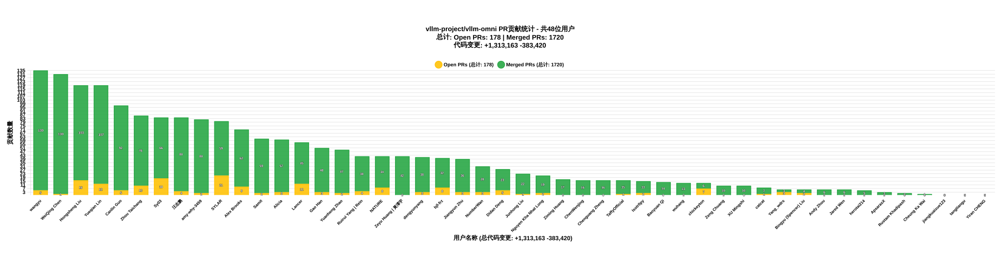
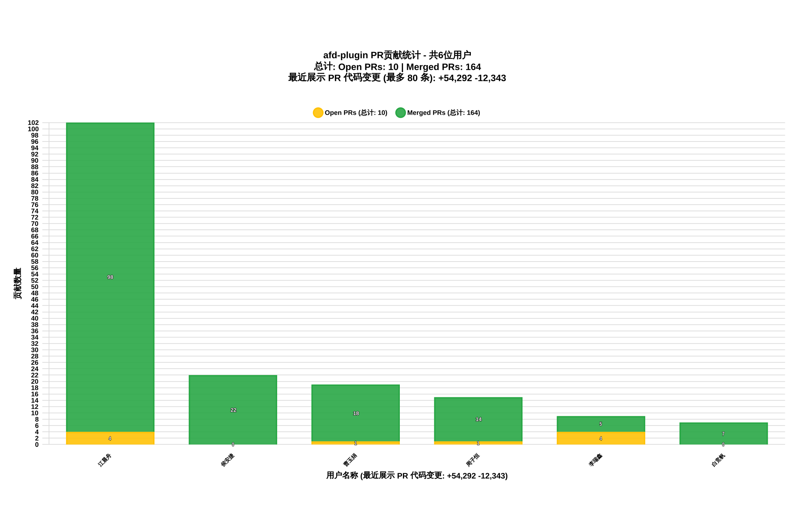
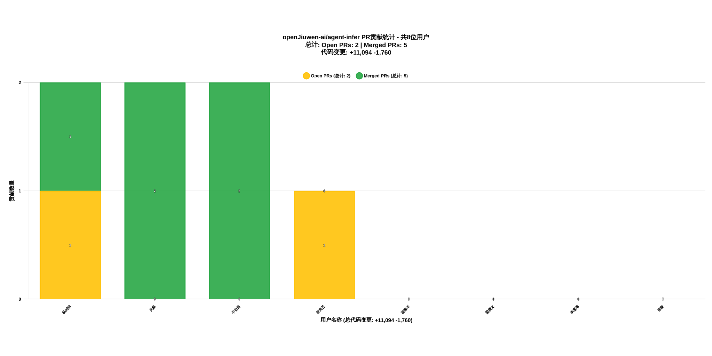

# Enhanced GitHub Stats Report - vllm-project/vllm-omni

Generated on: 2026-09-23 03:11:55 UTC

**统计范围**: vllm-project/vllm-omni 仓库的完整 PR 计数；代码变更统计覆盖最近展示的 最多 80 个 PR。

---

这是根据在 **vllm-project/vllm-omni** 仓库中的 PR 贡献（Merged PRs + Open PRs）进行的排序。

总共追踪了 48 个用户；Open/Merged PR 数为完整搜索计数，代码变更统计覆盖最近展示的最多 80 个 PR。

**最近展示 PR 代码变更统计**: +80,668 行添加, -29,388 行删除

## 按归属统计

| 归属 | 用户数 | Total PRs | Open PRs | Merged PRs | Recent Additions | Recent Deletions |
| ---- | ------ | --------- | -------- | ---------- | ---------------- | ---------------- |
| HUAWEI | 33 | 1159 | 92 | 1067 | 37,228 | 19,745 |
| 阿里PAI | 3 | 111 | 19 | 92 | 12,614 | 1,636 |
| 蚂蚁 | 1 | 3 | 0 | 3 | 0 | 0 |
| 小米 | 1 | 14 | 0 | 14 | 0 | 0 |
| 智谱 | 1 | 6 | 0 | 6 | 0 | 0 |
| Committer | 17 | 1196 | 127 | 1069 | 54,182 | 10,590 |

## Last Release Contributions

区间: [v0.26.0...v0.28.0](https://github.com/vllm-project/vllm-omni/compare/v0.26.0...v0.28.0)  
时间: 2026-08-03 08:26:55 UTC -> 2026-08-31 16:19:18 UTC

Tracked commits: 176/397; Tracked reviews: 1,317/1,887; Tracked code delta: +123,943/-46,119; Merged PRs in window: 418

Scoring: Contribution score = 20% commit share + 35% review share + 45% code churn share, where code churn is additions + deletions. Commit share reflects delivery, review share reflects quality influence, and code churn linearly reflects change scale.

| Affiliation | Contribution | Commits | Reviews | Reviewed PRs | Additions | Deletions | Code Lines |
| ---- | ------------ | ------- | ------- | ------------ | --------- | --------- | ---------- |
| HUAWEI | 49.3% | 133 | 1,003 | 275 | 70,437 | 42,482 | 112,919 |
| Committer | 46.8% | 115 | 1,046 | 278 | 93,002 | 10,330 | 103,332 |
| 阿里PAI | 3.9% | 8 | 23 | 11 | 13,682 | 904 | 14,586 |
| 蚂蚁 | 0.0% | 0 | 0 | 0 | 0 | 0 | 0 |
| 小米 | 0.0% | 0 | 0 | 0 | 0 | 0 | 0 |
| 智谱 | 0.0% | 0 | 0 | 0 | 0 | 0 | 0 |

| User | Labels | Contribution | Commits | Reviews | Reviewed PRs | Additions | Deletions | Code Lines |
| ---- | ------ | ------------ | ------- | ------- | ------------ | --------- | --------- | ---------- |
| @hsliuustc0106 | HUAWEI, Committer | 27.0% | 40 | 485 | 139 | 31,193 | 4,852 | 36,045 |
| @yenuo26 | HUAWEI | 14.5% | 16 | 87 | 36 | 8,803 | 30,537 | 39,340 |
| @linyueqian | Committer | 9.1% | 11 | 75 | 39 | 21,204 | 828 | 22,032 |
| @lishunyang12 | Committer | 6.9% | 8 | 123 | 37 | 9,522 | 703 | 10,225 |
| @david6666666 | HUAWEI, Committer | 5.8% | 17 | 103 | 37 | 3,564 | 634 | 4,198 |
| @Sy0307 | 阿里PAI, Committer | 5.4% | 8 | 23 | 11 | 13,682 | 904 | 14,586 |
| @Gaohan123 | HUAWEI, Committer | 4.3% | 9 | 109 | 62 | 556 | 761 | 1,317 |
| @natureofnature | HUAWEI | 3.9% | 10 | 27 | 4 | 7,179 | 434 | 7,613 |
| @amy-why-3459 | HUAWEI | 3.5% | 9 | 44 | 38 | 3,868 | 1,153 | 5,021 |
| @princepride | Committer | 2.0% | 4 | 22 | 10 | 3,411 | 201 | 3,612 |
| @gcanlin | Committer | 1.9% | 4 | 17 | 10 | 3,331 | 410 | 3,741 |
| @tzhouam | HUAWEI, Committer | 1.9% | 4 | 13 | 6 | 3,709 | 393 | 4,102 |
| @knlnguyen1802 | HUAWEI | 1.7% | 4 | 21 | 2 | 2,294 | 222 | 2,516 |
| @alex-jw-brooks | Committer | 1.7% | 6 | 24 | 15 | 1,132 | 221 | 1,353 |
| @bjf-frz | HUAWEI | 1.7% | 5 | 8 | 2 | 2,120 | 1,189 | 3,309 |
| @Bounty-hunter | HUAWEI | 1.5% | 2 | 30 | 12 | 1,629 | 220 | 1,849 |
| @fhfuih | HUAWEI | 1.3% | 4 | 18 | 14 | 713 | 684 | 1,397 |
| @R2-Y | HUAWEI | 1.3% | 2 | 7 | 4 | 2,571 | 747 | 3,318 |
| @SamitHuang | HUAWEI, Committer | 0.9% | 2 | 19 | 9 | 474 | 53 | 527 |
| @congw729 | HUAWEI | 0.8% | 2 | 18 | 15 | 143 | 396 | 539 |
| @yuanheng-zhao | Committer | 0.8% | 1 | 21 | 8 | 380 | 192 | 572 |
| @NumberWan | HUAWEI | 0.8% | 5 | 3 | 1 | 273 | 207 | 480 |
| @Isotr0py | Committer | 0.5% | 1 | 3 | 2 | 844 | 178 | 1,022 |
| @herotai214 | HUAWEI | 0.4% | 1 | 3 | 2 | 810 | 0 | 810 |
| @fake0fan | HUAWEI | 0.4% | 1 | 4 | 1 | 538 | 0 | 538 |
| @RuixiangMa | Committer | 0.1% | 0 | 5 | 3 | 0 | 0 | 0 |
| @wtomin | HUAWEI, Committer | 0.1% | 0 | 3 | 3 | 0 | 0 | 0 |
| @zhtmike | HUAWEI | 0.0% | 0 | 1 | 1 | 0 | 0 | 0 |
| @ZJY0516 | Committer | 0.0% | 0 | 1 | 1 | 0 | 0 | 0 |

## Current Release Contributions

区间: [v0.28.0...main](https://github.com/vllm-project/vllm-omni/compare/v0.28.0...main)  
时间: 2026-08-31 16:19:18 UTC -> 2026-09-23 02:34:51 UTC

Tracked commits: 112/429; Tracked reviews: 1,093/1,713; Tracked code delta: +140,435/-75,788; Merged PRs in window: 457

Scoring: Contribution score = 20% commit share + 35% review share + 45% code churn share, where code churn is additions + deletions. Commit share reflects delivery, review share reflects quality influence, and code churn linearly reflects change scale.

| Affiliation | Contribution | Commits | Reviews | Reviewed PRs | Additions | Deletions | Code Lines |
| ---- | ------------ | ------- | ------- | ------------ | --------- | --------- | ---------- |
| HUAWEI | 54.5% | 74 | 773 | 239 | 97,189 | 66,427 | 163,616 |
| Committer | 40.6% | 70 | 790 | 307 | 70,898 | 12,620 | 83,518 |
| 阿里PAI | 4.8% | 8 | 56 | 15 | 13,856 | 1,072 | 14,928 |
| 蚂蚁 | 0.0% | 0 | 0 | 0 | 0 | 0 | 0 |
| 小米 | 0.0% | 0 | 0 | 0 | 0 | 0 | 0 |
| 智谱 | 0.0% | 0 | 0 | 0 | 0 | 0 | 0 |

| User | Labels | Contribution | Commits | Reviews | Reviewed PRs | Additions | Deletions | Code Lines |
| ---- | ------ | ------------ | ------- | ------- | ------------ | --------- | --------- | ---------- |
| @chickeyton | HUAWEI | 17.2% | 3 | 51 | 2 | 33,616 | 38,563 | 72,179 |
| @hsliuustc0106 | HUAWEI, Committer | 11.1% | 11 | 206 | 88 | 11,718 | 665 | 12,383 |
| @linyueqian | Committer | 11.1% | 10 | 144 | 97 | 16,622 | 5,744 | 22,366 |
| @yenuo26 | HUAWEI | 9.6% | 12 | 78 | 31 | 8,209 | 15,618 | 23,827 |
| @Sy0307 | 阿里PAI, Committer | 6.3% | 8 | 56 | 15 | 13,856 | 1,072 | 14,928 |
| @tzhouam | HUAWEI, Committer | 5.8% | 7 | 58 | 17 | 10,645 | 2,392 | 13,037 |
| @david6666666 | HUAWEI, Committer | 4.7% | 11 | 58 | 28 | 4,172 | 144 | 4,316 |
| @lishunyang12 | Committer | 4.6% | 5 | 60 | 49 | 6,372 | 2,123 | 8,495 |
| @amy-why-3459 | HUAWEI | 4.0% | 2 | 72 | 41 | 5,868 | 690 | 6,558 |
| @princepride | Committer | 3.9% | 9 | 34 | 18 | 5,714 | 260 | 5,974 |
| @Gaohan123 | HUAWEI, Committer | 3.3% | 1 | 95 | 57 | 169 | 41 | 210 |
| @NumberWan | HUAWEI | 3.1% | 5 | 13 | 4 | 8,165 | 631 | 8,796 |
| @fhfuih | HUAWEI | 2.8% | 4 | 36 | 9 | 4,102 | 583 | 4,685 |
| @natureofnature | HUAWEI | 2.5% | 4 | 15 | 10 | 3,575 | 2,719 | 6,294 |
| @SamitHuang | HUAWEI, Committer | 1.6% | 2 | 32 | 11 | 948 | 17 | 965 |
| @congw729 | HUAWEI | 1.3% | 3 | 18 | 16 | 434 | 316 | 750 |
| @fake0fan | HUAWEI | 1.2% | 2 | 7 | 1 | 1,137 | 1,803 | 2,940 |
| @herotai214 | HUAWEI | 1.0% | 1 | 0 | 0 | 2,437 | 1,744 | 4,181 |
| @zengchuang-hw | HUAWEI | 1.0% | 3 | 9 | 1 | 837 | 127 | 964 |
| @alex-jw-brooks | Committer | 0.9% | 4 | 5 | 5 | 252 | 96 | 348 |
| @gcanlin | Committer | 0.7% | 2 | 9 | 8 | 430 | 66 | 496 |
| @wtomin | HUAWEI, Committer | 0.7% | 0 | 21 | 7 | 0 | 0 | 0 |
| @Bounty-hunter | HUAWEI | 0.4% | 1 | 4 | 3 | 257 | 113 | 370 |
| @TaffyOfficial | HUAWEI | 0.4% | 1 | 0 | 0 | 716 | 254 | 970 |
| @RuixiangMa | Committer | 0.4% | 0 | 11 | 11 | 0 | 0 | 0 |
| @AndyZhou952 | HUAWEI | 0.2% | 1 | 0 | 0 | 184 | 7 | 191 |
| @yuanheng-zhao | Committer | 0.0% | 0 | 1 | 1 | 0 | 0 | 0 |

### 👤 wangyu (@yenuo26) - HUAWEI - 总贡献: 136
**最近展示 PR 代码变更**: +2,452 行添加, -13,747 行删除

**Pull Requests (6 open, 130 merged; up to 10 newest per state shown)**
| Title | Repository | State | Created | Merged | Additions | Deletions |
| ----- | ---------- | ----- | ------- | ------ | --------- | --------- |
| [[CI/Build] Move Breeze-TTS-2 voice design e2e to weekly](https://github.com/vllm-project/vllm-omni/pull/8032) | [vllm-project/vllm-omni](https://github.com/vllm-project/vllm-omni) | `open` | 2026-09-23 | - | 1 | 41 |
| [[CI/Build] Promote LingBot-Video dense smoke to ready/merge and wire L4 expansion](https://github.com/vllm-project/vllm-omni/pull/7892) | [vllm-project/vllm-omni](https://github.com/vllm-project/vllm-omni) | `merged` | 2026-09-20 | 2026-09-21 14:45:33 UTC | 42 | 7 |
| [[CI/Build] Retarget skipped HiDream and MammothModa2 E2E tests to current issues](https://github.com/vllm-project/vllm-omni/pull/7755) | [vllm-project/vllm-omni](https://github.com/vllm-project/vllm-omni) | `merged` | 2026-09-18 | 2026-09-18 13:24:01 UTC | 2 | 2 |
| [[CI][Perf] migrate diffusion DFX benches to vllm bench serve --omni](https://github.com/vllm-project/vllm-omni/pull/7737) | [vllm-project/vllm-omni](https://github.com/vllm-project/vllm-omni) | `merged` | 2026-09-17 | 2026-09-22 02:16:40 UTC | 2,039 | 728 |
| [[Misc] Remove Dynin-Omni and dots.tts support](https://github.com/vllm-project/vllm-omni/pull/7655) | [vllm-project/vllm-omni](https://github.com/vllm-project/vllm-omni) | `merged` | 2026-09-16 | 2026-09-20 07:28:30 UTC | 132 | 12,748 |
| [[Bugfix] Isolate weekly CPU tests from inherited attention env and hf_api mocks](https://github.com/vllm-project/vllm-omni/pull/7565) | [vllm-project/vllm-omni](https://github.com/vllm-project/vllm-omni) | `merged` | 2026-09-15 | 2026-09-21 15:55:01 UTC | 236 | 221 |
| [[BugFix][CI] Restore diff-aware source filtering for post-merge L3](https://github.com/vllm-project/vllm-omni/pull/7371) | [vllm-project/vllm-omni](https://github.com/vllm-project/vllm-omni) | `merged` | 2026-09-10 | - | — | — |
| [[CI/Build] Cut L3 entrypoint BAGEL cold starts via L4 small-model sleep suites (#6851)](https://github.com/vllm-project/vllm-omni/pull/7359) | [vllm-project/vllm-omni](https://github.com/vllm-project/vllm-omni) | `open` | 2026-09-10 | - | — | — |
| [[CI/Build][WIP] Add A100 mirror queue and move Nemotron duplex to weekly](https://github.com/vllm-project/vllm-omni/pull/7315) | [vllm-project/vllm-omni](https://github.com/vllm-project/vllm-omni) | `open` | 2026-09-09 | - | — | — |
| [[CI] Skip Qwen3-Omni Server VAD multi-turn realtime test (#7279)](https://github.com/vllm-project/vllm-omni/pull/7314) | [vllm-project/vllm-omni](https://github.com/vllm-project/vllm-omni) | `merged` | 2026-09-09 | - | — | — |
| [[CI/Build] Share nightly CUDA YAML between H100/L4 and B200](https://github.com/vllm-project/vllm-omni/pull/7028) | [vllm-project/vllm-omni](https://github.com/vllm-project/vllm-omni) | `merged` | 2026-09-04 | - | — | — |
| [[Bugfix][Diffusion] Register Sana I2V pipeline as video output](https://github.com/vllm-project/vllm-omni/pull/6953) | [vllm-project/vllm-omni](https://github.com/vllm-project/vllm-omni) | `merged` | 2026-09-02 | - | — | — |
| [[CI] Migrate L4 jobs to l4-k8s and split by GPU count](https://github.com/vllm-project/vllm-omni/pull/6890) | [vllm-project/vllm-omni](https://github.com/vllm-project/vllm-omni) | `merged` | 2026-09-01 | - | — | — |
| [[CI]drop DreamZero upstream parity e2e; keep OpenPI serving contract](https://github.com/vllm-project/vllm-omni/pull/5934) | [vllm-project/vllm-omni](https://github.com/vllm-project/vllm-omni) | `open` | 2026-08-09 | - | — | — |
| [[Skills] Add agent skills for local nightly test and test report generation](https://github.com/vllm-project/vllm-omni/pull/4722) | [vllm-project/vllm-omni](https://github.com/vllm-project/vllm-omni) | `open` | 2026-06-25 | - | — | — |
| [[WIP][Debug] vLLM cu129 base image Test](https://github.com/vllm-project/vllm-omni/pull/3273) | [vllm-project/vllm-omni](https://github.com/vllm-project/vllm-omni) | `open` | 2026-04-30 | - | — | — |
| **Total for wangyu** | | | | - | **2,452** | **13,747** |

### 👤 WeiQing Chen (@david6666666) - HUAWEI, Committer - 总贡献: 131
**最近展示 PR 代码变更**: +1,239 行添加, -138 行删除

**Pull Requests (1 open, 130 merged; up to 10 newest per state shown)**
| Title | Repository | State | Created | Merged | Additions | Deletions |
| ----- | ---------- | ----- | ------- | ------ | --------- | --------- |
| [[Bugfix][MiniMax-H3] Fix Hopper keyframe and modulation precision](https://github.com/vllm-project/vllm-omni/pull/7913) | [vllm-project/vllm-omni](https://github.com/vllm-project/vllm-omni) | `merged` | 2026-09-21 | 2026-09-21 08:26:10 UTC | 90 | 115 |
| [[Doc] Update vLLM-Omni WeChat QR code](https://github.com/vllm-project/vllm-omni/pull/7911) | [vllm-project/vllm-omni](https://github.com/vllm-project/vllm-omni) | `merged` | 2026-09-21 | 2026-09-21 14:18:29 UTC | 0 | 0 |
| [[Bugfix][MiniMax-H3] Use Hopper-safe modulation precision](https://github.com/vllm-project/vllm-omni/pull/7693) | [vllm-project/vllm-omni](https://github.com/vllm-project/vllm-omni) | `merged` | 2026-09-17 | 2026-09-18 07:16:45 UTC | 94 | 9 |
| [[CI][bugfix] Fix MiniMax H3 FP8 quality test remote-code loading](https://github.com/vllm-project/vllm-omni/pull/7617) | [vllm-project/vllm-omni](https://github.com/vllm-project/vllm-omni) | `merged` | 2026-09-16 | 2026-09-17 01:52:24 UTC | 2 | 0 |
| [[Diffusion][Model] Add direct FastH3 8-Step V2 checkpoint loading](https://github.com/vllm-project/vllm-omni/pull/7610) | [vllm-project/vllm-omni](https://github.com/vllm-project/vllm-omni) | `merged` | 2026-09-16 | 2026-09-17 08:41:52 UTC | 1,053 | 14 |
| [[Doc] Update vLLM-Omni WeChat QR code](https://github.com/vllm-project/vllm-omni/pull/7490) | [vllm-project/vllm-omni](https://github.com/vllm-project/vllm-omni) | `merged` | 2026-09-14 | - | — | — |
| [[Bugfix] Keep MiniMax-H3 reference audio budgets separate](https://github.com/vllm-project/vllm-omni/pull/7281) | [vllm-project/vllm-omni](https://github.com/vllm-project/vllm-omni) | `merged` | 2026-09-08 | - | — | — |
| [[Bugfix][MiniMax-H3] Stabilize keyframe VAE encoding](https://github.com/vllm-project/vllm-omni/pull/7191) | [vllm-project/vllm-omni](https://github.com/vllm-project/vllm-omni) | `merged` | 2026-09-07 | - | — | — |
| [[Doc] Update vLLM-Omni WeChat QR code](https://github.com/vllm-project/vllm-omni/pull/7178) | [vllm-project/vllm-omni](https://github.com/vllm-project/vllm-omni) | `merged` | 2026-09-07 | - | — | — |
| [[Doc] Update vLLM-Omni WeChat QR code](https://github.com/vllm-project/vllm-omni/pull/6832) | [vllm-project/vllm-omni](https://github.com/vllm-project/vllm-omni) | `merged` | 2026-08-31 | - | — | — |
| [[Feature] Add Sol-Attn sparse attention backend for MiniMax H3](https://github.com/vllm-project/vllm-omni/pull/5851) | [vllm-project/vllm-omni](https://github.com/vllm-project/vllm-omni) | `open` | 2026-08-06 | - | — | — |
| **Total for WeiQing Chen** | | | | - | **1,239** | **138** |

### 👤 Hongsheng Liu (@hsliuustc0106) - HUAWEI, Committer - 总贡献: 119
**最近展示 PR 代码变更**: +0 行添加, -0 行删除

**Pull Requests (16 open, 103 merged; up to 10 newest per state shown)**
| Title | Repository | State | Created | Merged | Additions | Deletions |
| ----- | ---------- | ----- | ------- | ------ | --------- | --------- |
| [[Skills] Add platform-optimization-inheritance reference to add-diffusion-model](https://github.com/vllm-project/vllm-omni/pull/7526) | [vllm-project/vllm-omni](https://github.com/vllm-project/vllm-omni) | `open` | 2026-09-14 | - | — | — |
| [[Bugfix][Frontend] Honor output_compression on the image generations route](https://github.com/vllm-project/vllm-omni/pull/7447) | [vllm-project/vllm-omni](https://github.com/vllm-project/vllm-omni) | `merged` | 2026-09-12 | - | — | — |
| [[Doc] Add AI usage policy for contributions](https://github.com/vllm-project/vllm-omni/pull/7305) | [vllm-project/vllm-omni](https://github.com/vllm-project/vllm-omni) | `merged` | 2026-09-09 | - | — | — |
| [[Core] Add explicit HWR registration bypass and progress logs](https://github.com/vllm-project/vllm-omni/pull/7147) | [vllm-project/vllm-omni](https://github.com/vllm-project/vllm-omni) | `open` | 2026-09-06 | - | — | — |
| [[Misc] Add standalone safetensors retention diagnostic](https://github.com/vllm-project/vllm-omni/pull/7145) | [vllm-project/vllm-omni](https://github.com/vllm-project/vllm-omni) | `merged` | 2026-09-06 | - | — | — |
| [[Core] Expose HWR payload validation in diffusion startup](https://github.com/vllm-project/vllm-omni/pull/7144) | [vllm-project/vllm-omni](https://github.com/vllm-project/vllm-omni) | `open` | 2026-09-06 | - | — | — |
| [[Core] Add opt-in serialized HWR build admission](https://github.com/vllm-project/vllm-omni/pull/7140) | [vllm-project/vllm-omni](https://github.com/vllm-project/vllm-omni) | `open` | 2026-09-06 | - | — | — |
| [[Core] Add explicit cleanup for quarantined HWR artifacts](https://github.com/vllm-project/vllm-omni/pull/7133) | [vllm-project/vllm-omni](https://github.com/vllm-project/vllm-omni) | `open` | 2026-09-06 | - | — | — |
| [[Bugfix] Skip HWR store-size scans when no limit is configured](https://github.com/vllm-project/vllm-omni/pull/7131) | [vllm-project/vllm-omni](https://github.com/vllm-project/vllm-omni) | `merged` | 2026-09-06 | - | — | — |
| [[Bugfix] Bound HWR domain initialization lock waits](https://github.com/vllm-project/vllm-omni/pull/7128) | [vllm-project/vllm-omni](https://github.com/vllm-project/vllm-omni) | `merged` | 2026-09-06 | - | — | — |
| [[Bugfix] Escalate diffusion worker shutdown and retain survivors](https://github.com/vllm-project/vllm-omni/pull/7126) | [vllm-project/vllm-omni](https://github.com/vllm-project/vllm-omni) | `merged` | 2026-09-06 | - | — | — |
| [[Doc] Update README and docs for v0.28.0](https://github.com/vllm-project/vllm-omni/pull/6858) | [vllm-project/vllm-omni](https://github.com/vllm-project/vllm-omni) | `merged` | 2026-08-31 | - | — | — |
| [[Skills] Add perf-evidence isolation, stage-attribution, and realtime-contract requirements](https://github.com/vllm-project/vllm-omni/pull/6820) | [vllm-project/vllm-omni](https://github.com/vllm-project/vllm-omni) | `merged` | 2026-08-30 | - | — | — |
| [[Core] Restore topology-aware diffusion worker titles](https://github.com/vllm-project/vllm-omni/pull/6722) | [vllm-project/vllm-omni](https://github.com/vllm-project/vllm-omni) | `merged` | 2026-08-28 | - | — | — |
| [[Core] Add central OffloadPlan resolver](https://github.com/vllm-project/vllm-omni/pull/6721) | [vllm-project/vllm-omni](https://github.com/vllm-project/vllm-omni) | `open` | 2026-08-28 | - | — | — |
| [[Model] MiniMax-H3: validate versioned text-conditioning handoff](https://github.com/vllm-project/vllm-omni/pull/6720) | [vllm-project/vllm-omni](https://github.com/vllm-project/vllm-omni) | `merged` | 2026-08-28 | - | — | — |
| [[Model] Learn the DLO component cache budget from observed boundary peaks](https://github.com/vllm-project/vllm-omni/pull/6629) | [vllm-project/vllm-omni](https://github.com/vllm-project/vllm-omni) | `open` | 2026-08-25 | - | — | — |
| [[Performance] Add per-component DLO offload policy](https://github.com/vllm-project/vllm-omni/pull/6530) | [vllm-project/vllm-omni](https://github.com/vllm-project/vllm-omni) | `open` | 2026-08-23 | - | — | — |
| [[Performance] Add opt-in bounded pinned staging for diffusion weight loading](https://github.com/vllm-project/vllm-omni/pull/6478) | [vllm-project/vllm-omni](https://github.com/vllm-project/vllm-omni) | `open` | 2026-08-22 | - | — | — |
| [[Examples] Harden the shared video-audio runner](https://github.com/vllm-project/vllm-omni/pull/6261) | [vllm-project/vllm-omni](https://github.com/vllm-project/vllm-omni) | `open` | 2026-08-17 | - | — | — |
| **Total for Hongsheng Liu** | | | | - | **0** | **0** |

### 👤 Yueqian Lin (@linyueqian) - Committer - 总贡献: 119
**最近展示 PR 代码变更**: +8,837 行添加, -5,704 行删除

**Pull Requests (10 open, 109 merged; up to 10 newest per state shown)**
| Title | Repository | State | Created | Merged | Additions | Deletions |
| ----- | ---------- | ----- | ------- | ------ | --------- | --------- |
| [[CI] Bump the public env var snapshot count after #6848 landed](https://github.com/vllm-project/vllm-omni/pull/7964) | [vllm-project/vllm-omni](https://github.com/vllm-project/vllm-omni) | `merged` | 2026-09-22 | 2026-09-22 12:38:09 UTC | 1 | 1 |
| [[CI][Qwen3-Omni] Keep the deploy-YAML literal in the structured-config sampling check](https://github.com/vllm-project/vllm-omni/pull/7803) | [vllm-project/vllm-omni](https://github.com/vllm-project/vllm-omni) | `merged` | 2026-09-18 | 2026-09-18 18:25:02 UTC | 6 | 4 |
| [[Model] Accelerate Breeze-TTS-2 non-streaming inference](https://github.com/vllm-project/vllm-omni/pull/7752) | [vllm-project/vllm-omni](https://github.com/vllm-project/vllm-omni) | `merged` | 2026-09-18 | 2026-09-23 00:10:15 UTC | 8,199 | 5,630 |
| [[CI][Qwen3-Omni] Compare structured-config sampling defaults against vLLM normalization](https://github.com/vllm-project/vllm-omni/pull/7742) | [vllm-project/vllm-omni](https://github.com/vllm-project/vllm-omni) | `merged` | 2026-09-17 | 2026-09-18 14:55:59 UTC | 14 | 5 |
| [[Bugfix] Fix Breeze-TTS-2 repeated silence and audio EOS handling](https://github.com/vllm-project/vllm-omni/pull/7667) | [vllm-project/vllm-omni](https://github.com/vllm-project/vllm-omni) | `merged` | 2026-09-16 | 2026-09-16 18:40:13 UTC | 437 | 33 |
| [[Bugfix] Per-key accumulation strategy for Qwen3-TTS codec frame outputs](https://github.com/vllm-project/vllm-omni/pull/7608) | [vllm-project/vllm-omni](https://github.com/vllm-project/vllm-omni) | `merged` | 2026-09-15 | 2026-09-16 03:08:49 UTC | 174 | 25 |
| [[Bugfix] Use current OpenAI audio event names in duplex client metrics](https://github.com/vllm-project/vllm-omni/pull/7541) | [vllm-project/vllm-omni](https://github.com/vllm-project/vllm-omni) | `merged` | 2026-09-14 | 2026-09-15 00:19:22 UTC | 6 | 6 |
| [[Model] Add Tencent AuK speech generation and editing (encoder + diffusion pipeline)](https://github.com/vllm-project/vllm-omni/pull/7385) | [vllm-project/vllm-omni](https://github.com/vllm-project/vllm-omni) | `merged` | 2026-09-10 | - | — | — |
| [[BugFix] CosyVoice3: honor the weights iterator in load_weights](https://github.com/vllm-project/vllm-omni/pull/6738) | [vllm-project/vllm-omni](https://github.com/vllm-project/vllm-omni) | `open` | 2026-08-29 | - | — | — |
| [[Perf][TTS] Batch the async-chunk sync for higgs-audio v2/v3 and voxtral](https://github.com/vllm-project/vllm-omni/pull/6643) | [vllm-project/vllm-omni](https://github.com/vllm-project/vllm-omni) | `open` | 2026-08-26 | - | — | — |
| [[Bugfix][MiniMax-Music3] Resolve stage subdirs against a real snapshot](https://github.com/vllm-project/vllm-omni/pull/6640) | [vllm-project/vllm-omni](https://github.com/vllm-project/vllm-omni) | `merged` | 2026-08-26 | - | — | — |
| [[Bugfix] Restore name-based model detection for HF cache snapshot paths](https://github.com/vllm-project/vllm-omni/pull/6624) | [vllm-project/vllm-omni](https://github.com/vllm-project/vllm-omni) | `merged` | 2026-08-25 | - | — | — |
| [[Perf][Qwen3-TTS] Batch the async-chunk emptiness sync instead of syncing per decode step](https://github.com/vllm-project/vllm-omni/pull/6576) | [vllm-project/vllm-omni](https://github.com/vllm-project/vllm-omni) | `open` | 2026-08-24 | - | — | — |
| [[CI/Build] test_speech_speed: assert speed scales duration, not ASR intelligibility](https://github.com/vllm-project/vllm-omni/pull/4339) | [vllm-project/vllm-omni](https://github.com/vllm-project/vllm-omni) | `open` | 2026-06-11 | - | — | — |
| [[CI] Save curated TTS audio clips as Buildkite artifacts (RFC)](https://github.com/vllm-project/vllm-omni/pull/4201) | [vllm-project/vllm-omni](https://github.com/vllm-project/vllm-omni) | `open` | 2026-06-05 | - | — | — |
| [test(perf): relax c=64 Qwen3-TTS baselines to match observed distribution](https://github.com/vllm-project/vllm-omni/pull/4057) | [vllm-project/vllm-omni](https://github.com/vllm-project/vllm-omni) | `open` | 2026-06-01 | - | — | — |
| [refactor(examples): consolidate text-to-audio models into hub](https://github.com/vllm-project/vllm-omni/pull/3974) | [vllm-project/vllm-omni](https://github.com/vllm-project/vllm-omni) | `open` | 2026-05-29 | - | — | — |
| [[Bugfix][StableAudio] Pass model_class_name to Omni() and declare audio class attrs](https://github.com/vllm-project/vllm-omni/pull/3406) | [vllm-project/vllm-omni](https://github.com/vllm-project/vllm-omni) | `open` | 2026-05-07 | - | — | — |
| [[Test][OmniVoice] Add offline voice-cloning regression test for #3392](https://github.com/vllm-project/vllm-omni/pull/3398) | [vllm-project/vllm-omni](https://github.com/vllm-project/vllm-omni) | `open` | 2026-05-07 | - | — | — |
| [[Example] Add Qwen3-Omni realtime video chat demo with FastRTC](https://github.com/vllm-project/vllm-omni/pull/2355) | [vllm-project/vllm-omni](https://github.com/vllm-project/vllm-omni) | `open` | 2026-03-31 | - | — | — |
| **Total for Yueqian Lin** | | | | - | **8,837** | **5,704** |

### 👤 Canlin Guo (@gcanlin) - Committer - 总贡献: 97
**最近展示 PR 代码变更**: +853 行添加, -99 行删除

**Pull Requests (5 open, 92 merged; up to 10 newest per state shown)**
| Title | Repository | State | Created | Merged | Additions | Deletions |
| ----- | ---------- | ----- | ------- | ------ | --------- | --------- |
| [[Bugfix] Avoid waveform-list GC scans and release completed MOSS batches](https://github.com/vllm-project/vllm-omni/pull/7885) | [vllm-project/vllm-omni](https://github.com/vllm-project/vllm-omni) | `merged` | 2026-09-20 | 2026-09-20 12:36:53 UTC | 238 | 53 |
| [[Frontend] Tune reference cache limits and registered MOSS voice requests](https://github.com/vllm-project/vllm-omni/pull/7883) | [vllm-project/vllm-omni](https://github.com/vllm-project/vllm-omni) | `open` | 2026-09-20 | - | 423 | 33 |
| [[Feature][TTS] MOSS-TTS: place the reference-audio encoder on the code2wav stage's GPU](https://github.com/vllm-project/vllm-omni/pull/7724) | [vllm-project/vllm-omni](https://github.com/vllm-project/vllm-omni) | `merged` | 2026-09-17 | 2026-09-17 12:51:27 UTC | 192 | 13 |
| [[Kernel] Optimize MOSS Local decoding and codec streaming on H200](https://github.com/vllm-project/vllm-omni/pull/7409) | [vllm-project/vllm-omni](https://github.com/vllm-project/vllm-omni) | `open` | 2026-09-11 | - | — | — |
| [[Kernel] Optimize MOSS codec attention layout and FFN GEMMs](https://github.com/vllm-project/vllm-omni/pull/7407) | [vllm-project/vllm-omni](https://github.com/vllm-project/vllm-omni) | `open` | 2026-09-11 | - | — | — |
| [[Model] Reduce MOSS-TTS codec streaming KV state memory](https://github.com/vllm-project/vllm-omni/pull/7332) | [vllm-project/vllm-omni](https://github.com/vllm-project/vllm-omni) | `open` | 2026-09-09 | - | — | — |
| [[Perf] Fuse MiniMax H3 SwiGLU activation](https://github.com/vllm-project/vllm-omni/pull/6283) | [vllm-project/vllm-omni](https://github.com/vllm-project/vllm-omni) | `merged` | 2026-08-17 | - | — | — |
| [[Perf] Fuse MiniMax H3 modulation with FP32 accumulation](https://github.com/vllm-project/vllm-omni/pull/6281) | [vllm-project/vllm-omni](https://github.com/vllm-project/vllm-omni) | `merged` | 2026-08-17 | - | — | — |
| [[BugFix] Use MOSS-TTS-Local official sample params](https://github.com/vllm-project/vllm-omni/pull/6156) | [vllm-project/vllm-omni](https://github.com/vllm-project/vllm-omni) | `merged` | 2026-08-13 | - | — | — |
| [[Feature] Support text encoder Disaggregation for H3](https://github.com/vllm-project/vllm-omni/pull/5885) | [vllm-project/vllm-omni](https://github.com/vllm-project/vllm-omni) | `merged` | 2026-08-07 | - | — | — |
| [[Perf] Enable compile for MOSS-TTS-Local v1.5 talker and codec](https://github.com/vllm-project/vllm-omni/pull/5530) | [vllm-project/vllm-omni](https://github.com/vllm-project/vllm-omni) | `merged` | 2026-07-29 | - | — | — |
| [[Refactor] Make MOSS-TTS-Local stream session dynamic batch](https://github.com/vllm-project/vllm-omni/pull/5235) | [vllm-project/vllm-omni](https://github.com/vllm-project/vllm-omni) | `merged` | 2026-07-20 | - | — | — |
| [[Perf] Refactor MOSS-TTS-Local v1.5 talker and local structure for CUDA Graph](https://github.com/vllm-project/vllm-omni/pull/5197) | [vllm-project/vllm-omni](https://github.com/vllm-project/vllm-omni) | `merged` | 2026-07-19 | - | — | — |
| [[Docs] Add hardware plugin system design docs](https://github.com/vllm-project/vllm-omni/pull/5077) | [vllm-project/vllm-omni](https://github.com/vllm-project/vllm-omni) | `open` | 2026-07-13 | - | — | — |
| [[Feature] Support MOSS-TTS-Local-v1.5 vocoder graph](https://github.com/vllm-project/vllm-omni/pull/4929) | [vllm-project/vllm-omni](https://github.com/vllm-project/vllm-omni) | `merged` | 2026-07-06 | - | — | — |
| **Total for Canlin Guo** | | | | - | **853** | **99** |

### 👤 Zhou Taichang (@tzhouam) - HUAWEI, Committer - 总贡献: 86
**最近展示 PR 代码变更**: +9,036 行添加, -798 行删除

**Pull Requests (9 open, 77 merged; up to 10 newest per state shown)**
| Title | Repository | State | Created | Merged | Additions | Deletions |
| ----- | ---------- | ----- | ------- | ------ | --------- | --------- |
| [[Bugfix][Core] Fix stage initialization spawn-lock/device-lock inversion](https://github.com/vllm-project/vllm-omni/pull/7926) | [vllm-project/vllm-omni](https://github.com/vllm-project/vllm-omni) | `open` | 2026-09-21 | - | 215 | 72 |
| [[Rebase] Rebase to vLLM 0.30.0](https://github.com/vllm-project/vllm-omni/pull/7820) | [vllm-project/vllm-omni](https://github.com/vllm-project/vllm-omni) | `merged` | 2026-09-19 | 2026-09-22 15:52:01 UTC | 1,032 | 300 |
| [[LingBot World] Exact and fused fast paths for the streaming Wan VAE decoder (stacked on #7648, #7651)](https://github.com/vllm-project/vllm-omni/pull/7749) | [vllm-project/vllm-omni](https://github.com/vllm-project/vllm-omni) | `open` | 2026-09-18 | - | 3,018 | 214 |
| [[LingBot World] Shard the streaming VAE decode across the Ulysses ranks](https://github.com/vllm-project/vllm-omni/pull/7651) | [vllm-project/vllm-omni](https://github.com/vllm-project/vllm-omni) | `merged` | 2026-09-16 | 2026-09-21 11:00:46 UTC | 379 | 12 |
| [[LingBot World] Eleven bit-identical removals of repeated work in the realtime path](https://github.com/vllm-project/vllm-omni/pull/7648) | [vllm-project/vllm-omni](https://github.com/vllm-project/vllm-omni) | `merged` | 2026-09-16 | 2026-09-21 06:12:46 UTC | 1,957 | 200 |
| [[Benchmark] Add LingBot-World realtime streaming benchmark](https://github.com/vllm-project/vllm-omni/pull/7645) | [vllm-project/vllm-omni](https://github.com/vllm-project/vllm-omni) | `merged` | 2026-09-16 | 2026-09-21 13:12:01 UTC | 2,413 | 0 |
| [[Bugfix] Skip generic text-only warmup for DreamZero](https://github.com/vllm-project/vllm-omni/pull/7548) | [vllm-project/vllm-omni](https://github.com/vllm-project/vllm-omni) | `merged` | 2026-09-15 | 2026-09-16 06:43:19 UTC | 22 | 0 |
| [[Misc] Add LingBot-World spatial VAE validation tool](https://github.com/vllm-project/vllm-omni/pull/7515) | [vllm-project/vllm-omni](https://github.com/vllm-project/vllm-omni) | `open` | 2026-09-14 | - | — | — |
| [[Bugfix][Qwen3-Omni] Restore the talker sampling seed](https://github.com/vllm-project/vllm-omni/pull/7474) | [vllm-project/vllm-omni](https://github.com/vllm-project/vllm-omni) | `open` | 2026-09-13 | - | — | — |
| [[Rebase] Rebase to vLLM 0.29.0](https://github.com/vllm-project/vllm-omni/pull/7230) | [vllm-project/vllm-omni](https://github.com/vllm-project/vllm-omni) | `merged` | 2026-09-08 | - | — | — |
| [[CI] Preserve secret-backed HF token in scheduled GPU jobs](https://github.com/vllm-project/vllm-omni/pull/7118) | [vllm-project/vllm-omni](https://github.com/vllm-project/vllm-omni) | `merged` | 2026-09-06 | - | — | — |
| [[Refactor] Worker hygiene sweep: dead code, FA3 resize, silent failures, API consistency (G3/N)](https://github.com/vllm-project/vllm-omni/pull/6988) | [vllm-project/vllm-omni](https://github.com/vllm-project/vllm-omni) | `open` | 2026-09-03 | - | — | — |
| [[Rebase] Rebase to vllm 0.28.0](https://github.com/vllm-project/vllm-omni/pull/6606) | [vllm-project/vllm-omni](https://github.com/vllm-project/vllm-omni) | `merged` | 2026-08-25 | - | — | — |
| [[Bugfix][Qwen3-Omni] Stabilize thinker MRoPE compilation](https://github.com/vllm-project/vllm-omni/pull/6449) | [vllm-project/vllm-omni](https://github.com/vllm-project/vllm-omni) | `merged` | 2026-08-21 | - | — | — |
| [[Rebase] Rebase to vllm 0.27.0](https://github.com/vllm-project/vllm-omni/pull/5976) | [vllm-project/vllm-omni](https://github.com/vllm-project/vllm-omni) | `merged` | 2026-08-10 | - | — | — |
| [ci: raise merge-tier entrypoint timeouts (H100 60->90, L4 30->45)](https://github.com/vllm-project/vllm-omni/pull/5039) | [vllm-project/vllm-omni](https://github.com/vllm-project/vllm-omni) | `open` | 2026-07-11 | - | — | — |
| [test: regression coverage for AsyncOmni request_id default (#4384)](https://github.com/vllm-project/vllm-omni/pull/4523) | [vllm-project/vllm-omni](https://github.com/vllm-project/vllm-omni) | `open` | 2026-06-18 | - | — | — |
| [[Bugfix] harden Omni weight snapshot downloads](https://github.com/vllm-project/vllm-omni/pull/4139) | [vllm-project/vllm-omni](https://github.com/vllm-project/vllm-omni) | `open` | 2026-06-04 | - | — | — |
| [[WIP][Feature] Migrate to MR v2](https://github.com/vllm-project/vllm-omni/pull/2509) | [vllm-project/vllm-omni](https://github.com/vllm-project/vllm-omni) | `open` | 2026-04-05 | - | — | — |
| **Total for Zhou Taichang** | | | | - | **9,036** | **798** |

### 👤 Sy03 (@Sy0307) - 阿里PAI, Committer - 总贡献: 86
**最近展示 PR 代码变更**: +12,614 行添加, -1,636 行删除

**Pull Requests (18 open, 68 merged; up to 10 newest per state shown)**
| Title | Repository | State | Created | Merged | Additions | Deletions |
| ----- | ---------- | ----- | ------- | ------ | --------- | --------- |
| [[Model] Enable MOSS Local 1.5 MRV2 with slot codec attention](https://github.com/vllm-project/vllm-omni/pull/8012) | [vllm-project/vllm-omni](https://github.com/vllm-project/vllm-omni) | `open` | 2026-09-22 | - | 793 | 31 |
| [[Bugfix] Restore MRV2 full-payload transport for offline Qwen3-TTS](https://github.com/vllm-project/vllm-omni/pull/8010) | [vllm-project/vllm-omni](https://github.com/vllm-project/vllm-omni) | `merged` | 2026-09-22 | 2026-09-23 01:51:21 UTC | 284 | 26 |
| [[Model] Default Qwen3-TTS to experimental Model Runner V2](https://github.com/vllm-project/vllm-omni/pull/7930) | [vllm-project/vllm-omni](https://github.com/vllm-project/vllm-omni) | `merged` | 2026-09-21 | 2026-09-21 18:56:07 UTC | 55 | 23 |
| [[Bugfix] Fix Nemotron VoiceChat duplex nightly handshake](https://github.com/vllm-project/vllm-omni/pull/7884) | [vllm-project/vllm-omni](https://github.com/vllm-project/vllm-omni) | `open` | 2026-09-20 | - | 1,091 | 882 |
| [[Core][Model] Enable Qwen3-TTS MRV2 and optimize the TTS pipeline](https://github.com/vllm-project/vllm-omni/pull/7781) | [vllm-project/vllm-omni](https://github.com/vllm-project/vllm-omni) | `merged` | 2026-09-18 | 2026-09-21 06:03:09 UTC | 10,234 | 663 |
| [[Model] Reduce MOSS TTS reference audio preparation overhead](https://github.com/vllm-project/vllm-omni/pull/7725) | [vllm-project/vllm-omni](https://github.com/vllm-project/vllm-omni) | `merged` | 2026-09-17 | 2026-09-22 04:19:19 UTC | 31 | 4 |
| [[Moss-tts] Support opt-in progressive chunks for MOSS-TTS Local 1.5](https://github.com/vllm-project/vllm-omni/pull/7669) | [vllm-project/vllm-omni](https://github.com/vllm-project/vllm-omni) | `open` | 2026-09-16 | - | 126 | 7 |
| [[Model] Add Gander full-duplex dialogue and context support](https://github.com/vllm-project/vllm-omni/pull/7346) | [vllm-project/vllm-omni](https://github.com/vllm-project/vllm-omni) | `open` | 2026-09-09 | - | — | — |
| [[Bugfix][MiniCPM-o] Align structured chat content with native omni rendering](https://github.com/vllm-project/vllm-omni/pull/7344) | [vllm-project/vllm-omni](https://github.com/vllm-project/vllm-omni) | `merged` | 2026-09-09 | - | — | — |
| [[Full duplex][Core] Unify transactional KV append for native duplex sessions](https://github.com/vllm-project/vllm-omni/pull/7294) | [vllm-project/vllm-omni](https://github.com/vllm-project/vllm-omni) | `open` | 2026-09-08 | - | — | — |
| [[Model] Optimize MOSS-TTS Local batched execution and streaming codec](https://github.com/vllm-project/vllm-omni/pull/7202) | [vllm-project/vllm-omni](https://github.com/vllm-project/vllm-omni) | `merged` | 2026-09-07 | - | — | — |
| [[Perf][Qwen3-TTS] Enable event-driven orchestration by default](https://github.com/vllm-project/vllm-omni/pull/7088) | [vllm-project/vllm-omni](https://github.com/vllm-project/vllm-omni) | `merged` | 2026-09-05 | - | — | — |
| [[Frontend] Scale Omni serving across API processes](https://github.com/vllm-project/vllm-omni/pull/6923) | [vllm-project/vllm-omni](https://github.com/vllm-project/vllm-omni) | `merged` | 2026-09-01 | - | — | — |
| [[Bugfix][Qwen3-TTS] Handle codec generations that exhaust their token budget](https://github.com/vllm-project/vllm-omni/pull/6728) | [vllm-project/vllm-omni](https://github.com/vllm-project/vllm-omni) | `merged` | 2026-08-28 | - | — | — |
| [[Perf][TTS] Add deadline-aware audio scheduling](https://github.com/vllm-project/vllm-omni/pull/6600) | [vllm-project/vllm-omni](https://github.com/vllm-project/vllm-omni) | `open` | 2026-08-25 | - | — | — |
| [[Perf][Qwen3-TTS] Enable chunk ramp by default](https://github.com/vllm-project/vllm-omni/pull/6586) | [vllm-project/vllm-omni](https://github.com/vllm-project/vllm-omni) | `open` | 2026-08-24 | - | — | — |
| [[Bugfix][MiniCPM-o] Stabilize native duplex streaming and Stage-1 handoffs](https://github.com/vllm-project/vllm-omni/pull/6529) | [vllm-project/vllm-omni](https://github.com/vllm-project/vllm-omni) | `merged` | 2026-08-23 | - | — | — |
| [[Model] Optimize MiniMax Music 3 acoustic inference](https://github.com/vllm-project/vllm-omni/pull/6242) | [vllm-project/vllm-omni](https://github.com/vllm-project/vllm-omni) | `open` | 2026-08-16 | - | — | — |
| [[Model][IndexTTS] Add continuous batching for IndexTTS 2.5](https://github.com/vllm-project/vllm-omni/pull/6106) | [vllm-project/vllm-omni](https://github.com/vllm-project/vllm-omni) | `open` | 2026-08-12 | - | — | — |
| [[Perf] [MiniMax H3] Precompute AdaLN modulation schedules](https://github.com/vllm-project/vllm-omni/pull/5783) | [vllm-project/vllm-omni](https://github.com/vllm-project/vllm-omni) | `open` | 2026-08-04 | - | — | — |
| **Total for Sy03** | | | | - | **12,614** | **1,636** |

### 👤 SYLAR (@lishunyang12) - Committer - 总贡献: 85
**最近展示 PR 代码变更**: +7,435 行添加, -1,987 行删除

**Pull Requests (26 open, 59 merged; up to 10 newest per state shown)**
| Title | Repository | State | Created | Merged | Additions | Deletions |
| ----- | ---------- | ----- | ------- | ------ | --------- | --------- |
| [[Model] Add MiniMax-H3 video VAE MXFP8 and decode scheduling options](https://github.com/vllm-project/vllm-omni/pull/7991) | [vllm-project/vllm-omni](https://github.com/vllm-project/vllm-omni) | `open` | 2026-09-22 | - | 1,282 | 10 |
| [[Feature] Add optional FlashInfer RDMA transport for Ulysses attention](https://github.com/vllm-project/vllm-omni/pull/7990) | [vllm-project/vllm-omni](https://github.com/vllm-project/vllm-omni) | `open` | 2026-09-22 | - | 646 | 27 |
| [[Feature] Add FlashInfer Sage block-sparse attention and MiniMax-H3 VSA routing](https://github.com/vllm-project/vllm-omni/pull/7989) | [vllm-project/vllm-omni](https://github.com/vllm-project/vllm-omni) | `open` | 2026-09-22 | - | 921 | 9 |
| [[Model] Add MiniMax-H3 CUDA MXFP8 projections and SwiGLU fusion](https://github.com/vllm-project/vllm-omni/pull/7988) | [vllm-project/vllm-omni](https://github.com/vllm-project/vllm-omni) | `open` | 2026-09-22 | - | 549 | 8 |
| [[Model] Enable exact MiniMax-H3 AdaLN caching by default](https://github.com/vllm-project/vllm-omni/pull/7987) | [vllm-project/vllm-omni](https://github.com/vllm-project/vllm-omni) | `open` | 2026-09-22 | - | 1,504 | 2 |
| [[Docs] Separate MiniMax-H3 model and hardware deployment guides](https://github.com/vllm-project/vllm-omni/pull/7543) | [vllm-project/vllm-omni](https://github.com/vllm-project/vllm-omni) | `open` | 2026-09-15 | - | 1,151 | 1,352 |
| [[Offload] Support explicit VAE staging and rank-local layer transport](https://github.com/vllm-project/vllm-omni/pull/7542) | [vllm-project/vllm-omni](https://github.com/vllm-project/vllm-omni) | `open` | 2026-09-15 | - | 266 | 107 |
| [[Attention] [P1] Keep H3 VSA policy in the model and share sparse primitives](https://github.com/vllm-project/vllm-omni/pull/7535) | [vllm-project/vllm-omni](https://github.com/vllm-project/vllm-omni) | `merged` | 2026-09-14 | 2026-09-16 07:47:32 UTC | 1,116 | 472 |
| [[Model] Accelerate MiniMax-H3 end-to-end inference](https://github.com/vllm-project/vllm-omni/pull/7519) | [vllm-project/vllm-omni](https://github.com/vllm-project/vllm-omni) | `open` | 2026-09-14 | - | — | — |
| [[Perf][Diffusion] Add configurable MiniMax H3 VAE stacked tiling](https://github.com/vllm-project/vllm-omni/pull/7024) | [vllm-project/vllm-omni](https://github.com/vllm-project/vllm-omni) | `open` | 2026-09-03 | - | — | — |
| [[Bugfix] Support one-sided MoT biases](https://github.com/vllm-project/vllm-omni/pull/7023) | [vllm-project/vllm-omni](https://github.com/vllm-project/vllm-omni) | `open` | 2026-09-03 | - | — | — |
| [[Bugfix] Fix Hunyuan Image-3 expert mapping contract](https://github.com/vllm-project/vllm-omni/pull/7021) | [vllm-project/vllm-omni](https://github.com/vllm-project/vllm-omni) | `merged` | 2026-09-03 | - | — | — |
| [[Bugfix] Update Hub kernel dependency floor](https://github.com/vllm-project/vllm-omni/pull/7020) | [vllm-project/vllm-omni](https://github.com/vllm-project/vllm-omni) | `merged` | 2026-09-03 | - | — | — |
| [[Bugfix] Fix Qwen3-Omni MoE backend selection](https://github.com/vllm-project/vllm-omni/pull/7019) | [vllm-project/vllm-omni](https://github.com/vllm-project/vllm-omni) | `merged` | 2026-09-03 | - | — | — |
| [[Diffusion][Performance] Optimize MiniMax-H3 video output transfer](https://github.com/vllm-project/vllm-omni/pull/6824) | [vllm-project/vllm-omni](https://github.com/vllm-project/vllm-omni) | `merged` | 2026-08-30 | - | — | — |
| [[diffusion][feature] Add offline SVDQuant W4A4 support](https://github.com/vllm-project/vllm-omni/pull/6162) | [vllm-project/vllm-omni](https://github.com/vllm-project/vllm-omni) | `merged` | 2026-08-13 | - | — | — |
| [[Model] Add LTX-2.5 support](https://github.com/vllm-project/vllm-omni/pull/6070) | [vllm-project/vllm-omni](https://github.com/vllm-project/vllm-omni) | `merged` | 2026-08-11 | - | — | — |
| [[diffusion][feature] Add component-selective offload policies](https://github.com/vllm-project/vllm-omni/pull/5929) | [vllm-project/vllm-omni](https://github.com/vllm-project/vllm-omni) | `merged` | 2026-08-08 | - | — | — |
| [[Diffusion][Quantization] Enable MiniMax-H3 global FP8 with DLO](https://github.com/vllm-project/vllm-omni/pull/5910) | [vllm-project/vllm-omni](https://github.com/vllm-project/vllm-omni) | `merged` | 2026-08-08 | - | — | — |
| [[Diffusion] Fix DLO DP concurrent request execution](https://github.com/vllm-project/vllm-omni/pull/5864) | [vllm-project/vllm-omni](https://github.com/vllm-project/vllm-omni) | `merged` | 2026-08-06 | - | — | — |
| **Total for SYLAR** | | | | - | **7,435** | **1,987** |

### 👤 汪志鹏 (@princepride) - Committer - 总贡献: 84
**最近展示 PR 代码变更**: +3,623 行添加, -77 行删除

**Pull Requests (3 open, 81 merged; up to 10 newest per state shown)**
| Title | Repository | State | Created | Merged | Additions | Deletions |
| ----- | ---------- | ----- | ------- | ------ | --------- | --------- |
| [[Misc] Add portable MiniMax H3 skills](https://github.com/vllm-project/vllm-omni/pull/7923) | [vllm-project/vllm-omni](https://github.com/vllm-project/vllm-omni) | `merged` | 2026-09-21 | 2026-09-22 03:10:43 UTC | 2,049 | 0 |
| [[Model][Frontend] MiniMax-H3: Add RES multistep sampling](https://github.com/vllm-project/vllm-omni/pull/7897) | [vllm-project/vllm-omni](https://github.com/vllm-project/vllm-omni) | `open` | 2026-09-20 | - | 456 | 20 |
| [[Model] Add MiniMax-H3 long-video latent continuation with driving audio](https://github.com/vllm-project/vllm-omni/pull/7838) | [vllm-project/vllm-omni](https://github.com/vllm-project/vllm-omni) | `merged` | 2026-09-19 | 2026-09-20 15:44:34 UTC | 1,089 | 50 |
| [[Bugfix] Avoid multimodal cache collisions in multistage image editing](https://github.com/vllm-project/vllm-omni/pull/7817) | [vllm-project/vllm-omni](https://github.com/vllm-project/vllm-omni) | `merged` | 2026-09-19 | 2026-09-20 03:27:06 UTC | 29 | 7 |
| [[Frontend] Add ComfyUI FastH3 node, fix t2va aspect ratio and dropped audio](https://github.com/vllm-project/vllm-omni/pull/7456) | [vllm-project/vllm-omni](https://github.com/vllm-project/vllm-omni) | `merged` | 2026-09-12 | - | — | — |
| [[Perf][Diffusion] Keep LoRA weights resident across activation cycles](https://github.com/vllm-project/vllm-omni/pull/7195) | [vllm-project/vllm-omni](https://github.com/vllm-project/vllm-omni) | `merged` | 2026-09-07 | - | — | — |
| [[Bugfix][Diffusion] Restore the TRTLLM attention default for the MiniMax-H3 modular alias](https://github.com/vllm-project/vllm-omni/pull/7162) | [vllm-project/vllm-omni](https://github.com/vllm-project/vllm-omni) | `merged` | 2026-09-06 | - | — | — |
| [[Bugfix] Drop the removed diffusion_batch_size kwarg from the stage-init test](https://github.com/vllm-project/vllm-omni/pull/7101) | [vllm-project/vllm-omni](https://github.com/vllm-project/vllm-omni) | `merged` | 2026-09-05 | - | — | — |
| [[Feature][MiniMax-H3] Support the full LightX2V Turbo LoRA matrix](https://github.com/vllm-project/vllm-omni/pull/7062) | [vllm-project/vllm-omni](https://github.com/vllm-project/vllm-omni) | `merged` | 2026-09-04 | - | — | — |
| [[Feature][MiniMax-H3] Complete VSA and Ulysses support](https://github.com/vllm-project/vllm-omni/pull/6909) | [vllm-project/vllm-omni](https://github.com/vllm-project/vllm-omni) | `merged` | 2026-09-01 | - | — | — |
| [[Feature][MiniMax-H3] Fuse the FastH3 four-step adapter at load time](https://github.com/vllm-project/vllm-omni/pull/6714) | [vllm-project/vllm-omni](https://github.com/vllm-project/vllm-omni) | `merged` | 2026-08-28 | - | — | — |
| [[Perf] Optimize CosyVoice3 Stage 1 Flow + HiFT](https://github.com/vllm-project/vllm-omni/pull/6608) | [vllm-project/vllm-omni](https://github.com/vllm-project/vllm-omni) | `open` | 2026-08-25 | - | — | — |
| [[RL][Feature]: Add stage-aware RL HTTP interfaces](https://github.com/vllm-project/vllm-omni/pull/6355) | [vllm-project/vllm-omni](https://github.com/vllm-project/vllm-omni) | `open` | 2026-08-19 | - | — | — |
| **Total for 汪志鹏** | | | | - | **3,623** | **77** |

### 👤 amy-why-3459 - HUAWEI - 总贡献: 82
**最近展示 PR 代码变更**: +3,833 行添加, -653 行删除

**Pull Requests (2 open, 80 merged; up to 10 newest per state shown)**
| Title | Repository | State | Created | Merged | Additions | Deletions |
| ----- | ---------- | ----- | ------- | ------ | --------- | --------- |
| [[Frontend] Follow up #7585: append-tail retry, playback ack, and image admission](https://github.com/vllm-project/vllm-omni/pull/7743) | [vllm-project/vllm-omni](https://github.com/vllm-project/vllm-omni) | `open` | 2026-09-17 | - | 397 | 22 |
| [[Frontend] Add a shared realtime web UI for MiniCPM-o and Qwen3-Omni (#7222)](https://github.com/vllm-project/vllm-omni/pull/7585) | [vllm-project/vllm-omni](https://github.com/vllm-project/vllm-omni) | `merged` | 2026-09-15 | 2026-09-17 15:32:32 UTC | 3,436 | 631 |
| [[Benchmark][MiniCPM-o] Port Video-MME dataset support to Omni bench s…](https://github.com/vllm-project/vllm-omni/pull/6987) | [vllm-project/vllm-omni](https://github.com/vllm-project/vllm-omni) | `merged` | 2026-09-03 | - | — | — |
| [[Bugfix][MiniCPM-o] Serve native duplex from shipping YAMLs and fence…](https://github.com/vllm-project/vllm-omni/pull/6619) | [vllm-project/vllm-omni](https://github.com/vllm-project/vllm-omni) | `merged` | 2026-08-25 | - | — | — |
| [[CI][MiniCPM-o] Add NPU Video-MME accuracy nightly as a standalone job](https://github.com/vllm-project/vllm-omni/pull/6596) | [vllm-project/vllm-omni](https://github.com/vllm-project/vllm-omni) | `merged` | 2026-08-25 | - | — | — |
| [[Bugfix][MiniCPM-o] Cap offline Talker generation at remaining context](https://github.com/vllm-project/vllm-omni/pull/6458) | [vllm-project/vllm-omni](https://github.com/vllm-project/vllm-omni) | `merged` | 2026-08-21 | - | — | — |
| [[CI][MiniCPM-o] Switch MiniCPM-o 4.5 perf Seed-TTS to Chinese and retune accuracy gates](https://github.com/vllm-project/vllm-omni/pull/6447) | [vllm-project/vllm-omni](https://github.com/vllm-project/vllm-omni) | `merged` | 2026-08-21 | - | — | — |
| [[Bugfix][MiniCPM-o] Bind omni-duplex video frames to the unit they close](https://github.com/vllm-project/vllm-omni/pull/6404) | [vllm-project/vllm-omni](https://github.com/vllm-project/vllm-omni) | `merged` | 2026-08-20 | - | — | — |
| [[Bugfix][MiniCPM-o][NPU] Skip Code2Wav dynamo unwrap when flow.encode…](https://github.com/vllm-project/vllm-omni/pull/6397) | [vllm-project/vllm-omni](https://github.com/vllm-project/vllm-omni) | `merged` | 2026-08-20 | - | — | — |
| [[Bugfix][MiniCPM-o] Stop Talker mid-utterance truncation and load cod…](https://github.com/vllm-project/vllm-omni/pull/6346) | [vllm-project/vllm-omni](https://github.com/vllm-project/vllm-omni) | `merged` | 2026-08-19 | - | — | — |
| [[Bugfix][NPU] Break the pytest DiffusionOutput circular import](https://github.com/vllm-project/vllm-omni/pull/6293) | [vllm-project/vllm-omni](https://github.com/vllm-project/vllm-omni) | `merged` | 2026-08-18 | - | — | — |
| [[Perf][NPU] Port async Omni output materialization to Ascend AR runner](https://github.com/vllm-project/vllm-omni/pull/5320) | [vllm-project/vllm-omni](https://github.com/vllm-project/vllm-omni) | `open` | 2026-07-22 | - | — | — |
| **Total for amy-why-3459** | | | | - | **3,833** | **653** |

### 👤 Alex Brooks (@alex-jw-brooks) - Committer - 总贡献: 71
**最近展示 PR 代码变更**: +63 行添加, -6 行删除

**Pull Requests (9 open, 62 merged; up to 10 newest per state shown)**
| Title | Repository | State | Created | Merged | Additions | Deletions |
| ----- | ---------- | ----- | ------- | ------ | --------- | --------- |
| [[CI] Fix Structured Diffusion Config Wan Test](https://github.com/vllm-project/vllm-omni/pull/7707) | [vllm-project/vllm-omni](https://github.com/vllm-project/vllm-omni) | `merged` | 2026-09-17 | 2026-09-17 07:01:01 UTC | 5 | 2 |
| [[Bugfix] Fix Parallel State Initialization For MoE + Diffusion](https://github.com/vllm-project/vllm-omni/pull/7676) | [vllm-project/vllm-omni](https://github.com/vllm-project/vllm-omni) | `merged` | 2026-09-16 | 2026-09-17 23:15:37 UTC | 58 | 4 |
| [[Core] Add Watermarking Framework & Support Watermarked Audio Generation w/ AudioSeal](https://github.com/vllm-project/vllm-omni/pull/7366) | [vllm-project/vllm-omni](https://github.com/vllm-project/vllm-omni) | `open` | 2026-09-10 | - | — | — |
| [[Core] Validate PipelineConfig in `__post_init__`](https://github.com/vllm-project/vllm-omni/pull/6829) | [vllm-project/vllm-omni](https://github.com/vllm-project/vllm-omni) | `merged` | 2026-08-30 | - | — | — |
| [[CI] Fix Speech CI Validation Messages](https://github.com/vllm-project/vllm-omni/pull/6827) | [vllm-project/vllm-omni](https://github.com/vllm-project/vllm-omni) | `merged` | 2026-08-30 | - | — | — |
| [Quantization Config Initialization Cleanup](https://github.com/vllm-project/vllm-omni/pull/6655) | [vllm-project/vllm-omni](https://github.com/vllm-project/vllm-omni) | `open` | 2026-08-26 | - | — | — |
| [[Bugfix] Handle DoS Overflow Cases](https://github.com/vllm-project/vllm-omni/pull/6598) | [vllm-project/vllm-omni](https://github.com/vllm-project/vllm-omni) | `merged` | 2026-08-25 | - | — | — |
| [[Bugfix] Don't shutdown Engine on py_generator=True](https://github.com/vllm-project/vllm-omni/pull/6334) | [vllm-project/vllm-omni](https://github.com/vllm-project/vllm-omni) | `merged` | 2026-08-18 | - | — | — |
| [[Frontend] Loosen Validation for TTS Models with No Uploaded Speakers](https://github.com/vllm-project/vllm-omni/pull/5878) | [vllm-project/vllm-omni](https://github.com/vllm-project/vllm-omni) | `merged` | 2026-08-06 | - | — | — |
| [[Bugfix \| Model] Fix SenseNova & Use Well-defined Model Configs](https://github.com/vllm-project/vllm-omni/pull/5877) | [vllm-project/vllm-omni](https://github.com/vllm-project/vllm-omni) | `merged` | 2026-08-06 | - | — | — |
| [[Model] Remove Text Encoder Output Layer Hardcoding in Flux2](https://github.com/vllm-project/vllm-omni/pull/5589) | [vllm-project/vllm-omni](https://github.com/vllm-project/vllm-omni) | `merged` | 2026-07-30 | - | — | — |
| [[WIP] Omni Tiny Model Tests](https://github.com/vllm-project/vllm-omni/pull/5459) | [vllm-project/vllm-omni](https://github.com/vllm-project/vllm-omni) | `open` | 2026-07-27 | - | — | — |
| [[Frontend] Implement Batched Chat Completions](https://github.com/vllm-project/vllm-omni/pull/5317) | [vllm-project/vllm-omni](https://github.com/vllm-project/vllm-omni) | `merged` | 2026-07-22 | - | — | — |
| [[Config] Disable Async Chunk for Unsupported Pipelines](https://github.com/vllm-project/vllm-omni/pull/5099) | [vllm-project/vllm-omni](https://github.com/vllm-project/vllm-omni) | `open` | 2026-07-14 | - | — | — |
| [Add @trackable & .from_engine_args for `AsyncOmni`](https://github.com/vllm-project/vllm-omni/pull/4275) | [vllm-project/vllm-omni](https://github.com/vllm-project/vllm-omni) | `open` | 2026-06-08 | - | — | — |
| [[Frontend/Model] Support Optional Prompt Upscale](https://github.com/vllm-project/vllm-omni/pull/3783) | [vllm-project/vllm-omni](https://github.com/vllm-project/vllm-omni) | `open` | 2026-05-21 | - | — | — |
| [[CI] Add File-based Rendezvous Fixture](https://github.com/vllm-project/vllm-omni/pull/3759) | [vllm-project/vllm-omni](https://github.com/vllm-project/vllm-omni) | `open` | 2026-05-20 | - | — | — |
| [[Core] Integrate HSDP with DiffusersBackend](https://github.com/vllm-project/vllm-omni/pull/3458) | [vllm-project/vllm-omni](https://github.com/vllm-project/vllm-omni) | `open` | 2026-05-08 | - | — | — |
| [Standardize DiT Configs](https://github.com/vllm-project/vllm-omni/pull/1466) | [vllm-project/vllm-omni](https://github.com/vllm-project/vllm-omni) | `open` | 2026-02-25 | - | — | — |
| **Total for Alex Brooks** | | | | - | **63** | **6** |

### 👤 Samit (@SamitHuang) - HUAWEI, Committer - 总贡献: 61
**最近展示 PR 代码变更**: +0 行添加, -0 行删除

**Pull Requests (2 open, 59 merged; up to 10 newest per state shown)**
| Title | Repository | State | Created | Merged | Additions | Deletions |
| ----- | ---------- | ----- | ------- | ------ | --------- | --------- |
| [[Perf][Diffusion] Optimize HSDP startup via Rank-0 shared weight loading and accelerated LoRA delta computation](https://github.com/vllm-project/vllm-omni/pull/7005) | [vllm-project/vllm-omni](https://github.com/vllm-project/vllm-omni) | `merged` | 2026-09-03 | - | — | — |
| [[Bugfix][Diffusion] Fuse distilled LoRA weights before HSDP sharding](https://github.com/vllm-project/vllm-omni/pull/6948) | [vllm-project/vllm-omni](https://github.com/vllm-project/vllm-omni) | `merged` | 2026-09-02 | - | — | — |
| [[doc]: Update latest news section for verl-omni release](https://github.com/vllm-project/vllm-omni/pull/6187) | [vllm-project/vllm-omni](https://github.com/vllm-project/vllm-omni) | `merged` | 2026-08-14 | - | — | — |
| [[Bugfix] Fix lost async diffusion outputs in request-level batching](https://github.com/vllm-project/vllm-omni/pull/6023) | [vllm-project/vllm-omni](https://github.com/vllm-project/vllm-omni) | `merged` | 2026-08-11 | - | — | — |
| [[Diffusion] Improve HuggingFace hub kernel loading in flash_attn_hub](https://github.com/vllm-project/vllm-omni/pull/4977) | [vllm-project/vllm-omni](https://github.com/vllm-project/vllm-omni) | `merged` | 2026-07-09 | - | — | — |
| [[Bugfix] Fix LoRA arguments passing in offline text-to-image script](https://github.com/vllm-project/vllm-omni/pull/4936) | [vllm-project/vllm-omni](https://github.com/vllm-project/vllm-omni) | `merged` | 2026-07-07 | - | — | — |
| [Support HuggingFace kernels package for native diffusion attention backends](https://github.com/vllm-project/vllm-omni/pull/4926) | [vllm-project/vllm-omni](https://github.com/vllm-project/vllm-omni) | `merged` | 2026-07-06 | - | — | — |
| [[BugFix][Qwen-Image] align txt_seq_lens RoPE width with padded embeds](https://github.com/vllm-project/vllm-omni/pull/4474) | [vllm-project/vllm-omni](https://github.com/vllm-project/vllm-omni) | `merged` | 2026-06-16 | - | — | — |
| [[platform] fix: set UnspecifiedOmniPlatform device_type to cpu](https://github.com/vllm-project/vllm-omni/pull/4357) | [vllm-project/vllm-omni](https://github.com/vllm-project/vllm-omni) | `merged` | 2026-06-11 | - | — | — |
| [Fix README.md typo](https://github.com/vllm-project/vllm-omni/pull/4292) | [vllm-project/vllm-omni](https://github.com/vllm-project/vllm-omni) | `merged` | 2026-06-09 | - | — | — |
| [[docs] add MP4 encoding configuration guide](https://github.com/vllm-project/vllm-omni/pull/2882) | [vllm-project/vllm-omni](https://github.com/vllm-project/vllm-omni) | `open` | 2026-04-17 | - | — | — |
| [[New Model][Skill Eval] Add Stable Diffusion v1.5 as first UNet-based diffusion model](https://github.com/vllm-project/vllm-omni/pull/1924) | [vllm-project/vllm-omni](https://github.com/vllm-project/vllm-omni) | `open` | 2026-03-16 | - | — | — |
| **Total for Samit** | | | | - | **0** | **0** |

### 👤 Alicia (@congw729) - HUAWEI - 总贡献: 60
**最近展示 PR 代码变更**: +0 行添加, -0 行删除

**Pull Requests (3 open, 57 merged; up to 10 newest per state shown)**
| Title | Repository | State | Created | Merged | Additions | Deletions |
| ----- | ---------- | ----- | ------- | ------ | --------- | --------- |
| [[Frontend] Add MiniMax-H3 Fun ControlNet Union workflow (WF-06)](https://github.com/vllm-project/vllm-omni/pull/7507) | [vllm-project/vllm-omni](https://github.com/vllm-project/vllm-omni) | `open` | 2026-09-14 | - | — | — |
| [[Bugfix] Fix video benchmark timeout and failure accounting](https://github.com/vllm-project/vllm-omni/pull/7259) | [vllm-project/vllm-omni](https://github.com/vllm-project/vllm-omni) | `merged` | 2026-09-08 | - | — | — |
| [[CI/Build] Refresh A3 nightly performance baselines](https://github.com/vllm-project/vllm-omni/pull/6538) | [vllm-project/vllm-omni](https://github.com/vllm-project/vllm-omni) | `open` | 2026-08-24 | - | — | — |
| [[Docs] Restore the Star History chart](https://github.com/vllm-project/vllm-omni/pull/6446) | [vllm-project/vllm-omni](https://github.com/vllm-project/vllm-omni) | `merged` | 2026-08-21 | - | — | — |
| [[CI/Build] Update perf baselines base on 8/1-8/7 7 days avg](https://github.com/vllm-project/vllm-omni/pull/6201) | [vllm-project/vllm-omni](https://github.com/vllm-project/vllm-omni) | `merged` | 2026-08-14 | - | — | — |
| [[Refactor][Diffusion] Move single-model layers into their model directories](https://github.com/vllm-project/vllm-omni/pull/5908) | [vllm-project/vllm-omni](https://github.com/vllm-project/vllm-omni) | `merged` | 2026-08-07 | - | — | — |
| [[Refactor][Diffusion] Remove model-specific names from LoRA and ModelOpt loader defaults](https://github.com/vllm-project/vllm-omni/pull/5907) | [vllm-project/vllm-omni](https://github.com/vllm-project/vllm-omni) | `merged` | 2026-08-07 | - | — | — |
| [[Refactor][Misc] Remove unused code in diffusion hooks/model_loader](https://github.com/vllm-project/vllm-omni/pull/5270) | [vllm-project/vllm-omni](https://github.com/vllm-project/vllm-omni) | `merged` | 2026-07-21 | - | — | — |
| [Update perf baseline base on 7/5-7/11 7 days avg.](https://github.com/vllm-project/vllm-omni/pull/5231) | [vllm-project/vllm-omni](https://github.com/vllm-project/vllm-omni) | `merged` | 2026-07-20 | - | — | — |
| [Update VoxCPM and Qwen3TTS perf baseline.](https://github.com/vllm-project/vllm-omni/pull/4521) | [vllm-project/vllm-omni](https://github.com/vllm-project/vllm-omni) | `merged` | 2026-06-18 | - | — | — |
| [[CI] Update perf json baselines](https://github.com/vllm-project/vllm-omni/pull/4289) | [vllm-project/vllm-omni](https://github.com/vllm-project/vllm-omni) | `merged` | 2026-06-09 | - | — | — |
| [Temp skip TEST - Entrypoint Test with H100](https://github.com/vllm-project/vllm-omni/pull/3989) | [vllm-project/vllm-omni](https://github.com/vllm-project/vllm-omni) | `merged` | 2026-05-29 | - | — | — |
| [[CI] Benchmark test for other framework](https://github.com/vllm-project/vllm-omni/pull/1994) | [vllm-project/vllm-omni](https://github.com/vllm-project/vllm-omni) | `open` | 2026-03-19 | - | — | — |
| **Total for Alicia** | | | | - | **0** | **0** |

### 👤 Lancer (@RuixiangMa) - Committer - 总贡献: 57
**最近展示 PR 代码变更**: +0 行添加, -0 行删除

**Pull Requests (12 open, 45 merged; up to 10 newest per state shown)**
| Title | Repository | State | Created | Merged | Additions | Deletions |
| ----- | ---------- | ----- | ------- | ------ | --------- | --------- |
| [[New Model] Ideogram 4](https://github.com/vllm-project/vllm-omni/pull/4227) | [vllm-project/vllm-omni](https://github.com/vllm-project/vllm-omni) | `open` | 2026-06-07 | - | — | — |
| [[chore][skills]: tightens the add-diffusion-model skill under .claude/skills to better match the current vllm-omni codebase and repo conventions](https://github.com/vllm-project/vllm-omni/pull/4110) | [vllm-project/vllm-omni](https://github.com/vllm-project/vllm-omni) | `merged` | 2026-06-03 | - | — | — |
| [[Bugfix] Ensure stage and diffusion subprocesses exit when parent dies unexpectedly](https://github.com/vllm-project/vllm-omni/pull/3751) | [vllm-project/vllm-omni](https://github.com/vllm-project/vllm-omni) | `merged` | 2026-05-20 | - | — | — |
| [[Bugfix] fix diffusion quantization benchmarking for Omni outputs](https://github.com/vllm-project/vllm-omni/pull/3653) | [vllm-project/vllm-omni](https://github.com/vllm-project/vllm-omni) | `merged` | 2026-05-16 | - | — | — |
| [[Bugfix] Treat kv_cache_dtype=auto as unset for ring attention](https://github.com/vllm-project/vllm-omni/pull/3622) | [vllm-project/vllm-omni](https://github.com/vllm-project/vllm-omni) | `merged` | 2026-05-15 | - | — | — |
| [[Chore] explicit .float() conversion in Helios's optimized_scale function](https://github.com/vllm-project/vllm-omni/pull/3529) | [vllm-project/vllm-omni](https://github.com/vllm-project/vllm-omni) | `merged` | 2026-05-12 | - | — | — |
| [[Bugfix] Fix CUBLAS_STATUS_EXECUTION_FAILED when native Flash Attention is available (Wan2.2)](https://github.com/vllm-project/vllm-omni/pull/3327) | [vllm-project/vllm-omni](https://github.com/vllm-project/vllm-omni) | `merged` | 2026-05-04 | - | — | — |
| [[Perf] Optimize RMSNorm in Z-Image](https://github.com/vllm-project/vllm-omni/pull/3304) | [vllm-project/vllm-omni](https://github.com/vllm-project/vllm-omni) | `merged` | 2026-05-02 | - | — | — |
| [[Bugfix] The diffusion config system blocked other i2i models from accepting multiple input images](https://github.com/vllm-project/vllm-omni/pull/3233) | [vllm-project/vllm-omni](https://github.com/vllm-project/vllm-omni) | `open` | 2026-04-29 | - | — | — |
| [[Model] NucleusImage model [T2I]](https://github.com/vllm-project/vllm-omni/pull/3142) | [vllm-project/vllm-omni](https://github.com/vllm-project/vllm-omni) | `open` | 2026-04-25 | - | — | — |
| [[Chore] refine the offline examples](https://github.com/vllm-project/vllm-omni/pull/3095) | [vllm-project/vllm-omni](https://github.com/vllm-project/vllm-omni) | `merged` | 2026-04-24 | - | — | — |
| [[Bugfix] fix GLM-Image multi-stage online generation fail](https://github.com/vllm-project/vllm-omni/pull/3084) | [vllm-project/vllm-omni](https://github.com/vllm-project/vllm-omni) | `merged` | 2026-04-24 | - | — | — |
| [[Bugfix] graceful shutdown for  multi-stage engine processes](https://github.com/vllm-project/vllm-omni/pull/3001) | [vllm-project/vllm-omni](https://github.com/vllm-project/vllm-omni) | `merged` | 2026-04-21 | - | — | — |
| [[Feat] support hsdp,layer offload and vae patch parallel for stable audio](https://github.com/vllm-project/vllm-omni/pull/2533) | [vllm-project/vllm-omni](https://github.com/vllm-project/vllm-omni) | `open` | 2026-04-07 | - | — | — |
| [[Feat] online audio output support for diffusion-based audio models](https://github.com/vllm-project/vllm-omni/pull/2452) | [vllm-project/vllm-omni](https://github.com/vllm-project/vllm-omni) | `open` | 2026-04-02 | - | — | — |
| [[Bugfix] Fix VoxtralTTSConfig AttributeError from transformers @strict decorator validation](https://github.com/vllm-project/vllm-omni/pull/2405) | [vllm-project/vllm-omni](https://github.com/vllm-project/vllm-omni) | `open` | 2026-04-01 | - | — | — |
| [[Model] support LongCat-AudioDiT](https://github.com/vllm-project/vllm-omni/pull/2387) | [vllm-project/vllm-omni](https://github.com/vllm-project/vllm-omni) | `open` | 2026-04-01 | - | — | — |
| [support sp for FLUX.1.dev and FLUX.1-Kontext-dev](https://github.com/vllm-project/vllm-omni/pull/2133) | [vllm-project/vllm-omni](https://github.com/vllm-project/vllm-omni) | `open` | 2026-03-24 | - | — | — |
| [[Model] : support FLUX.2-klein-9b-kv](https://github.com/vllm-project/vllm-omni/pull/1866) | [vllm-project/vllm-omni](https://github.com/vllm-project/vllm-omni) | `open` | 2026-03-13 | - | — | — |
| [[Feat] support vision_language_encoder offload (GLM-Image)](https://github.com/vllm-project/vllm-omni/pull/1407) | [vllm-project/vllm-omni](https://github.com/vllm-project/vllm-omni) | `open` | 2026-02-20 | - | — | — |
| **Total for Lancer** | | | | - | **0** | **0** |

### 👤 Gao Han (@Gaohan123) - HUAWEI, Committer - 总贡献: 51
**最近展示 PR 代码变更**: +467 行添加, -11 行删除

**Pull Requests (3 open, 48 merged; up to 10 newest per state shown)**
| Title | Repository | State | Created | Merged | Additions | Deletions |
| ----- | ---------- | ----- | ------- | ------ | --------- | --------- |
| [[Bugfix] Stop cancelled MiniMax-H3 requests at denoising boundaries](https://github.com/vllm-project/vllm-omni/pull/7844) | [vllm-project/vllm-omni](https://github.com/vllm-project/vllm-omni) | `open` | 2026-09-19 | - | 467 | 11 |
| [[CI/Build] Check import declarations and preflight Daily-Omni media](https://github.com/vllm-project/vllm-omni/pull/7370) | [vllm-project/vllm-omni](https://github.com/vllm-project/vllm-omni) | `open` | 2026-09-10 | - | — | — |
| [[Bugfix] Allow LLM replicas on different GPUs to initialize concurrently](https://github.com/vllm-project/vllm-omni/pull/7292) | [vllm-project/vllm-omni](https://github.com/vllm-project/vllm-omni) | `merged` | 2026-09-08 | - | — | — |
| [[Bugfix] Fix MiniMax Music 3 output validation](https://github.com/vllm-project/vllm-omni/pull/6879) | [vllm-project/vllm-omni](https://github.com/vllm-project/vllm-omni) | `open` | 2026-08-31 | - | — | — |
| [[CI][MiniCPM-o] Make audio consistency checks deterministic](https://github.com/vllm-project/vllm-omni/pull/6828) | [vllm-project/vllm-omni](https://github.com/vllm-project/vllm-omni) | `merged` | 2026-08-30 | - | — | — |
| [[Bugfix][MiniCPM-o] Checkpoint playback before final input commit](https://github.com/vllm-project/vllm-omni/pull/6821) | [vllm-project/vllm-omni](https://github.com/vllm-project/vllm-omni) | `merged` | 2026-08-30 | - | — | — |
| [[Bugfix] Recover Omni benchmark TPOT from Stage 0 metrics](https://github.com/vllm-project/vllm-omni/pull/6818) | [vllm-project/vllm-omni](https://github.com/vllm-project/vllm-omni) | `merged` | 2026-08-30 | - | — | — |
| [[Bugfix][Diffusion] Restore inline single-stage execution](https://github.com/vllm-project/vllm-omni/pull/6813) | [vllm-project/vllm-omni](https://github.com/vllm-project/vllm-omni) | `merged` | 2026-08-30 | - | — | — |
| [Fix MiniCPM-o concurrent audio first-packet latency](https://github.com/vllm-project/vllm-omni/pull/6767) | [vllm-project/vllm-omni](https://github.com/vllm-project/vllm-omni) | `merged` | 2026-08-29 | - | — | — |
| [Revert "[bugfix][MiniCPM-o] Fix offline_inference/test_minicpmo_4_5.py and online_serving/ one"](https://github.com/vllm-project/vllm-omni/pull/6730) | [vllm-project/vllm-omni](https://github.com/vllm-project/vllm-omni) | `merged` | 2026-08-29 | - | — | — |
| [Revert "[Bugfix] Restore name-based model detection for HF cache snapshot paths"](https://github.com/vllm-project/vllm-omni/pull/6642) | [vllm-project/vllm-omni](https://github.com/vllm-project/vllm-omni) | `merged` | 2026-08-26 | - | — | — |
| [Revert "[CI]Fix Wan DMD pipeline test alignment"](https://github.com/vllm-project/vllm-omni/pull/6574) | [vllm-project/vllm-omni](https://github.com/vllm-project/vllm-omni) | `merged` | 2026-08-24 | - | — | — |
| [[CI failed] Revert "[Perf][Qwen3-TTS] Fuse QKV and gate_up projections in code predictor"](https://github.com/vllm-project/vllm-omni/pull/5777) | [vllm-project/vllm-omni](https://github.com/vllm-project/vllm-omni) | `merged` | 2026-08-04 | - | — | — |
| **Total for Gao Han** | | | | - | **467** | **11** |

### 👤 Yuanheng Zhao (@yuanheng-zhao) - Committer - 总贡献: 50
**最近展示 PR 代码变更**: +1,976 行添加, -50 行删除

**Pull Requests (3 open, 47 merged; up to 10 newest per state shown)**
| Title | Repository | State | Created | Merged | Additions | Deletions |
| ----- | ---------- | ----- | ------- | ------ | --------- | --------- |
| [[New Model] Ming-Image (inclusionAI/Ming-Image-0.1-Design) Support](https://github.com/vllm-project/vllm-omni/pull/8021) | [vllm-project/vllm-omni](https://github.com/vllm-project/vllm-omni) | `open` | 2026-09-22 | - | 1,976 | 50 |
| [[WIP][Refactor] Converge stage-init model path resolution onto shared weight util](https://github.com/vllm-project/vllm-omni/pull/6379) | [vllm-project/vllm-omni](https://github.com/vllm-project/vllm-omni) | `open` | 2026-08-19 | - | — | — |
| [[Ming] Cleanup Ming-family shared modules](https://github.com/vllm-project/vllm-omni/pull/6119) | [vllm-project/vllm-omni](https://github.com/vllm-project/vllm-omni) | `merged` | 2026-08-12 | - | — | — |
| [[Bufix] Ming-omni-tts-16.8B Skip rejected and unused weights loading](https://github.com/vllm-project/vllm-omni/pull/5607) | [vllm-project/vllm-omni](https://github.com/vllm-project/vllm-omni) | `merged` | 2026-07-30 | - | — | — |
| [[Bugfix] Adapt ZImagePipeline.forward calling in MingImagePipeline with DiffusionRequestBatch ](https://github.com/vllm-project/vllm-omni/pull/4866) | [vllm-project/vllm-omni](https://github.com/vllm-project/vllm-omni) | `merged` | 2026-07-03 | - | — | — |
| [[Bugfix] Fix request batching regression on Ming-flash-omni ImageGen](https://github.com/vllm-project/vllm-omni/pull/4837) | [vllm-project/vllm-omni](https://github.com/vllm-project/vllm-omni) | `merged` | 2026-07-02 | - | — | — |
| [[Refactor] Migrate Ming-flash-omni-2.0 Image-gen examples with model_extras](https://github.com/vllm-project/vllm-omni/pull/4835) | [vllm-project/vllm-omni](https://github.com/vllm-project/vllm-omni) | `merged` | 2026-07-02 | - | — | — |
| [[Bugfix] Add back resolving from deploy config written pipeline in StageConfigFactory](https://github.com/vllm-project/vllm-omni/pull/4729) | [vllm-project/vllm-omni](https://github.com/vllm-project/vllm-omni) | `merged` | 2026-06-25 | - | — | — |
| [[NFC] Update misleading seed-tts-eval optional dependency guidance](https://github.com/vllm-project/vllm-omni/pull/4619) | [vllm-project/vllm-omni](https://github.com/vllm-project/vllm-omni) | `merged` | 2026-06-22 | - | — | — |
| [[refactor] Flatten Ming-flash-omni-2.0 imagegen args](https://github.com/vllm-project/vllm-omni/pull/4587) | [vllm-project/vllm-omni](https://github.com/vllm-project/vllm-omni) | `merged` | 2026-06-21 | - | — | — |
| [[Doc][Recipe] Update CUDA verifications for inclusionAI/Ming-omni-tts-0.5B](https://github.com/vllm-project/vllm-omni/pull/4324) | [vllm-project/vllm-omni](https://github.com/vllm-project/vllm-omni) | `merged` | 2026-06-10 | - | — | — |
| [[Bugfix] Fix Compatibility of Ming-flash-omni-2.0 on transformers 5.X and vllm 0.22](https://github.com/vllm-project/vllm-omni/pull/4080) | [vllm-project/vllm-omni](https://github.com/vllm-project/vllm-omni) | `merged` | 2026-06-02 | - | — | — |
| [[WIP][Feat] Support async chunk for Ming-flash-omni-2.0 Omni-Speech](https://github.com/vllm-project/vllm-omni/pull/4037) | [vllm-project/vllm-omni](https://github.com/vllm-project/vllm-omni) | `open` | 2026-06-01 | - | — | — |
| **Total for Yuanheng Zhao** | | | | - | **1,976** | **50** |

### 👤 NATURE (@natureofnature) - HUAWEI - 总贡献: 43
**最近展示 PR 代码变更**: +3,399 行添加, -419 行删除

**Pull Requests (9 open, 34 merged; up to 10 newest per state shown)**
| Title | Repository | State | Created | Merged | Additions | Deletions |
| ----- | ---------- | ----- | ------- | ------ | --------- | --------- |
| [[Bugfix] Fix MiniCPM-o 4.5 native duplex speech alignment](https://github.com/vllm-project/vllm-omni/pull/7974) | [vllm-project/vllm-omni](https://github.com/vllm-project/vllm-omni) | `open` | 2026-09-22 | - | 676 | 118 |
| [[Model] Reduce MiniCPM-o 4.5 reference setup and Talker overhead](https://github.com/vllm-project/vllm-omni/pull/7968) | [vllm-project/vllm-omni](https://github.com/vllm-project/vllm-omni) | `open` | 2026-09-22 | - | 683 | 59 |
| [[Model] Improve MiniCPM-o 4.5 native duplex latency and Talker handoff](https://github.com/vllm-project/vllm-omni/pull/7919) | [vllm-project/vllm-omni](https://github.com/vllm-project/vllm-omni) | `open` | 2026-09-21 | - | 1,328 | 130 |
| [[Bugfix] Recover Omni requests from multimodal cache drift](https://github.com/vllm-project/vllm-omni/pull/7788) | [vllm-project/vllm-omni](https://github.com/vllm-project/vllm-omni) | `open` | 2026-09-18 | - | 563 | 5 |
| [[Frontend] Remove obsolete experimental duplex client parameters](https://github.com/vllm-project/vllm-omni/pull/7647) | [vllm-project/vllm-omni](https://github.com/vllm-project/vllm-omni) | `merged` | 2026-09-16 | 2026-09-22 02:12:37 UTC | 33 | 38 |
| [[Frontend] Share regular and duplex chat initialization](https://github.com/vllm-project/vllm-omni/pull/7646) | [vllm-project/vllm-omni](https://github.com/vllm-project/vllm-omni) | `open` | 2026-09-16 | - | 116 | 69 |
| [[Core] Split Omni connector model runner mixin](https://github.com/vllm-project/vllm-omni/pull/6903) | [vllm-project/vllm-omni](https://github.com/vllm-project/vllm-omni) | `merged` | 2026-09-01 | - | — | — |
| [[Benchmark] Add local OmniInteract performance cases](https://github.com/vllm-project/vllm-omni/pull/6817) | [vllm-project/vllm-omni](https://github.com/vllm-project/vllm-omni) | `merged` | 2026-08-30 | - | — | — |
| [[Model] Preserve MiniCPM-o Talker full attention until capacity](https://github.com/vllm-project/vllm-omni/pull/6799) | [vllm-project/vllm-omni](https://github.com/vllm-project/vllm-omni) | `merged` | 2026-08-30 | - | — | — |
| [[Bugfix] Gate async-chunk segment resume by session mode](https://github.com/vllm-project/vllm-omni/pull/6680) | [vllm-project/vllm-omni](https://github.com/vllm-project/vllm-omni) | `merged` | 2026-08-27 | - | — | — |
| [[Bugfix][MiniCPM-o] Bound native auto-response continuation](https://github.com/vllm-project/vllm-omni/pull/6630) | [vllm-project/vllm-omni](https://github.com/vllm-project/vllm-omni) | `merged` | 2026-08-25 | - | — | — |
| [[Bugfix][MiniCPM-o] Bound full-duplex Talker context with sliding recompute](https://github.com/vllm-project/vllm-omni/pull/6626) | [vllm-project/vllm-omni](https://github.com/vllm-project/vllm-omni) | `merged` | 2026-08-25 | - | — | — |
| [[Bugfix] Harden MiniCPM-o Code2Wav batching](https://github.com/vllm-project/vllm-omni/pull/6602) | [vllm-project/vllm-omni](https://github.com/vllm-project/vllm-omni) | `open` | 2026-08-25 | - | — | — |
| [[Benchmark] Add local OmniInteract realtime benchmark](https://github.com/vllm-project/vllm-omni/pull/6522) | [vllm-project/vllm-omni](https://github.com/vllm-project/vllm-omni) | `merged` | 2026-08-23 | - | — | — |
| [[Bugfix][MiniCPM-o] Fix async-chunk snapshot replacement and prompt cleanup](https://github.com/vllm-project/vllm-omni/pull/6406) | [vllm-project/vllm-omni](https://github.com/vllm-project/vllm-omni) | `merged` | 2026-08-20 | - | — | — |
| [[Bugfix][MiniCPM-o] Align active-response final append budget](https://github.com/vllm-project/vllm-omni/pull/6402) | [vllm-project/vllm-omni](https://github.com/vllm-project/vllm-omni) | `open` | 2026-08-20 | - | — | — |
| [[Bugfix] Reclaim resumable async-chunk requests on finish](https://github.com/vllm-project/vllm-omni/pull/6360) | [vllm-project/vllm-omni](https://github.com/vllm-project/vllm-omni) | `merged` | 2026-08-19 | - | — | — |
| [[Doc] Add model disaggregation skill (non async)](https://github.com/vllm-project/vllm-omni/pull/6019) | [vllm-project/vllm-omni](https://github.com/vllm-project/vllm-omni) | `open` | 2026-08-11 | - | — | — |
| [[Bugfix][MiniCPM-o 4.5] Align Talker codec sampling with checkpoint semantics](https://github.com/vllm-project/vllm-omni/pull/5702) | [vllm-project/vllm-omni](https://github.com/vllm-project/vllm-omni) | `open` | 2026-08-03 | - | — | — |
| **Total for NATURE** | | | | - | **3,399** | **419** |

### 👤 Ruirui Yang | Rein (@R2-Y) - HUAWEI - 总贡献: 42
**最近展示 PR 代码变更**: +0 行添加, -0 行删除

**Pull Requests (4 open, 38 merged; up to 10 newest per state shown)**
| Title | Repository | State | Created | Merged | Additions | Deletions |
| ----- | ---------- | ----- | ------- | ------ | --------- | --------- |
| [[CI][MiniCPM-o] Native duplex Seed-TTS PERF with TPOT and global session metrics](https://github.com/vllm-project/vllm-omni/pull/6042) | [vllm-project/vllm-omni](https://github.com/vllm-project/vllm-omni) | `open` | 2026-08-11 | - | — | — |
| [[CI] MiniCPM-o4.5 CI concurrency=8 OOM bugfix](https://github.com/vllm-project/vllm-omni/pull/5790) | [vllm-project/vllm-omni](https://github.com/vllm-project/vllm-omni) | `merged` | 2026-08-05 | - | — | — |
| [[CI][MiniCPM-o]MiniCPM-o ACC PERF CI](https://github.com/vllm-project/vllm-omni/pull/5575) | [vllm-project/vllm-omni](https://github.com/vllm-project/vllm-omni) | `merged` | 2026-07-30 | - | — | — |
| [[bugfix][MiniCPM-o]delete duplicate files ](https://github.com/vllm-project/vllm-omni/pull/5537) | [vllm-project/vllm-omni](https://github.com/vllm-project/vllm-omni) | `merged` | 2026-07-29 | - | — | — |
| [[bugfix][MiniCPM-o]delete duplicate files](https://github.com/vllm-project/vllm-omni/pull/5535) | [vllm-project/vllm-omni](https://github.com/vllm-project/vllm-omni) | `merged` | 2026-07-29 | - | — | — |
| [[Bugfix][MiniCPM-o]Fix implicit deploy connector resolution for registered pipelines](https://github.com/vllm-project/vllm-omni/pull/5533) | [vllm-project/vllm-omni](https://github.com/vllm-project/vllm-omni) | `merged` | 2026-07-29 | - | — | — |
| [[Bugfix][MiniCPM-o]Fix implicit deploy connector resolution for registered pipelines](https://github.com/vllm-project/vllm-omni/pull/5532) | [vllm-project/vllm-omni](https://github.com/vllm-project/vllm-omni) | `merged` | 2026-07-29 | - | — | — |
| [[CI][MiniCPM-o] Add MiniCPM-o 4.5 accuracy and performance coverage](https://github.com/vllm-project/vllm-omni/pull/5524) | [vllm-project/vllm-omni](https://github.com/vllm-project/vllm-omni) | `merged` | 2026-07-29 | - | — | — |
| [[Refactor][1/N Scheduler]Remove duplicated AR/generation scheduler plumbing and establish explicit shared lifecycle contracts.](https://github.com/vllm-project/vllm-omni/pull/5461) | [vllm-project/vllm-omni](https://github.com/vllm-project/vllm-omni) | `merged` | 2026-07-27 | - | — | — |
| [[BugFix][MiniCPM-o] Restore audio output without async chunk](https://github.com/vllm-project/vllm-omni/pull/5455) | [vllm-project/vllm-omni](https://github.com/vllm-project/vllm-omni) | `merged` | 2026-07-27 | - | — | — |
| [[Deploy] Reduce MiniCPM-o single-GPU startup memory](https://github.com/vllm-project/vllm-omni/pull/5447) | [vllm-project/vllm-omni](https://github.com/vllm-project/vllm-omni) | `merged` | 2026-07-27 | - | — | — |
| [[Core][Benchmark]Omniinteract for Minicpm-o4.5](https://github.com/vllm-project/vllm-omni/pull/5102) | [vllm-project/vllm-omni](https://github.com/vllm-project/vllm-omni) | `open` | 2026-07-14 | - | — | — |
| [[Feature] Aura async chunk support](https://github.com/vllm-project/vllm-omni/pull/4677) | [vllm-project/vllm-omni](https://github.com/vllm-project/vllm-omni) | `open` | 2026-06-24 | - | — | — |
| [[Feature] Add split-service AURA serving path](https://github.com/vllm-project/vllm-omni/pull/4666) | [vllm-project/vllm-omni](https://github.com/vllm-project/vllm-omni) | `open` | 2026-06-24 | - | — | — |
| **Total for Ruirui Yang | Rein** | | | | - | **0** | **0** |

### 👤 Zeyu Huang | 黃澤宇 (@fhfuih) - HUAWEI - 总贡献: 42
**最近展示 PR 代码变更**: +0 行添加, -0 行删除

**Pull Requests (0 open, 42 merged; up to 10 newest per state shown)**
| Title | Repository | State | Created | Merged | Additions | Deletions |
| ----- | ---------- | ----- | ------- | ------ | --------- | --------- |
| [[Core][Diffusion] Camera interaction for diffusion streaming generation (LingBot World 2 as example)](https://github.com/vllm-project/vllm-omni/pull/7198) | [vllm-project/vllm-omni](https://github.com/vllm-project/vllm-omni) | `merged` | 2026-09-07 | - | — | — |
| [[skip ci][Doc] Module design doc for diffusion runtime](https://github.com/vllm-project/vllm-omni/pull/6440) | [vllm-project/vllm-omni](https://github.com/vllm-project/vllm-omni) | `merged` | 2026-08-21 | - | — | — |
| [[skip ci][Doc] Remove obsolete DiffusionParallelConfig in many example scripts](https://github.com/vllm-project/vllm-omni/pull/6347) | [vllm-project/vllm-omni](https://github.com/vllm-project/vllm-omni) | `merged` | 2026-08-19 | - | — | — |
| [[Diffusion] Implement paged AR↔DiT KV connector ("v1", reusing vllm's native mooncake)](https://github.com/vllm-project/vllm-omni/pull/6310) | [vllm-project/vllm-omni](https://github.com/vllm-project/vllm-omni) | `merged` | 2026-08-18 | - | — | — |
| [[Core][Diffusion] Refactor prompt updates into a modality-ready interaction framework](https://github.com/vllm-project/vllm-omni/pull/6294) | [vllm-project/vllm-omni](https://github.com/vllm-project/vllm-omni) | `merged` | 2026-08-18 | - | — | — |
| [[Core][Refactor][Diffusion] refactor request scheduler's admission wait policy](https://github.com/vllm-project/vllm-omni/pull/5843) | [vllm-project/vllm-omni](https://github.com/vllm-project/vllm-omni) | `merged` | 2026-08-06 | - | — | — |
| [[Doc] add comfyui hint for Minimal-H3](https://github.com/vllm-project/vllm-omni/pull/5785) | [vllm-project/vllm-omni](https://github.com/vllm-project/vllm-omni) | `merged` | 2026-08-05 | - | — | — |
| [[Frontend] Add ComfyUI support for r2v (MiniMax H3 as example)](https://github.com/vllm-project/vllm-omni/pull/5756) | [vllm-project/vllm-omni](https://github.com/vllm-project/vllm-omni) | `merged` | 2026-08-04 | - | — | — |
| [[skip ci][Misc] remove stray md introduced in #4652](https://github.com/vllm-project/vllm-omni/pull/5473) | [vllm-project/vllm-omni](https://github.com/vllm-project/vllm-omni) | `merged` | 2026-07-28 | - | — | — |
| [[Refactor]: clean up diffusion model runner surface](https://github.com/vllm-project/vllm-omni/pull/5218) | [vllm-project/vllm-omni](https://github.com/vllm-project/vllm-omni) | `merged` | 2026-07-20 | - | — | — |
| **Total for Zeyu Huang | 黃澤宇** | | | | - | **0** | **0** |

### 👤 dengyunyang (@Bounty-hunter) - HUAWEI - 总贡献: 41
**最近展示 PR 代码变更**: +2,547 行添加, -106 行删除

**Pull Requests (3 open, 38 merged; up to 10 newest per state shown)**
| Title | Repository | State | Created | Merged | Additions | Deletions |
| ----- | ---------- | ----- | ------- | ------ | --------- | --------- |
| [[RL] Add Weight Transfer Support for RL Training](https://github.com/vllm-project/vllm-omni/pull/7686) | [vllm-project/vllm-omni](https://github.com/vllm-project/vllm-omni) | `open` | 2026-09-17 | - | 1,559 | 10 |
| [[Feature] Compose Ulysses with AllGather-KV as a 2D diffusion SP](https://github.com/vllm-project/vllm-omni/pull/7641) | [vllm-project/vllm-omni](https://github.com/vllm-project/vllm-omni) | `open` | 2026-09-16 | - | 988 | 96 |
| [[Boogu-Image] Fuse QKV/FFN projections + switch to diffusion RMSNorm](https://github.com/vllm-project/vllm-omni/pull/6649) | [vllm-project/vllm-omni](https://github.com/vllm-project/vllm-omni) | `merged` | 2026-08-26 | - | — | — |
| [[Perf][Hunyuan] Optimize for vae and patch_embed](https://github.com/vllm-project/vllm-omni/pull/6306) | [vllm-project/vllm-omni](https://github.com/vllm-project/vllm-omni) | `merged` | 2026-08-18 | - | — | — |
| [[Bugfix] Fix image num check error](https://github.com/vllm-project/vllm-omni/pull/5838) | [vllm-project/vllm-omni](https://github.com/vllm-project/vllm-omni) | `merged` | 2026-08-06 | - | — | — |
| [[Feature] Support fine-tuned MoE tiling configs](https://github.com/vllm-project/vllm-omni/pull/5190) | [vllm-project/vllm-omni](https://github.com/vllm-project/vllm-omni) | `open` | 2026-07-18 | - | — | — |
| [[Perf][HunyuanImage] remove sync logic](https://github.com/vllm-project/vllm-omni/pull/4401) | [vllm-project/vllm-omni](https://github.com/vllm-project/vllm-omni) | `merged` | 2026-06-13 | - | — | — |
| [[HunyuanImage][Perf] opt prepare_attention_mask for e2e latency 6% reduction](https://github.com/vllm-project/vllm-omni/pull/4333) | [vllm-project/vllm-omni](https://github.com/vllm-project/vllm-omni) | `merged` | 2026-06-11 | - | — | — |
| [[Bugfix][HunyuanImage] fix accuracy in stream mode](https://github.com/vllm-project/vllm-omni/pull/4265) | [vllm-project/vllm-omni](https://github.com/vllm-project/vllm-omni) | `merged` | 2026-06-08 | - | — | — |
| [[HunyuanImage3.0][Performance][Optimazation]Adjust perf config](https://github.com/vllm-project/vllm-omni/pull/4149) | [vllm-project/vllm-omni](https://github.com/vllm-project/vllm-omni) | `merged` | 2026-06-04 | - | — | — |
| [[HunyuanImage3][CI] fix ci](https://github.com/vllm-project/vllm-omni/pull/4134) | [vllm-project/vllm-omni](https://github.com/vllm-project/vllm-omni) | `merged` | 2026-06-04 | - | — | — |
| [[HunyuanImage][Perf] adapt to deploy config changes](https://github.com/vllm-project/vllm-omni/pull/3996) | [vllm-project/vllm-omni](https://github.com/vllm-project/vllm-omni) | `merged` | 2026-05-30 | - | — | — |
| [[HunyuanImage][End2End Performance CI] Add hunyuan end2end test](https://github.com/vllm-project/vllm-omni/pull/3849) | [vllm-project/vllm-omni](https://github.com/vllm-project/vllm-omni) | `merged` | 2026-05-25 | - | — | — |
| **Total for dengyunyang** | | | | - | **2,547** | **106** |

### 👤 bjf-frz - HUAWEI - 总贡献: 40
**最近展示 PR 代码变更**: +0 行添加, -0 行删除

**Pull Requests (8 open, 32 merged; up to 10 newest per state shown)**
| Title | Repository | State | Created | Merged | Additions | Deletions |
| ----- | ---------- | ----- | ------- | ------ | --------- | --------- |
| [[CI][L4] Optimize Wan2.2 expansion coverage](https://github.com/vllm-project/vllm-omni/pull/6715) | [vllm-project/vllm-omni](https://github.com/vllm-project/vllm-omni) | `open` | 2026-08-28 | - | — | — |
| [[CI]Fix Wan DMD pipeline test alignment](https://github.com/vllm-project/vllm-omni/pull/6557) | [vllm-project/vllm-omni](https://github.com/vllm-project/vllm-omni) | `merged` | 2026-08-24 | - | — | — |
| [Update Wan2.2 I2V performance baselines](https://github.com/vllm-project/vllm-omni/pull/5977) | [vllm-project/vllm-omni](https://github.com/vllm-project/vllm-omni) | `merged` | 2026-08-10 | - | — | — |
| [[docs] consolidate diffusion execution modes](https://github.com/vllm-project/vllm-omni/pull/5599) | [vllm-project/vllm-omni](https://github.com/vllm-project/vllm-omni) | `merged` | 2026-07-30 | - | — | — |
| [[REFACT]Refactor diffusion parallel state](https://github.com/vllm-project/vllm-omni/pull/5531) | [vllm-project/vllm-omni](https://github.com/vllm-project/vllm-omni) | `merged` | 2026-07-29 | - | — | — |
| [[FEAT] Support tensor-parallel UMT5 in Wan2.2 T2V/I2V](https://github.com/vllm-project/vllm-omni/pull/5394) | [vllm-project/vllm-omni](https://github.com/vllm-project/vllm-omni) | `open` | 2026-07-25 | - | — | — |
| [[Refact] Refactor diffusion output streaming](https://github.com/vllm-project/vllm-omni/pull/5166) | [vllm-project/vllm-omni](https://github.com/vllm-project/vllm-omni) | `merged` | 2026-07-17 | - | — | — |
| [[PERF][CI]Add Cosmos3 diffusion perf config](https://github.com/vllm-project/vllm-omni/pull/5010) | [vllm-project/vllm-omni](https://github.com/vllm-project/vllm-omni) | `merged` | 2026-07-10 | - | — | — |
| [[REFACT]Refactor diffusion outputs to payload metadata](https://github.com/vllm-project/vllm-omni/pull/4922) | [vllm-project/vllm-omni](https://github.com/vllm-project/vllm-omni) | `merged` | 2026-07-06 | - | — | — |
| [[FEAT]Add FastVideo VSA backend for Wan2.2](https://github.com/vllm-project/vllm-omni/pull/4820) | [vllm-project/vllm-omni](https://github.com/vllm-project/vllm-omni) | `merged` | 2026-07-01 | - | — | — |
| [[Bugfix][CI]Fix HSDP regional compile boundary](https://github.com/vllm-project/vllm-omni/pull/4668) | [vllm-project/vllm-omni](https://github.com/vllm-project/vllm-omni) | `merged` | 2026-06-24 | - | — | — |
| [[Perf]perf: skip unused Cosmos3 I2V conditioning latents](https://github.com/vllm-project/vllm-omni/pull/4614) | [vllm-project/vllm-omni](https://github.com/vllm-project/vllm-omni) | `merged` | 2026-06-22 | - | — | — |
| [[WIP][FEAT]Feat/connector port list selection](https://github.com/vllm-project/vllm-omni/pull/4432) | [vllm-project/vllm-omni](https://github.com/vllm-project/vllm-omni) | `open` | 2026-06-15 | - | — | — |
| [[FEAT]Fallback Mooncake connector to shared memory](https://github.com/vllm-project/vllm-omni/pull/4142) | [vllm-project/vllm-omni](https://github.com/vllm-project/vllm-omni) | `open` | 2026-06-04 | - | — | — |
| [[FEAT]Support sample-wise batched image prompts in step batching](https://github.com/vllm-project/vllm-omni/pull/4070) | [vllm-project/vllm-omni](https://github.com/vllm-project/vllm-omni) | `open` | 2026-06-02 | - | — | — |
| [[WIP][FEAT]Support masked SDPA for ring attention](https://github.com/vllm-project/vllm-omni/pull/3986) | [vllm-project/vllm-omni](https://github.com/vllm-project/vllm-omni) | `open` | 2026-05-29 | - | — | — |
| [[REFACT]Support paralism adstraction in Connector](https://github.com/vllm-project/vllm-omni/pull/3942) | [vllm-project/vllm-omni](https://github.com/vllm-project/vllm-omni) | `open` | 2026-05-28 | - | — | — |
| [[WIP][Perf]add adaln fused op in triton](https://github.com/vllm-project/vllm-omni/pull/3270) | [vllm-project/vllm-omni](https://github.com/vllm-project/vllm-omni) | `open` | 2026-04-30 | - | — | — |
| **Total for bjf-frz** | | | | - | **0** | **0** |

### 👤 Jiangyun Zhu (@ZJY0516) - Committer - 总贡献: 39
**最近展示 PR 代码变更**: +0 行添加, -0 行删除

**Pull Requests (3 open, 36 merged; up to 10 newest per state shown)**
| Title | Repository | State | Created | Merged | Additions | Deletions |
| ----- | ---------- | ----- | ------- | ------ | --------- | --------- |
| [[exp] overlap a2a and qkv](https://github.com/vllm-project/vllm-omni/pull/4779) | [vllm-project/vllm-omni](https://github.com/vllm-project/vllm-omni) | `open` | 2026-06-29 | - | — | — |
| [[Perf] fuse all_to_all_4D](https://github.com/vllm-project/vllm-omni/pull/4238) | [vllm-project/vllm-omni](https://github.com/vllm-project/vllm-omni) | `open` | 2026-06-07 | - | — | — |
| [[Misc] add cu12 installation method](https://github.com/vllm-project/vllm-omni/pull/3423) | [vllm-project/vllm-omni](https://github.com/vllm-project/vllm-omni) | `open` | 2026-05-07 | - | — | — |
| [[Bugfix] fix qwen image oom](https://github.com/vllm-project/vllm-omni/pull/1168) | [vllm-project/vllm-omni](https://github.com/vllm-project/vllm-omni) | `merged` | 2026-02-03 | - | — | — |
| [[Bugfix] exit when oom](https://github.com/vllm-project/vllm-omni/pull/1163) | [vllm-project/vllm-omni](https://github.com/vllm-project/vllm-omni) | `merged` | 2026-02-03 | - | — | — |
| [[Bugfix] fix request_id of image generation in api server](https://github.com/vllm-project/vllm-omni/pull/1112) | [vllm-project/vllm-omni](https://github.com/vllm-project/vllm-omni) | `merged` | 2026-01-30 | - | — | — |
| [[Misc] pin version of fa3-fwd](https://github.com/vllm-project/vllm-omni/pull/1051) | [vllm-project/vllm-omni](https://github.com/vllm-project/vllm-omni) | `merged` | 2026-01-29 | - | — | — |
| [[Bugfix] fix qwen image layerd in dummy run](https://github.com/vllm-project/vllm-omni/pull/1027) | [vllm-project/vllm-omni](https://github.com/vllm-project/vllm-omni) | `merged` | 2026-01-28 | - | — | — |
| [[Perf] replace torch's conv with vLLM's conv to fix torch 2.9 performance regression](https://github.com/vllm-project/vllm-omni/pull/982) | [vllm-project/vllm-omni](https://github.com/vllm-project/vllm-omni) | `merged` | 2026-01-27 | - | — | — |
| [[diffusion] add tp for FLUX.2-klein](https://github.com/vllm-project/vllm-omni/pull/973) | [vllm-project/vllm-omni](https://github.com/vllm-project/vllm-omni) | `merged` | 2026-01-27 | - | — | — |
| [[doc] add some additional information for the diffusion model support](https://github.com/vllm-project/vllm-omni/pull/952) | [vllm-project/vllm-omni](https://github.com/vllm-project/vllm-omni) | `merged` | 2026-01-26 | - | — | — |
| [[Perf] avoid cpu op in QwenImageCrossAttention](https://github.com/vllm-project/vllm-omni/pull/942) | [vllm-project/vllm-omni](https://github.com/vllm-project/vllm-omni) | `merged` | 2026-01-25 | - | — | — |
| [[Bugfix] raise error in diffusion engine and fix offload test](https://github.com/vllm-project/vllm-omni/pull/933) | [vllm-project/vllm-omni](https://github.com/vllm-project/vllm-omni) | `merged` | 2026-01-23 | - | — | — |
| **Total for Jiangyun Zhu** | | | | - | **0** | **0** |

### 👤 NumberWan - HUAWEI - 总贡献: 33
**最近展示 PR 代码变更**: +8,311 行添加, -507 行删除

**Pull Requests (5 open, 28 merged; up to 10 newest per state shown)**
| Title | Repository | State | Created | Merged | Additions | Deletions |
| ----- | ---------- | ----- | ------- | ------ | --------- | --------- |
| [[WIP][Bugfix][Duplex] Close session when session.created never reaches the client ](https://github.com/vllm-project/vllm-omni/pull/7997) | [vllm-project/vllm-omni](https://github.com/vllm-project/vllm-omni) | `open` | 2026-09-22 | - | 75 | 4 |
| [[WIP][Bugfix][Duplex] Fix pending-commit queue, item event snapshots, and session.update defaults](https://github.com/vllm-project/vllm-omni/pull/7996) | [vllm-project/vllm-omni](https://github.com/vllm-project/vllm-omni) | `open` | 2026-09-22 | - | 172 | 18 |
| [[BugFix][Cosmos3] Register opt-in T2I pipeline so deploy-config applies](https://github.com/vllm-project/vllm-omni/pull/7971) | [vllm-project/vllm-omni](https://github.com/vllm-project/vllm-omni) | `open` | 2026-09-22 | - | 126 | 23 |
| [[CI][NPU] Onboard Qwen-Image perf to Ascend A3 nightly](https://github.com/vllm-project/vllm-omni/pull/7970) | [vllm-project/vllm-omni](https://github.com/vllm-project/vllm-omni) | `open` | 2026-09-22 | - | 44 | 4 |
| [[Bugfix] Gate Qwen-Image fused QK-norm+RoPE on short sequences (#7780)](https://github.com/vllm-project/vllm-omni/pull/7965) | [vllm-project/vllm-omni](https://github.com/vllm-project/vllm-omni) | `open` | 2026-09-22 | - | 67 | 6 |
| [[Model] Integrate AURA into Full-Duplex Runtime](https://github.com/vllm-project/vllm-omni/pull/7633) | [vllm-project/vllm-omni](https://github.com/vllm-project/vllm-omni) | `merged` | 2026-09-16 | 2026-09-21 16:26:54 UTC | 7,686 | 448 |
| [[Bugfix][Qwen-Image] Keep AutoRound W4A16 on CPU when offloading; Fixes #7555](https://github.com/vllm-project/vllm-omni/pull/7579) | [vllm-project/vllm-omni](https://github.com/vllm-project/vllm-omni) | `merged` | 2026-09-15 | 2026-09-19 16:34:11 UTC | 141 | 4 |
| [[Bugfix][Qwen-Image] Restore RotaryEmbedding CUDA RoPE for Diffusers e2e](https://github.com/vllm-project/vllm-omni/pull/7513) | [vllm-project/vllm-omni](https://github.com/vllm-project/vllm-omni) | `merged` | 2026-09-14 | - | — | — |
| [[Bugfix] Resolve #6931 hub FA3 on torch 2.13 via kernels 0.16.1](https://github.com/vllm-project/vllm-omni/pull/7185) | [vllm-project/vllm-omni](https://github.com/vllm-project/vllm-omni) | `merged` | 2026-09-07 | - | — | — |
| [[CI] Reduce Qwen-Image Function and share step-execution perf server](https://github.com/vllm-project/vllm-omni/pull/6613) | [vllm-project/vllm-omni](https://github.com/vllm-project/vllm-omni) | `merged` | 2026-08-25 | - | — | — |
| [[BugFix] Qwen-image performance regressed - Avoid mapping diffusion_batch_size onto scheduler max_num_seqs](https://github.com/vllm-project/vllm-omni/pull/6525) | [vllm-project/vllm-omni](https://github.com/vllm-project/vllm-omni) | `merged` | 2026-08-23 | - | — | — |
| [[BugFix][Nightly CI] Adjust Qwen-Image accuracy thresholds for stable FA-deterministic mode](https://github.com/vllm-project/vllm-omni/pull/5963) | [vllm-project/vllm-omni](https://github.com/vllm-project/vllm-omni) | `merged` | 2026-08-10 | - | — | — |
| [[BugFix][CI] Project fa_deterministic into OmniDiffusionConfig fields](https://github.com/vllm-project/vllm-omni/pull/5897) | [vllm-project/vllm-omni](https://github.com/vllm-project/vllm-omni) | `merged` | 2026-08-07 | - | — | — |
| [[BugFix][Nightly CI] Opt in FA deterministic for Qwen-Image accuracy](https://github.com/vllm-project/vllm-omni/pull/5887) | [vllm-project/vllm-omni](https://github.com/vllm-project/vllm-omni) | `merged` | 2026-08-07 | - | — | — |
| [[BugFix][Qwen-Image-Edit] restore txt_seq_lens RoPE width after #3588 regression](https://github.com/vllm-project/vllm-omni/pull/5586) | [vllm-project/vllm-omni](https://github.com/vllm-project/vllm-omni) | `merged` | 2026-07-30 | - | — | — |
| **Total for NumberWan** | | | | - | **8,311** | **507** |

### 👤 Didan Deng (@wtomin) - HUAWEI, Committer - 总贡献: 28
**最近展示 PR 代码变更**: +0 行添加, -0 行删除

**Pull Requests (5 open, 23 merged; up to 10 newest per state shown)**
| Title | Repository | State | Created | Merged | Additions | Deletions |
| ----- | ---------- | ----- | ------- | ------ | --------- | --------- |
| [[diffusion][perf] PP-aware Layerwise Offloading](https://github.com/vllm-project/vllm-omni/pull/6456) | [vllm-project/vllm-omni](https://github.com/vllm-project/vllm-omni) | `open` | 2026-08-21 | - | — | — |
| [[bugfix][diffusion] Enable request-level batching via online entrypoint for diffusion models](https://github.com/vllm-project/vllm-omni/pull/6405) | [vllm-project/vllm-omni](https://github.com/vllm-project/vllm-omni) | `open` | 2026-08-20 | - | — | — |
| [[Feature] Add offline inference support for PipeFusion and integrate it into Wan 2.2](https://github.com/vllm-project/vllm-omni/pull/6098) | [vllm-project/vllm-omni](https://github.com/vllm-project/vllm-omni) | `open` | 2026-08-12 | - | — | — |
| [[CI] Remove small resolution test in Qwen-Image Perf test when vae patch parallel is enabled](https://github.com/vllm-project/vllm-omni/pull/2872) | [vllm-project/vllm-omni](https://github.com/vllm-project/vllm-omni) | `merged` | 2026-04-17 | - | — | — |
| [[Test] Qwen-Image Perf Test with High Concurrency ](https://github.com/vllm-project/vllm-omni/pull/2822) | [vllm-project/vllm-omni](https://github.com/vllm-project/vllm-omni) | `merged` | 2026-04-15 | - | — | — |
| [[Bugfix] Update Flux2-dev & Dynin_omni L4 e2e test](https://github.com/vllm-project/vllm-omni/pull/2723) | [vllm-project/vllm-omni](https://github.com/vllm-project/vllm-omni) | `merged` | 2026-04-13 | - | — | — |
| [[Perf] Add Performance Test for Qwen-Image Step-Level Execution](https://github.com/vllm-project/vllm-omni/pull/2707) | [vllm-project/vllm-omni](https://github.com/vllm-project/vllm-omni) | `merged` | 2026-04-12 | - | — | — |
| [[Doc][Test] Add comprehensive image-to-image example doc and tests](https://github.com/vllm-project/vllm-omni/pull/2417) | [vllm-project/vllm-omni](https://github.com/vllm-project/vllm-omni) | `open` | 2026-04-01 | - | — | — |
| [[skip ci][Doc] Small fix of Doc ](https://github.com/vllm-project/vllm-omni/pull/2400) | [vllm-project/vllm-omni](https://github.com/vllm-project/vllm-omni) | `merged` | 2026-04-01 | - | — | — |
| [[Fix CI] Reduce num gpus to prevent ci failure](https://github.com/vllm-project/vllm-omni/pull/2131) | [vllm-project/vllm-omni](https://github.com/vllm-project/vllm-omni) | `merged` | 2026-03-24 | - | — | — |
| [[Perf] Qwen-Image Nightly Performance CI Improvement](https://github.com/vllm-project/vllm-omni/pull/2111) | [vllm-project/vllm-omni](https://github.com/vllm-project/vllm-omni) | `merged` | 2026-03-24 | - | — | — |
| [[Bugfix] Fix Qwen-Image SP and TeaCache incompatibility](https://github.com/vllm-project/vllm-omni/pull/2101) | [vllm-project/vllm-omni](https://github.com/vllm-project/vllm-omni) | `merged` | 2026-03-23 | - | — | — |
| [[WIP] Feature Compatibility Offline Test](https://github.com/vllm-project/vllm-omni/pull/2083) | [vllm-project/vllm-omni](https://github.com/vllm-project/vllm-omni) | `open` | 2026-03-23 | - | — | — |
| [[skip ci][Doc] Refine the Diffusion Features User Guide](https://github.com/vllm-project/vllm-omni/pull/1928) | [vllm-project/vllm-omni](https://github.com/vllm-project/vllm-omni) | `merged` | 2026-03-16 | - | — | — |
| [[Bugfix] Adjust Z-Image Tensor Parallelism Diff Threshold](https://github.com/vllm-project/vllm-omni/pull/1808) | [vllm-project/vllm-omni](https://github.com/vllm-project/vllm-omni) | `merged` | 2026-03-11 | - | — | — |
| **Total for Didan Deng** | | | | - | **0** | **0** |

### 👤 Junhong Liu (@LJH-LBJ) - HUAWEI - 总贡献: 23
**最近展示 PR 代码变更**: +0 行添加, -0 行删除

**Pull Requests (1 open, 22 merged; up to 10 newest per state shown)**
| Title | Repository | State | Created | Merged | Additions | Deletions |
| ----- | ---------- | ----- | ------- | ------ | --------- | --------- |
| [[Fix] Fix RMSNorm inductor KeyError under HSDP + torch.compile](https://github.com/vllm-project/vllm-omni/pull/3460) | [vllm-project/vllm-omni](https://github.com/vllm-project/vllm-omni) | `merged` | 2026-05-09 | - | — | — |
| [[fix bug] add default limit for image generation](https://github.com/vllm-project/vllm-omni/pull/3381) | [vllm-project/vllm-omni](https://github.com/vllm-project/vllm-omni) | `merged` | 2026-05-06 | - | — | — |
| [[feature] support chunked prefill x async_chunk for qwen3-omni](https://github.com/vllm-project/vllm-omni/pull/2997) | [vllm-project/vllm-omni](https://github.com/vllm-project/vllm-omni) | `open` | 2026-04-21 | - | — | — |
| [Qwen3-Omni][Bugfix] Replace vLLM fused layers with HF-compatible numerics in code predictor](https://github.com/vllm-project/vllm-omni/pull/2291) | [vllm-project/vllm-omni](https://github.com/vllm-project/vllm-omni) | `merged` | 2026-03-28 | - | — | — |
| [[CI] qwen2.5-omni model cannot recognize the synthetic video](https://github.com/vllm-project/vllm-omni/pull/2211) | [vllm-project/vllm-omni](https://github.com/vllm-project/vllm-omni) | `merged` | 2026-03-26 | - | — | — |
| [[Fixbug] increase qwen2 5 online test timeout limit](https://github.com/vllm-project/vllm-omni/pull/2171) | [vllm-project/vllm-omni](https://github.com/vllm-project/vllm-omni) | `merged` | 2026-03-25 | - | — | — |
| [[CI] Add online e2e test for MIMO-Audio](https://github.com/vllm-project/vllm-omni/pull/2129) | [vllm-project/vllm-omni](https://github.com/vllm-project/vllm-omni) | `merged` | 2026-03-24 | - | — | — |
| [[Fixbug][Perf] Qwen3-omni: code predictor with re-prefill + SDPA and eliminate decode hot-path CPU round-trips](https://github.com/vllm-project/vllm-omni/pull/2012) | [vllm-project/vllm-omni](https://github.com/vllm-project/vllm-omni) | `merged` | 2026-03-19 | - | — | — |
| [[Refactor][Perf] Qwen3-omni: code predictor with re-prefill + SDPA and eliminate decode hot-path CPU round-trips](https://github.com/vllm-project/vllm-omni/pull/1758) | [vllm-project/vllm-omni](https://github.com/vllm-project/vllm-omni) | `merged` | 2026-03-09 | - | — | — |
| [[CI] Add online e2e test for qwen2.5 omni](https://github.com/vllm-project/vllm-omni/pull/1668) | [vllm-project/vllm-omni](https://github.com/vllm-project/vllm-omni) | `merged` | 2026-03-05 | - | — | — |
| [Fix no embed text spk tokens](https://github.com/vllm-project/vllm-omni/pull/1540) | [vllm-project/vllm-omni](https://github.com/vllm-project/vllm-omni) | `merged` | 2026-02-27 | - | — | — |
| **Total for Junhong Liu** | | | | - | **0** | **0** |

### 👤 Nguyen Kha Nhat Long (@knlnguyen1802) - HUAWEI - 总贡献: 21
**最近展示 PR 代码变更**: +0 行添加, -0 行删除

**Pull Requests (2 open, 19 merged; up to 10 newest per state shown)**
| Title | Repository | State | Created | Merged | Additions | Deletions |
| ----- | ---------- | ----- | ------- | ------ | --------- | --------- |
| [[Bugfix] Fix colocate-async sleep admission race and deliver AR abort tokens](https://github.com/vllm-project/vllm-omni/pull/6367) | [vllm-project/vllm-omni](https://github.com/vllm-project/vllm-omni) | `merged` | 2026-08-19 | - | — | — |
| [[Feature][Diffusion] Add scheduler registry and injection seam for diffusion pipelines](https://github.com/vllm-project/vllm-omni/pull/6277) | [vllm-project/vllm-omni](https://github.com/vllm-project/vllm-omni) | `open` | 2026-08-17 | - | — | — |
| [[Feature]: Support pause / resume and sleep / wake for AR stages in AsyncOmni](https://github.com/vllm-project/vllm-omni/pull/6084) | [vllm-project/vllm-omni](https://github.com/vllm-project/vllm-omni) | `merged` | 2026-08-12 | - | — | — |
| [[bugfix] Support lora request for non diffusion model](https://github.com/vllm-project/vllm-omni/pull/5374) | [vllm-project/vllm-omni](https://github.com/vllm-project/vllm-omni) | `merged` | 2026-07-24 | - | — | — |
| [[feat] Support passing prompt_token_ids for QwenImage model](https://github.com/vllm-project/vllm-omni/pull/4183) | [vllm-project/vllm-omni](https://github.com/vllm-project/vllm-omni) | `open` | 2026-06-05 | - | — | — |
| [[minor, fix] Remove cuda sync on wake_up in AsyncOmni](https://github.com/vllm-project/vllm-omni/pull/4092) | [vllm-project/vllm-omni](https://github.com/vllm-project/vllm-omni) | `merged` | 2026-06-03 | - | — | — |
| [[bugfix, rl] Fix sleep do not release full memory in custom pipeline](https://github.com/vllm-project/vllm-omni/pull/3818) | [vllm-project/vllm-omni](https://github.com/vllm-project/vllm-omni) | `merged` | 2026-05-22 | - | — | — |
| [[Bugfix, rl] Diffusion worker SIGKILL under Ray actor (exitcode -9)](https://github.com/vllm-project/vllm-omni/pull/3533) | [vllm-project/vllm-omni](https://github.com/vllm-project/vllm-omni) | `merged` | 2026-05-12 | - | — | — |
| [[bugfix, rl] Fix race condition bug on async running for diffusion model ](https://github.com/vllm-project/vllm-omni/pull/3379) | [vllm-project/vllm-omni](https://github.com/vllm-project/vllm-omni) | `merged` | 2026-05-06 | - | — | — |
| [[minor, fix] Allow passing class interface as custom pipeline argument](https://github.com/vllm-project/vllm-omni/pull/2973) | [vllm-project/vllm-omni](https://github.com/vllm-project/vllm-omni) | `merged` | 2026-04-21 | - | — | — |
| [[feat] Support prompt embedding caching for diffusion model](https://github.com/vllm-project/vllm-omni/pull/2962) | [vllm-project/vllm-omni](https://github.com/vllm-project/vllm-omni) | `merged` | 2026-04-21 | - | — | — |
| [[Bugfix] Fix dynamic function call on collective_rpc of DiffusionWorker](https://github.com/vllm-project/vllm-omni/pull/2217) | [vllm-project/vllm-omni](https://github.com/vllm-project/vllm-omni) | `merged` | 2026-03-26 | - | — | — |
| **Total for Nguyen Kha Nhat Long** | | | | - | **0** | **0** |

### 👤 Ziming Huang (@ZeldaHuang) - 阿里PAI, Committer - 总贡献: 17
**最近展示 PR 代码变更**: +0 行添加, -0 行删除

**Pull Requests (0 open, 17 merged; up to 10 newest per state shown)**
| Title | Repository | State | Created | Merged | Additions | Deletions |
| ----- | ---------- | ----- | ------- | ------ | --------- | --------- |
| [[Test] Add long text output correctness test for Qwen3-Omni](https://github.com/vllm-project/vllm-omni/pull/3539) | [vllm-project/vllm-omni](https://github.com/vllm-project/vllm-omni) | `merged` | 2026-05-12 | - | — | — |
| [Revert "[Fix] Fix slow hasattr in CUDAGraphWrapper.__getattr__ (#1982)"](https://github.com/vllm-project/vllm-omni/pull/2639) | [vllm-project/vllm-omni](https://github.com/vllm-project/vllm-omni) | `merged` | 2026-04-09 | - | — | — |
| [[Fix] Fix slow hasattr in CUDAGraphWrapper.__getattr__](https://github.com/vllm-project/vllm-omni/pull/1982) | [vllm-project/vllm-omni](https://github.com/vllm-project/vllm-omni) | `merged` | 2026-03-18 | - | — | — |
| [[Optimize][Qwen3-Omni] Reduce inter-packet latency in async chunk ](https://github.com/vllm-project/vllm-omni/pull/1656) | [vllm-project/vllm-omni](https://github.com/vllm-project/vllm-omni) | `merged` | 2026-03-04 | - | — | — |
| [[Pref] Support Qwen3 Omni code2wav batch infernce with async chunk](https://github.com/vllm-project/vllm-omni/pull/1246) | [vllm-project/vllm-omni](https://github.com/vllm-project/vllm-omni) | `merged` | 2026-02-06 | - | — | — |
| [[BugFix] Fix Qwen3 Omni talker mtp torch.compile startup error](https://github.com/vllm-project/vllm-omni/pull/1104) | [vllm-project/vllm-omni](https://github.com/vllm-project/vllm-omni) | `merged` | 2026-01-30 | - | — | — |
| [[CI] Change Qwen3 Omni stage placement strategy ](https://github.com/vllm-project/vllm-omni/pull/1072) | [vllm-project/vllm-omni](https://github.com/vllm-project/vllm-omni) | `merged` | 2026-01-29 | - | — | — |
| [[Perf] Qwen3 Omni talker mtp optimization](https://github.com/vllm-project/vllm-omni/pull/1005) | [vllm-project/vllm-omni](https://github.com/vllm-project/vllm-omni) | `merged` | 2026-01-28 | - | — | — |
| [[BugFix] Fix incorrect mrope positions under cuda graph](https://github.com/vllm-project/vllm-omni/pull/803) | [vllm-project/vllm-omni](https://github.com/vllm-project/vllm-omni) | `merged` | 2026-01-15 | - | — | — |
| [[Feature] Support Qwen3 Omni talker mtp batch inference](https://github.com/vllm-project/vllm-omni/pull/722) | [vllm-project/vllm-omni](https://github.com/vllm-project/vllm-omni) | `merged` | 2026-01-09 | - | — | — |
| **Total for Ziming Huang** | | | | - | **0** | **0** |

### 👤 ChenWenjing (@Shirley125) - HUAWEI - 总贡献: 16
**最近展示 PR 代码变更**: +0 行添加, -0 行删除

**Pull Requests (0 open, 16 merged; up to 10 newest per state shown)**
| Title | Repository | State | Created | Merged | Additions | Deletions |
| ----- | ---------- | ----- | ------- | ------ | --------- | --------- |
| [[ci]loose voxcpm2 HNR baseline](https://github.com/vllm-project/vllm-omni/pull/4801) | [vllm-project/vllm-omni](https://github.com/vllm-project/vllm-omni) | `merged` | 2026-06-30 | - | — | — |
| [[ci]skip voxcpm2 pcm hnr test ](https://github.com/vllm-project/vllm-omni/pull/4375) | [vllm-project/vllm-omni](https://github.com/vllm-project/vllm-omni) | `merged` | 2026-06-12 | - | — | — |
| [[Bugfix][VoxCPM2] Fix VoxCPM2 concurrent speech quality ](https://github.com/vllm-project/vllm-omni/pull/4319) | [vllm-project/vllm-omni](https://github.com/vllm-project/vllm-omni) | `merged` | 2026-06-10 | - | — | — |
| [[bugfix] fix realtime ci timeout error](https://github.com/vllm-project/vllm-omni/pull/4187) | [vllm-project/vllm-omni](https://github.com/vllm-project/vllm-omni) | `merged` | 2026-06-05 | - | — | — |
| [[bugfix] fix streaming input issue after rebase 0.22.0](https://github.com/vllm-project/vllm-omni/pull/4085) | [vllm-project/vllm-omni](https://github.com/vllm-project/vllm-omni) | `merged` | 2026-06-03 | - | — | — |
| [[ci] add merge/ready ci for audio realtime api](https://github.com/vllm-project/vllm-omni/pull/4069) | [vllm-project/vllm-omni](https://github.com/vllm-project/vllm-omni) | `merged` | 2026-06-02 | - | — | — |
| [[ci] add Voxcpm2 accuracy tests](https://github.com/vllm-project/vllm-omni/pull/4055) | [vllm-project/vllm-omni](https://github.com/vllm-project/vllm-omni) | `merged` | 2026-06-01 | - | — | — |
| [[ci][nightly] Voxcpm2 performance benchmark](https://github.com/vllm-project/vllm-omni/pull/3864) | [vllm-project/vllm-omni](https://github.com/vllm-project/vllm-omni) | `merged` | 2026-05-26 | - | — | — |
| [[Feat]audio streaming input for async chunk](https://github.com/vllm-project/vllm-omni/pull/3614) | [vllm-project/vllm-omni](https://github.com/vllm-project/vllm-omni) | `merged` | 2026-05-14 | - | — | — |
| [[bugfix][ci] avoid Whisper transcript deduplication in realtime audio test](https://github.com/vllm-project/vllm-omni/pull/3417) | [vllm-project/vllm-omni](https://github.com/vllm-project/vllm-omni) | `merged` | 2026-05-07 | - | — | — |
| **Total for ChenWenjing** | | | | - | **0** | **0** |

### 👤 Chenguang Zheng (@fake0fan) - HUAWEI - 总贡献: 16
**最近展示 PR 代码变更**: +0 行添加, -0 行删除

**Pull Requests (0 open, 16 merged; up to 10 newest per state shown)**
| Title | Repository | State | Created | Merged | Additions | Deletions |
| ----- | ---------- | ----- | ------- | ------ | --------- | --------- |
| [[Bugfix] Keep --disable-log-stats out of stage config resolution](https://github.com/vllm-project/vllm-omni/pull/7237) | [vllm-project/vllm-omni](https://github.com/vllm-project/vllm-omni) | `merged` | 2026-09-08 | - | — | — |
| [[Doc] Document async Omni output materialization](https://github.com/vllm-project/vllm-omni/pull/5610) | [vllm-project/vllm-omni](https://github.com/vllm-project/vllm-omni) | `merged` | 2026-07-30 | - | — | — |
| [[Refactor 1/N] Centralize Omni config resolution](https://github.com/vllm-project/vllm-omni/pull/5140) | [vllm-project/vllm-omni](https://github.com/vllm-project/vllm-omni) | `merged` | 2026-07-16 | - | — | — |
| [[Feature] Support Async Omni output materialization](https://github.com/vllm-project/vllm-omni/pull/4476) | [vllm-project/vllm-omni](https://github.com/vllm-project/vllm-omni) | `merged` | 2026-06-16 | - | — | — |
| [[Fix] Update Qwen3 Omni multi-replica perf baselines](https://github.com/vllm-project/vllm-omni/pull/4175) | [vllm-project/vllm-omni](https://github.com/vllm-project/vllm-omni) | `merged` | 2026-06-05 | - | — | — |
| [[Bugfix] Fix Hunyuan worker device context](https://github.com/vllm-project/vllm-omni/pull/3768) | [vllm-project/vllm-omni](https://github.com/vllm-project/vllm-omni) | `merged` | 2026-05-20 | - | — | — |
| [[Clean] Remove multi-replica Bagel CI and related docs/configs ](https://github.com/vllm-project/vllm-omni/pull/3407) | [vllm-project/vllm-omni](https://github.com/vllm-project/vllm-omni) | `merged` | 2026-05-07 | - | — | — |
| [[Bugfix] Release stage launch lock before handshake](https://github.com/vllm-project/vllm-omni/pull/2717) | [vllm-project/vllm-omni](https://github.com/vllm-project/vllm-omni) | `merged` | 2026-04-13 | - | — | — |
| [[Entrypoint][Refactor] vLLM-Omni Entrypoint Refactoring](https://github.com/vllm-project/vllm-omni/pull/1908) | [vllm-project/vllm-omni](https://github.com/vllm-project/vllm-omni) | `merged` | 2026-03-16 | - | — | — |
| [fix: add diffusion offload args to OmniConfig group instead of serve_parser](https://github.com/vllm-project/vllm-omni/pull/1271) | [vllm-project/vllm-omni](https://github.com/vllm-project/vllm-omni) | `merged` | 2026-02-09 | - | — | — |
| **Total for Chenguang Zheng** | | | | - | **0** | **0** |

### 👤 TaffyOfficial - HUAWEI - 总贡献: 16
**最近展示 PR 代码变更**: +0 行添加, -0 行删除

**Pull Requests (1 open, 15 merged; up to 10 newest per state shown)**
| Title | Repository | State | Created | Merged | Additions | Deletions |
| ----- | ---------- | ----- | ------- | ------ | --------- | --------- |
| [[Refactor] Reject unknown diffusion config fields](https://github.com/vllm-project/vllm-omni/pull/5172) | [vllm-project/vllm-omni](https://github.com/vllm-project/vllm-omni) | `merged` | 2026-07-17 | - | — | — |
| [[Refactor] Normalize diffusion request extra arguments in Chat serving](https://github.com/vllm-project/vllm-omni/pull/5171) | [vllm-project/vllm-omni](https://github.com/vllm-project/vllm-omni) | `merged` | 2026-07-17 | - | — | — |
| [[Bugfix] Fix HunyuanImage3 MoE groups for vLLM 0.24](https://github.com/vllm-project/vllm-omni/pull/4893) | [vllm-project/vllm-omni](https://github.com/vllm-project/vllm-omni) | `merged` | 2026-07-05 | - | — | — |
| [[perf] Add configurable diffusion compile granularity](https://github.com/vllm-project/vllm-omni/pull/4603) | [vllm-project/vllm-omni](https://github.com/vllm-project/vllm-omni) | `merged` | 2026-06-22 | - | — | — |
| [Reduce LTX2.3 CFG input prep overhead](https://github.com/vllm-project/vllm-omni/pull/4507) | [vllm-project/vllm-omni](https://github.com/vllm-project/vllm-omni) | `open` | 2026-06-17 | - | — | — |
| [[Bugfix][HunyuanImage3] Align AR RGB conversion with official semantics](https://github.com/vllm-project/vllm-omni/pull/4502) | [vllm-project/vllm-omni](https://github.com/vllm-project/vllm-omni) | `merged` | 2026-06-17 | - | — | — |
| [[perf] avoid HunyuanImage3 timestep scalar sync](https://github.com/vllm-project/vllm-omni/pull/4363) | [vllm-project/vllm-omni](https://github.com/vllm-project/vllm-omni) | `merged` | 2026-06-12 | - | — | — |
| [[Feature] Add HunyuanImage3 DiT grouped step batching](https://github.com/vllm-project/vllm-omni/pull/4041) | [vllm-project/vllm-omni](https://github.com/vllm-project/vllm-omni) | `merged` | 2026-06-01 | - | — | — |
| [[Perf] Deduplicate AR prefix cache hidden-state CPU staging](https://github.com/vllm-project/vllm-omni/pull/3734) | [vllm-project/vllm-omni](https://github.com/vllm-project/vllm-omni) | `merged` | 2026-05-19 | - | — | — |
| [[Feat][HunyuanImage3] Stream AR text for IT2I image edits](https://github.com/vllm-project/vllm-omni/pull/3723) | [vllm-project/vllm-omni](https://github.com/vllm-project/vllm-omni) | `merged` | 2026-05-19 | - | — | — |
| [[BugFix][HunyuanImage3] Set MRoPE dynamic_arg_dims so graph mode can compile](https://github.com/vllm-project/vllm-omni/pull/3630) | [vllm-project/vllm-omni](https://github.com/vllm-project/vllm-omni) | `merged` | 2026-05-15 | - | — | — |
| **Total for TaffyOfficial** | | | | - | **0** | **0** |

### 👤 Isotr0py - Committer - 总贡献: 15
**最近展示 PR 代码变更**: +8,039 行添加, -84 行删除

**Pull Requests (2 open, 13 merged; up to 10 newest per state shown)**
| Title | Repository | State | Created | Merged | Additions | Deletions |
| ----- | ---------- | ----- | ------- | ------ | --------- | --------- |
| [Fix decode cuda graph for Qwen-Image-2.1 model-level cpu offload](https://github.com/vllm-project/vllm-omni/pull/7801) | [vllm-project/vllm-omni](https://github.com/vllm-project/vllm-omni) | `merged` | 2026-09-18 | 2026-09-18 16:10:53 UTC | 199 | 9 |
| [Add FP8 KV cache support for Qwen-Image-2.1 DiT](https://github.com/vllm-project/vllm-omni/pull/7797) | [vllm-project/vllm-omni](https://github.com/vllm-project/vllm-omni) | `merged` | 2026-09-18 | 2026-09-18 16:06:58 UTC | 147 | 7 |
| [Add FP8 online qunatization support for Qwen-Image-2.1](https://github.com/vllm-project/vllm-omni/pull/7792) | [vllm-project/vllm-omni](https://github.com/vllm-project/vllm-omni) | `merged` | 2026-09-18 | 2026-09-18 14:33:16 UTC | 191 | 13 |
| [[New model] Qwen-image-2.1 support](https://github.com/vllm-project/vllm-omni/pull/7759) | [vllm-project/vllm-omni](https://github.com/vllm-project/vllm-omni) | `open` | 2026-09-18 | - | 7,502 | 55 |
| [[Draft][Experimental] Try to use NVENC for MiniMax-H3 video encode](https://github.com/vllm-project/vllm-omni/pull/6881) | [vllm-project/vllm-omni](https://github.com/vllm-project/vllm-omni) | `open` | 2026-08-31 | - | — | — |
| [[Diffusion] Add Minimax-H3 modular pipeline support](https://github.com/vllm-project/vllm-omni/pull/5720) | [vllm-project/vllm-omni](https://github.com/vllm-project/vllm-omni) | `merged` | 2026-08-03 | - | — | — |
| [[Model] Add MiniMax H3 diffusion support](https://github.com/vllm-project/vllm-omni/pull/5691) | [vllm-project/vllm-omni](https://github.com/vllm-project/vllm-omni) | `merged` | 2026-08-02 | - | — | — |
| [[Quantization] Migrate GGUF diffusion model support to OOT plugin](https://github.com/vllm-project/vllm-omni/pull/4769) | [vllm-project/vllm-omni](https://github.com/vllm-project/vllm-omni) | `merged` | 2026-06-27 | - | — | — |
| [[Quantization] Redo Z-Image text encoder FP8 online quantization](https://github.com/vllm-project/vllm-omni/pull/3279) | [vllm-project/vllm-omni](https://github.com/vllm-project/vllm-omni) | `merged` | 2026-04-30 | - | — | — |
| [[Chore] Cleanup dead code in GGUF DiT code path](https://github.com/vllm-project/vllm-omni/pull/1533) | [vllm-project/vllm-omni](https://github.com/vllm-project/vllm-omni) | `merged` | 2026-02-27 | - | — | — |
| [[Quantization] Enable FP8 online quantization for Z-image text encoder](https://github.com/vllm-project/vllm-omni/pull/1338) | [vllm-project/vllm-omni](https://github.com/vllm-project/vllm-omni) | `merged` | 2026-02-11 | - | — | — |
| [[Chore]: Clean up `pyproject.toml` and cache-dit backend](https://github.com/vllm-project/vllm-omni/pull/351) | [vllm-project/vllm-omni](https://github.com/vllm-project/vllm-omni) | `merged` | 2025-12-17 | - | — | — |
| **Total for Isotr0py** | | | | - | **8,039** | **84** |

### 👤 Baoyuan Qi (@qibaoyuan) - 小米 - 总贡献: 14
**最近展示 PR 代码变更**: +0 行添加, -0 行删除

**Pull Requests (0 open, 14 merged; up to 10 newest per state shown)**
| Title | Repository | State | Created | Merged | Additions | Deletions |
| ----- | ---------- | ----- | ------- | ------ | --------- | --------- |
| [[Feature] XiaomiMiMo/MiMo-V2.5-ASR support](https://github.com/vllm-project/vllm-omni/pull/3089) | [vllm-project/vllm-omni](https://github.com/vllm-project/vllm-omni) | `merged` | 2026-04-24 | - | — | — |
| [[Compatibility] Add Multiple Attention Backends Support in MIMO-Audio Tokenizer](https://github.com/vllm-project/vllm-omni/pull/2225) | [vllm-project/vllm-omni](https://github.com/vllm-project/vllm-omni) | `merged` | 2026-03-26 | - | — | — |
| [[skip ci][Docs] Add FlashAttention requirement for audio generation to prevent noise-only outputs in mimo-audio model](https://github.com/vllm-project/vllm-omni/pull/2205) | [vllm-project/vllm-omni](https://github.com/vllm-project/vllm-omni) | `merged` | 2026-03-26 | - | — | — |
| [[Performance] Improve MiMo-Audio tokenizer decoding performance](https://github.com/vllm-project/vllm-omni/pull/2183) | [vllm-project/vllm-omni](https://github.com/vllm-project/vllm-omni) | `merged` | 2026-03-25 | - | — | — |
| [[Enhancement] Custom chunk_size for mimo-audio model](https://github.com/vllm-project/vllm-omni/pull/1964) | [vllm-project/vllm-omni](https://github.com/vllm-project/vllm-omni) | `merged` | 2026-03-18 | - | — | — |
| [[BUGFIX] Add compatibility for mimo-audio with vLLM 0.17.0](https://github.com/vllm-project/vllm-omni/pull/1752) | [vllm-project/vllm-omni](https://github.com/vllm-project/vllm-omni) | `merged` | 2026-03-09 | - | — | — |
| [[MiMo-Audio] Bugfix tp lg than 1](https://github.com/vllm-project/vllm-omni/pull/1688) | [vllm-project/vllm-omni](https://github.com/vllm-project/vllm-omni) | `merged` | 2026-03-05 | - | — | — |
| [[bugfix] Fix unexpected argument 'is_finished' in function llm2code2wav_async_chunk of mimo-audio](https://github.com/vllm-project/vllm-omni/pull/1570) | [vllm-project/vllm-omni](https://github.com/vllm-project/vllm-omni) | `merged` | 2026-02-28 | - | — | — |
| [[bugfix] qwen3-tts check_model_inputs](https://github.com/vllm-project/vllm-omni/pull/924) | [vllm-project/vllm-omni](https://github.com/vllm-project/vllm-omni) | `merged` | 2026-01-23 | - | — | — |
| [[New Model]: XiaomiMiMo/MiMo-Audio-7B-Instruct support](https://github.com/vllm-project/vllm-omni/pull/750) | [vllm-project/vllm-omni](https://github.com/vllm-project/vllm-omni) | `merged` | 2026-01-12 | - | — | — |
| **Total for Baoyuan Qi** | | | | - | **0** | **0** |

### 👤 wuhang (@wuhang2014) - HUAWEI - 总贡献: 13
**最近展示 PR 代码变更**: +0 行添加, -0 行删除

**Pull Requests (0 open, 13 merged; up to 10 newest per state shown)**
| Title | Repository | State | Created | Merged | Additions | Deletions |
| ----- | ---------- | ----- | ------- | ------ | --------- | --------- |
| [[Bugfix][Tests] Remove unnecessary device map in tests init](https://github.com/vllm-project/vllm-omni/pull/3958) | [vllm-project/vllm-omni](https://github.com/vllm-project/vllm-omni) | `merged` | 2026-05-29 | - | — | — |
| [[Bugfix] Fix DiffusionWorker crash on SIGINT: ensure NCCL/ZMQ cleanup on shutdown](https://github.com/vllm-project/vllm-omni/pull/3872) | [vllm-project/vllm-omni](https://github.com/vllm-project/vllm-omni) | `merged` | 2026-05-26 | - | — | — |
| [Fix diffusion engine cleanup lifecycle](https://github.com/vllm-project/vllm-omni/pull/3494) | [vllm-project/vllm-omni](https://github.com/vllm-project/vllm-omni) | `merged` | 2026-05-11 | - | — | — |
| [[CI][Nightly] Shard nightly Diffusion X2I H100 lanes and centralize shard definitions](https://github.com/vllm-project/vllm-omni/pull/3455) | [vllm-project/vllm-omni](https://github.com/vllm-project/vllm-omni) | `merged` | 2026-05-08 | - | — | — |
| [[Misc] Clean logs for image gen task](https://github.com/vllm-project/vllm-omni/pull/3414) | [vllm-project/vllm-omni](https://github.com/vllm-project/vllm-omni) | `merged` | 2026-05-07 | - | — | — |
| [[Bugfix] Support diffusion worker dead detect when use inline engine](https://github.com/vllm-project/vllm-omni/pull/3214) | [vllm-project/vllm-omni](https://github.com/vllm-project/vllm-omni) | `merged` | 2026-04-28 | - | — | — |
| [[Entrypoint][Refactor] Make field type hint more concrete](https://github.com/vllm-project/vllm-omni/pull/3139) | [vllm-project/vllm-omni](https://github.com/vllm-project/vllm-omni) | `merged` | 2026-04-25 | - | — | — |
| [[Docs] CLI Docs updates](https://github.com/vllm-project/vllm-omni/pull/2978) | [vllm-project/vllm-omni](https://github.com/vllm-project/vllm-omni) | `merged` | 2026-04-21 | - | — | — |
| [[Feature] Failure message shows more details](https://github.com/vllm-project/vllm-omni/pull/2961) | [vllm-project/vllm-omni](https://github.com/vllm-project/vllm-omni) | `merged` | 2026-04-21 | - | — | — |
| [[Entrypoint][Refactor]Stage CLI Refactor](https://github.com/vllm-project/vllm-omni/pull/2020) | [vllm-project/vllm-omni](https://github.com/vllm-project/vllm-omni) | `merged` | 2026-03-19 | - | — | — |
| **Total for wuhang** | | | | - | **0** | **0** |

### 👤 chickeyton - HUAWEI - 总贡献: 13
**最近展示 PR 代码变更**: +5,858 行添加, -3,341 行删除

**Pull Requests (7 open, 6 merged; up to 10 newest per state shown)**
| Title | Repository | State | Created | Merged | Additions | Deletions |
| ----- | ---------- | ----- | ------- | ------ | --------- | --------- |
| [[CI/Build][MiniCPM-o] Gate Seed-TTS WER over chat completions instead of the native duplex path](https://github.com/vllm-project/vllm-omni/pull/7963) | [vllm-project/vllm-omni](https://github.com/vllm-project/vllm-omni) | `open` | 2026-09-22 | - | 23 | 48 |
| [[Bugfix][MiniCPM-o] Restore the duplex tests removed in #7413](https://github.com/vllm-project/vllm-omni/pull/7872) | [vllm-project/vllm-omni](https://github.com/vllm-project/vllm-omni) | `open` | 2026-09-20 | - | 414 | 44 |
| [[Core] Make protocol/duplex the single duplex vocabulary; drop the engine copies (follow-up to #7640)](https://github.com/vllm-project/vllm-omni/pull/7861) | [vllm-project/vllm-omni](https://github.com/vllm-project/vllm-omni) | `open` | 2026-09-20 | - | 1,087 | 1,355 |
| [[Bugfix] Compensate cancelled duplex open, append and resume; fix serving README drift (#7636 Issues 1, 2, 3, 21)](https://github.com/vllm-project/vllm-omni/pull/7785) | [vllm-project/vllm-omni](https://github.com/vllm-project/vllm-omni) | `open` | 2026-09-18 | - | 887 | 76 |
| [[CI/Build][MiniCPM-o] Fix the Nightly tests](https://github.com/vllm-project/vllm-omni/pull/7758) | [vllm-project/vllm-omni](https://github.com/vllm-project/vllm-omni) | `merged` | 2026-09-18 | 2026-09-18 08:58:34 UTC | 233 | 18 |
| [[Core][Model] Fit PersonaPlex into the Unified Full-duplex Framework (RFC #7181 PR 2)](https://github.com/vllm-project/vllm-omni/pull/7695) | [vllm-project/vllm-omni](https://github.com/vllm-project/vllm-omni) | `open` | 2026-09-17 | - | 3,214 | 1,800 |
| [[Core][Frontend] Unified Full-duplex Framework](https://github.com/vllm-project/vllm-omni/pull/7413) | [vllm-project/vllm-omni](https://github.com/vllm-project/vllm-omni) | `merged` | 2026-09-11 | - | — | — |
| [[Core] Graduate MiniCPM-o 4.5 and PersonaPlex full-duplex serving out of experimental](https://github.com/vllm-project/vllm-omni/pull/6196) | [vllm-project/vllm-omni](https://github.com/vllm-project/vllm-omni) | `merged` | 2026-08-14 | - | — | — |
| [[Refactor] Stage Proc/Client for LLM and DiT](https://github.com/vllm-project/vllm-omni/pull/5441) | [vllm-project/vllm-omni](https://github.com/vllm-project/vllm-omni) | `open` | 2026-07-27 | - | — | — |
| [[frontend][large-scale-serving]Omni-Replica + vLLM-DP/EP by YAML](https://github.com/vllm-project/vllm-omni/pull/4460) | [vllm-project/vllm-omni](https://github.com/vllm-project/vllm-omni) | `open` | 2026-06-16 | - | — | — |
| [[large-scale-serving] Integrate OmniCoordinator into stage engine pipeline](https://github.com/vllm-project/vllm-omni/pull/3569) | [vllm-project/vllm-omni](https://github.com/vllm-project/vllm-omni) | `merged` | 2026-05-13 | - | — | — |
| [[Doc] Add transformers version requirement in GLM-Image example doc](https://github.com/vllm-project/vllm-omni/pull/2265) | [vllm-project/vllm-omni](https://github.com/vllm-project/vllm-omni) | `merged` | 2026-03-27 | - | — | — |
| [Seperate AR/Generation/Diffusion stage processes](https://github.com/vllm-project/vllm-omni/pull/2006) | [vllm-project/vllm-omni](https://github.com/vllm-project/vllm-omni) | `merged` | 2026-03-19 | - | — | — |
| **Total for chickeyton** | | | | - | **5,858** | **3,341** |

### 👤 Zeng Chuang (@zengchuang-hw) - HUAWEI - 总贡献: 10
**最近展示 PR 代码变更**: +86 行添加, -25 行删除

**Pull Requests (0 open, 10 merged; up to 10 newest per state shown)**
| Title | Repository | State | Created | Merged | Additions | Deletions |
| ----- | ---------- | ----- | ------- | ------ | --------- | --------- |
| [[Bugfix] Stabilize NIXL ownership test claim queries](https://github.com/vllm-project/vllm-omni/pull/7870) | [vllm-project/vllm-omni](https://github.com/vllm-project/vllm-omni) | `merged` | 2026-09-20 | 2026-09-20 06:55:48 UTC | 1 | 0 |
| [[Test][Ascend] Share HunyuanVideo-1.5 E2E across GPU and NPU](https://github.com/vllm-project/vllm-omni/pull/7547) | [vllm-project/vllm-omni](https://github.com/vllm-project/vllm-omni) | `merged` | 2026-09-15 | 2026-09-18 08:49:08 UTC | 85 | 25 |
| [[BugFix] Fix HunyuanImage3 CoT truncation when stop token stripped by detokenizer](https://github.com/vllm-project/vllm-omni/pull/4260) | [vllm-project/vllm-omni](https://github.com/vllm-project/vllm-omni) | `merged` | 2026-06-08 | - | — | — |
| [[Feat] Enable streaming CoT display for HunyuanImage-3.0 AR generation](https://github.com/vllm-project/vllm-omni/pull/4148) | [vllm-project/vllm-omni](https://github.com/vllm-project/vllm-omni) | `merged` | 2026-06-04 | - | — | — |
| [[Feat] Add support and testcase for HunyuanImage-3.0-Instruct-Distil](https://github.com/vllm-project/vllm-omni/pull/4048) | [vllm-project/vllm-omni](https://github.com/vllm-project/vllm-omni) | `merged` | 2026-06-01 | - | — | — |
| [[bugfix] fix default deploy config in hunyuan_image offline example](https://github.com/vllm-project/vllm-omni/pull/3879) | [vllm-project/vllm-omni](https://github.com/vllm-project/vllm-omni) | `merged` | 2026-05-26 | - | — | — |
| [[BugFix] Fix prefer_model_sampler token history in async scheduling](https://github.com/vllm-project/vllm-omni/pull/3681) | [vllm-project/vllm-omni](https://github.com/vllm-project/vllm-omni) | `merged` | 2026-05-18 | - | — | — |
| [[Perf] Restore parallel stage initialization for AR+DiT pipelines](https://github.com/vllm-project/vllm-omni/pull/3641) | [vllm-project/vllm-omni](https://github.com/vllm-project/vllm-omni) | `merged` | 2026-05-15 | - | — | — |
| [[Bugfix]update process name for dit stage](https://github.com/vllm-project/vllm-omni/pull/3602) | [vllm-project/vllm-omni](https://github.com/vllm-project/vllm-omni) | `merged` | 2026-05-14 | - | — | — |
| [[Bugfix] Add bot_task option of think_recaption for hunyuanimage3 it2i](https://github.com/vllm-project/vllm-omni/pull/3551) | [vllm-project/vllm-omni](https://github.com/vllm-project/vllm-omni) | `merged` | 2026-05-12 | - | — | — |
| **Total for Zeng Chuang** | | | | - | **86** | **25** |

### 👤 XU Mingshi (@mxuax) - HUAWEI - 总贡献: 10
**最近展示 PR 代码变更**: +0 行添加, -0 行删除

**Pull Requests (0 open, 10 merged; up to 10 newest per state shown)**
| Title | Repository | State | Created | Merged | Additions | Deletions |
| ----- | ---------- | ----- | ------- | ------ | --------- | --------- |
| [[Diffusion][Perf] Remove Redundant Communication Cost by Refining SP Hook Design](https://github.com/vllm-project/vllm-omni/pull/1275) | [vllm-project/vllm-omni](https://github.com/vllm-project/vllm-omni) | `merged` | 2026-02-09 | - | — | — |
| [[Bugfix] Fix wan2.2 ti2v](https://github.com/vllm-project/vllm-omni/pull/1221) | [vllm-project/vllm-omni](https://github.com/vllm-project/vllm-omni) | `merged` | 2026-02-05 | - | — | — |
| [[CI] Refactor test_sequence_parallel.py and add a warmup run for more accurate performance stat](https://github.com/vllm-project/vllm-omni/pull/1165) | [vllm-project/vllm-omni](https://github.com/vllm-project/vllm-omni) | `merged` | 2026-02-03 | - | — | — |
| [[BugFix] Fix modulate_index shape error in Qwen-Image-Edit Task](https://github.com/vllm-project/vllm-omni/pull/1100) | [vllm-project/vllm-omni](https://github.com/vllm-project/vllm-omni) | `merged` | 2026-01-30 | - | — | — |
| [[Diffusion][Bugfix] Fix the flash_attn backends selection logic](https://github.com/vllm-project/vllm-omni/pull/983) | [vllm-project/vllm-omni](https://github.com/vllm-project/vllm-omni) | `merged` | 2026-01-27 | - | — | — |
| [[Diffusion][Feature] Non-Intrusive Sequence Parallelism (SP) Support for Wan2.2](https://github.com/vllm-project/vllm-omni/pull/966) | [vllm-project/vllm-omni](https://github.com/vllm-project/vllm-omni) | `merged` | 2026-01-26 | - | — | — |
| [[Diffusion] Non-Intrusive Sequence Parallelism (SP) Model Support Abstraction for vLLM-Omni Framework](https://github.com/vllm-project/vllm-omni/pull/779) | [vllm-project/vllm-omni](https://github.com/vllm-project/vllm-omni) | `merged` | 2026-01-14 | - | — | — |
| [[Bugfix] Raise ValueError when joint_strategy='rear' and causal=True in Ring Attention](https://github.com/vllm-project/vllm-omni/pull/767) | [vllm-project/vllm-omni](https://github.com/vllm-project/vllm-omni) | `merged` | 2026-01-13 | - | — | — |
| [[Diffusion][Feature] Implement SP support in LongCatImageTransformer](https://github.com/vllm-project/vllm-omni/pull/721) | [vllm-project/vllm-omni](https://github.com/vllm-project/vllm-omni) | `merged` | 2026-01-09 | - | — | — |
| [[Diffusion]: Diffusion Ring Attention support ](https://github.com/vllm-project/vllm-omni/pull/273) | [vllm-project/vllm-omni](https://github.com/vllm-project/vllm-omni) | `merged` | 2025-12-11 | - | — | — |
| **Total for XU Mingshi** | | | | - | **0** | **0** |

### 👤 catcat (@iwzbi) - 阿里PAI - 总贡献: 8
**最近展示 PR 代码变更**: +0 行添加, -0 行删除

**Pull Requests (1 open, 7 merged; up to 10 newest per state shown)**
| Title | Repository | State | Created | Merged | Additions | Deletions |
| ----- | ---------- | ----- | ------- | ------ | --------- | --------- |
| [[Bugfix] Fix stable diffusion3 compatibility error](https://github.com/vllm-project/vllm-omni/pull/772) | [vllm-project/vllm-omni](https://github.com/vllm-project/vllm-omni) | `merged` | 2026-01-13 | - | — | — |
| [[Feat] Enable sequence parallel for stable diffusion3.5](https://github.com/vllm-project/vllm-omni/pull/654) | [vllm-project/vllm-omni](https://github.com/vllm-project/vllm-omni) | `open` | 2026-01-05 | - | — | — |
| [[Feat] Enable cache-dit for stable diffusion3.5](https://github.com/vllm-project/vllm-omni/pull/584) | [vllm-project/vllm-omni](https://github.com/vllm-project/vllm-omni) | `merged` | 2026-01-02 | - | — | — |
| [[Bugfix] Fix on_finalize_request method arguments number mismatch](https://github.com/vllm-project/vllm-omni/pull/583) | [vllm-project/vllm-omni](https://github.com/vllm-project/vllm-omni) | `merged` | 2026-01-02 | - | — | — |
| [[Misc] Merge diffusion forward context](https://github.com/vllm-project/vllm-omni/pull/582) | [vllm-project/vllm-omni](https://github.com/vllm-project/vllm-omni) | `merged` | 2026-01-02 | - | — | — |
| [[Model] Replace diffusers apply_rotary_emb with omni RotaryEmbedding](https://github.com/vllm-project/vllm-omni/pull/496) | [vllm-project/vllm-omni](https://github.com/vllm-project/vllm-omni) | `merged` | 2025-12-27 | - | — | — |
| [[BugFix] Use weakref.finalize to cleanup DiffusionEngine](https://github.com/vllm-project/vllm-omni/pull/461) | [vllm-project/vllm-omni](https://github.com/vllm-project/vllm-omni) | `merged` | 2025-12-24 | - | — | — |
| [[Model] Support stable diffusion3](https://github.com/vllm-project/vllm-omni/pull/439) | [vllm-project/vllm-omni](https://github.com/vllm-project/vllm-omni) | `merged` | 2025-12-23 | - | — | — |
| **Total for catcat** | | | | - | **0** | **0** |

### 👤 Yang_wdrs (@yangjianjuan) - HUAWEI - 总贡献: 6
**最近展示 PR 代码变更**: +0 行添加, -0 行删除

**Pull Requests (3 open, 3 merged; up to 10 newest per state shown)**
| Title | Repository | State | Created | Merged | Additions | Deletions |
| ----- | ---------- | ----- | ------- | ------ | --------- | --------- |
| [[Refactor][1/N]diffusion/cache: cache-dit](https://github.com/vllm-project/vllm-omni/pull/5226) | [vllm-project/vllm-omni](https://github.com/vllm-project/vllm-omni) | `merged` | 2026-07-20 | - | — | — |
| [[WIP][Perf]Optimize streaming decode state and GPU-resident intermediate buffers for Ming-omni-tts-0.5B](https://github.com/vllm-project/vllm-omni/pull/4764) | [vllm-project/vllm-omni](https://github.com/vllm-project/vllm-omni) | `open` | 2026-06-27 | - | — | — |
| [[Perf] lance perf optimize (t2i & i2i)](https://github.com/vllm-project/vllm-omni/pull/4214) | [vllm-project/vllm-omni](https://github.com/vllm-project/vllm-omni) | `merged` | 2026-06-06 | - | — | — |
| [[Test] Add OmniGen2 online serving expansion L4 tests for Ulysses-SP and CFG-Parallel](https://github.com/vllm-project/vllm-omni/pull/2326) | [vllm-project/vllm-omni](https://github.com/vllm-project/vllm-omni) | `open` | 2026-03-30 | - | — | — |
| [[Test]Add Ovis-Image online serving expansion test for Ulysses-SP](https://github.com/vllm-project/vllm-omni/pull/2296) | [vllm-project/vllm-omni](https://github.com/vllm-project/vllm-omni) | `open` | 2026-03-28 | - | — | — |
| [[Test]Add FLUX.2-dev online serving expansion test](https://github.com/vllm-project/vllm-omni/pull/2174) | [vllm-project/vllm-omni](https://github.com/vllm-project/vllm-omni) | `merged` | 2026-03-25 | - | — | — |
| **Total for Yang_wdrs** | | | | - | **0** | **0** |

### 👤 Bingyu (Spencer) Liu (@spencerr221) - HUAWEI - 总贡献: 6
**最近展示 PR 代码变更**: +0 行添加, -0 行删除

**Pull Requests (2 open, 4 merged; up to 10 newest per state shown)**
| Title | Repository | State | Created | Merged | Additions | Deletions |
| ----- | ---------- | ----- | ------- | ------ | --------- | --------- |
| [[Core] Cleanup Omni connector runtime and transfer backends](https://github.com/vllm-project/vllm-omni/pull/5096) | [vllm-project/vllm-omni](https://github.com/vllm-project/vllm-omni) | `merged` | 2026-07-14 | - | — | — |
| [Support qwen3-omni stage transfer via mooncake transfer engine.](https://github.com/vllm-project/vllm-omni/pull/3770) | [vllm-project/vllm-omni](https://github.com/vllm-project/vllm-omni) | `open` | 2026-05-20 | - | — | — |
| [Adapts Qwen3-Omni PD disaggregation to current config-refactor](https://github.com/vllm-project/vllm-omni/pull/2947) | [vllm-project/vllm-omni](https://github.com/vllm-project/vllm-omni) | `open` | 2026-04-20 | - | — | — |
| [[Feature] Support Prefill-Decode disaggregation via vLLM KV transfer](https://github.com/vllm-project/vllm-omni/pull/2220) | [vllm-project/vllm-omni](https://github.com/vllm-project/vllm-omni) | `merged` | 2026-03-26 | - | — | — |
| [[CI] Add sd3 for test](https://github.com/vllm-project/vllm-omni/pull/2219) | [vllm-project/vllm-omni](https://github.com/vllm-project/vllm-omni) | `merged` | 2026-03-26 | - | — | — |
| [[CI] Add Stable Diffusion 3.5 Tests](https://github.com/vllm-project/vllm-omni/pull/2120) | [vllm-project/vllm-omni](https://github.com/vllm-project/vllm-omni) | `merged` | 2026-03-24 | - | — | — |
| **Total for Bingyu (Spencer) Liu** | | | | - | **0** | **0** |

### 👤 Andy Zhou (@AndyZhou952) - HUAWEI - 总贡献: 6
**最近展示 PR 代码变更**: +0 行添加, -0 行删除

**Pull Requests (0 open, 6 merged; up to 10 newest per state shown)**
| Title | Repository | State | Created | Merged | Additions | Deletions |
| ----- | ---------- | ----- | ------- | ------ | --------- | --------- |
| [[Bugfix][Diffusion] Preserve stage attention backend](https://github.com/vllm-project/vllm-omni/pull/6645) | [vllm-project/vllm-omni](https://github.com/vllm-project/vllm-omni) | `merged` | 2026-08-26 | - | — | — |
| [[Fix] Increase max wait time for server readiness to accommodate model loading](https://github.com/vllm-project/vllm-omni/pull/1089) | [vllm-project/vllm-omni](https://github.com/vllm-project/vllm-omni) | `merged` | 2026-01-30 | - | — | — |
| [[Doc] format lora related docs for the user's end](https://github.com/vllm-project/vllm-omni/pull/1009) | [vllm-project/vllm-omni](https://github.com/vllm-project/vllm-omni) | `merged` | 2026-01-28 | - | — | — |
| [[test] fix test_image_generation_lora CI timeout](https://github.com/vllm-project/vllm-omni/pull/975) | [vllm-project/vllm-omni](https://github.com/vllm-project/vllm-omni) | `merged` | 2026-01-27 | - | — | — |
| [[test] revert test flash attn file](https://github.com/vllm-project/vllm-omni/pull/972) | [vllm-project/vllm-omni](https://github.com/vllm-project/vllm-omni) | `merged` | 2026-01-27 | - | — | — |
| [[Feature] Diffusion LoRA Adapter Support (PEFT compatible) for vLLM alignment](https://github.com/vllm-project/vllm-omni/pull/758) | [vllm-project/vllm-omni](https://github.com/vllm-project/vllm-omni) | `merged` | 2026-01-13 | - | — | — |
| **Total for Andy Zhou** | | | | - | **0** | **0** |

### 👤 Jared Wen (@JaredforReal) - 智谱 - 总贡献: 6
**最近展示 PR 代码变更**: +0 行添加, -0 行删除

**Pull Requests (0 open, 6 merged; up to 10 newest per state shown)**
| Title | Repository | State | Created | Merged | Additions | Deletions |
| ----- | ---------- | ----- | ------- | ------ | --------- | --------- |
| [Benchmark and Bugfix for GLM-Image](https://github.com/vllm-project/vllm-omni/pull/3024) | [vllm-project/vllm-omni](https://github.com/vllm-project/vllm-omni) | `merged` | 2026-04-22 | - | — | — |
| [[ConfigRefactor] GLM-Image](https://github.com/vllm-project/vllm-omni/pull/2977) | [vllm-project/vllm-omni](https://github.com/vllm-project/vllm-omni) | `merged` | 2026-04-21 | - | — | — |
| [ [Bugfix] Fix GLM-Image output dimensions and image edit pipeline](https://github.com/vllm-project/vllm-omni/pull/2320) | [vllm-project/vllm-omni](https://github.com/vllm-project/vllm-omni) | `merged` | 2026-03-30 | - | — | — |
| [[Bug Fix] GLM-Image stage device isolation and t2i prompt preprocessing in Omni runtime](https://github.com/vllm-project/vllm-omni/pull/2137) | [vllm-project/vllm-omni](https://github.com/vllm-project/vllm-omni) | `merged` | 2026-03-24 | - | — | — |
| [[Perf] GLM Image](https://github.com/vllm-project/vllm-omni/pull/920) | [vllm-project/vllm-omni](https://github.com/vllm-project/vllm-omni) | `merged` | 2026-01-23 | - | — | — |
| [[Fix] GLM Image](https://github.com/vllm-project/vllm-omni/pull/799) | [vllm-project/vllm-omni](https://github.com/vllm-project/vllm-omni) | `merged` | 2026-01-15 | - | — | — |
| **Total for Jared Wen** | | | | - | **0** | **0** |

### 👤 herotai214 - HUAWEI - 总贡献: 5
**最近展示 PR 代码变更**: +0 行添加, -0 行删除

**Pull Requests (0 open, 5 merged; up to 10 newest per state shown)**
| Title | Repository | State | Created | Merged | Additions | Deletions |
| ----- | ---------- | ----- | ------- | ------ | --------- | --------- |
| [[Tests][Refactor] P0.1: Add API server surface guardrails](https://github.com/vllm-project/vllm-omni/pull/6202) | [vllm-project/vllm-omni](https://github.com/vllm-project/vllm-omni) | `merged` | 2026-08-14 | - | — | — |
| [[Refactor] P0.2: Migrate API server helpers out of api_server](https://github.com/vllm-project/vllm-omni/pull/5453) | [vllm-project/vllm-omni](https://github.com/vllm-project/vllm-omni) | `merged` | 2026-07-27 | - | — | — |
| [[Perf][GLM-Image] Skip redundant hidden state D2H](https://github.com/vllm-project/vllm-omni/pull/5346) | [vllm-project/vllm-omni](https://github.com/vllm-project/vllm-omni) | `merged` | 2026-07-23 | - | — | — |
| [[Bugfix] Fix tokenizer config for higgs-audio-v3 test error](https://github.com/vllm-project/vllm-omni/pull/4918) | [vllm-project/vllm-omni](https://github.com/vllm-project/vllm-omni) | `merged` | 2026-07-06 | - | — | — |
| [[Test] Add L4 diffusion feature test for GLM-Image](https://github.com/vllm-project/vllm-omni/pull/3451) | [vllm-project/vllm-omni](https://github.com/vllm-project/vllm-omni) | `merged` | 2026-05-08 | - | — | — |
| **Total for herotai214** | | | | - | **0** | **0** |

### 👤 ApsarasX - 蚂蚁 - 总贡献: 3
**最近展示 PR 代码变更**: +0 行添加, -0 行删除

**Pull Requests (0 open, 3 merged; up to 10 newest per state shown)**
| Title | Repository | State | Created | Merged | Additions | Deletions |
| ----- | ---------- | ----- | ------- | ------ | --------- | --------- |
| [[Bugfix] Fix '--max-generated-image-size' cli args type](https://github.com/vllm-project/vllm-omni/pull/1249) | [vllm-project/vllm-omni](https://github.com/vllm-project/vllm-omni) | `merged` | 2026-02-06 | - | — | — |
| [[Bugfix] Ensure seed=0 is correctly handled in image edit](https://github.com/vllm-project/vllm-omni/pull/1248) | [vllm-project/vllm-omni](https://github.com/vllm-project/vllm-omni) | `merged` | 2026-02-06 | - | — | — |
| [[Bugfix] Fix f-string formatting in image generation pipelines](https://github.com/vllm-project/vllm-omni/pull/689) | [vllm-project/vllm-omni](https://github.com/vllm-project/vllm-omni) | `merged` | 2026-01-07 | - | — | — |
| **Total for ApsarasX** | | | | - | **0** | **0** |

### 👤 Rustam Khadipash (@hadipash) - HUAWEI - 总贡献: 2
**最近展示 PR 代码变更**: +0 行添加, -0 行删除

**Pull Requests (0 open, 2 merged; up to 10 newest per state shown)**
| Title | Repository | State | Created | Merged | Additions | Deletions |
| ----- | ---------- | ----- | ------- | ------ | --------- | --------- |
| [[Feature] Add support for Pipeline Parallel and integrate it into Wan 2.2](https://github.com/vllm-project/vllm-omni/pull/2322) | [vllm-project/vllm-omni](https://github.com/vllm-project/vllm-omni) | `merged` | 2026-03-30 | - | — | — |
| [[Feature] add Tensor Parallelism to LongCat-Image(-Edit)](https://github.com/vllm-project/vllm-omni/pull/926) | [vllm-project/vllm-omni](https://github.com/vllm-project/vllm-omni) | `merged` | 2026-01-23 | - | — | — |
| **Total for Rustam Khadipash** | | | | - | **0** | **0** |

### 👤 Cheung Ka Wai (@zhtmike) - HUAWEI - 总贡献: 1
**最近展示 PR 代码变更**: +0 行添加, -0 行删除

**Pull Requests (0 open, 1 merged; up to 10 newest per state shown)**
| Title | Repository | State | Created | Merged | Additions | Deletions |
| ----- | ---------- | ----- | ------- | ------ | --------- | --------- |
| [[Bug Fix] Resolve broken image issue when TP is enabled and no seed is provided.](https://github.com/vllm-project/vllm-omni/pull/2176) | [vllm-project/vllm-omni](https://github.com/vllm-project/vllm-omni) | `merged` | 2026-03-25 | - | — | — |
| **Total for Cheung Ka Wai** | | | | - | **0** | **0** |

### 👤 jiangkuaixue123 - HUAWEI - 总贡献: 0
**最近展示 PR 代码变更**: +0 行添加, -0 行删除

**Pull Requests (0 open, 0 merged; up to 10 newest per state shown)**
_No relevant pull requests found._

### 👤 tangtiangu - HUAWEI - 总贡献: 0
**最近展示 PR 代码变更**: +0 行添加, -0 行删除

**Pull Requests (0 open, 0 merged; up to 10 newest per state shown)**
_No relevant pull requests found._

### 👤 Yiran CHENG (@cyr20040123) - HUAWEI - 总贡献: 0
**最近展示 PR 代码变更**: +0 行添加, -0 行删除

**Pull Requests (0 open, 0 merged; up to 10 newest per state shown)**
_No relevant pull requests found._

---

## afd-plugin 月度监控与贡献度

投入场景: **afd-plugin**  
涉及 repo: [vllm-project/afd-plugin](https://github.com/vllm-project/afd-plugin)、[vllm-project/vllm](https://github.com/vllm-project/vllm)、[vllm-project/vllm-ascend](https://github.com/vllm-project/vllm-ascend)  
独立看板: [stats_dashboard_afd_plugin.html](stats_dashboard_afd_plugin.html)

本次追踪 6 人；PR 总量 171 （Open 10 / Merged 161）；最近展示的最多 80 个 PR 代码变更 +52,296 / -12,203。

### PR 监控汇总

PR 总数为完整搜索计数；最近 PR 候选按每人、每 repo、每状态最多 10 条读取，代码变更只统计下方展示项。

| 姓名 | GitHub ID | 属地 | Total PRs | Open PRs | Merged PRs | Recent Additions | Recent Deletions |
| ---- | --------- | ---- | --------- | -------- | ---------- | ---------------- | ---------------- |
| 江晨舟 | @jiangkuaixue123 | 杭州 | 101 | 4 | 97 | 5,925 | 867 |
| 侯安捷 | @specture724 | 上海 | 22 | 0 | 22 | 12,390 | 2,793 |
| 曹玉娟 | @yujuancao07 | 上海 | 18 | 2 | 16 | 10,057 | 4,933 |
| 周子恒 | @jiaran-king | 杭州 | 15 | 1 | 14 | 13,115 | 2,607 |
| 李瑞鑫 | @lirx-pd | 上海 | 8 | 3 | 5 | 5,746 | 299 |
| 白竞帆 | @bjf-frz | 杭州 | 7 | 0 | 7 | 5,063 | 704 |

#### 上月贡献（北京时间）

时间: 2026-08-01 00:00:00 GMT+8 -> 2026-09-01 00:00:00 GMT+8

Tracked commits: 66/1,846; Tracked reviews: 127; Tracked code delta: +97,614/-66,322; Merged PRs in window: 1,837

Review counts exclude vllm-project/vllm; PR monitoring/counts still include these repositories.

Scoring: Contribution score = 20% commit share + 35% review share + 45% code churn share, where code churn is additions + deletions. Commit share reflects delivery, review share reflects quality influence, and code churn linearly reflects change scale.

| 属地 | Contribution | Commits | Reviews | Reviewed PRs | Additions | Deletions | Code Lines |
| ---- | ------------ | ------- | ------- | ------------ | --------- | --------- | ---------- |
| 杭州 | 84.8% | 50 | 101 | 18 | 90,051 | 62,281 | 152,332 |
| 上海 | 15.2% | 16 | 26 | 7 | 7,563 | 4,041 | 11,604 |

| 姓名 | GitHub ID | 属地 | Contribution | Commits | Reviews | Reviewed PRs | Additions | Deletions |
| ---- | --------- | ---- | ------------ | ------- | ------- | ------------ | --------- | --------- |
| 江晨舟 | @jiangkuaixue123 | 杭州 | 80.0% | 45 | 95 | 18 | 84,477 | 61,800 |
| 李瑞鑫 | @lirx-pd | 上海 | 8.6% | 11 | 16 | 4 | 2,587 | 480 |
| 曹玉娟 | @yujuancao07 | 上海 | 5.8% | 5 | 7 | 3 | 4,976 | 3,561 |
| 周子恒 | @jiaran-king | 杭州 | 4.8% | 5 | 6 | 1 | 5,574 | 481 |
| 侯安捷 | @specture724 | 上海 | 0.8% | 0 | 3 | 2 | 0 | 0 |
| 白竞帆 | @bjf-frz | 杭州 | 0.0% | 0 | 0 | 0 | 0 | 0 |

#### 本月贡献（北京时间）

时间: 2026-09-01 00:00:00 GMT+8 -> 2026-09-23 11:01:30 GMT+8

Tracked commits: 24/1,770; Tracked reviews: 50; Tracked code delta: +9,349/-1,214; Merged PRs in window: 1,779

Review counts exclude vllm-project/vllm; PR monitoring/counts still include these repositories.

Scoring: Contribution score = 20% commit share + 35% review share + 45% code churn share, where code churn is additions + deletions. Commit share reflects delivery, review share reflects quality influence, and code churn linearly reflects change scale.

| 属地 | Contribution | Commits | Reviews | Reviewed PRs | Additions | Deletions | Code Lines |
| ---- | ------------ | ------- | ------- | ------------ | --------- | --------- | ---------- |
| 杭州 | 81.9% | 21 | 40 | 9 | 7,515 | 1,023 | 8,538 |
| 上海 | 18.1% | 3 | 10 | 4 | 1,834 | 191 | 2,025 |

| 姓名 | GitHub ID | 属地 | Contribution | Commits | Reviews | Reviewed PRs | Additions | Deletions |
| ---- | --------- | ---- | ------------ | ------- | ------- | ------------ | --------- | --------- |
| 江晨舟 | @jiangkuaixue123 | 杭州 | 50.1% | 15 | 31 | 9 | 3,097 | 639 |
| 白竞帆 | @bjf-frz | 杭州 | 22.3% | 5 | 9 | 4 | 2,555 | 230 |
| 侯安捷 | @specture724 | 上海 | 12.0% | 2 | 3 | 2 | 1,753 | 191 |
| 周子恒 | @jiaran-king | 杭州 | 9.4% | 1 | 0 | 0 | 1,863 | 154 |
| 李瑞鑫 | @lirx-pd | 上海 | 4.7% | 1 | 5 | 1 | 81 | 0 |
| 曹玉娟 | @yujuancao07 | 上海 | 1.4% | 0 | 2 | 1 | 0 | 0 |

### 最近 PR（最多 80 条，跨场景 repo）

| Title | Repository | State | User | Created | Additions | Deletions |
| ----- | ---------- | ----- | ---- | ------- | --------- | --------- |
| [fix(npu): accept device group lists in layered GMM](https://github.com/vllm-project/afd-plugin/pull/384) | [vllm-project/afd-plugin](https://github.com/vllm-project/afd-plugin) | `open` | 江晨舟 (@jiangkuaixue123) | 2026-09-23 10:55:32 | 231 | 0 |
| [[BugFix][NPU] Bind DBO microbatch threads to their target device](https://github.com/vllm-project/afd-plugin/pull/383) | [vllm-project/afd-plugin](https://github.com/vllm-project/afd-plugin) | `merged` | 李瑞鑫 (@lirx-pd) | 2026-09-23 09:26:16 | 81 | 0 |
| [[Bugfix][NPU] Align CAMP2P FFN counts with kernel rank mapping](https://github.com/vllm-project/afd-plugin/pull/382) | [vllm-project/afd-plugin](https://github.com/vllm-project/afd-plugin) | `open` | 李瑞鑫 (@lirx-pd) | 2026-09-23 08:57:44 | 91 | 35 |
| [fix(npu): define tensor list type for layered GMM binding](https://github.com/vllm-project/afd-plugin/pull/378) | [vllm-project/afd-plugin](https://github.com/vllm-project/afd-plugin) | `merged` | 江晨舟 (@jiangkuaixue123) | 2026-09-22 21:55:56 | 2 | 0 |
| [[NPU] Fix layered GMM kernel configuration lookup](https://github.com/vllm-project/afd-plugin/pull/373) | [vllm-project/afd-plugin](https://github.com/vllm-project/afd-plugin) | `merged` | 江晨舟 (@jiangkuaixue123) | 2026-09-22 17:10:58 | 13 | 1 |
| [[NPU] Fuse DSV4 Async CAM shared expert activation and quantization](https://github.com/vllm-project/afd-plugin/pull/371) | [vllm-project/afd-plugin](https://github.com/vllm-project/afd-plugin) | `merged` | 江晨舟 (@jiangkuaixue123) | 2026-09-22 15:55:58 | 81 | 1 |
| [[Profiler][BugFix] Forward record_shapes to the NPU profiler](https://github.com/vllm-project/vllm-ascend/pull/17179) | [vllm-project/vllm-ascend](https://github.com/vllm-project/vllm-ascend) | `open` | 江晨舟 (@jiangkuaixue123) | 2026-09-22 10:34:24 | 5 | 0 |
| [[NPU] Ignore generated Ascend runtime artifacts](https://github.com/vllm-project/afd-plugin/pull/367) | [vllm-project/afd-plugin](https://github.com/vllm-project/afd-plugin) | `merged` | 江晨舟 (@jiangkuaixue123) | 2026-09-21 19:02:11 | 4 | 0 |
| [[NPU] Revert DSV4 attention router FP32 linear](https://github.com/vllm-project/afd-plugin/pull/366) | [vllm-project/afd-plugin](https://github.com/vllm-project/afd-plugin) | `merged` | 江晨舟 (@jiangkuaixue123) | 2026-09-21 19:00:24 | 13 | 16 |
| [[NPU] Migrate async CAM to source-built routed-only operators](https://github.com/vllm-project/afd-plugin/pull/363) | [vllm-project/afd-plugin](https://github.com/vllm-project/afd-plugin) | `merged` | 江晨舟 (@jiangkuaixue123) | 2026-09-21 12:42:52 | 1,441 | 552 |
| [fix: resolve pre-commit failures in Ascend build tests](https://github.com/vllm-project/afd-plugin/pull/358) | [vllm-project/afd-plugin](https://github.com/vllm-project/afd-plugin) | `merged` | 江晨舟 (@jiangkuaixue123) | 2026-09-20 15:01:11 | 23 | 10 |
| [[Docs] Add ECMooncakeConnector usage example for EPD](https://github.com/vllm-project/vllm/pull/57742) | [vllm-project/vllm](https://github.com/vllm-project/vllm) | `merged` | 江晨舟 (@jiangkuaixue123) | 2026-09-20 11:22:16 | 22 | 2 |
| [test(npu): add DSV4 Flash async CAM concurrent E2E](https://github.com/vllm-project/afd-plugin/pull/352) | [vllm-project/afd-plugin](https://github.com/vllm-project/afd-plugin) | `merged` | 江晨舟 (@jiangkuaixue123) | 2026-09-18 16:17:32 | 807 | 34 |
| [bugfix: DBO E2E tests can pass without splitting live requests into ubatches](https://github.com/vllm-project/afd-plugin/pull/351) | [vllm-project/afd-plugin](https://github.com/vllm-project/afd-plugin) | `open` | 曹玉娟 (@yujuancao07) | 2026-09-18 15:43:19 | 211 | 6 |
| [[Bugfix][EPD] Preserve raw fallback identity and transfer lifecycle](https://github.com/vllm-project/vllm/pull/57275) | [vllm-project/vllm](https://github.com/vllm-project/vllm) | `open` | 周子恒 (@jiaran-king) | 2026-09-17 11:06:50 | 722 | 94 |
| [test(npu): fix MoE quantization contract assertion after W4A8 support](https://github.com/vllm-project/afd-plugin/pull/347) | [vllm-project/afd-plugin](https://github.com/vllm-project/afd-plugin) | `merged` | 白竞帆 (@bjf-frz) | 2026-09-17 09:18:46 | 24 | 1 |
| [[MM][V2] Enable encoder-only ViT CUDA graph capture](https://github.com/vllm-project/vllm/pull/56922) | [vllm-project/vllm](https://github.com/vllm-project/vllm) | `merged` | 江晨舟 (@jiangkuaixue123) | 2026-09-15 09:21:52 | 362 | 5 |
| [[Feature][EC Connector] Add Mooncake EC transfer support for ModelRunner V1](https://github.com/vllm-project/vllm-ascend/pull/16555) | [vllm-project/vllm-ascend](https://github.com/vllm-project/vllm-ascend) | `open` | 李瑞鑫 (@lirx-pd) | 2026-09-15 09:00:52 | 490 | 12 |
| [[Bugfix][EPD] Preserve media processing options in encoder requests](https://github.com/vllm-project/vllm/pull/56786) | [vllm-project/vllm](https://github.com/vllm-project/vllm) | `merged` | 江晨舟 (@jiangkuaixue123) | 2026-09-14 16:15:01 | 45 | 7 |
| [fix(npu): support W4A8 expert weights in CAM MLP](https://github.com/vllm-project/afd-plugin/pull/342) | [vllm-project/afd-plugin](https://github.com/vllm-project/afd-plugin) | `merged` | 白竞帆 (@bjf-frz) | 2026-09-14 14:29:28 | 181 | 3 |
| [[5/5][WIP] feat: request-aligned DBO ubatch splitting (flag off by default)](https://github.com/vllm-project/afd-plugin/pull/336) | [vllm-project/afd-plugin](https://github.com/vllm-project/afd-plugin) | `merged` | 侯安捷 (@specture724) | 2026-09-11 10:12:31 | 662 | 59 |
| [[4/5] feat: capture the FFN experts at bucketed padded shapes](https://github.com/vllm-project/afd-plugin/pull/335) | [vllm-project/afd-plugin](https://github.com/vllm-project/afd-plugin) | `merged` | 侯安捷 (@specture724) | 2026-09-10 17:20:44 | 1,318 | 20 |
| [[3/5] feat: run DeepSeek-V4 on the async GPU connector](https://github.com/vllm-project/afd-plugin/pull/334) | [vllm-project/afd-plugin](https://github.com/vllm-project/afd-plugin) | `merged` | 侯安捷 (@specture724) | 2026-09-10 17:20:22 | 1,479 | 130 |
| [[2/5] feat: the async GPU connector on the symmetric window](https://github.com/vllm-project/afd-plugin/pull/333) | [vllm-project/afd-plugin](https://github.com/vllm-project/afd-plugin) | `merged` | 侯安捷 (@specture724) | 2026-09-10 17:20:02 | 3,449 | 188 |
| [[1/5] feat: NVSHMEM symmetric window for GPU AFD transport](https://github.com/vllm-project/afd-plugin/pull/332) | [vllm-project/afd-plugin](https://github.com/vllm-project/afd-plugin) | `merged` | 侯安捷 (@specture724) | 2026-09-10 17:19:44 | 1,418 | 1 |
| [[Feature][Multimodal] Add cross-encoder caching to Mooncake P2P](https://github.com/vllm-project/vllm/pull/56242) | [vllm-project/vllm](https://github.com/vllm-project/vllm) | `merged` | 周子恒 (@jiaran-king) | 2026-09-10 16:55:17 | 1,863 | 154 |
| [Upgrade the GPU backend to vLLM v0.28.0](https://github.com/vllm-project/afd-plugin/pull/325) | [vllm-project/afd-plugin](https://github.com/vllm-project/afd-plugin) | `merged` | 曹玉娟 (@yujuancao07) | 2026-09-09 18:09:27 | 1,070 | 1,190 |
| [test: guard NPU CPU-binding tests before runtime imports](https://github.com/vllm-project/afd-plugin/pull/323) | [vllm-project/afd-plugin](https://github.com/vllm-project/afd-plugin) | `merged` | 江晨舟 (@jiangkuaixue123) | 2026-09-09 16:36:19 | 2 | 0 |
| [[Perf] Use UVA-backed contents for MRV2 apply_write](https://github.com/vllm-project/vllm/pull/55819) | [vllm-project/vllm](https://github.com/vllm-project/vllm) | `merged` | 白竞帆 (@bjf-frz) | 2026-09-08 12:23:40 | 166 | 5 |
| [fix(npu): bind FFN worker CPUs during startup](https://github.com/vllm-project/afd-plugin/pull/321) | [vllm-project/afd-plugin](https://github.com/vllm-project/afd-plugin) | `merged` | 江晨舟 (@jiangkuaixue123) | 2026-09-07 22:12:08 | 149 | 3 |
| [[PERF][NPU] optimize DSV4 CAM FFN control path](https://github.com/vllm-project/afd-plugin/pull/320) | [vllm-project/afd-plugin](https://github.com/vllm-project/afd-plugin) | `merged` | 白竞帆 (@bjf-frz) | 2026-09-07 20:51:28 | 167 | 85 |
| [[feat][model]v0.26.0 camasync dsv4](https://github.com/vllm-project/afd-plugin/pull/300) | [vllm-project/afd-plugin](https://github.com/vllm-project/afd-plugin) | `merged` | 白竞帆 (@bjf-frz) | 2026-09-01 18:46:26 | 2,017 | 136 |
| [[BugFix][Model] Reuse DeepSeek-V4 compressor tail workspace](https://github.com/vllm-project/vllm-ascend/pull/15452) | [vllm-project/vllm-ascend](https://github.com/vllm-project/vllm-ascend) | `open` | 江晨舟 (@jiangkuaixue123) | 2026-09-01 11:12:59 | 2,571 | 97 |
| [[Refactor] DSV4 Async CAM forward && remove explicit register_afd()](https://github.com/vllm-project/afd-plugin/pull/294) | [vllm-project/afd-plugin](https://github.com/vllm-project/afd-plugin) | `merged` | 白竞帆 (@bjf-frz) | 2026-09-01 09:59:16 | 405 | 306 |
| [[Doc][Attention] Correct misleading attention docstrings](https://github.com/vllm-project/vllm-ascend/pull/15395) | [vllm-project/vllm-ascend](https://github.com/vllm-project/vllm-ascend) | `open` | 江晨舟 (@jiangkuaixue123) | 2026-08-31 16:20:22 | 18 | 61 |
| [[Bugfix](npu): align NPU MRV1 signatures with vLLM-Ascend commit 80d8c194f](https://github.com/vllm-project/afd-plugin/pull/282) | [vllm-project/afd-plugin](https://github.com/vllm-project/afd-plugin) | `merged` | 李瑞鑫 (@lirx-pd) | 2026-08-28 15:43:46 | 86 | 84 |
| [[Feat]: Add NPU ModelRunnerV2 DBO with Eager and FULL_DECODE_ONLY ACL Graph Support](https://github.com/vllm-project/afd-plugin/pull/275) | [vllm-project/afd-plugin](https://github.com/vllm-project/afd-plugin) | `open` | 李瑞鑫 (@lirx-pd) | 2026-08-27 11:47:38 | 2,829 | 104 |
| [[Bugfix] fix bug in unit tests](https://github.com/vllm-project/afd-plugin/pull/266) | [vllm-project/afd-plugin](https://github.com/vllm-project/afd-plugin) | `merged` | 李瑞鑫 (@lirx-pd) | 2026-08-25 11:31:01 | 0 | 12 |
| [[NPU]Add DSV4 NPU ubatch async connector](https://github.com/vllm-project/afd-plugin/pull/264) | [vllm-project/afd-plugin](https://github.com/vllm-project/afd-plugin) | `merged` | 白竞帆 (@bjf-frz) | 2026-08-24 16:09:41 | 2,103 | 168 |
| [add MRV2 for NPU without DBO](https://github.com/vllm-project/afd-plugin/pull/257) | [vllm-project/afd-plugin](https://github.com/vllm-project/afd-plugin) | `merged` | 李瑞鑫 (@lirx-pd) | 2026-08-18 20:38:22 | 850 | 29 |
| [ test(e2e): run DeepSeek-V2-Lite baseline with DP4 EP4](https://github.com/vllm-project/afd-plugin/pull/252) | [vllm-project/afd-plugin](https://github.com/vllm-project/afd-plugin) | `merged` | 曹玉娟 (@yujuancao07) | 2026-08-17 16:06:47 | 53 | 32 |
| [test(e2e): run DeepSeek-V2-Lite baseline with DP2 EP2](https://github.com/vllm-project/afd-plugin/pull/249) | [vllm-project/afd-plugin](https://github.com/vllm-project/afd-plugin) | `merged` | 曹玉娟 (@yujuancao07) | 2026-08-14 16:40:19 | 52 | 17 |
| [Add AFD support for CUDA GPU ModelRunnerV2](https://github.com/vllm-project/afd-plugin/pull/245) | [vllm-project/afd-plugin](https://github.com/vllm-project/afd-plugin) | `merged` | 周子恒 (@jiaran-king) | 2026-08-14 09:16:41 | 3,251 | 357 |
| [Refine test cases](https://github.com/vllm-project/afd-plugin/pull/238) | [vllm-project/afd-plugin](https://github.com/vllm-project/afd-plugin) | `merged` | 曹玉娟 (@yujuancao07) | 2026-08-13 11:42:02 | 464 | 26 |
| [feat: add GPU runtime upgrade skill](https://github.com/vllm-project/afd-plugin/pull/235) | [vllm-project/afd-plugin](https://github.com/vllm-project/afd-plugin) | `merged` | 周子恒 (@jiaran-king) | 2026-08-13 10:30:54 | 1,428 | 0 |
| [[2/2][Model Runner V2] FULL CUDA graph capture for microbatched steps (DBO)](https://github.com/vllm-project/vllm/pull/51700) | [vllm-project/vllm](https://github.com/vllm-project/vllm) | `merged` | 侯安捷 (@specture724) | 2026-08-10 23:44:41 | 407 | 80 |
| [refactor e2e tests](https://github.com/vllm-project/afd-plugin/pull/222) | [vllm-project/afd-plugin](https://github.com/vllm-project/afd-plugin) | `merged` | 曹玉娟 (@yujuancao07) | 2026-08-10 15:42:10 | 2,722 | 3,362 |
| [[Feature] Add repository-backed model adaptation skill](https://github.com/vllm-project/afd-plugin/pull/205) | [vllm-project/afd-plugin](https://github.com/vllm-project/afd-plugin) | `merged` | 周子恒 (@jiaran-king) | 2026-08-06 17:09:29 | 464 | 0 |
| [refactor(gpu): remove P2P ordering token](https://github.com/vllm-project/afd-plugin/pull/204) | [vllm-project/afd-plugin](https://github.com/vllm-project/afd-plugin) | `merged` | 周子恒 (@jiaran-king) | 2026-08-06 15:58:31 | 11 | 34 |
| [[v0.19.1rc1] bugfix:DBO ubatch NPUGraph capture passes per-stage metadata to the standard full-graph updater](https://github.com/vllm-project/afd-plugin/pull/199) | [vllm-project/afd-plugin](https://github.com/vllm-project/afd-plugin) | `merged` | 曹玉娟 (@yujuancao07) | 2026-08-05 14:57:59 | 1,685 | 124 |
| [V0.26.0 support for dsv4 (gpu)](https://github.com/vllm-project/afd-plugin/pull/191) | [vllm-project/afd-plugin](https://github.com/vllm-project/afd-plugin) | `merged` | 李瑞鑫 (@lirx-pd) | 2026-08-04 10:54:28 | 1,319 | 23 |
| [[1/2][Model Runner V2] DBO support, eager mode](https://github.com/vllm-project/vllm/pull/50945) | [vllm-project/vllm](https://github.com/vllm-project/vllm) | `merged` | 侯安捷 (@specture724) | 2026-08-04 10:08:31 | 1,346 | 111 |
| [[v0.26.0][GPU] Integrate DeepSeek remote-experts refactor](https://github.com/vllm-project/afd-plugin/pull/182) | [vllm-project/afd-plugin](https://github.com/vllm-project/afd-plugin) | `merged` | 周子恒 (@jiaran-king) | 2026-08-01 17:38:36 | 4,215 | 1,259 |
| [bugfix:DBO ubatch NPUGraph capture passes per-stage metadata to the standard full-graph updater](https://github.com/vllm-project/afd-plugin/pull/178) | [vllm-project/afd-plugin](https://github.com/vllm-project/afd-plugin) | `merged` | 曹玉娟 (@yujuancao07) | 2026-07-29 16:09:59 | 1,685 | 124 |
| [[Feat]: support multistream for CAMP2p](https://github.com/vllm-project/afd-plugin/pull/161) | [vllm-project/afd-plugin](https://github.com/vllm-project/afd-plugin) | `open` | 曹玉娟 (@yujuancao07) | 2026-07-27 16:23:24 | 407 | 46 |
| [[Refactor]: Rearrange transmission states and inline helpers](https://github.com/vllm-project/afd-plugin/pull/145) | [vllm-project/afd-plugin](https://github.com/vllm-project/afd-plugin) | `merged` | 侯安捷 (@specture724) | 2026-07-22 15:52:28 | 1,000 | 1,289 |
| [Preserve native model registrations for non-AFD workers](https://github.com/vllm-project/afd-plugin/pull/144) | [vllm-project/afd-plugin](https://github.com/vllm-project/afd-plugin) | `merged` | 周子恒 (@jiaran-king) | 2026-07-22 15:36:39 | 91 | 15 |
| [docs: streamline Ascend image installation](https://github.com/vllm-project/afd-plugin/pull/140) | [vllm-project/afd-plugin](https://github.com/vllm-project/afd-plugin) | `merged` | 周子恒 (@jiaran-king) | 2026-07-21 14:49:15 | 4 | 27 |
| [[misc]: remove stepmesh](https://github.com/vllm-project/afd-plugin/pull/138) | [vllm-project/afd-plugin](https://github.com/vllm-project/afd-plugin) | `merged` | 侯安捷 (@specture724) | 2026-07-20 20:22:15 | 0 | 1 |
| [docs: fix NPU verification import after module rename](https://github.com/vllm-project/afd-plugin/pull/136) | [vllm-project/afd-plugin](https://github.com/vllm-project/afd-plugin) | `merged` | 周子恒 (@jiaran-king) | 2026-07-20 15:58:44 | 1 | 1 |
| [docs: add Ascend NPU installation guide](https://github.com/vllm-project/afd-plugin/pull/135) | [vllm-project/afd-plugin](https://github.com/vllm-project/afd-plugin) | `merged` | 周子恒 (@jiaran-king) | 2026-07-20 09:48:59 | 97 | 2 |
| [Add documentation for the synchronous Ascend NPU `CAMP2pAFDConnector`](https://github.com/vllm-project/afd-plugin/pull/131) | [vllm-project/afd-plugin](https://github.com/vllm-project/afd-plugin) | `merged` | 曹玉娟 (@yujuancao07) | 2026-07-17 10:48:53 | 420 | 6 |
| [Refactor/split control plane](https://github.com/vllm-project/afd-plugin/pull/128) | [vllm-project/afd-plugin](https://github.com/vllm-project/afd-plugin) | `merged` | 侯安捷 (@specture724) | 2026-07-15 17:40:17 | 654 | 430 |
| [[Doc]: Docs and doc strings added for nccl p2p connector](https://github.com/vllm-project/afd-plugin/pull/123) | [vllm-project/afd-plugin](https://github.com/vllm-project/afd-plugin) | `merged` | 侯安捷 (@specture724) | 2026-07-15 00:28:53 | 427 | 6 |
| [[Refactor]: Remove metadata helpers](https://github.com/vllm-project/afd-plugin/pull/119) | [vllm-project/afd-plugin](https://github.com/vllm-project/afd-plugin) | `merged` | 侯安捷 (@specture724) | 2026-07-14 17:54:03 | 230 | 478 |
| [Implement RFC89 AFD config cleanup](https://github.com/vllm-project/afd-plugin/pull/96) | [vllm-project/afd-plugin](https://github.com/vllm-project/afd-plugin) | `merged` | 周子恒 (@jiaran-king) | 2026-07-09 21:43:28 | 968 | 664 |
| [[Feat]: DeepSeek-V3.2 Synchronous Decode with CAMP2pAFDConnector on Ascend NPU](https://github.com/vllm-project/afd-plugin/pull/67) | [vllm-project/afd-plugin](https://github.com/vllm-project/afd-plugin) | `merged` | 曹玉娟 (@yujuancao07) | 2026-07-06 09:18:20 | 737 | 0 |
| [support force load balance](https://github.com/vllm-project/afd-plugin/pull/48) | [vllm-project/afd-plugin](https://github.com/vllm-project/afd-plugin) | `merged` | 曹玉娟 (@yujuancao07) | 2026-07-03 16:50:28 | 551 | 0 |
| [[Bugfix] Fix ubatch wrapper num_tokens calculate](https://github.com/vllm-project/vllm/pull/33694) | [vllm-project/vllm](https://github.com/vllm-project/vllm) | `merged` | 江晨舟 (@jiangkuaixue123) | 2026-02-03 20:47:28 | 1 | 3 |
| [[bugfix] fix typo of _skip_all_reduce_across_dp_group](https://github.com/vllm-project/vllm-ascend/pull/5435) | [vllm-project/vllm-ascend](https://github.com/vllm-project/vllm-ascend) | `merged` | 江晨舟 (@jiangkuaixue123) | 2025-12-27 17:00:13 | 2 | 2 |
| [[feature] extend DBO to XBO](https://github.com/vllm-project/vllm/pull/30120) | [vllm-project/vllm](https://github.com/vllm-project/vllm) | `merged` | 江晨舟 (@jiangkuaixue123) | 2025-12-05 15:35:52 | 133 | 73 |

---

## AgentInfer 月度监控与贡献度

投入场景: **AgentInfer**  
涉及 repo: [openJiuwen-ai/agent-infer](https://github.com/openJiuwen-ai/agent-infer)、[vllm-project/router](https://github.com/vllm-project/router)、[vllm-project/semantic-router](https://github.com/vllm-project/semantic-router)、[vllm-project/vllm](https://github.com/vllm-project/vllm)、[vllm-project/vllm-ascend](https://github.com/vllm-project/vllm-ascend)  
独立看板: [stats_dashboard_agentinfer.html](stats_dashboard_agentinfer.html)

本次追踪 8 人；PR 总量 25 （Open 7 / Merged 18）；最近展示的最多 80 个 PR 代码变更 +30,115 / -2,848。

### PR 监控汇总

PR 总数为完整搜索计数；最近 PR 候选按每人、每 repo、每状态最多 10 条读取，代码变更只统计下方展示项。

| 姓名 | GitHub ID | 属地 | Total PRs | Open PRs | Merged PRs | Recent Additions | Recent Deletions |
| ---- | --------- | ---- | --------- | -------- | ---------- | ---------------- | ---------------- |
| 吴航 | @wuhang2014 | 杭州 | 14 | 3 | 11 | 3,588 | 1,655 |
| 敬昊昱 | @PharosEast | 杭州 | 5 | 2 | 3 | 5,648 | 40 |
| 杨剑娟 | @yangjianjuan | 杭州 | 3 | 1 | 2 | 4,226 | 503 |
| 牛衍昌 | @warriorsniu | 北京 | 3 | 1 | 2 | 16,653 | 650 |
| 胡海川 | @KaisennHu | 上海 | 0 | 0 | 0 | 0 | 0 |
| 梁腾文 | @LiangTengwen | 上海 | 0 | 0 | 0 | 0 | 0 |
| 李雯琳 | @Evelynn-V | 上海 | 0 | 0 | 0 | 0 | 0 |
| 张璇 | @potatoZhx | 上海 | 0 | 0 | 0 | 0 | 0 |

#### 上月贡献（北京时间）

时间: 2026-08-01 00:00:00 GMT+8 -> 2026-09-01 00:00:00 GMT+8

Tracked commits: 0/1,928; Tracked reviews: 0; Tracked code delta: +0/-0; Merged PRs in window: 1,941

Review counts exclude vllm-project/vllm; PR monitoring/counts still include these repositories.

Scoring: Contribution score = 20% commit share + 35% review share + 45% code churn share, where code churn is additions + deletions. Commit share reflects delivery, review share reflects quality influence, and code churn linearly reflects change scale.

| 属地 | Contribution | Commits | Reviews | Reviewed PRs | Additions | Deletions | Code Lines |
| ---- | ------------ | ------- | ------- | ------------ | --------- | --------- | ---------- |
| 上海 | 0.0% | 0 | 0 | 0 | 0 | 0 | 0 |
| 北京 | 0.0% | 0 | 0 | 0 | 0 | 0 | 0 |
| 杭州 | 0.0% | 0 | 0 | 0 | 0 | 0 | 0 |

| 姓名 | GitHub ID | 属地 | Contribution | Commits | Reviews | Reviewed PRs | Additions | Deletions |
| ---- | --------- | ---- | ------------ | ------- | ------- | ------------ | --------- | --------- |
| 杨剑娟 | @yangjianjuan | 杭州 | 0.0% | 0 | 0 | 0 | 0 | 0 |
| 吴航 | @wuhang2014 | 杭州 | 0.0% | 0 | 0 | 0 | 0 | 0 |
| 牛衍昌 | @warriorsniu | 北京 | 0.0% | 0 | 0 | 0 | 0 | 0 |
| 张璇 | @potatoZhx | 上海 | 0.0% | 0 | 0 | 0 | 0 | 0 |
| 敬昊昱 | @PharosEast | 杭州 | 0.0% | 0 | 0 | 0 | 0 | 0 |
| 梁腾文 | @LiangTengwen | 上海 | 0.0% | 0 | 0 | 0 | 0 | 0 |
| 胡海川 | @KaisennHu | 上海 | 0.0% | 0 | 0 | 0 | 0 | 0 |
| 李雯琳 | @Evelynn-V | 上海 | 0.0% | 0 | 0 | 0 | 0 | 0 |

#### 本月贡献（北京时间）

时间: 2026-09-01 00:00:00 GMT+8 -> 2026-09-23 11:09:27 GMT+8

Tracked commits: 18/2,208; Tracked reviews: 60; Tracked code delta: +31,170/-3,822; Merged PRs in window: 2,133

Review counts exclude vllm-project/vllm; PR monitoring/counts still include these repositories.

Scoring: Contribution score = 20% commit share + 35% review share + 45% code churn share, where code churn is additions + deletions. Commit share reflects delivery, review share reflects quality influence, and code churn linearly reflects change scale.

| 属地 | Contribution | Commits | Reviews | Reviewed PRs | Additions | Deletions | Code Lines |
| ---- | ------------ | ------- | ------- | ------------ | --------- | --------- | ---------- |
| 杭州 | 98.2% | 18 | 57 | 21 | 31,170 | 3,822 | 34,992 |
| 北京 | 1.7% | 0 | 3 | 1 | 0 | 0 | 0 |
| 上海 | 0.0% | 0 | 0 | 0 | 0 | 0 | 0 |

| 姓名 | GitHub ID | 属地 | Contribution | Commits | Reviews | Reviewed PRs | Additions | Deletions |
| ---- | --------- | ---- | ------------ | ------- | ------- | ------------ | --------- | --------- |
| 杨剑娟 | @yangjianjuan | 杭州 | 45.1% | 4 | 7 | 1 | 26,214 | 2,251 |
| 吴航 | @wuhang2014 | 杭州 | 39.2% | 11 | 33 | 19 | 4,479 | 1,555 |
| 敬昊昱 | @PharosEast | 杭州 | 13.9% | 3 | 17 | 2 | 477 | 16 |
| 牛衍昌 | @warriorsniu | 北京 | 1.7% | 0 | 3 | 1 | 0 | 0 |
| 张璇 | @potatoZhx | 上海 | 0.0% | 0 | 0 | 0 | 0 | 0 |
| 梁腾文 | @LiangTengwen | 上海 | 0.0% | 0 | 0 | 0 | 0 | 0 |
| 胡海川 | @KaisennHu | 上海 | 0.0% | 0 | 0 | 0 | 0 | 0 |
| 李雯琳 | @Evelynn-V | 上海 | 0.0% | 0 | 0 | 0 | 0 | 0 |

### 最近 PR（最多 80 条，跨场景 repo）

| Title | Repository | State | User | Created | Additions | Deletions |
| ----- | ---------- | ----- | ---- | ------- | --------- | --------- |
| [[Benchmark] : add default trace datasets](https://github.com/openJiuwen-ai/agent-infer/pull/28) | [openJiuwen-ai/agent-infer](https://github.com/openJiuwen-ai/agent-infer) | `open` | 杨剑娟 (@yangjianjuan) | 2026-09-23 09:28:04 | 498 | 133 |
| [[Feature] Add model_eval evaluation quality checks, cost-aware config generation, reasoning-mode eval](https://github.com/vllm-project/semantic-router/pull/4007) | [vllm-project/semantic-router](https://github.com/vllm-project/semantic-router) | `open` | 敬昊昱 (@PharosEast) | 2026-09-21 19:36:18 | 2,045 | 23 |
| [docs(readme): restructure core features and add architecture diagram](https://github.com/openJiuwen-ai/agent-infer/pull/22) | [openJiuwen-ai/agent-infer](https://github.com/openJiuwen-ai/agent-infer) | `merged` | 吴航 (@wuhang2014) | 2026-09-20 11:42:43 | 24 | 12 |
| [refactor(agentcache): build Progress-TTL controller directly and drop legacy scheduler surfaces](https://github.com/openJiuwen-ai/agent-infer/pull/21) | [openJiuwen-ai/agent-infer](https://github.com/openJiuwen-ai/agent-infer) | `merged` | 吴航 (@wuhang2014) | 2026-09-19 06:49:12 | 176 | 890 |
| [[Feature] Add Program-level Progress-TTL scheduling](https://github.com/vllm-project/router/pull/286) | [vllm-project/router](https://github.com/vllm-project/router) | `open` | 牛衍昌 (@warriorsniu) | 2026-09-18 11:37:40 | 11,953 | 124 |
| [ci: move fast checks from Buildkite to GitHub Actions](https://github.com/vllm-project/router/pull/282) | [vllm-project/router](https://github.com/vllm-project/router) | `merged` | 吴航 (@wuhang2014) | 2026-09-16 16:24:42 | 56 | 66 |
| [[Benchmark] support TraceLab replay](https://github.com/openJiuwen-ai/agent-infer/pull/13) | [openJiuwen-ai/agent-infer](https://github.com/openJiuwen-ai/agent-infer) | `merged` | 杨剑娟 (@yangjianjuan) | 2026-09-15 20:43:29 | 2,173 | 201 |
| [[Benchmark][Bugfix] use backend chat template for token counts](https://github.com/openJiuwen-ai/agent-infer/pull/11) | [openJiuwen-ai/agent-infer](https://github.com/openJiuwen-ai/agent-infer) | `merged` | 杨剑娟 (@yangjianjuan) | 2026-09-15 10:19:09 | 1,555 | 169 |
| [[Doc] add deployment docs (vLLM-Router / vLLM-Semantic-Router / CI-CD)](https://github.com/openJiuwen-ai/agent-infer/pull/9) | [openJiuwen-ai/agent-infer](https://github.com/openJiuwen-ai/agent-infer) | `open` | 敬昊昱 (@PharosEast) | 2026-09-14 17:26:11 | 3,126 | 1 |
| [[Scheduling] Refine Progress-TTL policy and stabilize force-resume deadlines](https://github.com/openJiuwen-ai/agent-infer/pull/5) | [openJiuwen-ai/agent-infer](https://github.com/openJiuwen-ai/agent-infer) | `merged` | 牛衍昌 (@warriorsniu) | 2026-09-11 12:11:59 | 3,378 | 525 |
| [[Tools] Add vLLM prefill and decode calibration profiles](https://github.com/openJiuwen-ai/agent-infer/pull/4) | [openJiuwen-ai/agent-infer](https://github.com/openJiuwen-ai/agent-infer) | `merged` | 牛衍昌 (@warriorsniu) | 2026-09-11 12:11:58 | 1,322 | 1 |
| [[Feature] Add info-level per-request signal/decision phase timing events](https://github.com/vllm-project/semantic-router/pull/3701) | [vllm-project/semantic-router](https://github.com/vllm-project/semantic-router) | `merged` | 敬昊昱 (@PharosEast) | 2026-09-10 21:12:09 | 145 | 0 |
| [[Fix] Fix candle-binding `mkl` feature: static link + `hgemm_` shim + probe-based ocipkg discovery](https://github.com/vllm-project/semantic-router/pull/3697) | [vllm-project/semantic-router](https://github.com/vllm-project/semantic-router) | `merged` | 敬昊昱 (@PharosEast) | 2026-09-10 17:08:45 | 163 | 12 |
| [[Fix] Pass through client-sent chat_template_kwargs across model rewrite](https://github.com/vllm-project/semantic-router/pull/3614) | [vllm-project/semantic-router](https://github.com/vllm-project/semantic-router) | `merged` | 敬昊昱 (@PharosEast) | 2026-09-08 19:12:04 | 169 | 4 |
| [[CI]: Fix CI failures from EOL bullseye base images](https://github.com/vllm-project/router/pull/246) | [vllm-project/router](https://github.com/vllm-project/router) | `merged` | 吴航 (@wuhang2014) | 2026-09-08 17:06:09 | 25 | 17 |
| [[Bugfix]: strip @rank suffix in DP intra-node GET proxy URLs](https://github.com/vllm-project/router/pull/221) | [vllm-project/router](https://github.com/vllm-project/router) | `merged` | 吴航 (@wuhang2014) | 2026-08-20 18:11:13 | 169 | 13 |
| [[Feature]: cache-aware chat routing with session-id/full-history fallback](https://github.com/vllm-project/router/pull/217) | [vllm-project/router](https://github.com/vllm-project/router) | `open` | 吴航 (@wuhang2014) | 2026-08-16 22:50:58 | 1,811 | 117 |
| [[Bugfix]: Fix health checker to preserve worker load during checks](https://github.com/vllm-project/router/pull/216) | [vllm-project/router](https://github.com/vllm-project/router) | `open` | 吴航 (@wuhang2014) | 2026-08-16 16:23:08 | 615 | 219 |
| [[Bugfix]: preserve array-formatted system message content (#201)](https://github.com/vllm-project/router/pull/214) | [vllm-project/router](https://github.com/vllm-project/router) | `open` | 吴航 (@wuhang2014) | 2026-08-16 10:53:31 | 173 | 12 |
| [[CI][gpt-oss] Enable python tool tests in CI](https://github.com/vllm-project/vllm/pull/24315) | [vllm-project/vllm](https://github.com/vllm-project/vllm) | `merged` | 吴航 (@wuhang2014) | 2025-09-05 18:56:38 | 24 | 26 |
| [[Spec Decoding]Support Spec Decoding Metrics in DP Mode](https://github.com/vllm-project/vllm/pull/24049) | [vllm-project/vllm](https://github.com/vllm-project/vllm) | `merged` | 吴航 (@wuhang2014) | 2025-09-01 22:12:25 | 54 | 38 |
| [[Feature][Responses API]Support MCP tools with streaming mode + background mode](https://github.com/vllm-project/vllm/pull/23927) | [vllm-project/vllm](https://github.com/vllm-project/vllm) | `merged` | 吴航 (@wuhang2014) | 2025-08-29 18:18:56 | 138 | 26 |
| [[Feature][Responses API] Support MCP tool in background mode](https://github.com/vllm-project/vllm/pull/23494) | [vllm-project/vllm](https://github.com/vllm-project/vllm) | `merged` | 吴航 (@wuhang2014) | 2025-08-24 22:09:20 | 164 | 136 |
| [[Bugfix] Add log prefix in non-dp mode engine core](https://github.com/vllm-project/vllm/pull/21889) | [vllm-project/vllm](https://github.com/vllm-project/vllm) | `merged` | 吴航 (@wuhang2014) | 2025-07-30 11:17:04 | 75 | 81 |
| [[Bugfix]check health for engine core process exiting unexpectedly](https://github.com/vllm-project/vllm/pull/21728) | [vllm-project/vllm](https://github.com/vllm-project/vllm) | `merged` | 吴航 (@wuhang2014) | 2025-07-28 16:30:58 | 84 | 2 |

