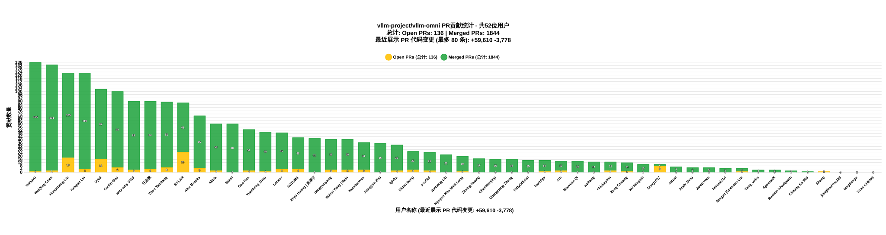
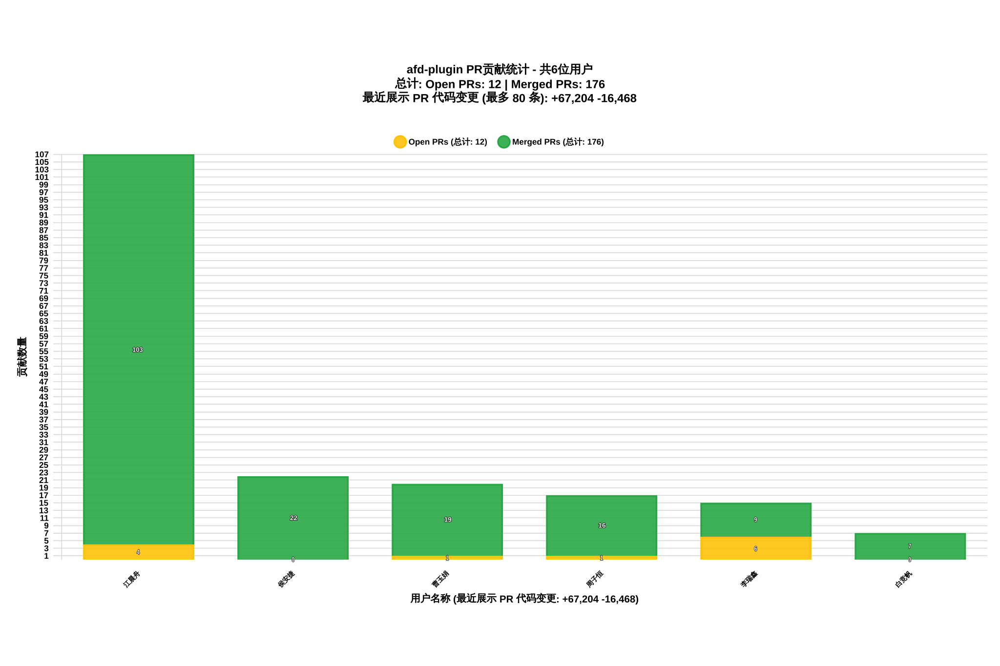
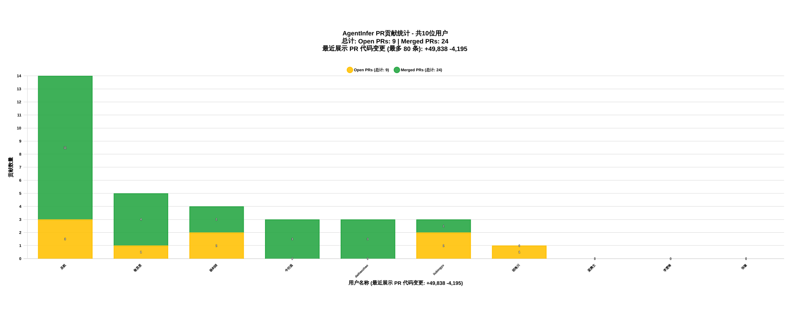

# Enhanced GitHub Stats Report - vllm-project/vllm-omni

Generated on: 2026-10-10 03:59:06 UTC

**统计范围**: vllm-project/vllm-omni 仓库的完整 PR 计数；代码变更统计覆盖最近展示的 最多 80 个 PR。

[vLLM-Omni dashboard](stats_dashboard_vllm_omni.html)

---

这是根据在 **vllm-project/vllm-omni** 仓库中的 PR 贡献（Merged PRs + Open PRs）进行的排序。

总共追踪了 52 个用户；Open/Merged PR 数为完整搜索计数，代码变更统计覆盖最近展示的最多 80 个 PR。

**最近展示 PR 代码变更统计**: +62,419 行添加, -6,560 行删除

## 按归属统计

| 归属 | 用户数 | Total PRs | Open PRs | Merged PRs | Recent Additions | Recent Deletions |
| ---- | ------ | --------- | -------- | ---------- | ---------------- | ---------------- |
| HUAWEI | 37 | 1222 | 70 | 1152 | 36,018 | 1,702 |
| 阿里PAI | 3 | 129 | 18 | 111 | 15,981 | 1,498 |
| 蚂蚁 | 1 | 3 | 0 | 3 | 0 | 0 |
| 小米 | 1 | 14 | 0 | 14 | 0 | 0 |
| 智谱 | 1 | 6 | 0 | 6 | 0 | 0 |
| Committer | 17 | 1232 | 101 | 1131 | 38,800 | 5,651 |

## Last Release Contributions

区间: [v0.28.0...v0.30.0](https://github.com/vllm-project/vllm-omni/compare/v0.28.0...v0.30.0)  
时间: 2026-08-31 16:19:18 UTC -> 2026-09-25 18:20:49 UTC

Tracked commits: 155/504; Tracked reviews: 1,354/2,072; Tracked code delta: +160,071/-79,804; Merged PRs in window: 535

Scoring: Contribution score = 20% commit share + 35% review share + 45% code churn share, where code churn is additions + deletions. Commit share reflects delivery, review share reflects quality influence, and code churn linearly reflects change scale.

| Affiliation | Contribution | Commits | Reviews | Reviewed PRs | Additions | Deletions | Code Lines |
| ---- | ------------ | ------- | ------- | ------------ | --------- | --------- | ---------- |
| HUAWEI | 55.5% | 107 | 987 | 300 | 111,267 | 69,401 | 180,668 |
| Committer | 39.6% | 86 | 977 | 376 | 78,397 | 13,782 | 92,179 |
| 阿里PAI | 4.9% | 12 | 62 | 16 | 15,181 | 2,024 | 17,205 |
| 蚂蚁 | 0.0% | 0 | 0 | 0 | 0 | 0 | 0 |
| 小米 | 0.0% | 0 | 0 | 0 | 0 | 0 | 0 |
| 智谱 | 0.0% | 0 | 0 | 0 | 0 | 0 | 0 |

| User | Labels | Contribution | Commits | Reviews | Reviewed PRs | Additions | Deletions | Code Lines |
| ---- | ------ | ------------ | ------- | ------- | ------------ | --------- | --------- | ---------- |
| @chickeyton | HUAWEI | 16.3% | 6 | 63 | 4 | 35,408 | 38,708 | 74,116 |
| @hsliuustc0106 | HUAWEI, Committer | 10.0% | 11 | 242 | 101 | 11,718 | 665 | 12,383 |
| @linyueqian | Committer | 9.8% | 11 | 159 | 105 | 16,838 | 5,756 | 22,594 |
| @yenuo26 | HUAWEI | 9.4% | 16 | 99 | 38 | 9,246 | 16,228 | 25,474 |
| @Sy0307 | 阿里PAI, Committer | 6.4% | 12 | 62 | 16 | 15,181 | 2,024 | 17,205 |
| @tzhouam | HUAWEI, Committer | 5.6% | 10 | 62 | 19 | 11,807 | 2,494 | 14,301 |
| @Gaohan123 | HUAWEI, Committer | 5.5% | 4 | 184 | 105 | 948 | 59 | 1,007 |
| @lishunyang12 | Committer | 4.5% | 6 | 69 | 58 | 8,258 | 2,126 | 10,384 |
| @david6666666 | HUAWEI, Committer | 3.7% | 11 | 58 | 28 | 4,172 | 144 | 4,316 |
| @NumberWan | HUAWEI | 3.6% | 10 | 17 | 7 | 9,178 | 702 | 9,880 |
| @amy-why-3459 | HUAWEI | 3.5% | 2 | 77 | 45 | 5,868 | 690 | 6,558 |
| @princepride | Committer | 3.2% | 9 | 34 | 18 | 5,714 | 260 | 5,974 |
| @psv666 | HUAWEI | 3.0% | 9 | 12 | 4 | 6,576 | 1,780 | 8,356 |
| @natureofnature | HUAWEI | 3.0% | 8 | 17 | 12 | 5,228 | 2,961 | 8,189 |
| @fhfuih | HUAWEI | 2.3% | 4 | 36 | 9 | 4,102 | 583 | 4,685 |
| @SamitHuang | HUAWEI, Committer | 1.6% | 2 | 43 | 14 | 948 | 17 | 965 |
| @congw729 | HUAWEI | 1.0% | 3 | 19 | 17 | 434 | 316 | 750 |
| @fake0fan | HUAWEI | 1.0% | 2 | 7 | 1 | 1,137 | 1,803 | 2,940 |
| @zengchuang-hw | HUAWEI | 0.9% | 4 | 9 | 1 | 887 | 131 | 1,018 |
| @herotai214 | HUAWEI | 0.9% | 1 | 0 | 0 | 2,437 | 1,744 | 4,181 |
| @alex-jw-brooks | Committer | 0.9% | 4 | 12 | 9 | 252 | 96 | 348 |
| @yuanheng-zhao | Committer | 0.9% | 2 | 7 | 4 | 2,119 | 75 | 2,194 |
| @gcanlin | Committer | 0.8% | 3 | 11 | 9 | 433 | 66 | 499 |
| @wtomin | HUAWEI, Committer | 0.5% | 0 | 21 | 7 | 0 | 0 | 0 |
| @Dong1017 | HUAWEI | 0.5% | 1 | 14 | 8 | 16 | 2 | 18 |
| @Bounty-hunter | HUAWEI | 0.4% | 1 | 7 | 6 | 257 | 113 | 370 |
| @RuixiangMa | Committer | 0.3% | 0 | 13 | 13 | 0 | 0 | 0 |
| @TaffyOfficial | HUAWEI | 0.3% | 1 | 0 | 0 | 716 | 254 | 970 |
| @AndyZhou952 | HUAWEI | 0.2% | 1 | 0 | 0 | 184 | 7 | 191 |
| @Isotr0py | Committer | 0.1% | 1 | 0 | 0 | 9 | 0 | 9 |

## Current Release Contributions

区间: [v0.30.0...main](https://github.com/vllm-project/vllm-omni/compare/v0.30.0...main)  
时间: 2026-09-25 18:20:49 UTC -> 2026-10-10 03:19:40 UTC

Tracked commits: 67/208; Tracked reviews: 374/619; Tracked code delta: +67,843/-7,789; Merged PRs in window: 229

Scoring: Contribution score = 20% commit share + 35% review share + 45% code churn share, where code churn is additions + deletions. Commit share reflects delivery, review share reflects quality influence, and code churn linearly reflects change scale.

| Affiliation | Contribution | Commits | Reviews | Reviewed PRs | Additions | Deletions | Code Lines |
| ---- | ------------ | ------- | ------- | ------------ | --------- | --------- | ---------- |
| Committer | 50.0% | 46 | 270 | 122 | 49,579 | 5,396 | 54,975 |
| HUAWEI | 26.9% | 26 | 173 | 83 | 21,185 | 3,142 | 24,327 |
| 阿里PAI | 23.1% | 15 | 89 | 29 | 33,194 | 1,867 | 35,061 |
| 蚂蚁 | 0.0% | 0 | 0 | 0 | 0 | 0 | 0 |
| 小米 | 0.0% | 0 | 0 | 0 | 0 | 0 | 0 |
| 智谱 | 0.0% | 0 | 0 | 0 | 0 | 0 | 0 |

| User | Labels | Contribution | Commits | Reviews | Reviewed PRs | Additions | Deletions | Code Lines |
| ---- | ------ | ------------ | ------- | ------- | ------------ | --------- | --------- | ---------- |
| @Sy0307 | 阿里PAI, Committer | 33.7% | 15 | 89 | 29 | 33,194 | 1,867 | 35,061 |
| @linyueqian | Committer | 12.1% | 14 | 46 | 30 | 5,319 | 705 | 6,024 |
| @amy-why-3459 | HUAWEI | 8.4% | 7 | 38 | 25 | 4,397 | 310 | 4,707 |
| @NumberWan | HUAWEI | 7.3% | 2 | 19 | 2 | 8,204 | 142 | 8,346 |
| @princepride | Committer | 5.1% | 3 | 31 | 20 | 2,092 | 39 | 2,131 |
| @hsliuustc0106 | HUAWEI, Committer | 4.8% | 2 | 44 | 32 | 35 | 27 | 62 |
| @gcanlin | Committer | 4.2% | 3 | 5 | 3 | 3,154 | 1,695 | 4,849 |
| @Dong1017 | HUAWEI | 3.8% | 4 | 15 | 7 | 2,001 | 63 | 2,064 |
| @chickeyton | HUAWEI | 3.6% | 2 | 1 | 1 | 3,214 | 1,738 | 4,952 |
| @tzhouam | HUAWEI, Committer | 2.9% | 1 | 5 | 4 | 2,886 | 722 | 3,608 |
| @lishunyang12 | Committer | 2.7% | 2 | 7 | 4 | 2,184 | 200 | 2,384 |
| @alex-jw-brooks | Committer | 2.1% | 3 | 10 | 9 | 383 | 138 | 521 |
| @yenuo26 | HUAWEI | 1.6% | 2 | 9 | 9 | 151 | 36 | 187 |
| @david6666666 | HUAWEI, Committer | 1.4% | 2 | 9 | 4 | 0 | 0 | 0 |
| @natureofnature | HUAWEI | 1.3% | 1 | 9 | 9 | 116 | 69 | 185 |
| @congw729 | HUAWEI | 1.0% | 1 | 6 | 4 | 130 | 30 | 160 |
| @SamitHuang | HUAWEI, Committer | 0.8% | 0 | 9 | 3 | 0 | 0 | 0 |
| @Isotr0py | Committer | 0.7% | 1 | 2 | 2 | 332 | 3 | 335 |
| @psv666 | HUAWEI | 0.6% | 2 | 0 | 0 | 51 | 5 | 56 |
| @RuixiangMa | Committer | 0.6% | 0 | 6 | 6 | 0 | 0 | 0 |
| @Bounty-hunter | HUAWEI | 0.5% | 0 | 5 | 2 | 0 | 0 | 0 |
| @yuanheng-zhao | Committer | 0.5% | 0 | 5 | 4 | 0 | 0 | 0 |
| @Gaohan123 | HUAWEI, Committer | 0.2% | 0 | 2 | 1 | 0 | 0 | 0 |
| @fhfuih | HUAWEI | 0.1% | 0 | 1 | 1 | 0 | 0 | 0 |
| @knlnguyen1802 | HUAWEI | 0.1% | 0 | 1 | 1 | 0 | 0 | 0 |

### 👤 wangyu (@yenuo26) - HUAWEI - 总贡献: 138
**最近展示 PR 代码变更**: +637 行添加, -267 行删除

**Pull Requests (2 open, 136 merged; up to 10 newest per state shown)**
| Title | Repository | State | Created | Merged | Additions | Deletions |
| ----- | ---------- | ----- | ------- | ------ | --------- | --------- |
| [[Test] Route hardware-platform marks through hardware_test](https://github.com/vllm-project/vllm-omni/pull/8708) | [vllm-project/vllm-omni](https://github.com/vllm-project/vllm-omni) | `open` | 2026-10-10 | - | 486 | 231 |
| [[CI/Build] Move premerge CPU jobs to the medium queue and retune nightly/weekly suites](https://github.com/vllm-project/vllm-omni/pull/8616) | [vllm-project/vllm-omni](https://github.com/vllm-project/vllm-omni) | `merged` | 2026-10-08 | 2026-10-08 08:26:59 UTC | 15 | 15 |
| [[CI/Build] Split long weekly TTS jobs and route slow full-model cases to nightly](https://github.com/vllm-project/vllm-omni/pull/8239) | [vllm-project/vllm-omni](https://github.com/vllm-project/vllm-omni) | `merged` | 2026-09-28 | 2026-09-30 09:08:25 UTC | 136 | 21 |
| [[Bugfix] Restore torch default device between tests](https://github.com/vllm-project/vllm-omni/pull/8157) | [vllm-project/vllm-omni](https://github.com/vllm-project/vllm-omni) | `merged` | 2026-09-25 | - | — | — |
| [[CI/Build][Bugfix] Cover corrupt chat audio data URLs on Qwen3-Omni](https://github.com/vllm-project/vllm-omni/pull/8108) | [vllm-project/vllm-omni](https://github.com/vllm-project/vllm-omni) | `merged` | 2026-09-24 | - | — | — |
| [[CI/Build] Move Breeze-TTS-2 voice design e2e to weekly](https://github.com/vllm-project/vllm-omni/pull/8032) | [vllm-project/vllm-omni](https://github.com/vllm-project/vllm-omni) | `merged` | 2026-09-23 | - | — | — |
| [[CI/Build] Promote LingBot-Video dense smoke to ready/merge and wire L4 expansion](https://github.com/vllm-project/vllm-omni/pull/7892) | [vllm-project/vllm-omni](https://github.com/vllm-project/vllm-omni) | `merged` | 2026-09-20 | - | — | — |
| [[CI/Build] Retarget skipped HiDream and MammothModa2 E2E tests to current issues](https://github.com/vllm-project/vllm-omni/pull/7755) | [vllm-project/vllm-omni](https://github.com/vllm-project/vllm-omni) | `merged` | 2026-09-18 | - | — | — |
| [[CI][Perf] migrate diffusion DFX benches to vllm bench serve --omni](https://github.com/vllm-project/vllm-omni/pull/7737) | [vllm-project/vllm-omni](https://github.com/vllm-project/vllm-omni) | `merged` | 2026-09-17 | - | — | — |
| [[Misc] Remove Dynin-Omni and dots.tts support](https://github.com/vllm-project/vllm-omni/pull/7655) | [vllm-project/vllm-omni](https://github.com/vllm-project/vllm-omni) | `merged` | 2026-09-16 | - | — | — |
| [[Bugfix] Isolate weekly CPU tests from inherited attention env and hf_api mocks](https://github.com/vllm-project/vllm-omni/pull/7565) | [vllm-project/vllm-omni](https://github.com/vllm-project/vllm-omni) | `merged` | 2026-09-15 | - | — | — |
| [[Skills] Add agent skills for local nightly test and test report generation](https://github.com/vllm-project/vllm-omni/pull/4722) | [vllm-project/vllm-omni](https://github.com/vllm-project/vllm-omni) | `open` | 2026-06-25 | - | — | — |
| **Total for wangyu** | | | | - | **637** | **267** |

### 👤 WeiQing Chen (@david6666666) - HUAWEI, Committer - 总贡献: 133
**最近展示 PR 代码变更**: +0 行添加, -0 行删除

**Pull Requests (1 open, 132 merged; up to 10 newest per state shown)**
| Title | Repository | State | Created | Merged | Additions | Deletions |
| ----- | ---------- | ----- | ------- | ------ | --------- | --------- |
| [[Doc] Update vLLM-Omni WeChat QR code](https://github.com/vllm-project/vllm-omni/pull/8608) | [vllm-project/vllm-omni](https://github.com/vllm-project/vllm-omni) | `merged` | 2026-10-08 | 2026-10-09 04:26:13 UTC | 0 | 0 |
| [[Doc] Update vLLM-Omni WeChat QR code](https://github.com/vllm-project/vllm-omni/pull/8301) | [vllm-project/vllm-omni](https://github.com/vllm-project/vllm-omni) | `merged` | 2026-09-29 | 2026-09-30 03:39:06 UTC | 0 | 0 |
| [[Bugfix][MiniMax-H3] Fix Hopper keyframe and modulation precision](https://github.com/vllm-project/vllm-omni/pull/7913) | [vllm-project/vllm-omni](https://github.com/vllm-project/vllm-omni) | `merged` | 2026-09-21 | - | — | — |
| [[Doc] Update vLLM-Omni WeChat QR code](https://github.com/vllm-project/vllm-omni/pull/7911) | [vllm-project/vllm-omni](https://github.com/vllm-project/vllm-omni) | `merged` | 2026-09-21 | - | — | — |
| [[Bugfix][MiniMax-H3] Use Hopper-safe modulation precision](https://github.com/vllm-project/vllm-omni/pull/7693) | [vllm-project/vllm-omni](https://github.com/vllm-project/vllm-omni) | `merged` | 2026-09-17 | - | — | — |
| [[CI][bugfix] Fix MiniMax H3 FP8 quality test remote-code loading](https://github.com/vllm-project/vllm-omni/pull/7617) | [vllm-project/vllm-omni](https://github.com/vllm-project/vllm-omni) | `merged` | 2026-09-16 | - | — | — |
| [[Diffusion][Model] Add direct FastH3 8-Step V2 checkpoint loading](https://github.com/vllm-project/vllm-omni/pull/7610) | [vllm-project/vllm-omni](https://github.com/vllm-project/vllm-omni) | `merged` | 2026-09-16 | - | — | — |
| [[Doc] Update vLLM-Omni WeChat QR code](https://github.com/vllm-project/vllm-omni/pull/7490) | [vllm-project/vllm-omni](https://github.com/vllm-project/vllm-omni) | `merged` | 2026-09-14 | - | — | — |
| [[Bugfix] Keep MiniMax-H3 reference audio budgets separate](https://github.com/vllm-project/vllm-omni/pull/7281) | [vllm-project/vllm-omni](https://github.com/vllm-project/vllm-omni) | `merged` | 2026-09-08 | - | — | — |
| [[Bugfix][MiniMax-H3] Stabilize keyframe VAE encoding](https://github.com/vllm-project/vllm-omni/pull/7191) | [vllm-project/vllm-omni](https://github.com/vllm-project/vllm-omni) | `merged` | 2026-09-07 | - | — | — |
| [[Feature] Add Sol-Attn sparse attention backend for MiniMax H3](https://github.com/vllm-project/vllm-omni/pull/5851) | [vllm-project/vllm-omni](https://github.com/vllm-project/vllm-omni) | `open` | 2026-08-06 | - | — | — |
| **Total for WeiQing Chen** | | | | - | **0** | **0** |

### 👤 Yueqian Lin (@linyueqian) - Committer - 总贡献: 129
**最近展示 PR 代码变更**: +4,449 行添加, -798 行删除

**Pull Requests (5 open, 124 merged; up to 10 newest per state shown)**
| Title | Repository | State | Created | Merged | Additions | Deletions |
| ----- | ---------- | ----- | ------- | ------ | --------- | --------- |
| [[Bugfix][Qwen3-TTS] Always send ref_audio so an evicted engine artifact cannot kill the engine](https://github.com/vllm-project/vllm-omni/pull/8697) | [vllm-project/vllm-omni](https://github.com/vllm-project/vllm-omni) | `open` | 2026-10-09 | - | 343 | 330 |
| [[Perf][Engine] Make event-driven orchestration the default for all pipelines](https://github.com/vllm-project/vllm-omni/pull/8675) | [vllm-project/vllm-omni](https://github.com/vllm-project/vllm-omni) | `open` | 2026-10-09 | - | 183 | 169 |
| [[Perf][PersonaPlex] Send one codec frame per audio chunk](https://github.com/vllm-project/vllm-omni/pull/8662) | [vllm-project/vllm-omni](https://github.com/vllm-project/vllm-omni) | `merged` | 2026-10-09 | 2026-10-09 07:39:58 UTC | 4 | 3 |
| [[Bugfix][Test] Keep the PersonaPlex load driver on the capture clock](https://github.com/vllm-project/vllm-omni/pull/8650) | [vllm-project/vllm-omni](https://github.com/vllm-project/vllm-omni) | `merged` | 2026-10-08 | 2026-10-09 07:56:03 UTC | 41 | 3 |
| [[RFC][Qwen3-TTS] Streamed text input and a text lead for running requests](https://github.com/vllm-project/vllm-omni/pull/8621) | [vllm-project/vllm-omni](https://github.com/vllm-project/vllm-omni) | `open` | 2026-10-08 | - | 413 | 3 |
| [[Feature][Qwen3-TTS] Return the codec frames code2wav decodes as a client output](https://github.com/vllm-project/vllm-omni/pull/8619) | [vllm-project/vllm-omni](https://github.com/vllm-project/vllm-omni) | `merged` | 2026-10-08 | 2026-10-08 18:00:28 UTC | 40 | 1 |
| [[Bugfix][MiniCPM-o] Apply the Talker's 16-frame codec penalty on MRv2](https://github.com/vllm-project/vllm-omni/pull/8576) | [vllm-project/vllm-omni](https://github.com/vllm-project/vllm-omni) | `merged` | 2026-10-07 | 2026-10-08 16:56:29 UTC | 86 | 16 |
| [[Bugfix][Qwen3-TTS] Bound CustomVoice/VoiceDesign codec budgets by input length](https://github.com/vllm-project/vllm-omni/pull/8569) | [vllm-project/vllm-omni](https://github.com/vllm-project/vllm-omni) | `open` | 2026-10-06 | - | 323 | 45 |
| [[Bugfix][Qwen3-Omni] Default the talker voice to Ethan](https://github.com/vllm-project/vllm-omni/pull/8568) | [vllm-project/vllm-omni](https://github.com/vllm-project/vllm-omni) | `merged` | 2026-10-06 | 2026-10-08 00:07:54 UTC | 58 | 2 |
| [[Bugfix] Report sample rate and channels for streamed speech PCM](https://github.com/vllm-project/vllm-omni/pull/8567) | [vllm-project/vllm-omni](https://github.com/vllm-project/vllm-omni) | `merged` | 2026-10-06 | 2026-10-08 00:07:49 UTC | 575 | 91 |
| [[Bugfix] Update routed-expert tests for native auxiliary output](https://github.com/vllm-project/vllm-omni/pull/8500) | [vllm-project/vllm-omni](https://github.com/vllm-project/vllm-omni) | `merged` | 2026-10-05 | 2026-10-05 09:40:08 UTC | 5 | 15 |
| [[Bugfix] Wire output buffers into duplex model test harnesses](https://github.com/vllm-project/vllm-omni/pull/8489) | [vllm-project/vllm-omni](https://github.com/vllm-project/vllm-omni) | `merged` | 2026-10-04 | 2026-10-04 23:55:20 UTC | 40 | 6 |
| [[Perf][AuK] Opt-in FP8 GEMMs for the DiT block linears](https://github.com/vllm-project/vllm-omni/pull/8442) | [vllm-project/vllm-omni](https://github.com/vllm-project/vllm-omni) | `merged` | 2026-10-02 | 2026-10-08 17:47:08 UTC | 701 | 1 |
| [[Perf][PersonaPlex] Batch live duplex appends and replay Mimi codec frames from CUDA graphs](https://github.com/vllm-project/vllm-omni/pull/8356) | [vllm-project/vllm-omni](https://github.com/vllm-project/vllm-omni) | `merged` | 2026-10-01 | 2026-10-07 00:05:08 UTC | 1,637 | 113 |
| [[BugFix] CosyVoice3: honor the weights iterator in load_weights](https://github.com/vllm-project/vllm-omni/pull/6738) | [vllm-project/vllm-omni](https://github.com/vllm-project/vllm-omni) | `open` | 2026-08-29 | - | — | — |
| **Total for Yueqian Lin** | | | | - | **4,449** | **798** |

### 👤 Hongsheng Liu (@hsliuustc0106) - HUAWEI, Committer - 总贡献: 125
**最近展示 PR 代码变更**: +774 行添加, -11 行删除

**Pull Requests (20 open, 105 merged; up to 10 newest per state shown)**
| Title | Repository | State | Created | Merged | Additions | Deletions |
| ----- | ---------- | ----- | ------- | ------ | --------- | --------- |
| [[Doc] Update README slides link to v0.30.0 release](https://github.com/vllm-project/vllm-omni/pull/8695) | [vllm-project/vllm-omni](https://github.com/vllm-project/vllm-omni) | `open` | 2026-10-09 | - | 1 | 1 |
| [[CI/Build] Add CodeQL analysis in a single job](https://github.com/vllm-project/vllm-omni/pull/8673) | [vllm-project/vllm-omni](https://github.com/vllm-project/vllm-omni) | `open` | 2026-10-09 | - | 27 | 0 |
| [[Doc] Add new technical report to README](https://github.com/vllm-project/vllm-omni/pull/8609) | [vllm-project/vllm-omni](https://github.com/vllm-project/vllm-omni) | `merged` | 2026-10-08 | 2026-10-08 02:01:44 UTC | 10 | 2 |
| [[Doc][Model] Document sequence parallelism for Boogu-Image](https://github.com/vllm-project/vllm-omni/pull/8421) | [vllm-project/vllm-omni](https://github.com/vllm-project/vllm-omni) | `open` | 2026-10-02 | - | 49 | 3 |
| [[Docs] Consolidate repository-owned review helpers and backends](https://github.com/vllm-project/vllm-omni/pull/8410) | [vllm-project/vllm-omni](https://github.com/vllm-project/vllm-omni) | `open` | 2026-10-02 | - | 687 | 5 |
| [[Doc] Update README and docs for v0.30.0](https://github.com/vllm-project/vllm-omni/pull/8175) | [vllm-project/vllm-omni](https://github.com/vllm-project/vllm-omni) | `merged` | 2026-09-26 | - | — | — |
| [[Skills] Add platform-optimization-inheritance reference to add-diffusion-model](https://github.com/vllm-project/vllm-omni/pull/7526) | [vllm-project/vllm-omni](https://github.com/vllm-project/vllm-omni) | `open` | 2026-09-14 | - | — | — |
| [[Bugfix][Frontend] Honor output_compression on the image generations route](https://github.com/vllm-project/vllm-omni/pull/7447) | [vllm-project/vllm-omni](https://github.com/vllm-project/vllm-omni) | `merged` | 2026-09-12 | - | — | — |
| [[Doc] Add AI usage policy for contributions](https://github.com/vllm-project/vllm-omni/pull/7305) | [vllm-project/vllm-omni](https://github.com/vllm-project/vllm-omni) | `merged` | 2026-09-09 | - | — | — |
| [[Core] Add explicit HWR registration bypass and progress logs](https://github.com/vllm-project/vllm-omni/pull/7147) | [vllm-project/vllm-omni](https://github.com/vllm-project/vllm-omni) | `open` | 2026-09-06 | - | — | — |
| [[Misc] Add standalone safetensors retention diagnostic](https://github.com/vllm-project/vllm-omni/pull/7145) | [vllm-project/vllm-omni](https://github.com/vllm-project/vllm-omni) | `merged` | 2026-09-06 | - | — | — |
| [[Core] Expose HWR payload validation in diffusion startup](https://github.com/vllm-project/vllm-omni/pull/7144) | [vllm-project/vllm-omni](https://github.com/vllm-project/vllm-omni) | `open` | 2026-09-06 | - | — | — |
| [[Core] Add opt-in serialized HWR build admission](https://github.com/vllm-project/vllm-omni/pull/7140) | [vllm-project/vllm-omni](https://github.com/vllm-project/vllm-omni) | `open` | 2026-09-06 | - | — | — |
| [[Core] Add explicit cleanup for quarantined HWR artifacts](https://github.com/vllm-project/vllm-omni/pull/7133) | [vllm-project/vllm-omni](https://github.com/vllm-project/vllm-omni) | `open` | 2026-09-06 | - | — | — |
| [[Bugfix] Skip HWR store-size scans when no limit is configured](https://github.com/vllm-project/vllm-omni/pull/7131) | [vllm-project/vllm-omni](https://github.com/vllm-project/vllm-omni) | `merged` | 2026-09-06 | - | — | — |
| [[Bugfix] Bound HWR domain initialization lock waits](https://github.com/vllm-project/vllm-omni/pull/7128) | [vllm-project/vllm-omni](https://github.com/vllm-project/vllm-omni) | `merged` | 2026-09-06 | - | — | — |
| [[Bugfix] Escalate diffusion worker shutdown and retain survivors](https://github.com/vllm-project/vllm-omni/pull/7126) | [vllm-project/vllm-omni](https://github.com/vllm-project/vllm-omni) | `merged` | 2026-09-06 | - | — | — |
| [[Doc] Update README and docs for v0.28.0](https://github.com/vllm-project/vllm-omni/pull/6858) | [vllm-project/vllm-omni](https://github.com/vllm-project/vllm-omni) | `merged` | 2026-08-31 | - | — | — |
| [[Skills] Add perf-evidence isolation, stage-attribution, and realtime-contract requirements](https://github.com/vllm-project/vllm-omni/pull/6820) | [vllm-project/vllm-omni](https://github.com/vllm-project/vllm-omni) | `merged` | 2026-08-30 | - | — | — |
| [[Core] Add central OffloadPlan resolver](https://github.com/vllm-project/vllm-omni/pull/6721) | [vllm-project/vllm-omni](https://github.com/vllm-project/vllm-omni) | `open` | 2026-08-28 | - | — | — |
| **Total for Hongsheng Liu** | | | | - | **774** | **11** |

### 👤 Sy03 (@Sy0307) - 阿里PAI, Committer - 总贡献: 105
**最近展示 PR 代码变更**: +15,981 行添加, -1,498 行删除

**Pull Requests (18 open, 87 merged; up to 10 newest per state shown)**
| Title | Repository | State | Created | Merged | Additions | Deletions |
| ----- | ---------- | ----- | ------- | ------ | --------- | --------- |
| [[Frontend] Reduce API server output and request overhead](https://github.com/vllm-project/vllm-omni/pull/8703) | [vllm-project/vllm-omni](https://github.com/vllm-project/vllm-omni) | `open` | 2026-10-09 | - | 1,106 | 286 |
| [[Model] Speed up Qwen3-TTS high-concurrency serving on CUDA MRv2](https://github.com/vllm-project/vllm-omni/pull/8674) | [vllm-project/vllm-omni](https://github.com/vllm-project/vllm-omni) | `open` | 2026-10-09 | - | 4,137 | 287 |
| [[Core] Reduce MOSS-TTS Local serving overhead](https://github.com/vllm-project/vllm-omni/pull/8667) | [vllm-project/vllm-omni](https://github.com/vllm-project/vllm-omni) | `open` | 2026-10-09 | - | 1,483 | 152 |
| [[Core] Reduce cross-stage CPU transfer overhead with shared-memory rings](https://github.com/vllm-project/vllm-omni/pull/8516) | [vllm-project/vllm-omni](https://github.com/vllm-project/vllm-omni) | `open` | 2026-10-05 | - | 1,372 | 32 |
| [[Bugfix] Do not assume a stream decoder in MRv2 eager-MTP preprocess](https://github.com/vllm-project/vllm-omni/pull/8484) | [vllm-project/vllm-omni](https://github.com/vllm-project/vllm-omni) | `merged` | 2026-10-04 | 2026-10-05 13:29:38 UTC | 8 | 2 |
| [[Model] Batch Qwen3-TTS Talker prompt projection and settled-row preprocessing](https://github.com/vllm-project/vllm-omni/pull/8477) | [vllm-project/vllm-omni](https://github.com/vllm-project/vllm-omni) | `merged` | 2026-10-04 | 2026-10-04 05:08:25 UTC | 357 | 49 |
| [[Model] Default MOSS Local 1.5 to adaptive CUDA MRV2 with MPS](https://github.com/vllm-project/vllm-omni/pull/8438) | [vllm-project/vllm-omni](https://github.com/vllm-project/vllm-omni) | `merged` | 2026-10-02 | 2026-10-06 15:20:46 UTC | 808 | 152 |
| [[Model] Select CosyVoice3 streaming defaults by device capability](https://github.com/vllm-project/vllm-omni/pull/8433) | [vllm-project/vllm-omni](https://github.com/vllm-project/vllm-omni) | `merged` | 2026-10-02 | 2026-10-04 04:59:37 UTC | 117 | 44 |
| [[Bugfix][Frontend] Share the runtime voice registry across API processes](https://github.com/vllm-project/vllm-omni/pull/8424) | [vllm-project/vllm-omni](https://github.com/vllm-project/vllm-omni) | `open` | 2026-10-02 | - | 404 | 63 |
| [[Bugfix] Restore Fish Speech and CosyVoice3 audio quality at high concurrency](https://github.com/vllm-project/vllm-omni/pull/8422) | [vllm-project/vllm-omni](https://github.com/vllm-project/vllm-omni) | `merged` | 2026-10-02 | 2026-10-02 14:11:04 UTC | 270 | 47 |
| [[Model] Optimize CosyVoice3 packed streaming with bounded HiFT graphs](https://github.com/vllm-project/vllm-omni/pull/8420) | [vllm-project/vllm-omni](https://github.com/vllm-project/vllm-omni) | `merged` | 2026-10-02 | 2026-10-02 15:49:51 UTC | 178 | 4 |
| [[Model] YuE2: async single-stage synthesis and CUDA graph acceleration](https://github.com/vllm-project/vllm-omni/pull/8407) | [vllm-project/vllm-omni](https://github.com/vllm-project/vllm-omni) | `merged` | 2026-10-01 | 2026-10-02 12:17:07 UTC | 2,176 | 290 |
| [[Model] Add single-stage Qwen3-TTS with in-Talker streaming codec decode](https://github.com/vllm-project/vllm-omni/pull/8259) | [vllm-project/vllm-omni](https://github.com/vllm-project/vllm-omni) | `merged` | 2026-09-28 | 2026-10-02 11:34:30 UTC | 3,565 | 90 |
| [[Model] Enable Higgs Audio v3 MRV2 streaming and fix mixed-prefill capture bounds](https://github.com/vllm-project/vllm-omni/pull/8226) | [vllm-project/vllm-omni](https://github.com/vllm-project/vllm-omni) | `merged` | 2026-09-28 | - | — | — |
| [[Model] Add opt-in packed Flow and batched HiFT inference for CosyVoice3](https://github.com/vllm-project/vllm-omni/pull/8224) | [vllm-project/vllm-omni](https://github.com/vllm-project/vllm-omni) | `merged` | 2026-09-28 | - | — | — |
| [[Model] Add Gander full-duplex dialogue and context support](https://github.com/vllm-project/vllm-omni/pull/7346) | [vllm-project/vllm-omni](https://github.com/vllm-project/vllm-omni) | `open` | 2026-09-09 | - | — | — |
| [[Full duplex][Core] Unify transactional KV append for native duplex sessions](https://github.com/vllm-project/vllm-omni/pull/7294) | [vllm-project/vllm-omni](https://github.com/vllm-project/vllm-omni) | `open` | 2026-09-08 | - | — | — |
| [[Perf][TTS] Add deadline-aware audio scheduling](https://github.com/vllm-project/vllm-omni/pull/6600) | [vllm-project/vllm-omni](https://github.com/vllm-project/vllm-omni) | `open` | 2026-08-25 | - | — | — |
| [[Perf][Qwen3-TTS] Enable chunk ramp by default](https://github.com/vllm-project/vllm-omni/pull/6586) | [vllm-project/vllm-omni](https://github.com/vllm-project/vllm-omni) | `open` | 2026-08-24 | - | — | — |
| [[Model] Optimize MiniMax Music 3 acoustic inference](https://github.com/vllm-project/vllm-omni/pull/6242) | [vllm-project/vllm-omni](https://github.com/vllm-project/vllm-omni) | `open` | 2026-08-16 | - | — | — |
| **Total for Sy03** | | | | - | **15,981** | **1,498** |

### 👤 Canlin Guo (@gcanlin) - Committer - 总贡献: 101
**最近展示 PR 代码变更**: +3,124 行添加, -2,443 行删除

**Pull Requests (5 open, 96 merged; up to 10 newest per state shown)**
| Title | Repository | State | Created | Merged | Additions | Deletions |
| ----- | ---------- | ----- | ------- | ------ | --------- | --------- |
| [[Model] Consolidate MOSS-TTS Local 1.5 deploy configuration](https://github.com/vllm-project/vllm-omni/pull/8704) | [vllm-project/vllm-omni](https://github.com/vllm-project/vllm-omni) | `open` | 2026-10-09 | - | 241 | 693 |
| [[Model][Frontend] Preserve MOSS-TTS interleaved audio through PCM encoding](https://github.com/vllm-project/vllm-omni/pull/8702) | [vllm-project/vllm-omni](https://github.com/vllm-project/vllm-omni) | `open` | 2026-10-09 | - | 135 | 35 |
| [[Model] Reduce MOSS-TTS codec streaming state memory](https://github.com/vllm-project/vllm-omni/pull/8701) | [vllm-project/vllm-omni](https://github.com/vllm-project/vllm-omni) | `open` | 2026-10-09 | - | 347 | 91 |
| [[MOSS-TTS] Fast pcm convert and first-frame codec in stage0](https://github.com/vllm-project/vllm-omni/pull/8640) | [vllm-project/vllm-omni](https://github.com/vllm-project/vllm-omni) | `merged` | 2026-10-08 | 2026-10-09 10:29:36 UTC | 1,397 | 1,581 |
| [[Kernel] Accelerate MOSS Local depth decoding with QKV lookup and fusion](https://github.com/vllm-project/vllm-omni/pull/8232) | [vllm-project/vllm-omni](https://github.com/vllm-project/vllm-omni) | `merged` | 2026-09-28 | 2026-10-08 12:44:12 UTC | 1,004 | 43 |
| [[CI/Build] Initialize RoPE frequencies in MiniMax H3 TeaCache tests](https://github.com/vllm-project/vllm-omni/pull/8125) | [vllm-project/vllm-omni](https://github.com/vllm-project/vllm-omni) | `merged` | 2026-09-24 | - | — | — |
| [[Bugfix] Avoid waveform-list GC scans and release completed MOSS batches](https://github.com/vllm-project/vllm-omni/pull/7885) | [vllm-project/vllm-omni](https://github.com/vllm-project/vllm-omni) | `merged` | 2026-09-20 | - | — | — |
| [[Frontend] Tune reference cache limits and registered MOSS voice requests](https://github.com/vllm-project/vllm-omni/pull/7883) | [vllm-project/vllm-omni](https://github.com/vllm-project/vllm-omni) | `merged` | 2026-09-20 | - | — | — |
| [[Feature][TTS] MOSS-TTS: place the reference-audio encoder on the code2wav stage's GPU](https://github.com/vllm-project/vllm-omni/pull/7724) | [vllm-project/vllm-omni](https://github.com/vllm-project/vllm-omni) | `merged` | 2026-09-17 | - | — | — |
| [[Kernel] Optimize MOSS codec attention layout and FFN GEMMs](https://github.com/vllm-project/vllm-omni/pull/7407) | [vllm-project/vllm-omni](https://github.com/vllm-project/vllm-omni) | `open` | 2026-09-11 | - | — | — |
| [[Perf] Fuse MiniMax H3 SwiGLU activation](https://github.com/vllm-project/vllm-omni/pull/6283) | [vllm-project/vllm-omni](https://github.com/vllm-project/vllm-omni) | `merged` | 2026-08-17 | - | — | — |
| [[Perf] Fuse MiniMax H3 modulation with FP32 accumulation](https://github.com/vllm-project/vllm-omni/pull/6281) | [vllm-project/vllm-omni](https://github.com/vllm-project/vllm-omni) | `merged` | 2026-08-17 | - | — | — |
| [[BugFix] Use MOSS-TTS-Local official sample params](https://github.com/vllm-project/vllm-omni/pull/6156) | [vllm-project/vllm-omni](https://github.com/vllm-project/vllm-omni) | `merged` | 2026-08-13 | - | — | — |
| [[Feature] Support text encoder Disaggregation for H3](https://github.com/vllm-project/vllm-omni/pull/5885) | [vllm-project/vllm-omni](https://github.com/vllm-project/vllm-omni) | `merged` | 2026-08-07 | - | — | — |
| [[Docs] Add hardware plugin system design docs](https://github.com/vllm-project/vllm-omni/pull/5077) | [vllm-project/vllm-omni](https://github.com/vllm-project/vllm-omni) | `open` | 2026-07-13 | - | — | — |
| **Total for Canlin Guo** | | | | - | **3,124** | **2,443** |

### 👤 amy-why-3459 - HUAWEI - 总贡献: 89
**最近展示 PR 代码变更**: +4,397 行添加, -310 行删除

**Pull Requests (2 open, 87 merged; up to 10 newest per state shown)**
| Title | Repository | State | Created | Merged | Additions | Deletions |
| ----- | ---------- | ----- | ------- | ------ | --------- | --------- |
| [[Bugfix][MiniCPM-o] Fix empty audio in synchronous serving (#8681)](https://github.com/vllm-project/vllm-omni/pull/8692) | [vllm-project/vllm-omni](https://github.com/vllm-project/vllm-omni) | `merged` | 2026-10-09 | 2026-10-10 02:55:17 UTC | 127 | 12 |
| [[CI/Build] Fix CPU groups in distributed VAE test mocks](https://github.com/vllm-project/vllm-omni/pull/8591) | [vllm-project/vllm-omni](https://github.com/vllm-project/vllm-omni) | `merged` | 2026-10-07 | 2026-10-07 16:24:16 UTC | 3 | 2 |
| [[Model] MiniCPM-o 4.5: enable fused CFM body by default on CUDA](https://github.com/vllm-project/vllm-omni/pull/8557) | [vllm-project/vllm-omni](https://github.com/vllm-project/vllm-omni) | `merged` | 2026-10-06 | 2026-10-07 02:25:40 UTC | 48 | 1 |
| [[Core] Defer generation payload host waits to output consumption](https://github.com/vllm-project/vllm-omni/pull/8540) | [vllm-project/vllm-omni](https://github.com/vllm-project/vllm-omni) | `merged` | 2026-10-06 | 2026-10-07 09:20:54 UTC | 350 | 11 |
| [[Model] MiniCPM-o 4.5: add NPU and Code2Wav encoder graphs](https://github.com/vllm-project/vllm-omni/pull/8515) | [vllm-project/vllm-omni](https://github.com/vllm-project/vllm-omni) | `merged` | 2026-10-05 | 2026-10-08 14:53:35 UTC | 3,046 | 259 |
| [[Perf] Add CUDA graphs for MiniCPM-o 4.5 input encoders](https://github.com/vllm-project/vllm-omni/pull/8332) | [vllm-project/vllm-omni](https://github.com/vllm-project/vllm-omni) | `merged` | 2026-09-30 | 2026-10-05 15:01:08 UTC | 789 | 15 |
| [[Bugfix] Defer VoxCPM2 NPU patch to avoid platform import cycle](https://github.com/vllm-project/vllm-omni/pull/8330) | [vllm-project/vllm-omni](https://github.com/vllm-project/vllm-omni) | `merged` | 2026-09-30 | 2026-09-30 12:25:36 UTC | 34 | 10 |
| [[Frontend] Follow up #7585: append-tail retry, playback ack, and image admission](https://github.com/vllm-project/vllm-omni/pull/7743) | [vllm-project/vllm-omni](https://github.com/vllm-project/vllm-omni) | `open` | 2026-09-17 | - | — | — |
| [[Frontend] Add a shared realtime web UI for MiniCPM-o and Qwen3-Omni (#7222)](https://github.com/vllm-project/vllm-omni/pull/7585) | [vllm-project/vllm-omni](https://github.com/vllm-project/vllm-omni) | `merged` | 2026-09-15 | - | — | — |
| [[Benchmark][MiniCPM-o] Port Video-MME dataset support to Omni bench s…](https://github.com/vllm-project/vllm-omni/pull/6987) | [vllm-project/vllm-omni](https://github.com/vllm-project/vllm-omni) | `merged` | 2026-09-03 | - | — | — |
| [[Bugfix][MiniCPM-o] Serve native duplex from shipping YAMLs and fence…](https://github.com/vllm-project/vllm-omni/pull/6619) | [vllm-project/vllm-omni](https://github.com/vllm-project/vllm-omni) | `merged` | 2026-08-25 | - | — | — |
| [[Perf][NPU] Port async Omni output materialization to Ascend AR runner](https://github.com/vllm-project/vllm-omni/pull/5320) | [vllm-project/vllm-omni](https://github.com/vllm-project/vllm-omni) | `open` | 2026-07-22 | - | — | — |
| **Total for amy-why-3459** | | | | - | **4,397** | **310** |

### 👤 汪志鹏 (@princepride) - Committer - 总贡献: 88
**最近展示 PR 代码变更**: +2,152 行添加, -59 行删除

**Pull Requests (4 open, 84 merged; up to 10 newest per state shown)**
| Title | Repository | State | Created | Merged | Additions | Deletions |
| ----- | ---------- | ----- | ------- | ------ | --------- | --------- |
| [[Bugfix] Release diffusion ZMQ resources on loop initialization errors](https://github.com/vllm-project/vllm-omni/pull/8419) | [vllm-project/vllm-omni](https://github.com/vllm-project/vllm-omni) | `open` | 2026-10-02 | - | 60 | 20 |
| [[CI/Build] Restore streaming executor fixture contract](https://github.com/vllm-project/vllm-omni/pull/8418) | [vllm-project/vllm-omni](https://github.com/vllm-project/vllm-omni) | `merged` | 2026-10-02 | 2026-10-02 08:45:57 UTC | 5 | 4 |
| [[Model] Add SheetSage2 preprocessing and YuE2 score handoff](https://github.com/vllm-project/vllm-omni/pull/8371) | [vllm-project/vllm-omni](https://github.com/vllm-project/vllm-omni) | `merged` | 2026-10-01 | 2026-10-05 03:09:38 UTC | 651 | 1 |
| [[Model] Add MiniMax-H3 latent super-resolution and hi-res refinement](https://github.com/vllm-project/vllm-omni/pull/8322) | [vllm-project/vllm-omni](https://github.com/vllm-project/vllm-omni) | `merged` | 2026-09-30 | 2026-10-01 06:24:41 UTC | 1,436 | 34 |
| [[Misc] Add portable MiniMax H3 skills](https://github.com/vllm-project/vllm-omni/pull/7923) | [vllm-project/vllm-omni](https://github.com/vllm-project/vllm-omni) | `merged` | 2026-09-21 | - | — | — |
| [[Model][Frontend] MiniMax-H3: Add RES multistep sampling](https://github.com/vllm-project/vllm-omni/pull/7897) | [vllm-project/vllm-omni](https://github.com/vllm-project/vllm-omni) | `open` | 2026-09-20 | - | — | — |
| [[Model] Add MiniMax-H3 long-video latent continuation with driving audio](https://github.com/vllm-project/vllm-omni/pull/7838) | [vllm-project/vllm-omni](https://github.com/vllm-project/vllm-omni) | `merged` | 2026-09-19 | - | — | — |
| [[Bugfix] Avoid multimodal cache collisions in multistage image editing](https://github.com/vllm-project/vllm-omni/pull/7817) | [vllm-project/vllm-omni](https://github.com/vllm-project/vllm-omni) | `merged` | 2026-09-19 | - | — | — |
| [[Frontend] Add ComfyUI FastH3 node, fix t2va aspect ratio and dropped audio](https://github.com/vllm-project/vllm-omni/pull/7456) | [vllm-project/vllm-omni](https://github.com/vllm-project/vllm-omni) | `merged` | 2026-09-12 | - | — | — |
| [[Perf][Diffusion] Keep LoRA weights resident across activation cycles](https://github.com/vllm-project/vllm-omni/pull/7195) | [vllm-project/vllm-omni](https://github.com/vllm-project/vllm-omni) | `merged` | 2026-09-07 | - | — | — |
| [[Bugfix][Diffusion] Restore the TRTLLM attention default for the MiniMax-H3 modular alias](https://github.com/vllm-project/vllm-omni/pull/7162) | [vllm-project/vllm-omni](https://github.com/vllm-project/vllm-omni) | `merged` | 2026-09-06 | - | — | — |
| [[Bugfix] Drop the removed diffusion_batch_size kwarg from the stage-init test](https://github.com/vllm-project/vllm-omni/pull/7101) | [vllm-project/vllm-omni](https://github.com/vllm-project/vllm-omni) | `merged` | 2026-09-05 | - | — | — |
| [[Perf] Optimize CosyVoice3 Stage 1 Flow + HiFT](https://github.com/vllm-project/vllm-omni/pull/6608) | [vllm-project/vllm-omni](https://github.com/vllm-project/vllm-omni) | `open` | 2026-08-25 | - | — | — |
| [[RL][Feature]: Add stage-aware RL HTTP interfaces](https://github.com/vllm-project/vllm-omni/pull/6355) | [vllm-project/vllm-omni](https://github.com/vllm-project/vllm-omni) | `open` | 2026-08-19 | - | — | — |
| **Total for 汪志鹏** | | | | - | **2,152** | **59** |

### 👤 Zhou Taichang (@tzhouam) - HUAWEI, Committer - 总贡献: 87
**最近展示 PR 代码变更**: +11,625 行添加, -782 行删除

**Pull Requests (6 open, 81 merged; up to 10 newest per state shown)**
| Title | Repository | State | Created | Merged | Additions | Deletions |
| ----- | ---------- | ----- | ------- | ------ | --------- | --------- |
| [[Hardware][Ascend] Add LingBot World SP8 output ownership optimizations](https://github.com/vllm-project/vllm-omni/pull/8610) | [vllm-project/vllm-omni](https://github.com/vllm-project/vllm-omni) | `open` | 2026-10-08 | - | 1,485 | 40 |
| [[Rebase] Align vLLM-Omni with vLLM v0.31.0](https://github.com/vllm-project/vllm-omni/pull/8459) | [vllm-project/vllm-omni](https://github.com/vllm-project/vllm-omni) | `merged` | 2026-10-03 | 2026-10-05 06:11:02 UTC | 2,886 | 722 |
| [[Core] Quantization factory: build vLLM online quantization (fp8_per_channel and friends) with an ignore list](https://github.com/vllm-project/vllm-omni/pull/8315) | [vllm-project/vllm-omni](https://github.com/vllm-project/vllm-omni) | `open` | 2026-09-30 | - | 80 | 0 |
| [[Frontend] Fragmented MP4 streaming: optional AAC audio track next to the video](https://github.com/vllm-project/vllm-omni/pull/8314) | [vllm-project/vllm-omni](https://github.com/vllm-project/vllm-omni) | `open` | 2026-09-30 | - | 291 | 16 |
| [[Model] TaoMate-H3: real-time streaming MiniMax-H3 LoRA pipeline (two-GPU and four-GPU configs)](https://github.com/vllm-project/vllm-omni/pull/8268) | [vllm-project/vllm-omni](https://github.com/vllm-project/vllm-omni) | `open` | 2026-09-29 | - | 6,883 | 4 |
| [[Bugfix][Core] Fix stage initialization spawn-lock/device-lock inversion](https://github.com/vllm-project/vllm-omni/pull/7926) | [vllm-project/vllm-omni](https://github.com/vllm-project/vllm-omni) | `merged` | 2026-09-21 | - | — | — |
| [[Rebase] Rebase to vLLM 0.30.0](https://github.com/vllm-project/vllm-omni/pull/7820) | [vllm-project/vllm-omni](https://github.com/vllm-project/vllm-omni) | `merged` | 2026-09-19 | - | — | — |
| [[LingBot World] Speed up VAE decode, FP8 input quant, and default K/V gather](https://github.com/vllm-project/vllm-omni/pull/7749) | [vllm-project/vllm-omni](https://github.com/vllm-project/vllm-omni) | `merged` | 2026-09-18 | - | — | — |
| [[LingBot World] Shard the streaming VAE decode across the Ulysses ranks](https://github.com/vllm-project/vllm-omni/pull/7651) | [vllm-project/vllm-omni](https://github.com/vllm-project/vllm-omni) | `merged` | 2026-09-16 | - | — | — |
| [[LingBot World] Eleven bit-identical removals of repeated work in the realtime path](https://github.com/vllm-project/vllm-omni/pull/7648) | [vllm-project/vllm-omni](https://github.com/vllm-project/vllm-omni) | `merged` | 2026-09-16 | - | — | — |
| [[Benchmark] Add LingBot-World realtime streaming benchmark](https://github.com/vllm-project/vllm-omni/pull/7645) | [vllm-project/vllm-omni](https://github.com/vllm-project/vllm-omni) | `merged` | 2026-09-16 | - | — | — |
| [[Bugfix] Skip generic text-only warmup for DreamZero](https://github.com/vllm-project/vllm-omni/pull/7548) | [vllm-project/vllm-omni](https://github.com/vllm-project/vllm-omni) | `merged` | 2026-09-15 | - | — | — |
| [[Misc] Add LingBot-World spatial VAE validation tool](https://github.com/vllm-project/vllm-omni/pull/7515) | [vllm-project/vllm-omni](https://github.com/vllm-project/vllm-omni) | `open` | 2026-09-14 | - | — | — |
| [[Bugfix][Qwen3-Omni] Restore the talker sampling seed](https://github.com/vllm-project/vllm-omni/pull/7474) | [vllm-project/vllm-omni](https://github.com/vllm-project/vllm-omni) | `merged` | 2026-09-13 | - | — | — |
| [[Rebase] Rebase to vLLM 0.29.0](https://github.com/vllm-project/vllm-omni/pull/7230) | [vllm-project/vllm-omni](https://github.com/vllm-project/vllm-omni) | `merged` | 2026-09-08 | - | — | — |
| [[Refactor] Worker hygiene sweep: dead code, FA3 resize, silent failures, API consistency (G3/N)](https://github.com/vllm-project/vllm-omni/pull/6988) | [vllm-project/vllm-omni](https://github.com/vllm-project/vllm-omni) | `open` | 2026-09-03 | - | — | — |
| **Total for Zhou Taichang** | | | | - | **11,625** | **782** |

### 👤 SYLAR (@lishunyang12) - Committer - 总贡献: 86
**最近展示 PR 代码变更**: +105 行添加, -26 行删除

**Pull Requests (24 open, 62 merged; up to 10 newest per state shown)**
| Title | Repository | State | Created | Merged | Additions | Deletions |
| ----- | ---------- | ----- | ------- | ------ | --------- | --------- |
| [[Bugfix] Avoid enlarging MiniMax H3 reference images and videos](https://github.com/vllm-project/vllm-omni/pull/8253) | [vllm-project/vllm-omni](https://github.com/vllm-project/vllm-omni) | `merged` | 2026-09-28 | 2026-09-28 20:12:54 UTC | 105 | 26 |
| [[Kernel] Add SM120 FlashInfer FP8 skip-softmax with timestep gating](https://github.com/vllm-project/vllm-omni/pull/8181) | [vllm-project/vllm-omni](https://github.com/vllm-project/vllm-omni) | `open` | 2026-09-26 | - | — | — |
| [[Model] Add MiniMax-H3 video VAE MXFP8 and decode scheduling options](https://github.com/vllm-project/vllm-omni/pull/7991) | [vllm-project/vllm-omni](https://github.com/vllm-project/vllm-omni) | `open` | 2026-09-22 | - | — | — |
| [[Feature] Add optional FlashInfer RDMA transport for Ulysses attention](https://github.com/vllm-project/vllm-omni/pull/7990) | [vllm-project/vllm-omni](https://github.com/vllm-project/vllm-omni) | `open` | 2026-09-22 | - | — | — |
| [[Feature] Add FlashInfer H3 VSA backends and exact AdaLN weight offload](https://github.com/vllm-project/vllm-omni/pull/7989) | [vllm-project/vllm-omni](https://github.com/vllm-project/vllm-omni) | `merged` | 2026-09-22 | - | — | — |
| [[Model] Add MiniMax-H3 CUDA MXFP8 projections and SwiGLU fusion](https://github.com/vllm-project/vllm-omni/pull/7988) | [vllm-project/vllm-omni](https://github.com/vllm-project/vllm-omni) | `open` | 2026-09-22 | - | — | — |
| [[Perf] Add reusable exact projection caching with MiniMax-H3 integration](https://github.com/vllm-project/vllm-omni/pull/7987) | [vllm-project/vllm-omni](https://github.com/vllm-project/vllm-omni) | `merged` | 2026-09-22 | - | — | — |
| [[Docs] Separate MiniMax-H3 model and hardware deployment guides](https://github.com/vllm-project/vllm-omni/pull/7543) | [vllm-project/vllm-omni](https://github.com/vllm-project/vllm-omni) | `open` | 2026-09-15 | - | — | — |
| [[Offload] Support explicit VAE staging and rank-local layer transport](https://github.com/vllm-project/vllm-omni/pull/7542) | [vllm-project/vllm-omni](https://github.com/vllm-project/vllm-omni) | `open` | 2026-09-15 | - | — | — |
| [[Attention] [P1] Keep H3 VSA policy in the model and share sparse primitives](https://github.com/vllm-project/vllm-omni/pull/7535) | [vllm-project/vllm-omni](https://github.com/vllm-project/vllm-omni) | `merged` | 2026-09-14 | - | — | — |
| [[Model] Accelerate MiniMax-H3 end-to-end inference](https://github.com/vllm-project/vllm-omni/pull/7519) | [vllm-project/vllm-omni](https://github.com/vllm-project/vllm-omni) | `open` | 2026-09-14 | - | — | — |
| [[Perf][Diffusion] Add configurable MiniMax H3 VAE stacked tiling](https://github.com/vllm-project/vllm-omni/pull/7024) | [vllm-project/vllm-omni](https://github.com/vllm-project/vllm-omni) | `open` | 2026-09-03 | - | — | — |
| [[Bugfix] Support one-sided MoT biases](https://github.com/vllm-project/vllm-omni/pull/7023) | [vllm-project/vllm-omni](https://github.com/vllm-project/vllm-omni) | `open` | 2026-09-03 | - | — | — |
| [[Bugfix] Fix offline example profiler configuration](https://github.com/vllm-project/vllm-omni/pull/7022) | [vllm-project/vllm-omni](https://github.com/vllm-project/vllm-omni) | `open` | 2026-09-03 | - | — | — |
| [[Bugfix] Fix Hunyuan Image-3 expert mapping contract](https://github.com/vllm-project/vllm-omni/pull/7021) | [vllm-project/vllm-omni](https://github.com/vllm-project/vllm-omni) | `merged` | 2026-09-03 | - | — | — |
| [[Bugfix] Update Hub kernel dependency floor](https://github.com/vllm-project/vllm-omni/pull/7020) | [vllm-project/vllm-omni](https://github.com/vllm-project/vllm-omni) | `merged` | 2026-09-03 | - | — | — |
| [[Bugfix] Fix Qwen3-Omni MoE backend selection](https://github.com/vllm-project/vllm-omni/pull/7019) | [vllm-project/vllm-omni](https://github.com/vllm-project/vllm-omni) | `merged` | 2026-09-03 | - | — | — |
| [[Diffusion][Performance] Optimize MiniMax-H3 video output transfer](https://github.com/vllm-project/vllm-omni/pull/6824) | [vllm-project/vllm-omni](https://github.com/vllm-project/vllm-omni) | `merged` | 2026-08-30 | - | — | — |
| [[diffusion][feature] Add offline SVDQuant W4A4 support](https://github.com/vllm-project/vllm-omni/pull/6162) | [vllm-project/vllm-omni](https://github.com/vllm-project/vllm-omni) | `merged` | 2026-08-13 | - | — | — |
| [[Model] Add LTX-2.5 support](https://github.com/vllm-project/vllm-omni/pull/6070) | [vllm-project/vllm-omni](https://github.com/vllm-project/vllm-omni) | `merged` | 2026-08-11 | - | — | — |
| **Total for SYLAR** | | | | - | **105** | **26** |

### 👤 Alex Brooks (@alex-jw-brooks) - Committer - 总贡献: 71
**最近展示 PR 代码变更**: +257 行添加, -30 行删除

**Pull Requests (6 open, 65 merged; up to 10 newest per state shown)**
| Title | Repository | State | Created | Merged | Additions | Deletions |
| ----- | ---------- | ----- | ------- | ------ | --------- | --------- |
| [[Frontend / Core] Support Running Frontend Only & Validate Stage IDs](https://github.com/vllm-project/vllm-omni/pull/8626) | [vllm-project/vllm-omni](https://github.com/vllm-project/vllm-omni) | `open` | 2026-10-08 | - | 147 | 21 |
| [[Bugfix] Fix Sender Address Propagation](https://github.com/vllm-project/vllm-omni/pull/8599) | [vllm-project/vllm-omni](https://github.com/vllm-project/vllm-omni) | `merged` | 2026-10-07 | 2026-10-07 21:04:02 UTC | 31 | 6 |
| [[Bugfix] Fix In Place Compile Overwrites for Qwen3Omni Embeddings with TP > 1](https://github.com/vllm-project/vllm-omni/pull/8532) | [vllm-project/vllm-omni](https://github.com/vllm-project/vllm-omni) | `merged` | 2026-10-06 | 2026-10-07 17:01:47 UTC | 79 | 3 |
| [[CI] Fix Structured Diffusion Config Wan Test](https://github.com/vllm-project/vllm-omni/pull/7707) | [vllm-project/vllm-omni](https://github.com/vllm-project/vllm-omni) | `merged` | 2026-09-17 | - | — | — |
| [[Bugfix] Fix Parallel State Initialization For MoE + Diffusion](https://github.com/vllm-project/vllm-omni/pull/7676) | [vllm-project/vllm-omni](https://github.com/vllm-project/vllm-omni) | `merged` | 2026-09-16 | - | — | — |
| [[Core] Add Watermarking Framework & Support Watermarked Audio Generation w/ AudioSeal](https://github.com/vllm-project/vllm-omni/pull/7366) | [vllm-project/vllm-omni](https://github.com/vllm-project/vllm-omni) | `open` | 2026-09-10 | - | — | — |
| [[Core] Validate PipelineConfig in `__post_init__`](https://github.com/vllm-project/vllm-omni/pull/6829) | [vllm-project/vllm-omni](https://github.com/vllm-project/vllm-omni) | `merged` | 2026-08-30 | - | — | — |
| [[CI] Fix Speech CI Validation Messages](https://github.com/vllm-project/vllm-omni/pull/6827) | [vllm-project/vllm-omni](https://github.com/vllm-project/vllm-omni) | `merged` | 2026-08-30 | - | — | — |
| [[Quantization] Quantization Config Initialization Cleanup](https://github.com/vllm-project/vllm-omni/pull/6655) | [vllm-project/vllm-omni](https://github.com/vllm-project/vllm-omni) | `open` | 2026-08-26 | - | — | — |
| [[Bugfix] Handle DoS Overflow Cases](https://github.com/vllm-project/vllm-omni/pull/6598) | [vllm-project/vllm-omni](https://github.com/vllm-project/vllm-omni) | `merged` | 2026-08-25 | - | — | — |
| [[Bugfix] Don't shutdown Engine on py_generator=True](https://github.com/vllm-project/vllm-omni/pull/6334) | [vllm-project/vllm-omni](https://github.com/vllm-project/vllm-omni) | `merged` | 2026-08-18 | - | — | — |
| [[Frontend] Loosen Validation for TTS Models with No Uploaded Speakers](https://github.com/vllm-project/vllm-omni/pull/5878) | [vllm-project/vllm-omni](https://github.com/vllm-project/vllm-omni) | `merged` | 2026-08-06 | - | — | — |
| [[Bugfix \| Model] Fix SenseNova & Use Well-defined Model Configs](https://github.com/vllm-project/vllm-omni/pull/5877) | [vllm-project/vllm-omni](https://github.com/vllm-project/vllm-omni) | `merged` | 2026-08-06 | - | — | — |
| [[WIP] Omni Tiny Model Tests](https://github.com/vllm-project/vllm-omni/pull/5459) | [vllm-project/vllm-omni](https://github.com/vllm-project/vllm-omni) | `open` | 2026-07-27 | - | — | — |
| [Add @trackable & .from_engine_args for `AsyncOmni`](https://github.com/vllm-project/vllm-omni/pull/4275) | [vllm-project/vllm-omni](https://github.com/vllm-project/vllm-omni) | `open` | 2026-06-08 | - | — | — |
| [[Frontend/Model] Support Optional Prompt Upscale](https://github.com/vllm-project/vllm-omni/pull/3783) | [vllm-project/vllm-omni](https://github.com/vllm-project/vllm-omni) | `open` | 2026-05-21 | - | — | — |
| **Total for Alex Brooks** | | | | - | **257** | **30** |

### 👤 Alicia (@congw729) - HUAWEI - 总贡献: 60
**最近展示 PR 代码变更**: +0 行添加, -0 行删除

**Pull Requests (2 open, 58 merged; up to 10 newest per state shown)**
| Title | Repository | State | Created | Merged | Additions | Deletions |
| ----- | ---------- | ----- | ------- | ------ | --------- | --------- |
| [[Frontend] Add MiniMax-H3 Fun ControlNet Union workflow (WF-06)](https://github.com/vllm-project/vllm-omni/pull/7507) | [vllm-project/vllm-omni](https://github.com/vllm-project/vllm-omni) | `open` | 2026-09-14 | - | — | — |
| [[Bugfix] Fix video benchmark timeout and failure accounting](https://github.com/vllm-project/vllm-omni/pull/7259) | [vllm-project/vllm-omni](https://github.com/vllm-project/vllm-omni) | `merged` | 2026-09-08 | - | — | — |
| [[CI/Build] Refresh A3 and MiniCPM-o H100 performance baselines](https://github.com/vllm-project/vllm-omni/pull/6538) | [vllm-project/vllm-omni](https://github.com/vllm-project/vllm-omni) | `merged` | 2026-08-24 | - | — | — |
| [[Docs] Restore the Star History chart](https://github.com/vllm-project/vllm-omni/pull/6446) | [vllm-project/vllm-omni](https://github.com/vllm-project/vllm-omni) | `merged` | 2026-08-21 | - | — | — |
| [[CI/Build] Update perf baselines base on 8/1-8/7 7 days avg](https://github.com/vllm-project/vllm-omni/pull/6201) | [vllm-project/vllm-omni](https://github.com/vllm-project/vllm-omni) | `merged` | 2026-08-14 | - | — | — |
| [[Refactor][Diffusion] Move single-model layers into their model directories](https://github.com/vllm-project/vllm-omni/pull/5908) | [vllm-project/vllm-omni](https://github.com/vllm-project/vllm-omni) | `merged` | 2026-08-07 | - | — | — |
| [[Refactor][Diffusion] Remove model-specific names from LoRA and ModelOpt loader defaults](https://github.com/vllm-project/vllm-omni/pull/5907) | [vllm-project/vllm-omni](https://github.com/vllm-project/vllm-omni) | `merged` | 2026-08-07 | - | — | — |
| [[Refactor][Misc] Remove unused code in diffusion hooks/model_loader](https://github.com/vllm-project/vllm-omni/pull/5270) | [vllm-project/vllm-omni](https://github.com/vllm-project/vllm-omni) | `merged` | 2026-07-21 | - | — | — |
| [Update perf baseline base on 7/5-7/11 7 days avg.](https://github.com/vllm-project/vllm-omni/pull/5231) | [vllm-project/vllm-omni](https://github.com/vllm-project/vllm-omni) | `merged` | 2026-07-20 | - | — | — |
| [Update VoxCPM and Qwen3TTS perf baseline.](https://github.com/vllm-project/vllm-omni/pull/4521) | [vllm-project/vllm-omni](https://github.com/vllm-project/vllm-omni) | `merged` | 2026-06-18 | - | — | — |
| [[CI] Update perf json baselines](https://github.com/vllm-project/vllm-omni/pull/4289) | [vllm-project/vllm-omni](https://github.com/vllm-project/vllm-omni) | `merged` | 2026-06-09 | - | — | — |
| [[CI] Benchmark test for other framework](https://github.com/vllm-project/vllm-omni/pull/1994) | [vllm-project/vllm-omni](https://github.com/vllm-project/vllm-omni) | `open` | 2026-03-19 | - | — | — |
| **Total for Alicia** | | | | - | **0** | **0** |

### 👤 Samit (@SamitHuang) - HUAWEI, Committer - 总贡献: 60
**最近展示 PR 代码变更**: +0 行添加, -0 行删除

**Pull Requests (0 open, 60 merged; up to 10 newest per state shown)**
| Title | Repository | State | Created | Merged | Additions | Deletions |
| ----- | ---------- | ----- | ------- | ------ | --------- | --------- |
| [[Doc] Add Qwen-Image-2.1 recipe to recipes index](https://github.com/vllm-project/vllm-omni/pull/8070) | [vllm-project/vllm-omni](https://github.com/vllm-project/vllm-omni) | `merged` | 2026-09-23 | - | — | — |
| [[Perf][Diffusion] Optimize HSDP startup via Rank-0 shared weight loading and accelerated LoRA delta computation](https://github.com/vllm-project/vllm-omni/pull/7005) | [vllm-project/vllm-omni](https://github.com/vllm-project/vllm-omni) | `merged` | 2026-09-03 | - | — | — |
| [[Bugfix][Diffusion] Fuse distilled LoRA weights before HSDP sharding](https://github.com/vllm-project/vllm-omni/pull/6948) | [vllm-project/vllm-omni](https://github.com/vllm-project/vllm-omni) | `merged` | 2026-09-02 | - | — | — |
| [[doc]: Update latest news section for verl-omni release](https://github.com/vllm-project/vllm-omni/pull/6187) | [vllm-project/vllm-omni](https://github.com/vllm-project/vllm-omni) | `merged` | 2026-08-14 | - | — | — |
| [[Bugfix] Fix lost async diffusion outputs in request-level batching](https://github.com/vllm-project/vllm-omni/pull/6023) | [vllm-project/vllm-omni](https://github.com/vllm-project/vllm-omni) | `merged` | 2026-08-11 | - | — | — |
| [[Diffusion] Improve HuggingFace hub kernel loading in flash_attn_hub](https://github.com/vllm-project/vllm-omni/pull/4977) | [vllm-project/vllm-omni](https://github.com/vllm-project/vllm-omni) | `merged` | 2026-07-09 | - | — | — |
| [[Bugfix] Fix LoRA arguments passing in offline text-to-image script](https://github.com/vllm-project/vllm-omni/pull/4936) | [vllm-project/vllm-omni](https://github.com/vllm-project/vllm-omni) | `merged` | 2026-07-07 | - | — | — |
| [Support HuggingFace kernels package for native diffusion attention backends](https://github.com/vllm-project/vllm-omni/pull/4926) | [vllm-project/vllm-omni](https://github.com/vllm-project/vllm-omni) | `merged` | 2026-07-06 | - | — | — |
| [[BugFix][Qwen-Image] align txt_seq_lens RoPE width with padded embeds](https://github.com/vllm-project/vllm-omni/pull/4474) | [vllm-project/vllm-omni](https://github.com/vllm-project/vllm-omni) | `merged` | 2026-06-16 | - | — | — |
| [[platform] fix: set UnspecifiedOmniPlatform device_type to cpu](https://github.com/vllm-project/vllm-omni/pull/4357) | [vllm-project/vllm-omni](https://github.com/vllm-project/vllm-omni) | `merged` | 2026-06-11 | - | — | — |
| **Total for Samit** | | | | - | **0** | **0** |

### 👤 Gao Han (@Gaohan123) - HUAWEI, Committer - 总贡献: 53
**最近展示 PR 代码变更**: +0 行添加, -0 行删除

**Pull Requests (2 open, 51 merged; up to 10 newest per state shown)**
| Title | Repository | State | Created | Merged | Additions | Deletions |
| ----- | ---------- | ----- | ------- | ------ | --------- | --------- |
| [[Bugfix] Fix MiniCPM-o 4.5 seeded turns and window E2E inputs](https://github.com/vllm-project/vllm-omni/pull/8160) | [vllm-project/vllm-omni](https://github.com/vllm-project/vllm-omni) | `merged` | 2026-09-25 | - | — | — |
| [[Bugfix] Print text alongside audio in multimodal chat example](https://github.com/vllm-project/vllm-omni/pull/8130) | [vllm-project/vllm-omni](https://github.com/vllm-project/vllm-omni) | `merged` | 2026-09-24 | - | — | — |
| [[Bugfix] Stop cancelled MiniMax-H3 requests at denoising boundaries](https://github.com/vllm-project/vllm-omni/pull/7844) | [vllm-project/vllm-omni](https://github.com/vllm-project/vllm-omni) | `merged` | 2026-09-19 | - | — | — |
| [[CI/Build] Check import declarations and preflight Daily-Omni media](https://github.com/vllm-project/vllm-omni/pull/7370) | [vllm-project/vllm-omni](https://github.com/vllm-project/vllm-omni) | `open` | 2026-09-10 | - | — | — |
| [[Bugfix] Allow LLM replicas on different GPUs to initialize concurrently](https://github.com/vllm-project/vllm-omni/pull/7292) | [vllm-project/vllm-omni](https://github.com/vllm-project/vllm-omni) | `merged` | 2026-09-08 | - | — | — |
| [[Bugfix] Fix MiniMax Music 3 output validation](https://github.com/vllm-project/vllm-omni/pull/6879) | [vllm-project/vllm-omni](https://github.com/vllm-project/vllm-omni) | `open` | 2026-08-31 | - | — | — |
| [[CI][MiniCPM-o] Make audio consistency checks deterministic](https://github.com/vllm-project/vllm-omni/pull/6828) | [vllm-project/vllm-omni](https://github.com/vllm-project/vllm-omni) | `merged` | 2026-08-30 | - | — | — |
| [[Bugfix][MiniCPM-o] Checkpoint playback before final input commit](https://github.com/vllm-project/vllm-omni/pull/6821) | [vllm-project/vllm-omni](https://github.com/vllm-project/vllm-omni) | `merged` | 2026-08-30 | - | — | — |
| [[Bugfix] Recover Omni benchmark TPOT from Stage 0 metrics](https://github.com/vllm-project/vllm-omni/pull/6818) | [vllm-project/vllm-omni](https://github.com/vllm-project/vllm-omni) | `merged` | 2026-08-30 | - | — | — |
| [[Bugfix][Diffusion] Restore inline single-stage execution](https://github.com/vllm-project/vllm-omni/pull/6813) | [vllm-project/vllm-omni](https://github.com/vllm-project/vllm-omni) | `merged` | 2026-08-30 | - | — | — |
| [Fix MiniCPM-o concurrent audio first-packet latency](https://github.com/vllm-project/vllm-omni/pull/6767) | [vllm-project/vllm-omni](https://github.com/vllm-project/vllm-omni) | `merged` | 2026-08-29 | - | — | — |
| [Revert "[bugfix][MiniCPM-o] Fix offline_inference/test_minicpmo_4_5.py and online_serving/ one"](https://github.com/vllm-project/vllm-omni/pull/6730) | [vllm-project/vllm-omni](https://github.com/vllm-project/vllm-omni) | `merged` | 2026-08-29 | - | — | — |
| **Total for Gao Han** | | | | - | **0** | **0** |

### 👤 Yuanheng Zhao (@yuanheng-zhao) - Committer - 总贡献: 50
**最近展示 PR 代码变更**: +0 行添加, -0 行删除

**Pull Requests (1 open, 49 merged; up to 10 newest per state shown)**
| Title | Repository | State | Created | Merged | Additions | Deletions |
| ----- | ---------- | ----- | ------- | ------ | --------- | --------- |
| [[Bugfix] Align Ming-Image prompt templates and RNG, fix number of layer to decompose](https://github.com/vllm-project/vllm-omni/pull/8118) | [vllm-project/vllm-omni](https://github.com/vllm-project/vllm-omni) | `merged` | 2026-09-24 | - | — | — |
| [[New Model] Ming-Image (inclusionAI/Ming-Image-0.1-Design) Support](https://github.com/vllm-project/vllm-omni/pull/8021) | [vllm-project/vllm-omni](https://github.com/vllm-project/vllm-omni) | `merged` | 2026-09-22 | - | — | — |
| [[WIP][Refactor] Converge stage-init model path resolution onto shared weight util](https://github.com/vllm-project/vllm-omni/pull/6379) | [vllm-project/vllm-omni](https://github.com/vllm-project/vllm-omni) | `open` | 2026-08-19 | - | — | — |
| [[Ming] Cleanup Ming-family shared modules](https://github.com/vllm-project/vllm-omni/pull/6119) | [vllm-project/vllm-omni](https://github.com/vllm-project/vllm-omni) | `merged` | 2026-08-12 | - | — | — |
| [[Bufix] Ming-omni-tts-16.8B Skip rejected and unused weights loading](https://github.com/vllm-project/vllm-omni/pull/5607) | [vllm-project/vllm-omni](https://github.com/vllm-project/vllm-omni) | `merged` | 2026-07-30 | - | — | — |
| [[Bugfix] Adapt ZImagePipeline.forward calling in MingImagePipeline with DiffusionRequestBatch ](https://github.com/vllm-project/vllm-omni/pull/4866) | [vllm-project/vllm-omni](https://github.com/vllm-project/vllm-omni) | `merged` | 2026-07-03 | - | — | — |
| [[Bugfix] Fix request batching regression on Ming-flash-omni ImageGen](https://github.com/vllm-project/vllm-omni/pull/4837) | [vllm-project/vllm-omni](https://github.com/vllm-project/vllm-omni) | `merged` | 2026-07-02 | - | — | — |
| [[Refactor] Migrate Ming-flash-omni-2.0 Image-gen examples with model_extras](https://github.com/vllm-project/vllm-omni/pull/4835) | [vllm-project/vllm-omni](https://github.com/vllm-project/vllm-omni) | `merged` | 2026-07-02 | - | — | — |
| [[Bugfix] Add back resolving from deploy config written pipeline in StageConfigFactory](https://github.com/vllm-project/vllm-omni/pull/4729) | [vllm-project/vllm-omni](https://github.com/vllm-project/vllm-omni) | `merged` | 2026-06-25 | - | — | — |
| [[NFC] Update misleading seed-tts-eval optional dependency guidance](https://github.com/vllm-project/vllm-omni/pull/4619) | [vllm-project/vllm-omni](https://github.com/vllm-project/vllm-omni) | `merged` | 2026-06-22 | - | — | — |
| [[refactor] Flatten Ming-flash-omni-2.0 imagegen args](https://github.com/vllm-project/vllm-omni/pull/4587) | [vllm-project/vllm-omni](https://github.com/vllm-project/vllm-omni) | `merged` | 2026-06-21 | - | — | — |
| **Total for Yuanheng Zhao** | | | | - | **0** | **0** |

### 👤 Lancer (@RuixiangMa) - Committer - 总贡献: 49
**最近展示 PR 代码变更**: +1 行添加, -1 行删除

**Pull Requests (4 open, 45 merged; up to 10 newest per state shown)**
| Title | Repository | State | Created | Merged | Additions | Deletions |
| ----- | ---------- | ----- | ------- | ------ | --------- | --------- |
| [[Test][Bugfix] Switch FluxKontext e2e to core_model for tiny model substitution](https://github.com/vllm-project/vllm-omni/pull/8234) | [vllm-project/vllm-omni](https://github.com/vllm-project/vllm-omni) | `open` | 2026-09-28 | - | 1 | 1 |
| [[chore][skills]: tightens the add-diffusion-model skill under .claude/skills to better match the current vllm-omni codebase and repo conventions](https://github.com/vllm-project/vllm-omni/pull/4110) | [vllm-project/vllm-omni](https://github.com/vllm-project/vllm-omni) | `merged` | 2026-06-03 | - | — | — |
| [[Bugfix] Ensure stage and diffusion subprocesses exit when parent dies unexpectedly](https://github.com/vllm-project/vllm-omni/pull/3751) | [vllm-project/vllm-omni](https://github.com/vllm-project/vllm-omni) | `merged` | 2026-05-20 | - | — | — |
| [[Bugfix] fix diffusion quantization benchmarking for Omni outputs](https://github.com/vllm-project/vllm-omni/pull/3653) | [vllm-project/vllm-omni](https://github.com/vllm-project/vllm-omni) | `merged` | 2026-05-16 | - | — | — |
| [[Bugfix] Treat kv_cache_dtype=auto as unset for ring attention](https://github.com/vllm-project/vllm-omni/pull/3622) | [vllm-project/vllm-omni](https://github.com/vllm-project/vllm-omni) | `merged` | 2026-05-15 | - | — | — |
| [[Chore] explicit .float() conversion in Helios's optimized_scale function](https://github.com/vllm-project/vllm-omni/pull/3529) | [vllm-project/vllm-omni](https://github.com/vllm-project/vllm-omni) | `merged` | 2026-05-12 | - | — | — |
| [[Bugfix] Fix CUBLAS_STATUS_EXECUTION_FAILED when native Flash Attention is available (Wan2.2)](https://github.com/vllm-project/vllm-omni/pull/3327) | [vllm-project/vllm-omni](https://github.com/vllm-project/vllm-omni) | `merged` | 2026-05-04 | - | — | — |
| [[Perf] Optimize RMSNorm in Z-Image](https://github.com/vllm-project/vllm-omni/pull/3304) | [vllm-project/vllm-omni](https://github.com/vllm-project/vllm-omni) | `merged` | 2026-05-02 | - | — | — |
| [[Model] NucleusImage model [T2I]](https://github.com/vllm-project/vllm-omni/pull/3142) | [vllm-project/vllm-omni](https://github.com/vllm-project/vllm-omni) | `open` | 2026-04-25 | - | — | — |
| [[Chore] refine the offline examples](https://github.com/vllm-project/vllm-omni/pull/3095) | [vllm-project/vllm-omni](https://github.com/vllm-project/vllm-omni) | `merged` | 2026-04-24 | - | — | — |
| [[Bugfix] fix GLM-Image multi-stage online generation fail](https://github.com/vllm-project/vllm-omni/pull/3084) | [vllm-project/vllm-omni](https://github.com/vllm-project/vllm-omni) | `merged` | 2026-04-24 | - | — | — |
| [[Bugfix] graceful shutdown for  multi-stage engine processes](https://github.com/vllm-project/vllm-omni/pull/3001) | [vllm-project/vllm-omni](https://github.com/vllm-project/vllm-omni) | `merged` | 2026-04-21 | - | — | — |
| [support sp for FLUX.1.dev and FLUX.1-Kontext-dev](https://github.com/vllm-project/vllm-omni/pull/2133) | [vllm-project/vllm-omni](https://github.com/vllm-project/vllm-omni) | `open` | 2026-03-24 | - | — | — |
| [[Feat] support teacache for WAN2.2](https://github.com/vllm-project/vllm-omni/pull/1365) | [vllm-project/vllm-omni](https://github.com/vllm-project/vllm-omni) | `open` | 2026-02-13 | - | — | — |
| **Total for Lancer** | | | | - | **1** | **1** |

### 👤 NATURE (@natureofnature) - HUAWEI - 总贡献: 45
**最近展示 PR 代码变更**: +1,283 行添加, -20 行删除

**Pull Requests (6 open, 39 merged; up to 10 newest per state shown)**
| Title | Repository | State | Created | Merged | Additions | Deletions |
| ----- | ---------- | ----- | ------- | ------ | --------- | --------- |
| [[Bugfix][Duplex] Keep replicas alive after streaming context overflow](https://github.com/vllm-project/vllm-omni/pull/8683) | [vllm-project/vllm-omni](https://github.com/vllm-project/vllm-omni) | `open` | 2026-10-09 | - | 105 | 1 |
| [[Frontend][Benchmark] Add Omni-DuplexEval to bench serve](https://github.com/vllm-project/vllm-omni/pull/8645) | [vllm-project/vllm-omni](https://github.com/vllm-project/vllm-omni) | `open` | 2026-10-08 | - | 1,178 | 19 |
| [[Bugfix] Separate MiniCPM-o seeded instructions from explicit TTS](https://github.com/vllm-project/vllm-omni/pull/8219) | [vllm-project/vllm-omni](https://github.com/vllm-project/vllm-omni) | `open` | 2026-09-28 | - | — | — |
| [[CI/Build] Fix MiniCPM-o codec readback test under default-device dispatch](https://github.com/vllm-project/vllm-omni/pull/8147) | [vllm-project/vllm-omni](https://github.com/vllm-project/vllm-omni) | `merged` | 2026-09-25 | - | — | — |
| [[Bugfix] Reclaim aborted chunk SHM and consumed connector state](https://github.com/vllm-project/vllm-omni/pull/8082) | [vllm-project/vllm-omni](https://github.com/vllm-project/vllm-omni) | `merged` | 2026-09-23 | - | — | — |
| [[Bugfix] Fix MiniCPM-o 4.5 native duplex speech alignment](https://github.com/vllm-project/vllm-omni/pull/7974) | [vllm-project/vllm-omni](https://github.com/vllm-project/vllm-omni) | `merged` | 2026-09-22 | - | — | — |
| [[Model] Reduce MiniCPM-o 4.5 reference setup and Talker overhead](https://github.com/vllm-project/vllm-omni/pull/7968) | [vllm-project/vllm-omni](https://github.com/vllm-project/vllm-omni) | `merged` | 2026-09-22 | - | — | — |
| [[Bugfix] Recover Omni requests from multimodal cache drift](https://github.com/vllm-project/vllm-omni/pull/7788) | [vllm-project/vllm-omni](https://github.com/vllm-project/vllm-omni) | `open` | 2026-09-18 | - | — | — |
| [[Frontend] Remove obsolete experimental duplex client parameters](https://github.com/vllm-project/vllm-omni/pull/7647) | [vllm-project/vllm-omni](https://github.com/vllm-project/vllm-omni) | `merged` | 2026-09-16 | - | — | — |
| [[Frontend] Share regular and duplex chat initialization](https://github.com/vllm-project/vllm-omni/pull/7646) | [vllm-project/vllm-omni](https://github.com/vllm-project/vllm-omni) | `merged` | 2026-09-16 | - | — | — |
| [[Core] Split Omni connector model runner mixin](https://github.com/vllm-project/vllm-omni/pull/6903) | [vllm-project/vllm-omni](https://github.com/vllm-project/vllm-omni) | `merged` | 2026-09-01 | - | — | — |
| [[Benchmark] Add local OmniInteract performance cases](https://github.com/vllm-project/vllm-omni/pull/6817) | [vllm-project/vllm-omni](https://github.com/vllm-project/vllm-omni) | `merged` | 2026-08-30 | - | — | — |
| [[Model] Preserve MiniCPM-o Talker full attention until capacity](https://github.com/vllm-project/vllm-omni/pull/6799) | [vllm-project/vllm-omni](https://github.com/vllm-project/vllm-omni) | `merged` | 2026-08-30 | - | — | — |
| [[Bugfix] Gate async-chunk segment resume by session mode](https://github.com/vllm-project/vllm-omni/pull/6680) | [vllm-project/vllm-omni](https://github.com/vllm-project/vllm-omni) | `merged` | 2026-08-27 | - | — | — |
| [[Bugfix][MiniCPM-o] Align active-response final append budget](https://github.com/vllm-project/vllm-omni/pull/6402) | [vllm-project/vllm-omni](https://github.com/vllm-project/vllm-omni) | `open` | 2026-08-20 | - | — | — |
| [[Doc] Add model disaggregation skill (non async)](https://github.com/vllm-project/vllm-omni/pull/6019) | [vllm-project/vllm-omni](https://github.com/vllm-project/vllm-omni) | `open` | 2026-08-11 | - | — | — |
| **Total for NATURE** | | | | - | **1,283** | **20** |

### 👤 Zeyu Huang | 黃澤宇 (@fhfuih) - HUAWEI - 总贡献: 42
**最近展示 PR 代码变更**: +0 行添加, -0 行删除

**Pull Requests (0 open, 42 merged; up to 10 newest per state shown)**
| Title | Repository | State | Created | Merged | Additions | Deletions |
| ----- | ---------- | ----- | ------- | ------ | --------- | --------- |
| [[Core][Diffusion] Camera interaction for diffusion streaming generation (LingBot World 2 as example)](https://github.com/vllm-project/vllm-omni/pull/7198) | [vllm-project/vllm-omni](https://github.com/vllm-project/vllm-omni) | `merged` | 2026-09-07 | - | — | — |
| [[skip ci][Doc] Module design doc for diffusion runtime](https://github.com/vllm-project/vllm-omni/pull/6440) | [vllm-project/vllm-omni](https://github.com/vllm-project/vllm-omni) | `merged` | 2026-08-21 | - | — | — |
| [[skip ci][Doc] Remove obsolete DiffusionParallelConfig in many example scripts](https://github.com/vllm-project/vllm-omni/pull/6347) | [vllm-project/vllm-omni](https://github.com/vllm-project/vllm-omni) | `merged` | 2026-08-19 | - | — | — |
| [[Diffusion] Implement paged AR↔DiT KV connector ("v1", reusing vllm's native mooncake)](https://github.com/vllm-project/vllm-omni/pull/6310) | [vllm-project/vllm-omni](https://github.com/vllm-project/vllm-omni) | `merged` | 2026-08-18 | - | — | — |
| [[Core][Diffusion] Refactor prompt updates into a modality-ready interaction framework](https://github.com/vllm-project/vllm-omni/pull/6294) | [vllm-project/vllm-omni](https://github.com/vllm-project/vllm-omni) | `merged` | 2026-08-18 | - | — | — |
| [[Core][Refactor][Diffusion] refactor request scheduler's admission wait policy](https://github.com/vllm-project/vllm-omni/pull/5843) | [vllm-project/vllm-omni](https://github.com/vllm-project/vllm-omni) | `merged` | 2026-08-06 | - | — | — |
| [[Doc] add comfyui hint for Minimal-H3](https://github.com/vllm-project/vllm-omni/pull/5785) | [vllm-project/vllm-omni](https://github.com/vllm-project/vllm-omni) | `merged` | 2026-08-05 | - | — | — |
| [[Frontend] Add ComfyUI support for r2v (MiniMax H3 as example)](https://github.com/vllm-project/vllm-omni/pull/5756) | [vllm-project/vllm-omni](https://github.com/vllm-project/vllm-omni) | `merged` | 2026-08-04 | - | — | — |
| [[skip ci][Misc] remove stray md introduced in #4652](https://github.com/vllm-project/vllm-omni/pull/5473) | [vllm-project/vllm-omni](https://github.com/vllm-project/vllm-omni) | `merged` | 2026-07-28 | - | — | — |
| [[Refactor]: clean up diffusion model runner surface](https://github.com/vllm-project/vllm-omni/pull/5218) | [vllm-project/vllm-omni](https://github.com/vllm-project/vllm-omni) | `merged` | 2026-07-20 | - | — | — |
| **Total for Zeyu Huang | 黃澤宇** | | | | - | **0** | **0** |

### 👤 dengyunyang (@Bounty-hunter) - HUAWEI - 总贡献: 41
**最近展示 PR 代码变更**: +0 行添加, -0 行删除

**Pull Requests (3 open, 38 merged; up to 10 newest per state shown)**
| Title | Repository | State | Created | Merged | Additions | Deletions |
| ----- | ---------- | ----- | ------- | ------ | --------- | --------- |
| [[RL] Add Weight Transfer Support for RL Training](https://github.com/vllm-project/vllm-omni/pull/7686) | [vllm-project/vllm-omni](https://github.com/vllm-project/vllm-omni) | `open` | 2026-09-17 | - | — | — |
| [[Feature] Compose Ulysses with AllGather-KV as a 2D diffusion SP](https://github.com/vllm-project/vllm-omni/pull/7641) | [vllm-project/vllm-omni](https://github.com/vllm-project/vllm-omni) | `open` | 2026-09-16 | - | — | — |
| [[Boogu-Image] Fuse QKV/FFN projections + switch to diffusion RMSNorm](https://github.com/vllm-project/vllm-omni/pull/6649) | [vllm-project/vllm-omni](https://github.com/vllm-project/vllm-omni) | `merged` | 2026-08-26 | - | — | — |
| [[Perf][Hunyuan] Optimize for vae and patch_embed](https://github.com/vllm-project/vllm-omni/pull/6306) | [vllm-project/vllm-omni](https://github.com/vllm-project/vllm-omni) | `merged` | 2026-08-18 | - | — | — |
| [[Bugfix] Fix image num check error](https://github.com/vllm-project/vllm-omni/pull/5838) | [vllm-project/vllm-omni](https://github.com/vllm-project/vllm-omni) | `merged` | 2026-08-06 | - | — | — |
| [[Feature] Support fine-tuned MoE tiling configs](https://github.com/vllm-project/vllm-omni/pull/5190) | [vllm-project/vllm-omni](https://github.com/vllm-project/vllm-omni) | `open` | 2026-07-18 | - | — | — |
| [[Perf][HunyuanImage] remove sync logic](https://github.com/vllm-project/vllm-omni/pull/4401) | [vllm-project/vllm-omni](https://github.com/vllm-project/vllm-omni) | `merged` | 2026-06-13 | - | — | — |
| [[HunyuanImage][Perf] opt prepare_attention_mask for e2e latency 6% reduction](https://github.com/vllm-project/vllm-omni/pull/4333) | [vllm-project/vllm-omni](https://github.com/vllm-project/vllm-omni) | `merged` | 2026-06-11 | - | — | — |
| [[Bugfix][HunyuanImage] fix accuracy in stream mode](https://github.com/vllm-project/vllm-omni/pull/4265) | [vllm-project/vllm-omni](https://github.com/vllm-project/vllm-omni) | `merged` | 2026-06-08 | - | — | — |
| [[HunyuanImage3.0][Performance][Optimazation]Adjust perf config](https://github.com/vllm-project/vllm-omni/pull/4149) | [vllm-project/vllm-omni](https://github.com/vllm-project/vllm-omni) | `merged` | 2026-06-04 | - | — | — |
| [[HunyuanImage3][CI] fix ci](https://github.com/vllm-project/vllm-omni/pull/4134) | [vllm-project/vllm-omni](https://github.com/vllm-project/vllm-omni) | `merged` | 2026-06-04 | - | — | — |
| [[HunyuanImage][Perf] adapt to deploy config changes](https://github.com/vllm-project/vllm-omni/pull/3996) | [vllm-project/vllm-omni](https://github.com/vllm-project/vllm-omni) | `merged` | 2026-05-30 | - | — | — |
| [[HunyuanImage][End2End Performance CI] Add hunyuan end2end test](https://github.com/vllm-project/vllm-omni/pull/3849) | [vllm-project/vllm-omni](https://github.com/vllm-project/vllm-omni) | `merged` | 2026-05-25 | - | — | — |
| **Total for dengyunyang** | | | | - | **0** | **0** |

### 👤 Ruirui Yang | Rein (@R2-Y) - HUAWEI - 总贡献: 41
**最近展示 PR 代码变更**: +0 行添加, -0 行删除

**Pull Requests (3 open, 38 merged; up to 10 newest per state shown)**
| Title | Repository | State | Created | Merged | Additions | Deletions |
| ----- | ---------- | ----- | ------- | ------ | --------- | --------- |
| [[CI][MiniCPM-o] Native duplex Seed-TTS PERF with TPOT and global session metrics](https://github.com/vllm-project/vllm-omni/pull/6042) | [vllm-project/vllm-omni](https://github.com/vllm-project/vllm-omni) | `open` | 2026-08-11 | - | — | — |
| [[CI] MiniCPM-o4.5 CI concurrency=8 OOM bugfix](https://github.com/vllm-project/vllm-omni/pull/5790) | [vllm-project/vllm-omni](https://github.com/vllm-project/vllm-omni) | `merged` | 2026-08-05 | - | — | — |
| [[CI][MiniCPM-o]MiniCPM-o ACC PERF CI](https://github.com/vllm-project/vllm-omni/pull/5575) | [vllm-project/vllm-omni](https://github.com/vllm-project/vllm-omni) | `merged` | 2026-07-30 | - | — | — |
| [[bugfix][MiniCPM-o]delete duplicate files ](https://github.com/vllm-project/vllm-omni/pull/5537) | [vllm-project/vllm-omni](https://github.com/vllm-project/vllm-omni) | `merged` | 2026-07-29 | - | — | — |
| [[bugfix][MiniCPM-o]delete duplicate files](https://github.com/vllm-project/vllm-omni/pull/5535) | [vllm-project/vllm-omni](https://github.com/vllm-project/vllm-omni) | `merged` | 2026-07-29 | - | — | — |
| [[Bugfix][MiniCPM-o]Fix implicit deploy connector resolution for registered pipelines](https://github.com/vllm-project/vllm-omni/pull/5533) | [vllm-project/vllm-omni](https://github.com/vllm-project/vllm-omni) | `merged` | 2026-07-29 | - | — | — |
| [[Bugfix][MiniCPM-o]Fix implicit deploy connector resolution for registered pipelines](https://github.com/vllm-project/vllm-omni/pull/5532) | [vllm-project/vllm-omni](https://github.com/vllm-project/vllm-omni) | `merged` | 2026-07-29 | - | — | — |
| [[CI][MiniCPM-o] Add MiniCPM-o 4.5 accuracy and performance coverage](https://github.com/vllm-project/vllm-omni/pull/5524) | [vllm-project/vllm-omni](https://github.com/vllm-project/vllm-omni) | `merged` | 2026-07-29 | - | — | — |
| [[Refactor][1/N Scheduler]Remove duplicated AR/generation scheduler plumbing and establish explicit shared lifecycle contracts.](https://github.com/vllm-project/vllm-omni/pull/5461) | [vllm-project/vllm-omni](https://github.com/vllm-project/vllm-omni) | `merged` | 2026-07-27 | - | — | — |
| [[BugFix][MiniCPM-o] Restore audio output without async chunk](https://github.com/vllm-project/vllm-omni/pull/5455) | [vllm-project/vllm-omni](https://github.com/vllm-project/vllm-omni) | `merged` | 2026-07-27 | - | — | — |
| [[Deploy] Reduce MiniCPM-o single-GPU startup memory](https://github.com/vllm-project/vllm-omni/pull/5447) | [vllm-project/vllm-omni](https://github.com/vllm-project/vllm-omni) | `merged` | 2026-07-27 | - | — | — |
| [[Core][Benchmark]Omniinteract for Minicpm-o4.5](https://github.com/vllm-project/vllm-omni/pull/5102) | [vllm-project/vllm-omni](https://github.com/vllm-project/vllm-omni) | `open` | 2026-07-14 | - | — | — |
| [[Feature] Aura async chunk support](https://github.com/vllm-project/vllm-omni/pull/4677) | [vllm-project/vllm-omni](https://github.com/vllm-project/vllm-omni) | `open` | 2026-06-24 | - | — | — |
| **Total for Ruirui Yang | Rein** | | | | - | **0** | **0** |

### 👤 NumberWan - HUAWEI - 总贡献: 37
**最近展示 PR 代码变更**: +1,037 行添加, -27 行删除

**Pull Requests (2 open, 35 merged; up to 10 newest per state shown)**
| Title | Repository | State | Created | Merged | Additions | Deletions |
| ----- | ---------- | ----- | ------- | ------ | --------- | --------- |
| [[WIP][Core][Duplex] tools-call lifecycle on the duplex session](https://github.com/vllm-project/vllm-omni/pull/8493) | [vllm-project/vllm-omni](https://github.com/vllm-project/vllm-omni) | `open` | 2026-10-05 | - | 1,037 | 27 |
| [[BugFix][Cosmos3] Decode uploaded video paths in v2v preprocess](https://github.com/vllm-project/vllm-omni/pull/8106) | [vllm-project/vllm-omni](https://github.com/vllm-project/vllm-omni) | `merged` | 2026-09-24 | - | — | — |
| [[Bugfix][Cosmos3] Resolve per-component transformer quantization config](https://github.com/vllm-project/vllm-omni/pull/8101) | [vllm-project/vllm-omni](https://github.com/vllm-project/vllm-omni) | `merged` | 2026-09-24 | - | — | — |
| [[New model] Qwen-Image-2.1 support (rebase + review follow-ups)](https://github.com/vllm-project/vllm-omni/pull/8099) | [vllm-project/vllm-omni](https://github.com/vllm-project/vllm-omni) | `merged` | 2026-09-24 | - | — | — |
| [[Bugfix][Duplex] Close session when session.created never reaches the client ](https://github.com/vllm-project/vllm-omni/pull/7997) | [vllm-project/vllm-omni](https://github.com/vllm-project/vllm-omni) | `merged` | 2026-09-22 | - | — | — |
| [[Bugfix][Duplex] Fix pending-commit queue, item event snapshots, and session.update defaults](https://github.com/vllm-project/vllm-omni/pull/7996) | [vllm-project/vllm-omni](https://github.com/vllm-project/vllm-omni) | `open` | 2026-09-22 | - | — | — |
| [[BugFix][Cosmos3] Register opt-in T2I pipeline so deploy-config applies](https://github.com/vllm-project/vllm-omni/pull/7971) | [vllm-project/vllm-omni](https://github.com/vllm-project/vllm-omni) | `merged` | 2026-09-22 | - | — | — |
| [[CI][NPU] Onboard Qwen-Image perf to Ascend A3 nightly](https://github.com/vllm-project/vllm-omni/pull/7970) | [vllm-project/vllm-omni](https://github.com/vllm-project/vllm-omni) | `merged` | 2026-09-22 | - | — | — |
| [[Bugfix] Gate Qwen-Image fused QK-norm+RoPE on short sequences (#7780)](https://github.com/vllm-project/vllm-omni/pull/7965) | [vllm-project/vllm-omni](https://github.com/vllm-project/vllm-omni) | `merged` | 2026-09-22 | - | — | — |
| [[Model] Integrate AURA into Full-Duplex Runtime](https://github.com/vllm-project/vllm-omni/pull/7633) | [vllm-project/vllm-omni](https://github.com/vllm-project/vllm-omni) | `merged` | 2026-09-16 | - | — | — |
| [[Bugfix][Qwen-Image] Keep AutoRound W4A16 on CPU when offloading; Fixes #7555](https://github.com/vllm-project/vllm-omni/pull/7579) | [vllm-project/vllm-omni](https://github.com/vllm-project/vllm-omni) | `merged` | 2026-09-15 | - | — | — |
| [[Bugfix][Qwen-Image] Restore RotaryEmbedding CUDA RoPE for Diffusers e2e](https://github.com/vllm-project/vllm-omni/pull/7513) | [vllm-project/vllm-omni](https://github.com/vllm-project/vllm-omni) | `merged` | 2026-09-14 | - | — | — |
| **Total for NumberWan** | | | | - | **1,037** | **27** |

### 👤 Jiangyun Zhu (@ZJY0516) - Committer - 总贡献: 36
**最近展示 PR 代码变更**: +0 行添加, -0 行删除

**Pull Requests (0 open, 36 merged; up to 10 newest per state shown)**
| Title | Repository | State | Created | Merged | Additions | Deletions |
| ----- | ---------- | ----- | ------- | ------ | --------- | --------- |
| [[Bugfix] fix qwen image oom](https://github.com/vllm-project/vllm-omni/pull/1168) | [vllm-project/vllm-omni](https://github.com/vllm-project/vllm-omni) | `merged` | 2026-02-03 | - | — | — |
| [[Bugfix] exit when oom](https://github.com/vllm-project/vllm-omni/pull/1163) | [vllm-project/vllm-omni](https://github.com/vllm-project/vllm-omni) | `merged` | 2026-02-03 | - | — | — |
| [[Bugfix] fix request_id of image generation in api server](https://github.com/vllm-project/vllm-omni/pull/1112) | [vllm-project/vllm-omni](https://github.com/vllm-project/vllm-omni) | `merged` | 2026-01-30 | - | — | — |
| [[Misc] pin version of fa3-fwd](https://github.com/vllm-project/vllm-omni/pull/1051) | [vllm-project/vllm-omni](https://github.com/vllm-project/vllm-omni) | `merged` | 2026-01-29 | - | — | — |
| [[Bugfix] fix qwen image layerd in dummy run](https://github.com/vllm-project/vllm-omni/pull/1027) | [vllm-project/vllm-omni](https://github.com/vllm-project/vllm-omni) | `merged` | 2026-01-28 | - | — | — |
| [[Perf] replace torch's conv with vLLM's conv to fix torch 2.9 performance regression](https://github.com/vllm-project/vllm-omni/pull/982) | [vllm-project/vllm-omni](https://github.com/vllm-project/vllm-omni) | `merged` | 2026-01-27 | - | — | — |
| [[diffusion] add tp for FLUX.2-klein](https://github.com/vllm-project/vllm-omni/pull/973) | [vllm-project/vllm-omni](https://github.com/vllm-project/vllm-omni) | `merged` | 2026-01-27 | - | — | — |
| [[doc] add some additional information for the diffusion model support](https://github.com/vllm-project/vllm-omni/pull/952) | [vllm-project/vllm-omni](https://github.com/vllm-project/vllm-omni) | `merged` | 2026-01-26 | - | — | — |
| [[Perf] avoid cpu op in QwenImageCrossAttention](https://github.com/vllm-project/vllm-omni/pull/942) | [vllm-project/vllm-omni](https://github.com/vllm-project/vllm-omni) | `merged` | 2026-01-25 | - | — | — |
| [[Bugfix] raise error in diffusion engine and fix offload test](https://github.com/vllm-project/vllm-omni/pull/933) | [vllm-project/vllm-omni](https://github.com/vllm-project/vllm-omni) | `merged` | 2026-01-23 | - | — | — |
| **Total for Jiangyun Zhu** | | | | - | **0** | **0** |

### 👤 bjf-frz - HUAWEI - 总贡献: 34
**最近展示 PR 代码变更**: +0 行添加, -0 行删除

**Pull Requests (2 open, 32 merged; up to 10 newest per state shown)**
| Title | Repository | State | Created | Merged | Additions | Deletions |
| ----- | ---------- | ----- | ------- | ------ | --------- | --------- |
| [[CI][L4] Optimize Wan2.2 expansion coverage](https://github.com/vllm-project/vllm-omni/pull/6715) | [vllm-project/vllm-omni](https://github.com/vllm-project/vllm-omni) | `open` | 2026-08-28 | - | — | — |
| [[CI]Fix Wan DMD pipeline test alignment](https://github.com/vllm-project/vllm-omni/pull/6557) | [vllm-project/vllm-omni](https://github.com/vllm-project/vllm-omni) | `merged` | 2026-08-24 | - | — | — |
| [Update Wan2.2 I2V performance baselines](https://github.com/vllm-project/vllm-omni/pull/5977) | [vllm-project/vllm-omni](https://github.com/vllm-project/vllm-omni) | `merged` | 2026-08-10 | - | — | — |
| [[docs] consolidate diffusion execution modes](https://github.com/vllm-project/vllm-omni/pull/5599) | [vllm-project/vllm-omni](https://github.com/vllm-project/vllm-omni) | `merged` | 2026-07-30 | - | — | — |
| [[REFACT]Refactor diffusion parallel state](https://github.com/vllm-project/vllm-omni/pull/5531) | [vllm-project/vllm-omni](https://github.com/vllm-project/vllm-omni) | `merged` | 2026-07-29 | - | — | — |
| [[FEAT] Support tensor-parallel UMT5 in Wan2.2 T2V/I2V](https://github.com/vllm-project/vllm-omni/pull/5394) | [vllm-project/vllm-omni](https://github.com/vllm-project/vllm-omni) | `open` | 2026-07-25 | - | — | — |
| [[Refact] Refactor diffusion output streaming](https://github.com/vllm-project/vllm-omni/pull/5166) | [vllm-project/vllm-omni](https://github.com/vllm-project/vllm-omni) | `merged` | 2026-07-17 | - | — | — |
| [[PERF][CI]Add Cosmos3 diffusion perf config](https://github.com/vllm-project/vllm-omni/pull/5010) | [vllm-project/vllm-omni](https://github.com/vllm-project/vllm-omni) | `merged` | 2026-07-10 | - | — | — |
| [[REFACT]Refactor diffusion outputs to payload metadata](https://github.com/vllm-project/vllm-omni/pull/4922) | [vllm-project/vllm-omni](https://github.com/vllm-project/vllm-omni) | `merged` | 2026-07-06 | - | — | — |
| [[FEAT]Add FastVideo VSA backend for Wan2.2](https://github.com/vllm-project/vllm-omni/pull/4820) | [vllm-project/vllm-omni](https://github.com/vllm-project/vllm-omni) | `merged` | 2026-07-01 | - | — | — |
| [[Bugfix][CI]Fix HSDP regional compile boundary](https://github.com/vllm-project/vllm-omni/pull/4668) | [vllm-project/vllm-omni](https://github.com/vllm-project/vllm-omni) | `merged` | 2026-06-24 | - | — | — |
| [[Perf]perf: skip unused Cosmos3 I2V conditioning latents](https://github.com/vllm-project/vllm-omni/pull/4614) | [vllm-project/vllm-omni](https://github.com/vllm-project/vllm-omni) | `merged` | 2026-06-22 | - | — | — |
| **Total for bjf-frz** | | | | - | **0** | **0** |

### 👤 Didan Deng (@wtomin) - HUAWEI, Committer - 总贡献: 26
**最近展示 PR 代码变更**: +0 行添加, -0 行删除

**Pull Requests (3 open, 23 merged; up to 10 newest per state shown)**
| Title | Repository | State | Created | Merged | Additions | Deletions |
| ----- | ---------- | ----- | ------- | ------ | --------- | --------- |
| [[diffusion][perf] PP-aware Layerwise Offloading](https://github.com/vllm-project/vllm-omni/pull/6456) | [vllm-project/vllm-omni](https://github.com/vllm-project/vllm-omni) | `open` | 2026-08-21 | - | — | — |
| [[bugfix][diffusion] Enable request-level batching via online entrypoint for diffusion models](https://github.com/vllm-project/vllm-omni/pull/6405) | [vllm-project/vllm-omni](https://github.com/vllm-project/vllm-omni) | `open` | 2026-08-20 | - | — | — |
| [[Feature] Add offline inference support for PipeFusion and integrate it into Wan 2.2](https://github.com/vllm-project/vllm-omni/pull/6098) | [vllm-project/vllm-omni](https://github.com/vllm-project/vllm-omni) | `open` | 2026-08-12 | - | — | — |
| [[CI] Remove small resolution test in Qwen-Image Perf test when vae patch parallel is enabled](https://github.com/vllm-project/vllm-omni/pull/2872) | [vllm-project/vllm-omni](https://github.com/vllm-project/vllm-omni) | `merged` | 2026-04-17 | - | — | — |
| [[Test] Qwen-Image Perf Test with High Concurrency ](https://github.com/vllm-project/vllm-omni/pull/2822) | [vllm-project/vllm-omni](https://github.com/vllm-project/vllm-omni) | `merged` | 2026-04-15 | - | — | — |
| [[Bugfix] Update Flux2-dev & Dynin_omni L4 e2e test](https://github.com/vllm-project/vllm-omni/pull/2723) | [vllm-project/vllm-omni](https://github.com/vllm-project/vllm-omni) | `merged` | 2026-04-13 | - | — | — |
| [[Perf] Add Performance Test for Qwen-Image Step-Level Execution](https://github.com/vllm-project/vllm-omni/pull/2707) | [vllm-project/vllm-omni](https://github.com/vllm-project/vllm-omni) | `merged` | 2026-04-12 | - | — | — |
| [[skip ci][Doc] Small fix of Doc ](https://github.com/vllm-project/vllm-omni/pull/2400) | [vllm-project/vllm-omni](https://github.com/vllm-project/vllm-omni) | `merged` | 2026-04-01 | - | — | — |
| [[Fix CI] Reduce num gpus to prevent ci failure](https://github.com/vllm-project/vllm-omni/pull/2131) | [vllm-project/vllm-omni](https://github.com/vllm-project/vllm-omni) | `merged` | 2026-03-24 | - | — | — |
| [[Perf] Qwen-Image Nightly Performance CI Improvement](https://github.com/vllm-project/vllm-omni/pull/2111) | [vllm-project/vllm-omni](https://github.com/vllm-project/vllm-omni) | `merged` | 2026-03-24 | - | — | — |
| [[Bugfix] Fix Qwen-Image SP and TeaCache incompatibility](https://github.com/vllm-project/vllm-omni/pull/2101) | [vllm-project/vllm-omni](https://github.com/vllm-project/vllm-omni) | `merged` | 2026-03-23 | - | — | — |
| [[skip ci][Doc] Refine the Diffusion Features User Guide](https://github.com/vllm-project/vllm-omni/pull/1928) | [vllm-project/vllm-omni](https://github.com/vllm-project/vllm-omni) | `merged` | 2026-03-16 | - | — | — |
| [[Bugfix] Adjust Z-Image Tensor Parallelism Diff Threshold](https://github.com/vllm-project/vllm-omni/pull/1808) | [vllm-project/vllm-omni](https://github.com/vllm-project/vllm-omni) | `merged` | 2026-03-11 | - | — | — |
| **Total for Didan Deng** | | | | - | **0** | **0** |

### 👤 psv666 - HUAWEI - 总贡献: 26
**最近展示 PR 代码变更**: +1,519 行添加, -80 行删除

**Pull Requests (2 open, 24 merged; up to 10 newest per state shown)**
| Title | Repository | State | Created | Merged | Additions | Deletions |
| ----- | ---------- | ----- | ------- | ------ | --------- | --------- |
| [[Core] Limit SHM reaping work on chunk sends](https://github.com/vllm-project/vllm-omni/pull/8618) | [vllm-project/vllm-omni](https://github.com/vllm-project/vllm-omni) | `merged` | 2026-10-08 | 2026-10-08 07:37:29 UTC | 49 | 5 |
| [[Frontend][Benchmark] Support Qwen3-Omni duplex dataset benchmarks](https://github.com/vllm-project/vllm-omni/pull/8613) | [vllm-project/vllm-omni](https://github.com/vllm-project/vllm-omni) | `open` | 2026-10-08 | - | 1,468 | 75 |
| [[Bugfix] Fix Qwen3-Omni audio-input mean_e2el_ms regression](https://github.com/vllm-project/vllm-omni/pull/8306) | [vllm-project/vllm-omni](https://github.com/vllm-project/vllm-omni) | `merged` | 2026-09-30 | 2026-09-30 10:07:55 UTC | 2 | 0 |
| [[Frontend][Benchmark] Add Seed-TTS Realtime turn-trigger perf test for Qwen3-Omni](https://github.com/vllm-project/vllm-omni/pull/8060) | [vllm-project/vllm-omni](https://github.com/vllm-project/vllm-omni) | `open` | 2026-09-23 | - | — | — |
| [[CI/Build] Fix Qwen3-Omni Talker benchmark workload](https://github.com/vllm-project/vllm-omni/pull/8057) | [vllm-project/vllm-omni](https://github.com/vllm-project/vllm-omni) | `merged` | 2026-09-23 | - | — | — |
| [[Bugfix] Fix Qwen3-Omni realtime playback interruption and conversation history](https://github.com/vllm-project/vllm-omni/pull/7791) | [vllm-project/vllm-omni](https://github.com/vllm-project/vllm-omni) | `merged` | 2026-09-18 | - | — | — |
| [[Core] Give the OpenAI Realtime wire codec a reusable home (RFC #6592 P0a)](https://github.com/vllm-project/vllm-omni/pull/7640) | [vllm-project/vllm-omni](https://github.com/vllm-project/vllm-omni) | `merged` | 2026-09-16 | - | — | — |
| [[Bugfix] Use monotonic clocks for test server startup timeouts](https://github.com/vllm-project/vllm-omni/pull/7628) | [vllm-project/vllm-omni](https://github.com/vllm-project/vllm-omni) | `merged` | 2026-09-16 | - | — | — |
| [[Bugfix] Preserve benchmark metric sample counts in results](https://github.com/vllm-project/vllm-omni/pull/7624) | [vllm-project/vllm-omni](https://github.com/vllm-project/vllm-omni) | `merged` | 2026-09-16 | - | — | — |
| [[Bugfix] Fix video prewarm cache retention and cancel-restart delay](https://github.com/vllm-project/vllm-omni/pull/7363) | [vllm-project/vllm-omni](https://github.com/vllm-project/vllm-omni) | `merged` | 2026-09-10 | - | — | — |
| [[Bugfix] Align video frame consumption reporting with prompt sampling](https://github.com/vllm-project/vllm-omni/pull/7329) | [vllm-project/vllm-omni](https://github.com/vllm-project/vllm-omni) | `merged` | 2026-09-09 | - | — | — |
| [[Bugfix] Forward Qwen3-Omni streaming video sampling parameters](https://github.com/vllm-project/vllm-omni/pull/7325) | [vllm-project/vllm-omni](https://github.com/vllm-project/vllm-omni) | `merged` | 2026-09-09 | - | — | — |
| **Total for psv666** | | | | - | **1,519** | **80** |

### 👤 Junhong Liu (@LJH-LBJ) - HUAWEI - 总贡献: 22
**最近展示 PR 代码变更**: +0 行添加, -0 行删除

**Pull Requests (0 open, 22 merged; up to 10 newest per state shown)**
| Title | Repository | State | Created | Merged | Additions | Deletions |
| ----- | ---------- | ----- | ------- | ------ | --------- | --------- |
| [[Fix] Fix RMSNorm inductor KeyError under HSDP + torch.compile](https://github.com/vllm-project/vllm-omni/pull/3460) | [vllm-project/vllm-omni](https://github.com/vllm-project/vllm-omni) | `merged` | 2026-05-09 | - | — | — |
| [[fix bug] add default limit for image generation](https://github.com/vllm-project/vllm-omni/pull/3381) | [vllm-project/vllm-omni](https://github.com/vllm-project/vllm-omni) | `merged` | 2026-05-06 | - | — | — |
| [Qwen3-Omni][Bugfix] Replace vLLM fused layers with HF-compatible numerics in code predictor](https://github.com/vllm-project/vllm-omni/pull/2291) | [vllm-project/vllm-omni](https://github.com/vllm-project/vllm-omni) | `merged` | 2026-03-28 | - | — | — |
| [[CI] qwen2.5-omni model cannot recognize the synthetic video](https://github.com/vllm-project/vllm-omni/pull/2211) | [vllm-project/vllm-omni](https://github.com/vllm-project/vllm-omni) | `merged` | 2026-03-26 | - | — | — |
| [[Fixbug] increase qwen2 5 online test timeout limit](https://github.com/vllm-project/vllm-omni/pull/2171) | [vllm-project/vllm-omni](https://github.com/vllm-project/vllm-omni) | `merged` | 2026-03-25 | - | — | — |
| [[CI] Add online e2e test for MIMO-Audio](https://github.com/vllm-project/vllm-omni/pull/2129) | [vllm-project/vllm-omni](https://github.com/vllm-project/vllm-omni) | `merged` | 2026-03-24 | - | — | — |
| [[Fixbug][Perf] Qwen3-omni: code predictor with re-prefill + SDPA and eliminate decode hot-path CPU round-trips](https://github.com/vllm-project/vllm-omni/pull/2012) | [vllm-project/vllm-omni](https://github.com/vllm-project/vllm-omni) | `merged` | 2026-03-19 | - | — | — |
| [[Refactor][Perf] Qwen3-omni: code predictor with re-prefill + SDPA and eliminate decode hot-path CPU round-trips](https://github.com/vllm-project/vllm-omni/pull/1758) | [vllm-project/vllm-omni](https://github.com/vllm-project/vllm-omni) | `merged` | 2026-03-09 | - | — | — |
| [[CI] Add online e2e test for qwen2.5 omni](https://github.com/vllm-project/vllm-omni/pull/1668) | [vllm-project/vllm-omni](https://github.com/vllm-project/vllm-omni) | `merged` | 2026-03-05 | - | — | — |
| [Fix no embed text spk tokens](https://github.com/vllm-project/vllm-omni/pull/1540) | [vllm-project/vllm-omni](https://github.com/vllm-project/vllm-omni) | `merged` | 2026-02-27 | - | — | — |
| **Total for Junhong Liu** | | | | - | **0** | **0** |

### 👤 Nguyen Kha Nhat Long (@knlnguyen1802) - HUAWEI - 总贡献: 20
**最近展示 PR 代码变更**: +0 行添加, -0 行删除

**Pull Requests (1 open, 19 merged; up to 10 newest per state shown)**
| Title | Repository | State | Created | Merged | Additions | Deletions |
| ----- | ---------- | ----- | ------- | ------ | --------- | --------- |
| [[Bugfix] Fix colocate-async sleep admission race and deliver AR abort tokens](https://github.com/vllm-project/vllm-omni/pull/6367) | [vllm-project/vllm-omni](https://github.com/vllm-project/vllm-omni) | `merged` | 2026-08-19 | - | — | — |
| [[Feature][Diffusion] Add scheduler registry and injection seam for diffusion pipelines](https://github.com/vllm-project/vllm-omni/pull/6277) | [vllm-project/vllm-omni](https://github.com/vllm-project/vllm-omni) | `open` | 2026-08-17 | - | — | — |
| [[Feature]: Support pause / resume and sleep / wake for AR stages in AsyncOmni](https://github.com/vllm-project/vllm-omni/pull/6084) | [vllm-project/vllm-omni](https://github.com/vllm-project/vllm-omni) | `merged` | 2026-08-12 | - | — | — |
| [[bugfix] Support lora request for non diffusion model](https://github.com/vllm-project/vllm-omni/pull/5374) | [vllm-project/vllm-omni](https://github.com/vllm-project/vllm-omni) | `merged` | 2026-07-24 | - | — | — |
| [[minor, fix] Remove cuda sync on wake_up in AsyncOmni](https://github.com/vllm-project/vllm-omni/pull/4092) | [vllm-project/vllm-omni](https://github.com/vllm-project/vllm-omni) | `merged` | 2026-06-03 | - | — | — |
| [[bugfix, rl] Fix sleep do not release full memory in custom pipeline](https://github.com/vllm-project/vllm-omni/pull/3818) | [vllm-project/vllm-omni](https://github.com/vllm-project/vllm-omni) | `merged` | 2026-05-22 | - | — | — |
| [[Bugfix, rl] Diffusion worker SIGKILL under Ray actor (exitcode -9)](https://github.com/vllm-project/vllm-omni/pull/3533) | [vllm-project/vllm-omni](https://github.com/vllm-project/vllm-omni) | `merged` | 2026-05-12 | - | — | — |
| [[bugfix, rl] Fix race condition bug on async running for diffusion model ](https://github.com/vllm-project/vllm-omni/pull/3379) | [vllm-project/vllm-omni](https://github.com/vllm-project/vllm-omni) | `merged` | 2026-05-06 | - | — | — |
| [[minor, fix] Allow passing class interface as custom pipeline argument](https://github.com/vllm-project/vllm-omni/pull/2973) | [vllm-project/vllm-omni](https://github.com/vllm-project/vllm-omni) | `merged` | 2026-04-21 | - | — | — |
| [[feat] Support prompt embedding caching for diffusion model](https://github.com/vllm-project/vllm-omni/pull/2962) | [vllm-project/vllm-omni](https://github.com/vllm-project/vllm-omni) | `merged` | 2026-04-21 | - | — | — |
| [[Bugfix] Fix dynamic function call on collective_rpc of DiffusionWorker](https://github.com/vllm-project/vllm-omni/pull/2217) | [vllm-project/vllm-omni](https://github.com/vllm-project/vllm-omni) | `merged` | 2026-03-26 | - | — | — |
| **Total for Nguyen Kha Nhat Long** | | | | - | **0** | **0** |

### 👤 Ziming Huang (@ZeldaHuang) - 阿里PAI, Committer - 总贡献: 17
**最近展示 PR 代码变更**: +0 行添加, -0 行删除

**Pull Requests (0 open, 17 merged; up to 10 newest per state shown)**
| Title | Repository | State | Created | Merged | Additions | Deletions |
| ----- | ---------- | ----- | ------- | ------ | --------- | --------- |
| [[Test] Add long text output correctness test for Qwen3-Omni](https://github.com/vllm-project/vllm-omni/pull/3539) | [vllm-project/vllm-omni](https://github.com/vllm-project/vllm-omni) | `merged` | 2026-05-12 | - | — | — |
| [Revert "[Fix] Fix slow hasattr in CUDAGraphWrapper.__getattr__ (#1982)"](https://github.com/vllm-project/vllm-omni/pull/2639) | [vllm-project/vllm-omni](https://github.com/vllm-project/vllm-omni) | `merged` | 2026-04-09 | - | — | — |
| [[Fix] Fix slow hasattr in CUDAGraphWrapper.__getattr__](https://github.com/vllm-project/vllm-omni/pull/1982) | [vllm-project/vllm-omni](https://github.com/vllm-project/vllm-omni) | `merged` | 2026-03-18 | - | — | — |
| [[Optimize][Qwen3-Omni] Reduce inter-packet latency in async chunk ](https://github.com/vllm-project/vllm-omni/pull/1656) | [vllm-project/vllm-omni](https://github.com/vllm-project/vllm-omni) | `merged` | 2026-03-04 | - | — | — |
| [[Pref] Support Qwen3 Omni code2wav batch infernce with async chunk](https://github.com/vllm-project/vllm-omni/pull/1246) | [vllm-project/vllm-omni](https://github.com/vllm-project/vllm-omni) | `merged` | 2026-02-06 | - | — | — |
| [[BugFix] Fix Qwen3 Omni talker mtp torch.compile startup error](https://github.com/vllm-project/vllm-omni/pull/1104) | [vllm-project/vllm-omni](https://github.com/vllm-project/vllm-omni) | `merged` | 2026-01-30 | - | — | — |
| [[CI] Change Qwen3 Omni stage placement strategy ](https://github.com/vllm-project/vllm-omni/pull/1072) | [vllm-project/vllm-omni](https://github.com/vllm-project/vllm-omni) | `merged` | 2026-01-29 | - | — | — |
| [[Perf] Qwen3 Omni talker mtp optimization](https://github.com/vllm-project/vllm-omni/pull/1005) | [vllm-project/vllm-omni](https://github.com/vllm-project/vllm-omni) | `merged` | 2026-01-28 | - | — | — |
| [[BugFix] Fix incorrect mrope positions under cuda graph](https://github.com/vllm-project/vllm-omni/pull/803) | [vllm-project/vllm-omni](https://github.com/vllm-project/vllm-omni) | `merged` | 2026-01-15 | - | — | — |
| [[Feature] Support Qwen3 Omni talker mtp batch inference](https://github.com/vllm-project/vllm-omni/pull/722) | [vllm-project/vllm-omni](https://github.com/vllm-project/vllm-omni) | `merged` | 2026-01-09 | - | — | — |
| **Total for Ziming Huang** | | | | - | **0** | **0** |

### 👤 ChenWenjing (@Shirley125) - HUAWEI - 总贡献: 16
**最近展示 PR 代码变更**: +0 行添加, -0 行删除

**Pull Requests (0 open, 16 merged; up to 10 newest per state shown)**
| Title | Repository | State | Created | Merged | Additions | Deletions |
| ----- | ---------- | ----- | ------- | ------ | --------- | --------- |
| [[ci]loose voxcpm2 HNR baseline](https://github.com/vllm-project/vllm-omni/pull/4801) | [vllm-project/vllm-omni](https://github.com/vllm-project/vllm-omni) | `merged` | 2026-06-30 | - | — | — |
| [[ci]skip voxcpm2 pcm hnr test ](https://github.com/vllm-project/vllm-omni/pull/4375) | [vllm-project/vllm-omni](https://github.com/vllm-project/vllm-omni) | `merged` | 2026-06-12 | - | — | — |
| [[Bugfix][VoxCPM2] Fix VoxCPM2 concurrent speech quality ](https://github.com/vllm-project/vllm-omni/pull/4319) | [vllm-project/vllm-omni](https://github.com/vllm-project/vllm-omni) | `merged` | 2026-06-10 | - | — | — |
| [[bugfix] fix realtime ci timeout error](https://github.com/vllm-project/vllm-omni/pull/4187) | [vllm-project/vllm-omni](https://github.com/vllm-project/vllm-omni) | `merged` | 2026-06-05 | - | — | — |
| [[bugfix] fix streaming input issue after rebase 0.22.0](https://github.com/vllm-project/vllm-omni/pull/4085) | [vllm-project/vllm-omni](https://github.com/vllm-project/vllm-omni) | `merged` | 2026-06-03 | - | — | — |
| [[ci] add merge/ready ci for audio realtime api](https://github.com/vllm-project/vllm-omni/pull/4069) | [vllm-project/vllm-omni](https://github.com/vllm-project/vllm-omni) | `merged` | 2026-06-02 | - | — | — |
| [[ci] add Voxcpm2 accuracy tests](https://github.com/vllm-project/vllm-omni/pull/4055) | [vllm-project/vllm-omni](https://github.com/vllm-project/vllm-omni) | `merged` | 2026-06-01 | - | — | — |
| [[ci][nightly] Voxcpm2 performance benchmark](https://github.com/vllm-project/vllm-omni/pull/3864) | [vllm-project/vllm-omni](https://github.com/vllm-project/vllm-omni) | `merged` | 2026-05-26 | - | — | — |
| [[Feat]audio streaming input for async chunk](https://github.com/vllm-project/vllm-omni/pull/3614) | [vllm-project/vllm-omni](https://github.com/vllm-project/vllm-omni) | `merged` | 2026-05-14 | - | — | — |
| [[bugfix][ci] avoid Whisper transcript deduplication in realtime audio test](https://github.com/vllm-project/vllm-omni/pull/3417) | [vllm-project/vllm-omni](https://github.com/vllm-project/vllm-omni) | `merged` | 2026-05-07 | - | — | — |
| **Total for ChenWenjing** | | | | - | **0** | **0** |

### 👤 Chenguang Zheng (@fake0fan) - HUAWEI - 总贡献: 16
**最近展示 PR 代码变更**: +0 行添加, -0 行删除

**Pull Requests (0 open, 16 merged; up to 10 newest per state shown)**
| Title | Repository | State | Created | Merged | Additions | Deletions |
| ----- | ---------- | ----- | ------- | ------ | --------- | --------- |
| [[Bugfix] Keep --disable-log-stats out of stage config resolution](https://github.com/vllm-project/vllm-omni/pull/7237) | [vllm-project/vllm-omni](https://github.com/vllm-project/vllm-omni) | `merged` | 2026-09-08 | - | — | — |
| [[Doc] Document async Omni output materialization](https://github.com/vllm-project/vllm-omni/pull/5610) | [vllm-project/vllm-omni](https://github.com/vllm-project/vllm-omni) | `merged` | 2026-07-30 | - | — | — |
| [[Refactor 1/N] Centralize Omni config resolution](https://github.com/vllm-project/vllm-omni/pull/5140) | [vllm-project/vllm-omni](https://github.com/vllm-project/vllm-omni) | `merged` | 2026-07-16 | - | — | — |
| [[Feature] Support Async Omni output materialization](https://github.com/vllm-project/vllm-omni/pull/4476) | [vllm-project/vllm-omni](https://github.com/vllm-project/vllm-omni) | `merged` | 2026-06-16 | - | — | — |
| [[Fix] Update Qwen3 Omni multi-replica perf baselines](https://github.com/vllm-project/vllm-omni/pull/4175) | [vllm-project/vllm-omni](https://github.com/vllm-project/vllm-omni) | `merged` | 2026-06-05 | - | — | — |
| [[Bugfix] Fix Hunyuan worker device context](https://github.com/vllm-project/vllm-omni/pull/3768) | [vllm-project/vllm-omni](https://github.com/vllm-project/vllm-omni) | `merged` | 2026-05-20 | - | — | — |
| [[Clean] Remove multi-replica Bagel CI and related docs/configs ](https://github.com/vllm-project/vllm-omni/pull/3407) | [vllm-project/vllm-omni](https://github.com/vllm-project/vllm-omni) | `merged` | 2026-05-07 | - | — | — |
| [[Bugfix] Release stage launch lock before handshake](https://github.com/vllm-project/vllm-omni/pull/2717) | [vllm-project/vllm-omni](https://github.com/vllm-project/vllm-omni) | `merged` | 2026-04-13 | - | — | — |
| [[Entrypoint][Refactor] vLLM-Omni Entrypoint Refactoring](https://github.com/vllm-project/vllm-omni/pull/1908) | [vllm-project/vllm-omni](https://github.com/vllm-project/vllm-omni) | `merged` | 2026-03-16 | - | — | — |
| [fix: add diffusion offload args to OmniConfig group instead of serve_parser](https://github.com/vllm-project/vllm-omni/pull/1271) | [vllm-project/vllm-omni](https://github.com/vllm-project/vllm-omni) | `merged` | 2026-02-09 | - | — | — |
| **Total for Chenguang Zheng** | | | | - | **0** | **0** |

### 👤 Isotr0py - Committer - 总贡献: 16
**最近展示 PR 代码变更**: +332 行添加, -3 行删除

**Pull Requests (2 open, 14 merged; up to 10 newest per state shown)**
| Title | Repository | State | Created | Merged | Additions | Deletions |
| ----- | ---------- | ----- | ------- | ------ | --------- | --------- |
| [[New model] Add Qwen-Image-2.1-Turbo support](https://github.com/vllm-project/vllm-omni/pull/8699) | [vllm-project/vllm-omni](https://github.com/vllm-project/vllm-omni) | `open` | 2026-10-09 | - | 332 | 3 |
| [[Doc] Announce PR limitation to avoid agent spam](https://github.com/vllm-project/vllm-omni/pull/8131) | [vllm-project/vllm-omni](https://github.com/vllm-project/vllm-omni) | `merged` | 2026-09-24 | - | — | — |
| [Fix decode cuda graph for Qwen-Image-2.1 model-level cpu offload](https://github.com/vllm-project/vllm-omni/pull/7801) | [vllm-project/vllm-omni](https://github.com/vllm-project/vllm-omni) | `merged` | 2026-09-18 | - | — | — |
| [Add FP8 KV cache support for Qwen-Image-2.1 DiT](https://github.com/vllm-project/vllm-omni/pull/7797) | [vllm-project/vllm-omni](https://github.com/vllm-project/vllm-omni) | `merged` | 2026-09-18 | - | — | — |
| [Add FP8 online qunatization support for Qwen-Image-2.1](https://github.com/vllm-project/vllm-omni/pull/7792) | [vllm-project/vllm-omni](https://github.com/vllm-project/vllm-omni) | `merged` | 2026-09-18 | - | — | — |
| [[Draft][Experimental] Try to use NVENC for MiniMax-H3 video encode](https://github.com/vllm-project/vllm-omni/pull/6881) | [vllm-project/vllm-omni](https://github.com/vllm-project/vllm-omni) | `open` | 2026-08-31 | - | — | — |
| [[Diffusion] Add Minimax-H3 modular pipeline support](https://github.com/vllm-project/vllm-omni/pull/5720) | [vllm-project/vllm-omni](https://github.com/vllm-project/vllm-omni) | `merged` | 2026-08-03 | - | — | — |
| [[Model] Add MiniMax H3 diffusion support](https://github.com/vllm-project/vllm-omni/pull/5691) | [vllm-project/vllm-omni](https://github.com/vllm-project/vllm-omni) | `merged` | 2026-08-02 | - | — | — |
| [[Quantization] Migrate GGUF diffusion model support to OOT plugin](https://github.com/vllm-project/vllm-omni/pull/4769) | [vllm-project/vllm-omni](https://github.com/vllm-project/vllm-omni) | `merged` | 2026-06-27 | - | — | — |
| [[Quantization] Redo Z-Image text encoder FP8 online quantization](https://github.com/vllm-project/vllm-omni/pull/3279) | [vllm-project/vllm-omni](https://github.com/vllm-project/vllm-omni) | `merged` | 2026-04-30 | - | — | — |
| [[Chore] Cleanup dead code in GGUF DiT code path](https://github.com/vllm-project/vllm-omni/pull/1533) | [vllm-project/vllm-omni](https://github.com/vllm-project/vllm-omni) | `merged` | 2026-02-27 | - | — | — |
| [[Quantization] Enable FP8 online quantization for Z-image text encoder](https://github.com/vllm-project/vllm-omni/pull/1338) | [vllm-project/vllm-omni](https://github.com/vllm-project/vllm-omni) | `merged` | 2026-02-11 | - | — | — |
| **Total for Isotr0py** | | | | - | **332** | **3** |

### 👤 TaffyOfficial - HUAWEI - 总贡献: 15
**最近展示 PR 代码变更**: +0 行添加, -0 行删除

**Pull Requests (0 open, 15 merged; up to 10 newest per state shown)**
| Title | Repository | State | Created | Merged | Additions | Deletions |
| ----- | ---------- | ----- | ------- | ------ | --------- | --------- |
| [[Refactor] Reject unknown diffusion config fields](https://github.com/vllm-project/vllm-omni/pull/5172) | [vllm-project/vllm-omni](https://github.com/vllm-project/vllm-omni) | `merged` | 2026-07-17 | - | — | — |
| [[Refactor] Normalize diffusion request extra arguments in Chat serving](https://github.com/vllm-project/vllm-omni/pull/5171) | [vllm-project/vllm-omni](https://github.com/vllm-project/vllm-omni) | `merged` | 2026-07-17 | - | — | — |
| [[Bugfix] Fix HunyuanImage3 MoE groups for vLLM 0.24](https://github.com/vllm-project/vllm-omni/pull/4893) | [vllm-project/vllm-omni](https://github.com/vllm-project/vllm-omni) | `merged` | 2026-07-05 | - | — | — |
| [[perf] Add configurable diffusion compile granularity](https://github.com/vllm-project/vllm-omni/pull/4603) | [vllm-project/vllm-omni](https://github.com/vllm-project/vllm-omni) | `merged` | 2026-06-22 | - | — | — |
| [[Bugfix][HunyuanImage3] Align AR RGB conversion with official semantics](https://github.com/vllm-project/vllm-omni/pull/4502) | [vllm-project/vllm-omni](https://github.com/vllm-project/vllm-omni) | `merged` | 2026-06-17 | - | — | — |
| [[perf] avoid HunyuanImage3 timestep scalar sync](https://github.com/vllm-project/vllm-omni/pull/4363) | [vllm-project/vllm-omni](https://github.com/vllm-project/vllm-omni) | `merged` | 2026-06-12 | - | — | — |
| [[Feature] Add HunyuanImage3 DiT grouped step batching](https://github.com/vllm-project/vllm-omni/pull/4041) | [vllm-project/vllm-omni](https://github.com/vllm-project/vllm-omni) | `merged` | 2026-06-01 | - | — | — |
| [[Perf] Deduplicate AR prefix cache hidden-state CPU staging](https://github.com/vllm-project/vllm-omni/pull/3734) | [vllm-project/vllm-omni](https://github.com/vllm-project/vllm-omni) | `merged` | 2026-05-19 | - | — | — |
| [[Feat][HunyuanImage3] Stream AR text for IT2I image edits](https://github.com/vllm-project/vllm-omni/pull/3723) | [vllm-project/vllm-omni](https://github.com/vllm-project/vllm-omni) | `merged` | 2026-05-19 | - | — | — |
| [[BugFix][HunyuanImage3] Set MRoPE dynamic_arg_dims so graph mode can compile](https://github.com/vllm-project/vllm-omni/pull/3630) | [vllm-project/vllm-omni](https://github.com/vllm-project/vllm-omni) | `merged` | 2026-05-15 | - | — | — |
| **Total for TaffyOfficial** | | | | - | **0** | **0** |

### 👤 zzh (@BLANKETusers) - HUAWEI - 总贡献: 14
**最近展示 PR 代码变更**: +637 行添加, -4 行删除

**Pull Requests (2 open, 12 merged; up to 10 newest per state shown)**
| Title | Repository | State | Created | Merged | Additions | Deletions |
| ----- | ---------- | ----- | ------- | ------ | --------- | --------- |
| [diffusion moe lora bridge](https://github.com/vllm-project/vllm-omni/pull/8326) | [vllm-project/vllm-omni](https://github.com/vllm-project/vllm-omni) | `open` | 2026-09-30 | - | 637 | 4 |
| [Fix npu moe registration](https://github.com/vllm-project/vllm-omni/pull/6350) | [vllm-project/vllm-omni](https://github.com/vllm-project/vllm-omni) | `merged` | 2026-08-19 | - | — | — |
| [Add HYvideo1.5 benchmark](https://github.com/vllm-project/vllm-omni/pull/6349) | [vllm-project/vllm-omni](https://github.com/vllm-project/vllm-omni) | `merged` | 2026-08-19 | - | — | — |
| [[Bugfix] Fix HunyuanImage3 accuracy test](https://github.com/vllm-project/vllm-omni/pull/5981) | [vllm-project/vllm-omni](https://github.com/vllm-project/vllm-omni) | `merged` | 2026-08-10 | - | — | — |
| [Adapt HYVideo1.5 accuracy test for npu](https://github.com/vllm-project/vllm-omni/pull/5787) | [vllm-project/vllm-omni](https://github.com/vllm-project/vllm-omni) | `open` | 2026-08-05 | - | — | — |
| [Add vae-patch-parallel-size and vae-use-tiling for HunyuanImage Benchmark](https://github.com/vllm-project/vllm-omni/pull/5502) | [vllm-project/vllm-omni](https://github.com/vllm-project/vllm-omni) | `merged` | 2026-07-28 | - | — | — |
| [Fix missing sequence_parallel_size in deploy config output](https://github.com/vllm-project/vllm-omni/pull/5449) | [vllm-project/vllm-omni](https://github.com/vllm-project/vllm-omni) | `merged` | 2026-07-27 | - | — | — |
| [Adapt HunyuanImage3.0 test for npu](https://github.com/vllm-project/vllm-omni/pull/5436) | [vllm-project/vllm-omni](https://github.com/vllm-project/vllm-omni) | `merged` | 2026-07-27 | - | — | — |
| [Fix hunyuan ci](https://github.com/vllm-project/vllm-omni/pull/5143) | [vllm-project/vllm-omni](https://github.com/vllm-project/vllm-omni) | `merged` | 2026-07-16 | - | — | — |
| [Enable Diffusion Image models asynchronous output ](https://github.com/vllm-project/vllm-omni/pull/4981) | [vllm-project/vllm-omni](https://github.com/vllm-project/vllm-omni) | `merged` | 2026-07-09 | - | — | — |
| [[BugFix] fix hunyuan image3 offline cot](https://github.com/vllm-project/vllm-omni/pull/4174) | [vllm-project/vllm-omni](https://github.com/vllm-project/vllm-omni) | `merged` | 2026-06-05 | - | — | — |
| [Fix hunyuan resolve stop token ids](https://github.com/vllm-project/vllm-omni/pull/3896) | [vllm-project/vllm-omni](https://github.com/vllm-project/vllm-omni) | `merged` | 2026-05-27 | - | — | — |
| **Total for zzh** | | | | - | **637** | **4** |

### 👤 Baoyuan Qi (@qibaoyuan) - 小米 - 总贡献: 14
**最近展示 PR 代码变更**: +0 行添加, -0 行删除

**Pull Requests (0 open, 14 merged; up to 10 newest per state shown)**
| Title | Repository | State | Created | Merged | Additions | Deletions |
| ----- | ---------- | ----- | ------- | ------ | --------- | --------- |
| [[Feature] XiaomiMiMo/MiMo-V2.5-ASR support](https://github.com/vllm-project/vllm-omni/pull/3089) | [vllm-project/vllm-omni](https://github.com/vllm-project/vllm-omni) | `merged` | 2026-04-24 | - | — | — |
| [[Compatibility] Add Multiple Attention Backends Support in MIMO-Audio Tokenizer](https://github.com/vllm-project/vllm-omni/pull/2225) | [vllm-project/vllm-omni](https://github.com/vllm-project/vllm-omni) | `merged` | 2026-03-26 | - | — | — |
| [[skip ci][Docs] Add FlashAttention requirement for audio generation to prevent noise-only outputs in mimo-audio model](https://github.com/vllm-project/vllm-omni/pull/2205) | [vllm-project/vllm-omni](https://github.com/vllm-project/vllm-omni) | `merged` | 2026-03-26 | - | — | — |
| [[Performance] Improve MiMo-Audio tokenizer decoding performance](https://github.com/vllm-project/vllm-omni/pull/2183) | [vllm-project/vllm-omni](https://github.com/vllm-project/vllm-omni) | `merged` | 2026-03-25 | - | — | — |
| [[Enhancement] Custom chunk_size for mimo-audio model](https://github.com/vllm-project/vllm-omni/pull/1964) | [vllm-project/vllm-omni](https://github.com/vllm-project/vllm-omni) | `merged` | 2026-03-18 | - | — | — |
| [[BUGFIX] Add compatibility for mimo-audio with vLLM 0.17.0](https://github.com/vllm-project/vllm-omni/pull/1752) | [vllm-project/vllm-omni](https://github.com/vllm-project/vllm-omni) | `merged` | 2026-03-09 | - | — | — |
| [[MiMo-Audio] Bugfix tp lg than 1](https://github.com/vllm-project/vllm-omni/pull/1688) | [vllm-project/vllm-omni](https://github.com/vllm-project/vllm-omni) | `merged` | 2026-03-05 | - | — | — |
| [[bugfix] Fix unexpected argument 'is_finished' in function llm2code2wav_async_chunk of mimo-audio](https://github.com/vllm-project/vllm-omni/pull/1570) | [vllm-project/vllm-omni](https://github.com/vllm-project/vllm-omni) | `merged` | 2026-02-28 | - | — | — |
| [[bugfix] qwen3-tts check_model_inputs](https://github.com/vllm-project/vllm-omni/pull/924) | [vllm-project/vllm-omni](https://github.com/vllm-project/vllm-omni) | `merged` | 2026-01-23 | - | — | — |
| [[New Model]: XiaomiMiMo/MiMo-Audio-7B-Instruct support](https://github.com/vllm-project/vllm-omni/pull/750) | [vllm-project/vllm-omni](https://github.com/vllm-project/vllm-omni) | `merged` | 2026-01-12 | - | — | — |
| **Total for Baoyuan Qi** | | | | - | **0** | **0** |

### 👤 wuhang (@wuhang2014) - HUAWEI - 总贡献: 13
**最近展示 PR 代码变更**: +0 行添加, -0 行删除

**Pull Requests (0 open, 13 merged; up to 10 newest per state shown)**
| Title | Repository | State | Created | Merged | Additions | Deletions |
| ----- | ---------- | ----- | ------- | ------ | --------- | --------- |
| [[Bugfix][Tests] Remove unnecessary device map in tests init](https://github.com/vllm-project/vllm-omni/pull/3958) | [vllm-project/vllm-omni](https://github.com/vllm-project/vllm-omni) | `merged` | 2026-05-29 | - | — | — |
| [[Bugfix] Fix DiffusionWorker crash on SIGINT: ensure NCCL/ZMQ cleanup on shutdown](https://github.com/vllm-project/vllm-omni/pull/3872) | [vllm-project/vllm-omni](https://github.com/vllm-project/vllm-omni) | `merged` | 2026-05-26 | - | — | — |
| [Fix diffusion engine cleanup lifecycle](https://github.com/vllm-project/vllm-omni/pull/3494) | [vllm-project/vllm-omni](https://github.com/vllm-project/vllm-omni) | `merged` | 2026-05-11 | - | — | — |
| [[CI][Nightly] Shard nightly Diffusion X2I H100 lanes and centralize shard definitions](https://github.com/vllm-project/vllm-omni/pull/3455) | [vllm-project/vllm-omni](https://github.com/vllm-project/vllm-omni) | `merged` | 2026-05-08 | - | — | — |
| [[Misc] Clean logs for image gen task](https://github.com/vllm-project/vllm-omni/pull/3414) | [vllm-project/vllm-omni](https://github.com/vllm-project/vllm-omni) | `merged` | 2026-05-07 | - | — | — |
| [[Bugfix] Support diffusion worker dead detect when use inline engine](https://github.com/vllm-project/vllm-omni/pull/3214) | [vllm-project/vllm-omni](https://github.com/vllm-project/vllm-omni) | `merged` | 2026-04-28 | - | — | — |
| [[Entrypoint][Refactor] Make field type hint more concrete](https://github.com/vllm-project/vllm-omni/pull/3139) | [vllm-project/vllm-omni](https://github.com/vllm-project/vllm-omni) | `merged` | 2026-04-25 | - | — | — |
| [[Docs] CLI Docs updates](https://github.com/vllm-project/vllm-omni/pull/2978) | [vllm-project/vllm-omni](https://github.com/vllm-project/vllm-omni) | `merged` | 2026-04-21 | - | — | — |
| [[Feature] Failure message shows more details](https://github.com/vllm-project/vllm-omni/pull/2961) | [vllm-project/vllm-omni](https://github.com/vllm-project/vllm-omni) | `merged` | 2026-04-21 | - | — | — |
| [[Entrypoint][Refactor]Stage CLI Refactor](https://github.com/vllm-project/vllm-omni/pull/2020) | [vllm-project/vllm-omni](https://github.com/vllm-project/vllm-omni) | `merged` | 2026-03-19 | - | — | — |
| **Total for wuhang** | | | | - | **0** | **0** |

### 👤 chickeyton - HUAWEI - 总贡献: 13
**最近展示 PR 代码变更**: +136 行添加, -1 行删除

**Pull Requests (2 open, 11 merged; up to 10 newest per state shown)**
| Title | Repository | State | Created | Merged | Additions | Deletions |
| ----- | ---------- | ----- | ------- | ------ | --------- | --------- |
| [[Bugfix][MiniCPM-o] Forward a speech unit closed by LISTEN after turn_eos to the Talker](https://github.com/vllm-project/vllm-omni/pull/8227) | [vllm-project/vllm-omni](https://github.com/vllm-project/vllm-omni) | `merged` | 2026-09-28 | 2026-09-28 11:11:42 UTC | 136 | 1 |
| [[Bugfix][MiniCPM-o] Build the Stage-0 duplex runtime at load time](https://github.com/vllm-project/vllm-omni/pull/8146) | [vllm-project/vllm-omni](https://github.com/vllm-project/vllm-omni) | `merged` | 2026-09-25 | - | — | — |
| [[CI/Build][MiniCPM-o] Gate Seed-TTS WER over chat completions instead of the native duplex path](https://github.com/vllm-project/vllm-omni/pull/7963) | [vllm-project/vllm-omni](https://github.com/vllm-project/vllm-omni) | `merged` | 2026-09-22 | - | — | — |
| [[Bugfix][MiniCPM-o] Restore the duplex tests removed in #7413](https://github.com/vllm-project/vllm-omni/pull/7872) | [vllm-project/vllm-omni](https://github.com/vllm-project/vllm-omni) | `open` | 2026-09-20 | - | — | — |
| [[Core] Make protocol/duplex the single duplex vocabulary; drop the engine copies (follow-up to #7640)](https://github.com/vllm-project/vllm-omni/pull/7861) | [vllm-project/vllm-omni](https://github.com/vllm-project/vllm-omni) | `open` | 2026-09-20 | - | — | — |
| [[Bugfix] Compensate cancelled duplex open, append and resume; fix serving README drift (#7636 Issues 1, 2, 3, 21)](https://github.com/vllm-project/vllm-omni/pull/7785) | [vllm-project/vllm-omni](https://github.com/vllm-project/vllm-omni) | `merged` | 2026-09-18 | - | — | — |
| [[CI/Build][MiniCPM-o] Fix the Nightly tests](https://github.com/vllm-project/vllm-omni/pull/7758) | [vllm-project/vllm-omni](https://github.com/vllm-project/vllm-omni) | `merged` | 2026-09-18 | - | — | — |
| [[Core][Model] Fit PersonaPlex into the Unified Full-duplex Framework (RFC #7181 PR 2)](https://github.com/vllm-project/vllm-omni/pull/7695) | [vllm-project/vllm-omni](https://github.com/vllm-project/vllm-omni) | `merged` | 2026-09-17 | - | — | — |
| [[Core][Frontend] Unified Full-duplex Framework](https://github.com/vllm-project/vllm-omni/pull/7413) | [vllm-project/vllm-omni](https://github.com/vllm-project/vllm-omni) | `merged` | 2026-09-11 | - | — | — |
| [[Core] Graduate MiniCPM-o 4.5 and PersonaPlex full-duplex serving out of experimental](https://github.com/vllm-project/vllm-omni/pull/6196) | [vllm-project/vllm-omni](https://github.com/vllm-project/vllm-omni) | `merged` | 2026-08-14 | - | — | — |
| [[large-scale-serving] Integrate OmniCoordinator into stage engine pipeline](https://github.com/vllm-project/vllm-omni/pull/3569) | [vllm-project/vllm-omni](https://github.com/vllm-project/vllm-omni) | `merged` | 2026-05-13 | - | — | — |
| [[Doc] Add transformers version requirement in GLM-Image example doc](https://github.com/vllm-project/vllm-omni/pull/2265) | [vllm-project/vllm-omni](https://github.com/vllm-project/vllm-omni) | `merged` | 2026-03-27 | - | — | — |
| **Total for chickeyton** | | | | - | **136** | **1** |

### 👤 Zeng Chuang (@zengchuang-hw) - HUAWEI - 总贡献: 12
**最近展示 PR 代码变更**: +31 行添加, -1 行删除

**Pull Requests (1 open, 11 merged; up to 10 newest per state shown)**
| Title | Repository | State | Created | Merged | Additions | Deletions |
| ----- | ---------- | ----- | ------- | ------ | --------- | --------- |
| [[Docs][Boogu] Mark Ascend NPU support for Boogu-Image-0.1-Turbo](https://github.com/vllm-project/vllm-omni/pull/8250) | [vllm-project/vllm-omni](https://github.com/vllm-project/vllm-omni) | `open` | 2026-09-28 | - | 31 | 1 |
| [[CI/Build][NPU] Run HunyuanVideo-1.5 perf step via run_benchmark.py](https://github.com/vllm-project/vllm-omni/pull/8107) | [vllm-project/vllm-omni](https://github.com/vllm-project/vllm-omni) | `merged` | 2026-09-24 | - | — | — |
| [[Bugfix] Stabilize NIXL ownership test claim queries](https://github.com/vllm-project/vllm-omni/pull/7870) | [vllm-project/vllm-omni](https://github.com/vllm-project/vllm-omni) | `merged` | 2026-09-20 | - | — | — |
| [[Test][Ascend] Share HunyuanVideo-1.5 E2E across GPU and NPU](https://github.com/vllm-project/vllm-omni/pull/7547) | [vllm-project/vllm-omni](https://github.com/vllm-project/vllm-omni) | `merged` | 2026-09-15 | - | — | — |
| [[BugFix] Fix HunyuanImage3 CoT truncation when stop token stripped by detokenizer](https://github.com/vllm-project/vllm-omni/pull/4260) | [vllm-project/vllm-omni](https://github.com/vllm-project/vllm-omni) | `merged` | 2026-06-08 | - | — | — |
| [[Feat] Enable streaming CoT display for HunyuanImage-3.0 AR generation](https://github.com/vllm-project/vllm-omni/pull/4148) | [vllm-project/vllm-omni](https://github.com/vllm-project/vllm-omni) | `merged` | 2026-06-04 | - | — | — |
| [[Feat] Add support and testcase for HunyuanImage-3.0-Instruct-Distil](https://github.com/vllm-project/vllm-omni/pull/4048) | [vllm-project/vllm-omni](https://github.com/vllm-project/vllm-omni) | `merged` | 2026-06-01 | - | — | — |
| [[bugfix] fix default deploy config in hunyuan_image offline example](https://github.com/vllm-project/vllm-omni/pull/3879) | [vllm-project/vllm-omni](https://github.com/vllm-project/vllm-omni) | `merged` | 2026-05-26 | - | — | — |
| [[BugFix] Fix prefer_model_sampler token history in async scheduling](https://github.com/vllm-project/vllm-omni/pull/3681) | [vllm-project/vllm-omni](https://github.com/vllm-project/vllm-omni) | `merged` | 2026-05-18 | - | — | — |
| [[Perf] Restore parallel stage initialization for AR+DiT pipelines](https://github.com/vllm-project/vllm-omni/pull/3641) | [vllm-project/vllm-omni](https://github.com/vllm-project/vllm-omni) | `merged` | 2026-05-15 | - | — | — |
| [[Bugfix]update process name for dit stage](https://github.com/vllm-project/vllm-omni/pull/3602) | [vllm-project/vllm-omni](https://github.com/vllm-project/vllm-omni) | `merged` | 2026-05-14 | - | — | — |
| **Total for Zeng Chuang** | | | | - | **31** | **1** |

### 👤 Dong1017 - HUAWEI - 总贡献: 11
**最近展示 PR 代码变更**: +9,645 行添加, -161 行删除

**Pull Requests (6 open, 5 merged; up to 10 newest per state shown)**
| Title | Repository | State | Created | Merged | Additions | Deletions |
| ----- | ---------- | ----- | ------- | ------ | --------- | --------- |
| [[Model] TaoMate-H3: full-request inference and streamed audio delivery](https://github.com/vllm-project/vllm-omni/pull/8676) | [vllm-project/vllm-omni](https://github.com/vllm-project/vllm-omni) | `open` | 2026-10-09 | - | 7,353 | 27 |
| [[Core] Skip KV distribution when a stage disables KV receiving](https://github.com/vllm-project/vllm-omni/pull/8579) | [vllm-project/vllm-omni](https://github.com/vllm-project/vllm-omni) | `open` | 2026-10-07 | - | 154 | 1 |
| [[Hardware][Ascend] Use registered NPU allocator telemetry for cache retention](https://github.com/vllm-project/vllm-omni/pull/8578) | [vllm-project/vllm-omni](https://github.com/vllm-project/vllm-omni) | `open` | 2026-10-07 | - | 93 | 3 |
| [[Model] MiniMax-H3: overlap Ref2VA CPU noise preparation](https://github.com/vllm-project/vllm-omni/pull/8577) | [vllm-project/vllm-omni](https://github.com/vllm-project/vllm-omni) | `open` | 2026-10-07 | - | 614 | 87 |
| [[Perf] Fuse AdaLayerNorm CUDA eager path with Triton](https://github.com/vllm-project/vllm-omni/pull/8231) | [vllm-project/vllm-omni](https://github.com/vllm-project/vllm-omni) | `merged` | 2026-09-28 | 2026-10-06 15:11:46 UTC | 1,255 | 14 |
| [[Model] Overlap MiniMax-H3 reference audio extraction with video decode](https://github.com/vllm-project/vllm-omni/pull/8229) | [vllm-project/vllm-omni](https://github.com/vllm-project/vllm-omni) | `merged` | 2026-09-28 | 2026-10-09 07:57:22 UTC | 176 | 29 |
| [[Model] Reduce MiniMax-H3 Ref2VA RGB frame conversion](https://github.com/vllm-project/vllm-omni/pull/8129) | [vllm-project/vllm-omni](https://github.com/vllm-project/vllm-omni) | `merged` | 2026-09-24 | - | — | — |
| [[Hardware][Ascend] Enable LingBot-World realtime benchmark on 4x Ascend 910B1](https://github.com/vllm-project/vllm-omni/pull/8112) | [vllm-project/vllm-omni](https://github.com/vllm-project/vllm-omni) | `open` | 2026-09-24 | - | — | — |
| [[Model] MiniMax-H3: Support an independent VAE decoder stage](https://github.com/vllm-project/vllm-omni/pull/8104) | [vllm-project/vllm-omni](https://github.com/vllm-project/vllm-omni) | `merged` | 2026-09-24 | - | — | — |
| [[BugFix][Diffusion] Scope Wan RMSNorm patch to NPU](https://github.com/vllm-project/vllm-omni/pull/8047) | [vllm-project/vllm-omni](https://github.com/vllm-project/vllm-omni) | `merged` | 2026-09-23 | - | — | — |
| [[Refactor][MiniMax-H3] Move VAE exact kernels into ops/vae/nvidia/](https://github.com/vllm-project/vllm-omni/pull/7731) | [vllm-project/vllm-omni](https://github.com/vllm-project/vllm-omni) | `open` | 2026-09-17 | - | — | — |
| **Total for Dong1017** | | | | - | **9,645** | **161** |

### 👤 XU Mingshi (@mxuax) - HUAWEI - 总贡献: 10
**最近展示 PR 代码变更**: +0 行添加, -0 行删除

**Pull Requests (0 open, 10 merged; up to 10 newest per state shown)**
| Title | Repository | State | Created | Merged | Additions | Deletions |
| ----- | ---------- | ----- | ------- | ------ | --------- | --------- |
| [[Diffusion][Perf] Remove Redundant Communication Cost by Refining SP Hook Design](https://github.com/vllm-project/vllm-omni/pull/1275) | [vllm-project/vllm-omni](https://github.com/vllm-project/vllm-omni) | `merged` | 2026-02-09 | - | — | — |
| [[Bugfix] Fix wan2.2 ti2v](https://github.com/vllm-project/vllm-omni/pull/1221) | [vllm-project/vllm-omni](https://github.com/vllm-project/vllm-omni) | `merged` | 2026-02-05 | - | — | — |
| [[CI] Refactor test_sequence_parallel.py and add a warmup run for more accurate performance stat](https://github.com/vllm-project/vllm-omni/pull/1165) | [vllm-project/vllm-omni](https://github.com/vllm-project/vllm-omni) | `merged` | 2026-02-03 | - | — | — |
| [[BugFix] Fix modulate_index shape error in Qwen-Image-Edit Task](https://github.com/vllm-project/vllm-omni/pull/1100) | [vllm-project/vllm-omni](https://github.com/vllm-project/vllm-omni) | `merged` | 2026-01-30 | - | — | — |
| [[Diffusion][Bugfix] Fix the flash_attn backends selection logic](https://github.com/vllm-project/vllm-omni/pull/983) | [vllm-project/vllm-omni](https://github.com/vllm-project/vllm-omni) | `merged` | 2026-01-27 | - | — | — |
| [[Diffusion][Feature] Non-Intrusive Sequence Parallelism (SP) Support for Wan2.2](https://github.com/vllm-project/vllm-omni/pull/966) | [vllm-project/vllm-omni](https://github.com/vllm-project/vllm-omni) | `merged` | 2026-01-26 | - | — | — |
| [[Diffusion] Non-Intrusive Sequence Parallelism (SP) Model Support Abstraction for vLLM-Omni Framework](https://github.com/vllm-project/vllm-omni/pull/779) | [vllm-project/vllm-omni](https://github.com/vllm-project/vllm-omni) | `merged` | 2026-01-14 | - | — | — |
| [[Bugfix] Raise ValueError when joint_strategy='rear' and causal=True in Ring Attention](https://github.com/vllm-project/vllm-omni/pull/767) | [vllm-project/vllm-omni](https://github.com/vllm-project/vllm-omni) | `merged` | 2026-01-13 | - | — | — |
| [[Diffusion][Feature] Implement SP support in LongCatImageTransformer](https://github.com/vllm-project/vllm-omni/pull/721) | [vllm-project/vllm-omni](https://github.com/vllm-project/vllm-omni) | `merged` | 2026-01-09 | - | — | — |
| [[Diffusion]: Diffusion Ring Attention support ](https://github.com/vllm-project/vllm-omni/pull/273) | [vllm-project/vllm-omni](https://github.com/vllm-project/vllm-omni) | `merged` | 2025-12-11 | - | — | — |
| **Total for XU Mingshi** | | | | - | **0** | **0** |

### 👤 catcat (@iwzbi) - 阿里PAI - 总贡献: 7
**最近展示 PR 代码变更**: +0 行添加, -0 行删除

**Pull Requests (0 open, 7 merged; up to 10 newest per state shown)**
| Title | Repository | State | Created | Merged | Additions | Deletions |
| ----- | ---------- | ----- | ------- | ------ | --------- | --------- |
| [[Bugfix] Fix stable diffusion3 compatibility error](https://github.com/vllm-project/vllm-omni/pull/772) | [vllm-project/vllm-omni](https://github.com/vllm-project/vllm-omni) | `merged` | 2026-01-13 | - | — | — |
| [[Feat] Enable cache-dit for stable diffusion3.5](https://github.com/vllm-project/vllm-omni/pull/584) | [vllm-project/vllm-omni](https://github.com/vllm-project/vllm-omni) | `merged` | 2026-01-02 | - | — | — |
| [[Bugfix] Fix on_finalize_request method arguments number mismatch](https://github.com/vllm-project/vllm-omni/pull/583) | [vllm-project/vllm-omni](https://github.com/vllm-project/vllm-omni) | `merged` | 2026-01-02 | - | — | — |
| [[Misc] Merge diffusion forward context](https://github.com/vllm-project/vllm-omni/pull/582) | [vllm-project/vllm-omni](https://github.com/vllm-project/vllm-omni) | `merged` | 2026-01-02 | - | — | — |
| [[Model] Replace diffusers apply_rotary_emb with omni RotaryEmbedding](https://github.com/vllm-project/vllm-omni/pull/496) | [vllm-project/vllm-omni](https://github.com/vllm-project/vllm-omni) | `merged` | 2025-12-27 | - | — | — |
| [[BugFix] Use weakref.finalize to cleanup DiffusionEngine](https://github.com/vllm-project/vllm-omni/pull/461) | [vllm-project/vllm-omni](https://github.com/vllm-project/vllm-omni) | `merged` | 2025-12-24 | - | — | — |
| [[Model] Support stable diffusion3](https://github.com/vllm-project/vllm-omni/pull/439) | [vllm-project/vllm-omni](https://github.com/vllm-project/vllm-omni) | `merged` | 2025-12-23 | - | — | — |
| **Total for catcat** | | | | - | **0** | **0** |

### 👤 Andy Zhou (@AndyZhou952) - HUAWEI - 总贡献: 6
**最近展示 PR 代码变更**: +0 行添加, -0 行删除

**Pull Requests (0 open, 6 merged; up to 10 newest per state shown)**
| Title | Repository | State | Created | Merged | Additions | Deletions |
| ----- | ---------- | ----- | ------- | ------ | --------- | --------- |
| [[Bugfix][Diffusion] Preserve stage attention backend](https://github.com/vllm-project/vllm-omni/pull/6645) | [vllm-project/vllm-omni](https://github.com/vllm-project/vllm-omni) | `merged` | 2026-08-26 | - | — | — |
| [[Fix] Increase max wait time for server readiness to accommodate model loading](https://github.com/vllm-project/vllm-omni/pull/1089) | [vllm-project/vllm-omni](https://github.com/vllm-project/vllm-omni) | `merged` | 2026-01-30 | - | — | — |
| [[Doc] format lora related docs for the user's end](https://github.com/vllm-project/vllm-omni/pull/1009) | [vllm-project/vllm-omni](https://github.com/vllm-project/vllm-omni) | `merged` | 2026-01-28 | - | — | — |
| [[test] fix test_image_generation_lora CI timeout](https://github.com/vllm-project/vllm-omni/pull/975) | [vllm-project/vllm-omni](https://github.com/vllm-project/vllm-omni) | `merged` | 2026-01-27 | - | — | — |
| [[test] revert test flash attn file](https://github.com/vllm-project/vllm-omni/pull/972) | [vllm-project/vllm-omni](https://github.com/vllm-project/vllm-omni) | `merged` | 2026-01-27 | - | — | — |
| [[Feature] Diffusion LoRA Adapter Support (PEFT compatible) for vLLM alignment](https://github.com/vllm-project/vllm-omni/pull/758) | [vllm-project/vllm-omni](https://github.com/vllm-project/vllm-omni) | `merged` | 2026-01-13 | - | — | — |
| **Total for Andy Zhou** | | | | - | **0** | **0** |

### 👤 Jared Wen (@JaredforReal) - 智谱 - 总贡献: 6
**最近展示 PR 代码变更**: +0 行添加, -0 行删除

**Pull Requests (0 open, 6 merged; up to 10 newest per state shown)**
| Title | Repository | State | Created | Merged | Additions | Deletions |
| ----- | ---------- | ----- | ------- | ------ | --------- | --------- |
| [Benchmark and Bugfix for GLM-Image](https://github.com/vllm-project/vllm-omni/pull/3024) | [vllm-project/vllm-omni](https://github.com/vllm-project/vllm-omni) | `merged` | 2026-04-22 | - | — | — |
| [[ConfigRefactor] GLM-Image](https://github.com/vllm-project/vllm-omni/pull/2977) | [vllm-project/vllm-omni](https://github.com/vllm-project/vllm-omni) | `merged` | 2026-04-21 | - | — | — |
| [ [Bugfix] Fix GLM-Image output dimensions and image edit pipeline](https://github.com/vllm-project/vllm-omni/pull/2320) | [vllm-project/vllm-omni](https://github.com/vllm-project/vllm-omni) | `merged` | 2026-03-30 | - | — | — |
| [[Bug Fix] GLM-Image stage device isolation and t2i prompt preprocessing in Omni runtime](https://github.com/vllm-project/vllm-omni/pull/2137) | [vllm-project/vllm-omni](https://github.com/vllm-project/vllm-omni) | `merged` | 2026-03-24 | - | — | — |
| [[Perf] GLM Image](https://github.com/vllm-project/vllm-omni/pull/920) | [vllm-project/vllm-omni](https://github.com/vllm-project/vllm-omni) | `merged` | 2026-01-23 | - | — | — |
| [[Fix] GLM Image](https://github.com/vllm-project/vllm-omni/pull/799) | [vllm-project/vllm-omni](https://github.com/vllm-project/vllm-omni) | `merged` | 2026-01-15 | - | — | — |
| **Total for Jared Wen** | | | | - | **0** | **0** |

### 👤 herotai214 - HUAWEI - 总贡献: 5
**最近展示 PR 代码变更**: +0 行添加, -0 行删除

**Pull Requests (0 open, 5 merged; up to 10 newest per state shown)**
| Title | Repository | State | Created | Merged | Additions | Deletions |
| ----- | ---------- | ----- | ------- | ------ | --------- | --------- |
| [[Tests][Refactor] P0.1: Add API server surface guardrails](https://github.com/vllm-project/vllm-omni/pull/6202) | [vllm-project/vllm-omni](https://github.com/vllm-project/vllm-omni) | `merged` | 2026-08-14 | - | — | — |
| [[Refactor] P0.2: Migrate API server helpers out of api_server](https://github.com/vllm-project/vllm-omni/pull/5453) | [vllm-project/vllm-omni](https://github.com/vllm-project/vllm-omni) | `merged` | 2026-07-27 | - | — | — |
| [[Perf][GLM-Image] Skip redundant hidden state D2H](https://github.com/vllm-project/vllm-omni/pull/5346) | [vllm-project/vllm-omni](https://github.com/vllm-project/vllm-omni) | `merged` | 2026-07-23 | - | — | — |
| [[Bugfix] Fix tokenizer config for higgs-audio-v3 test error](https://github.com/vllm-project/vllm-omni/pull/4918) | [vllm-project/vllm-omni](https://github.com/vllm-project/vllm-omni) | `merged` | 2026-07-06 | - | — | — |
| [[Test] Add L4 diffusion feature test for GLM-Image](https://github.com/vllm-project/vllm-omni/pull/3451) | [vllm-project/vllm-omni](https://github.com/vllm-project/vllm-omni) | `merged` | 2026-05-08 | - | — | — |
| **Total for herotai214** | | | | - | **0** | **0** |

### 👤 Bingyu (Spencer) Liu (@spencerr221) - HUAWEI - 总贡献: 5
**最近展示 PR 代码变更**: +0 行添加, -0 行删除

**Pull Requests (1 open, 4 merged; up to 10 newest per state shown)**
| Title | Repository | State | Created | Merged | Additions | Deletions |
| ----- | ---------- | ----- | ------- | ------ | --------- | --------- |
| [[Core] Cleanup Omni connector runtime and transfer backends](https://github.com/vllm-project/vllm-omni/pull/5096) | [vllm-project/vllm-omni](https://github.com/vllm-project/vllm-omni) | `merged` | 2026-07-14 | - | — | — |
| [Adapts Qwen3-Omni PD disaggregation to current config-refactor](https://github.com/vllm-project/vllm-omni/pull/2947) | [vllm-project/vllm-omni](https://github.com/vllm-project/vllm-omni) | `open` | 2026-04-20 | - | — | — |
| [[Feature] Support Prefill-Decode disaggregation via vLLM KV transfer](https://github.com/vllm-project/vllm-omni/pull/2220) | [vllm-project/vllm-omni](https://github.com/vllm-project/vllm-omni) | `merged` | 2026-03-26 | - | — | — |
| [[CI] Add sd3 for test](https://github.com/vllm-project/vllm-omni/pull/2219) | [vllm-project/vllm-omni](https://github.com/vllm-project/vllm-omni) | `merged` | 2026-03-26 | - | — | — |
| [[CI] Add Stable Diffusion 3.5 Tests](https://github.com/vllm-project/vllm-omni/pull/2120) | [vllm-project/vllm-omni](https://github.com/vllm-project/vllm-omni) | `merged` | 2026-03-24 | - | — | — |
| **Total for Bingyu (Spencer) Liu** | | | | - | **0** | **0** |

### 👤 Yang_wdrs (@yangjianjuan) - HUAWEI - 总贡献: 3
**最近展示 PR 代码变更**: +0 行添加, -0 行删除

**Pull Requests (0 open, 3 merged; up to 10 newest per state shown)**
| Title | Repository | State | Created | Merged | Additions | Deletions |
| ----- | ---------- | ----- | ------- | ------ | --------- | --------- |
| [[Refactor][1/N]diffusion/cache: cache-dit](https://github.com/vllm-project/vllm-omni/pull/5226) | [vllm-project/vllm-omni](https://github.com/vllm-project/vllm-omni) | `merged` | 2026-07-20 | - | — | — |
| [[Perf] lance perf optimize (t2i & i2i)](https://github.com/vllm-project/vllm-omni/pull/4214) | [vllm-project/vllm-omni](https://github.com/vllm-project/vllm-omni) | `merged` | 2026-06-06 | - | — | — |
| [[Test]Add FLUX.2-dev online serving expansion test](https://github.com/vllm-project/vllm-omni/pull/2174) | [vllm-project/vllm-omni](https://github.com/vllm-project/vllm-omni) | `merged` | 2026-03-25 | - | — | — |
| **Total for Yang_wdrs** | | | | - | **0** | **0** |

### 👤 ApsarasX - 蚂蚁 - 总贡献: 3
**最近展示 PR 代码变更**: +0 行添加, -0 行删除

**Pull Requests (0 open, 3 merged; up to 10 newest per state shown)**
| Title | Repository | State | Created | Merged | Additions | Deletions |
| ----- | ---------- | ----- | ------- | ------ | --------- | --------- |
| [[Bugfix] Fix '--max-generated-image-size' cli args type](https://github.com/vllm-project/vllm-omni/pull/1249) | [vllm-project/vllm-omni](https://github.com/vllm-project/vllm-omni) | `merged` | 2026-02-06 | - | — | — |
| [[Bugfix] Ensure seed=0 is correctly handled in image edit](https://github.com/vllm-project/vllm-omni/pull/1248) | [vllm-project/vllm-omni](https://github.com/vllm-project/vllm-omni) | `merged` | 2026-02-06 | - | — | — |
| [[Bugfix] Fix f-string formatting in image generation pipelines](https://github.com/vllm-project/vllm-omni/pull/689) | [vllm-project/vllm-omni](https://github.com/vllm-project/vllm-omni) | `merged` | 2026-01-07 | - | — | — |
| **Total for ApsarasX** | | | | - | **0** | **0** |

### 👤 Rustam Khadipash (@hadipash) - HUAWEI - 总贡献: 2
**最近展示 PR 代码变更**: +0 行添加, -0 行删除

**Pull Requests (0 open, 2 merged; up to 10 newest per state shown)**
| Title | Repository | State | Created | Merged | Additions | Deletions |
| ----- | ---------- | ----- | ------- | ------ | --------- | --------- |
| [[Feature] Add support for Pipeline Parallel and integrate it into Wan 2.2](https://github.com/vllm-project/vllm-omni/pull/2322) | [vllm-project/vllm-omni](https://github.com/vllm-project/vllm-omni) | `merged` | 2026-03-30 | - | — | — |
| [[Feature] add Tensor Parallelism to LongCat-Image(-Edit)](https://github.com/vllm-project/vllm-omni/pull/926) | [vllm-project/vllm-omni](https://github.com/vllm-project/vllm-omni) | `merged` | 2026-01-23 | - | — | — |
| **Total for Rustam Khadipash** | | | | - | **0** | **0** |

### 👤 Cheung Ka Wai (@zhtmike) - HUAWEI - 总贡献: 1
**最近展示 PR 代码变更**: +0 行添加, -0 行删除

**Pull Requests (0 open, 1 merged; up to 10 newest per state shown)**
| Title | Repository | State | Created | Merged | Additions | Deletions |
| ----- | ---------- | ----- | ------- | ------ | --------- | --------- |
| [[Bug Fix] Resolve broken image issue when TP is enabled and no seed is provided.](https://github.com/vllm-project/vllm-omni/pull/2176) | [vllm-project/vllm-omni](https://github.com/vllm-project/vllm-omni) | `merged` | 2026-03-25 | - | — | — |
| **Total for Cheung Ka Wai** | | | | - | **0** | **0** |

### 👤 Sheng (@ShengDev) - HUAWEI - 总贡献: 1
**最近展示 PR 代码变更**: +4,297 行添加, -38 行删除

**Pull Requests (1 open, 0 merged; up to 10 newest per state shown)**
| Title | Repository | State | Created | Merged | Additions | Deletions |
| ----- | ---------- | ----- | ------- | ------ | --------- | --------- |
| [[Core][Model] Add noisy pipeline prallel](https://github.com/vllm-project/vllm-omni/pull/8282) | [vllm-project/vllm-omni](https://github.com/vllm-project/vllm-omni) | `open` | 2026-09-29 | - | 4,297 | 38 |
| **Total for Sheng** | | | | - | **4,297** | **38** |

### 👤 jiangkuaixue123 - HUAWEI - 总贡献: 0
**最近展示 PR 代码变更**: +0 行添加, -0 行删除

**Pull Requests (0 open, 0 merged; up to 10 newest per state shown)**
_No relevant pull requests found._

### 👤 tangtiangu - HUAWEI - 总贡献: 0
**最近展示 PR 代码变更**: +0 行添加, -0 行删除

**Pull Requests (0 open, 0 merged; up to 10 newest per state shown)**
_No relevant pull requests found._

### 👤 Yiran CHENG (@cyr20040123) - HUAWEI - 总贡献: 0
**最近展示 PR 代码变更**: +0 行添加, -0 行删除

**Pull Requests (0 open, 0 merged; up to 10 newest per state shown)**
_No relevant pull requests found._

---

## afd-plugin 月度监控与贡献度

投入场景: **afd-plugin**  
涉及 repo: [vllm-project/afd-plugin](https://github.com/vllm-project/afd-plugin)、[vllm-project/vllm](https://github.com/vllm-project/vllm)、[vllm-project/vllm-ascend](https://github.com/vllm-project/vllm-ascend)  
独立看板: [stats_dashboard_afd_plugin.html](stats_dashboard_afd_plugin.html)

本次追踪 6 人；PR 总量 196 （Open 14 / Merged 182）；最近展示的最多 80 个 PR 代码变更 +96,999 / -27,725。

### PR 监控汇总

PR 总数为完整搜索计数；最近 PR 候选按每人、每 repo、每状态最多 10 条读取，代码变更只统计下方展示项。

| 姓名 | GitHub ID | 属地 | Total PRs | Open PRs | Merged PRs | Recent Additions | Recent Deletions |
| ---- | --------- | ---- | --------- | -------- | ---------- | ---------------- | ---------------- |
| 江晨舟 | @jiangkuaixue123 | 杭州 | 111 | 5 | 106 | 15,768 | 2,866 |
| 周子恒 | @jiaran-king | 杭州 | 22 | 3 | 19 | 37,985 | 13,384 |
| 侯安捷 | @specture724 | 上海 | 22 | 0 | 22 | 12,390 | 2,793 |
| 曹玉娟 | @yujuancao07 | 上海 | 20 | 1 | 19 | 11,878 | 6,282 |
| 李瑞鑫 | @lirx-pd | 上海 | 14 | 5 | 9 | 13,915 | 1,696 |
| 白竞帆 | @bjf-frz | 杭州 | 7 | 0 | 7 | 5,063 | 704 |

#### 上月贡献（北京时间）

时间: 2026-09-01 00:00:00 GMT+8 -> 2026-10-01 00:00:00 GMT+8

Tracked commits: 31/2,441; Tracked reviews: 77; Tracked code delta: +11,066/-1,381; Merged PRs in window: 2,022

Review counts exclude vllm-project/vllm; PR monitoring/counts still include these repositories.

Scoring: Contribution score = 20% commit share + 35% review share + 45% code churn share, where code churn is additions + deletions. Commit share reflects delivery, review share reflects quality influence, and code churn linearly reflects change scale.

| 属地 | Contribution | Commits | Reviews | Reviewed PRs | Additions | Deletions | Code Lines |
| ---- | ------------ | ------- | ------- | ------------ | --------- | --------- | ---------- |
| 杭州 | 80.8% | 25 | 62 | 18 | 8,926 | 1,173 | 10,099 |
| 上海 | 19.2% | 6 | 15 | 7 | 2,140 | 208 | 2,348 |

| 姓名 | GitHub ID | 属地 | Contribution | Commits | Reviews | Reviewed PRs | Additions | Deletions |
| ---- | --------- | ---- | ------------ | ------- | ------- | ------------ | --------- | --------- |
| 江晨舟 | @jiangkuaixue123 | 杭州 | 53.2% | 18 | 50 | 18 | 4,449 | 768 |
| 白竞帆 | @bjf-frz | 杭州 | 17.4% | 5 | 9 | 4 | 2,555 | 230 |
| 周子恒 | @jiaran-king | 杭州 | 10.2% | 2 | 3 | 1 | 1,922 | 175 |
| 侯安捷 | @specture724 | 上海 | 9.7% | 2 | 3 | 2 | 1,753 | 191 |
| 李瑞鑫 | @lirx-pd | 上海 | 7.2% | 3 | 10 | 4 | 176 | 11 |
| 曹玉娟 | @yujuancao07 | 上海 | 2.3% | 1 | 2 | 1 | 211 | 6 |

#### 本月贡献（北京时间）

时间: 2026-10-01 00:00:00 GMT+8 -> 2026-10-10 11:44:10 GMT+8

Tracked commits: 1/657; Tracked reviews: 4; Tracked code delta: +8,159/-3,789; Merged PRs in window: 802

Review counts exclude vllm-project/vllm; PR monitoring/counts still include these repositories.

Scoring: Contribution score = 20% commit share + 35% review share + 45% code churn share, where code churn is additions + deletions. Commit share reflects delivery, review share reflects quality influence, and code churn linearly reflects change scale.

| 属地 | Contribution | Commits | Reviews | Reviewed PRs | Additions | Deletions | Code Lines |
| ---- | ------------ | ------- | ------- | ------------ | --------- | --------- | ---------- |
| 杭州 | 100.0% | 1 | 4 | 2 | 8,159 | 3,789 | 11,948 |
| 上海 | 0.0% | 0 | 0 | 0 | 0 | 0 | 0 |

| 姓名 | GitHub ID | 属地 | Contribution | Commits | Reviews | Reviewed PRs | Additions | Deletions |
| ---- | --------- | ---- | ------------ | ------- | ------- | ------------ | --------- | --------- |
| 周子恒 | @jiaran-king | 杭州 | 65.0% | 1 | 0 | 0 | 8,159 | 3,789 |
| 江晨舟 | @jiangkuaixue123 | 杭州 | 35.0% | 0 | 4 | 2 | 0 | 0 |
| 曹玉娟 | @yujuancao07 | 上海 | 0.0% | 0 | 0 | 0 | 0 | 0 |
| 侯安捷 | @specture724 | 上海 | 0.0% | 0 | 0 | 0 | 0 | 0 |
| 李瑞鑫 | @lirx-pd | 上海 | 0.0% | 0 | 0 | 0 | 0 | 0 |
| 白竞帆 | @bjf-frz | 杭州 | 0.0% | 0 | 0 | 0 | 0 | 0 |

### 最近 PR（最多 80 条，跨场景 repo）

| Title | Repository | State | User | Created | Additions | Deletions |
| ----- | ---------- | ----- | ---- | ------- | --------- | --------- |
| [[release/v0.26.0rc2] feat(npu): capture AsyncCAM layered FFN in a reusable graph](https://github.com/vllm-project/afd-plugin/pull/436) | [vllm-project/afd-plugin](https://github.com/vllm-project/afd-plugin) | `merged` | 江晨舟 (@jiangkuaixue123) | 2026-10-10 10:53:48 | 2,009 | 55 |
| [feat(skill): bundle DSV4 benchmark workload and MBT sweep](https://github.com/vllm-project/afd-plugin/pull/435) | [vllm-project/afd-plugin](https://github.com/vllm-project/afd-plugin) | `merged` | 江晨舟 (@jiangkuaixue123) | 2026-10-10 10:10:43 | 944 | 16 |
| [feat(benchmarks): compare layered and builtin NPU grouped matmul](https://github.com/vllm-project/afd-plugin/pull/434) | [vllm-project/afd-plugin](https://github.com/vllm-project/afd-plugin) | `open` | 江晨舟 (@jiangkuaixue123) | 2026-10-09 22:28:26 | 579 | 0 |
| [docs: add DeepSeek V4 Flash async deployment skill](https://github.com/vllm-project/afd-plugin/pull/433) | [vllm-project/afd-plugin](https://github.com/vllm-project/afd-plugin) | `merged` | 江晨舟 (@jiangkuaixue123) | 2026-10-09 22:25:09 | 1,518 | 0 |
| [fix(npu): align DSV2 shared experts with SP token layout](https://github.com/vllm-project/afd-plugin/pull/432) | [vllm-project/afd-plugin](https://github.com/vllm-project/afd-plugin) | `open` | 周子恒 (@jiaran-king) | 2026-10-09 10:52:17 | 8,235 | 3,788 |
| [fix(npu): pad MRV2 CAMP inputs and preserve FFN context](https://github.com/vllm-project/afd-plugin/pull/431) | [vllm-project/afd-plugin](https://github.com/vllm-project/afd-plugin) | `open` | 周子恒 (@jiaran-king) | 2026-10-09 10:52:06 | 8,302 | 3,788 |
| [fix(npu): pad live Legacy DBO CAMP stages at runtime](https://github.com/vllm-project/afd-plugin/pull/430) | [vllm-project/afd-plugin](https://github.com/vllm-project/afd-plugin) | `merged` | 周子恒 (@jiaran-king) | 2026-10-08 23:36:27 | 233 | 6 |
| [Integrate vLLM 0.30.0 upgrade with current main](https://github.com/vllm-project/afd-plugin/pull/425) | [vllm-project/afd-plugin](https://github.com/vllm-project/afd-plugin) | `merged` | 周子恒 (@jiaran-king) | 2026-10-08 14:05:24 | 8,159 | 3,789 |
| [feat(gpu): support MRV2 DBO with FULL CUDA Graph](https://github.com/vllm-project/afd-plugin/pull/424) | [vllm-project/afd-plugin](https://github.com/vllm-project/afd-plugin) | `merged` | 周子恒 (@jiaran-king) | 2026-10-08 10:35:13 | 731 | 34 |
| [fix(npu): align MRV2 CAMP2P padding with FFN groups](https://github.com/vllm-project/afd-plugin/pull/422) | [vllm-project/afd-plugin](https://github.com/vllm-project/afd-plugin) | `open` | 李瑞鑫 (@lirx-pd) | 2026-10-07 16:57:28 | 336 | 69 |
| [feat(npu): capture AsyncCAM layered FFN in a reusable graph](https://github.com/vllm-project/afd-plugin/pull/418) | [vllm-project/afd-plugin](https://github.com/vllm-project/afd-plugin) | `open` | 江晨舟 (@jiangkuaixue123) | 2026-09-30 14:20:49 | 2,009 | 55 |
| [fix(npu): align gate precision and MoE activation, reuse routers per layer](https://github.com/vllm-project/afd-plugin/pull/417) | [vllm-project/afd-plugin](https://github.com/vllm-project/afd-plugin) | `merged` | 李瑞鑫 (@lirx-pd) | 2026-09-30 12:59:08 | 709 | 82 |
| [fix(tests): restore Legacy DBO smoke coverage](https://github.com/vllm-project/afd-plugin/pull/416) | [vllm-project/afd-plugin](https://github.com/vllm-project/afd-plugin) | `merged` | 周子恒 (@jiaran-king) | 2026-09-30 11:00:35 | 59 | 21 |
| [fix(npu): align ModelRunner V2 with vLLM 0.30 interfaces](https://github.com/vllm-project/afd-plugin/pull/413) | [vllm-project/afd-plugin](https://github.com/vllm-project/afd-plugin) | `merged` | 李瑞鑫 (@lirx-pd) | 2026-09-29 19:34:05 | 308 | 13 |
| [fix(npu): correct routing, workspace lifetime and DP stage coordination](https://github.com/vllm-project/afd-plugin/pull/412) | [vllm-project/afd-plugin](https://github.com/vllm-project/afd-plugin) | `merged` | 周子恒 (@jiaran-king) | 2026-09-29 19:09:09 | 312 | 60 |
| [refactor(npu): remove AFD W8A8 force-balance patch](https://github.com/vllm-project/afd-plugin/pull/411) | [vllm-project/afd-plugin](https://github.com/vllm-project/afd-plugin) | `merged` | 江晨舟 (@jiangkuaixue123) | 2026-09-29 15:33:07 | 30 | 864 |
| [feat(npu): adapt AFD to vLLM 0.30.0 and Ascend MRV1](https://github.com/vllm-project/afd-plugin/pull/407) | [vllm-project/afd-plugin](https://github.com/vllm-project/afd-plugin) | `merged` | 江晨舟 (@jiangkuaixue123) | 2026-09-29 08:26:58 | 4,036 | 1,490 |
| [refactor(moe): share remote MoE runners for GPU P2P](https://github.com/vllm-project/afd-plugin/pull/406) | [vllm-project/afd-plugin](https://github.com/vllm-project/afd-plugin) | `open` | 李瑞鑫 (@lirx-pd) | 2026-09-28 21:42:33 | 1,310 | 249 |
| [fix(npu): backport CANN 9.1 operator build fix to v0.30.0](https://github.com/vllm-project/afd-plugin/pull/405) | [vllm-project/afd-plugin](https://github.com/vllm-project/afd-plugin) | `merged` | 江晨舟 (@jiangkuaixue123) | 2026-09-28 21:20:28 | 17 | 7 |
| [fix(gpu): warm full-batch FFN workspace before graph capture](https://github.com/vllm-project/afd-plugin/pull/404) | [vllm-project/afd-plugin](https://github.com/vllm-project/afd-plugin) | `merged` | 李瑞鑫 (@lirx-pd) | 2026-09-28 20:25:07 | 78 | 4 |
| [perf(npu): reuse dispatch prefixes in async combine recv](https://github.com/vllm-project/afd-plugin/pull/403) | [vllm-project/afd-plugin](https://github.com/vllm-project/afd-plugin) | `merged` | 江晨舟 (@jiangkuaixue123) | 2026-09-28 15:18:33 | 41 | 7 |
| [Upgrade the GPU backend target from vLLM `v0.26.0` to `v0.30.0`](https://github.com/vllm-project/afd-plugin/pull/402) | [vllm-project/afd-plugin](https://github.com/vllm-project/afd-plugin) | `merged` | 曹玉娟 (@yujuancao07) | 2026-09-28 11:54:06 | 1,771 | 1,353 |
| [[Feat]:Refactor attention remote moe](https://github.com/vllm-project/afd-plugin/pull/401) | [vllm-project/afd-plugin](https://github.com/vllm-project/afd-plugin) | `open` | 李瑞鑫 (@lirx-pd) | 2026-09-28 11:25:30 | 5,502 | 1,008 |
| [fix(npu): the install problem with CANN9.1](https://github.com/vllm-project/afd-plugin/pull/399) | [vllm-project/afd-plugin](https://github.com/vllm-project/afd-plugin) | `merged` | 李瑞鑫 (@lirx-pd) | 2026-09-24 20:08:46 | 17 | 7 |
| [feat(npu): add DeepSeek V4 async CAM W4A8 layered FFN path](https://github.com/vllm-project/afd-plugin/pull/387) | [vllm-project/afd-plugin](https://github.com/vllm-project/afd-plugin) | `merged` | 江晨舟 (@jiangkuaixue123) | 2026-09-23 15:36:07 | 1,073 | 20 |
| [feat: Add Kimi K3 support to the AFD plugin](https://github.com/vllm-project/afd-plugin/pull/386) | [vllm-project/afd-plugin](https://github.com/vllm-project/afd-plugin) | `merged` | 曹玉娟 (@yujuancao07) | 2026-09-23 15:06:55 | 1,758 | 2 |
| [fix(npu): accept device group lists in layered GMM](https://github.com/vllm-project/afd-plugin/pull/384) | [vllm-project/afd-plugin](https://github.com/vllm-project/afd-plugin) | `merged` | 江晨舟 (@jiangkuaixue123) | 2026-09-23 10:55:32 | 238 | 102 |
| [[BugFix][NPU] Bind DBO microbatch threads to their target device](https://github.com/vllm-project/afd-plugin/pull/383) | [vllm-project/afd-plugin](https://github.com/vllm-project/afd-plugin) | `merged` | 李瑞鑫 (@lirx-pd) | 2026-09-23 09:26:16 | 81 | 0 |
| [fix(npu): define tensor list type for layered GMM binding](https://github.com/vllm-project/afd-plugin/pull/378) | [vllm-project/afd-plugin](https://github.com/vllm-project/afd-plugin) | `merged` | 江晨舟 (@jiangkuaixue123) | 2026-09-22 21:55:56 | 2 | 0 |
| [[Profiler][BugFix] Forward record_shapes to the NPU profiler](https://github.com/vllm-project/vllm-ascend/pull/17179) | [vllm-project/vllm-ascend](https://github.com/vllm-project/vllm-ascend) | `open` | 江晨舟 (@jiangkuaixue123) | 2026-09-22 10:34:24 | 5 | 0 |
| [[Docs] Add ECMooncakeConnector usage example for EPD](https://github.com/vllm-project/vllm/pull/57742) | [vllm-project/vllm](https://github.com/vllm-project/vllm) | `merged` | 江晨舟 (@jiangkuaixue123) | 2026-09-20 11:22:16 | 22 | 2 |
| [bugfix: DBO E2E tests can pass without splitting live requests into ubatches](https://github.com/vllm-project/afd-plugin/pull/351) | [vllm-project/afd-plugin](https://github.com/vllm-project/afd-plugin) | `merged` | 曹玉娟 (@yujuancao07) | 2026-09-18 15:43:19 | 211 | 6 |
| [[Bugfix][EPD] Preserve raw fallback identity and transfer lifecycle](https://github.com/vllm-project/vllm/pull/57275) | [vllm-project/vllm](https://github.com/vllm-project/vllm) | `open` | 周子恒 (@jiaran-king) | 2026-09-17 11:06:50 | 722 | 94 |
| [test(npu): fix MoE quantization contract assertion after W4A8 support](https://github.com/vllm-project/afd-plugin/pull/347) | [vllm-project/afd-plugin](https://github.com/vllm-project/afd-plugin) | `merged` | 白竞帆 (@bjf-frz) | 2026-09-17 09:18:46 | 24 | 1 |
| [[MM][V2] Enable encoder-only ViT CUDA graph capture](https://github.com/vllm-project/vllm/pull/56922) | [vllm-project/vllm](https://github.com/vllm-project/vllm) | `merged` | 江晨舟 (@jiangkuaixue123) | 2026-09-15 09:21:52 | 362 | 5 |
| [[Feature][EC Connector] Add Mooncake EC transfer support for ModelRunner V1](https://github.com/vllm-project/vllm-ascend/pull/16555) | [vllm-project/vllm-ascend](https://github.com/vllm-project/vllm-ascend) | `open` | 李瑞鑫 (@lirx-pd) | 2026-09-15 09:00:52 | 490 | 12 |
| [[Bugfix][EPD] Preserve media processing options in encoder requests](https://github.com/vllm-project/vllm/pull/56786) | [vllm-project/vllm](https://github.com/vllm-project/vllm) | `merged` | 江晨舟 (@jiangkuaixue123) | 2026-09-14 16:15:01 | 45 | 7 |
| [fix(npu): support W4A8 expert weights in CAM MLP](https://github.com/vllm-project/afd-plugin/pull/342) | [vllm-project/afd-plugin](https://github.com/vllm-project/afd-plugin) | `merged` | 白竞帆 (@bjf-frz) | 2026-09-14 14:29:28 | 181 | 3 |
| [[5/5][WIP] feat: request-aligned DBO ubatch splitting (flag off by default)](https://github.com/vllm-project/afd-plugin/pull/336) | [vllm-project/afd-plugin](https://github.com/vllm-project/afd-plugin) | `merged` | 侯安捷 (@specture724) | 2026-09-11 10:12:31 | 662 | 59 |
| [[4/5] feat: capture the FFN experts at bucketed padded shapes](https://github.com/vllm-project/afd-plugin/pull/335) | [vllm-project/afd-plugin](https://github.com/vllm-project/afd-plugin) | `merged` | 侯安捷 (@specture724) | 2026-09-10 17:20:44 | 1,318 | 20 |
| [[3/5] feat: run DeepSeek-V4 on the async GPU connector](https://github.com/vllm-project/afd-plugin/pull/334) | [vllm-project/afd-plugin](https://github.com/vllm-project/afd-plugin) | `merged` | 侯安捷 (@specture724) | 2026-09-10 17:20:22 | 1,479 | 130 |
| [[2/5] feat: the async GPU connector on the symmetric window](https://github.com/vllm-project/afd-plugin/pull/333) | [vllm-project/afd-plugin](https://github.com/vllm-project/afd-plugin) | `merged` | 侯安捷 (@specture724) | 2026-09-10 17:20:02 | 3,449 | 188 |
| [[1/5] feat: NVSHMEM symmetric window for GPU AFD transport](https://github.com/vllm-project/afd-plugin/pull/332) | [vllm-project/afd-plugin](https://github.com/vllm-project/afd-plugin) | `merged` | 侯安捷 (@specture724) | 2026-09-10 17:19:44 | 1,418 | 1 |
| [[Feature][Multimodal] Add cross-encoder caching to Mooncake P2P](https://github.com/vllm-project/vllm/pull/56242) | [vllm-project/vllm](https://github.com/vllm-project/vllm) | `merged` | 周子恒 (@jiaran-king) | 2026-09-10 16:55:17 | 1,863 | 154 |
| [Upgrade the GPU backend to vLLM v0.28.0](https://github.com/vllm-project/afd-plugin/pull/325) | [vllm-project/afd-plugin](https://github.com/vllm-project/afd-plugin) | `merged` | 曹玉娟 (@yujuancao07) | 2026-09-09 18:09:27 | 1,070 | 1,190 |
| [[Perf] Use UVA-backed contents for MRV2 apply_write](https://github.com/vllm-project/vllm/pull/55819) | [vllm-project/vllm](https://github.com/vllm-project/vllm) | `merged` | 白竞帆 (@bjf-frz) | 2026-09-08 12:23:40 | 166 | 5 |
| [[PERF][NPU] optimize DSV4 CAM FFN control path](https://github.com/vllm-project/afd-plugin/pull/320) | [vllm-project/afd-plugin](https://github.com/vllm-project/afd-plugin) | `merged` | 白竞帆 (@bjf-frz) | 2026-09-07 20:51:28 | 167 | 85 |
| [[feat][model]v0.26.0 camasync dsv4](https://github.com/vllm-project/afd-plugin/pull/300) | [vllm-project/afd-plugin](https://github.com/vllm-project/afd-plugin) | `merged` | 白竞帆 (@bjf-frz) | 2026-09-01 18:46:26 | 2,017 | 136 |
| [[BugFix][Model] Reuse DeepSeek-V4 compressor tail workspace](https://github.com/vllm-project/vllm-ascend/pull/15452) | [vllm-project/vllm-ascend](https://github.com/vllm-project/vllm-ascend) | `open` | 江晨舟 (@jiangkuaixue123) | 2026-09-01 11:12:59 | 2,684 | 97 |
| [[Refactor] DSV4 Async CAM forward && remove explicit register_afd()](https://github.com/vllm-project/afd-plugin/pull/294) | [vllm-project/afd-plugin](https://github.com/vllm-project/afd-plugin) | `merged` | 白竞帆 (@bjf-frz) | 2026-09-01 09:59:16 | 405 | 306 |
| [[Doc][Attention] Correct misleading attention docstrings](https://github.com/vllm-project/vllm-ascend/pull/15395) | [vllm-project/vllm-ascend](https://github.com/vllm-project/vllm-ascend) | `open` | 江晨舟 (@jiangkuaixue123) | 2026-08-31 16:20:22 | 18 | 61 |
| [[Bugfix](npu): align NPU MRV1 signatures with vLLM-Ascend commit 80d8c194f](https://github.com/vllm-project/afd-plugin/pull/282) | [vllm-project/afd-plugin](https://github.com/vllm-project/afd-plugin) | `merged` | 李瑞鑫 (@lirx-pd) | 2026-08-28 15:43:46 | 86 | 84 |
| [[Feat]: Add NPU ModelRunnerV2 DBO with Eager and FULL_DECODE_ONLY ACL Graph Support](https://github.com/vllm-project/afd-plugin/pull/275) | [vllm-project/afd-plugin](https://github.com/vllm-project/afd-plugin) | `open` | 李瑞鑫 (@lirx-pd) | 2026-08-27 11:47:38 | 2,829 | 104 |
| [[Bugfix] fix bug in unit tests](https://github.com/vllm-project/afd-plugin/pull/266) | [vllm-project/afd-plugin](https://github.com/vllm-project/afd-plugin) | `merged` | 李瑞鑫 (@lirx-pd) | 2026-08-25 11:31:01 | 0 | 12 |
| [[NPU]Add DSV4 NPU ubatch async connector](https://github.com/vllm-project/afd-plugin/pull/264) | [vllm-project/afd-plugin](https://github.com/vllm-project/afd-plugin) | `merged` | 白竞帆 (@bjf-frz) | 2026-08-24 16:09:41 | 2,103 | 168 |
| [add MRV2 for NPU without DBO](https://github.com/vllm-project/afd-plugin/pull/257) | [vllm-project/afd-plugin](https://github.com/vllm-project/afd-plugin) | `merged` | 李瑞鑫 (@lirx-pd) | 2026-08-18 20:38:22 | 850 | 29 |
| [ test(e2e): run DeepSeek-V2-Lite baseline with DP4 EP4](https://github.com/vllm-project/afd-plugin/pull/252) | [vllm-project/afd-plugin](https://github.com/vllm-project/afd-plugin) | `merged` | 曹玉娟 (@yujuancao07) | 2026-08-17 16:06:47 | 53 | 32 |
| [test(e2e): run DeepSeek-V2-Lite baseline with DP2 EP2](https://github.com/vllm-project/afd-plugin/pull/249) | [vllm-project/afd-plugin](https://github.com/vllm-project/afd-plugin) | `merged` | 曹玉娟 (@yujuancao07) | 2026-08-14 16:40:19 | 52 | 17 |
| [Add AFD support for CUDA GPU ModelRunnerV2](https://github.com/vllm-project/afd-plugin/pull/245) | [vllm-project/afd-plugin](https://github.com/vllm-project/afd-plugin) | `merged` | 周子恒 (@jiaran-king) | 2026-08-14 09:16:41 | 3,251 | 357 |
| [Refine test cases](https://github.com/vllm-project/afd-plugin/pull/238) | [vllm-project/afd-plugin](https://github.com/vllm-project/afd-plugin) | `merged` | 曹玉娟 (@yujuancao07) | 2026-08-13 11:42:02 | 464 | 26 |
| [feat: add GPU runtime upgrade skill](https://github.com/vllm-project/afd-plugin/pull/235) | [vllm-project/afd-plugin](https://github.com/vllm-project/afd-plugin) | `merged` | 周子恒 (@jiaran-king) | 2026-08-13 10:30:54 | 1,428 | 0 |
| [[2/2][Model Runner V2] FULL CUDA graph capture for microbatched steps (DBO)](https://github.com/vllm-project/vllm/pull/51700) | [vllm-project/vllm](https://github.com/vllm-project/vllm) | `merged` | 侯安捷 (@specture724) | 2026-08-10 23:44:41 | 407 | 80 |
| [refactor e2e tests](https://github.com/vllm-project/afd-plugin/pull/222) | [vllm-project/afd-plugin](https://github.com/vllm-project/afd-plugin) | `merged` | 曹玉娟 (@yujuancao07) | 2026-08-10 15:42:10 | 2,722 | 3,362 |
| [[Feature] Add repository-backed model adaptation skill](https://github.com/vllm-project/afd-plugin/pull/205) | [vllm-project/afd-plugin](https://github.com/vllm-project/afd-plugin) | `merged` | 周子恒 (@jiaran-king) | 2026-08-06 17:09:29 | 464 | 0 |
| [refactor(gpu): remove P2P ordering token](https://github.com/vllm-project/afd-plugin/pull/204) | [vllm-project/afd-plugin](https://github.com/vllm-project/afd-plugin) | `merged` | 周子恒 (@jiaran-king) | 2026-08-06 15:58:31 | 11 | 34 |
| [[v0.19.1rc1] bugfix:DBO ubatch NPUGraph capture passes per-stage metadata to the standard full-graph updater](https://github.com/vllm-project/afd-plugin/pull/199) | [vllm-project/afd-plugin](https://github.com/vllm-project/afd-plugin) | `merged` | 曹玉娟 (@yujuancao07) | 2026-08-05 14:57:59 | 1,685 | 124 |
| [V0.26.0 support for dsv4 (gpu)](https://github.com/vllm-project/afd-plugin/pull/191) | [vllm-project/afd-plugin](https://github.com/vllm-project/afd-plugin) | `merged` | 李瑞鑫 (@lirx-pd) | 2026-08-04 10:54:28 | 1,319 | 23 |
| [[1/2][Model Runner V2] DBO support, eager mode](https://github.com/vllm-project/vllm/pull/50945) | [vllm-project/vllm](https://github.com/vllm-project/vllm) | `merged` | 侯安捷 (@specture724) | 2026-08-04 10:08:31 | 1,346 | 111 |
| [[v0.26.0][GPU] Integrate DeepSeek remote-experts refactor](https://github.com/vllm-project/afd-plugin/pull/182) | [vllm-project/afd-plugin](https://github.com/vllm-project/afd-plugin) | `merged` | 周子恒 (@jiaran-king) | 2026-08-01 17:38:36 | 4,215 | 1,259 |
| [bugfix:DBO ubatch NPUGraph capture passes per-stage metadata to the standard full-graph updater](https://github.com/vllm-project/afd-plugin/pull/178) | [vllm-project/afd-plugin](https://github.com/vllm-project/afd-plugin) | `merged` | 曹玉娟 (@yujuancao07) | 2026-07-29 16:09:59 | 1,685 | 124 |
| [[Feat]: support multistream for CAMP2p](https://github.com/vllm-project/afd-plugin/pull/161) | [vllm-project/afd-plugin](https://github.com/vllm-project/afd-plugin) | `open` | 曹玉娟 (@yujuancao07) | 2026-07-27 16:23:24 | 407 | 46 |
| [[Refactor]: Rearrange transmission states and inline helpers](https://github.com/vllm-project/afd-plugin/pull/145) | [vllm-project/afd-plugin](https://github.com/vllm-project/afd-plugin) | `merged` | 侯安捷 (@specture724) | 2026-07-22 15:52:28 | 1,000 | 1,289 |
| [[misc]: remove stepmesh](https://github.com/vllm-project/afd-plugin/pull/138) | [vllm-project/afd-plugin](https://github.com/vllm-project/afd-plugin) | `merged` | 侯安捷 (@specture724) | 2026-07-20 20:22:15 | 0 | 1 |
| [Refactor/split control plane](https://github.com/vllm-project/afd-plugin/pull/128) | [vllm-project/afd-plugin](https://github.com/vllm-project/afd-plugin) | `merged` | 侯安捷 (@specture724) | 2026-07-15 17:40:17 | 654 | 430 |
| [[Doc]: Docs and doc strings added for nccl p2p connector](https://github.com/vllm-project/afd-plugin/pull/123) | [vllm-project/afd-plugin](https://github.com/vllm-project/afd-plugin) | `merged` | 侯安捷 (@specture724) | 2026-07-15 00:28:53 | 427 | 6 |
| [[Refactor]: Remove metadata helpers](https://github.com/vllm-project/afd-plugin/pull/119) | [vllm-project/afd-plugin](https://github.com/vllm-project/afd-plugin) | `merged` | 侯安捷 (@specture724) | 2026-07-14 17:54:03 | 230 | 478 |
| [[Bugfix] Fix ubatch wrapper num_tokens calculate](https://github.com/vllm-project/vllm/pull/33694) | [vllm-project/vllm](https://github.com/vllm-project/vllm) | `merged` | 江晨舟 (@jiangkuaixue123) | 2026-02-03 20:47:28 | 1 | 3 |
| [[bugfix] fix typo of _skip_all_reduce_across_dp_group](https://github.com/vllm-project/vllm-ascend/pull/5435) | [vllm-project/vllm-ascend](https://github.com/vllm-project/vllm-ascend) | `merged` | 江晨舟 (@jiangkuaixue123) | 2025-12-27 17:00:13 | 2 | 2 |
| [[feature] extend DBO to XBO](https://github.com/vllm-project/vllm/pull/30120) | [vllm-project/vllm](https://github.com/vllm-project/vllm) | `merged` | 江晨舟 (@jiangkuaixue123) | 2025-12-05 15:35:52 | 133 | 73 |

---

## AgentInfer 月度监控与贡献度

投入场景: **AgentInfer**  
涉及 repo: [openJiuwen-ai/agent-infer](https://github.com/openJiuwen-ai/agent-infer)、[vllm-project/router](https://github.com/vllm-project/router)、[vllm-project/semantic-router](https://github.com/vllm-project/semantic-router)、[vllm-project/vllm](https://github.com/vllm-project/vllm)、[vllm-project/vllm-ascend](https://github.com/vllm-project/vllm-ascend)  
独立看板: [stats_dashboard_agentinfer.html](stats_dashboard_agentinfer.html)

本次追踪 10 人；PR 总量 35 （Open 7 / Merged 28）；最近展示的最多 80 个 PR 代码变更 +56,749 / -4,272。

### PR 监控汇总

PR 总数为完整搜索计数；最近 PR 候选按每人、每 repo、每状态最多 10 条读取，代码变更只统计下方展示项。

| 姓名 | GitHub ID | 属地 | Total PRs | Open PRs | Merged PRs | Recent Additions | Recent Deletions |
| ---- | --------- | ---- | --------- | -------- | ---------- | ---------------- | ---------------- |
| 吴航 | @wuhang2014 | 杭州 | 16 | 3 | 13 | 3,594 | 1,661 |
| 敬昊昱 | @PharosEast | 杭州 | 5 | 1 | 4 | 5,648 | 40 |
| 杨剑娟 | @yangjianjuan | 杭州 | 4 | 1 | 3 | 12,468 | 747 |
| 牛衍昌 | @warriorsniu | 北京 | 3 | 0 | 3 | 16,811 | 650 |
| daihaozhao | @herotai214 | 香港 | 3 | 0 | 3 | 8,156 | 1,102 |
| liubingyu | @spencerr221 | 香港 | 3 | 2 | 1 | 7,286 | 71 |
| 胡海川 | @KaisennHu | 上海 | 1 | 0 | 1 | 2,786 | 1 |
| 梁腾文 | @LiangTengwen | 上海 | 0 | 0 | 0 | 0 | 0 |
| 李雯琳 | @Evelynn-V | 上海 | 0 | 0 | 0 | 0 | 0 |
| 张璇 | @potatoZhx | 上海 | 0 | 0 | 0 | 0 | 0 |

#### 上月贡献（北京时间）

时间: 2026-09-01 00:00:00 GMT+8 -> 2026-10-01 00:00:00 GMT+8

Tracked commits: 26/3,027; Tracked reviews: 59; Tracked code delta: +60,768/-5,142; Merged PRs in window: 2,464

Review counts exclude vllm-project/vllm; PR monitoring/counts still include these repositories.

Scoring: Contribution score = 20% commit share + 35% review share + 45% code churn share, where code churn is additions + deletions. Commit share reflects delivery, review share reflects quality influence, and code churn linearly reflects change scale.

| 属地 | Contribution | Commits | Reviews | Reviewed PRs | Additions | Deletions | Code Lines |
| ---- | ------------ | ------- | ------- | ------------ | --------- | --------- | ---------- |
| 杭州 | 70.8% | 19 | 52 | 21 | 33,215 | 3,845 | 37,060 |
| 香港 | 18.3% | 6 | 4 | 2 | 15,442 | 1,173 | 16,615 |
| 北京 | 10.9% | 1 | 3 | 1 | 12,111 | 124 | 12,235 |
| 上海 | 0.0% | 0 | 0 | 0 | 0 | 0 | 0 |

| 姓名 | GitHub ID | 属地 | Contribution | Commits | Reviews | Reviewed PRs | Additions | Deletions |
| ---- | --------- | ---- | ------------ | ------- | ------- | ------------ | --------- | --------- |
| 吴航 | @wuhang2014 | 杭州 | 33.3% | 11 | 35 | 19 | 4,479 | 1,555 |
| 杨剑娟 | @yangjianjuan | 杭州 | 26.7% | 4 | 7 | 1 | 26,214 | 2,251 |
| 牛衍昌 | @warriorsniu | 北京 | 10.9% | 1 | 3 | 1 | 12,111 | 124 |
| 敬昊昱 | @PharosEast | 杭州 | 10.8% | 4 | 10 | 1 | 2,522 | 39 |
| daihaozhao | @herotai214 | 香港 | 10.4% | 3 | 3 | 1 | 8,156 | 1,102 |
| liubingyu | @spencerr221 | 香港 | 7.9% | 3 | 1 | 1 | 7,286 | 71 |
| 张璇 | @potatoZhx | 上海 | 0.0% | 0 | 0 | 0 | 0 | 0 |
| 梁腾文 | @LiangTengwen | 上海 | 0.0% | 0 | 0 | 0 | 0 | 0 |
| 胡海川 | @KaisennHu | 上海 | 0.0% | 0 | 0 | 0 | 0 | 0 |
| 李雯琳 | @Evelynn-V | 上海 | 0.0% | 0 | 0 | 0 | 0 | 0 |

#### 本月贡献（北京时间）

时间: 2026-10-01 00:00:00 GMT+8 -> 2026-10-10 11:54:05 GMT+8

Tracked commits: 4/891; Tracked reviews: 36; Tracked code delta: +9,457/-301; Merged PRs in window: 1,006

Review counts exclude vllm-project/vllm; PR monitoring/counts still include these repositories.

Scoring: Contribution score = 20% commit share + 35% review share + 45% code churn share, where code churn is additions + deletions. Commit share reflects delivery, review share reflects quality influence, and code churn linearly reflects change scale.

| 属地 | Contribution | Commits | Reviews | Reviewed PRs | Additions | Deletions | Code Lines |
| ---- | ------------ | ------- | ------- | ------------ | --------- | --------- | ---------- |
| 杭州 | 69.5% | 3 | 23 | 17 | 6,671 | 300 | 6,971 |
| 上海 | 21.7% | 1 | 4 | 1 | 2,786 | 1 | 2,787 |
| 香港 | 8.8% | 0 | 9 | 1 | 0 | 0 | 0 |
| 北京 | 0.0% | 0 | 0 | 0 | 0 | 0 | 0 |

| 姓名 | GitHub ID | 属地 | Contribution | Commits | Reviews | Reviewed PRs | Additions | Deletions |
| ---- | --------- | ---- | ------------ | ------- | ------- | ------------ | --------- | --------- |
| 杨剑娟 | @yangjianjuan | 杭州 | 42.9% | 1 | 6 | 2 | 6,665 | 294 |
| 吴航 | @wuhang2014 | 杭州 | 26.6% | 2 | 17 | 16 | 6 | 6 |
| 胡海川 | @KaisennHu | 上海 | 21.7% | 1 | 4 | 1 | 2,786 | 1 |
| daihaozhao | @herotai214 | 香港 | 8.8% | 0 | 9 | 1 | 0 | 0 |
| 牛衍昌 | @warriorsniu | 北京 | 0.0% | 0 | 0 | 0 | 0 | 0 |
| liubingyu | @spencerr221 | 香港 | 0.0% | 0 | 0 | 0 | 0 | 0 |
| 张璇 | @potatoZhx | 上海 | 0.0% | 0 | 0 | 0 | 0 | 0 |
| 敬昊昱 | @PharosEast | 杭州 | 0.0% | 0 | 0 | 0 | 0 | 0 |
| 梁腾文 | @LiangTengwen | 上海 | 0.0% | 0 | 0 | 0 | 0 | 0 |
| 李雯琳 | @Evelynn-V | 上海 | 0.0% | 0 | 0 | 0 | 0 | 0 |

### 最近 PR（最多 80 条，跨场景 repo）

| Title | Repository | State | User | Created | Additions | Deletions |
| ----- | ---------- | ----- | ---- | ------- | --------- | --------- |
| [[CI]: Run release smoke test in the build image (manylinux_2_28)](https://github.com/vllm-project/router/pull/355) | [vllm-project/router](https://github.com/vllm-project/router) | `merged` | 吴航 (@wuhang2014) | 2026-10-09 16:06:47 | 2 | 2 |
| [chore: bump version to 0.1.16](https://github.com/vllm-project/router/pull/353) | [vllm-project/router](https://github.com/vllm-project/router) | `merged` | 吴航 (@wuhang2014) | 2026-10-09 11:50:08 | 4 | 4 |
| [[Feature] Add multi-tier KV cache placement index from engine events](https://github.com/vllm-project/router/pull/326) | [vllm-project/router](https://github.com/vllm-project/router) | `merged` | 胡海川 (@KaisennHu) | 2026-09-29 18:58:51 | 2,786 | 1 |
| [[Benchmark] support agentX replay](https://github.com/openJiuwen-ai/agent-infer/pull/30) | [openJiuwen-ai/agent-infer](https://github.com/openJiuwen-ai/agent-infer) | `open` | 杨剑娟 (@yangjianjuan) | 2026-09-24 15:42:09 | 2,075 | 83 |
| [[CI] Loosen ALL timeout of worker startup in api_endpoints_test.rs](https://github.com/vllm-project/router/pull/307) | [vllm-project/router](https://github.com/vllm-project/router) | `merged` | daihaozhao (@herotai214) | 2026-09-23 23:06:57 | 3 | 3 |
| [[CI] Loosen timeout of worker startup in api_endpoints_test.rs](https://github.com/vllm-project/router/pull/305) | [vllm-project/router](https://github.com/vllm-project/router) | `merged` | daihaozhao (@herotai214) | 2026-09-23 18:02:35 | 1 | 1 |
| [[Benchmark] : add default trace datasets](https://github.com/openJiuwen-ai/agent-infer/pull/28) | [openJiuwen-ai/agent-infer](https://github.com/openJiuwen-ai/agent-infer) | `merged` | 杨剑娟 (@yangjianjuan) | 2026-09-23 09:28:04 | 6,665 | 294 |
| [[Feature] Add model_eval evaluation quality checks, cost-aware config generation, reasoning-mode eval](https://github.com/vllm-project/semantic-router/pull/4007) | [vllm-project/semantic-router](https://github.com/vllm-project/semantic-router) | `merged` | 敬昊昱 (@PharosEast) | 2026-09-21 19:36:18 | 2,045 | 23 |
| [docs(readme): restructure core features and add architecture diagram](https://github.com/openJiuwen-ai/agent-infer/pull/22) | [openJiuwen-ai/agent-infer](https://github.com/openJiuwen-ai/agent-infer) | `merged` | 吴航 (@wuhang2014) | 2026-09-20 11:42:43 | 24 | 12 |
| [refactor(agentcache): build Progress-TTL controller directly and drop legacy scheduler surfaces](https://github.com/openJiuwen-ai/agent-infer/pull/21) | [openJiuwen-ai/agent-infer](https://github.com/openJiuwen-ai/agent-infer) | `merged` | 吴航 (@wuhang2014) | 2026-09-19 06:49:12 | 176 | 890 |
| [[Feature] Add Program-level Progress-TTL scheduling](https://github.com/vllm-project/router/pull/286) | [vllm-project/router](https://github.com/vllm-project/router) | `merged` | 牛衍昌 (@warriorsniu) | 2026-09-18 11:37:40 | 12,111 | 124 |
| [[Feature] Rust gRPC Engine-Client Backend](https://github.com/vllm-project/router/pull/283) | [vllm-project/router](https://github.com/vllm-project/router) | `merged` | daihaozhao (@herotai214) | 2026-09-17 10:29:56 | 8,152 | 1,098 |
| [Add WASM agent_hint_affinity guest for upstream Router middleware host.](https://github.com/openJiuwen-ai/agent-infer/pull/17) | [openJiuwen-ai/agent-infer](https://github.com/openJiuwen-ai/agent-infer) | `open` | liubingyu (@spencerr221) | 2026-09-17 10:17:30 | 850 | 27 |
| [ci: move fast checks from Buildkite to GitHub Actions](https://github.com/vllm-project/router/pull/282) | [vllm-project/router](https://github.com/vllm-project/router) | `merged` | 吴航 (@wuhang2014) | 2026-09-16 16:24:42 | 56 | 66 |
| [[Benchmark] support TraceLab replay](https://github.com/openJiuwen-ai/agent-infer/pull/13) | [openJiuwen-ai/agent-infer](https://github.com/openJiuwen-ai/agent-infer) | `merged` | 杨剑娟 (@yangjianjuan) | 2026-09-15 20:43:29 | 2,173 | 201 |
| [[Benchmark][Bugfix] use backend chat template for token counts](https://github.com/openJiuwen-ai/agent-infer/pull/11) | [openJiuwen-ai/agent-infer](https://github.com/openJiuwen-ai/agent-infer) | `merged` | 杨剑娟 (@yangjianjuan) | 2026-09-15 10:19:09 | 1,555 | 169 |
| [[Doc] add deployment docs (vLLM-Router / vLLM-Semantic-Router / CI-CD)](https://github.com/openJiuwen-ai/agent-infer/pull/9) | [openJiuwen-ai/agent-infer](https://github.com/openJiuwen-ai/agent-infer) | `open` | 敬昊昱 (@PharosEast) | 2026-09-14 17:26:11 | 3,126 | 1 |
| [feat(agentrouter): ship native agent_hint middleware patch only](https://github.com/openJiuwen-ai/agent-infer/pull/8) | [openJiuwen-ai/agent-infer](https://github.com/openJiuwen-ai/agent-infer) | `open` | liubingyu (@spencerr221) | 2026-09-14 17:24:18 | 3,644 | 3 |
| [[Scheduling] Refine Progress-TTL policy and stabilize force-resume deadlines](https://github.com/openJiuwen-ai/agent-infer/pull/5) | [openJiuwen-ai/agent-infer](https://github.com/openJiuwen-ai/agent-infer) | `merged` | 牛衍昌 (@warriorsniu) | 2026-09-11 12:11:59 | 3,378 | 525 |
| [[Tools] Add vLLM prefill and decode calibration profiles](https://github.com/openJiuwen-ai/agent-infer/pull/4) | [openJiuwen-ai/agent-infer](https://github.com/openJiuwen-ai/agent-infer) | `merged` | 牛衍昌 (@warriorsniu) | 2026-09-11 12:11:58 | 1,322 | 1 |
| [[Feature] Add info-level per-request signal/decision phase timing events](https://github.com/vllm-project/semantic-router/pull/3701) | [vllm-project/semantic-router](https://github.com/vllm-project/semantic-router) | `merged` | 敬昊昱 (@PharosEast) | 2026-09-10 21:12:09 | 145 | 0 |
| [[Fix] Fix candle-binding `mkl` feature: static link + `hgemm_` shim + probe-based ocipkg discovery](https://github.com/vllm-project/semantic-router/pull/3697) | [vllm-project/semantic-router](https://github.com/vllm-project/semantic-router) | `merged` | 敬昊昱 (@PharosEast) | 2026-09-10 17:08:45 | 163 | 12 |
| [[Router] Add WASM pluggable OnRequest middleware](https://github.com/vllm-project/router/pull/251) | [vllm-project/router](https://github.com/vllm-project/router) | `merged` | liubingyu (@spencerr221) | 2026-09-09 10:35:45 | 2,792 | 41 |
| [[Fix] Pass through client-sent chat_template_kwargs across model rewrite](https://github.com/vllm-project/semantic-router/pull/3614) | [vllm-project/semantic-router](https://github.com/vllm-project/semantic-router) | `merged` | 敬昊昱 (@PharosEast) | 2026-09-08 19:12:04 | 169 | 4 |
| [[CI]: Fix CI failures from EOL bullseye base images](https://github.com/vllm-project/router/pull/246) | [vllm-project/router](https://github.com/vllm-project/router) | `merged` | 吴航 (@wuhang2014) | 2026-09-08 17:06:09 | 25 | 17 |
| [[Bugfix]: strip @rank suffix in DP intra-node GET proxy URLs](https://github.com/vllm-project/router/pull/221) | [vllm-project/router](https://github.com/vllm-project/router) | `merged` | 吴航 (@wuhang2014) | 2026-08-20 18:11:13 | 169 | 13 |
| [[Feature]: cache-aware chat routing with session-id/full-history fallback](https://github.com/vllm-project/router/pull/217) | [vllm-project/router](https://github.com/vllm-project/router) | `open` | 吴航 (@wuhang2014) | 2026-08-16 22:50:58 | 1,811 | 117 |
| [[Bugfix]: Fix health checker to preserve worker load during checks](https://github.com/vllm-project/router/pull/216) | [vllm-project/router](https://github.com/vllm-project/router) | `open` | 吴航 (@wuhang2014) | 2026-08-16 16:23:08 | 615 | 219 |
| [[Bugfix]: preserve array-formatted system message content (#201)](https://github.com/vllm-project/router/pull/214) | [vllm-project/router](https://github.com/vllm-project/router) | `open` | 吴航 (@wuhang2014) | 2026-08-16 10:53:31 | 173 | 12 |
| [[CI][gpt-oss] Enable python tool tests in CI](https://github.com/vllm-project/vllm/pull/24315) | [vllm-project/vllm](https://github.com/vllm-project/vllm) | `merged` | 吴航 (@wuhang2014) | 2025-09-05 18:56:38 | 24 | 26 |
| [[Spec Decoding]Support Spec Decoding Metrics in DP Mode](https://github.com/vllm-project/vllm/pull/24049) | [vllm-project/vllm](https://github.com/vllm-project/vllm) | `merged` | 吴航 (@wuhang2014) | 2025-09-01 22:12:25 | 54 | 38 |
| [[Feature][Responses API]Support MCP tools with streaming mode + background mode](https://github.com/vllm-project/vllm/pull/23927) | [vllm-project/vllm](https://github.com/vllm-project/vllm) | `merged` | 吴航 (@wuhang2014) | 2025-08-29 18:18:56 | 138 | 26 |
| [[Feature][Responses API] Support MCP tool in background mode](https://github.com/vllm-project/vllm/pull/23494) | [vllm-project/vllm](https://github.com/vllm-project/vllm) | `merged` | 吴航 (@wuhang2014) | 2025-08-24 22:09:20 | 164 | 136 |
| [[Bugfix] Add log prefix in non-dp mode engine core](https://github.com/vllm-project/vllm/pull/21889) | [vllm-project/vllm](https://github.com/vllm-project/vllm) | `merged` | 吴航 (@wuhang2014) | 2025-07-30 11:17:04 | 75 | 81 |
| [[Bugfix]check health for engine core process exiting unexpectedly](https://github.com/vllm-project/vllm/pull/21728) | [vllm-project/vllm](https://github.com/vllm-project/vllm) | `merged` | 吴航 (@wuhang2014) | 2025-07-28 16:30:58 | 84 | 2 |

