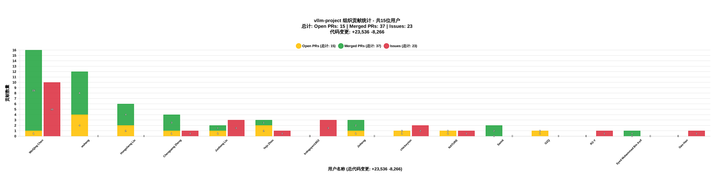

# GitHub Stats Report - vllm-project Organization

Generated on: 2025-08-15 01:14:57 UTC

**统计范围**: vllm-project 组织的所有贡献（PRs, Issues, Commits）

---

这是根据在 **vllm-project** 组织中的总贡献（Merged PRs + Open PRs + Issues + Commits）进行的排序。

总共追踪了 12 个用户在 vllm-project 组织中的贡献情况。

### 👤 WeiQing Chen (@david6666666) - 总贡献: 24

**Pull Requests (4 open, 6 merged)**
| Title | Repository | State | Created |
| ----- | ---------- | ----- | ------- |
| [[Multimodal][Speculative Decoding]Eagle Eagle3 mm support, enablement on qwen2.5vl](https://github.com/vllm-project/vllm/pull/22872) | [vllm-project/vllm](https://github.com/vllm-project/vllm) | `open` | 2025-08-14 |
| [[P/D][NIXL]NixlConnector Reliability Enhancement](https://github.com/vllm-project/vllm/pull/22866) | [vllm-project/vllm](https://github.com/vllm-project/vllm) | `open` | 2025-08-14 |
| [[Performance] EPLB Execution Optimization](https://github.com/vllm-project/vllm/pull/22179) | [vllm-project/vllm](https://github.com/vllm-project/vllm) | `open` | 2025-08-04 |
| [[Bugfix] EPLB load statistics problem](https://github.com/vllm-project/vllm/pull/22167) | [vllm-project/vllm](https://github.com/vllm-project/vllm) | `merged` | 2025-08-04 |
| [[Docs] Update features/disagg_prefill, add v1 examples and development](https://github.com/vllm-project/vllm/pull/22165) | [vllm-project/vllm](https://github.com/vllm-project/vllm) | `merged` | 2025-08-04 |
| [[Doc] Added warning of speculating with draft model](https://github.com/vllm-project/vllm/pull/22047) | [vllm-project/vllm](https://github.com/vllm-project/vllm) | `merged` | 2025-08-01 |
| [[Bugfix] Fix hermes tool parser handling of non-string argument types](https://github.com/vllm-project/vllm/pull/22002) | [vllm-project/vllm](https://github.com/vllm-project/vllm) | `open` | 2025-07-31 |
| [[Docs] add offline serving multi-modal video input expamle Qwen2.5-VL](https://github.com/vllm-project/vllm/pull/21530) | [vllm-project/vllm](https://github.com/vllm-project/vllm) | `merged` | 2025-07-24 |
| [[Bugfix] Fix example disagg_example_p2p_nccl_xpyd.sh zombie process](https://github.com/vllm-project/vllm/pull/21437) | [vllm-project/vllm](https://github.com/vllm-project/vllm) | `merged` | 2025-07-23 |
| [[BugFix] Fix shared storage connector load kv only load attention layer](https://github.com/vllm-project/vllm/pull/21428) | [vllm-project/vllm](https://github.com/vllm-project/vllm) | `merged` | 2025-07-23 |

**Issues (8 total)**
| Title | Repository | State | Created |
| ----- | ---------- | ----- | ------- |
| [[Bug]: EPLB load statistics problem](https://github.com/vllm-project/vllm/issues/21883) | [vllm-project/vllm](https://github.com/vllm-project/vllm) | `closed` | 2025-07-30 |
| [[Feature]: Attention-FFN disaggregation](https://github.com/vllm-project/vllm/issues/21644) | [vllm-project/vllm](https://github.com/vllm-project/vllm) | `open` | 2025-07-26 |
| [[Bug]: After online_serving disagg_example_p2p_nccl_xpyd.sh cleanup, there is a zombie process](https://github.com/vllm-project/vllm/issues/21432) | [vllm-project/vllm](https://github.com/vllm-project/vllm) | `closed` | 2025-07-23 |
| [[RFC]: EPLB Execution Optimization From pr 18343](https://github.com/vllm-project/vllm/issues/20805) | [vllm-project/vllm](https://github.com/vllm-project/vllm) | `open` | 2025-07-11 |
| [[Bug]:DP Crash, After first request, process is crash, 'DPEngineCoreProc' object has no attribute 'dp_rank'](https://github.com/vllm-project/vllm-ascend/issues/1170) | [vllm-project/vllm-ascend](https://github.com/vllm-project/vllm-ascend) | `closed` | 2025-06-11 |
| [[Bug]: deepseek-v2-lite tp=8 ep=8 accuracy is not correct](https://github.com/vllm-project/vllm-ascend/issues/1077) | [vllm-project/vllm-ascend](https://github.com/vllm-project/vllm-ascend) | `closed` | 2025-06-05 |
| [[Bug]: tp4 DeepSeek-V2-Lite, accuracy is error，"text":"....................................................................................................."](https://github.com/vllm-project/vllm-ascend/issues/894) | [vllm-project/vllm-ascend](https://github.com/vllm-project/vllm-ascend) | `closed` | 2025-05-19 |
| [[Bug]: [dp4tp4ep16][DeepSeek-V2-Lite]RuntimeError: InnerRunOpApi:build/CMakeFiles/torch_npu.dir/compiler_depend.ts:281 OPS function error: HcclAllGather, error code is 6](https://github.com/vllm-project/vllm-ascend/issues/886) | [vllm-project/vllm-ascend](https://github.com/vllm-project/vllm-ascend) | `closed` | 2025-05-16 |

**Commits (6 total, +130 additions, -43 deletions)**
| Message | Repository | Date | Hash | +Adds | -Dels |
| ------- | ---------- | ---- | ---- | ----- | ----- |
| [[Docs] Update features/disagg_prefill, add v1 examples and development (#22165)](https://github.com/vllm-project/vllm/commit/289b18e670c2439dfc1f4f80df782de9ad112762) | [vllm-project/vllm](https://github.com/vllm-project/vllm) | 2025-08-07 | `289b18e6` | +25 | -0 |
| [[Bugfix] EPLB load statistics problem (#22167)](https://github.com/vllm-project/vllm/commit/4be02a37767f05a3fd27d66435d5cebea7a9bfe8) | [vllm-project/vllm](https://github.com/vllm-project/vllm) | 2025-08-07 | `4be02a37` | +26 | -41 |
| [[Doc] Added warning of speculating with draft model (#22047)](https://github.com/vllm-project/vllm/commit/49314869887e169be080201ab8bcda14e745c080) | [vllm-project/vllm](https://github.com/vllm-project/vllm) | 2025-08-01 | `49314869` | +4 | -0 |
| [[BugFix] Fix shared storage connector load kv only load attention layer (#21428)](https://github.com/vllm-project/vllm/commit/97d6c30cc965e70579bfdad27e7514592752096e) | [vllm-project/vllm](https://github.com/vllm-project/vllm) | 2025-07-26 | `97d6c30c` | +10 | -2 |
| [[Docs] add offline serving multi-modal video input expamle Qwen2.5-VL (#21530)](https://github.com/vllm-project/vllm/commit/97349fe2bc68de69550787135c1a8c6b85fc8d81) | [vllm-project/vllm](https://github.com/vllm-project/vllm) | 2025-07-26 | `97349fe2` | +64 | -0 |
| [[Bugfix] Fix example disagg_example_p2p_nccl_xpyd.sh zombie process (#21437)](https://github.com/vllm-project/vllm/commit/f8c15c4efb90d3c6aa879e6fa0f5abad9f80b9aa) | [vllm-project/vllm](https://github.com/vllm-project/vllm) | 2025-07-24 | `f8c15c4e` | +1 | -0 |

### 👤 Hongsheng Liu (@hsliuustc0106) - 总贡献: 9

**Pull Requests (1 open, 4 merged)**
| Title | Repository | State | Created |
| ----- | ---------- | ----- | ------- |
| [[Doc] Fix a syntax error of example code in structured_outputs.md](https://github.com/vllm-project/vllm/pull/22045) | [vllm-project/vllm](https://github.com/vllm-project/vllm) | `merged` | 2025-08-01 |
| [[Docs] Fix the example code of streaming chat completions in reasoning](https://github.com/vllm-project/vllm/pull/21825) | [vllm-project/vllm](https://github.com/vllm-project/vllm) | `merged` | 2025-07-29 |
| [[Doc] Added unmentioned required option "method" in the usage of EAGLE-3 based models](https://github.com/vllm-project/vllm/pull/21737) | [vllm-project/vllm](https://github.com/vllm-project/vllm) | `merged` | 2025-07-28 |
| [[Bugfix] [issue-21565] Fix the incompatibility issue with stream and named function calling when Thinking is disabled](https://github.com/vllm-project/vllm/pull/21573) | [vllm-project/vllm](https://github.com/vllm-project/vllm) | `merged` | 2025-07-25 |
| [[Bugfix] Fixed the missing metrics in output](https://github.com/vllm-project/vllm/pull/21444) | [vllm-project/vllm](https://github.com/vllm-project/vllm) | `open` | 2025-07-23 |

**Issues (0 total)**
_No public issues found._

**Commits (4 total, +40 additions, -22 deletions)**
| Message | Repository | Date | Hash | +Adds | -Dels |
| ------- | ---------- | ---- | ---- | ----- | ----- |
| [[Doc] Added unmentioned required option "method" in the usage of EAGLE-3 based models (#21737)](https://github.com/vllm-project/vllm/commit/3a7e3bbdd255b470d37727a31cc0471aa0fe6ecb) | [vllm-project/vllm](https://github.com/vllm-project/vllm) | 2025-08-12 | `3a7e3bbd` | +4 | -0 |
| [[Doc] Fix a syntax error of example code in structured_outputs.md (#22045)](https://github.com/vllm-project/vllm/commit/79731a79f09dc7bbe34dc8afbe8ef2242fb94a05) | [vllm-project/vllm](https://github.com/vllm-project/vllm) | 2025-08-01 | `79731a79` | +1 | -1 |
| [[Docs] Fix the example code of streaming chat completions in reasoning (#21825)](https://github.com/vllm-project/vllm/commit/5c8fe389d6fb2b8776d4113d8334d8dd09f78733) | [vllm-project/vllm](https://github.com/vllm-project/vllm) | 2025-07-30 | `5c8fe389` | +12 | -14 |
| [[Bugfix] [issue-21565] Fix the incompatibility issue with stream and named function calling when Thi](https://github.com/vllm-project/vllm/commit/7656cf4cf32b122cb0bf59a17b97a30e777065e0) | [vllm-project/vllm](https://github.com/vllm-project/vllm) | 2025-07-28 | `7656cf4c` | +23 | -7 |

### 👤 Chenguang Zheng (@fake0fan) - 总贡献: 5

**Pull Requests (2 open, 1 merged)**
| Title | Repository | State | Created |
| ----- | ---------- | ----- | ------- |
| [[Feature] Support Encoder MM Cache: switch cache key from (req_id, input_id) to mm_hash](https://github.com/vllm-project/vllm/pull/22711) | [vllm-project/vllm](https://github.com/vllm-project/vllm) | `open` | 2025-08-12 |
| [[Core] Encoder separation for Encode-Prefill-Decode Disaggregation](https://github.com/vllm-project/vllm/pull/21740) | [vllm-project/vllm](https://github.com/vllm-project/vllm) | `open` | 2025-07-28 |
| [[Bugfix] SharedStorage Connector for V1 PD multimodal](https://github.com/vllm-project/vllm/pull/21611) | [vllm-project/vllm](https://github.com/vllm-project/vllm) | `merged` | 2025-07-25 |

**Issues (1 total)**
| Title | Repository | State | Created |
| ----- | ---------- | ----- | ------- |
| [[RFC]: Prototype Separating Vision Encoder to Its Own Worker](https://github.com/vllm-project/vllm/issues/20799) | [vllm-project/vllm](https://github.com/vllm-project/vllm) | `open` | 2025-07-11 |

**Commits (1 total, +244 additions, -12 deletions)**
| Message | Repository | Date | Hash | +Adds | -Dels |
| ------- | ---------- | ---- | ---- | ----- | ----- |
| [[Bugfix] SharedStorage Connector for V1 PD multimodal (#21611)](https://github.com/vllm-project/vllm/commit/4904e53c3277e92c881bf2a1442805bdc3da983f) | [vllm-project/vllm](https://github.com/vllm-project/vllm) | 2025-07-30 | `4904e53c` | +244 | -12 |

### 👤 Yeju Zhou (@zhouyeju) - 总贡献: 5

**Pull Requests (2 open, 1 merged)**
| Title | Repository | State | Created |
| ----- | ---------- | ----- | ------- |
| [[Bugfix][Apple Silicon] fix missing symbols when build from source on Mac with Apple Silicon](https://github.com/vllm-project/vllm/pull/21380) | [vllm-project/vllm](https://github.com/vllm-project/vllm) | `merged` | 2025-07-22 |
| [dLLM, short for distributed LLM, an easy-to-use tool for multi-node vllm deployment](https://github.com/vllm-project/vllm-ascend/pull/1280) | [vllm-project/vllm-ascend](https://github.com/vllm-project/vllm-ascend) | `open` | 2025-06-18 |
| [[KVConnector][1/N] v1 kvcache connector with the Chariot-DS backend](https://github.com/vllm-project/vllm-ascend/pull/1080) | [vllm-project/vllm-ascend](https://github.com/vllm-project/vllm-ascend) | `open` | 2025-06-05 |

**Issues (1 total)**
| Title | Repository | State | Created |
| ----- | ---------- | ----- | ------- |
| [[RFC]: A developer friendly tool for multi-instance deployment with Ray](https://github.com/vllm-project/vllm/issues/20476) | [vllm-project/vllm](https://github.com/vllm-project/vllm) | `open` | 2025-07-04 |

**Commits (1 total, +1 additions, -1 deletions)**
| Message | Repository | Date | Hash | +Adds | -Dels |
| ------- | ---------- | ---- | ---- | ----- | ----- |
| [[Bugfix][Apple Silicon] fix missing symbols when build from source on Mac with Apple Silicon (#21380](https://github.com/vllm-project/vllm/commit/9094d11c5d74db904dff9e9b1c63da5d73707eeb) | [vllm-project/vllm](https://github.com/vllm-project/vllm) | 2025-07-26 | `9094d11c` | +1 | -1 |

### 👤 wuhang (@wuhang2014) - 总贡献: 4

**Pull Requests (0 open, 2 merged)**
| Title | Repository | State | Created |
| ----- | ---------- | ----- | ------- |
| [[Bugfix] Add log prefix in non-dp mode engine core](https://github.com/vllm-project/vllm/pull/21889) | [vllm-project/vllm](https://github.com/vllm-project/vllm) | `merged` | 2025-07-30 |
| [[Bugfix]check health for engine core process exiting unexpectedly](https://github.com/vllm-project/vllm/pull/21728) | [vllm-project/vllm](https://github.com/vllm-project/vllm) | `merged` | 2025-07-28 |

**Issues (0 total)**
_No public issues found._

**Commits (2 total, +159 additions, -83 deletions)**
| Message | Repository | Date | Hash | +Adds | -Dels |
| ------- | ---------- | ---- | ---- | ----- | ----- |
| [[Bugfix] Add log prefix in non-dp mode engine core (#21889)](https://github.com/vllm-project/vllm/commit/e6680f9e25a433bcd754181705e72034ce6c470c) | [vllm-project/vllm](https://github.com/vllm-project/vllm) | 2025-08-01 | `e6680f9e` | +75 | -81 |
| [[Bugfix]check health for engine core process exiting unexpectedly (#21728)](https://github.com/vllm-project/vllm/commit/bccc43c0332cbd2e9b2cc6f7c83d319062f7cccd) | [vllm-project/vllm](https://github.com/vllm-project/vllm) | 2025-07-28 | `bccc43c0` | +84 | -2 |

### 👤 knlnguyen1802 - 总贡献: 3

**Pull Requests (0 open, 0 merged)**
_No relevant pull requests found._

**Issues (3 total)**
| Title | Repository | State | Created |
| ----- | ---------- | ----- | ------- |
| [[Performance]: Long-Video Inference for Multimodal LLM](https://github.com/vllm-project/vllm/issues/22695) | [vllm-project/vllm](https://github.com/vllm-project/vllm) | `open` | 2025-08-12 |
| [[Feature]:  Multimodal Benchmarking Support (MMLM)](https://github.com/vllm-project/vllm/issues/21887) | [vllm-project/vllm](https://github.com/vllm-project/vllm) | `open` | 2025-07-30 |
| [[RFC]: Reuse multimodal embeddings from encoder cache](https://github.com/vllm-project/vllm/issues/21113) | [vllm-project/vllm](https://github.com/vllm-project/vllm) | `open` | 2025-07-17 |

**Commits (0 total, +0 additions, -0 deletions)**
_No commits found._

### 👤 NATURE (@natureofnature) - 总贡献: 2

**Pull Requests (1 open, 0 merged)**
| Title | Repository | State | Created |
| ----- | ---------- | ----- | ------- |
| [[Bugfix] Enable killing of orphaned EngineCores](https://github.com/vllm-project/vllm/pull/21915) | [vllm-project/vllm](https://github.com/vllm-project/vllm) | `open` | 2025-07-30 |

**Issues (1 total)**
| Title | Repository | State | Created |
| ----- | ---------- | ----- | ------- |
| [[Feature]: Dynamic Chunked Pipeline Parallelism](https://github.com/vllm-project/vllm/issues/20808) | [vllm-project/vllm](https://github.com/vllm-project/vllm) | `open` | 2025-07-11 |

**Commits (0 total, +0 additions, -0 deletions)**
_No commits found._

### 👤 Gamhang (@ahengljh) - 总贡献: 2

**Pull Requests (0 open, 1 merged)**
| Title | Repository | State | Created |
| ----- | ---------- | ----- | ------- |
| [feat(multimodal): Add customizable background color for RGBA to RGB conversion](https://github.com/vllm-project/vllm/pull/22052) | [vllm-project/vllm](https://github.com/vllm-project/vllm) | `merged` | 2025-08-01 |

**Issues (0 total)**
_No public issues found._

**Commits (1 total, +190 additions, -6 deletions)**
| Message | Repository | Date | Hash | +Adds | -Dels |
| ------- | ---------- | ---- | ---- | ----- | ----- |
| [feat(multimodal): Add customizable background color for RGBA to RGB conversion (#22052)](https://github.com/vllm-project/vllm/commit/0a6d305e0f7b63b06c87bb1f7564ae8d148a3311) | [vllm-project/vllm](https://github.com/vllm-project/vllm) | 2025-08-01 | `0a6d305e` | +190 | -6 |

### 👤 Syed Muhammad Bin Asif (@syedmba) - 总贡献: 2

**Pull Requests (0 open, 1 merged)**
| Title | Repository | State | Created |
| ----- | ---------- | ----- | ------- |
| [[Bugfix] Add proper comparison for package versions](https://github.com/vllm-project/vllm/pull/22314) | [vllm-project/vllm](https://github.com/vllm-project/vllm) | `merged` | 2025-08-06 |

**Issues (0 total)**
_No public issues found._

**Commits (1 total, +40 additions, -16 deletions)**
| Message | Repository | Date | Hash | +Adds | -Dels |
| ------- | ---------- | ---- | ---- | ----- | ----- |
| [[Bugfix] Add proper comparison for package versions (#22314)](https://github.com/vllm-project/vllm/commit/609b533cb6f25f599fda94598bba446396498632) | [vllm-project/vllm](https://github.com/vllm-project/vllm) | 2025-08-07 | `609b533c` | +40 | -16 |

### 👤 chickeyton - 总贡献: 2

**Pull Requests (0 open, 0 merged)**
_No relevant pull requests found._

**Issues (2 total)**
| Title | Repository | State | Created |
| ----- | ---------- | ----- | ------- |
| [feature: TTFT Routing](https://github.com/vllm-project/production-stack/issues/583) | [vllm-project/production-stack](https://github.com/vllm-project/production-stack) | `open` | 2025-07-15 |
| [[RFC][FEATURE]: TTFT Routing](https://github.com/vllm-project/vllm/issues/20962) | [vllm-project/vllm](https://github.com/vllm-project/vllm) | `open` | 2025-07-15 |

**Commits (0 total, +0 additions, -0 deletions)**
_No commits found._

### 👤 GZQ (@Gongzq5) - 总贡献: 1

**Pull Requests (1 open, 0 merged)**
| Title | Repository | State | Created |
| ----- | ---------- | ----- | ------- |
| [A developer friendly tool for multi-instance deployment with Ray Implementation](https://github.com/vllm-project/vllm/pull/20761) | [vllm-project/vllm](https://github.com/vllm-project/vllm) | `open` | 2025-07-10 |

**Issues (0 total)**
_No public issues found._

**Commits (0 total, +0 additions, -0 deletions)**
_No commits found._

### 👤 R2-Y - 总贡献: 1

**Pull Requests (0 open, 0 merged)**
_No relevant pull requests found._

**Issues (1 total)**
| Title | Repository | State | Created |
| ----- | ---------- | ----- | ------- |
| [[Bug]: PP+PD NixlConnector failed](https://github.com/vllm-project/vllm/issues/22430) | [vllm-project/vllm](https://github.com/vllm-project/vllm) | `open` | 2025-08-07 |

**Commits (0 total, +0 additions, -0 deletions)**
_No commits found._

